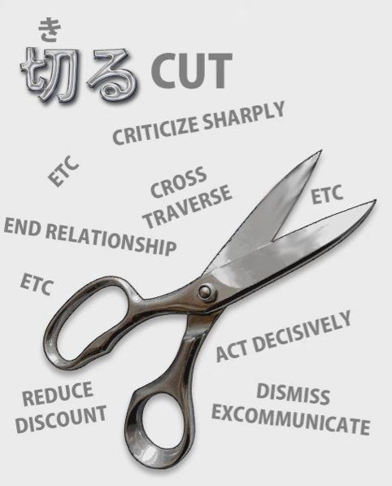
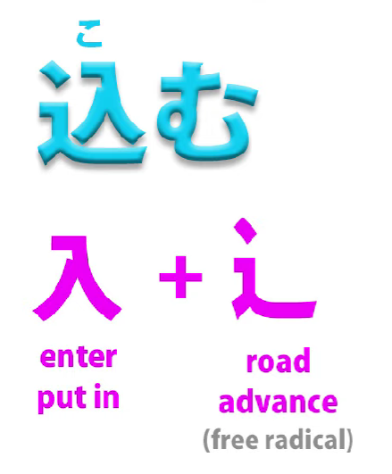
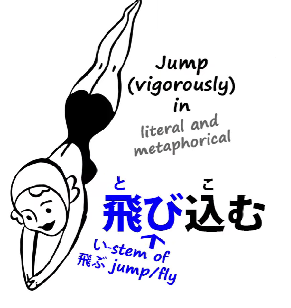

# **57. 込む (Komu) and the secret of multi-meaning Japanese words**

[**込む Komu and the secret of multi-meaning Japanese words | Lesson 57**](https://www.youtube.com/watch?v=31xnxSFUCiw&list=PLg9uYxuZf8x_A-vcqqyOFZu06WlhnypWj&index=59&pp=iAQB)

こんにちは。

Today we're going to talk about one word in particular that has a lot of different meanings in different contexts and can be attached to other words.

But, more than that, we're going to talk about how this kind of word works and how we can understand them.

We often see in dictionaries words that have a whole range of different and apparently unconnected meanings.

I'm not talking about homophones here, where the kanji are different.

They may not be related, though they sometimes are.

But I'm talking about words that actually are the same word

but have a range of different meanings.

And in these cases the important thing to understand

is that normally there's going to be a base, concrete meaning

and then from that a number of metaphorical meanings.

And this isn't just a side issue with human language.

Human language, whenever it discusses abstraction,

uses words that are based in concrete, physical metaphors.

And we may sometimes forget the concrete, physical metaphors,

but they're always there.

Even when we talk about time, we have to talk about it in terms of space.

We talk about time <code>going forward</code> or <code>going backward</code>.

We talk about a time <code>line</code> -- a line is an entity that exists in space.

We can't actually discuss time without discussing it in terms of space.

And this continues with all other abstractions in human languages.

The word <code>focus</code> originally means a <code>hearth</code>.

People used to sit around the hearth fire

and that would be at the center, the focus of their activity.

And from that physical metaphor come all the extended

and abstract meanings of the word <code>focus</code>.

The word <code>stimulus</code> originally meant an <code>ox-goad</code>,

a pointed stick that you would drive oxen along with.

And from that come all the abstract meanings of <code>stimulus</code>.

<code>Politics</code> comes from a word that simply means <code>city</code>.

<code>Economics</code> comes from a word that simply means <code>house</code>.

Now, we don't need to know the physical metaphors on which words like this are based,

but when we come across words in Japanese that seem to have different and contradictory meanings, we do need to understand the basic metaphor

in order to grasp the other meanings

without learning them as a long laundry-list of apparently random things.

So, if we see the word <code>切る</code> in a dictionary -- which means <code>cut</code> --

we see lots and lots of meanings for it like <code>ending a conversation</code>,

<code>severing a relationship</code>, <code>crossing a field</code>.

And all of these just come from the basic meaning of <code>cut</code>.

Even in English we talk about <code>cutting across a field</code>.

Now, that's easy enough, so long as we understand the principle,

with a word like <code>cut</code>, where we have a very definite,

clear-cut (if I may say so) equivalent in English.

But when we come to words which don't have an exact English equivalent,

it can get a bit harder unless we understand what they mean.

And one of those words, which we're going to see

everywhere in Japanese, is the word <code>込む</code>.

## 込む

Now, <code>込む</code> does not have an exact meaning in English,

but we can see what it does mean by looking at the kanji.

The kanji is essentially the kanji of <code>入る / 入る / 入れる</code>  
-- <code>go in</code> or <code>put in</code> -- and that's on a <code>road</code>.

It's a road that some people call <code>the water slide</code>.

I always see it as a <code>fast road</code>

and that's exactly what's going on here.

It's "putting in on a water slide / putting in on roller skates /

cramming in in large quantities / putting in rapidly / putting in vigorously".

That's what <code>込む</code> means.

Now, we may encounter it first of all in very simple, concrete meanings

such as <code>込んでいる</code>, the state of being <code>込む</code>,

and that means <code>crowded</code>:

a lot of people crammed into the same space, crowded.

Now, it can have more abstract meanings like <code>complicated</code>,

which is essentially the same: a lot of ideas, a lot of concepts,

crammed into the same mental space, that's a complication.

### 飛び込む

And then it becomes attached as a helper verb to the i-stem of other verbs.

So we have <code>飛び込む</code>, which means <code>jump in</code>.

It can mean literally jump into the water or something,

but it can also mean jumping vigorously into a conversation, a situation,

or any of the other metaphorical uses of <code>jumping in</code>.

### 黙り込む

It can become more abstract, with concepts like <code>黙り込む</code>.

<code>黙る</code> means to <code>be silent</code>.

<code>黙り込む</code> means to <code>be quiet</code> about something / <code>clam up</code> about something,

in other words, be quiet and keep everything 込む-ed up inside oneself,

not letting anything out.

### 読み込む

Now, the word <code>読み込む</code> is one that you'll see often

if you have your computer or your tablet or whatever in Japanese.

(And if you haven't, why not?)

You'll often see the word come up <code>読み込み中</code>.

Now, <code>-中</code> means <code>in process of</code>.

It means literally <code>in the middle of</code> -- another metaphor,

because literally it means <code>middle</code> or <code>center</code> or <code>inside</code>.

But in this case, when it's attached to a verb like this,

<code>中</code> means <code>in the process of</code>.

As we might say in English, <code>in the middle of doing something</code>.

<code>読み込み中</code> is <code>being in the process of 読み込む-ing</code>,

and <code>読み込む</code> here means <code>loading</code>.

It means <code>reading and cramming in</code>:

reading data and putting it into memory.

But the word has various other meanings, and while they are different,

they're all based on the same fundamental metaphor.

So <code>読み込む</code> can mean reading something several times, reading it thoroughly.

<code>込む</code> can mean doing something repeatedly,

because again it's cramming in iterations of doing it,

cramming in reps, you might say.

But it can mean reading thoroughly, it can mean reading repeatedly,

in any case it means cramming the subject matter into your mind.

And again, <code>読み込む</code> can mean reading something into something:

somebody says something or you see a text,

and you put in extra meaning which you believe to be there.

And very often it is. Texts can have implications.

Reading something into something again can be <code>読み込む</code>.

And again it's a very obvious and natural use of the metaphor.

And once again, <code>読み込む</code> can mean

reading poetry or something with feeling, with emotion.

You're not just reading it; you're putting something into it,

you're putting in the emotion, you're cramming it with something,

with emotion, with feeling, with expression.

So, all these meanings of <code>読み込む</code> are different

and yet all of them essentially conform to the same metaphor:

read and cram something in.

### 思い込む

Now, another common compounded verb with <code>込む</code> is <code>思い込む</code>.

Now, the most common use of that, I would say,

is to <code>be under the impression / to be convinced of</code> something,

usually something that turns out not to be true, but that doesn't have to be the case.

So, <code>思い</code> is <code>thought</code> and <code>込む</code> is <code>cramming in</code>,

so you have this thought crammed in, or this set of thoughts crammed into your mind.

Whether they're true or not, they're in there, they're lodged in your mind.

And, interestingly, in older English, people sometimes used to talk about <code>cramming</code> someone,

meaning filling them up with wrong ideas, giving them false impressions,

cramming into their mind a particular set of ideas which would generally not be correct,

at least in the opinion of the speaker.

So <code>思い込む</code> in that sense usually means

having a strong impression, a strong belief, a strong notion

that something is the case that probably in fact isn't.

But <code>思い込む</code> can mean other things as well.

It can mean <code>being in love</code> and it can mean <code>having one's heart set</code> on something.

And in order to understand that, we need to know

a little more about the word <code>思い</code>, which,

as I pointed out toward the end of another video,

doesn't necessarily just mean <code>thought</code> or <code>feeling</code>.

It can also mean <code>love</code> or <code>desire</code>.

So, for example, the word <code>片思い</code> means <code>one-sided love</code>.

<code>片</code> generally means <code>side</code> or <code>direction</code>

and <code>片思い</code> is <code>one-sided or one-directional love / unrequited love</code>.

So <code>思い</code> there is being used in the sense of <code>love / affection / desire</code>.

So <code>思い込む</code> can mean <code>being in love</code>.

It can also mean <code>having one's heart set on something</code>,

and that doesn't necessarily mean loving a person.

It could mean having one's heart set on going on a picnic, or anything.

The point here is that <code>思い</code> in the sense of desire and love is crammed into one.  
It's not just a passing whim, it's something that one's whole heart is set on,  
something <code>crammed in</code>.

---

We'll come across a few other meanings of <code>込む</code> too, especially when it's used,  
as it very often is, as a helper verb put onto the い-stem of another verb.

But once we understand this point, that it's to do with cramming,

that it's to do with filling, that it's to do with thoroughness,

completeness, or with locking away,

then we can understand how these other words

are going to work when we hear them.

::: info
there is this one interesting* [**comment**](https://www.youtube.com/watch?v=31xnxSFUCiw&lc=Ugx7rl5ZlBI3QADLH3R4AaABAg&ab_channel=OrganicJapanesewithCureDolly)*. Shame we can’t hear Dolly’s thoughts on it :{
:::