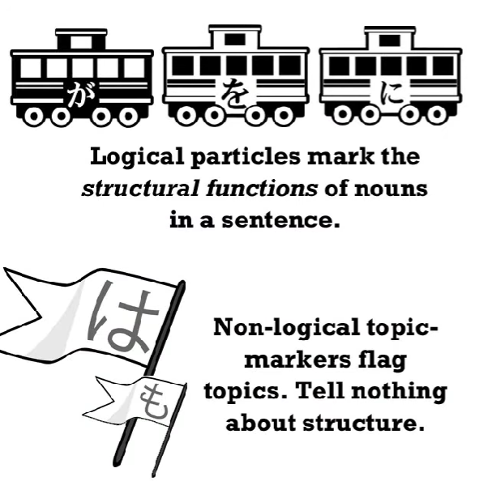
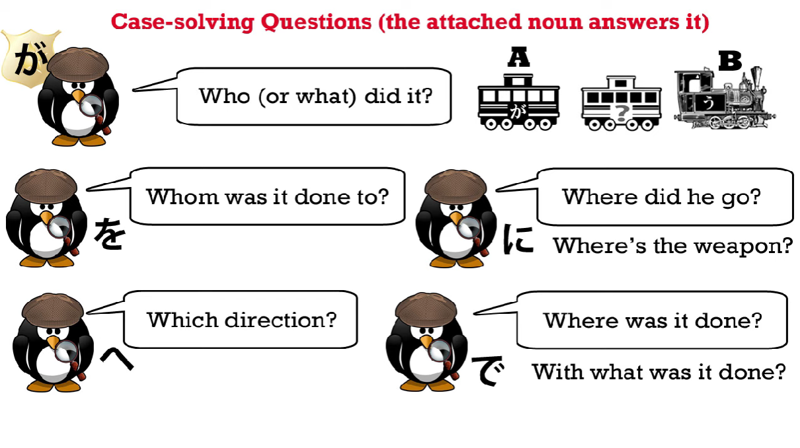
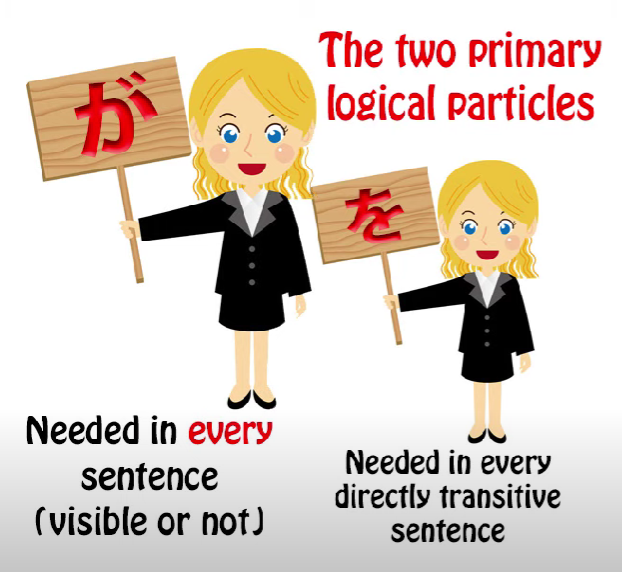
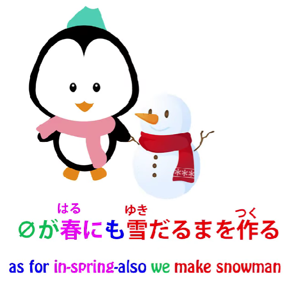
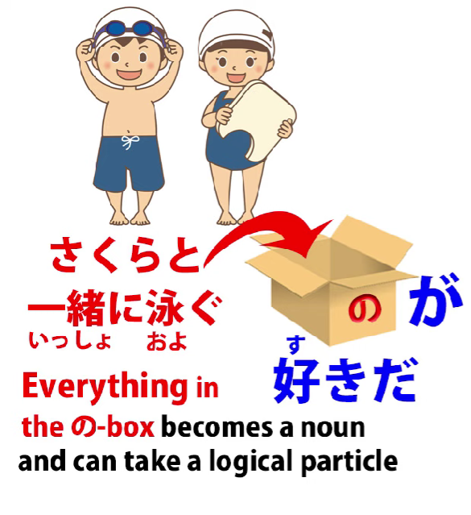

# **58. Japanese double particles. How they work**

[**Japanese double particles. How they really work | lesson 58: Particle Combinations**](https://www.youtube.com/watch?v=iPiLVZoYhfM&list=PLg9uYxuZf8x_A-vcqqyOFZu06WlhnypWj&index=60&pp=iAQB)

こんにちは。

Today we're going to talk about <code>combined particles</code> or <code>double particles</code>

or whatever silly names the textbooks and Japanese grammar sites call them by.

And I'll explain in just a moment why I'm calling them <code>silly</code>.

What I'm referring to is particles in combinations

like <code>には</code>, <code>にも</code>, <code>-とは</code>, <code>のが</code> etc.

And if you look at the sites you'll find lots of rules like

<code>you can use に with は and も, but you can't use it with が or で</code>;

<code>you can use -と with this, but not that</code>, and so on.

And you don't need to learn any of these rules.

If you understand what's going on and why it's happening,

it all makes complete logical sense.

There are no random rules happening here, just straightforward logic.

The reason it gets so confusing in English-language so-called Japanese grammar

is because they're not just giving the wrong answers.

They're giving the wrong answers to the wrong questions.

They're posing questions that should never have been posed in the first place.

**There's really no such thing as a <code>double particle</code> or a <code>combined particle</code>.**

What's happening all the time is that  
the particles are just doing their job the way they always do.

So what about all these random rules

about when they can do it and when they can't?

Well, all these are actually based on what the particles are and what they actually do.

So, the first distinction to make, that the textbooks and websites never make,

is the distinction between logical and non-logical particles. This is absolutely crucial.

## Logical & non-logical particles

So, let's start by looking at the five main logical particles.

These are the particles that tell us what's going on in the sentence.

They mark each noun with the role it plays in the sentence, whether it's the person doing something, the thing that's being done, the thing it's being done to, the place where it's being done, etc. etc.

Now, the first obvious thing to understand is that you can't combine

any of these five logical particles with any of the others.

Why not?

Because of what they do.

They mark each noun with its function in the sentence.

A noun can't actually be more than one part of speech at the same time,

so it would just make no sense at all  
to combine any of these five together with each other.

---

But what you can combine them with is non-logical particles,

notably the two non-logical topic markers, は and も.

You can combine these because they don't clash logically.

は and も don't tell us anything about what a noun is doing in the sentence.

It's only ever marking that thing as a topic, either to make it the topic of the sentence

or to make it a sub-topic for strategic reasons, which we'll talk about in a moment.

## Primary & secondary particles

Now, the next thing to know is that the two primary particles,

or the primary and secondary particle, that is,

**が and を, don't combine with non-logical particles.**

Why don't they?

Well, が is the primary particle:

it has to be in every sentence of every kind;

を is the secondary particle: it marks the direct object.

This means that in any sentence that is directly transitive,

を has to be present, whether we can see it or not.

---

Now, what do I mean by directly transitive?

All the textbooks and the dictionaries confuse transitivity

with Japanese self-move and other-move verbs.

And in a way this is understandable,

because there's a large overlap between the two.

**But they aren't the same thing.**

So let's look here at what we mean by actual transitivity.

If I say <code>I walk</code>, <code>I sing</code>, <code>I eat</code>, those are all intransitive because I'm doing the verb

and I'm not doing it to anything else.

It has no direct object.

If I say <code>I sing a song</code> or <code>I read a book</code> or <code>I eat bread</code>,

then this is transitive because the verb has a direct object.

Now, when I say <code>directly transitive</code>,  
what I mean is verbs that are done directly to an object.

So, for example, I can say <code>I talk to Sakura</code>

but in English, as you see, we have to have a preposition there.

We're not saying <code>I talk Sakura</code>, so we're not directly transitive,

we're indirectly transitive through the medium of a preposition.

Now, Japanese has the same distinction.

We **don't** say <code>さくらを話す</code>,

which would be the equivalent in English of <code>I talk Sakura</code>.

We say <code>さくらと話す</code> or <code>さくらに話す</code>.

Now, please don't run away from this with the idea that

particles like に and -と are the same as English prepositions.

They're not.

If you're going to compare them to anything in European languages,

you have to compare all the logical particles

to the German or Latin case structures.

You may not know what those are and you don't need to,

because I model these in ways that don't require

knowledge of European grammar.

But the point here is that they're not prepositions,

but for our purposes here we can say that they're used under the same circumstances

that prepositions get used in English.

So if we say <code>I eat bread</code>, that's directly transitive.

If we say <code>I talk to Sakura</code>, that's indirectly transitive.

In Japanese, if we use the を particle, it's directly transitive.

If we use another particle, like -と or に, it's indirectly transitive.

In some cases English and Japanese will disagree

about what is directly transitive and what's indirectly transitive,

but an awful lot of the time they're in fact in agreement

because these are fairly basic factors of human communication.

---

Now, the point here is that these two direct particles --

if we say <code>I hit Sakura</code> there are no prepositions anywhere. This is completely direct.

I do the hitting and I'm hitting something, I'm hitting Sakura.

I'm not hitting to Sakura or hitting at Sakura or hitting by Sakura.

I'm directly hitting Sakura.

Now, because of the directness of these two particles

they can't have a non-logical particle appended to them.

So, if you want to use a non-logical particle here, you can do it.

But the way you do it is always by simply attaching the non-logical particle

**and leaving the logical particle out**.

And because these are so fundamental to every sentence,

they can be understood by the hearer in Japanese.

So, if we say <code>さくらはなぐった</code>-- <code>I hit Sakura</code> --

this means <code> *(zeroが)* さくらは**zeroを**なぐった</code>,

**but we don't say <code>さくらはをなぐった</code> or <code>さくらをはなぐった</code>.**

Because you can't put anything between these two direct fundamental logical particles

and the thing they directly connect to.

So now we understand the basis for practically all

the strange rules that you're going to hear about.

You just need to remember these two facts:

**you can't pair one of these main five logical particles with any of the other four**

and  
**you can't put a non-logical particle before or after the two primary particles が and を.**

Now, once we know that, what have we got left and how does it work?

We can pair non-logical particles with any of the remaining logical particles.

And the reason we're doing this is not to make

some kind of weird, unusual pair-combination.

We're simply using the functions of both at the same time.

So the most straightforward thing we do here is simply make something into a topic.

If we say <code> *(zeroが)* 冬には雪だるまを作る</code>, we're saying <code>In the winter we make a snowman.</code>

Now, we could say <code> *(zeroが)* 冬に雪だるまを作る</code>.

**We don't have to have the は there.**

So why would we choose sometimes to have a は there?

Well, in this case we're making it the topic of the sentence.

We're saying <code>here's winter/speaking of winter, this is what we do.</code>

And it also plays the other roles that は always plays  
as an extension of its topic-making nature.

And I've done [**a video**](https://www.youtube.com/watch?v=9l_ZlQQU4ZE&ab_channel=OrganicJapanesewithCureDolly) on these multiple uses of は,

so if you're not familiar with this, please take a look at it,

because it's rather important for understanding what's going on here.

So, we're making a topic out of the winter and

we're also differentiating winter from other seasons.

We're saying <code>冬には</code> --  
<code>As for winter, as opposed to the other seasons, we make a snowman.</code>

Now, if the person you were talking to was someone

from a very, very cold place, they might say

<code> *(zeroが)* 春にも雪だるまを作る</code>.

So what they're saying is <code>We make a snowman in the spring as well.</code>

So we can use the exclusive particle は or the inclusive particle も.

And both of them add that degree of meaning.

Now why do we have the に here?

Because we actually need the に.

**We need the に to mark the fact that we're doing an activity at a particular time.**

This is the logical function of に.

And having done that, we can also make a topic out of it.

And that's simply what we're doing here.

In other cases we might say <code>明日学校に行く</code>

and that simply means I'm going to school.

If we say <code>明日学校には行く</code>, the implication is that we're going to school but we're not going somewhere else that they thought we might be going.

If we say <code>明日学校にも行く</code>, we're saying I'm going to school as well as somewhere else that you already know about.

So you see, in each of these cases our non-logical particle

is simply adding meaning to the logical particle that's already there.

They don't clash, because one is logical and the other is non-logical,

so they're not telling us conflicting information.  
**They're telling us complementary information.**

And that's why you can use them that way and why

you can't combine one logical particle with another logical particle

or one non-logical particle with another non-logical particle.

---

Now, there are other particles that can pair with other particles,

but again, this whole pairing concept is the wrong way of looking at it.

As always the particles are simply doing what they do.

For example, the の particle, if it's the nominalizing の,

the の that turns something into a noun,

so, for example, <code>泳ぐの</code> is <code>swimming</code>,

**the noun** <code>swimming</code>, the activity called <code>swimming</code>.

We can say <code>泳ぐのが好きです</code>.

We can say <code>泳ぐのをします</code>.

**You can combine any logical particle with の because that kind of の turns the thing before it into what is effectively a noun, and a noun can take any of the logical particles.**

It could be a longer logical clause:

<code>さくらと一緒に泳ぐのが好きだ</code> --

<code>I like swimming together with Sakura</code>. / **Sakura together with swimming pleasing is.**  
::: info
gave a bit more literal translation just in case, 好き is an adjectival noun. Go by Dolly tho.
:::

But the point is that once you've put that nominalizing の onto the end of it,

**when it's the の that turns something into a noun, you then treat it as a noun**.

And what do you do with a noun?

You put a logical particle onto it, don't you?

So, this is simple logic.

If you have any questions or comments, please put them in the Comments below

and I will answer as usual.

I'd like to thank my Gold Kokeshi patrons,

and all my patrons and supporters on Patreon and everywhere.
