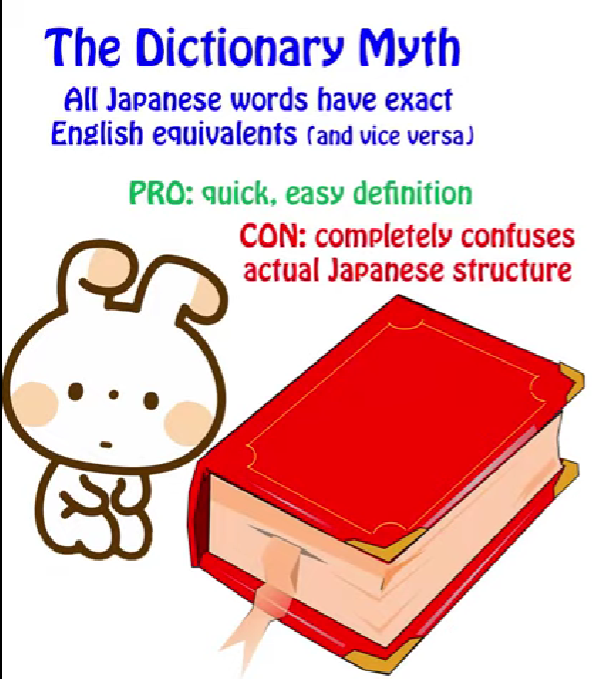
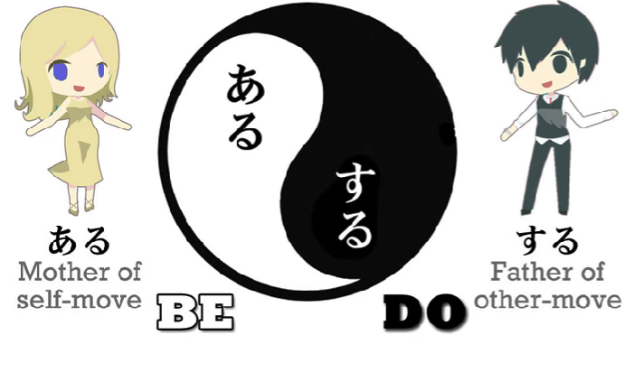
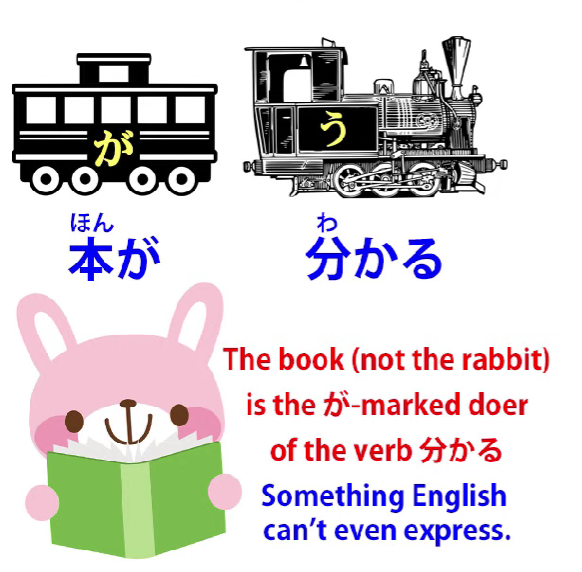
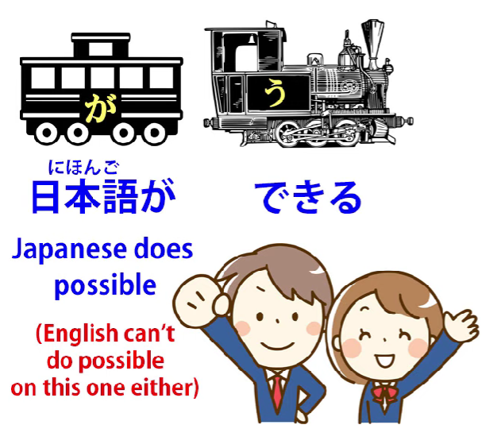
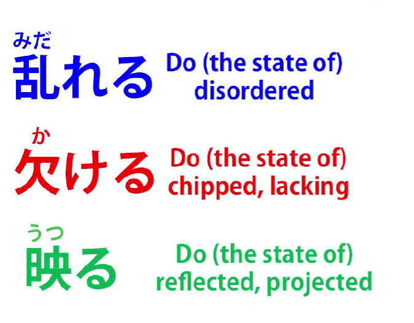
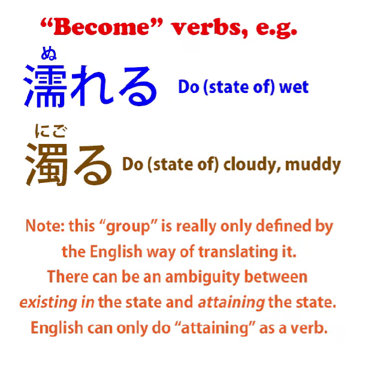

# **59. Untranslatable Japanese exists! How to understand it**

[**Untranslatable Japanese exists! How to understand it | Lesson 59**](https://www.youtube.com/watch?v=wLrK_YxdPoM&list=PLg9uYxuZf8x_A-vcqqyOFZu06WlhnypWj&index=61&pp=iAQB)

こんにちは。

Today we're going to talk about something

that makes quite a range of Japanese sentences

difficult for English learners to understand.

And that is something that I call

<code>the problem of passivity in Japanese</code>.

And I'm not talking here about the so-called Japanese passive,

which is actually the receptive helper verb.

That's a problem because of the tendency to call it passive when it isn't,

but there are actually several Japanese constructions that go deeper than this

and cause problems by being regarded and translated as passive

even though they're not actually called passive.

And this matters because if we see them as being passive, then we're going to misunderstand the sentences, we're not going to understand why the logical particles are in the places that they are and, especially with more complex sentences,  
we're just not going to be able to work out what's going on at all.

Now, as I've said before,

there is not any actual passive voice in Japanese,

but something to consider here is that

there is something that we can call

the passive nature of Japanese as a whole.

And this has nothing to do with the grammatical

passive voice as it exists in English.

This is more of a philosophical than a grammatical passivity.

And by <code>passive</code> here I simply mean the opposite of active.

As I've explained before, the Adam and Eve of Japanese verbs are <code>ある</code> and <code>する</code>,

<code>ある</code> meaning <code>be</code> and <code>する</code> meaning <code>do</code>.

And while we call them the <code>Adam and Eve</code>,

we should really refer to them as the <code>Eve and Adam</code>,

because there is a tendency in Japanese to regard <code>being</code> as prior and primary to <code>doing</code>, whereas English tends to think of things the other way around.

It tends to be activist in nature.

And there are a whole range of Japanese verbs

which depict not actions as we understand them

but states of being which are regarded grammatically

as if they were in fact actions.

And again, understanding that this is the case is

vitally important to understanding how sentences work.

And we can start this off with something that isn't

in fact usually translated as passive but would

be a little bit better if it were translated as passive

and that is something we've looked at already in another context,

which is that if we say <code>本が分かる</code>,

this gets translated into English as <code>I understand the book</code>

and it doesn't mean that at all, because as we can see

the book is the が-marked subject of the sentence.

So it's the book that's doing something, not me. I'm not doing anything.

And in fact it does much less violence to the structure

of the sentence if we translate it as

<code>The book is understandable (to me)</code>.

This is almost what the Japanese is saying.

The book is the subject and it's the book that's actually doing the action.

The reason <code>The book is understandable to me</code>

is not a perfect translation is because, as you can see,

this is not in fact an A-is-B sentence.

So we shouldn't be saying

<code>The book is understandable (to me).</code>

What we have to say to get the Japanese right is

<code>The book **does** understandable (to me).</code>

And of course that makes no sense at all in English because in English <code>being understandable</code> is regarded as a state.

But in Japanese it's regarded as an action, what we might call a <code>stative action</code>,

a being-kind of action, like <code>being</code> itself.

Even in English we can say that something <code>exists</code>.

But generally speaking, English requires things

to be jumping about doing something in order

to say that they're taking any kind of action.

But in Japanese the action of existing in particular states is often expressed by a verb.

And this is important because it extends to a whole range of Japanese words, to できる

and to any verb which has the potential helper attached.

So if we say <code>日本語ができる</code>

it gets translated as <code>I can do Japanese</code> or <code>I can speak Japanese</code>, which is even stranger

because there's no <code>speak</code> in there and what it's actually saying is that

<code>Japanese is possible (to me)</code>, but again this is an A-is-B construction

when in fact this is really an A-does-B sentence.

What it's saying is <code>Japanese **does** possible (to me)</code>.

Now, this may seem like a bit of a quibble, but

it's not a quibble because the particles, the structure,

the entire framework of the sentence is different.

And in simple sentences like this it may not be very important

but as sentences become more complicated, this whole issue becomes more important

because we start to run into sentences that are quite impossible to understand

unless we recognize what their actual structure is.

---

And there is a whole range of verbs that refer to what in English would be called states.

And in these cases the English translations are always passive.

And they have to be passive, because there really isn't a way, another way of saying them in English.

For example, <code>乱れる</code> -- to be scattered or disordered;

<code>欠ける</code> -- to be chipped or damaged or insufficient;

<code>映る</code> -- to be reflected or projected.

Each of those, as you see, I've translated with the English passive

because it's the only way to translate them into natural English.

**But they're not in fact passive in Japanese.**

These are regarded as actions done by

-   the thing which is disordered,

-   the thing which is damaged,

-   the thing which is reflected.

So if there's no alternative to translating them

as passive, aren't we justified in doing so?

And the answer to that is, yes of course we are absolutely justified in doing so if what we're trying to do is tell someone who doesn't know Japanese and isn't learning Japanese what is being said or, more accurately, what would be being said by an English speaker in the same circumstance.

But if, as learners of Japanese, we don't know what the sentence is actually doing,

we're going to get ourselves into an awful tangle.

We're going to look at sentences and wonder what they mean and if we try to make our own sentences we just won't be able to do it because we'll be looking for passive constructions, we'll be trying to build sentences according to principles that we haven't been introduced to and don't understand.

**So the thing to understand here is that in Japanese verbs can and often do represent**

**what in English can only be expressed as either states of being or passive actions.**

---

And then there is another group of verbs which is closely related in type to this in which

they get translated as <code>becoming</code> a particular thing:

<code>濡れる</code> -- to become wet;

<code>濁る</code> -- to become cloudy or muddy.

Again, in Japanese this isn't talked about as <code>becoming</code> anything.  
It's simply an action in itself.

If we wanted to find a way of putting it in English

we'd have to invent a word like <code>muddify</code> or <code>cloudify</code> or <code>wetiniflicate</code>,

but in fact of course these words don't exist in English.

**And the key to understanding them in Japanese is not to try to translate them into English but to see how they're actually working in the Japanese**

**and to be aware that one-for-one translations are not possible in these cases.**

And these becoming words like <code>濁る</code> or <code>濡れる</code> can also be used in the continuous present to get us back to our passive states that we had with the other words.

So, say, <code>濁ている</code>: we're saying what in English can only be translated as to <code>be cloudy</code>,  
but in Japanese, again, it's to <code>exist in a state of cloudiness</code>.

So this is quite a simple and straightforward issue, but it's very important  
that we absorb and understand this principle or we're going to have a lot of trouble

with a whole range of Japanese expressions..
