# **6. Adjectives**

[**Lesson 6: Japanese <code>Adjectives</code> - the real secret that makes them easy. What schools never teach.**](https://www.youtube.com/watch?v=iyVZlaEqU24&list=PLg9uYxuZf8x_A-vcqqyOFZu06WlhnypWj&index=6)

こんにちは。

Today we are going to talk about adjectives. Now, Japanese adjectives are not the same thing as English adjectives. As we know, Japanese sentences come in three fundamental kinds, depending on the kind of engine they have.

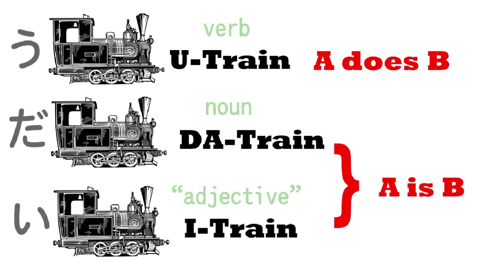

We have the う-Train, verb sentences; the だ-Train, noun sentences; and the い-Train, which is the so-called adjectival sentences. **But the truth is that any one of the three kinds of engine can be used like an adjective.**

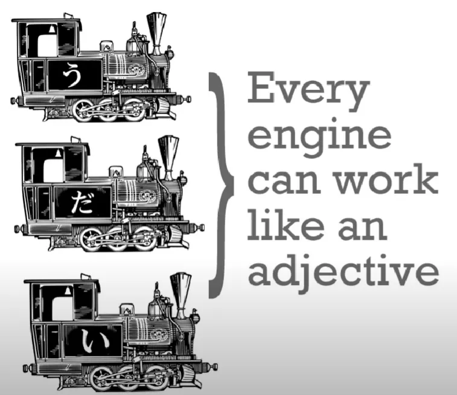

So let's start off with the most obvious one, the one that's called <code>adjective</code> in English.

## い-train adjectives

A simple い-Train sentence is <code>ペンがあかい</code>. As you know, <code>あかい</code> doesn't mean <code>red</code>, it means <code>is-red</code>.

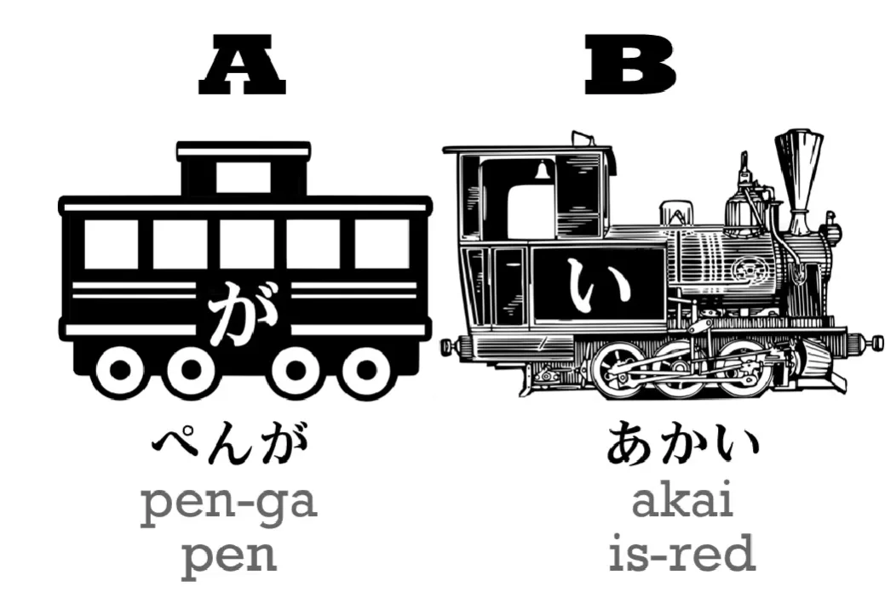

Now, we can turn this black engine white and put it behind the pen. Now we have <code>あかいペンが</code>.

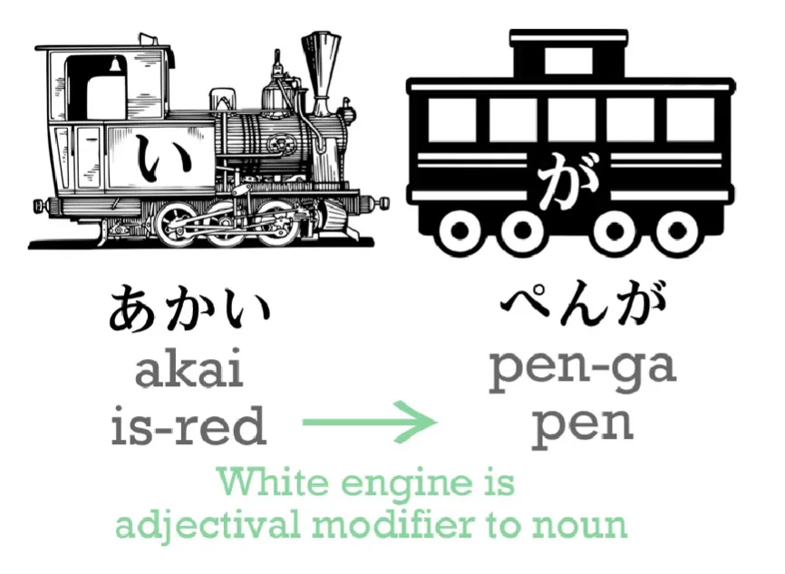

<code>あかいペン</code> means <code>is-red pen</code> or, as we say in English, <code>red pen</code>. As you see, **this isn't a full sentence in itself any more because a white engine doesn't pull the train, it just tells us more about whatever it is sitting behind.**

So <code>あかい</code>, once it becomes a white engine, is just telling us more about the main car of the sentence, which is <code>ペン</code>. And if we want to make it into a full sentence, we have to have a new engine. So, let's take <code>ちいさい</code>, which means <code>is-small</code>.

<code>あかいペンがちいさい</code> – <code>The red pen is small</code>. *(or I guess <code>is-red pen is-small</code>)*

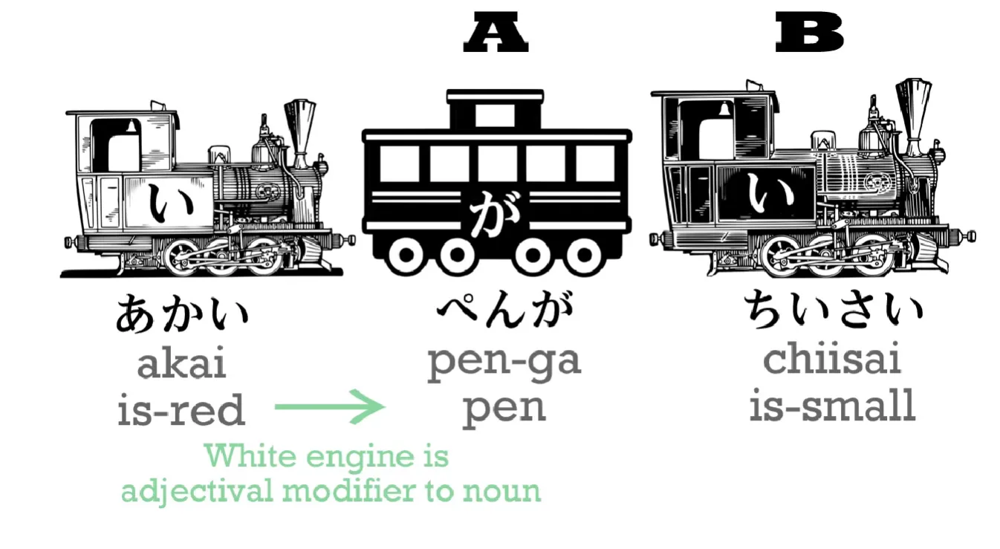

So that's simple enough.

## Using verbs like adjectives

Now let's look at verbs. Now, if you're worrying about な-adjectives, as they are called, don't worry. **They are nouns**, and we'll get to them in a minute. **Any う-Engine, any verb, in any tense, can be used like an adjective.**

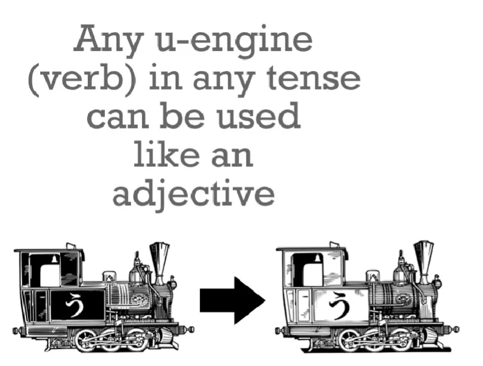

So, we can say, <code>しょうじょがうたった</code>. <code>歌った/うたった</code> means <code>sang</code>. The word for sing is <code>うたう</code>, so the た-form, as we know from our last lesson, is <code>うたった</code>.

<code>しょうじょがうたった</code> – <code>The girl sang</code>,

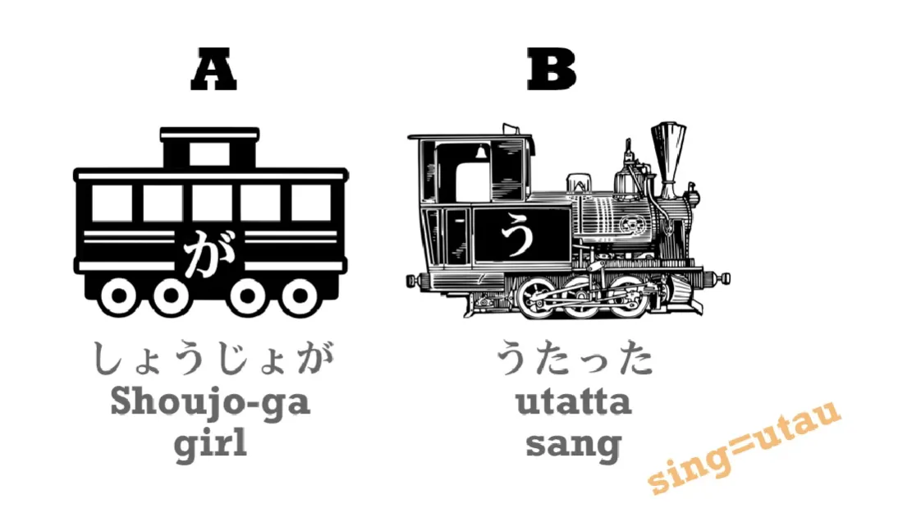

and if we turn that engine white and put it behind the girl, we have <code>うたったしょうじょ</code> – <code>the girl who sang</code>.

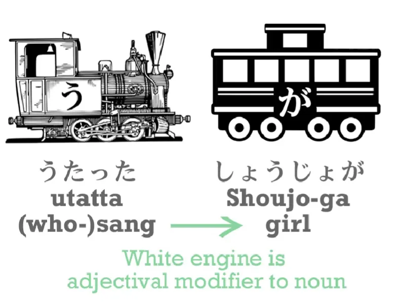

And of course, once again this isn't a sentence. But we can put in into any sentence we like, such as <code>うたったしょうじょがねている</code> – <code>the girl who sang is sleeping</code>.

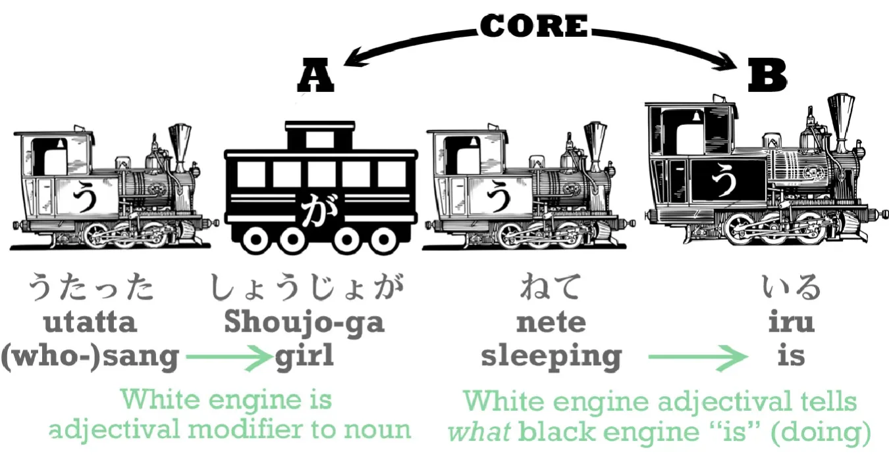

**And this is terribly important because a lot of Japanese is structured this way. We can use entire verb-sentences as adjectivals if we want to, and this happens very often.**

For example, <code>いぬがじしょをたべた</code> – <code>the dog ate the dictionary</code>.

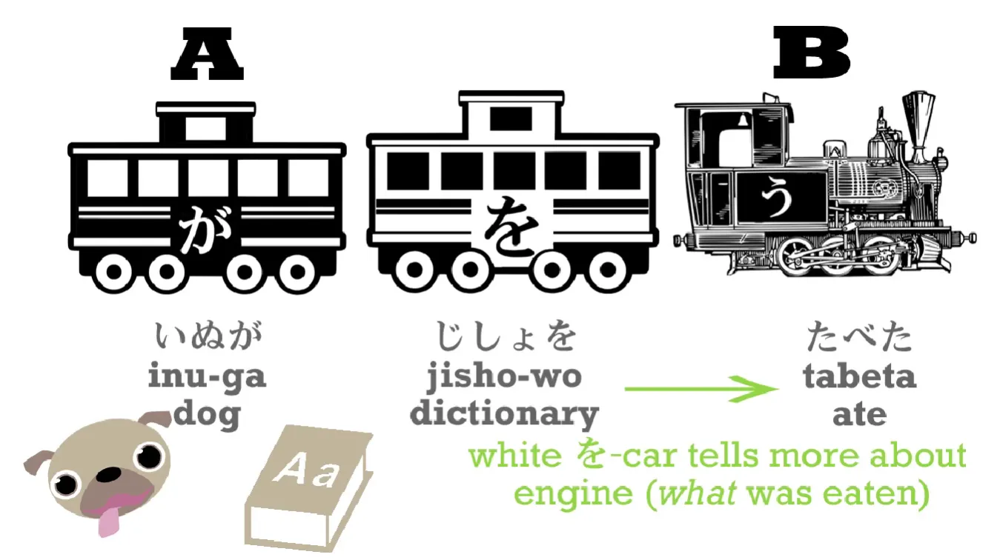

We can turn this around to <code>じしょをたべたいぬが</code> – <code>the dog who ate the dictionary</code>.

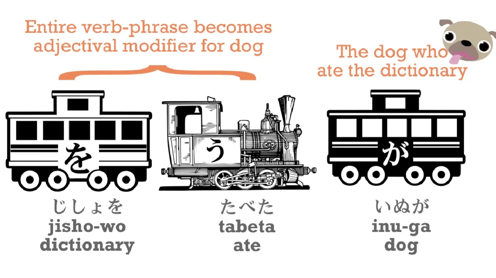

Or we can say, <code>いぬがたべたじしょ</code> – <code>the dictionary that was eaten by the dog</code>.

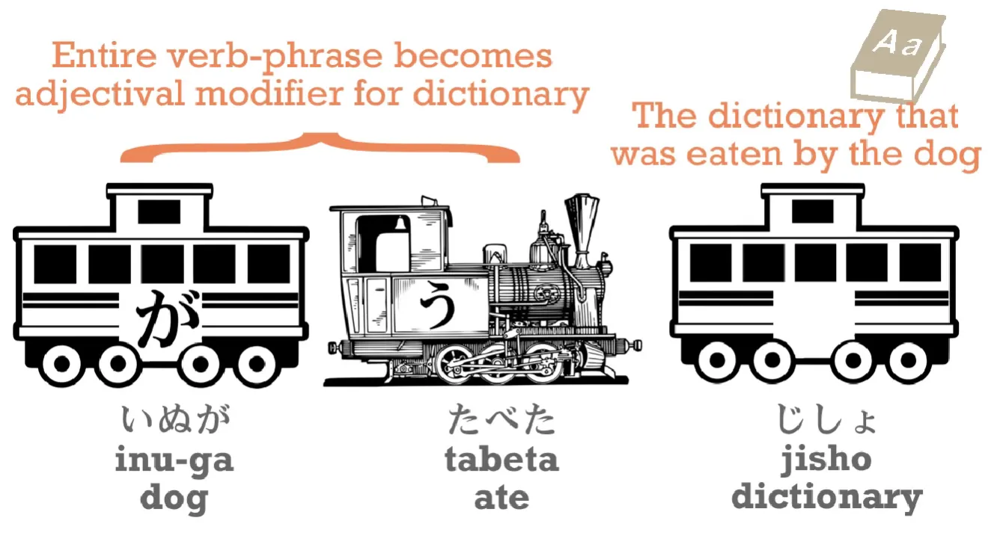

::: info
In Japanese, this is not a passive sentence obviously. It is just a bit hard to translate into English as it would be in Japanese. As can be seen, the Japanese parts are much simpler.
:::

And then this can build into the full sentence, <code>じしょをたべたいぬがやんちゃだ</code>. <code>やんちゃ</code> is a noun that means <code>naughty</code> or <code>bad</code>, so, <code>the dog who ate the dictionary is bad</code>.

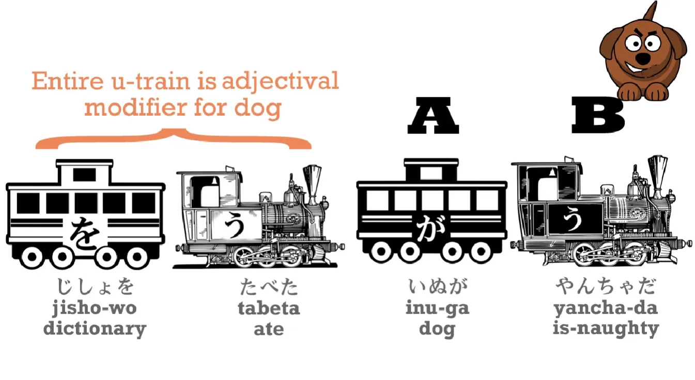

## Using adjectival-nouns as adjectives

This brings us to the noun-engine. If we just say <code>いぬがやんちゃだ</code>, we have a simple noun sentence. But we can turn this engine as well into a white engine and put it behind the dog. But there is one change we have to make.

**When we turn <code>だ</code> or <code>です</code> into a white engine, when we connect it to anything, it changes its form from <code>だ</code> to <code>な</code>.**

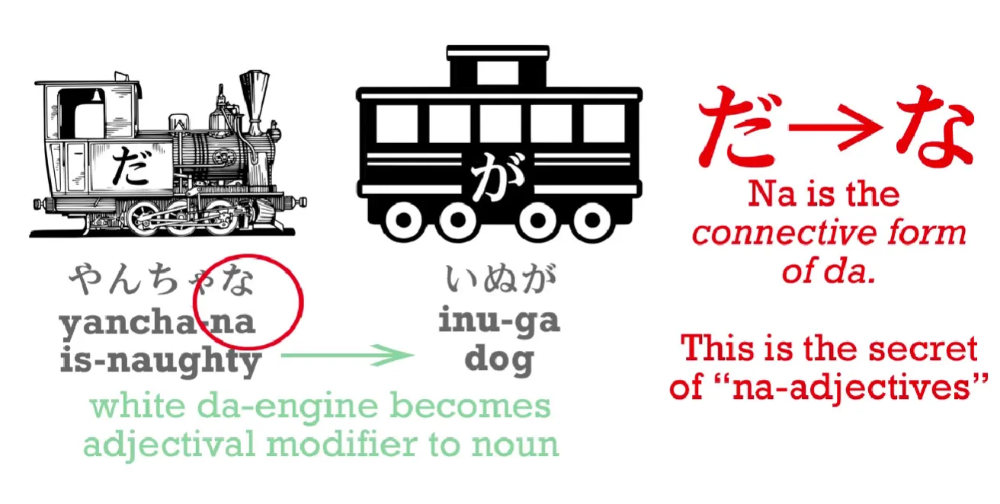

So we say <code>いぬがやんちゃだ</code>, but we say <code>やんちゃないぬ</code>, which is the same as saying <code>やんちゃだいぬ</code> – <code>is-bad dog / the dog that is bad / the bad dog</code>.

So we can say <code>やんちゃないぬがねている</code> – <code>the bad dog is sleeping</code>.

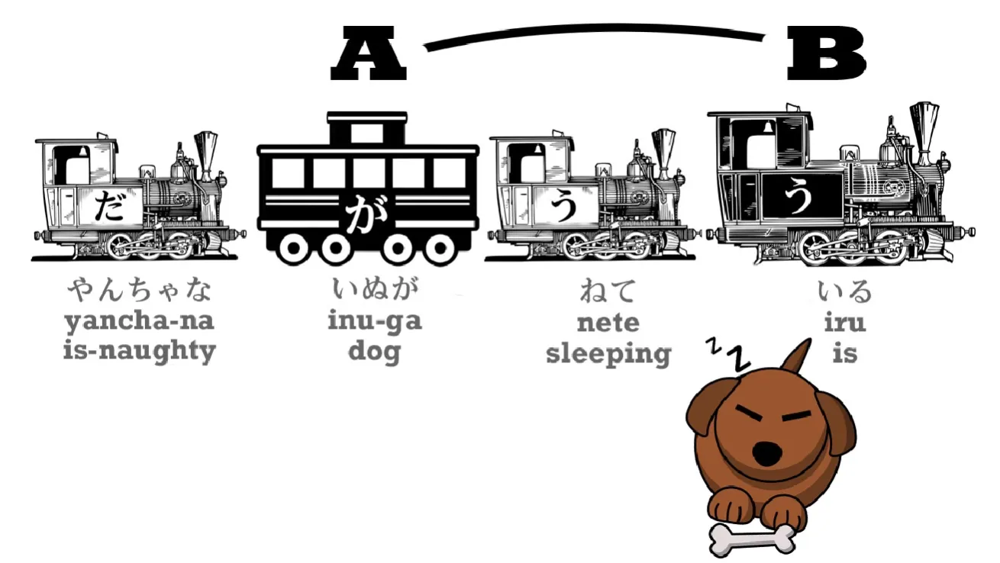

**Now, the important thing to note here is that you can't do this with every noun. There are only some nouns that are frequently used in an adjectival way, that you can use in the way we showed here.**

These are what the textbooks call <code>な-adjectives</code>, and it's a slightly confusing term, because as we see they are in fact nouns, **but they are a certain class of noun.**

::: info
Mark that <code>a certain class of noun</code>, they are NOT actual proper nouns. Just a subclass. They cannot be used alone like proper nouns (e.g. a subject). There are different names for them for that reason - Adjectival Nouns, な-adjectives, Adjectivals, Nominal Adjectives etc… 

It is just that they mostly resemble a form similar to proper nouns and take a copula like them and so they can be considered to be (and likely are) a class of nouns, just not as proper nouns.
:::

---

**Can we use other nouns as adjectives? Yes, we can, but we use them in a somewhat different way and they aren't engines.**

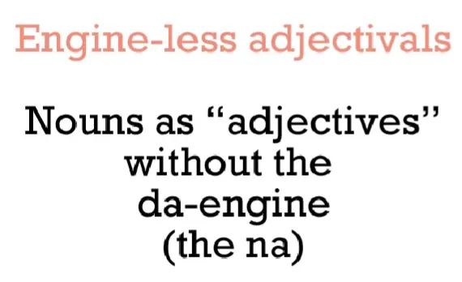

## The の car

To explain this we have to introduce a new type of car for our train. And this is the の car. **の \[no\] is a very simple particle because it works exactly like apostrophe-s \['s\] in English.**

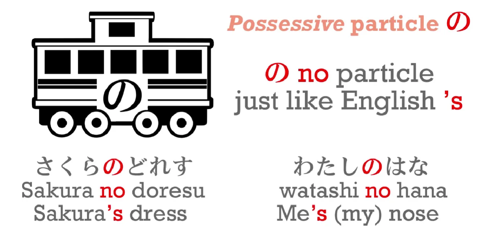

So, <code>さくらのドレス</code> means <code>Sakura's dress</code>. <code>わたしのはな/鼻</code> means <code>my nose</code>. 
::: info
Or as shown, literally <code>Me's nose</code>.
:::
Luckily, we don't have to worry about things like <code>my</code> and <code>your</code> and <code>her</code> and <code>his</code> in Japanese; **we always just use <code>の</code>.**

---

Now, because <code>の</code> is the possessive particle, it can be used in another, slightly different way. At the beginning of my older videos, I always used to say, <code>カワジャパのキュアドリです</code> – <code>(I am) KawaJapa's Cure Dolly</code>. (\*です = だ)

**In other words, KawaJapa is the group or party or website that I belong to.**

And we can use this more widely for defining the group or class to which anything belongs. So, <code>あかい</code> means <code>red</code> because we can turn the noun <code>あか</code> into the adjectival form <code>あかい</code>. **But we can't do that with all colors.**

For example, <code>ピンクいろ</code>. <code>いろ/色</code> means <code>color</code>, and we say <code>ピンクいろ</code>, that means <code>pink</code>. **But that doesn't have an い-form. And it doesn't count as an adjectival noun, a な-adjective, as they are called in English, either.**

So what we do with it is, we use <code>の</code>. <code>ピンクいろのドレス</code> – <code>pink dress</code>. And this means <code>**dress belonging to the class of pink things**</code>.

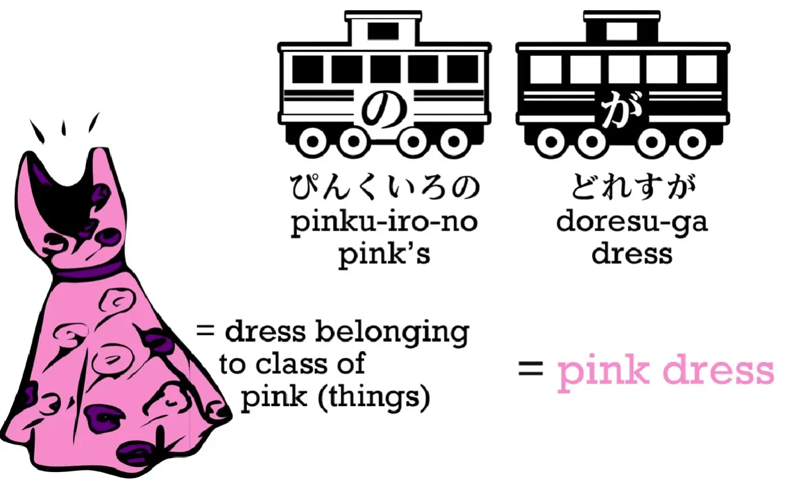

::: info
Dolly uses Hiragana here for <code>Pink</code>. Normally it is written in Katakana, as a loan word.
:::

If we want to say <code>Oscar the Rabbit</code>, we say <code>ウサギのオスカル</code>, which literally means <code>rabbit's Oscar</code>, and what it means is <code>**Oscar who belongs to the class **rabbit**** </code>.

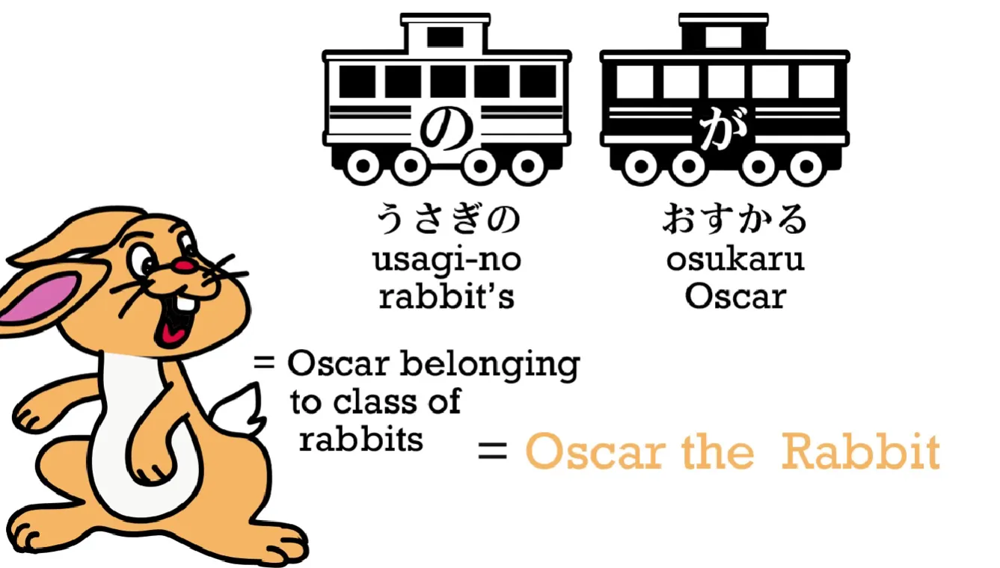

<code>ゼルダのでんせつ</code> means <code>the legend of Zelda</code>; <code>でんせつのせんし</code> means <code>legendary warrior / **warrior who belongs to the class of legendary things**</code>.

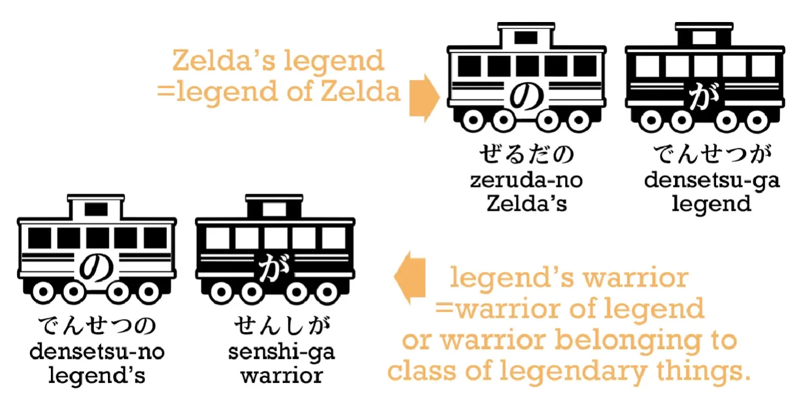

So we have four ways of forming adjectivals: **the three engines plus the の car.**

And using this we can make all kinds of sentences and they can become very complex, especially with verbal adjectives in which we can use whole complex sentences in an adjectival manner.

And I'm going to do some [**worksheets**](https://learnjapaneseonline.info/2022/03/28/worksheets/) that will help us to get used to some of those more complex sentences and I'll put them in the information section below [**this video**](https://www.youtube.com/watch?v=iyVZlaEqU24&list=PLg9uYxuZf8x_A-vcqqyOFZu06WlhnypWj&index=12) lesson.

Now, one thing you may be thinking is, <code>Since some nouns are used as adjectives with **な** and some with **の**, do I have to start learning lists of which ones go with **の** and which ones go with **な**?</code>

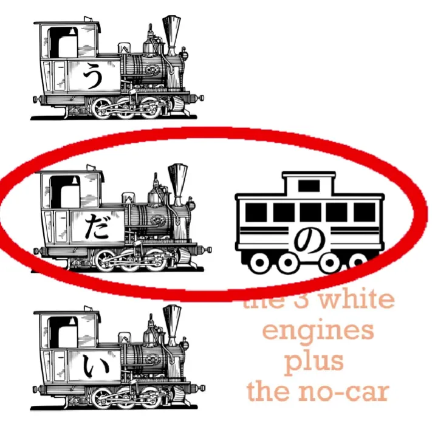

And my answer to that is, **I don't see any good reason to do so unless you are having to learn them for an exam.**

Why not? Well, look at it logically. If you hear someone use them with either <code>の</code> or <code>な</code>, you're going to know what they're saying. If you use them yourself and you get it wrong, nobody is going to have any difficulty understanding what you're saying, and it's a very small and typical foreigner's mistake, and frankly it's the least of your worries at an early stage. If you're writing, you can of course look them up very easily.

---

**As you use Japanese more, hear more Japanese, read more Japanese, you will pick up which ones are <code>の</code> and which ones are <code>な</code>.** And if you're not going to use Japanese very much, well, why do you need to know?

To me, Japanese isn't a game of learning abstract information for no particular reason. It's a language that for the most part we can learn in a natural manner, and understanding its real structure helps us very greatly to do that.

::: info
If it is a bit too much to take, I always recommend checking the comments under the [video](https://www.youtube.com/watch?v=iyVZlaEqU24&list=PLg9uYxuZf8x_A-vcqqyOFZu06WlhnypWj&index=12). And obviously, rereading and taking it in smaller chunks. You can do it! ＼(⌒▽⌒)
:::