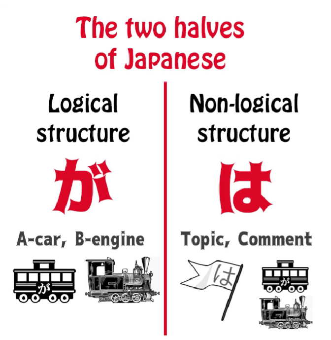
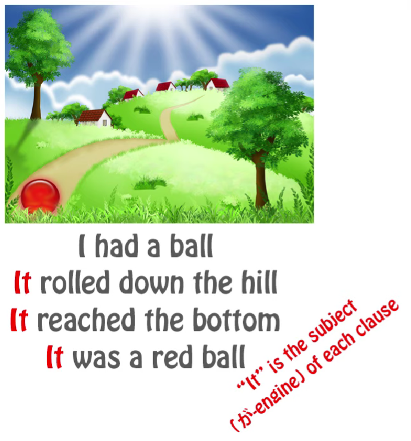
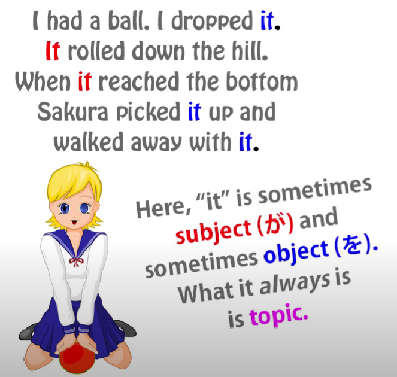
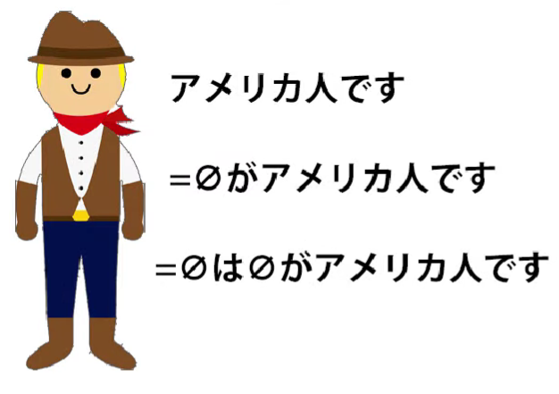
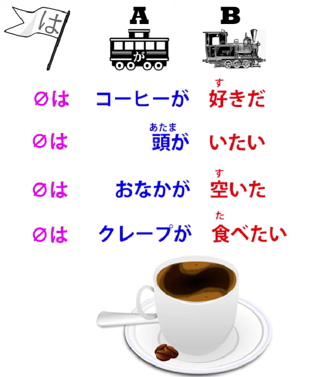
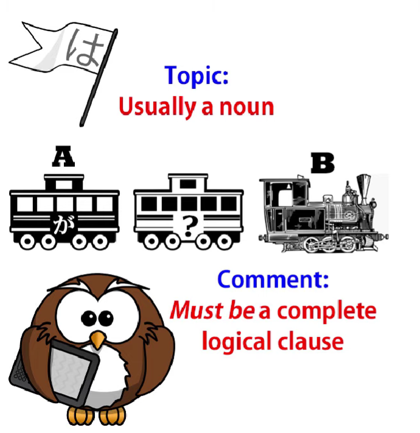
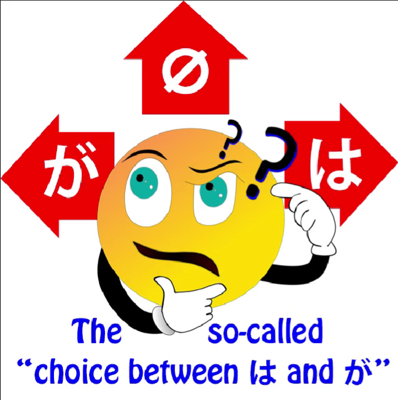

# **60. The OTHER HALF of Japanese Structure - non-logical topic/comment structure**

[**The OTHER HALF of Japanese Structure - non-logical topic/comment structure | Lesson 60**](https://www.youtube.com/watch?v=_nXHpkTTfGs&list=PLg9uYxuZf8x_A-vcqqyOFZu06WlhnypWj&index=62&pp=iAQB)

こんにちは。

Today we're going to talk about one of

the most important subjects in Japanese structure.

In fact this is the other half of Japanese structure.

We've referred to it on many occasions.

You can't really do much Japanese without it.

But we've never tackled it head-on, and that's what we're going to do now.

What we're going to talk about is topic - comment structure.

And this is just as important as logical,

subject - predicate, A-car - B-engine, structure.

In my book <code>*Unlocking Japanese*</code>,

I referred to が as the king of Japanese and は as the queen of Japanese.

が is the head of the logical particles, the logical side of the language.

は is the head of the non-logical particles and strategies,  
the non-logical side of the language.

And we can go so far as to say that

not only does every Japanese sentence have  
a が-marked A-car, whether we can see it or not,

**every Japanese sentence also has a は-marked topic, whether we can see it or not.**

## The topic

So what is a topic?

Every language has a topic; most languages are not, like Japanese, topic-prominent.

But to explain what a topic is in English, here's a very quick example.

In English, we track topics by using pronouns,

and that's why English uses so many pronouns.

That's why it's saying <code>it</code> at the time.

So, we can say "I had a ball.  
It rolled down the hill. It reached the bottom. It was a red ball."

As you see, each time the ball is marked by <code>it</code>,

and you might say that what's being tracked here

is the subject, because it was the ball that rolled

down the hill, it was the ball that reached the bottom,

it was the ball that was red.

But we could also say "I had a ball. I dropped it.

It rolled down the hill. When it reached the bottom,

Sakura picked it up and walked away with it."

Now, you see, the first <code>it</code> is the object of my dropping it:

<code>I dropped it.</code>

The second and third <code>it</code>:

<code>It rolled down the hill... it reached the bottom</code> --

in those two the ball is the subject.

And then <code>Sakura picked it up</code>,

and it's become the object again,

the object this time of Sakura's action.

So <code>it</code> is not tracking the subject, it's not tracking the object,

it's tracking the topic, the thing we're talking about.

That's what a topic is.

And as I said, Japanese always has a topic, even though we can't always see it.

So, if we say <code>アメリカ人です</code>, usually we would

map that out as <code>zeroがアメリカ人です</code> – <code>I am an American</code>, but to be completely thorough

we would have to map it as <code>**zeroは**zeroがアメリカ人です</code>,

that is <code>I am the topic, I am the subject, and I'm an American.</code>

We don't have to go through all that every time, but it's important to know that it exists.

When the topic and the subject are the same,  
it's not so important, but as we know they often aren't.

And in Japanese much more than in English they very often aren't.

So, in sentences like <code>コーヒーが好きだ</code>, <code>頭が痛い</code>, <code>おなかが空いた</code>, <code>クレープが食べたい</code>,

all of these are complete logical sentences:

<code>Coffee is likeable</code>; <code>Head hurts</code>; <code>Stomach is empty</code>; <code>Crepes are eat-want-inducing</code>.

In each case we have an A-car, we have a B-engine, we have a complete logical clause.

But while it's logically complete, it isn't grammatically complete without understanding

that there is also an invisible は-marked topic:

<code>**zeroは**コーヒーが好きだ</code>; <code>**zeroは**頭が痛い</code>;  
<code>**zeroは**おなかが空いた</code>; <code>**zeroは**クレープが食べたい</code>.

<code>**In relation to me**, coffee is likeable/pleasing</code>;

<code>**In relation to me**, head hurts</code>;

<code>**In relation to me**, stomach is empty</code>;

<code>**In relation to me**, crepes are eat-want-inducing</code>.

And while, as with the zero が-marked pronoun,

the default is <code>I</code> but it doesn't have to be <code>I</code>,

so the は-marked zero-pronoun the same applies.

For example, if we look at a tall person go by and we say

<code>背が高い、ね?</code>, literally, <code>back is high, isn't it?</code>

and that's the way we say someone is tall.

But as you see, this isn't complete without

the は-marked zero pronoun: <code>zeroは背が高い</code> – <code>In relation to that person, back is tall</code>.

And because Japanese has so many constructions that don't center on an ego,

as we talked about in one of our previous videos *(Lesson 9)*,

so many constructions in which neither the A-car nor the B-engine are in fact the person concerned, like all the examples we've just talked about,

**it's very necessary in lots of cases that we understand that the は-marked topic is there.**

And the other thing we need to understand about topic-comment structure is that

**the comment is always a complete logical clause.**

The topic is usually a noun (it could be something else)

**but the comment is always and must always be a complete logical clause.**

This is something the textbooks don't explain,

and it may be a good thing that they don't explain it,

because if they did, I think we know how they'd go about it.  
They'd present this as some kind of strange Oriental rule that we have to memorize.

But that's not what it is: it's a logical necessity.

As we know, every sentence, every logical clause, must

have an A-car and a B-engine, a subject and a predicate,  
and as we know from our third lesson on は,

**は can never mark either the A-car or the B-engine, or any other element of a logical sentence. It can only mark the non-logical topic.**

So that means that if we're going to have a sentence

at all, both its elements have to be outside of the topic.

We have to have a topic and we also have to have

an A-car, we also have to have a B-engine.

---

Therefore, every topic-comment sentence

only has two elements, the topic and the comment.

**Both the elements of the logical clause have to be in the comment.**

Therefore, logically, in a topic-comment sentence the comment is always a logical clause.

In another [**video**](https://www.youtube.com/watch?v=9l_ZlQQU4ZE) I've talked, and I'm going to talk again,

about some of the implications of what is called the choice between は and が;

what it means when we mark something with は, what it means when we mark it with が.

And there are a lot of implications involved here.

I won't go into them in this video but you can watch [**the other one**](https://www.youtube.com/watch?v=9l_ZlQQU4ZE) and I'll put a card up for that.

But the thing to remember here because we're talking about the actual structure, is that

when people talk about the choice between は and が, it's confusing and somewhat misleading because it implies that は and が are somewhat similar,  
that they do a similar kind of job.

**And we know that they don't. We know that**

**they're absolutely different species of particle.**

And what we know from this lesson is that

what we're actually doing **when we're making**

**a choice between は and が is that we're choosing**

**which of two elements which are always present to make visible, whether we make the は visible, the が visible, or neither visible.**

So we can say <code>アメリカ人です</code>,

we can say <code>私はアメリカ人です</code>,

and we can say <code>私がアメリカ人です</code>.

And each of those has a slightly different implication.

When we're not actually choosing between は and が,

what we're choosing to do is to emphasize,

by making it visible, the topic-nature of the subject

or the subject-nature of the topic, or neither.

And which of those we choose to emphasize has big implications for what we're saying

and what we're implying…
