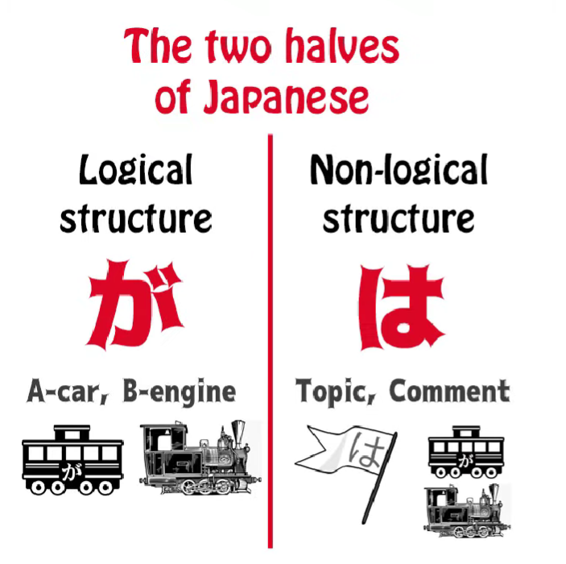
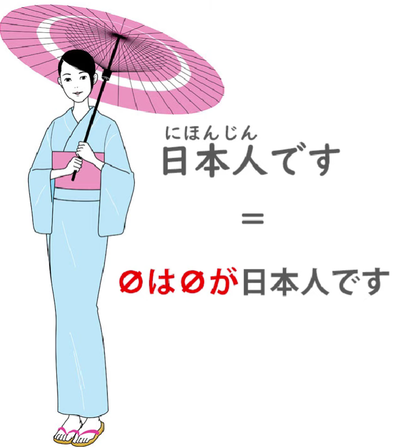
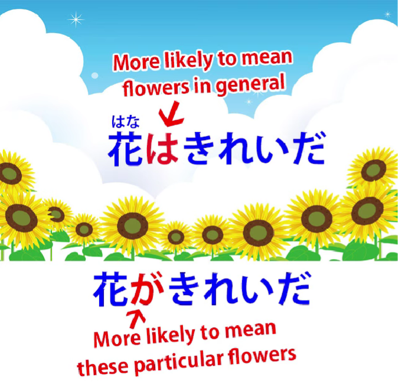
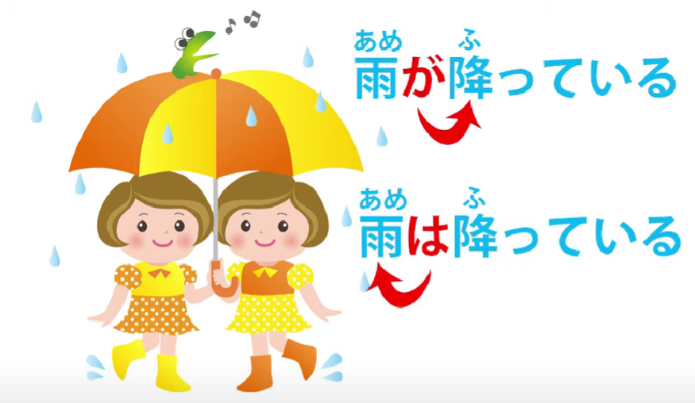
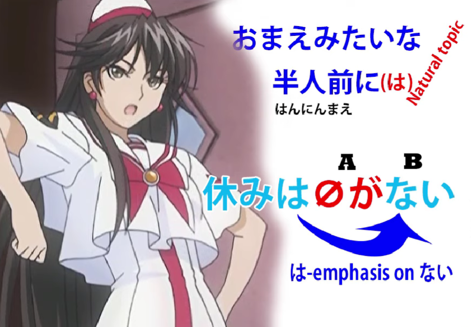

# **61. は and が: the Deeper Secrets! The yin-yang structure of Japanese**

[**WA and GA: the Deeper Secrets! The yin-yang structure of Japanese | Lesson 61**](https://www.youtube.com/watch?v=o-hK4-qv9Yk&list=PLg9uYxuZf8x_A-vcqqyOFZu06WlhnypWj&index=63&pp=iAQB)

こんにちは。

Today we're going to talk about the subtler meanings of the は- and が-particles

and the implications they can have in different uses.

Last week *(Lesson 60)* we looked at the fact that topic-comment structure is fundamental to Japanese.

Every Japanese sentence has a topic as well as a subject,

so that we can say that where the topic and the subject

are not made explicit, Japanese sentences

have both an invisible が and an invisible は.

So, <code>日本人です</code>, meaning <code>I am a Japanese person</code>,

is strictly <code>zeroはzeroが日本人です</code> --

<code>I am the topic, I am the subject, and I am a Japanese person.</code>

On the whole, we don't need to worry about the invisible は,

and that's because in English and related languages

we don't normally need to have the topic made explicit.

We do need to have the subject repeatedly made explicit,

so we feel a bit lost if we don't know where it is.

And that's why we use the invisibleが model.

But the important thing that we concluded in

our last lesson was that the so-called choice

between は and が, which only exists, of course,

in sentences where the topic and the subject

happen to be the same thing,

and what we're doing is not really making a topic or making a subject: we are emphasizing the fact that something is either the topic or the subject.

And this choice is important for the implication

we're going to throw on that topic/subject.

And in order to understand the implication, we do have to have some idea of what is the most natural way of putting a thing.

And this is why I always say that structure is important,

but you can't understand Japanese with structure alone.

**You have to have enough immersion to understand what sounds natural.**

And from that plus the use of structure you can understand what implications

are being made by a particular statement.

---

Now, when we treat something as a topic and mark it

with は or も, **this can't be new information.**

Just as in English if we say,

<code>Speaking of Melfrog Pooftoofular</code>,

it's no good saying that if your hearer doesn't know who or what <code>Melfrog Pooftoofular</code> is.

You have to start by introducing <code>Melfrog Pooftoofular</code> first.

**So a topic-marker can only mark old information.**

And this is important because old information is unimportant information.

New information is what you are actually trying to convey to someone.

This is the way language works.

We're not supposed to be telling people things they already know. We're supposed to be adding something that they don't know, and that is the actual information content of the statement.

So, in a certain way, は works like <code>the</code> in English, only in this one respect, that it can't mark new information.

So if we say <code>I fed the iguana</code>, unless people already know about this iguana,

they're immediately going to say, "What iguana? You never talked about any iguana before.

What are you talking about, 'the iguana'?"

If you say <code>I fed an iguana</code>, that's all right.

And we also need to understand that **this concept of old versus new information and important versus unimportant information is closely bound up.**

So you can in fact say <code>I fed the dog</code> without anybody knowing that you even had a dog,

because it's very normal and natural for a person to have a dog.

They don't particularly want to stop and have that point explained anyway.

So <code>I fed the dog</code> will be taken to mean

<code>I fed the dog that I keep at home, even though you didn't know I kept a dog at home, you do now</code>.

If I say <code>I fed the iguana</code>, that's a conversation stopper.

If you don't introduce the iguana first, nobody's going to just take it as read --

<code>Yes-yes, she's got an iguana at home, like most people.</code>

So you see that while we say linguistically <code>new information</code> versus <code>old information</code>,

it's a bit subtler than that.

It's <code>new, important, relevant information</code> versus

<code>old information or information that we can easily take as read</code>.

And even this is quite a heavy-handed way of describing it.

Let's take a look at how this sort of thing

works in practice in Japanese.

If we say <code>本を買った</code>, this is the most normal way of saying <code>I bought a book</code>.

As we know, the zero-pronoun defaults to <code>I</code> when the context isn't telling us that it's anything else.

So <code>本を買った</code> puts no particular emphasis on anything;

it's just saying, neutrally, <code>I bought a book</code>.

Now, in this sentence, <code>I</code> is the subject and the topic.

If we choose to stress <code>I</code> as the topic and say <code>私**は**本を買った</code>,

**we're making <code>私</code> into the old information, the buying of the book into the new information, and because of this, は has a distinguishing function.**

---

When we use は, we are either establishing or changing the topic.  
And even establishing a topic is in most cases changing it,

because we can assume there was some topic before.

So we're changing the topic to <code>I</code> and saying that I bought a book.

And we know that what は does is not only change the topic to whatever it marks (in this case <code>I</code>) **but it also implies that the comment on the new topic  
is different from the comment on the old topic.**

And if there wasn't in fact an old topic, it still implies that it's different from

the comment **on other possible topics.**

So, <code>私は本を買った</code> is essentially saying "What I did was bought a book.

You may have bought something else, other people may not have bought anything at all,

but what I did was buy a book."

We're stressing the fact that **I bought a book as opposed to other possible topics**

**who didn't buy a book.**

This means that it is implicitly the answer to a question

which may not in fact have been asked:

<code>What did you do?</code>

The answer to <code>What did I do?</code> is <code>I bought a book</code> when you're marking <code>I</code> with は.

---

Now, if you say <code>私が本を買った</code>, you've changed the emphasis.

**You've reversed the emphasis.**

The old information is now the buying of the book and **the new information is <code>I</code>.**

So under what circumstances do you say that?

Well, suppose people are looking at an empty space in the bookshelf and wondering what happened, and you say <code>私が本を買った</code> – <code>I'm the one who bought the book.</code>

We all know that the book's gone, we know something happened to the book,

now I'm giving you the new information:

**<code>I</code> am the one who bought the book.**

So while <code>私は本を買った</code> is implicitly the answer to the question <code>What did you do?</code>,

<code>私が本を買った</code> is implicitly the answer to <code>Who bought the book?</code>

---

It's also important to understand what is the natural, neutral way of saying something.

We know in this case that the natural, neutral way

of saying <code>I bought a book</code> without emphasizing

anything is just to say <code>本をかった</code>.

So if we say <code>私は</code> or <code>私が</code>, **we're specifically making a point here.**

**We're adding something to the neutral statement that I bought a book.**

Now, from this direction of the emphasis forward or backward,  
は, and が can mark particularities as opposed to generalities.

So, for example, if we say <code>花が綺麗だ</code>,

we're stressing the <code>花</code> as the subject and this means

<code>The flower (or these flowers) are pretty</code>.

<code>Pretty</code> is important, but the real subject is <code>these flowers</code>.

These flowers are what is pretty, these are pretty flowers.

If we say <code>花は綺麗だ</code>, we are likely

to be saying that flowers in general are pretty.

We haven't singled out any flowers as the subject;

we've made <code>flowers</code> the topic, and the important new information is prettiness.

**Flowers in themselves are not new.**  
They're something we've known about for a long time.

**The fact that they're pretty is my comment, my assessment of them.**

<code>花が綺麗だ</code> – the flowers are taken to be something new.

They're taken to be a particular subject in themselves and so we're more likely to be

talking about particular flowers instead of flowers in general.

---

Now, all the time we're talking about tendencies here, aren't we?

There's no logical, structural reason why saying

<code>I fed the iguana</code> is any different from saying <code>I fed the dog</code>.

It becomes different because of expectations.

We expect someone is very likely to have a dog

and so this is not new or important information.

We don't expect someone to have an iguana, so this counts as new, important information and you can't slip it by with a <code>the</code> in the same way that you can the dog.

**Similarly, が can mark new material as well as old material,  
but は can't mark new material.**

**は can mark specific things as well as generalities but が can't really mark generalities.**

So we're talking about fairly subtle shades here.

Now, knowing the usual way of saying something, again,

is what gives using a different strategy its emphasis.

So, as I spoke about in [**an earlier video**](https://www.youtube.com/watch?v=9l_ZlQQU4ZE) on は and が

(which I would recommend seeing, because it covers some material I'm not covering here)

we know that <code>雨が降っている</code> means <code>it's raining</code>.

This is the normal way to say it's raining.

We use が. We can't use nothing because we have to say what's falling,

and we don't normally use は.

So <code>雨が降っている</code> simply means <code>rain is falling</code>.

<code>雨は降っている</code> is something you'd say when perhaps

there was an expectation that it was going to snow.

Rain is the topic and the comment on it is that it's falling,  
with the implication that if the topic were different the comment would also be different,

because **we're using は** not も, and **は is the exclusive topic-marker as opposed**

**to も, which is the inclusive topic-marker.**

---

Now, it's not only used for differentiation; it's also used because it throws emphasis forward. It's also used for emphasis.

So I'm going to take an example here from one of my favorite anime,  
which is Aria the animation.

Unfortunately, I don't think it has any Japanese subtitles,

so you may have to wait a little while before you watch that.

I know you never watch anything with English subtitles

any more and I congratulate you for that.

So the sentence is <code>おまえみたいな半人前に休みはない</code>.

<code>おまえみたいな半人前に休みはない</code>

And what this means is <code>For trainees like you, there are no rests</code>.

Now, it's interesting to notice what's going on here.

What is the topic of this sentence?

Actually, it's <code>trainees like you</code>:

<code>おまえみたいな半人前に</code> could have been

<code>おまえみたいな半人前には</code> and this would made a topic out of <code>trainees like you</code>,

and the comment on this would be the logical clause <code>休みがない</code> -- <code>there are no rests</code>.

---

**However, the speaker has chosen to do something different.**

**She's chosen to de-emphasize the topic by not marking it with は,**

**but this doesn't stop it being the topic.**

It's still the topic on which the logical clause is a comment.

And **she's made a sub-topic out of <code>休み</code> -- <code>rests</code>.**

Why has she done that?

**Because when you make something a topic, even if it's a kind of sub-topic like this,**

**you're throwing the emphasis forward onto what follows it.**

You're making the thing that follows it the salient,  
the important information of the sentence.

So, what it's saying here is <code>休みは *(zeroが)* ない</code> -- <code>As for rests, *(they)* don't exist</code>:

<code>For trainees like you, as for rests, *(they)* don't exist.</code>

Now, this isn't quite as cumbersome as it sounds in English

because は is a much more flexible particle

that can be used much more easily than things like <code>as for</code> in English.

But it's using the same essential strategy to throw

all the emphasis of that entire sentence onto that last word, <code>ない</code> -- <code>they don't exist</code> --

<code>forget about rests, you're not getting any.</code>

Now, I hope this makes the topic-marking は

and the subject-marking が a little bit clearer

in their deeper and subtler implications…

::: info
This may be quite a difficult thing to grasp, as always, comments under [**the video**](https://www.youtube.com/watch?v=o-hK4-qv9Yk&ab_channel=OrganicJapanesewithCureDolly) may perhaps help a bit. The brain should eventually sort it out via natural, comprehensible input through the active organic exposure to the language and its active use. Just keep going (•̀o•́)ง
:::