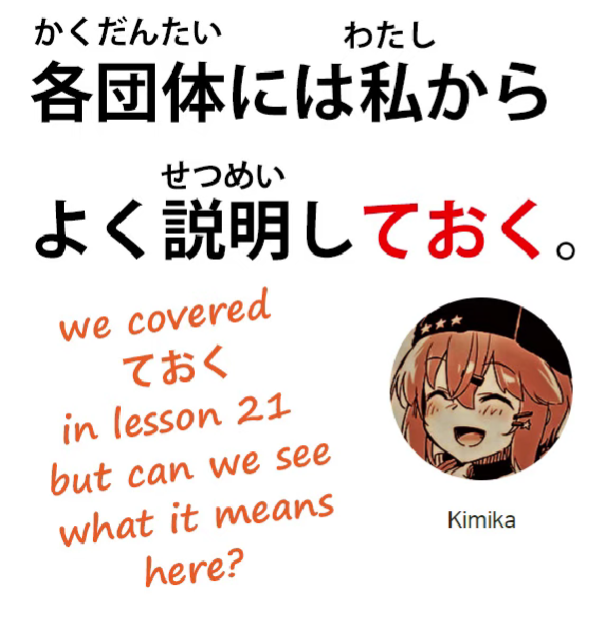
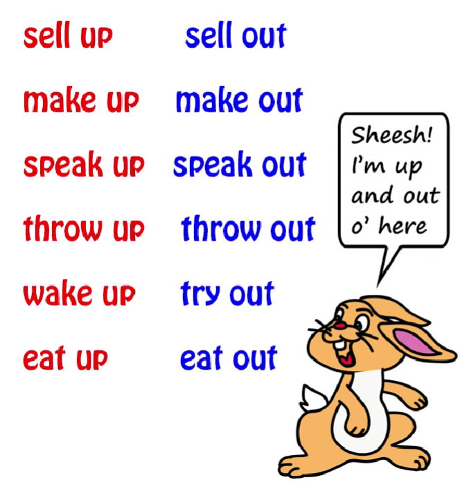
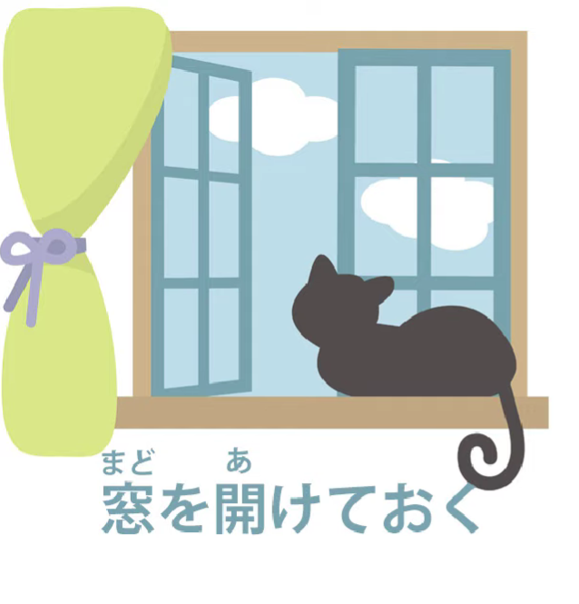
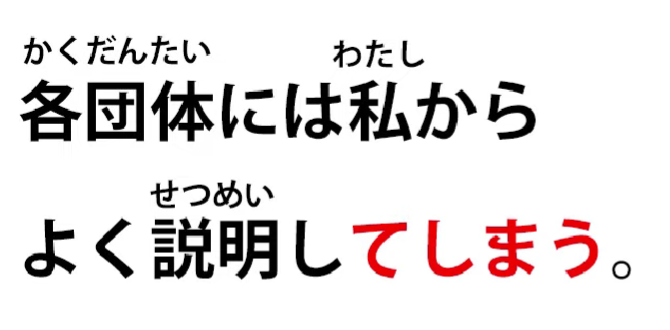
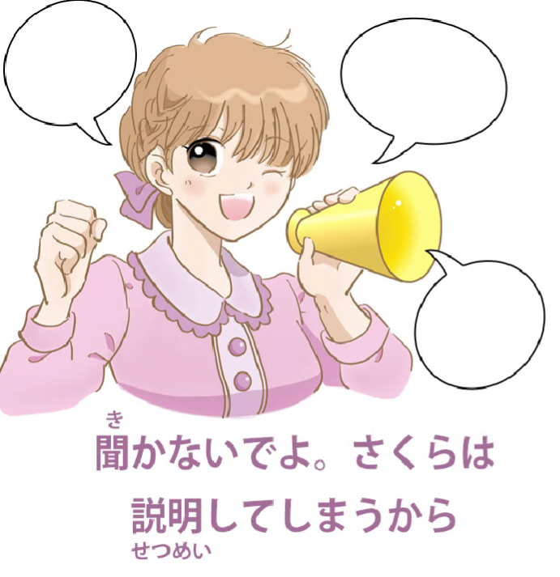

# **62. ておく vs てしまう, helper verb secrets**

[**Te-oku vs te-shimau, helper verb secrets. ておく てしまう | Lesson 62**](https://www.youtube.com/watch?v=q6vDkjv4ac0&list=PLg9uYxuZf8x_A-vcqqyOFZu06WlhnypWj&index=64&pp=iAQB)

こんにちは。

Today we're going to start talking about what I call the bridge between structural learning and actual immersion, because we learn expressions and structures and then sometimes when we encounter them in real use we don't understand quite what they're doing there.

I'm going to take an example from my patron Kimika-sama, who gives me this sentence:

<code>各団体には私からよく説明しておく</code>

Now, Kimika-sama is able to translate this pretty much correctly (it means broadly in English

<code>I will give each group a good explanation from me</code>),

but still doesn't understand why <code>おく</code> is used as a helper verb to <code>説明する</code>.

And to understand that more fully, I think we need to look into something a little more deeply.

This is the fact that Japanese people are very fond of their helper verbs and they attach them quite often in various kinds of circumstance. Is this something we can understand from an English point of view? I would say yes, it is.

We do the same thing in English, though not so much with verbs as with prepositions,

particularly the prepositions <code>up</code> and <code>out</code>.

We eat things up, we make things up, we cry out, we lose out, we think up an idea, we think out an idea, etcetera etcetera. Now, **Japanese doesn't have any prepositions.**

**None at all.** If you think it has, it's time to throw that textbook out of the window.

What it uses in place of these English prepositions <code>up</code>, <code>out</code>, etcetera, are verbs -- helper verbs. And the difference between the Japanese helper verb and the English verb-helper preposition is first of all that there are a lot more of them and then, because of that, they're a lot more specific. If you look at the various ways in which English speakers use <code>up and </code>out<code> -- they even </code>peace out", whatever that means -- you can see that because there are only a few of them they get used all over the place in all kinds of circumstances and there's only a marginal amount of reason to the way they're used.

---

Now, because there are more helper verbs, they can be much more targeted.

So, even though they're used widely, in a whole range of situations, we can

generally tell what any given helper verb is doing,

if we understand that we need a fairly wide interpretation.

So what <code>-ておく</code> is doing here is really what it always does.

If we say <code>窓を開けておく</code>, what we're saying is  
"open the window in order that the window will be open and probably that

ventilation is going to come into the room".

Open it for a purpose, put that action in place:

<code>おく</code>, which means <code>put in a place</code>.

Put that action in place so that it will then　  
change the circumstance in the way that we want.

In this case, airing out the room.

And the same with the <code>説明</code> here.

<code>説明しておく</code> -- put the act of explaining, or the explanation, in place, so that, after that,

each group will understand what's going on, they won't be in the dark about it any more.

---

Now, we can compare this with another

very common helper verb, which is <code>しまう</code>

and its various variants like <code>ちゃった</code>, <code>じゃった</code> etc.

We could say <code>説明してしまう</code>,

but that would have a completely different implication.

In this particular case it would probably mean something like  
"I'll go ahead and explain to them, even though that's not what I'm expected to do,

or perhaps not what people want me to do.  
I'll just go right ahead and explain to them<code> – </code>説明してしまう"

In another situation we might say something like

<code>聞かないでよ。さくらは説明してしまうから</code>,

which means <code>Don't ask, because Sakura will explain</code>

-- but what that <code>しまう</code> is implying is probably something like  
"Don't ask, because if you do Sakura's going to explain

and we're going to be stuck here for hours with Sakura's long rambling explanations."

So, <code>しまう</code> has a wide variety of implications,  
some of them negative, not all of them negative,

but <code>おく</code> has a completely different range of meaning.

---

**<code>しまう</code> is talking about going ahead and  
doing something, something happening by accident;**

as I said in the video on <code>しまう</code> *(Lesson 44)*,

essentially when it's in the past, all those things that we can mean by <code>done</code> --

<code>I done explained</code>, <code>I done fell over, </code>she done stole my cake<code>, </code>I done won the lottery"

-- doesn't have to be negative, but it has that exclamation mark feeling to it.

**It happened, even though you might not have been**

**expecting it or you might not have wanted it.**

**It happened.**

---

**<code>おく</code> doesn't have that exclamation mark feeling.**

**It has that workman-like feeling:**

it was done to put the action in place, to achieve a result, to change the circumstance from what it was before into one that is more in accordance with what we want,

whether it be opening a window or explaining to several groups what the situation is…
