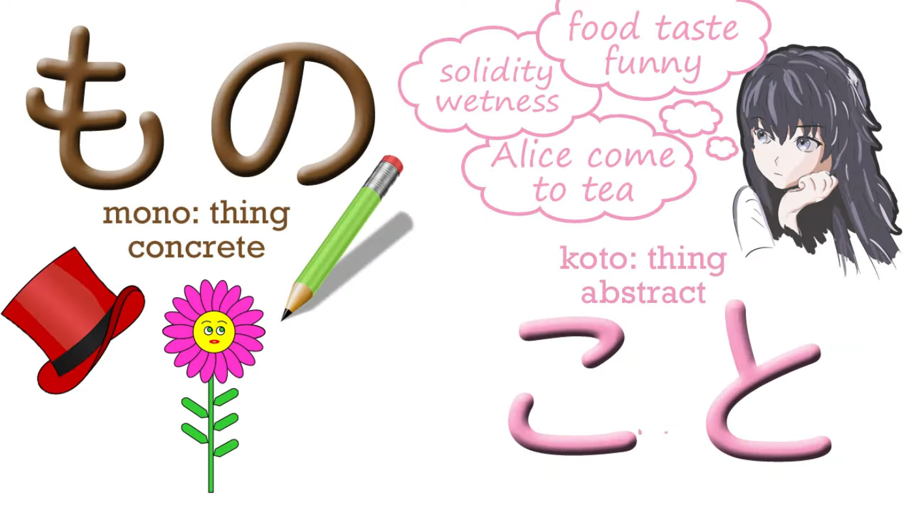
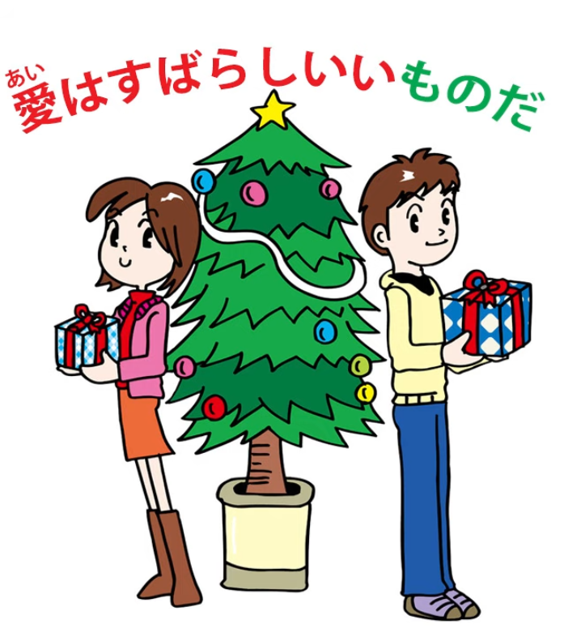
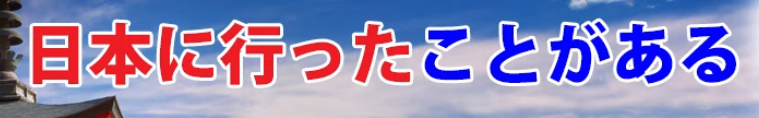
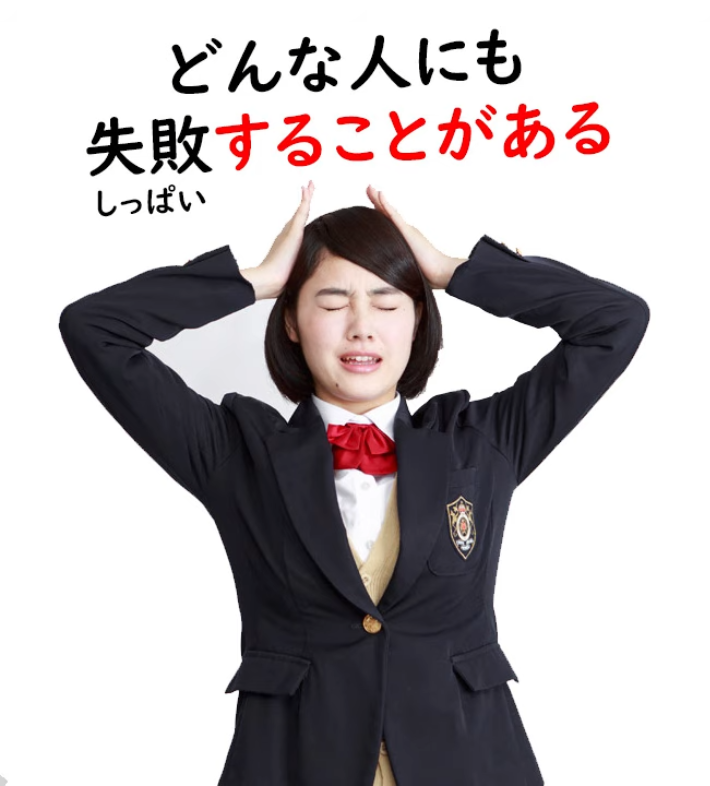
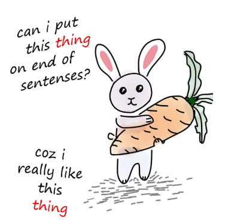
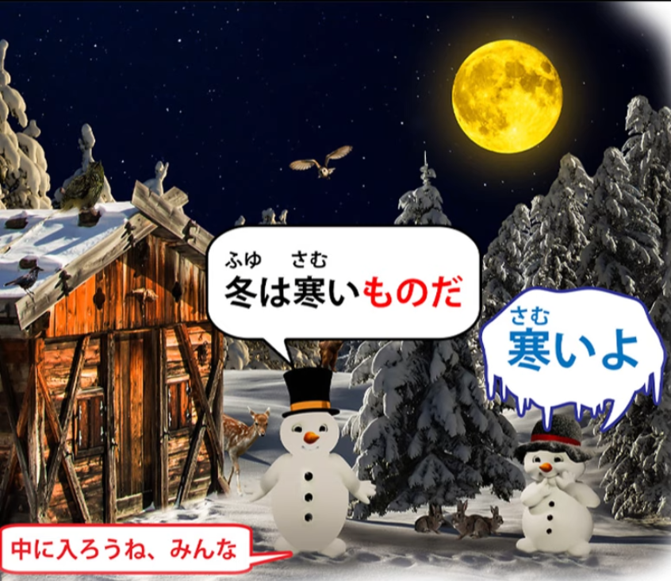
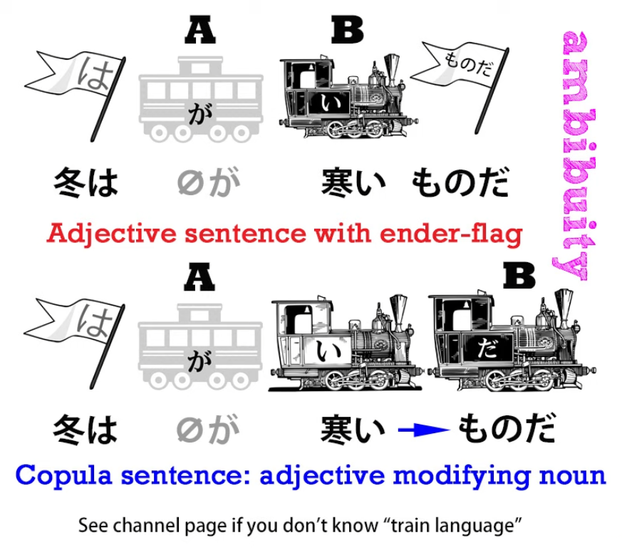
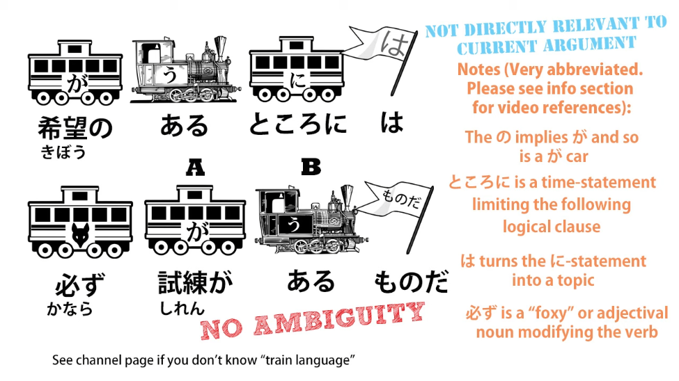
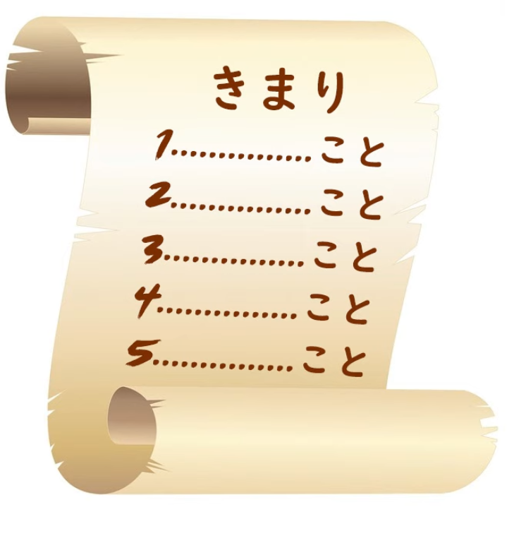
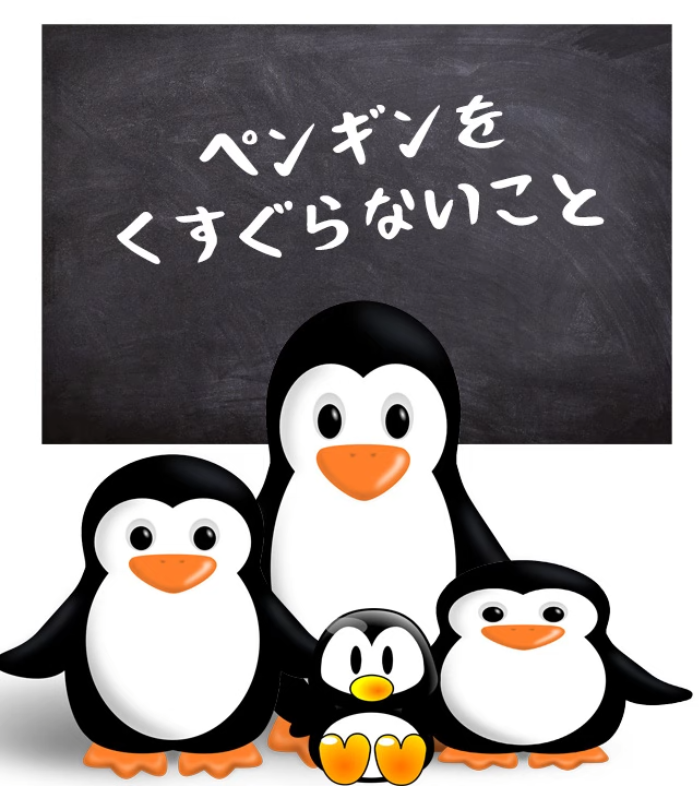

# **64. <code>Things</code> get Strange! もの and こと - Advanced secrets: ものだ, ことがある, こと as sentence-ender**

[**<code>Things</code> get Strange! Mono and Koto: advanced secrets: ものだ, ことがある, こと as sentence-ender | Lesson 64**](https://www.youtube.com/watch?v=aYlgQaK7lS4&list=PLg9uYxuZf8x_A-vcqqyOFZu06WlhnypWj&index=66&pp=iAQB)

こんにちは。

Today we're going to talk about <code>もの</code> and <code>こと</code> in some of their more advanced senses.

Now, near the beginning of this course we talked about <code>もの</code> and <code>こと</code>, and I said what people usually say, which is that <code>もの</code> is a concrete thing, like a pencil or an apple or a tree,

and <code>こと</code> is an abstract thing, like a situation, a circumstance, an action.

Now, this is broadly true and it's certainly the best way to grasp it in the beginning, but then we come across some other situations which don't seem to fit in with that.

One of my Patrons wrote to discuss the sentence: <code>愛はすばらしいいもの</code>, which means <code>Love is a wonderful thing</code>.

Now, surely love is abstract. You can't put it in a box and carry it from Kyoto to Tokyo.

So what's going on here?

My Patron said that she looked it up on various Japanese learning sites and they couldn't explain it at all.

They just said you have to learn which cases you use <code>もの</code> and which cases you use <code>こと</code>.

This isn't the case at all. What <code>もの</code> really designates is a <code>thing</code>.

And a thing is a noun, so it can be a concrete thing like an apple or a book or a universe,

but it can also be an abstract thing like love or happiness.

These are all nouns.

So <code>愛はすばらしいいものど</code> is the only way you can say it,

because <code>ai</code> is a <code>もの</code>, not a <code>koto</code>.

It's a noun. It's a thing.

It's not a state, it's not an action, it's not a condition.

It's a thing.

And we need to bear this in mind as we look at some of the more extended meanings of <code>もの</code> and <code>こと</code>, as we start to see <code>もの</code> and <code>こと</code> on occasion being used as something like sentence enders.

But before we get to that, let's look at some of the other extended uses of <code>こと</code>.

Now, one of the most common ones is <code>したことがある</code>.

For example, we might say <code>日本に行ったことがある</code>.

And that means <code>I have been to Japan</code>.

And, as you see, <code>I have been to Japan</code> is a different kind of statement from <code>I went to Japan</code>.

<code>I went to Japan</code> is referring to one particular instance of going to Japan.

<code>I have been to Japan</code> is saying that in the past, perhaps on one occasion, perhaps on many occasions, going to Japan is something that I have done. In Japanese what we're literally saying is <code>The activity, the fact, of my having been to Japan in the past exists.</code>

Now, I had an Italian Patron at one time who took me up on my early lesson on the Japanese tenses.

I said that Japanese has only three tenses.

And that's correct: Japanese has only three tenses.

And my Italian friend asked me "So how would I say something like

'I have been to Japan' as opposed to 'I went to Japan'?"

And I explained how that is. And he said <code>Well, in that case, Japanese doesn't just have three tenses. It's just like Italian or French or other European languages...</code>

It has perfective tenses and pluperfect and all these complicated things that European languages have.

And therefore I should be teaching it that way.

I should be teaching the Japanese past and present and future and pluperfect and perfective

and all that sort of thing.

But that is a perfect example of what's wrong with Western Japanese teaching.

It would be bundling Japanese, categorizing Japanese as if it were a European language gone wrong.

Of course any language of any sophistication needs to be able to express just about any kind of time relation.

But it doesn't do it in the way that European languages do it.

It doesn't do it by means of conjugating verbs.

In fact, as I've said before, Japanese doesn't conjugate verbs at all, even in cases that look a bit more like it to Western eyes.

It uses an entirely different kind of strategy.

It says <code>The fact of my having been to Japan exists</code>.

Now, if we go from <code>したことがある</code> to the present tense,

<code>することがある</code>, if instead of saying <code>日本に行ったことが ある</code>, we say <code>日本に行くことがある</code>,

we're now saying <code>The fact of my going to Japan exists</code>.

In other words, we're saying <code>I sometimes go to Japan / going to Japan is a fact that exists</code>.

If we say <code>どんな人にも失敗することがある</code>, we're saying <code>everybody sometimes makes mistakes / whatever kind of person it may be, the fact of making mistakes exists</code>.

Now, if you're going to start calling these things tenses,

that would have to be the past-present-and-future-occasionally-happening tense,

which is nonsense, but then so's all the rest of it.

It's simply the Japanese strategy for saying that a certain category of event sometimes happens–the fact of its happening exists.

Now, <code>もの</code> is sometimes used in ways that really do seem like a sentence-ender.

And the first way in which this happens is when we add <code>mono だ</code> to a complete logical clause.

And what this means is that the logical clause we're talking about, as a generalization, is a reality–it's a <code>もの</code>, it's a thing, it's something we have to contend with, it's something we have to accept.

And this is why we're using <code>もの</code> here and not <code>こと</code>.

When we say <code>ことがある</code>, we're literally talking about a <code>こと</code>, a state of affairs, a fact that happens, but here we're consolidating what we're talking about into a <code>thing</code>.

It's not literally a thing, it's not literally something you could hold in your hand,

but we are using the hyperbole of saying that it is.

If we say <code>冬は寒いものだ</code>, what we're saying is "winter is cold, and that's just a thing,

that's a thing, you have to come to terms with it".

Someone says <code>Ooh, it's cold</code> and you say <code>冬は寒いものだ</code> --

<code>winter IS cold / winter's a cold thing</code>.

Now, we can actually parse it out in that way.

We can make it <code>冬は寒い</code> is a complete sentence but we could also be saying

<code>冬は寒いものだ</code> - <code>winter is a cold thing</code>, and this would be a complete logical sentence.

Whether it's intended in that way or not is not always possible to tell,

and it doesn't tend to matter because the meaning is much the same either way.

But there are sentences when it can't possibly be read as simply grammatical.

So, for example, we may say <code>希望のあるところには必ず試練があるものだ</code>,

and what we're saying there is

<code>Where there's hope, there's always a test</code>, a test here meaning something we have to overcome, something we have to do in order to attain that hope.

Now, there's no way of tying this up logically. We simply have the complete logical sentence

<code>希望のあるところには必ず試練がある</code> and then we're adding to the end of it, as a kind of sentence-ender, <code>ものだ</code>.

It doesn't make logical sense, but what you're doing is making that statement and then emphasizing it and also putting a particular kind of stress on it by saying <code>ものだ</code> – <code>that's just how it is, it's a thing, that's something we have to understand, that's something we have to get used to, it's something that doesn't change, it's something that's inevitable</code>: <code>ものだ</code> – <code>it's a thing</code>.

Now, interestingly, that's when we have <code>ものだ</code> in the present; when we put it in the past it has a different implication.

And again, this isn't some strange rule we have to learn.

Just as with <code>することがある</code> versus <code>したことがある</code>, there are perfectly good reasons why it has to be like that. The <code>ものだ</code> we've just discussed has to be in the present tense

because we're talking about generalization, and the present tense, as we know, isn't really a present tense.

It covers the present and the future, and it can, even though it's called the non-past tense

-- it's really the indefinite tense – it can cover the past as well so long as it's also covering the present and the future. So it's a generalization tense in this case. But when we say it in the past it has a different meaning.

If we say <code>子供のころには、よくこちらに来たものだ</code>, what we're saying is <code>When I was a child I often used to come to this place.</code>

<code>ものだ</code> here is referring to something in the past.  
---  
And what it's saying is that in the past it was a thing. And it has a kind of personal implication. <code>It's a thing, it's a thing I think about, it's a thing I remember / to me, those past memories are a thing, they're a reality.</code>

So again, we're using this <code>もの</code> for something which is essentially abstract.

What's the difference between saying <code>東京に行ったものだ</code> and <code>東京に行ったことがある</code>?

The <code>ことがある</code> is simply a literal statement: <code>The fact of my having been to Tokyo exists.</code>

<code>東京に行ったものだ</code> is in English like saying <code>I used to go to Tokyo</code> and it has much more emotional weight.

It's like saying <code>This is a thing I used to do, this is something that used to happen</code>.

And you see we concretize it by figuratively calling it <code>a thing</code>:

it was a <code>もの</code>, it was a thing, it was something that used to happen.

Now, I'm not going to go into sentences that top off a logical clause with <code>ということ</code> or <code>というもの</code>,

because that would take us into the extended meanings of <code>という</code> and the quotation function,

which is a whole other area.

But I am going to talk briefly about a place where we see <code>こと</code> used on its own

as something like a sentence-ender.

We see a logical clause followed by <code>こと</code>.

And people sometimes say that this marks an order, but that's not exactly correct.

What it marks is a rule or a regulation.

And that's an important distinction. You'll see why in a minute.

So, if you're going to a dojo and see a list of rules pinned to the wall,

it may be numbered and it may say <code>一何々こと, 二何々こと, 三何々こと</code>,

and that's really like saying <code>Rule 1: 何々, Rule 2: 何々</code>, etc.

You might go into one of those Penguin Cafés where the waiters and waitresses are all penguins

and you may see a sign saying <code>ペンギンをくすぐらないこと</code> and that means <code>Don't tickle the penguins</code>.

And the reason it's marked with <code>こと</code> is because this is a rule of the establishment.

If you go into that café, you are duty bound not to tickle the penguins, ever,

however tempting it may be, because it's a <code>こと</code>.

And what is a <code>こと</code>?

In this case it's a decision which also means a rule or a regulation.

I've made a video before about the expressions <code>ことになる</code> and <code>ことにする</code>.

When you put <code>ことにする</code> at the end of a logical clause,

we're saying that one has <code>decided to do</code> the action of that logical clause.

When we have <code>ことになる</code>, it means that the action of that logical clause has been decided upon.

And we have to put that passively in English, because there's no other way of translating it into English,

but it's not passive in Japanese.

As we know, Japanese has no passive.

So, this is the same <code>こと</code> -- <code>a decided thing</code>.

And in Japanese, this also implies a rule or a regulation.

One of the commonest words for a rule or regulation in Japanese is a <code>決まり</code>.

Now, <code>決まり</code> is the i-stem, the noun-form of the verb <code>決まる</code>.

And <code>決まる</code> is the self-move version of the pair <code>決める / 決まる</code>.

<code>決める</code> means to <code>decide something</code> and <code>決まる</code> means <code>something has been decided</code>.

And once again, we're forced to put it passively in English although it's not passive in Japanese.

And I've made a video about this whole passivity problem that English has with Japanese.

So if you want to pursue that further, I suggest you watch that video.

So, a <code>こと</code> is the same as a <code>決まり</code>: <code>a decided thing / a rule / a regulation</code>.

And when it's put on to the end of a logical clause,

it simply marks that logical clause as a rule or a regulation.
