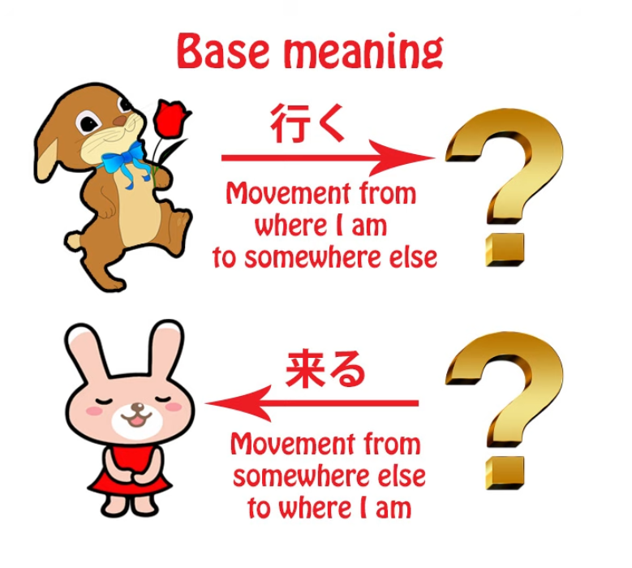
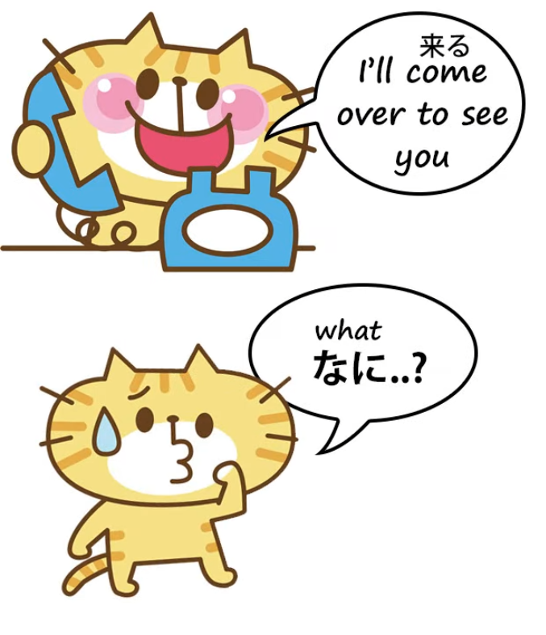
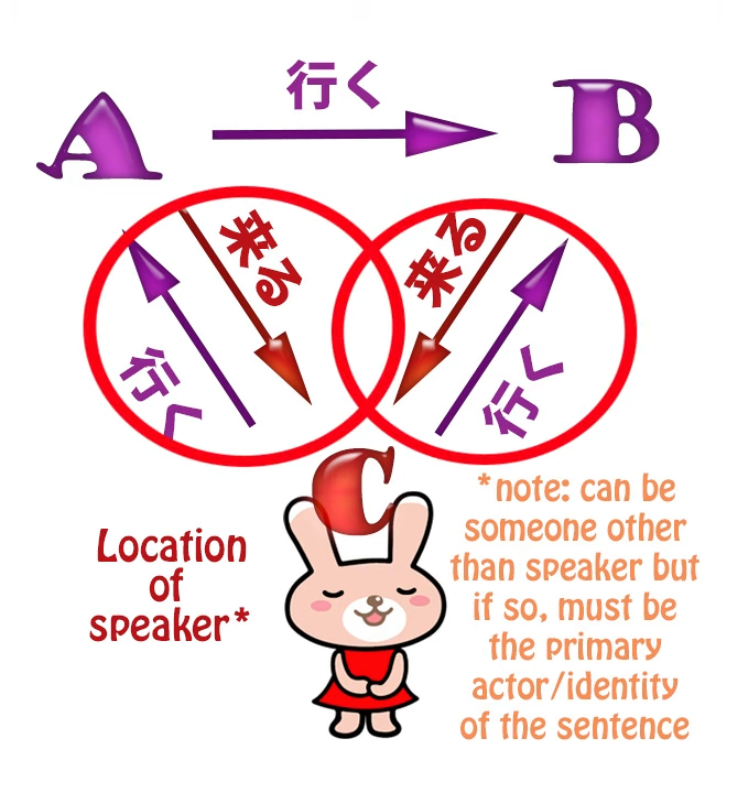
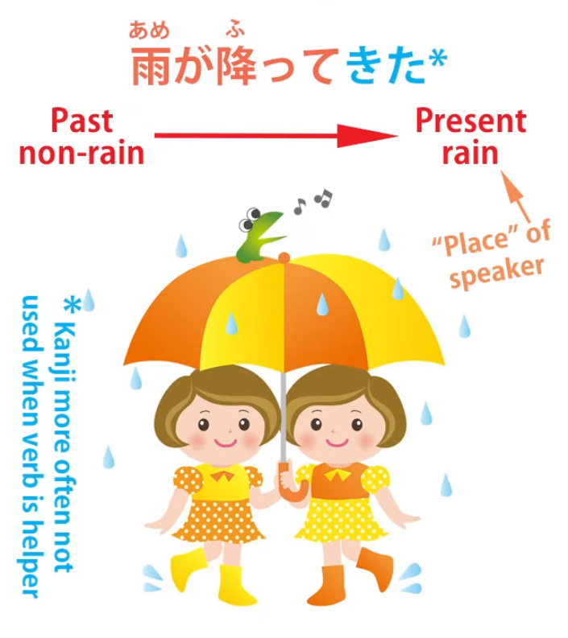
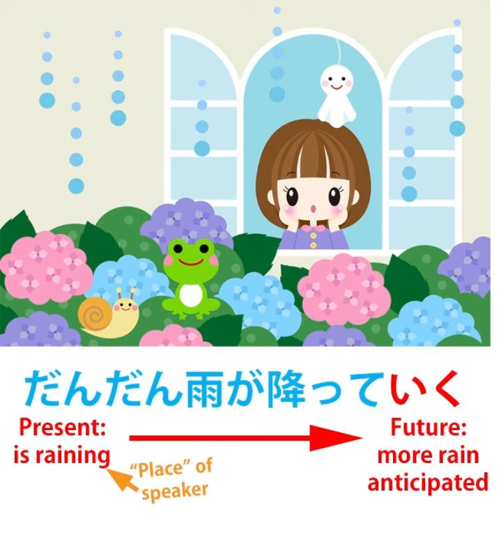
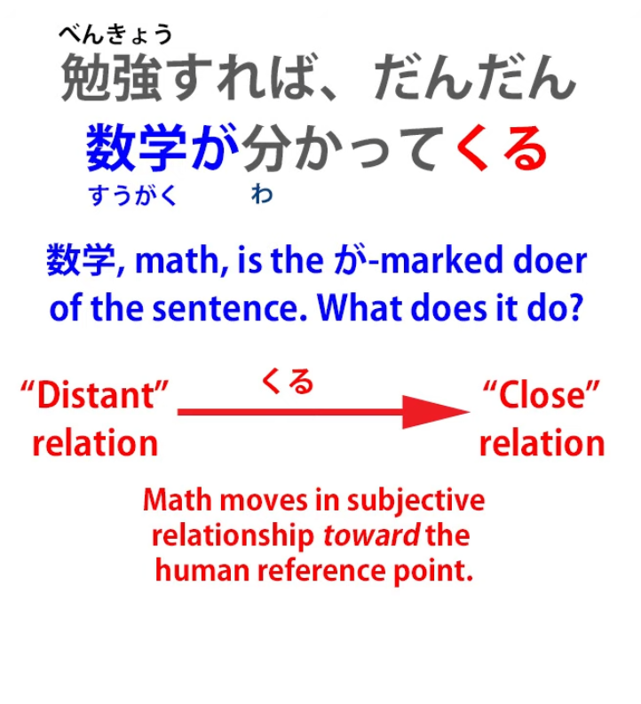
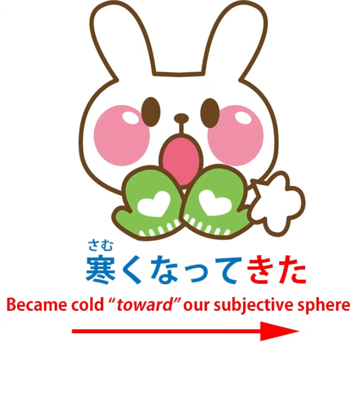
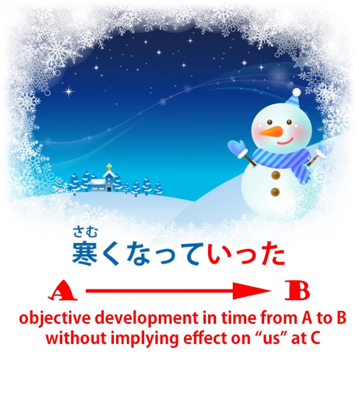
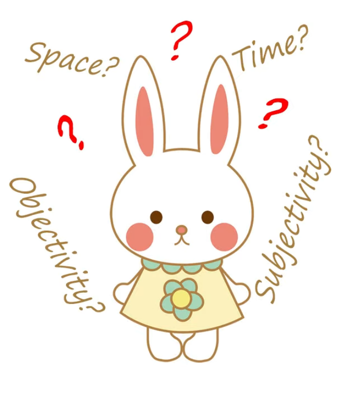

# **65. Coming and Going: Deeper secrets of 行く and 来る、て行くand て来る (te-iku, te-kuru)**

こんにちは。

Today we're going to talk about coming and going in Japanese.

Now, <code>行く</code> and <code>来る</code> are two of the first words we learn when we start learning Japanese,

and we learn that they mean <code>come</code> and <code>go</code>, and broadly they do.

But as we become more advanced we understand that it isn't quite that simple.

They have many metaphorical and more subtle meanings,

but even the physical meaning doesn't correspond exactly to English <code>come</code> and <code>go</code>.

Essentially, <code>iku</code> means <code>go from where the speaker is to somewhere else</code>,

and <code>kuru</code> means <code>come from somewhere else to where the speaker is</code>.

> 

Isn't that just the same as English <code>come</code> and <code>go</code>?

Well, not quite.

For example, we can say to someone on the phone <code>Shall I come over to see you?</code>

or you might say <code>Will you come to me, or shall I come to you?</code>

And in Japanese that's quite impossible, because you can't <code>come</code> to a place where you aren't.

<code>Coming</code> means coming from somewhere where the speaker is not

to the place where the speaker is.

So you can't say to someone on the telephone <code>Shall I come to you?</code> with <code>来る</code>.

You can only say <code>Shall I go to you?</code> with <code>行く</code>.

<code>Shall I go to you?</code> would sound strange in English,

so we see that <code>来る</code> and <code>行く</code> aren't exactly interchangeable with English <code>come</code> and <code>go</code>.

<code>来る</code> can only ever mean <code>move from where the speaker isn't to where the speaker is</code>.

<code>行く</code> is not quite so strict.

We can talk about someone <code>行く</code>-ing from A to B when we are actually at C,

but <code>来る</code> must always mean movement toward C, the place where we are.

And this is important to understand as we get into the more metaphorical meanings of <code>来る</code> and <code>行く</code>.

We've talked about some of the extended meanings in an earlier lesson but still physical ones,

especially those which [**involve connecting <code>来る</code> or <code>行く</code> to the te-form of a verb**](https://www.youtube.com/watch?v=PsTsliRe2Cg).

So <code>持ってくる</code> means <code>bring (to the place where I am)</code>;

<code>持っていく</code> means <code>take (from the place where I am)</code>.

But <code>the place where I am</code> can actually be a time or it can actually be a mental state of identification.

So we get more advanced meanings which are all based on the fundamental physical metaphor

of coming to the place where one is, going from the place where one is, or going from

or going one place to another (but not coming from one place to another because that isn't possible).

So, a very simple example is we may say <code>雨が降ってきた</code> --

and we have almost an equivalent English expression: we might say <code>It came on to rain</code>.

And the metaphor here is a time metaphor.

Rain came towards us in time, from a time when it wasn't there

to the time where we are, when the rain is there.

If we say <code>だんだん雨が降っていく</code>, we're saying <code>It's getting rainier and rainier</code>

and we're projecting into the future.

<code>いく</code> is moving from where we are into the future.

Now, since time, at least apparently, moves forward,

we can only use <code>いく</code> in the sense of moving forward in time,

away from us, away from the point where we are, not moving backward in time

away from the point where we are, because that isn't currently possible.

So, <code>雨が降っていく</code> in this case implies that it has become rainy (<code>降って来た</code>) and

that it's increasingly going to do so in the future.

Now, we can also use <code>くる</code> and <code>いく</code> in subtler ways still, concerned not with space or time

but with subjectivity, with our mental state.

So, a very common expression is <code>分かってくる</code>, which in English might be rendered as

<code>come to understand</code>, but this of course would be wrong.

Let's take an example of why.

We might say <code>勉強すれば、だんだん数学が分かってくる</code>

And that would be translated normally as <code>if you study, you will come to understand mathematics</code>.

And as you can see, if you've been paying attention, there's a contradiction here.

You can't come to a place where you aren't yet in Japanese.

You can't use <code>くる</code> to speak about

coming to somewhere that you aren't at this stage but will be in the future.

It would have to be <code>いく</code>, wouldn't it?

So why is <code>くる</code> used here?

Well, if you've followed this course you probably know the answer already.

<code>分かる</code> does not mean <code>understand</code>.

It means <code>be understandable / be clear</code> or literally what it actually means is <code>do understandable</code>.

So what we're in fact saying is that if you study, math will come to be understandable to you.

In other words, math will come from being far from you to being nearer to you and being understandable.

So we're using this in a subjective sense.

And this is an important thing to understand, and it's important to understand

that <code>くる</code> and <code>いく</code> can represent movement in time, toward one or away from one,

movement in space, toward one or away from one,

movement in subjectivity, towards one's mental condition or state or away from it,

but also <code>iku</code> can represent objectivity versus <code>kuru</code> representing subjectivity.

And the reason for this is something we've already covered,

which is that <code>iku</code> can mean moving from A to B while we are at C.

Therefore, <code>iku</code> can represent a movement from one place to another

that doesn't involve us, physically, temporally, or mentally or emotionally.

So, if we say <code>samuku natte kita</code>

we're saying <code>it became cold</code>, and adding that <code>kita</code> (<code>kuru</code>) is relating it to us:

<code>It became cold (coming toward me or us).</code>

So what we're saying is not just that it became cold,

but implying that it affects me or us subjectively: <code>Samuku natte kita</code>.

By contrast, <code>samuku natte itta</code> is more objective.

It doesn't involve us. It doesn't imply that it in any way affected me or us.

It just happened. It became colder.

Because this is the <code>itta</code> that in spatial terms is going from A to B, objectively, without involving me or us.

Now, you may be asking, "How do I tell when it's movement in space, when it's movement in time,

when it's movement in terms of mentality and subjectivity,

and when <code>kuru</code> and <code>iku</code> represent subjectivity versus objectivity?"

And the answer to that is: There aren't any rules

and we shouldn't be looking for rules in cases like this.

The reason we learn the ways that these work is not as an end in itself, not as a set of facts to learn,

but as an aid to understanding real Japanese.

As we immerse in Japanese, as we watch anime, read novels, play games in Japanese,

these things start to make sense.

What we need is the principles on which they're based,

which gives us a head start in making sense of them.

But structure is never going to substitute for immersion.

Structure is the underpinning that makes immersion quicker, and easier, and more understandable..
