# **66. HIDDEN Subjects in Japanese - and how to understand them**

[**HIDDEN Subjects in Japanese - and how to understand them | Lesson 66**](https://www.youtube.com/watch?v=GN_tGX0W-LE&list=PLg9uYxuZf8x_A-vcqqyOFZu06WlhnypWj&index=68&ab_channel=OrganicJapanesewithCureDolly)

こんにちは。

Today we're going to talk about the <code>hidden hand</code> in Japanese.

What do I mean by that?

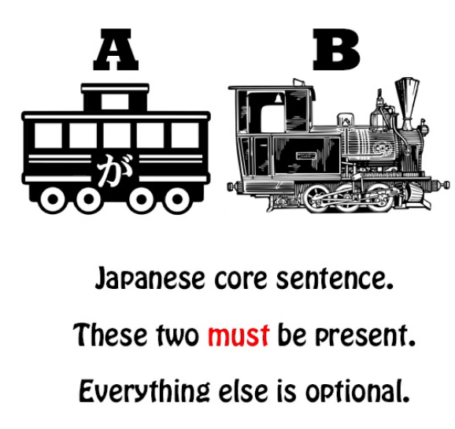

## No subject in Japanese?

Well, a number of people claim that Japanese has no subject.

And I think we've established beyond any doubt that Japanese not only has a subject

*(Lesson 9)* but that you can't have any Japanese sentence without a subject,

although you can't always see or hear the subject.

It can be a <code>zero-pronoun</code>.

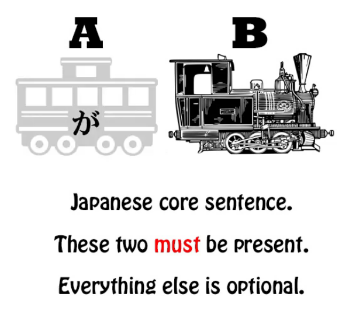

By subject, of course, I mean the A-car of a sentence.

And since every sentence is telling us either that <code>A is B</code> or that <code>A does B</code>,

Obviously we can't have a sentence without A.

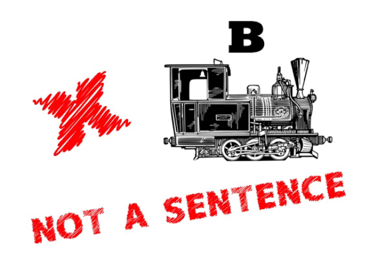

It's as simple as that.

However, there are times when not only can't we see the subject, the A-car,

but it can be difficult to work out what exactly it is.

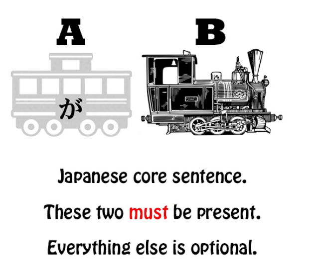

And this difficulty will be seen to derive from not fully

understanding how some aspects of Japanese work.

One thing we need to understand is that different languages have different expression-strategies.

## Different expression strategies

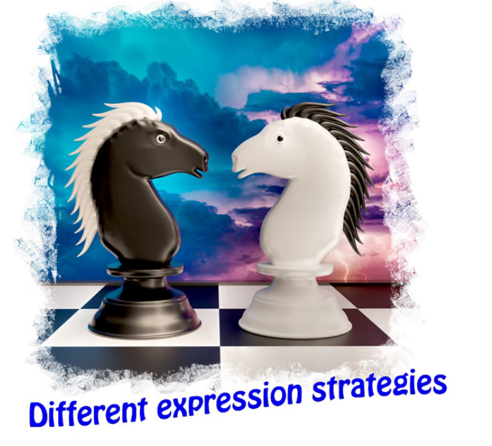

We know already how damaging it is to say that <code>コーヒーが好きだ</code> means <code>I like coffee</code>.

<code>I like coffee</code> is what we would say in English,

but English uses an entirely different expression-strategy from Japanese.

Liking is expressed by a verb, and the doer of the verb is the person who likes the coffee.

In Japanese, liking is expressed by an adjectival noun,

and the be-er of that adjectival noun is the coffee.

So the Japanese expression-strategy here is closer to the Spanish than the English,

although they're not identical.

Now, although languages have differing expression-strategies,

it turns out that languages, even when they're not related,

tend to have a relatively limited bag of tricks that they draw on.

So we find the same expression-strategies in different languages,

but not necessarily in the same places.

And also expression-strategies can vary in status between languages.

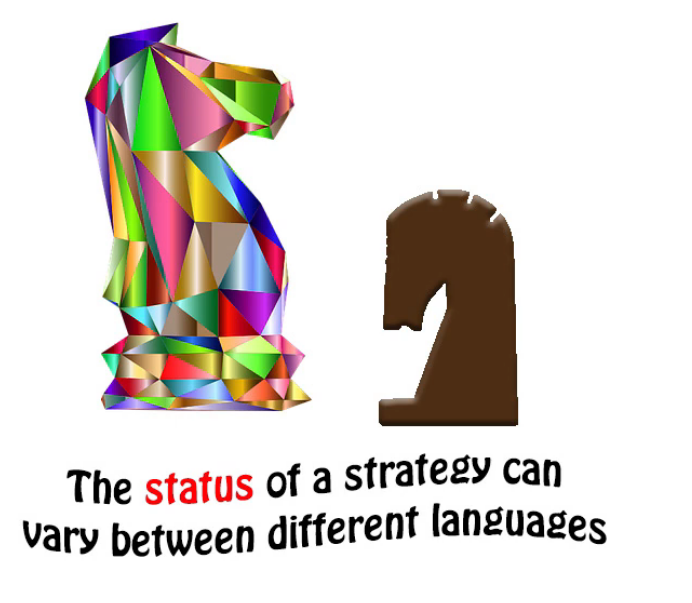

## Receptive helper

So, one of the reasons that English so-called <code>Japanese grammar</code>

misnames the Japanese receptive helper-verb as a passive conjugation or passive voice,

is that what it really is, while it exists in English, is not of very high status. *(Lesson 13)*

Because we use the receptive in English by using the word <code>got</code> under various circumstances

like <code>I got rescued by my big sister</code>, <code>The sandwiches got eaten by the dog</code> --

but this isn't considered good English.

Now, the fact that it isn't considered good English is simply a matter of fashion.

It's perfectly grammatical.

It just happens to be unfashionable or to hold low status in the language.

This is really just a historical accident.

Now similarly, other expression-strategies exist in Japanese that are not considered

of very high status in English and that can confuse us.

So, I'm going to take a sentence here which was put to me by one of my viewers,

who had considerable difficulty in disentangling what the subject of this sentence actually is.

And that's perfectly understandable, because until you understand this expression-strategy,

it's not entirely clear.

## Hidden subject sentence analysis

Now, the sentence comes from NHK News Easy,

which is a very good news service for beginners in Japanese.

And the sentence is: <code>東京オリンピック選手が食べる料理をみんなに教えてもらう</code>

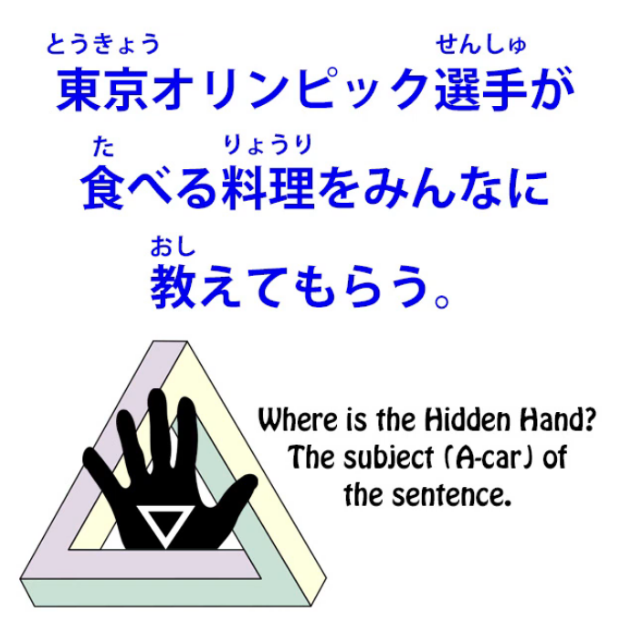

So, what do we think is the subject, the A-car, of this sentence?

Now, the first thing to do when analyzing a sentence is what I said in my video on sentence analysis *(Lesson 37)*,

which is that we need to see where logical clauses end within a sentence.

A logical clause which is functioning as a logical clause and not a descriptor or a helper to anything else can only end in two ways,  
either with a full stop, making it the end of a sentence,

or with a conjunction, marking it as the first logical clause within a compound sentence.

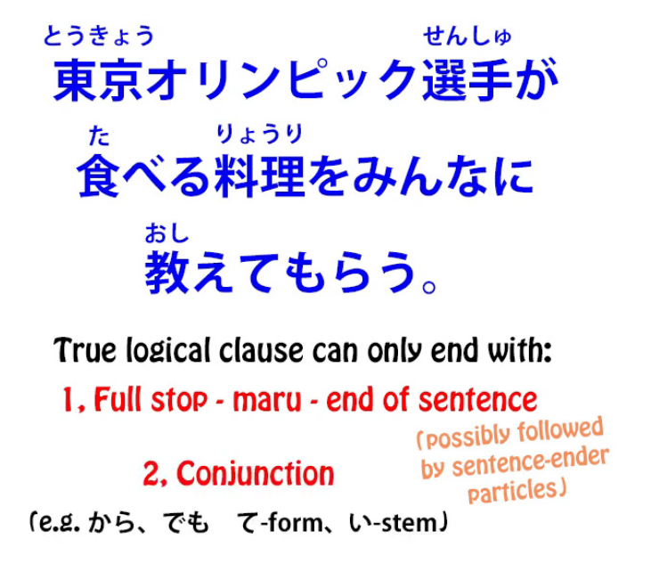

Of course, if it comes at the end of a sentence it may be followed by one or more sentence-ender particles,

but it has to be the final engine in the sentence: the final verb, noun-plus-copula or adjective.

So let's go through this in the manner that I've taught you in the past.

<code>東京オリンピック選手が食べる...</code>

Is that a logical clause? Well, it could be a logical clause, couldn't it?

It would mean <code>The Tokyo Olympic athletes eat.</code>

However, is it followed by a full stop, by sentence-ender particles with a full stop,

or does it end in some kind of a clause connector like <code>から</code> or <code>でも</code> or the て-form

or the い-stem of a verb?

No, it doesn't end with any of those, does it?

It's directly followed by a noun.

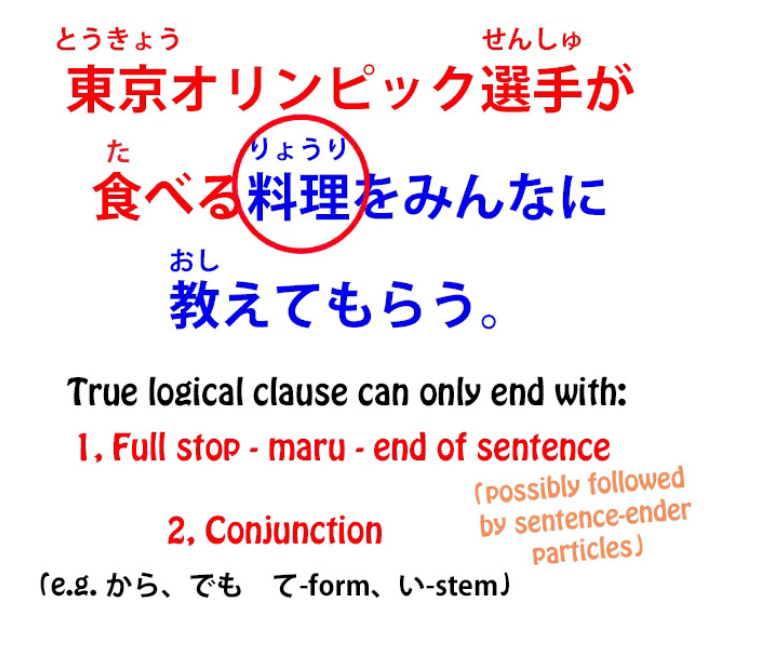

And, as we know, when a logical clause is directly followed by a noun,

what it's doing is modifying that noun.

In other words, it's not functioning as an active logical clause;

it's functioning as, essentially, an adjective, a noun modifier.

So <code>東京オリンピック選手が食べる</code> is all simply modifying <code>料理</code>.

It's just telling us more about the food.

So then we have: <code>...料理をみんなに教えてもらう</code>

Now, we still haven't arrived at the subject of the sentence, have we?

Because the subject of any sentence has to be marked with が.

The <code>選手</code> are marked with が, but we know they're not the subject of the sentence;

they're just helping to modify <code>料理</code>.

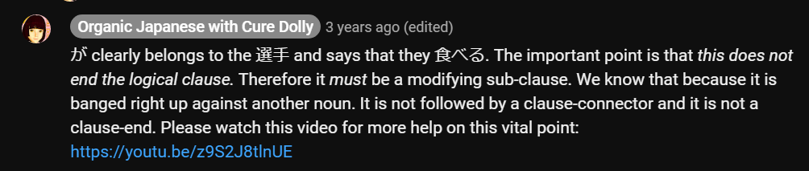  
::: info
Just put this here…the link is for Lesson 47. Check also Lesson 46.
:::
<code>料理</code> can't be the subject of the sentence because it's marked with を, not が.

<code>みんな</code> can't be the subject of the sentence because it's marked with に, not が.

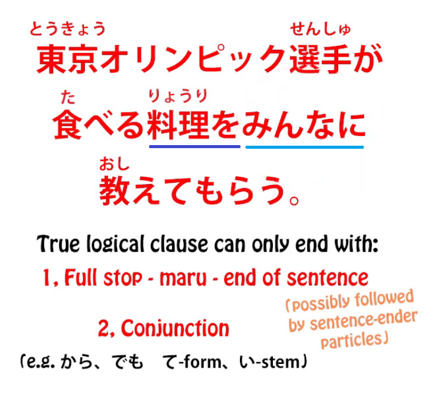

So what is going on here?

## Hidden subject sentence action 

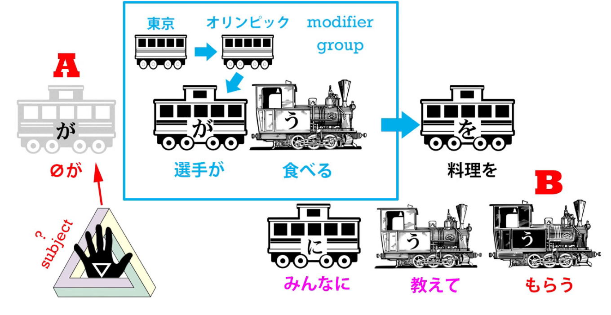

Well, what is the sentence actually saying?

It's saying that someone, the subject of the sentence,

whoever that may be, is having everyone teach or advise

them about the food the Olympic athletes are to eat.

Now, my questioner actually got this far,

but then was stumped by the question of who this unnamed person or people might be.

Could it be the athletes?

Well, that isn't likely, and we always have to consider likelihood in resolving any kind of ambiguity. *(Lesson 48)*

This isn't really an ambiguous sentence

but the context makes it pretty clear that it's not the athletes.

First of all, by default these <code>-てもらう</code> sentences mean that

somebody actively had someone else do something. *(Lesson 49)*

So the person doing <code>もらう</code> *(the A zeroが subject)* is getting *(the B train - もらう)* the person *(みんなに)* doing the て-formed verb to do that て-formed verb *(教えて)*.

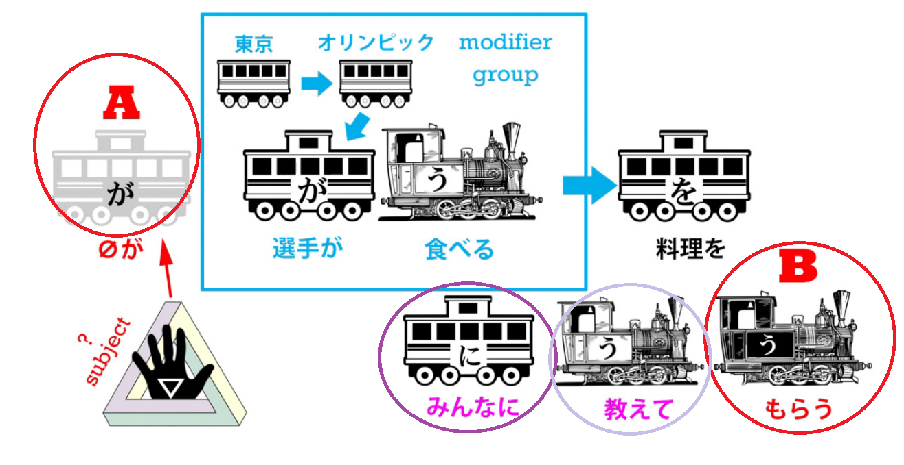

So if we say <code>お医者さんに見てもらう</code>, we're saying <code>have the doctor look at me</code>.

So someone is having everybody teach them or give their opinions on what the athletes should eat.

Is this likely to be the athletes? Well, not really.

Are they likely to be getting together and asking everybody what they should eat?

### Who is the subject here?

So who is it?

Who is the が-marked zero-pronoun, the subject, the A-car of this sentence?

And the answer is, it is simply an undefined zero-pronoun.

Now, that might seem very strange, but in fact it isn't.

As a matter of fact, we use it all the time in English.

But you would never see it in a newspaper or a news service the way it is here,

which is what's confusing about it.

So when do we use an undefined pronoun like this?

Well, let's think about it.

Suppose someone said <code>I hear they're putting a man on Mars next year.</code>

Well, who's <code>they</code>?

Well, we don't know who <code>they</code> is.

Presumably whoever it is that puts men on Mars -- NASA or Mr. Musk, or somebody.

Now, suppose I say

<code>They're getting everyone's opinion on what the Olympic athletes should eat.</code>

Well again, somebody might well say that in English.

You wouldn't see it in the newspaper, but a friend might well say it to you:

<code>You know, they're getting everybody's opinion on what the Olympic athletes should eat.</code>

Who's <code>they</code>? Well, we don't really know.

Whoever it is that's responsible for feeding the Olympic athletes, presumably.

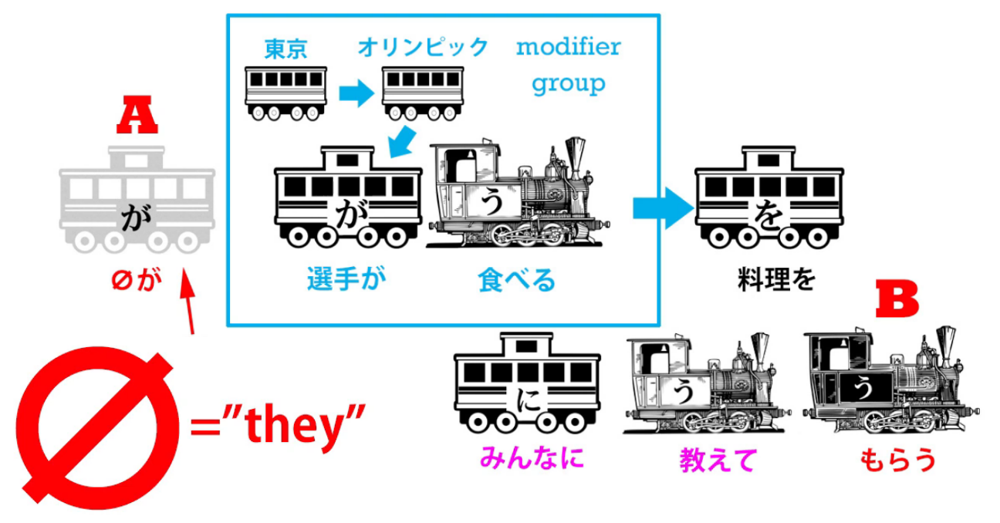

And this is a construction that you'll see quite often in Japanese,

this unnamed <code>they</code>, whoever they might be.

You hear it in English all the time but it's of low status.

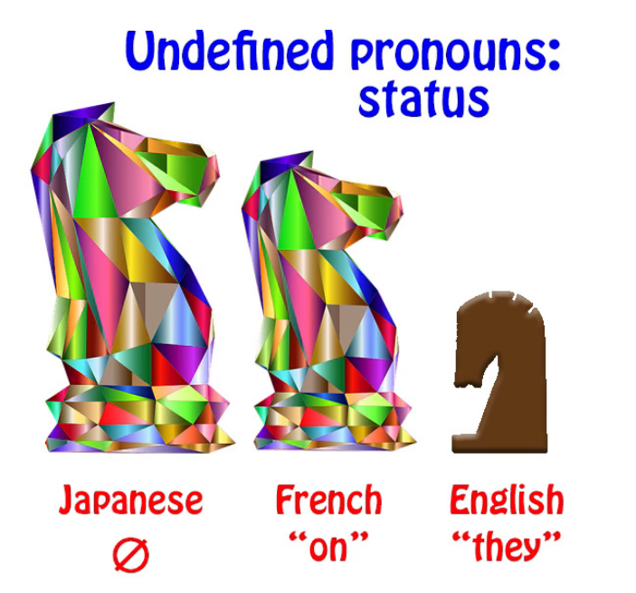

You won't see it in official documents or newspapers or anything like that.

You only hear it in relatively casual speech.

In French you might hear it more often.

<code>On</code> (they, one) can be used more generically at a higher level of discourse than it can in English.

So once we know this, it's easy enough to pinpoint the subject of this sentence.

And it's an important thing to know because we're going to come across this kind of construction

relatively often in Japanese.
