# **67. もう and まだ the time-relations that make sense of them**

[**もう and まだ the time-relations that make sense of them (mou and mada) Lesson 67**](https://www.youtube.com/watch?v=sBhD_Z5_pHw&list=PLg9uYxuZf8x_A-vcqqyOFZu06WlhnypWj&index=69&ab_channel=OrganicJapanesewithCureDolly)

こんにちは。

Today we're going to talk about <code>もう</code> and <code>まだ</code>,

two expressions which can be a little confusing, particularly <code>もう</code>.

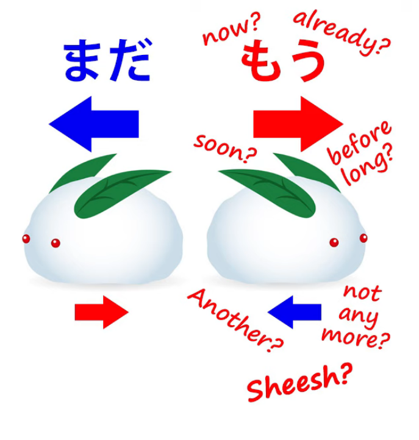

If we look up <code>もう</code> in a Japanese-to-English dictionary,

we get told that it means <code>now, already, soon, before long</code>

and sometimes even <code>not any more</code>, as well as meaning

<code>another</code> and being an expression of annoyance.

How can it mean all these different time relations at the same time?

Well, we're going to find out today.

And we're going to see that it's not nearly as confusing as it looks.

But first of all I want to look at <code>まだ</code>, which is a bit less confusing

but will give us the principles we need for understanding how <code>もう</code> really works. All right.

## まだ

So, <code>まだ</code> has a less confusing collection of definitions.

Mostly we're told that it means either <code>still</code> or <code>not yet</code>.

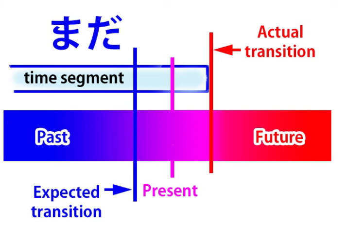

So let's start by looking at what it really does mean, what it really does.

<code>まだ</code> does a number of things.

It tells us about the present time.

It situates the present time inside a time segment that stretches back into the past

and is either expected to end or at least the possibility of its ending is being considered.

Most often it's expected to end.

Now, this does three things. It tells us about the present,

so we can say that it is in fact a way of saying <code>now</code>,

but <code>now</code> in a particular relation to the past and the future.

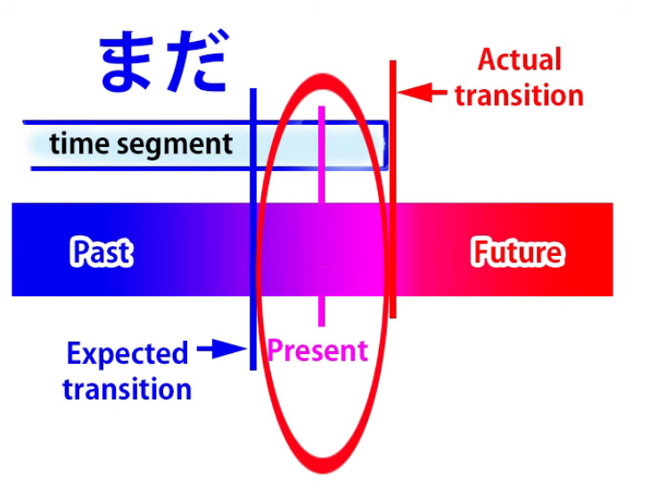

What is that relation?

Well, as you see, we have two things.

We have the section of time in which <code>now</code> lies

and we have a transition point.

Since it's a section of time, it can't go on forever,

so there's a transition point at which it changes to

another section of time with other qualities

that is expected in the future

or at least considered as a possibility in the future.

Now, <code>まだ</code> gives us two contrasts.

The section of time is contrasted with the future when it will or may change, but

the present moment is contrasted with the past when it might have been expected to change.

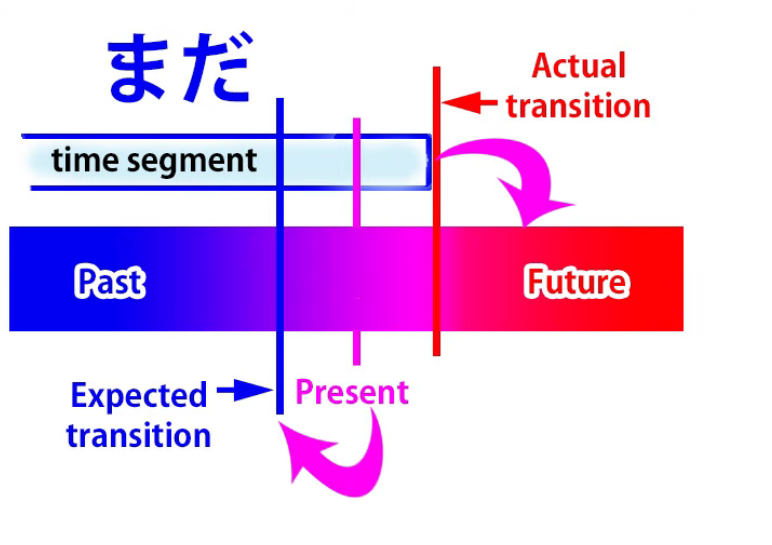

So what this means in English is essentially <code>still</code>.

And this may seem a bit abstract, but

I think we'll understand it clearly enough when we see how it works.

So, if we say <code>宿題はまだしなかった</code>,

we're saying <code>I haven't done my homework yet</code>

or <code>I still haven't done my homework.</code>

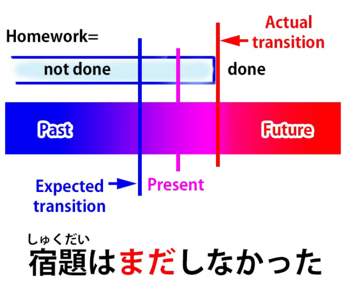

Now, as you see, this means that we are in a section of time where I haven't done my homework.

This stretches back into the past and is contrasted

with a period in the future where I will have done my homework.

But the present time is being contrasted

with a time in the past where I might have or should have done my homework.

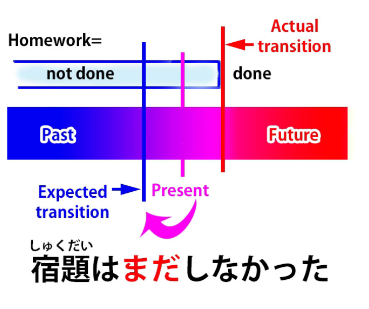

That's why we say <code>まだ</code> and that's why in English we would say <code>still</code> or <code>haven't yet</code>.

In other words, there's a time in the past where it might have been expected to happen, but it hasn't.

So it's still in a state which won't change until the future.

And this is what we mean by terms like <code>still</code> and <code>yet</code> in English.

If we say <code>さくらはまだ若い</code>, we're saying <code>Sakura is still young.</code>

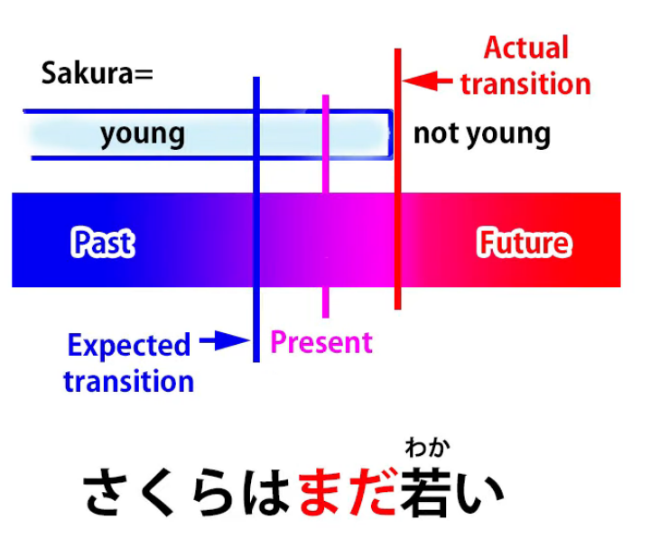

Now again, what we're saying is that  
the present time is situated in a period where Sakura is young,  
that period stretches back into the past and is expected to change at some time in the future.

She won't be young forever, she'll get older.

So we can see that the time period while Sakura is young is contrasted

with the future when she will get older.

But the present moment is being contrasted with the past.

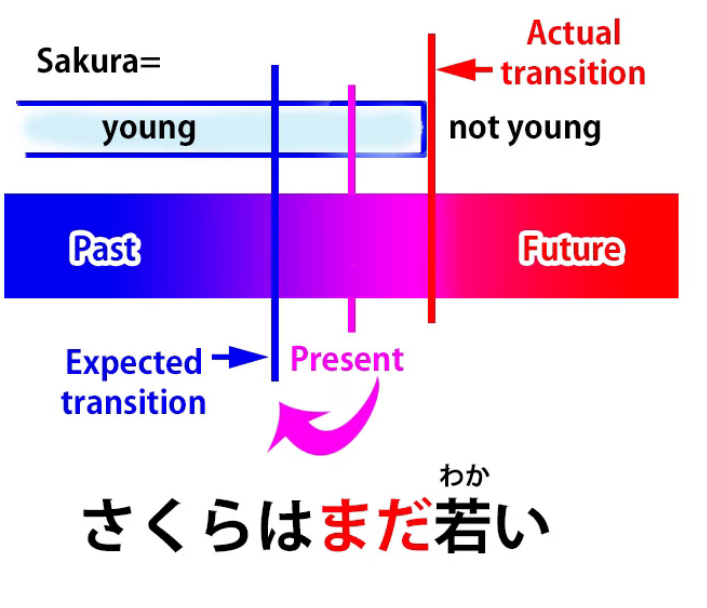

That's why we say <code>まだ</code> or why in English we would say <code>still</code>.

What we're saying is <code>She hasn't stopped being young yet</code>.

As opposed to the possibility that she stopped being young in the past,

she hasn't stopped being young in the past -- she's still young now,

even though she won't be young in the future.

If we say <code>さくらはまだ大人ではない</code>,

we're saying <code>Sakura is not yet grown-up</code>.

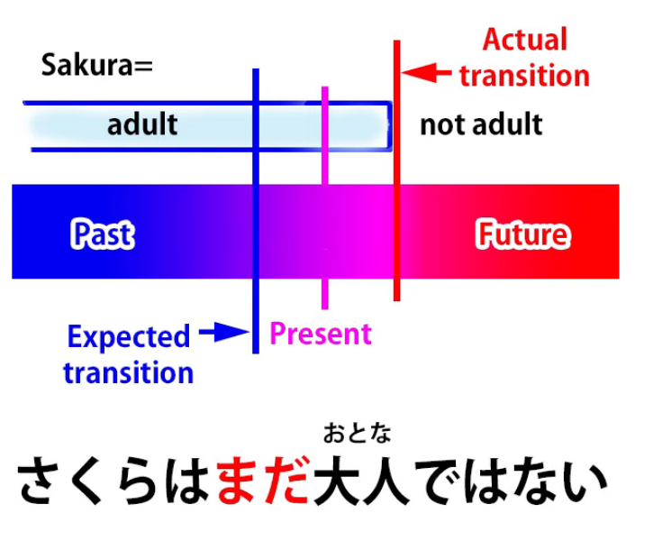

So now we're using the negative, and that's why <code>まだ</code> can mean <code>still</code> or <code>not yet</code>.

It just depends, at least in this case, on the fact that it's being used with a negative.

So, if we say <code>さくらはまだ大人ではない</code>,

we're saying that at the present period Sakura isn't grown-up.

Even though you might have thought she'd grown up a little while ago, she hasn't.

But of course she will grow up in the future.

As you can see, the reason why it gets translated both as <code>still</code> and <code>not yet</code>

is because Japanese puts things a little bit differently from English.

In English we say <code>Sakura is not yet grown-up</code>.

But in Japanese what we actually say is <code>Sakura is still not grown up</code>.

However, for <code>まだ</code> to mean <code>not yet</code> we don't have to have an explicit negative.

For example, if someone says to you

<code>日本語は上手いね</code> -- <code>Your Japanese is very good, isn't it?</code>

Well, Japanese people tend to say that even if you can stagger out <code>こんにちは</code>.

And even if your Japanese really is very good,

you'll probably reply <code>いえまだまだです</code>.

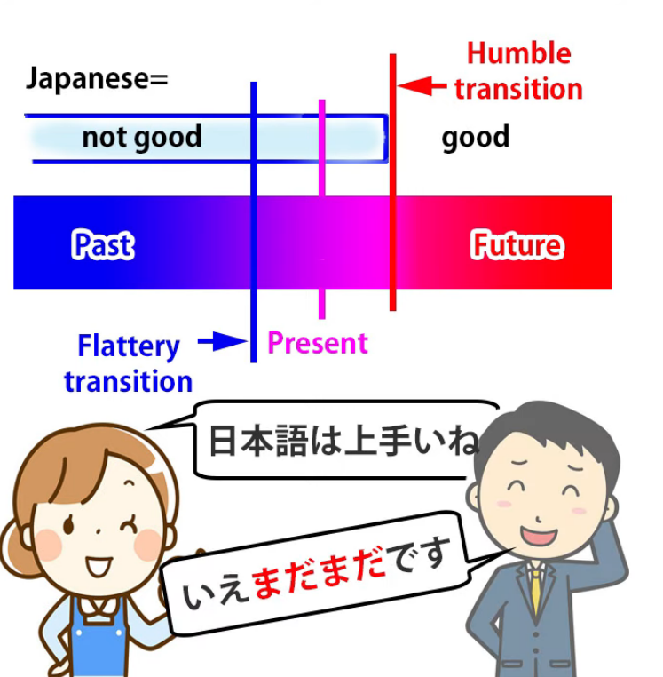

<code>まだまだ</code> in this case means <code>not yet</code>.

In other words, we're still in the time period where my Japanese isn't good.

The change didn't take place in the past, as you are saying;

it will have to take place in the future.

And just a little cultural note
In the West it can sometimes be considered a bit rude
to contradict someone who's said something nice to you,

but in Japanese we do that all the time.

It's considered a bit arrogant not to.

## もう

Now, let's move on to <code>もう</code>, where we get a few more apparent complications,

but they aren't really complications, as we're going to see.

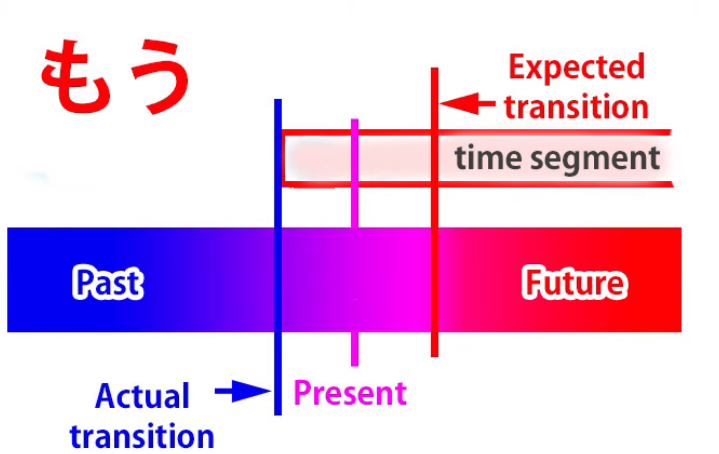

<code>もう</code> is essentially the opposite of <code>まだ</code>.

The best translation for it in English is that it means <code>already</code>.

What it means is that we are now in a time segment stretching forward into the future.

So, just the other way around from <code>まだ</code>.

The time segment is compared to the past when the current conditions didn't prevail

and now is compared to the future when the transition might have been expected to happen,

but in fact it's already happened.

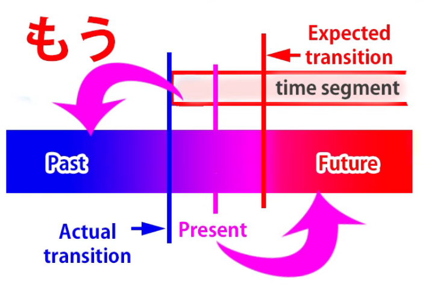

So if someone says <code>宿題をしなさい。</code> (<code>Do your homework!</code>),

you might reply <code>もうやったよ</code> (<code>I already did it</code>).

So what we're saying is

we are now in the time segment where my homework is done, I've done it,

and the transition isn't going to happen in the future, as you might think;

It's already happened in the past.

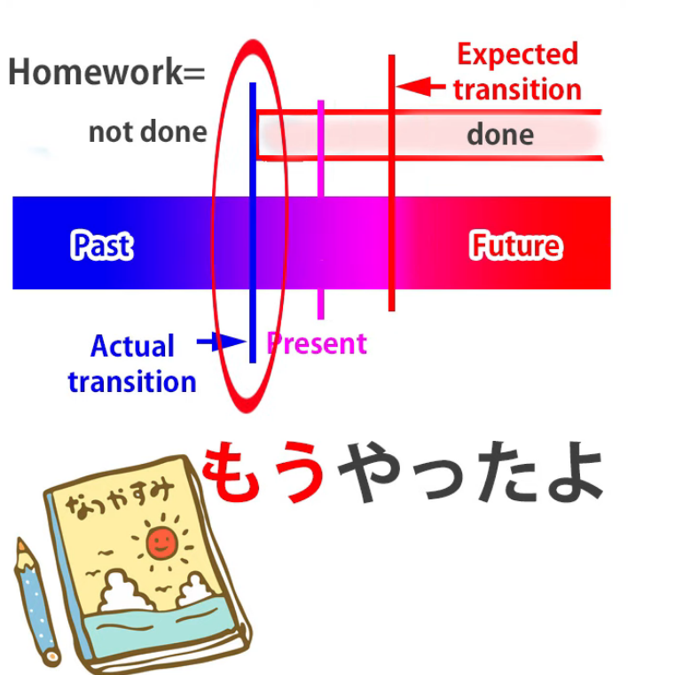

So why is it sometimes translated as having different meanings from <code>already</code>, such as <code>now</code>?

Well, as we've seen, both <code>まだ</code> (<code>still</code>) and <code>もう</code> (<code>already</code>) are in fact species of <code>now</code>.

We're talking about now.

We're just making different contrasts with the past and the future when we talk about now.

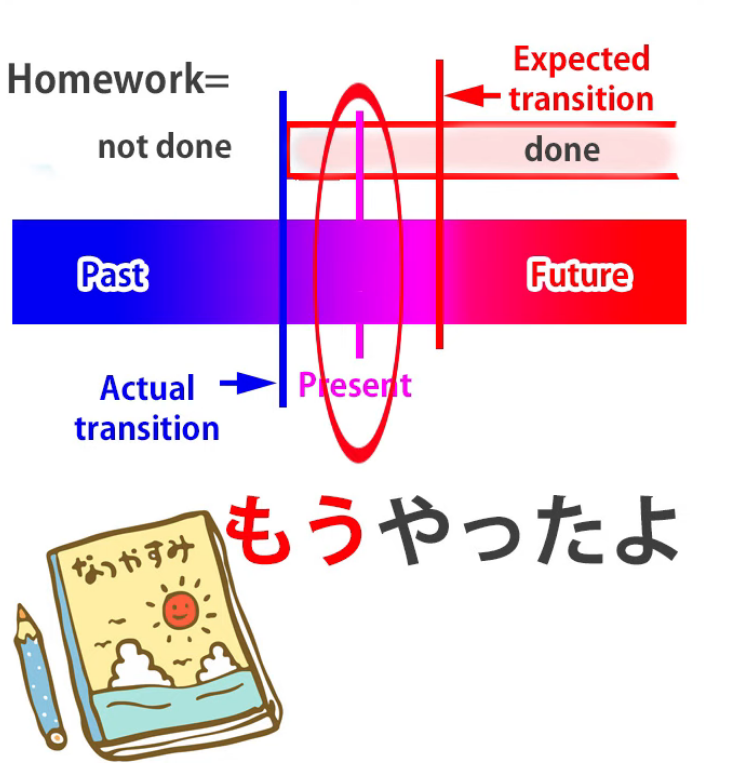

So, of course, <code>もう</code> does mean <code>now</code>, just as <code>already</code> does.

But because words in different languages very rarely

occupy exactly the same stretch of the [**meaning spectrum**](https://www.youtube.com/watch?v=CpiELpGR-VU&ab_channel=OrganicJapanesewithCureDolly),

sometimes we use <code>もう</code> in places where we would use <code>now</code> in English.

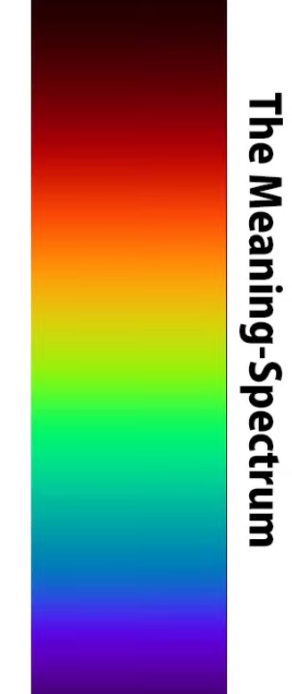

And because J-E dictionaries are Anglocentric

they will try to translate <code>もう</code> as meaning <code>now</code> in those cases.

So, for example, if you've hurt yourself and you're getting up and somebody says <code>大丈夫?</code>

and you reply <code>もう大丈夫</code>,  
how you would translate this into English is usually <code>I'm all right now</code>.

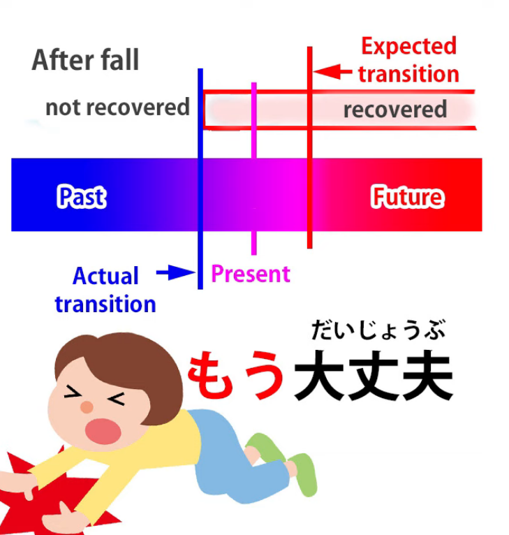

In English you wouldn't usually say <code>I'm already all right</code>.

Now, in Japanese you could also say <code>今大丈夫</code>, which also means <code>I'm all right now</code>,

but when you say <code>もう大丈夫</code> you're specifically adding the nuance that,

while you weren't all right before, you are now,

as opposed to at some time in the near future, all right.

In other words, you don't need any more time to recover, you're okay.

In English, we don't use <code>already</code> for that.

Logically we could, but in practice we usually don't.

Now, it's perfectly true to say that <code>もう</code> is also used as an expression of annoyance or exasperation: <code>もう!</code>

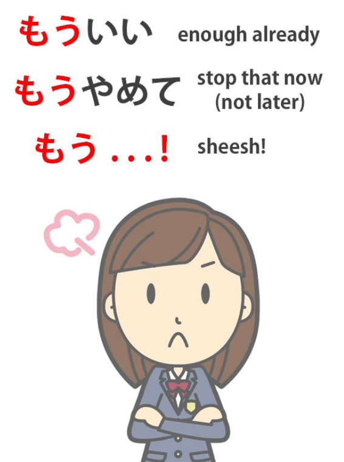

And it compresses all kinds of complaints or grumbles, or it can just be on its own: <code>もう!</code>

How does that work?

Interestingly, <code>already</code> can in some circumstances have a little bit of that kind of nuance in English.

So, if someone says <code>Enough already!</code> what they mean is,

at this point, as opposed to at some point in the future, I'm fed up with it.

And that's really what <code>もう!</code> tends to mean in Japanese. So that's really simple enough.

### Second もう?

However, there is one aspect of <code>もう</code> which is a tiny bit confusing until you understand it,

and that is that there are really two words <code>もう</code>.

Now, this may be a little bit controversial, but in fact in pitch-accent dictionaries

they're actually given two different accentuations,

one for the <code>もう</code> that we've been talking about, the one that means <code>already</code>,

and one for another <code>もう</code>, which is quite close in many respects

and I'll explain why it's quite close later.

But first of all let's look at the area where it isn't so close.

This second <code>もう</code>, I think, is ultimately related to the particle <code>も</code>

and it has the same additive kind of meaning of <code>another</code>.

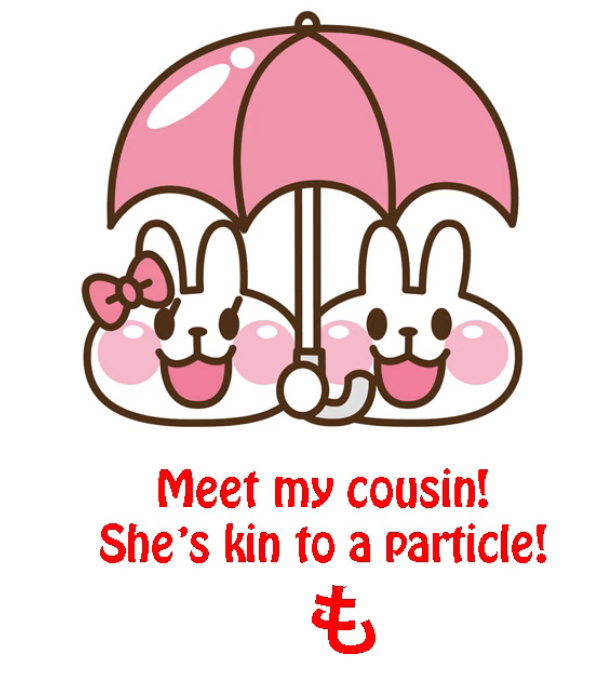

So if we say <code>もう一つ</code>, we're saying <code>another one</code>.

If we're saying <code>もう一人</code>, we're saying <code>another person</code>.

So, when we put it like that, we can see

we're really dealing with two separate words, two separate concepts.

Now, it then becomes a little bit more confusing, and I'm going to tell you why.

It even confuses Japanese people,

who actually don't do this pitch accent thing right in many cases,

because the idea that they are two different words

often gets rather lost even by Japanese natives.

And the reason for that is that there are many cases where they get pretty close.

Why? Well, as we've seen, <code>もう</code> tells us about a time relation,

it's a time-related word, and it means <code>already</code>.

And also the dictionaries tell us that it means <code>soon</code>.

Why do they say that it means <code>soon</code>?

Well, it doesn't mean soon on its own, but it means <code>soon</code> in certain combinations.

So, for example, if we say <code>もうすぐ</code>, which means <code>soon</code>, what we're really saying is:

<code>すぐ</code> means <code>soon</code> and <code>もう</code> means <code>already</code>, so that <code>もう</code> is emphasizing the <code>soon</code>:

it's already soon, it's not going to be soon at some point in the future, it's soon right now.

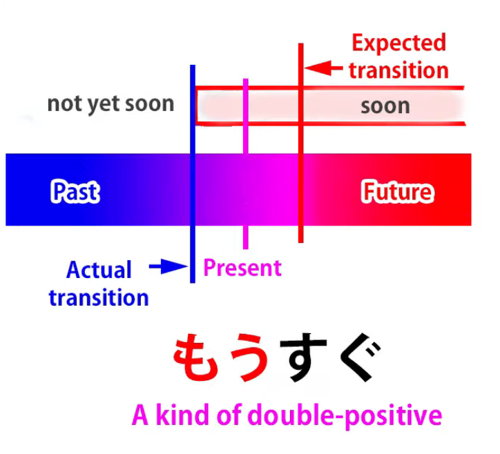

Now, we can also say <code>もう少し</code>.

For example, if some people are walking somewhere and they've been walking for a long time

and they're getting tired, someone might say <code>もう少し!</code>

which means <code>just a little more / just a little extra</code>.

And it could mean <code>just a little more effort</code>, but it can also mean <code>just a little more time</code>.

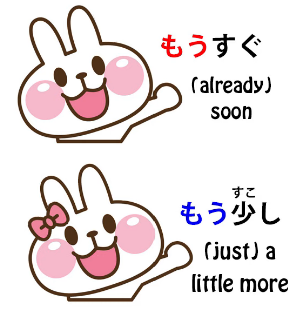

So, you see, <code>もうすぐ</code> and <code>もう少し</code>, even though they're different words <code>もう</code>,

under some circumstances have a very similar meaning.

And the other <code>もう</code>, the additive <code>もう</code>, also is often used to express time relation.

So if we say <code>もう一度</code>, we're saying <code>one more time</code>.

Now obviously this means very much the same as it means when we say <code>もう一つ</code>,

which means <code>one more thing</code> -- one more candy, one more anything.

But it also is very often used with <code>一度</code>: one more time.

<code>もう二度来ない</code> means <code>I'll never come again</code>, literally <code>I won't come for another second time</code>.

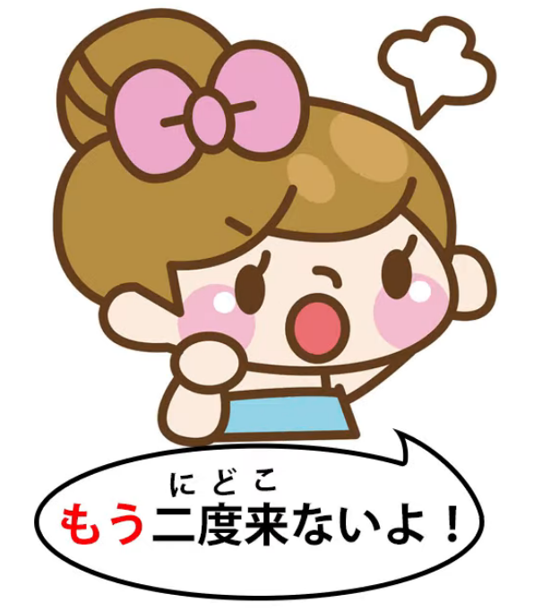

So we can see that the two <code>もう</code>s tread fairly closely toward the same territory.

They can both be used for time relations and in a few contexts,

like <code>もう少し</code> and <code>もうすぐ</code>, the meaning is almost identical.

But once we understand the two and how they work,

I don't think there's going to be any more room for confusion…

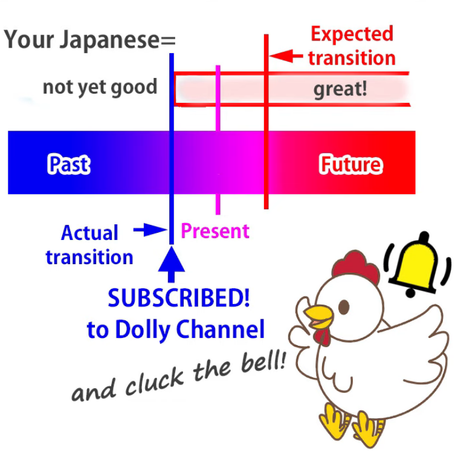

::: info
Will add this here:*  
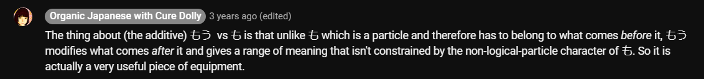
:::
