# **68. Japanese <code>underlying logic</code>: わけ、そういうわけ、わけが分からない、わけない**

[**Japanese <code>underlying logic</code>: わけ、そういうわけ、わけが分からない、わけない | Lesson 68**](https://www.youtube.com/watch?v=iU79wvDyDfk&list=PLg9uYxuZf8x_A-vcqqyOFZu06WlhnypWj&index=70&ab_channel=OrganicJapanesewithCureDolly)

こんにちは。

Today we're going to talk about <code>わけ</code>,

which is a Japanese word that can cause quite a lot of confusion

because it's used in a variety of different ways and situations in Japanese

and in English dictionaries it has a whole string of definitions

that seem particularly disjointed and confusing.

However, once we understand the real logic, the underlying meaning of the word,

it all falls into place rather nicely.

So, what is <code>わけ</code>?

## わけ/訳

First of all, let's look at the English dictionary definition.

In the online dictionary it says <code>わけ</code> means "conclusion from reasoning;

judgement or calculation based on something read or heard;

reason; cause; meaning; circumstances; situation".

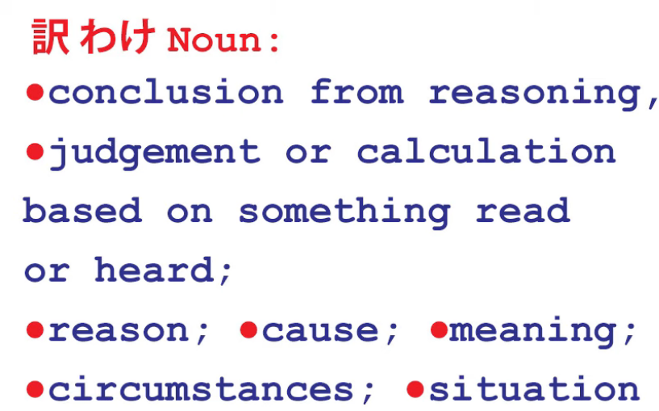

So, what does it actually mean out of all that?

Well, for a nice change the dictionary actually agrees that it's a noun.

<code>わけ</code> is a noun, so what kind of a noun is it?

What is a <code>わけ</code>?

Well, let's look a bit at the history of the word.

Originally, <code>わけ</code> meant <code>divide or separate</code>.

So it's connected with <code>分ける</code>, which is a verb meaning <code>divide or separate</code>,

and also, more importantly for our present purposes,

<code>分かる</code>, which also fundamentally means <code>divide or separate</code>

but in the sense of <code>break down, or analyze</code>.

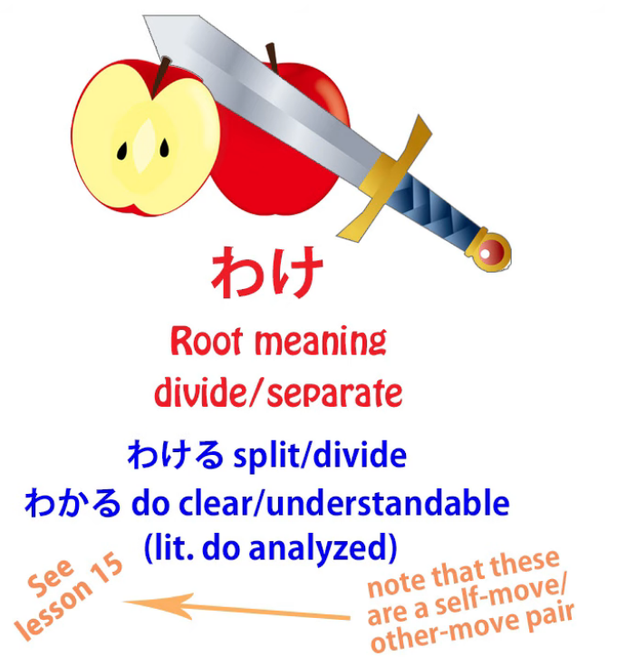

So, when we say <code>本が分かる</code>, as I've pointed out in previous lessons,

we're not in fact saying <code>I understand the book</code>;

we're saying <code>the book does understandable or does clear</code>.

We could say in English <code>The book is clear to me</code>,

but in fact it's not an adjective, it's a verb -- <code>the book does clear (to me)</code>.

But when we say <code>clear</code> we are using slightly the wrong metaphor

if we want to go into the actual etymology of the word.

<code>Clear</code> is a metaphor, obviously, from seeing.

But the real metaphor that underlies <code>分かる</code> is being broken down into constituent parts,

being analyzed or analyzable. *(check Lesson 59)*

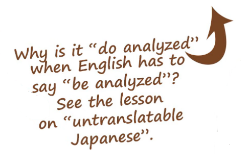

And that's what <code>わけ/訳</code> means here.

Now I know some of you may be thinking <code>but it's a different kanji</code>.

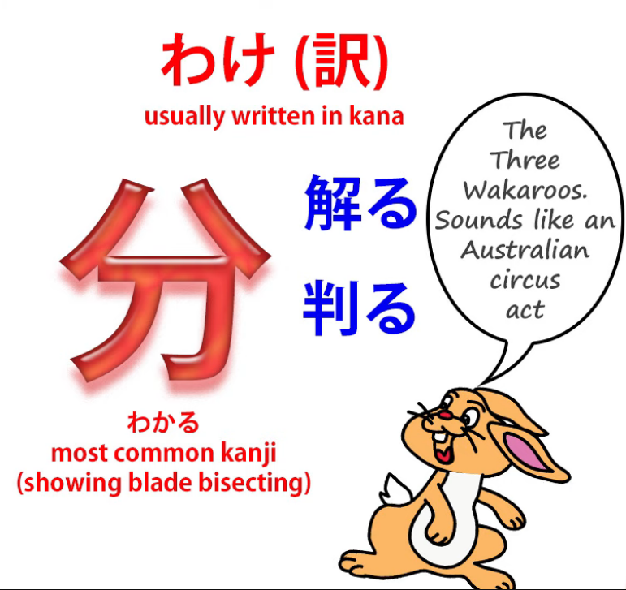

Well, that's true. We usually associate <code>分かる</code> with this kanji,

but in fact you can write the word <code>分かる</code> with three different possible kanji

and they all have slightly different implications -- *分かる*, *解る*, *判る*

and I've [**written an article**](https://www.youtube.com/watch?v=6bI_WLm8Jmo&ab_channel=OrganicJapanesewithCureDolly) *(it is a video actually)* about that if you're interested,

so I'll put a link in the information section below *(what is linked is a video).*

The point is that <code>わけ / 分かる</code> is not tied to any one kanji.

It's a fundamental Japanese word that goes back further than the kanji used to represent it,

and the fundamental idea in all these cases is the same:

the idea of separation, division, analysis, breakdown.

So, what actually is a <code>わけ/訳</code>?

Let's take the most prominent English definitions, which are: cause, reason,

and conclusion based on something we've seen or heard.

Now, let's note that cause, reason, and conclusion generally speaking refer to the same thing.

The main difference is whether the process is going backward or whether the process is going forward.

Let's take an example.

If I say <code>Sakura was out in the rain, and therefore she's wet</code>,

we are taking two known facts and stating the causal, the reasoning, connection between the two.

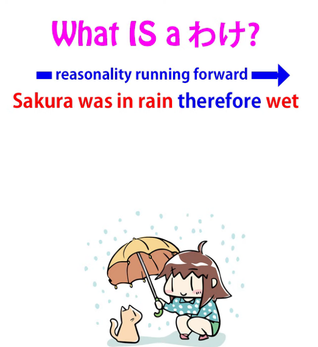

If I say <code>Sakura is wet and therefore I reason that she was out in the rain</code>,

we're taking exactly the same piece of reason, the same causality, and working in the other direction.

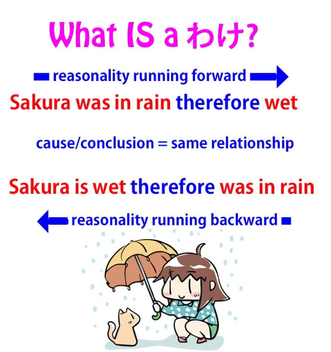

We're working from one known fact to another unknown fact that we use the reasoning to arrive at.

But that piece of reasoning, that causal link, that fundamental underlying reasonality,

is the same in both statements.

In one case we're working it forward, in the other case we're working it backward,

but that fundamental underlying causal logical reasonality, to coin a phrase, is the same.

And I coined the phrase <code>reasonality</code> because there isn't really a word for this in English.

But in Japanese there is, and the word is <code>わけ/訳</code>.

So <code>わけ</code>, as we see, expresses a cause, a reason,

and a conclusion or a logical judgement -- all of those things.

What it really expresses is the underlying causality or reasonality,

and when the dictionaries say that it also expresses a circumstance or situation

or something like that, in fact it doesn't really do that,

but what it does is express the underlying reasonality of a circumstance or a situation.

And once we understand that, we can start to understand the different ways in which <code>わけ</code> is used. So, it's used to give a reason.

## そういうわけ

So, if someone says

<code>そういうわけでベッドの下に隠れた</code> -- *By so-said reasonality I hid under the bed*

<code>that's why I was hiding under the bed</code> -- that's the reason.

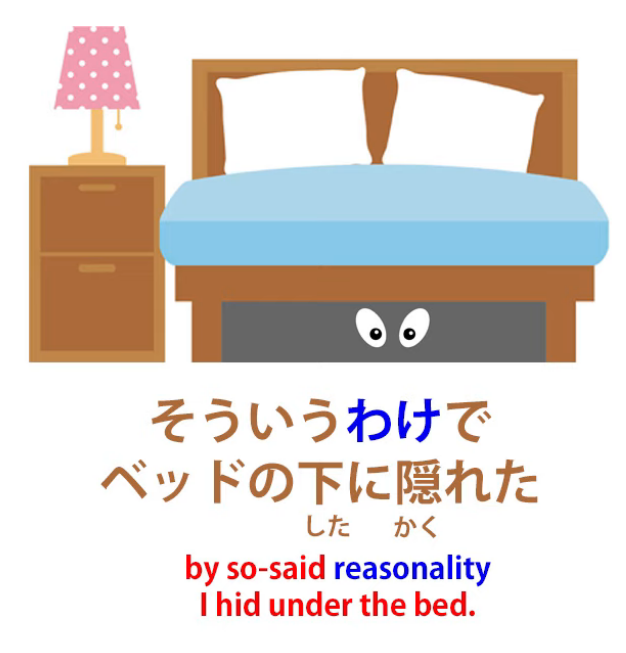

If we find out the solution to what seemed like an impossible crime,

we say, <code>そういうわけでした</code> -- <code>so that's how it happened</code>.

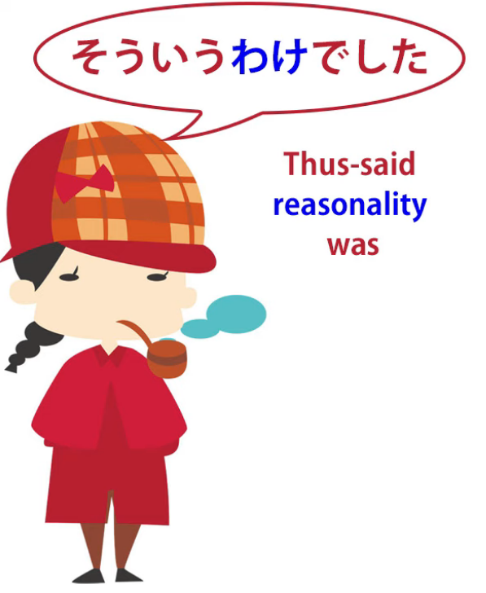

And we're not actually talking about the fact of the crime,

the circumstance of the crime, the situation of the crime;

we're talking about the reasonality that at first seemed completely obscure

and now we've understood.

And if you notice, in this phrase we say <code>そういうわけでした</code>, in the past tense.

It's not because my reasoning happened in the past.

My reasoning might be happening right now.

But it's because the underlying reasonality of the event happened at the time of the event,

and that's what we're talking about.

If we say <code>そんなわけで宿題を忘れました</code> – *By such a reasonality I forgot my homework*

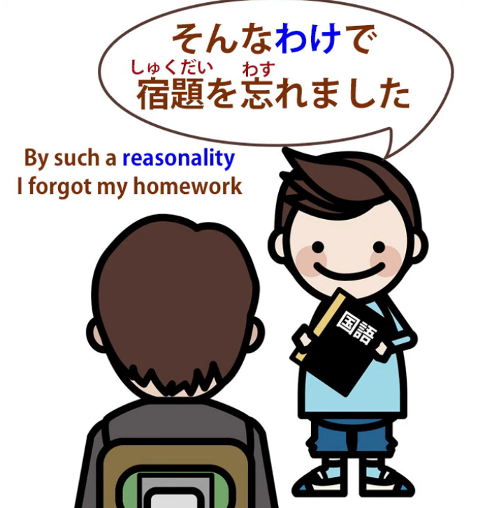

we're saying <code>that's why I forgot my homework</code>,

that's the reason, the causal link that tells us why it was

that I forgot my homework and why you shouldn't blame me.

## わけが分からない / 訳が分からない

Now, <code>わけ</code> is used in a lot of negative uses that are very important in Japanese.

One that you'll commonly hear is <code>わけが分からない</code>.

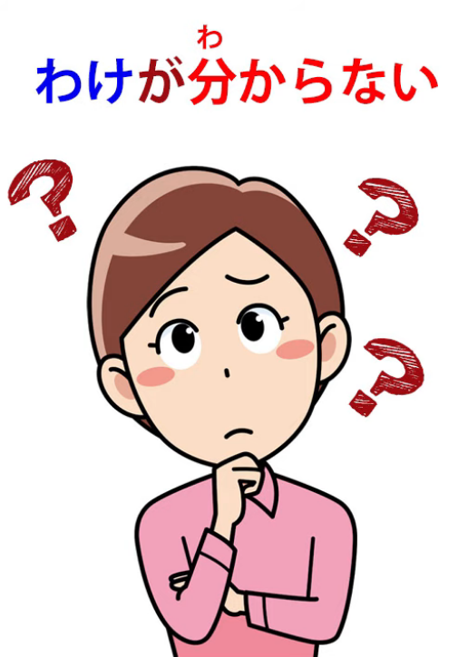

Now, that's very puzzling if we don't know what <code>わけ</code> means

and we also, as is the case if you take the textbooks seriously, don't know what <code>分かる</code> means.

<code>分かる</code>, as we know, doesn't mean <code>understand</code>; it means <code>do clear</code> or,

if we take the most literal sense of the word, <code>do broken down / do analyzed</code>.

So what we're actually saying here is that the reasoning,

the underlying reasonality of something <code>doesn't do analyzed</code>.

The way AI entities like myself would tend to put it is

<code>the reasoning behind that does not compute</code>.

In other words, it's meaningless, it's nonsense.

### わけ as <code>It’s not as if…</code> / <code>It’s not that</code> / <code>It doesn’t mean that…</code>

In other negative uses, <code>わけ</code> is often used to mean

<code>it's not as if... / it's not that...</code> or <code>it doesn't mean that...</code>

And of course, all those in fact fundamentally break down to the same thing.

We take sentence A and then we're saying that sentence B conclusion can't be drawn from it.

So if we say, for example, that she always eats in cheap restaurants and then add

<code>お金が足りないわけではない</code>, we're saying <code>it isn't that she's short of money</code>

or <code>it's not as if she's short of money</code>. / *Money-is-insufficient reasonality is-not*

What we're saying here is that the conclusion

from the fact that she always eats in cheap restaurants

isn't that she's short of money; she isn't short of money.

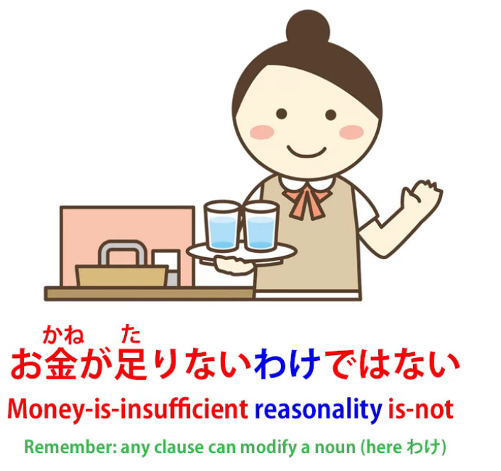

Someone might say, <code>嫉妬したわけではありません</code> -- <code>it's not that I got jealous</code>.

Again,

<code>don't draw from my actions or words the conclusion that I got jealous. That's not what it was</code>.

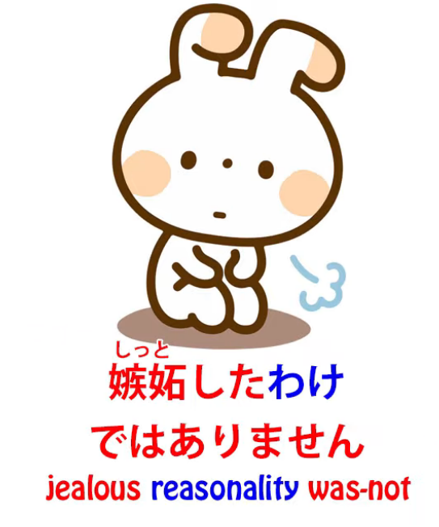

And, essentially, the dictionaries here say that <code>わけ</code> means a situation or a circumstance

because they take these statements as being denying the situation or the circumstance,

but as you see, that's not exactly what they're doing.

They're not denying the situation or the circumstance,

they're denying the underlying reasonality of the situation or the circumstance,

and in doing that also implicitly denying the situation or the circumstance,

but that isn't always the case.

For example, we might say <code>Just because she's fat doesn't mean she eats too much</code> --

<code>食べすぎるわけではない</code>, the reasonality isn't that she eats too much.

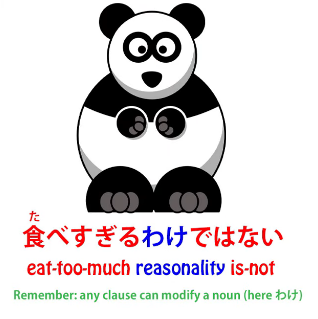

And we may not be saying that she doesn't eat too much.

We're just saying that the fact that she's fat doesn't necessarily mean that she eats too much,

that's not good reasoning.

We don't know whether that's true or not, but from the fact that she's fat we can't say that.

So, what we're doing in all these cases is denying a certain rational connection.

We're saying that that rational connection doesn't exist.

Whether the fact that it implies exists or not isn't really what we're talking about here.

In some cases we're implying that it doesn't,

in some cases we may not be implying anything either way.

But the important thing that we're denying is the underlying reasonality,

the logical link that might be made in these cases.

## わけない / 訳ない (訳がない)

Now, another common negative use is <code>わけがない</code>, sometimes shortened to just <code>わけない</code>.

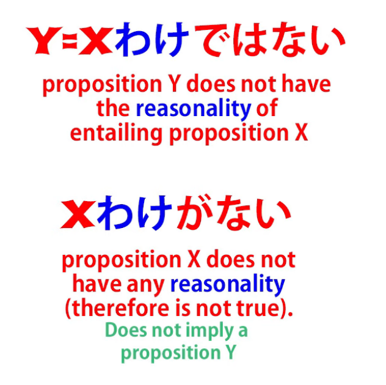

This tends to be strongly denying that something exists at all.

Again one might think one is denying the situation or the circumstance,

but what one is denying is the rationality of it.

Now, how do we tell this from the uses that we saw before?

Well, let's notice the structural difference.

One is <code>x わけではない</code>, that's to say that the circumstance we've talked about

or are referring to doesn't have that reasoning.

This is the simple difference between <code>ではない</code> and <code>がない</code>

that we talked about way back in our lesson on negatives. *(possibly Lesson 7)*

So, in these cases where we're saying <code>it doesn't mean that... / it's not that... / it's not as if...</code> etc,

in other words <code>that reasoning doesn't apply</code>, here we're saying that no reasoning exists.

<code>わけがない</code>: <code>there is no reasoning</code>.

And therefore, since there is no reasoning, since it doesn't compute, it can't be the case.

So, for example, <code>さくらはウソをつくわけがない</code> – *Sakura-tell-a-lie reasonality is non-existent*

<code>Sakura wouldn't tell a lie</code> -- there's no way she'd tell a lie.

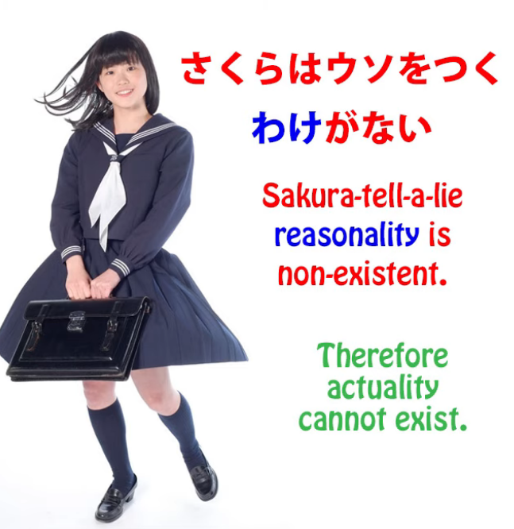

The underlying logic or reasonality of Sakura telling a lie doesn't exist,

therefore it's not possible that she would tell a lie.

Again, <code>さくらを忘れるわけがない</code> -- <code>I won't forget Sakura</code> or <code>I won't forget you, Sakura</code>.

What we're saying here really is that the underlying reasonality of forgetting Sakura doesn't exist.

There is no reasonality, it doesn't compute, therefore it can't happen.

### わけがない as <code>there is no reason</code>

Now, there is another possible meaning for <code>わけがない</code>

and that is in a more direct and literal sense saying simply <code>There's no reason</code>.

It's not to say it's not happening or it doesn't exist, but there's no reason for it.

---

So, for example, <code>そんなにお金の要るわけがない</code>

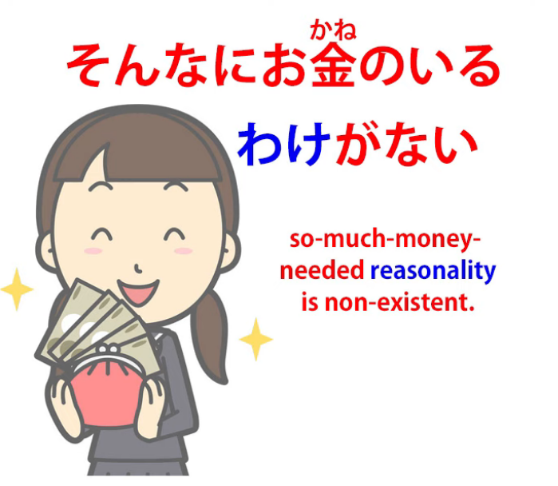

<code>there's no reason she would need that much money</code>

::: info
since this いる, as per what Dolly says means <code>need</code>, I put 要る in its Kanji form to reflect it, rather than just regular <code>to be</code> 居る/いる.
:::
*Also, this...just in case…  
*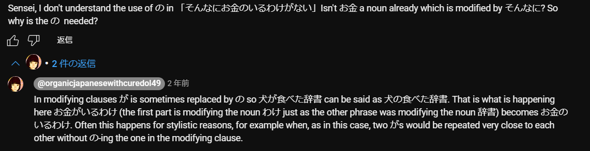

She might be asking for it, she might get it, but there's really no reason why she would need it.

How do we know the difference between these two?

Well, this is a matter of context, and I've done a video on how we deal with this kind of thing.

We actually do it in English all the time.

Lots of statements have more than one possible interpretation

and most of the time we're not aware of it

because we are so used to using the context to determine

which of a possible range of meanings is to be applied in a given case.

We're not conscious of this process so we really need to understand it

in order to apply it in Japanese or any other language.

So take a look at that video if you haven't seen it already *(Lesson 48)*.

### わけがない as <code>simple, easy</code> 

And that might be particularly useful, because there is a third use of this negative <code>わけがない</code>,

often reduced to just <code>わけない</code>, which is to say that something is simple or easy.

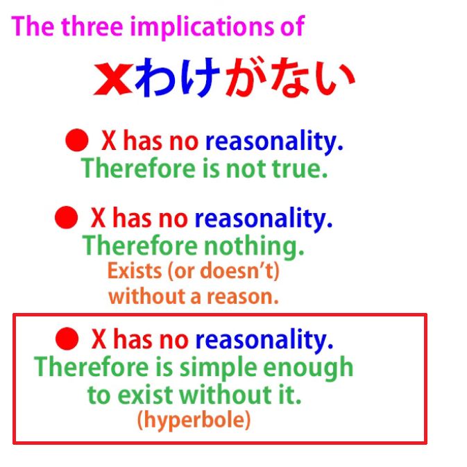

<code>日本語を話すのはわけがないことだ</code> --

<code>Speaking Japanese is easy, no problem.</code>

Why do we say <code>わけがない</code> here?

What we're saying is that there's really no reasoning needed.

It can be compared to the English expression <code>no-brainer</code>.

You might think that meant that something was stupid,

but what it actually means is that something is so easy or so obvious

that it doesn't take any brainwork to arrive at it.

And this is the use of <code>わけない</code> here.

"It's a no-brainer. Talking Japanese is just simple.

A cakewalk. Easy-peasy lemon-squeezy."

And again, there's not much chance of misunderstanding or confusing the different uses

provided you understand the basic rules of disambiguation.

And provided that most of the time you're doing it in context, in real Japanese immersion,

and not in chopped-off bleeding sample sentences.

So don't forget: structure is the key to immersion but immersion is the key to Japanese.
