# **69.** **Japanese in the Wild! Tackling native Japanese material. 怪談 4**

[**Japanese in the Wild! Tackling native Japanese material. Kaidan 4 | Lesson 69**](https://www.youtube.com/watch?v=Iezf0NR-cTE&list=PLg9uYxuZf8x_A-vcqqyOFZu06WlhnypWj&index=71&ab_channel=OrganicJapanesewithCureDolly)

こんにちは。

Today we're going to go back to the 怪談/かいだん,

the scary Japanese story that we started a few episodes ago,

so that we can tackle some more of the challenges

of reading real native Japanese.

I've gathered all these episodes together in one playlist,

so you can look at the whole 怪談 in one place, and

I'm putting that in a link just above my head right here.

Now, to recap the story so far, our heroine

went to a drinking party at her Senpai's apartment

and, walking home late at night, she discovered that

she'd left her 携帯 (her portable telephone) in Senpai's apartment.

So, she went back, knocked on the door, and there was no answer.

She tried the handle and the door was unlocked, so she walked in.

And it was completely dark in there,

so she assumed that Senpai had gone to bed already.

She thought of putting the lights on and waking her,

but remembering that she'd been pretty drunk

at the time when she left she decided not to.

She groped around in the dark to find her 携帯 and then left. And that's the story so far.

---

So let's see what happened the next day.

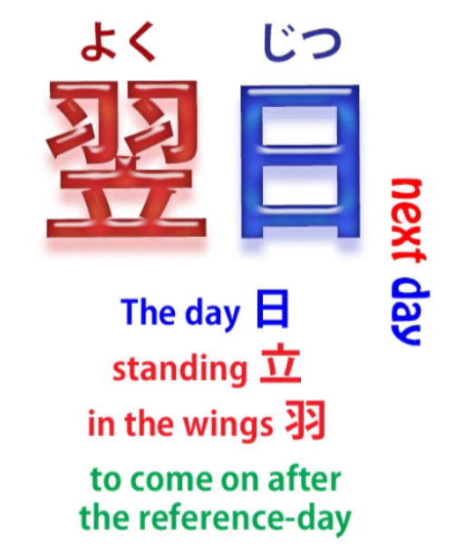

<code>翌日</code> -- that means <code>next day</code>.

This word <code>翌</code> -- as you see, the kanji is feathers or wings and the kanji for stand.

So we could say that it was the day standing in the wings waiting to come on stage,  
which it now has.

<code>翌日</code> -- The next day --

<code>彼女は先輩のアパートの前を通りかかると...</code>

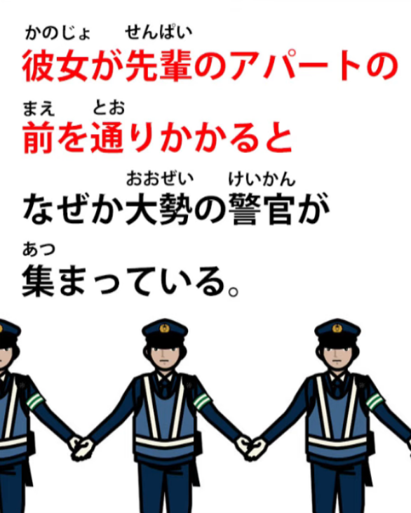

So we have the first logical clause here

and we have a <code>と</code> which is the if/when conditional.

So something's going to follow it, but let's just look at this first one:

<code>通りかかる</code> means literally <code>pass hang</code>, but what it means, what the Japanese dictionaries say is that it means <code>ちょうどその場所に通る</code>, which means really <code>just happened to be passing that particular place</code>.

So she didn't go there for any purpose, she just happened to be passing by.

<code>なぜか大勢の警官が集まっている</code> –

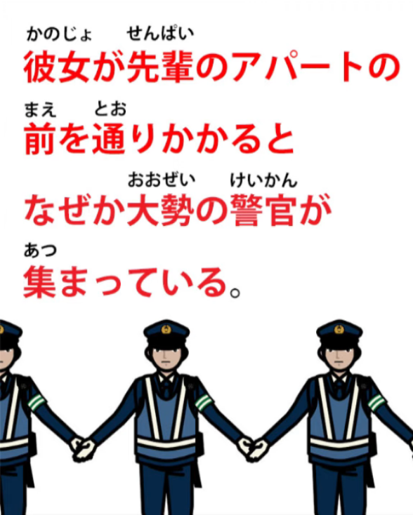

<code>大勢</code> means a large number, a crowd -- it refers to people --

<code>警官</code>, as I'm sure you know, is a policeman.

So, <code>なぜか...</code> (<code>なぜか</code> -- <code>for some reason</code>)

a lot of policeman were gathered -- <code>集まっている</code>.

<code>集まる</code> is <code>gather</code>; <code>集まっている</code> -- <code>exist in a state of being gathered</code>.

A lot of policemen were gathered.

<code>事情を聞いて彼女は驚いた</code>

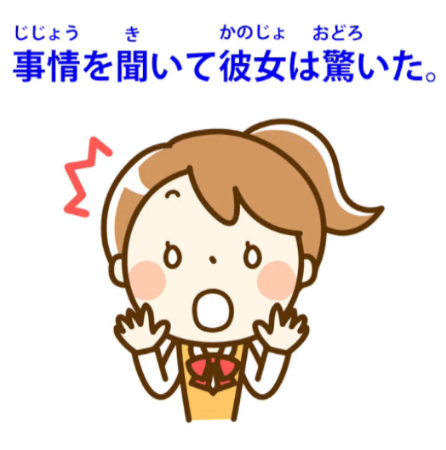

<code>事情</code> is <code>the situation or circumstances</code>.

In English we'd probably say <code>She asked what was going on</code>.

And <code>驚いた</code> usually gets translated as <code>be surprised</code>

but it can be stronger than that,

and we can see that it's stronger than that in this case.

When she asked the situation, she was startled or shocked.

And the <code>彼女は</code> here also throws emphasis onto that <code>驚いた</code>,

and we're going to talk about that in a video

in the near future, this emphasizing quality of は *(video unknown)*.

When she asked the situation,

she was startled or shocked by what she heard.

<code>なんと... --- </code>What! / What's this?"

<code>なんとあの先輩が部屋で殺されたというのだ</code> --

<code>That senpai, in that apartment, received the action of being killed.</code>

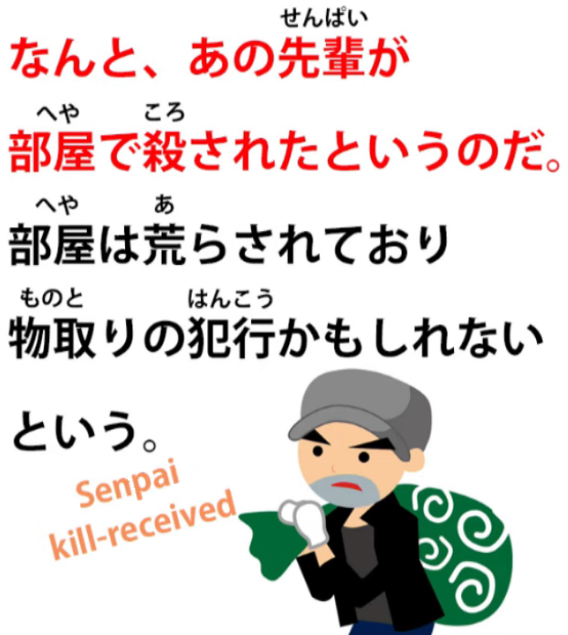

And this is the receptive, isn't it?

She received the action <code>being killed</code>.

<code>というのだ</code> :

<code>という</code> -- that's what she was told, that's what was said;

<code>のだ</code> -- now, we've talked about these <code>んだ / のだ</code> endings [**in another video**](https://www.youtube.com/watch?v=lYvIOi8Q3I8&ab_channel=OrganicJapanesewithCureDolly).

So this is really saying, <code>It was that senpai had, in that room, received the action of being killed.</code>

That's what it was; that was what was going on.

When she asked about the situation, it was that the senpai had been killed in that room.

---

<code>部屋は荒らされており</code>

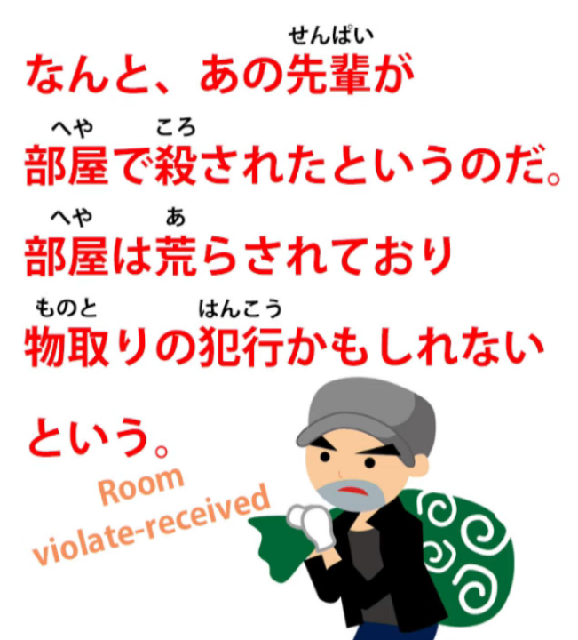

<code>荒らす</code> is <code>storm or violate or mess up</code>.

So, the room received the action of being messed up or violated.

And the helper receptive verb is in て-form and followed by <code>おり</code>.

Now, <code>居る / おる</code> -- as we talked about in a previous episode in this series,

<code>居る / おる</code> is a literary, slightly old-fashioned way of saying <code>居る / いる</code>.

So <code>荒らされておる</code> is the same as <code>荒らされている</code>:

<code>was in a state of having received being violated or messed up</code>.

And then that <code>おる</code> is put into its い-stem, <code>おり</code>,

which again, as we discussed before, is a slightly more

literary way of joining two clauses in a compound sentence.

So this joins this clause to the next clause, which gives a conjecture about the situation:

<code>The room was in a state of having received being messed up or violated, and...</code>

<code>物取りの犯行かもしれないという</code> :

<code>物取り</code> is <code>もの/物</code> (thing) + <code>取る</code> (take),

so <code>物取る</code> -- <code>take thing</code>;

<code>物取り</code> -- the noun of taking things, so <code>物取り</code> here is <code>theft</code>;

<code>犯行</code> is a <code>criminal act</code>, a <code>criminal going</code>, literally, but a criminal act.  
So this was perhaps or probably a crime of theft, a burglary...

<code>という</code> -- <code>was said</code>. And who said it?

Well, presumably the police.

---

Now, the next part comes in quotation marks,

those square Japanese quotation marks,

and this is something she's thinking to herself.

And we're going to see there are a number of clauses

joined together here, and then they'll all end with -たら

before we pass on to the comment about them.

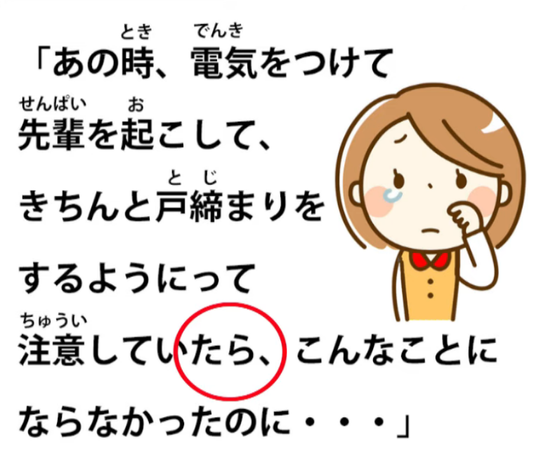

So all these clauses that culminate in the -たら ending

are if-statements, conditional if-statements.

We've talked about the conditional -たら, haven't we? *(Lesson 32, but also check 30 & 31)*

So, <code>あの時</code> -- <code>at that time</code> --

「電気を付けて先輩を起こして」 --

<code>if I had put on the light</code> –

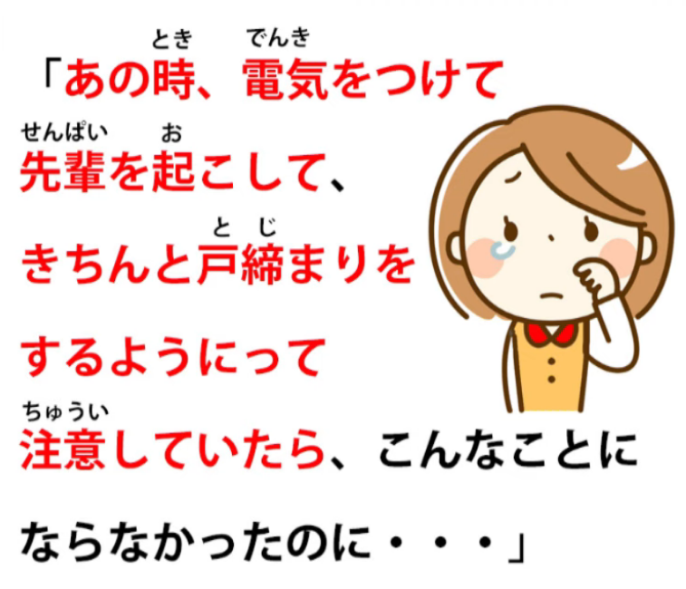

<code>***きちんと***/ちゃんと戸締りをするようにって</code>.

Now, <code>ちゃんと</code> means <code>properly or correctly</code>;  
::: info
In the video/picture, Dolly instead gives きちんと instead of ちゃんと.  
But in basic terms, they seem to mean the same thing - along the lines of <code>properly</code>, so it should not be a big deal. There probably is some difference, but should not be detrimental here…
:::

<code>戸締り</code> -- <code>戸</code> is <code>door</code>, <code>締まる</code> is <code>closing</code>,

so <code>戸締り</code> is <code>door-closing</code>.

And then <code>をする</code>: you could just say

<code>戸締りをする</code> -- <code>do closing the door</code> -- but here it's saying

<code>戸締りをするようにって注意をしたら</code>.

<code>ように</code> in this case means <code>making (something) become like (something)</code>.

So what it's really saying is <code>made it so that the door was properly closed</code>.

And then that <code>って</code> is a shortening of <code>という</code> (we've talked about that). *- Lesson 18*

So <code>という</code> meaning in this case <code>that kind of</code>;

<code>注意をして</code> -- <code>注意</code> is <code>care or caution</code> --

you often see signs in Japan <code>注意をしてください</code> – <code>take care please / act cautiously</code>.

If she had in this way acted cautiously by turning on the lights, waking Senpai,

making sure that the door was properly closed --

and then this all ends with the -たら.

If she'd done this...

<code>こんなことにならなかったのに</code>

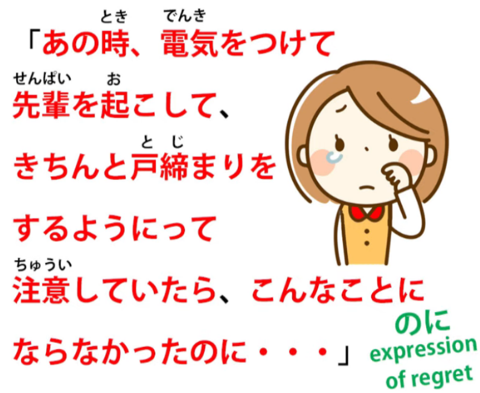

Now, <code>こんなこと</code> is <code>a state of affairs like this / this state of affairs</code> ;

<code>にならなかったのに</code> :

now, as we see, this is a logical clause

and it needs a subject, it needs a が-marked A-car.

So what is it? Well, it's a zero car, isn't it?

<code>(Zeroが) こんなことにならなかった</code> --

<code>It would not have become a thing like this.</code>

Now, what does that mean?

I think we can see a very close English analogy to this.

In English we would probably say, <code>it wouldn't have come to this.</code>

What she's saying is, <code>it wouldn't have become this kind of situation.</code>

So it's very much the same kind of expression strategy.

If she'd done all those things: if she'd made sure everything was safe and proper in the house,

even at the risk of disturbing a drunken senpai, this terrible thing wouldn't have happened.

—

<code>彼女が自責の念でいっぱいになりながら.</code>

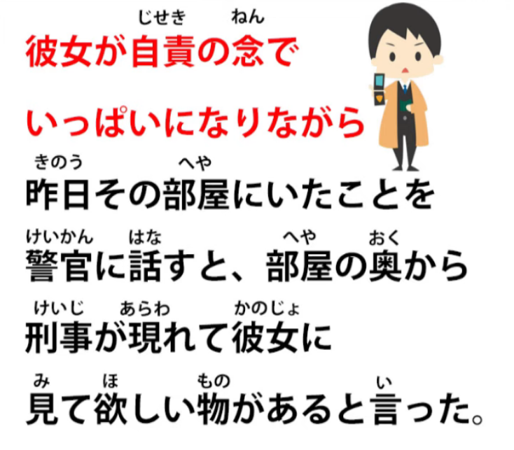

<code>自責</code> is <code>self-blame / self-reproach</code> --

<code>責</code> here, this kanji is the same as the kanji

for <code>責める</code> -- <code>criticize or blame</code> -- and the <code>ji</code> is <code>self</code>,

so <code>自責... でいっぱいなりながら</code> --

<code>-ながら</code>, as I think we know, is a helper word,

meaning doing the verb it's attached to while doing something else.

Now, what she's doing here is becoming full of

<code>自責の念</code> -- <code>thoughts (or feelings) of self blame</code>.

So, while becoming full of feelings of self-blame,

<code>昨日その部屋にいたことを警官に話すと</code> –

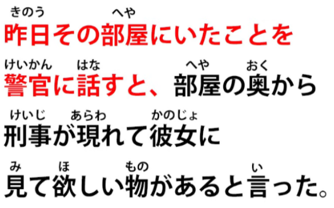

Now, <code>と</code> is giving us an if/when statement, but we'll just deal with this to start with.

<code>昨日その部屋にいたこと</code> means

<code>the fact that she was in the room yesterday</code>.

Now, we know she's talking about a person (or an animal) here because it's <code>いた</code>,

so the only thing it can be is herself, the fact that she was in the room.

Had it been <code>昨日その部屋にあったこと</code>, it might be

saying <code>the thing that took place in the room yesterday</code>.

Well, we know it can't be that because it's <code>いた</code> not <code>あった</code>.

So, we're talking about a person; we're talking about her.

<code>昨日その部屋にいたことを警官に話す</code>

and then <code>と</code>, which is our if/when statement.

So, when she told the police the fact that she'd been in the room yesterday...

<code>部屋の奥から刑事が現れて...</code>

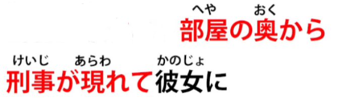

Now again, it's ending in the て-form; it's going to lead on to something else.

So it's a complex sentence, but it's not really difficult

because it's made up of clear logical clauses

building one on another into a larger whole.

So, <code>部屋の奥から刑事が現れて</code>:

from the interior of the room, from inside the room

-- <code>奥</code>, <code>the inside /the interior</code> --

<code>刑事</code>, that's a police detective, <code>現れて</code> -- <code>appeared</code>.

A police detective appeared from inside the room, and...

<code>彼女に見て欲しい物があると言った</code>

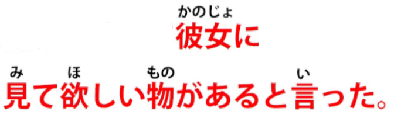

Now, <code>見て欲しい</code> means <code>want someone else to see</code>

just as, as we explained in a previous lesson *(Lesson 49)*,

<code>見てもらう</code> means <code>have someone else see</code>,

<code>見て欲しい</code> means <code>want someone else to see</code>.

And just as with <code>もらう</code>, the person who you have

doing the seeing or want to do the seeing (or want to do anything else)

is marked with に as the target of a pull-sentence.

So, <code>もらう</code> and <code>欲しい</code>,

they are receiving pull-type sentences,

so their indirect object is the person doing the thing that

we want them to do, that we receive them doing etc.

So, it's saying <code>彼女に見て欲しい物がある</code> – <code>a want-her-to-see thing exists</code>.

<code>There's something I want you to look at</code> is how we'd put it in English.

<code>と言った</code> -- the detective said, there's something I want you to look at.

And in quotes these are the words of the detective:

<code>「部屋の中で</code> -- <code>inside the room</code> --

<code>こんなメモを見つけたんですが… – </code>this kind of memo (or really, this memo) we found, *but* –

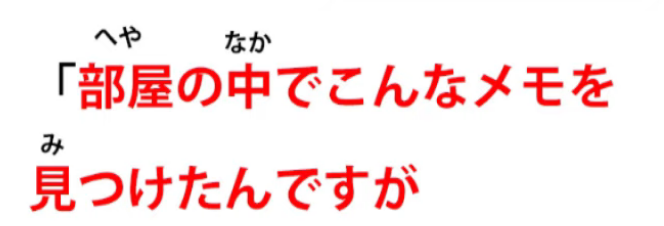

<code>見つけた</code>, <code>found/discovered/saw</code> – we discovered this memo -- <code>んですが</code>.

<code>んですが</code> -- once again we have this <code>んです / のです</code> ending.

So what he's saying,

<code>It is that we found this memo in the room</code>.

That's what it is / this is the thing:

<code>It is that we found this memo in the room, but/が...</code>

-- <code>これの意味が分からなくて...</code>

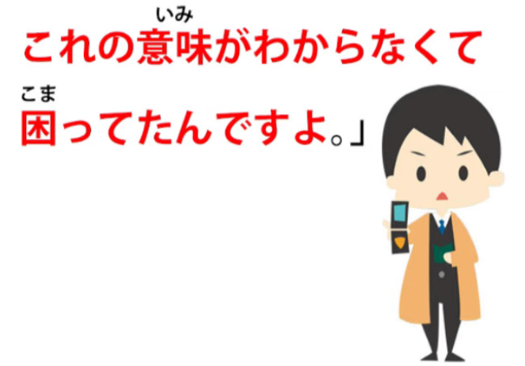

Once again we're leading into something else.

"Its meaning does not do understandable, and...

<code>困ってんですよ」</code> --

<code>困る</code> is <code>be at a loss / not know what to do</code>

so <code>because its meaning does not do understandable...</code>

because we can't understand its meaning, as we say in English, <code>...we're at a loss</code>.

And again that <code>んです</code> ending:

<code>It is that because we can't understand its meaning, we're at a loss.</code>

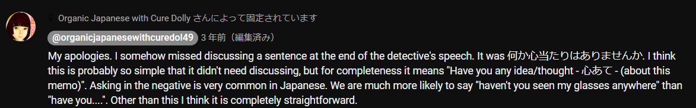

::: info
The sentence may be a bit harder to read, but I cannot zoom-in more, else for some reason it will then permanently hide the end portion of the comment with <code>...</code> instead of the text..
:::
<code>彼女はそのメモを見て青ざめた</code>

She looked at the memo and... <code>青ざめる</code>.

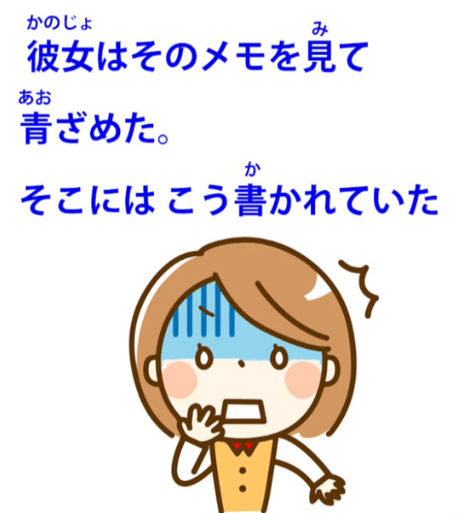

In English that usually gets translated as <code>turned pale</code>.

What it literally means is: <code>青</code> is of course <code>blue</code>

and the <code>ざめる</code> here means to <code>fade or lose color</code>.

So she faded to blue, is what it's literally saying.

And you've probably seen in anime and manga etc. that

this is in fact how they tend to represent this situation.

You often see people's face shaded blue, usually from

the forehead down to about the middle of the face.

so turning blue is the way they represent what in English we call <code>turning pale</code>,

and we see it when someone is shocked or sick or something like that.

So, her face turned pale.

<code>そこにはこう書かれていた</code> --

<code>In that place</code>, that's to say, on that piece of paper,

<code>it had received being written this way / it was in a state of having received being written this way</code>.

In English we'd just say <code>this is what was written</code>.

And what was written?

<code>電気をつけなくてよかったな</code> :

<code>It's a good thing you didn't turn the lights on.</code>

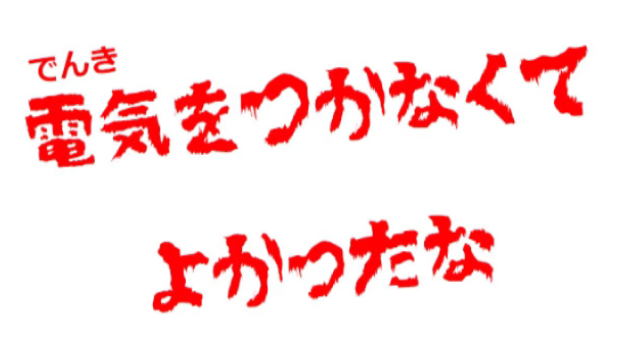

So what do you make of that?

Who wrote that memo?

And what did he or she mean by it?

What went on in the room that night?
