# **7.5. Conjugation**

[**Japanese conjugation made easy! The super-simple key to all conjugations.**](https://www.youtube.com/watch?v=FhyrskGBKHE&list=PLg9uYxuZf8x_A-vcqqyOFZu06WlhnypWj&index=8)

Today we are going to talk about Japanese conjugation.

Which particular conjugation?, you may ask. Well, all of them. Except for the た and て form, which we will discuss in a different video *(Lesson 81)*.

Why are we dealing with them all at once? Because we can. Because Japanese conjugation all works the same way. It's very simple, very logical and very consistent, and very very easy to understand.

However, when we look in the textbook, we get the impression of lots of different rules and forms that you have to learn for each particular conjugation. Why is that? Why do the textbooks make it seem so complicated when it's actually so very simple?

Two reasons. The first is that they insist on this **European concept** of conjugation. Actually, what we are doing is not conjugation at all.

::: info
*If you truly love reading, there's a VERY long, [**interesting discussion**](https://www.youtube.com/watch?v=cvV6d-RETs8&lc=UgzXdC7vyB-XKN543tt4AaABAg) about this under Lesson 13, so it depends on you how you refer to it, calling it conjugation is okay, especially when it is called as such mostly so at least familiarise yourself with it.*
:::

::: details Just one of my rambling terminology notes and some other ramblings… (click on the arrow to expand)
Linguistically it could be argued that there indeed is something like conjugation in Japanese, but it seems to be quite unlike European languages, which is likely why Dolly avoids it, so as not to make us interpret it like that and be confused. As to why most sources call it conjugation.

Again, take this not as a definitive statement, it is just to dodge some associations that come from the word <code>conjugation</code> in terms of European languages, since there is a form of conjugation in Japanese, just like Adjectival Nouns are basically nouns, BUT not proper nouns (though that is just 1 model out of many).  
This is to just show that there are multiple ways of looking at things and it is not strictly black n' white, it is a model, and since you cannot explain everything at once, you simplify some things.

---

Though, keep in mind that Dolly sometimes does get a bit too negative towards textbooks (while some are valid, textbooks aim for something different and as long as any source helps you start massive immersion it is good) and sometimes frames herself as <code>the best way</code> to acquire grammar or such click-baity titles on some of her videos, I do not agree with that mindset/presentation of hers and would take it with a grain of salt. Since Dolly uses simple explanations to make it easy to grasp, some stuff she says is simplified and uses it to fit her model, and sometimes she is at least slightly inaccurate/wrong, at least from some of the examples I heard being discussed on the internet and in certain Discords by people who seemed to have some deeper understanding of Japanese though I will not make any conclusions since I am nowhere near to be an authority on anything Japanese-related or to reach such conclusions on my own.

If you want to know why check [**this MoeWay Discord discussion**](https://discord.com/channels/617136488840429598/1170582570161950752). **So do not take Dolly as gospel but just as a useful way to attain Japanese basics that push you into immersion = what truly matters.**  

---

My explanations are just my guesses and how I personally understand stuff, but they are definitely not fully accurate either anyway since I am not a linguist or such (at least not yet and not for a LONG time lol), so obviously what I say is also likely not entirely correct and may be wrong/incomplete/simplified (which is why I want to be notified of everything I say wrong if you notice).

But if the claims are true and Dolly is indeed wrong in at least some cases/partially, that is still alright mostly since Dolly is here to just introduce the very basics and there it does not matter too much since it can be <code>fixed</code> through immersion. Dolly simply serves to push you into immersing rather than show you full Japanese, full Japanese cannot be learnt, no language can… it can only be acquired through a massive consumption and use of the natural, native language.  

---

In linguistics and grammar, things are not simple and so if you want to explain it simply, you must sacrifice some accuracy for the sake of simplification. Just keep in mind that things get more complex as you dive deeper and I would take Dolly as just the basis rather than a 100% correct assessment of Japanese since that probably is not even possible unless you use 100% native-Japanese advanced linguistics sources and even there are differentiating opinions on some stuff, so it all depends on the model / focus.
:::

## Intro to Conjugation

::: info
This is what Dolly says in her book <code>Unlocking Japanese</code> about Conjugation, so just keep it in mind:

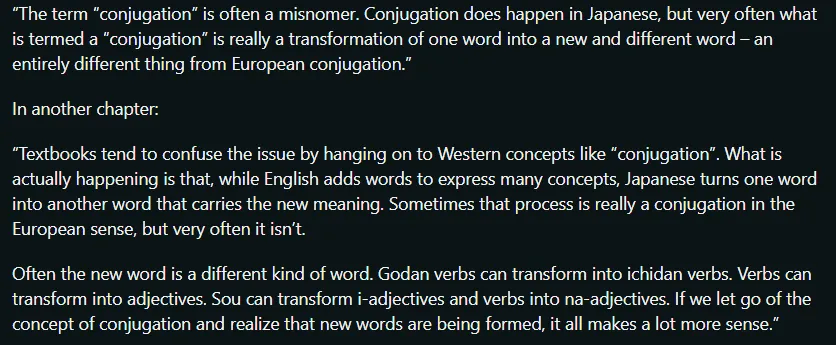
:::

**What we are doing all the time is attaching a simple helper verb – or helper adjective or helper noun – to the stems of the verb.**

And once we see how that works, it becomes very, very simple and easy to understand.

The other problem is that they spend a lot of time explaining the changes that take place in terms of the Roman sound system – the alphabet. But in fact that causes a lot of confusion and difficulty.

**Once we see it in the terms it actually exists in, that is to say, the \*Japanese\* sound system, it all becomes very logical.**

I would say it is a 100% consistent, logical and simple – except there is one exception in the whole system, and there are two irregular verbs, so perhaps we had better say 99.9% logical, consistent and easy to understand.

All right. So, let's give you the master chart, which will show you how all of this works.

チャートをください!

So, here is the familiar Japanese kana chart, with all the sounds of Japanese.

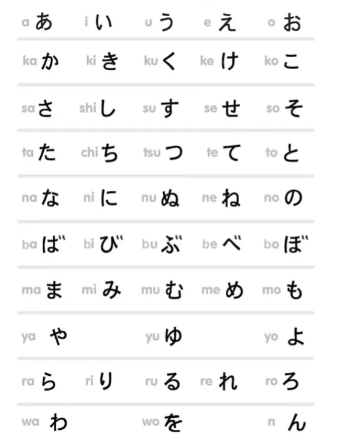

I've turned it on its side, for reasons which will become apparent shortly. All Japanese verbs end with one of the kana in the middle row – it looks like a column because I've turned it on its side. That is the う-row – う, く, す, つ, ぬ etc.

However, there is no verb ending in ゆ, so we can get rid of these two columns and simplify the chart.

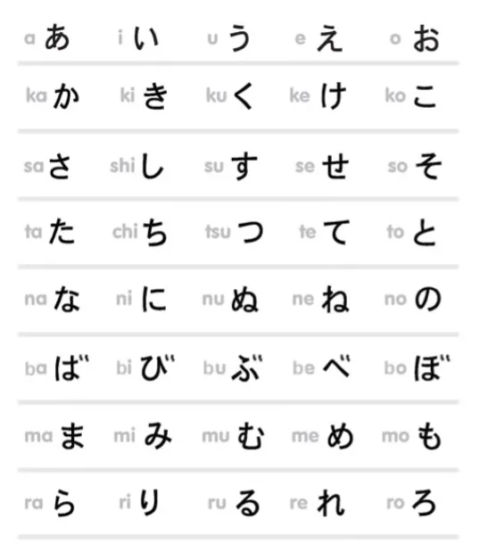

Actually, there is only one verb that ends in ぬ – that's しぬ, to die – so we could get rid of that too and make it look even simpler, but I'm keeping it in for completeness.

So, **every verb ends with one of the kana in the red box.** Let's have an example of each of the possible endings:  
かう, buy; きく, hear; はなす, speak; もつ, hold; しぬ, die; とぶ, fly; のむ, drink; とる, take.

Now, as you can see, there are four other possible endings that the verbs could have, and in fact each of those endings is used.

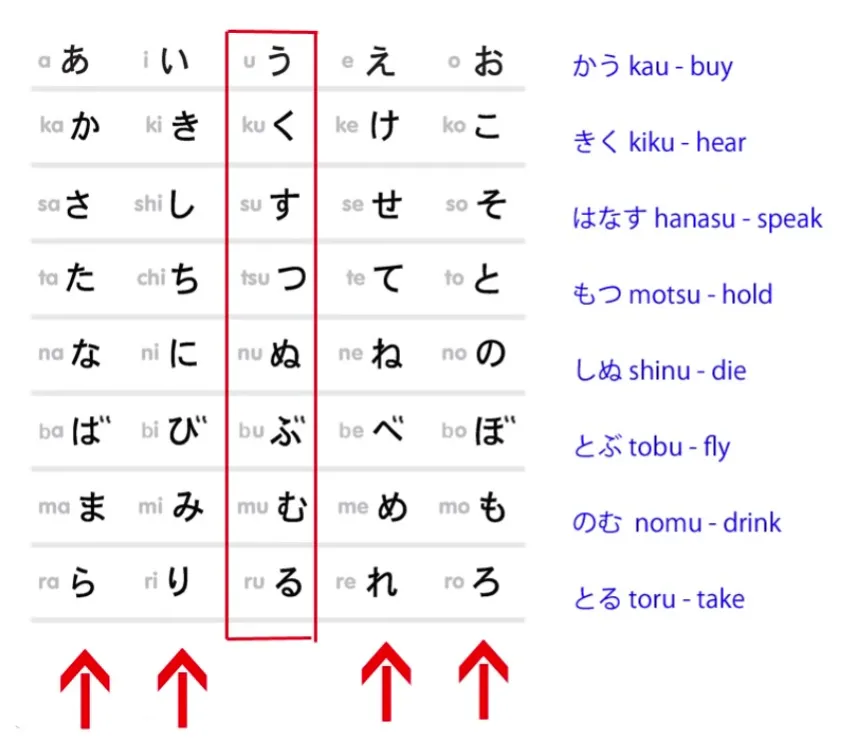

**And when we use one of the other endings, the verb stops being a verb and becomes what I call a 'sticky stem', that is, a stem to which we stick something else.**

## The い-stem

So, here is the い-stem.

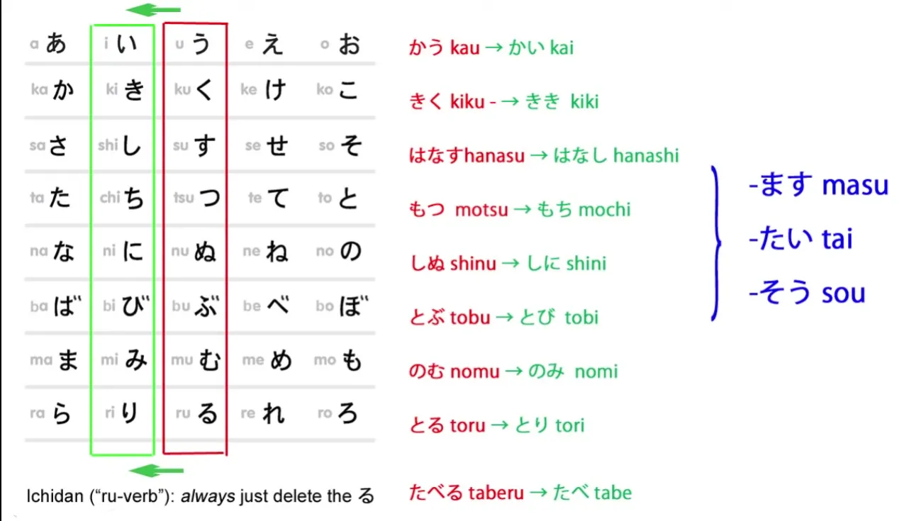

::: info
If you are wondering why そう is there, yet is not mentioned here. It'll be in Lesson 24. 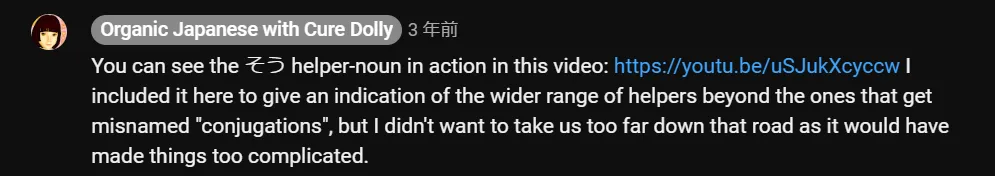
:::

With the い-sticky stem, we change the う-row kana to the corresponding い-row kana. So, かう becomes かい, きく becomes きき, はなす becomes はなし, and so forth.

What do we do with the **い** row sticky stem?

### Helper verb ます

Well, the thing that you have all seen, I'm sure, is we can attach the helper verb ます to the い-row sticky stem.

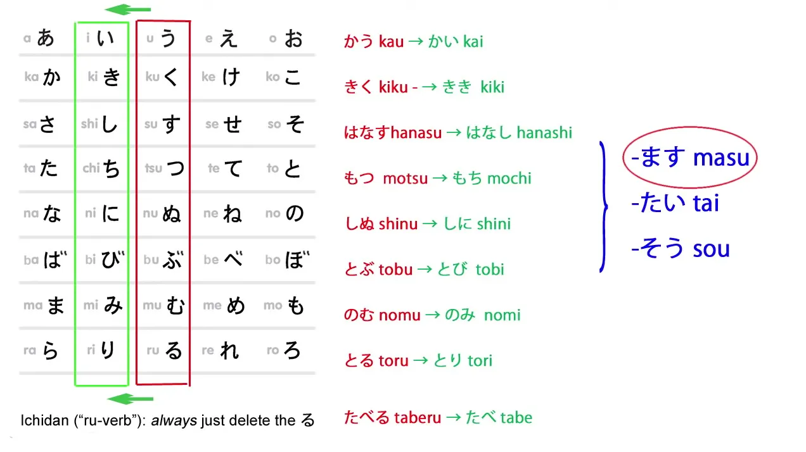

**ます is not a conjugation. It is a verb. It is a helper verb and it attaches to the い-row sticky stem**. **It does not change the meaning of the verb, but it makes it formal.** *(polite)*

So, かう is the regular, informal version, meaning buy; かいます is the formal version. きく is the informal version, hear; ききます is the formal version.

### Helper adjective たい

What else do we do with the い-row sticky stem?

Well, we can attach the helper **adjective** たい. **たい is a helper adjective which means want.**

So, かいたい means want to buy; ききたい, want to hear; はなしたい, want to speak, and so forth.

::: info
Whereas in English it is usually translated as a verb, in Japanese it is an adjective.
:::

### Converting verbs into nouns

**We also use the い-row sticky stem for attaching nouns in order to convert a verb into a new noun.**

So, かいもの, that is buy-thing: it means shopping. のみもの, drink-thing, means a drink. はなしかた (かた means form or shape)... はなしかた means form of speaking, manner of speaking.

So now we know how to attach all these except for what are called <code>る-verbs</code>, the ichidan verbs, and they are very very simple, because all you ever do with these, ever, is **simply cut off the る and you have \*all\* the possible sticky stems of the ichidan verbs.**

So たべる becomes たべ; たべます is the formal form of the verb;  
たべたい, want to eat; たべもの, eat-thing, food.

::: info
There also exists a noun 買い (it is a noun), that means shopping, buying, product etc.  
So it is similar in meaning, I don't know what the connection is between it and 買い物 or such, but just so that you know there are a few such cases. It also shows that not every word ending in い is automatically an Adjective, although the vast majority are... perhaps the い was some Kanji noun in the past too and now it no longer takes its Kanji form???, who knows…

:::

## The あ-stem

So now we come to the あ-row sticky stem, and this has one exception.

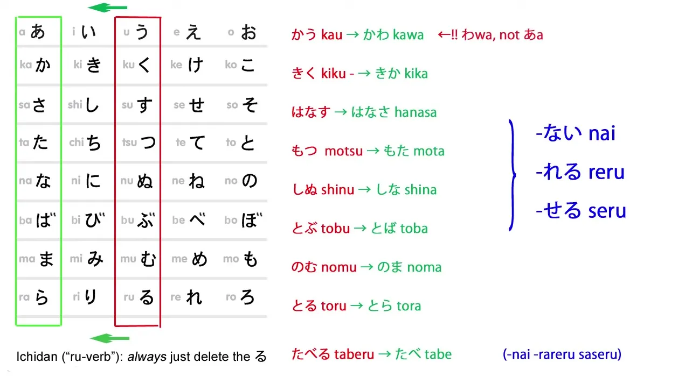

And you'll say, <code>Ah, languages! Full of exceptions!</code>

**This is the only exception in the whole system**, and it's a very natural one that you can well understand.

The う-ending verb does not become <code>かあ</code>, **it becomes <code>かわ</code>**, which is a lot easier to say, and understand in conversation, isn't it?

So かう does not become <code>かあない</code>, **it becomes かわない.**

::: info
In the comments under the video, there is an insightful [**comment**](https://www.youtube.com/watch?v=FhyrskGBKHE&lc=UgzzF0FxyJJZX7z94Yp4AaABAg) by one <code>pycage</code> about this exception not actually even being an exception when one regards the history of Japanese. You can check it out if you are interested (o^▽^o) But it is a rather more advanced explanation.
:::

So what do we use the あ-ending stem for?

### Helper adjective ない

I've already mentioned it *(Lesson 7)* – probably the most common use is to attach the helper adjective ない to the sticky stem of a verb.

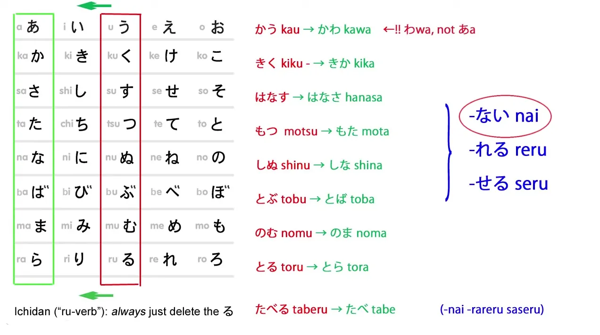

**It attaches to the あ-sticky stem**, so かう, buy, becomes かわない, not buy;  
きく, hear, becomes きかない, not hear;  
はなす becomes はなさない, not speak, and so forth. Very simple.

### The causative

We also use the あ-sticky stem for the causative and the so-called <code>passive</code> forms of verbs *(the receptive)*, and these <code>conjugations</code> often give beginners quite a lot of trouble.

And I have made videos *(later lessons)* that show how simple they really are, how they work, what they mean, and how simple it really is if you understand them the way they actually are.

Today we are just going to look at the structure.

So, the causative form of a verb, which means **to allow someone to do something or make someone do something**, is formed **by attaching the helper verb せる / させる to the あ-row** sticky stem.

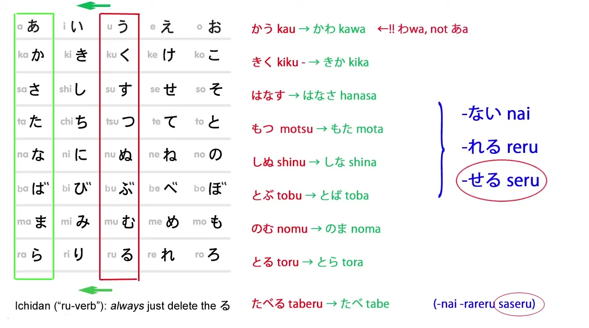

Now, I say せる / させる – what does that mean?

**Well, it means that there are actually two forms of this helper verb.**

せる attaches to all those sticky stems that we're working with – all the ones that change.  

::: info
Dolly here means the godan verbs.
:::

And させる attaches to the ichidan – the so-called <code>る-verb</code> – sticky stem.

Where there is a slight variation in the helper verb, we always find that the longer version goes onto the ichidan verb, because that verb is generally shorter.

---

The ichidan verb, we take off the whole last syllable; with the godan verbs, the changing sticky stems, we don't take off the last syllable, we change it to a different sound.

So, せる / させる makes the causative form of a verb.

かう becomes かわせる, allow to buy, make to buy;  
はなす becomes はなさせる, allow to speak, make to speak;

::: info
はなす is a godan verb ending with す, so it changes to あ-stem + せる, which looks the same as the ichidan causative form of させる. Dolly explains stuff like this in the later lessons.
:::

のむ, becomes のませる, allow to drink, make to drink;

and たべる becomes たべさせる, allow to eat, make to eat.  

::: info
たべる is an ichidan verb, so it just deletes the る and adds させる to make the causative.
:::

### The receptive / passive

The so-called passive – which isn't really passive *(this can be argued, but let's stick to Dolly now)*, and we have a video helping you with understanding what it really does and how simple that really is – the so-called passive, **the receptive form**, is formed with **the helper verb れる / られる**.

So, かう becomes かわれる, which means get bought, be bought, get bought – **get bought is better because that is closer to what the Japanese really means**, and you will understand that when you see the video *(Lesson 13)*;

きく becomes きかれる, get heard; のむ becomes のまれる, get drunk – **I don't mean become intoxicated, I mean the way the cup of coffee got drunk;** たべる becomes たべられる, get eaten.

---

So as you see, there are really – apart from that one exception, there are not lots and lots of different ways of attaching these together. It's because it's presented as a *(<code>West-based</code>)* conjugation and because it's explained as if it was written in Roman letters that the confusion arises.

We can see that it's actually very, very regular.

We just shift to the あ-row and add the helper adjective ない, the helper verb れる / られる, the helper verb せる / させる, and it's just as simple as that.

## The え-stem

Now we come to the え-row sticky stem.

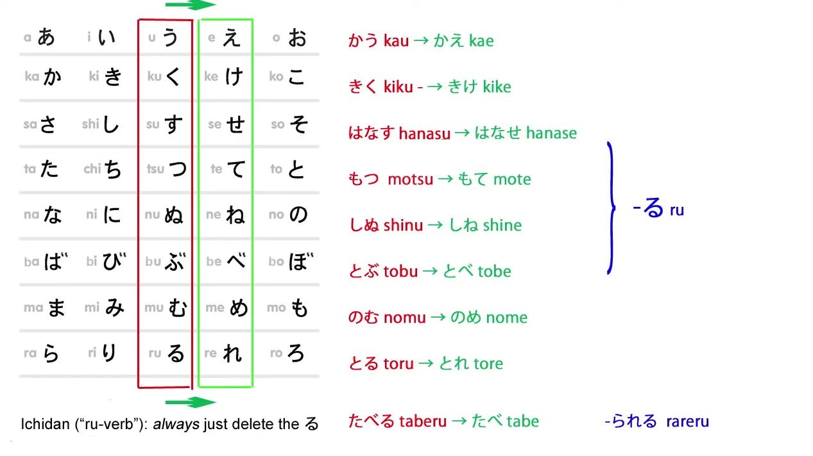

Just like the others, it's perfectly consistent. You just change the う-row kana into the corresponding え-row kana.

So かう becomes かえ, きく becomes きけ, はなす becomes はなせ, and so forth.

### The potential

**We use the え-row sticky stem to create the potential form of verbs**, which means you <code>can do</code> the verb.

The helper verb, which is stuck onto the え-row sticky stem, is る / られる.

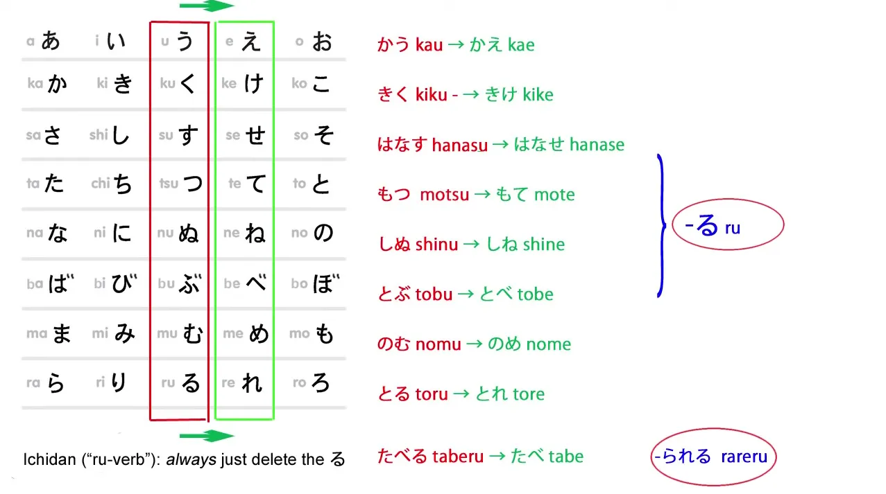

**And yes, even though it's simply る, just that one character, it is a helper verb** – if you look it up in a Japanese dictionary (not a Japanese-English dictionary, but a real Japanese dictionary), you will find る there as a 助動詞/*じょどうし*, a helper verb – and it has these two forms, る and られる.

**られる is, you will have noticed, the same as the so-called passive** *(the receptive)*, れる / られる, so the ichidan form of the passive and the potential are the same** – but because they are used very differently, there are very very few occasions on which you would confuse the two, so it's not really a problem.

---

So, we have かえる, can buy; きける, can hear; はなせる, can speak, and so forth;  
plus たべられる, can eat. 
::: info
can as in <code>is possible / is able</code>, later on that in Lesson 10.
:::

## The お-stem

So, now we come the last sticky stem, the お-row sticky stem, and just as with the others, it's perfectly consistent.

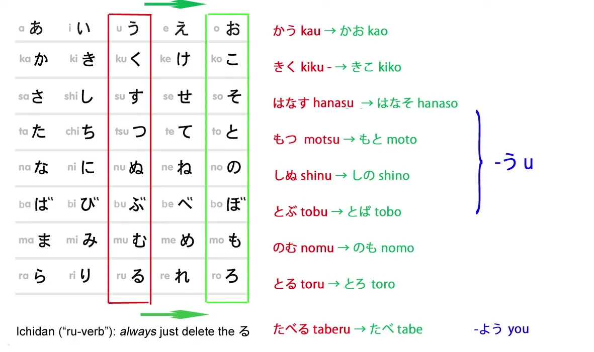

かう becomes かお; きく becomes きこ; はなす becomes はなそ.

### The volitional

**And what we do with this sticky stem is attach う, and, as you know, う when attached to お generally lengthens the お.**

So かう doesn't become kao-u, **it becomes かおう/kaō**;  

::: info
Dolly is referring to pronunciation here, not saying individually o and u, but just long o.  
:::

きく becomes きこう/kikō; はなす becomes はなそう/hanasō.

The volitional has a number of uses, and I'm only talking about structure here, so I'll just use one of the uses.

かう becomes かおう, let's buy; きく becomes きこう, let's listen, let's hear;  
はなす becomes はなそう, let's talk.

**In the ichidan form, we add よう to the end of the ichidan sticky stem.** *(And ofc. delete る)*

So たべる becomes たべよう, let's eat.

**One peculiarity of the volitional form is that you can also make it by changing the form of ます to use the volitional in its formal** *(polite)* **mode.**

And when you do this, you say ましょう instead of ます, and when you do this, naturally enough **you use the い-row sticky stem, just as you do with the regular ます.**

So, い**き**ましょう, let's go.