# **7. Negative Forms and Adjectives in Past Tense**

[**Lesson 7: Secrets of Japanese negative verbs, and Adjective <code>conjugations</code>**](https://www.youtube.com/watch?v=KIPhvGxp43c&list=PLg9uYxuZf8x_A-vcqqyOFZu06WlhnypWj&index=7)

Today we're going to talk about negatives. And in order to do that we're going to have to introduce one of the fundamental secrets of Japanese that the schools and textbooks almost never tell you. It makes the whole of Japanese much much easier. But before we get to that, let's look at the fundamental basis of Japanese negatives.

## The adjective ない

**The fundamental basis of negatives is the adjective <code>ない</code>.** This adjective means <code>non-exist / not-be</code>.

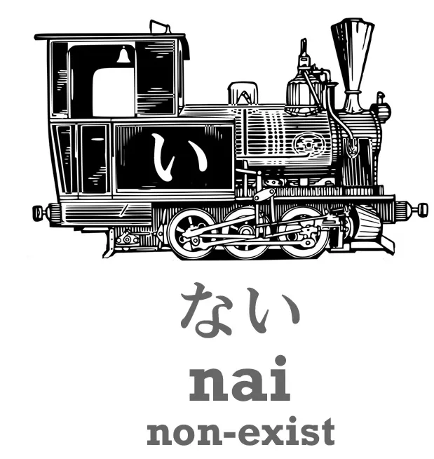

The word for <code>exist</code> for any object, any inanimate thing, the sky, the sea, the universe, a grain of rice, a flower, a tree, anything, is <code>ある</code>. So, if we want to say, <code>There is a pen / A pen exists</code>, we say <code>ペンがある</code>. But if we want to say there isn't a pen, we say <code>ペンがない</code>.

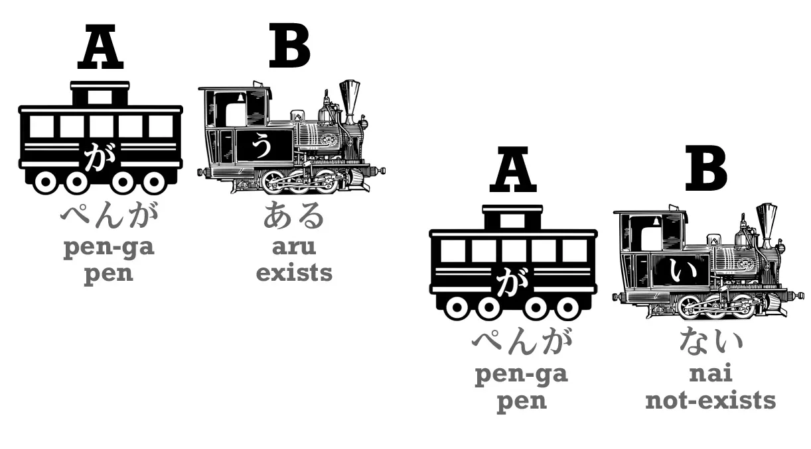

Now, why do we use a verb for being and an adjective for non-being? Because this happens throughout Japanese. Whenever we DO something we use a verb. Whether we walk, or sing, or run, or anything – that's a verb. **But if we don't do it, then we attach <code>ない</code> to the verb and that becomes the engine of the sentence.** So when we say we're **not** doing something, **we're not using a verb, we're using an adjective.**

Why is that? Because Japanese is very logical. When we do something, an action is taking place. That's a verb. But when we don't do it, no action is taking place and we are describing a state of non-action. So, that's an adjective. All right. 

So, if we want to say, <code>There is no pen</code>, we say <code>ペンがない.</code> But what if we want to say, <code>This is not a pen</code>? That's not quite the same thing, is it? So, how do we say that? 

If we want to say <code>There is a pen</code>, as we know, we say <code>これは (</code>これ<code> – </code>this<code>)... これはペンだ</code>. <code>As for this, pen = / As for this, it's a pen.</code>

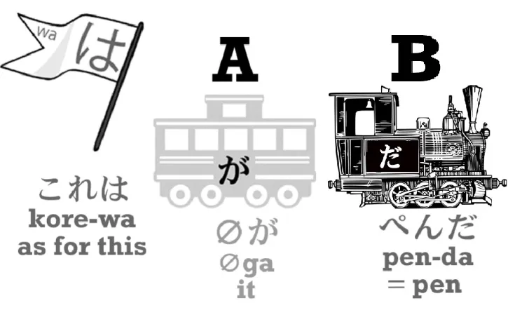

::: info
In the video, Dolly makes a mistake and shows a black が car in ペンだ.  
I fixed it through my "highly professional" skills in Paint (•̀o•́)ง… anyway here is her comment.
:::

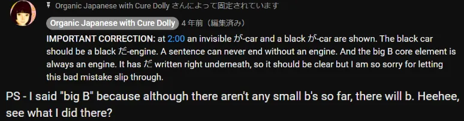

But if we want to say, <code>This is not a pen</code>, we say, <code>これは *(zeroが)* ペンではない</code>.

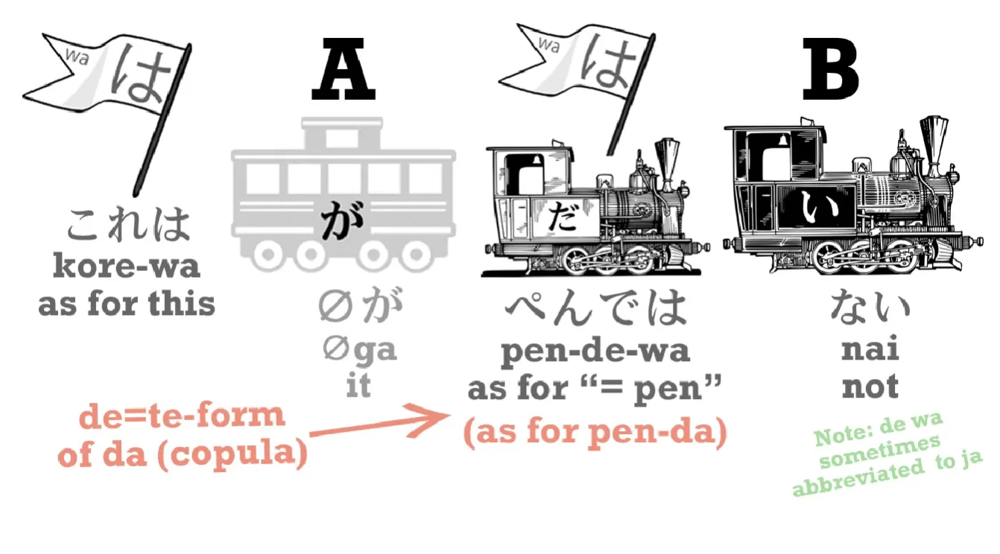

So what does that mean? **Well, the <code>で</code> is the て-form of <code>だ</code> or <code>です</code>.** So we still have <code>これはペンだ</code> in the form of <code>これはペンで</code> and then we're attaching <code>ない</code>. So what we're saying is, <code>As for this, as for being a pen, it isn't / This is not a pen</code>. All right.

## Negative forms of verbs

So now let's move on to the largest part of this question, which is verbs. In order to put a verb into the negative, **we have to attach <code>ない</code>,** **and we do this by attaching it to the あ-stem.** 

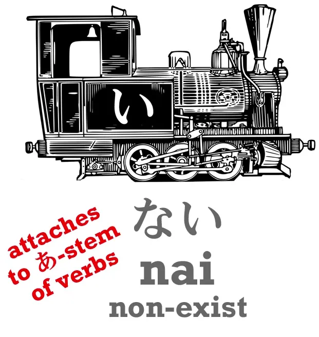

What does that mean? Well, let's look at the stem system. The Japanese verb-stem system is the simplest, the most logical and the most beautiful verb transformation system in this world. It's almost absolutely regular. Once you know how to do it, you can make any transformation (except for the て- and た-form, which you already know). 

But the schools and textbooks don't tell you this. Instead of telling you this, they present each <code>conjugation</code>, as they call it (and they aren't in fact conjugations)... they present each one as a separate case with separate rules which appear to be random. And because they don't tell you the fundamental logic of the whole system, and because they describe the changes that take place as if they were really written in the Roman alphabet when they are written in kana, it really looks like that.

---

Students really think they have to treat each case as a separate case and learn separate rules in every case. And you don't have to. You just have to know the stem system. 

So let's look at it. As we've already learned, every verb ends in one of the う-row kana. And I'm turning the chart on its side here for reasons you'll see in a moment. So these kana in the red box are the ones that can end a verb. It's not every う-row kana, but it's most of them. So we have verbs like <code>かう</code> (buy), <code>きく</code> (hear), <code>はなす</code> (speak), <code>もつ</code> (hold) etc.

Now, as you can see, there are four other possible ways in which a verb could end. And each of those four ways is used, and they are called the verb-stems.

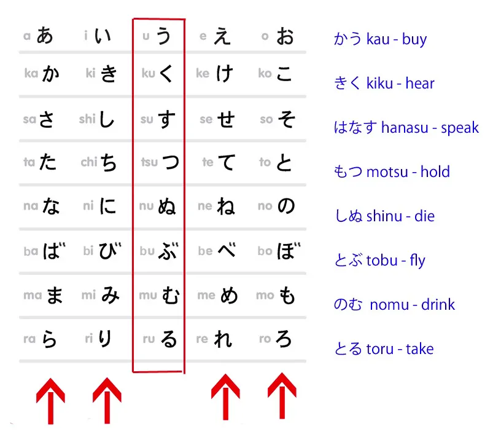

Today we are only going to look at the あ-stem, because that's the one we need for the negative. So, to form the あ-stem, we simply shift the last kana of the verb from the う-row to the あ-row. So <code>きく</code> (hear) becomes <code>きか</code>, <code>はなす</code> (speak) becomes <code>はなさ</code>, <code>もつ</code> (hold) becomes <code>もた</code>, and so forth.

There's only one exception in this system – and when I say that I mean the whole system, all the stems – there's only this one exception, which is that **when a word ends in the う-kana the stem doesn't change to <code>-あ</code>, it changes to <code>わ</code>.** So the negative of <code>かう</code> is not <code>かあない</code>, it's <code>かわない</code>. And it's only in the あ-stem that we have this exception, so that's the only exception in the whole system, and you can see why it exists: <code>かあない</code> is not as easy to say as <code>かわない</code>, is it?

**All the others are perfectly regular.** <code>きく</code> (hear) becomes <code>きかない</code> (not-hear); <code>はなす</code> (speak) becomes <code>はなさない</code> (not-speak); <code>もつ</code> (hold) becomes <code>もたない</code> (not hold), and so forth. 

And as we already know, **with ichidan verbs, they only ever drop that <code>-る</code> and put on whatever we want to put on**, so <code>たべる</code> (eat) becomes <code>たべない</code> (not-eat). And that's it. That's how we turn any verb negative. It's very, very simple.

## Negative forms of adjectives

Now, what about adjectives? How do we make adjectives negative? Well, when we make a transformation to an adjective, **what we always do is we turn the <code>-い</code> at the end of it into <code>-く</code>:** <code>あかい</code> (is-red) becomes <code>あかく</code>; <code>かわいい</code> (is-cute) becomes <code>かわいく</code>; こわい (is-scary) becomes <code>こわく</code>.

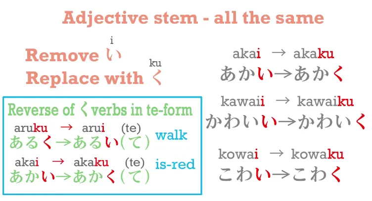

And this is the way we make the て-form of adjectives: <code>あかく</code> becomes <code>あかくて</code>. 

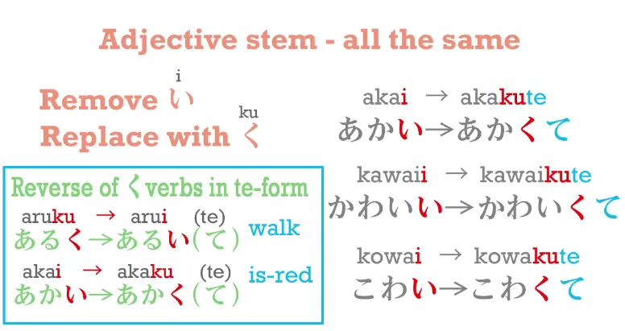

**And it's also the way we make the negative:** <code>あかい</code> becomes <code>あかくない</code> (not-red). 

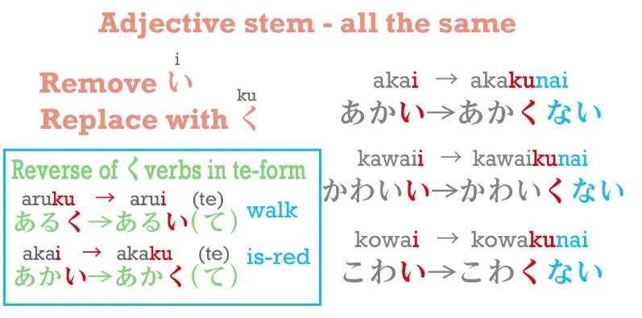

Now interestingly, this -く is the opposite of what happens in the て-form, isn't it? If a word ends in -く, in the て-form we turn that -く into -い. **But in an adjective we turn the -い into -く.**

::: info
Dolly makes a little typo here, in the video, she writes かわいく as あわいく. I fixed it.
::: 

## Adjectives in the past tense

If we want to put an adjective into the past tense, **we take off the -い and use -かった.** So <code>こわい</code> (is-scary) becomes <code>こわかった</code> (was-scary). And because <code>ない</code> is also an い-adjective, when we put that into the past we also say <code>なかった</code>. So, if we want to say <code>Sakura runs</code>, we say <code>さくらがはしる</code>; if we want to say <code>Sakura doesn't run</code>, we say <code>さくらがはしらない</code>;  if we want to say <code>Sakura ran (in the past)</code>, we say <code>さくらがはしった</code> – because it's a godan verb;

::: info
Notice the っ before た instead of just た, as given in Lesson 5 Godan Verb Group 1.*  
:::

and if we want to say <code>Sakura didn't run (in the past)</code>, we say <code>さくらがはしらなかった</code>. <code>はしらない</code>, and then we put <code>ない</code> into the past: <code>はしらなかった</code>. 

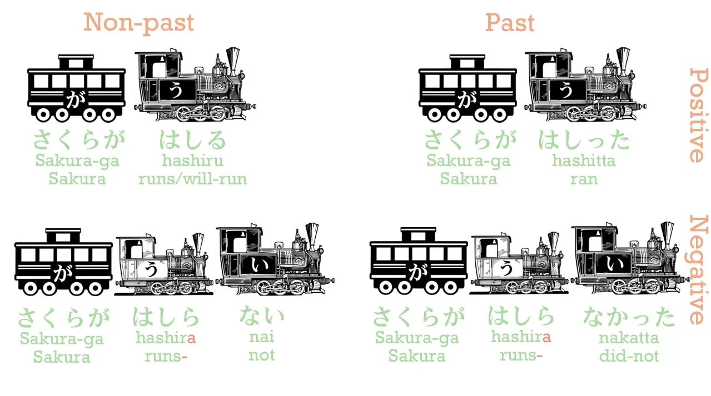

Now, as we all know. <code>さくらがはしる</code> is rather unnatural Japanese, just as it's rather unnatural English. We say <code>Sakura is running</code> in English, and in Japanese we say <code>さくらがはしっている</code>. So if we want to put all that in the past, what do we do? Well, all we have to do is put that <code>いる</code> into the past. 

So we say <code>さくらがはしっていた</code> – <code>Sakura was running</code>.

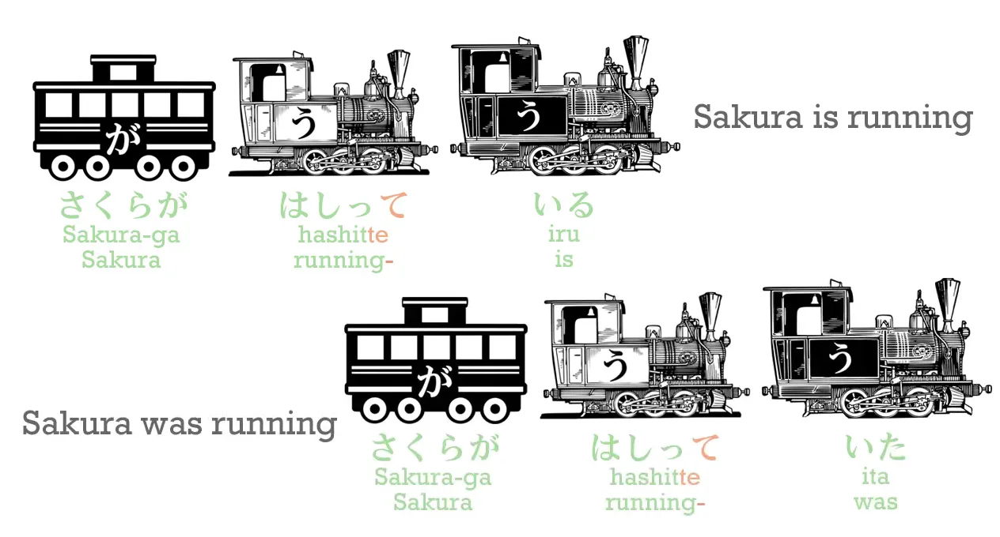

And if we want to say <code>Sakura wasn't running</code>, we say <code>さくらがはしっていなかった</code>. That <code>いる</code> is a simple ichidan verb, so we just drop the -る and put on た *(positive past)* or ない *(negative)* and, in the past, なかった. *(since ない in the past becomes なかった)*

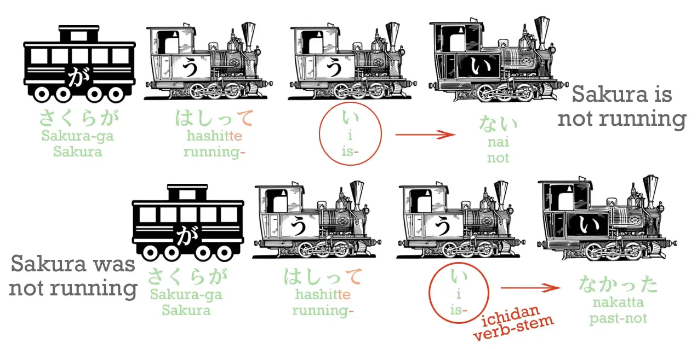

**I always say that Japanese is like Lego.** **Once you know the basic building blocks you can build anything.** **And there are almost no exceptions in Japanese.**

## Exceptions

In the whole of what we've been talking about today there are really just two exceptions. And I'm going to introduce those so that you know everything you need to know. 

**The only real exception to every verb being made negative by adding <code>ない</code> is the verb <code>ます</code>, which is a helper verb that makes words formal.** *(polite)* **We add it to the い-stem of a verb**, and we will look at the い-stem later, but I think you can already guess what it is. 

So, <code>はなす</code> becomes <code>はなします</code>, <code>きく</code> becomes <code>ききます</code> and so on. When you put <code>ます</code> into the negative, it does not become <code>まさない</code>, as you would expect – **it becomes <code>ません</code>.**

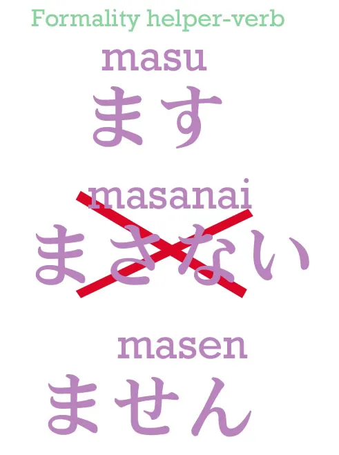

**Because it's formal, it's a bit old-fashioned and it uses the old Japanese negative <code>せん</code> instead of <code>ない</code>.**

::: info
Dolly once again makes a typo here in the video, I fixed it again.
:::

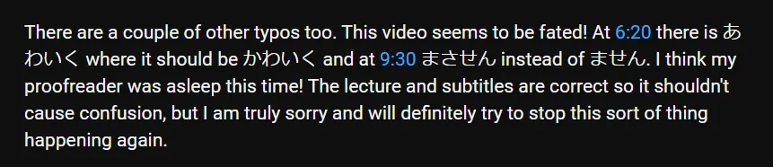

The only other apparent exception is that <code>いい</code> , the adjective <code>いい/良い</code>, which means <code>is-good</code>, has an older form, <code>よい/良い</code>, which is still used quite often. And **when we make any transformation to <code>いい</code>, it turns back to <code>よい</code>**, so in the past tense we don't say <code>いかった</code>, **we say** <code>**よ**かった</code> – and if you've seen much anime you've probably heard this quite often.

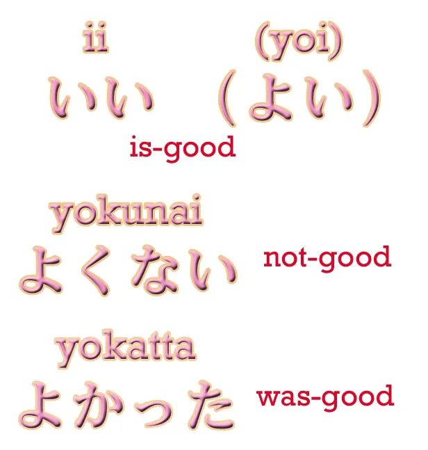

<code>よかった</code>, literally <code>(zeroが)よかった</code> – <code>(It) was good / That turned out well / That's great</code>. And if you want to say something is not good, you don't say <code>いくない</code>, **you say** <code>**よ**くない</code>. And those are the only exceptions.
