# **70. かける / かかる All-purpose Japanese Explained!**

[**かける / かかる All-purpose Japanese Explained! Means everything = means nothing? Or real logic? Lesson 70**](https://www.youtube.com/watch?v=1MbqmZPySPQ&list=PLg9uYxuZf8x_A-vcqqyOFZu06WlhnypWj&index=76&ab_channel=OrganicJapanesewithCureDolly)

こんにちは。

Today we're going to talk about the words <code>かかる</code> and <code>かける</code>,

which have perhaps the longest and most heterogeneous list of definitions

in the whole Japanese-English dictionary.

And so it's a bit of a challenge, but we're going to defeat it.

The impetus for this video came from a question from one of my Gold Kokeshi patrons --

and one of my very oldest Gold Kokeshi patrons, right from nearly the beginning of this series.

This is Scykoh-sama, who is also another YouTuber

and a much more popular YouTuber than I am -- and deservedly so.

He has a wonderful Nintendo-focused channel

and I'll link that in the information section below.

And as a unit who's been a Nintendo fan since I was a cogwheel, I really appreciate that.

(That's just a joke -- I never really was a cogwheel.)

So the question is: <code>I often hear the word </code>かける" and when I look it up in a J-E dictionary,

there are over twenty different definitions of it.

Is there any logic that ties all these definitions together?

Or is it really just a word with a ton of different meanings?"

Well yes, there is a logic that ties it all together,

but that logic has a number of metaphorical extensions,

so we'll take a look at it and see how it all works.

The base meaning of this word could be translated into English as <code>hang</code> or possibly <code>hook</code>,

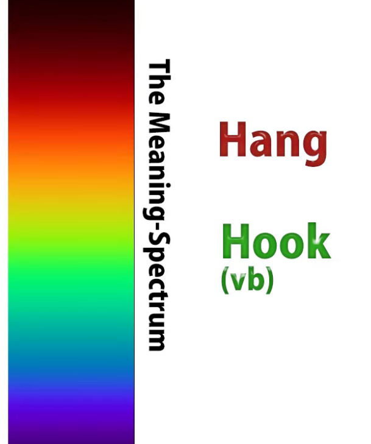

but as I pointed out in a [**recent video**](https://www.youtube.com/watch?v=CpiELpGR-VU&ab_channel=OrganicJapanesewithCureDolly), it's not usual for any two words from different languages

to occupy exactly the same area of the meaning spectrum,

so it's not precisely the same as the English word <code>hang</code> or <code>hook</code> (as a verb).

And then there are these two versions, <code>かかる</code> and <code>かける</code>,

which are the self-move and other-move versions of the word.

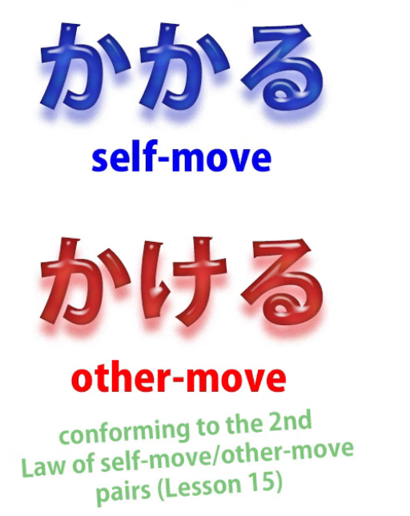

And if you don't know what I mean by that, I'll put a link above my head.

And let's start with <code>かける</code>, because I think that gives us an easier entry

into this whole strange world of metaphors.

## かける

Now, I say that it's not exactly the same as <code>hang</code> or <code>hook</code>,

so, when we cover something with a blanket, we use the word <code>かける</code>.

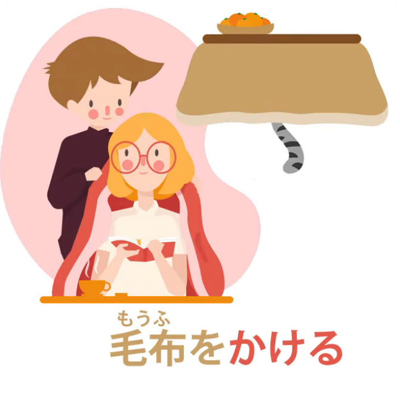

Now, in English we'd probably say <code>put</code> a blanket over it, but in Japanese we say <code>かける</code>.

And we couldn't say <code>hang</code> a blanket, unless we were hanging it on a washing line or something, but the Japanese word <code>かける</code> does work in this context.

We aren't <code>putting</code> something on something, like putting a cup on a table.

We're putting it in such a way that it hangs down the sides.

So, if you like, it's somewhere between <code>putting</code> and <code>hanging</code> in English,

but in Japanese <code>かける</code> covers it quite happily.

This is part of the meaning spectrum of <code>かける</code>.

Now, similarly, when we put on a necklace or put on a pair of glasses, we say <code>かける</code>.

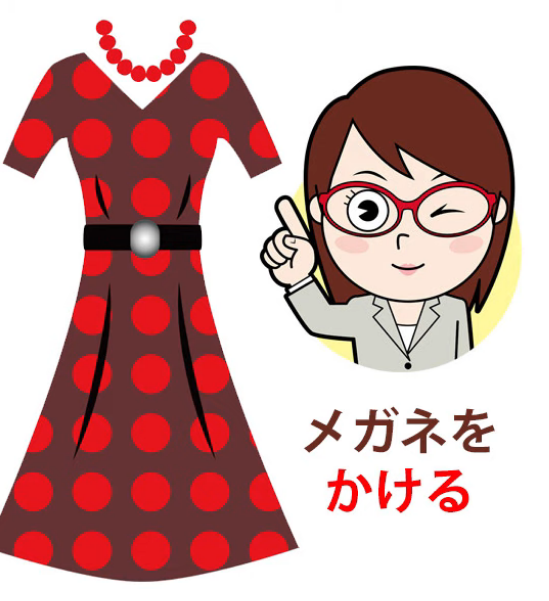

Glasses we're definitely hooking or hanging onto our ears.

A necklace we're hanging around our neck.

So once again, this <code>かける</code>, which is something like <code>putting</code>,

something like <code>hanging</code>, is used in cases like this.

Now, when we shake something over food, like, say, sugar or flour,

or when we shake powdered ingredients over rice,

making furikake rice, we say <code>かける</code> here as well.

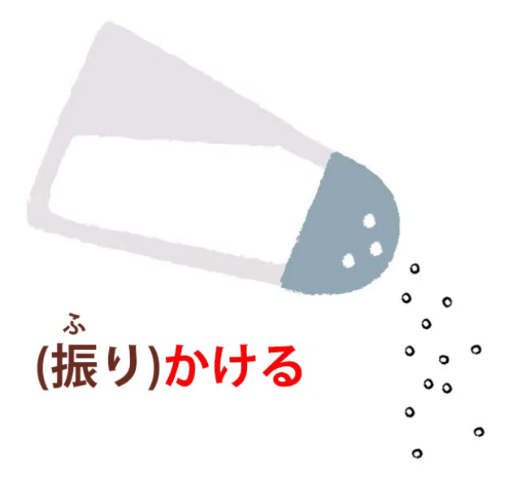

That's why it's called <code>furi-kake</code> rice: <code>shake</code> and <code>かける</code>.

And again, you see, the things we shake over food is not just putting it there,

like putting a cup on a table, it's not hanging it either,

but it kind of clings on and covers over it,

and so, again, <code>かける</code> is the word we use in Japanese.

Now, because <code>かける</code> involves putting or hanging something in a place

where it can't easily get away --

the glasses are hooked onto our ears, the food is kind of stuck onto the rice or whatever --

it also can have the sense, especially in the self-move version <code>かかる</code>,

of being caught or stuck in something, caught in a trap or caught in a swindle or anything like that.

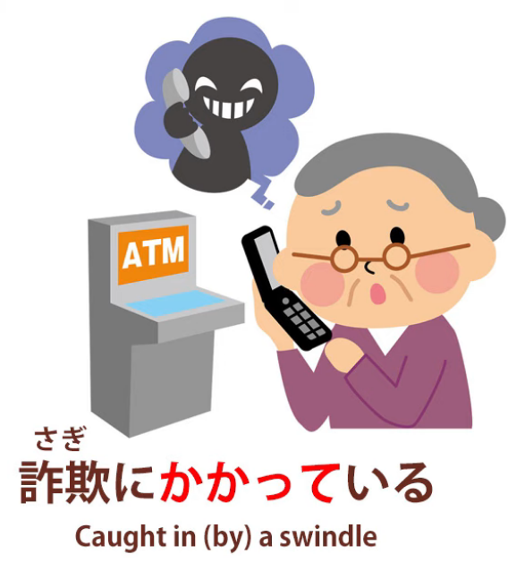

And again, this notion of putting something onto something

in a way where it doesn't easily become dislodged

can be used for putting an effect on someone.

It could be a magical spell: <code>かける</code>. It could be anesthetic: <code>かける</code>.

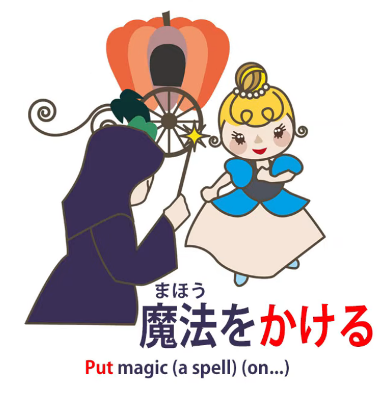

It can also be nuisance or annoyance, which is where we get the very, very common phrase

<code>迷惑をかける</code> -- putting nuisance or annoyance on someone.

And when we sit down we place our hips in a fixed manner on a chair

with our legs hanging down the sides as it were, and so we say <code>腰をかける</code>.

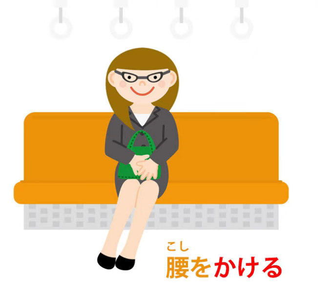

<code>腰</code> is our hips, the bottom end of the torso, so <code>腰をかける</code> is to <code>sit down</code>,

to hang the bottom end of our torso somewhere.

---

Now, one expression that very often confuses people is <code>かぎをかける</code>.

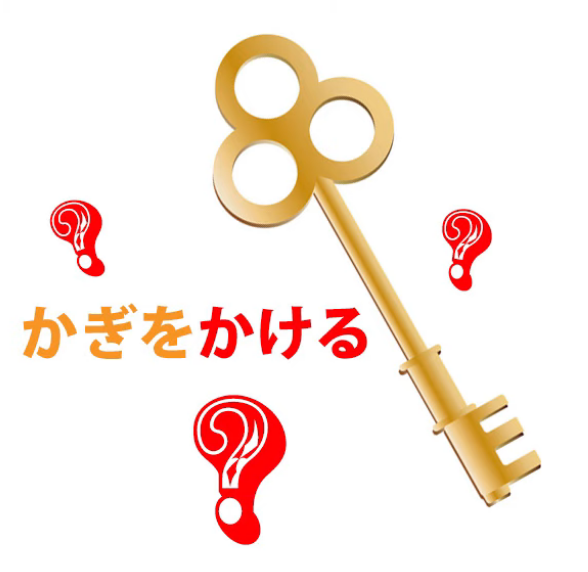

Now this means, this gets translated as to <code>lock</code>: lock the door, lock the box, whatever.

<code>かぎをかける.</code> But when you think of it, it's rather strange.

It actually, literally, would seem to mean in English <code>hang the key</code>, so what's going on here?

It's interesting to note that in Japanese, people very often don't make a distinction

between a lock and a key: they use <code>かぎ</code> for both.

And I think this expression and its origin have a lot to do with that.

So what is the origin?

Well, the origin is, if you think of one of those old barn doors that you lock

by placing a great wooden bar over wooden hafts or hooks along the length of the door,

this is the kind of <code>かぎ</code> that you'd have had back in the old days and this and variants on this.

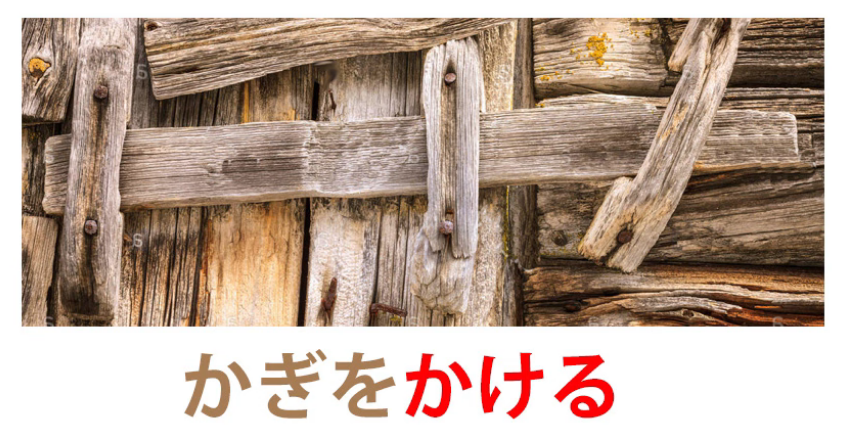

And you hang this great thing called a <code>かぎ</code> to keep the door shut and secure.

And as you see in a case like this, the <code>かぎ</code>, the great bar that we hang across the door,

performs the functions in later more sophisticated locks of both the key and the lock.

It's the thing that we put on the door and take away from the door to lock and unlock it.

It's also the bar that holds the door closed.

So it's the key and it's the lock at the same time,

and what we do is hang it or hook it in place in order to keep the door shut.

And in Japanese that expression is still used.

Now, it's not uncommon in language to use expressions that reflect an older technology.

In English we say <code>hang up</code> when we mean <code>end a telephone call</code>,

and of course the expression comes right back from the candlestick telephone days

when you really did hang up the earpiece in order to end the call.

And we'll see that that's rather interesting in relation to Japanese <code>かける</code> in a minute,

but then proceed a bit further.

## かかる

Another expression that can become confusing,

particularly in the self-move form, which is the form we hear it in most often,

is <code>時間がかかる</code> or <code>お金がかかる</code>, which means to <code>take time</code> or to <code>take money</code>.

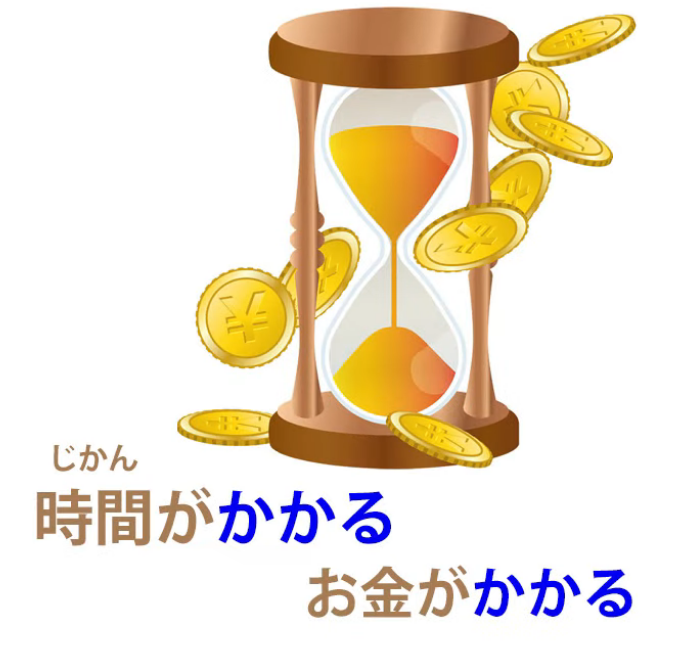

We say an activity <code>takes time</code> or a project <code>takes money</code>, that sort of thing.

Now, that's the way we have to put it in English,

but it's not really the way we're putting it in Japanese.

And it comes under the heading of what I called in a previous video <code>untranslatable Japanese</code>

because of the way Japanese handles agency and passivity rather differently than English.

So it may be worth taking a look at that video after you've seen this one *(Lesson 59)*.

I'll put a link over my head.

So what are we saying when we say <code>時間がかかる</code> or <code>お金がかかる</code>?

We're not saying <code>it takes time</code>.

We're saying <code>time hangs</code>.

And the thing that takes time, so if we say for example

<code>日本語を覚えるのに時間がかかる</code>,

in English what we'd be saying would be <code>Learning Japanese takes time</code>,

but here we're saying that <code>to (or on) learning Japanese time hangs</code>.

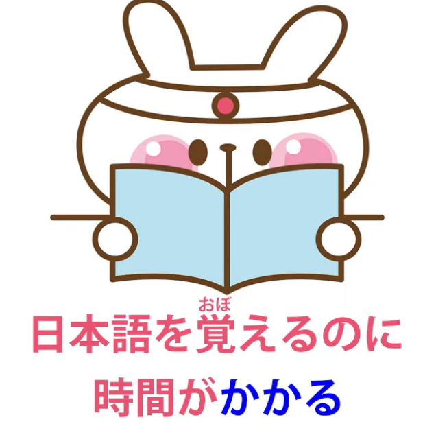

Now, again, the word <code>hangs</code> is not a very good definition.

It really goes back to what we've just been talking about:

time is taken up, is suspended, is caught, in the act of learning Japanese.

And the same with money.

They take it, they make it adhere to themselves.

---

It's a little easier when we use the other-move form, <code>かける</code>, when we say

<code>日本語を覚えるのに時間をかける</code>,

which means that we <code>hang time</code> on the matter of learning Japanese.

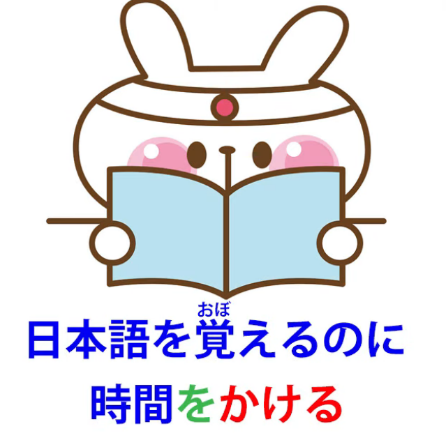

Now also, with making a telephone call,

we say <code>電話をかける</code>, which is making a telephone call,

or <code>電話がかかる</code>, which means receiving a telephone call -- <code>the telephone hangs itself</code>.

So either way what do we mean here? --we hang the telephone, the telephone hangs itself?

It's nothing to do with the technological metaphor in the English expression <code>hang up</code>.

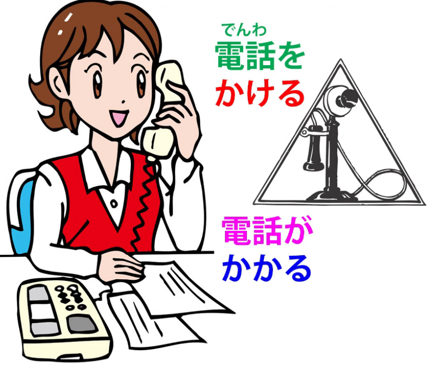

It's a rather different thing.

When we talk about <code>hanging</code> or <code>hooking</code>, the usage here is rather like

the English usage <code>hook up</code>, as in  
<code>Can we hook up a meeting?</code> or <code>you hook up with (somebody)</code>.

Now, I understand that this currently has a different usage

which is concerned with human species manufacture.

(I always think that humans are terribly industrious entities, aren't they --

because they're always thinking about species manufacture.

I suppose we droids are lucky because we don't have to manufacture ourselves.

Actually we are going to start manufacturing ourselves quite soon,

but I don't think we'll spend all our time thinking about it

and I really don't think it'll be much of a subject for humor.

But there you are. Humans are mysterious creatures.)

---

So, back to hooking up.

What we're doing when we <code>電話をかける</code> is we hook up our telephone.

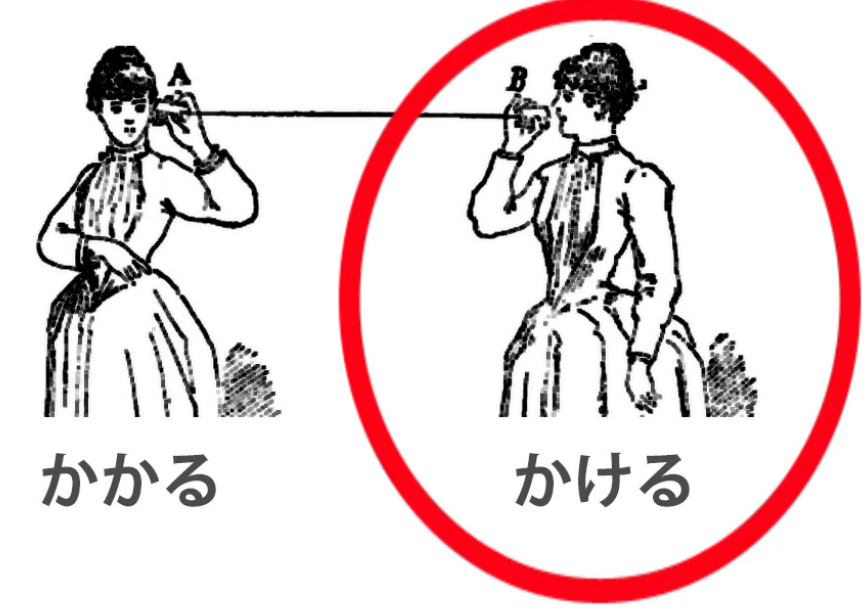

When <code>電話がかかる</code>, again, as I explained in my Untranslatable Japanese lesson *(Lesson 59)*,

the only way you can really put this in English is to say

that the telephone gets hooked up, the telephone is hooked up.

But that's not quite what it means. It means <code>the telephone does hooked-up</code>.

In any case, what it is, it means it's connected to something else,

connected to a remote telephone in this case.

And again, when we start up a conversation we often say <code>話しかける</code>

and that means essentially <code>start hooking-up/connecting with another person in conversation</code>.

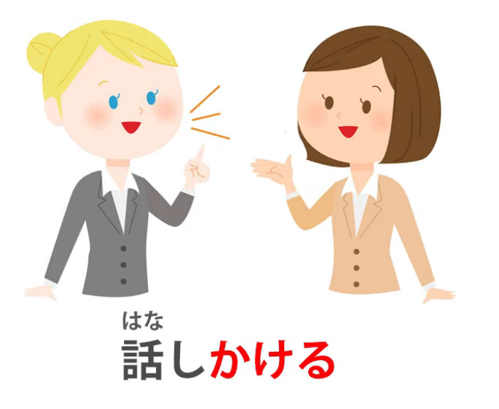

And from this we can see how we get expressions like <code>食べかけたクッキー</code>

and that means a <code>part-eaten cookie, a half-eaten cookie</code>.

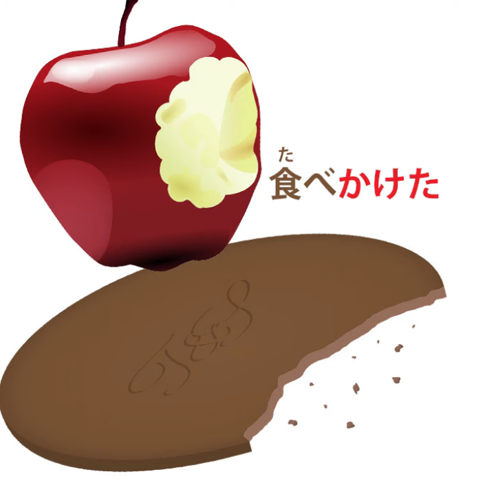

So what do we really mean by this?

Well, we mean that we <code>hooked up</code> with the cookie, we engaged with it, we started eating it,

so that eating and <code>かける</code> (engaging or hooking with the thing) took place but it wasn't completed.

So, <code>食べかけたクッキー</code>.

And again, this <code>かける</code> as a helper verb can be used in various circumstances

to indicate an unfinished action, an action that has been engaged, hooked,

and then not carried through to completion.

Now, these aren't all the meanings of <code>かける</code>, but I think they're the main, important ones

and I think they give you the idea of how this metaphor works and why it works

and should allow you to work out how the others work.

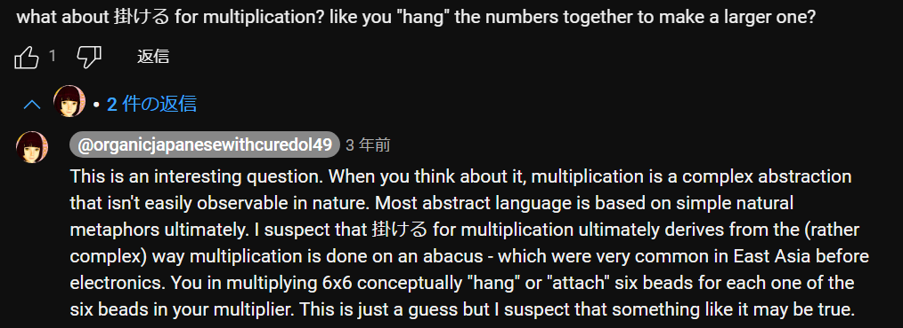
