# **71. Japanese counters: 3 simple rules**

[**Japanese counters: 3 simple rules make them easy! Lesson 71**](https://www.youtube.com/watch?v=OA78aKz0oIQ&list=PLg9uYxuZf8x_A-vcqqyOFZu06WlhnypWj&index=73&ab_channel=OrganicJapanesewithCureDolly)

こんにちは。

::: info
Yomichan or Rikaichamp will be useful here…I made the decision to use Kanji forms mainly, since I feel like it might show the counters a bit better, even if it may be harder to read.
:::
Today we're going to talk about counters in Japanese.

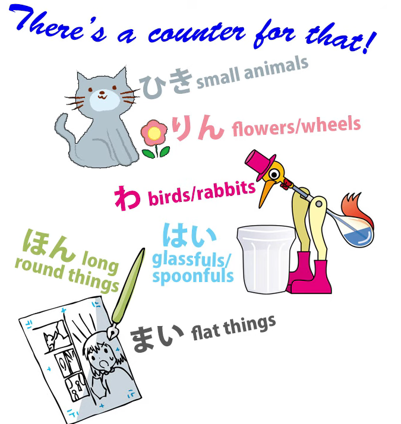

Now, as we all know, the textbooks like to present

Japanese as a kind of mysterious language

full of completely random and irrational rules

and items that we just have to learn

because there's no particular reason for them.

And, as you all know if you've been following my video lessons,

most of the time this isn't true.

Most of what goes on in Japanese is completely reasonable and logical

if you just know how it works,

which the people who write textbooks don't appear to.

*(or rather they know, but simplify it for bilingual learners, since they are just textbooks…)*

However, counters might seem like an exception to this rule.

There are a lot of them. An awful lot of counters.

In Japanese you can't just say <code>one dog</code> or <code>two flowers</code> or <code>three birds</code>.  
You have to use a counter.

So we say <code>一匹の犬 / いっぴきの犬</code> -- <code>one dog</code> -- and the counter here is <code>匹 / ひき</code>,

which gets pronounced <code>ぴき</code> in this particular instance. *(It is a counter for small animals)*

For <code>three birds</code> we say <code>三羽の鳥 / さんわの鳥</code>, and the <code>羽 / わ</code> is a counter *(for birds…)*.

So it looks as if we have to learn an awful lot of counters, doesn't it,

just to say what in English you can say by the number and the thing.

And there really are a lot of counters -- dozens and dozens of them *(actually, hundreds (″ロ゛)*.

So this looks like a problem, doesn't it?

But it's not, in fact, nearly as much of a problem as it appears to be.

First of all, although there are an awful lot of counters,

only about a dozen of them are really commonly used *(Thank ye, Lord Dio…ε=ε=┌(;￣▽￣)┘)*.

---

Secondly, most of the time we can avoid them by using

the native Japanese counting system, which doesn't require counters.

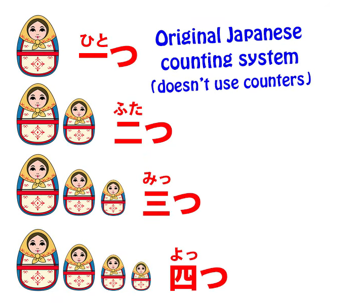

So if we use the <code>一つ, 二つ, 三つ, 四つ, 五つ</code> counting system, we don't need any counters.

We can use them for nearly everything --

not people, not small animals, but practically everything else

we can use the Japanese counting system if we want to.

So the important thing here, as I'm sure you won't be surprised to hear me say,

is that what we're not going to do is start learning lists of counters.

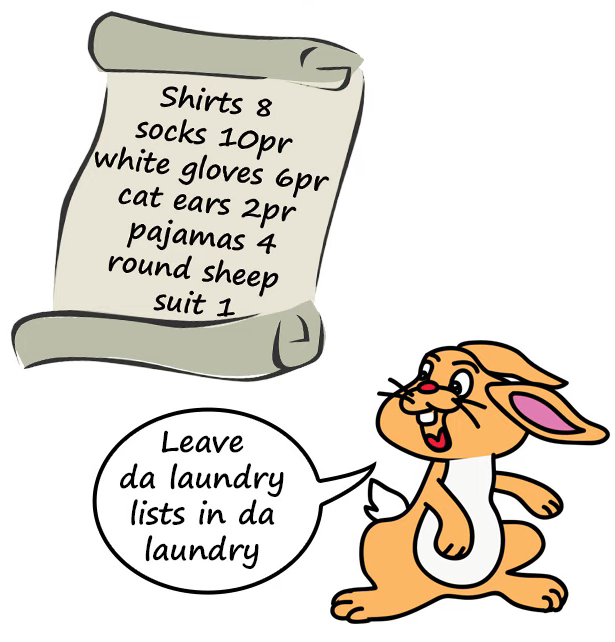

That, if you'll excuse the expression, would simply be counterproductive.

And there are several reasons why we don't need to.

## Memorizing counters is not necessary 

First of all, in terms of understanding Japanese,

they don't present many problems at all.

If we hear someone saying a number and a thing we know,

if there's a little word in between the two, we know it's a counter.

So we know what they've said.

If they say <code>一輪の花</code>, we know they're saying <code>one flower</code>.

<code>一... 花</code>, and the <code>輪 / りん</code> must be the counter. *(輪 / りん, counter for wheels & flowers)*

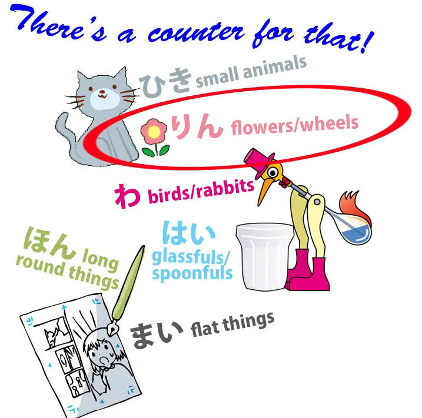

If we hear someone saying <code>二羽の鳥</code>, we know that they're saying <code>two birds</code>:

<code>二... 鳥</code>, and the <code>羽</code> is the counter.

If we hear someone saying <code>三匹の猫 / さんびきの猫</code>

-- now, even if we knew <code>匹 / ひき</code>, but we didn't know that at three it becomes <code>びき</code>,

that's not a problem because we know <code>三</code>, we know <code>猫</code>,

and we know that things that come between numbers and their object are going to be counters.

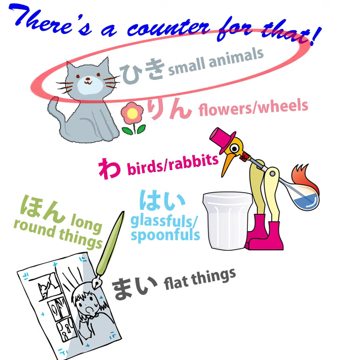

Should we put them into our Anki?

Yes, we should. We'll get to know them over time. But we don't have to fret about learning them.

And as I've indicated, the counters aren't pronounced the same way all the time,

and that's much less of a problem than it appears to be if we understand how it works.

And I'm going to talk about that towards the end, but it's not really terribly important.

It's actually much more important to understand how they work structurally.

There are two ways of using counters,

and it's the second of those ways that I think often confuses foreigners.

## Two ways of using counters

The first way, actually, is quite similar to English.

So when we use <code>匹 / ひき</code> for animals or <code>枚 / まい</code> for sheets of paper, shall we say,

it's not that dissimilar to saying <code>five heads of cattle</code> or <code>a dozen sheets of paper</code> in English.

Not quite the same thing, but it's very similar.

### The second use

The usage that confuses people is when we say things like <code>猫が五匹います</code> *(count. read ひき)*.

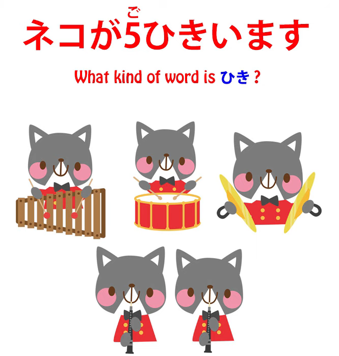

And that would be translated as <code>There are five cats</code>, and that is how we'd say it in English.

In Japanese we're saying something a little different.

And to understand the structure, we need to understand that.

So, first of all, what kind of a word is a counter?

What part of speech does it represent?

Well, it's not a verb and it's not an adjective.

It's not a particle and it's not a conjunction.

So, nine times out of ten, what is a word if it's not a verb or an adjective

or a particle or a conjunction?

What is it? It's a noun!

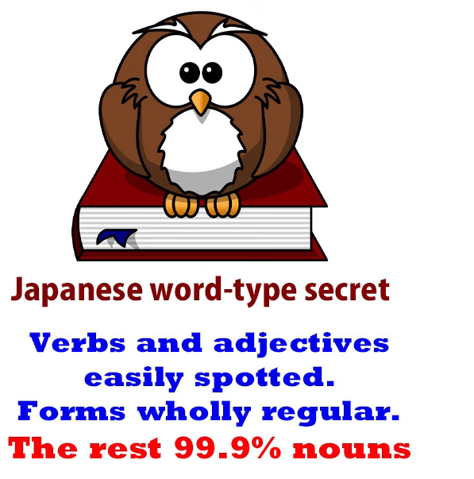

Nearly always it's a noun, and that is true of counters.

Counters are nouns. That's why we use の after them.

We say <code>一輪の花</code>, <code>三匹の猫</code>, just as we would with any other noun:

<code>魔法の杖</code> -- <code>magic wand</code>; <code>三匹の猫</code> -- <code>three cats</code>.

---

But when we say <code>猫が三匹いる</code> -- <code>there are three cats</code> in English

-- what are we actually saying? --

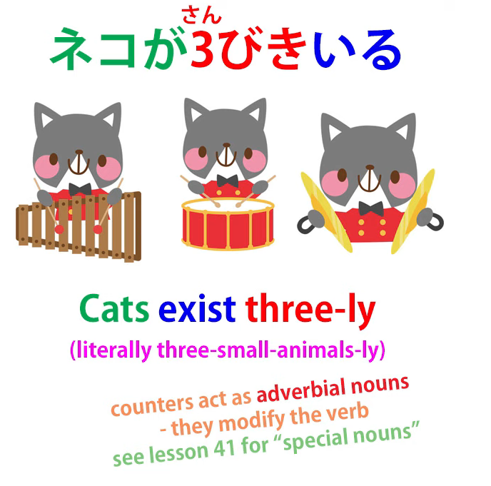

Well, the thing to understand here is that counters aren't ordinary nouns.

They are what I called in my video about special noun types *(Lesson 41)*,

they're what I called <code>foxy nouns</code>, that is to say, adverbial nouns.

They are nouns that have the special property of being able to modify verbs.

And that's what's happening here.

When we say <code>猫が三匹います</code>,

we're actually saying <code>cats, three-small-animals-ly exist</code>.

Now, that's very difficult in English, isn't it?

We could make it sound a little bit simpler by saying

<code>cats three-ly exist</code> or <code>cats exist threefold-ly</code>,

but in fact because of the counter system we're saying <code>cats exist three-small-animals-ly</code>.

We're describing the way they exist.

They exist in a three-small-animals way.

If there were four of them, they'd be existing in a four-small-animals way.

And that's why sentences like that have to end in a verb.

The verb modified by a counter is often, as in this case, the verb of being,

but it doesn't have to be. For example, we might say

<code>写真を三枚取った</code> -- <code>I took photographs three-flat-things-ly</code>.

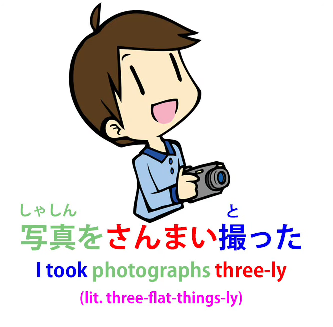

And while that's very different from the way we put it in English,

it's useful and important for the structure to understand that

that is in fact what's happening in the Japanese.

Now, what about learning the counters and learning the sound-changes of the counters,

which really tends to worry people.

---

Now, as I said, we don't need to learn lists of counters.

We'll pick up counters as we go along in our Japanese immersion.

When we encounter a new counter in our reading or our Japanese-subtitled anime,

we can put it into our Anki and we'll gradually build up our stock of counters.

The counters that are commonly used are not that huge in number.

We have <code>枚</code> for flat things like sheets of paper or coins.

We have <code>本</code> for long round things, <code>冊</code> for books.

That might seem strange because why do we have <code>冊</code> for books

and <code>本</code> for long round things, when <code>本</code> actually means <code>book</code>?

---

Well, that's because when the word <code>本</code> first came into being and meant,

among other things, a book, at that time books were long round things. They were scrolls.

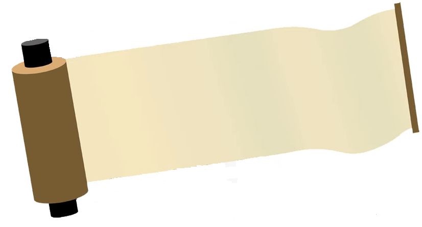

So a book was counted in the way that other long round things were counted.

But later on, when books became flat things with pages, the counter was changed to <code>冊</code>.

So, we probably need a dozen or so counters for everyday use

and we'll pick those up reasonably quickly.

## The sound changes for counters

But what about all the sound changes?

Let's take <code>匹 / ひき</code>, which is the counter for small animals.

We say <code>いっぴきの猫</code> -- one cat, <code>にひきの猫</code> -- two cats; <code>さんびきの猫</code> -- three cats;

<code>よんひきの猫</code> -- four cats; <code>ごひきの猫</code> -- five cats; <code>ろっぴきの猫</code> -- six cats;

<code>ななひきの猫</code> -- seven cats; "はっぴきの猫 -- eight cats;

<code>きゅうひきの猫</code> -- nine cats; <code>じゅっぴきの猫</code> -- ten cats.  
::: info
よんひき in Kanji looks interesting :D 四匹.
:::
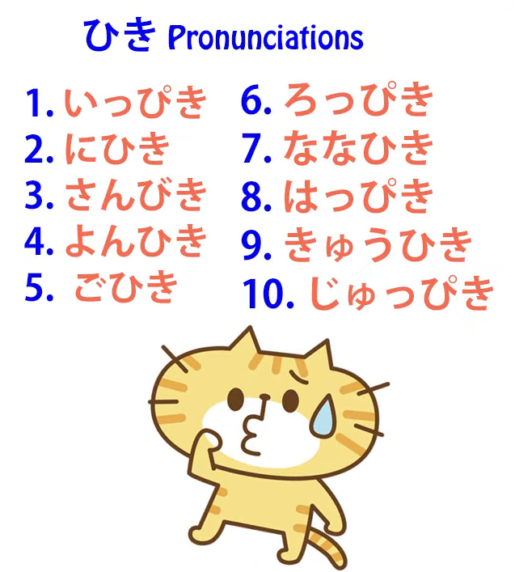

And then other counters have other variations.

So it starts to seem very, very complicated,

but as a matter of fact there aren't that many variations,

and they follow a very simple pattern.

### Kana rows without sound changes - ま, ら, わ (+ I guess な, や if they exist)

#### Rule 1

First of all, if the first kana of a counter can't take a ten-ten *=〃(another name for <code>[**Dakuten**](https://en.wikipedia.org/wiki/Dakuten_and_handakuten)</code>)*,

then there aren't going to be any variations at all.

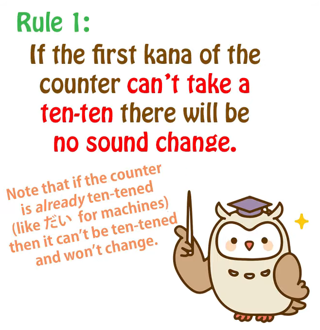

That deals with over half the problem straight away.

---

So, if we have the counters like <code>枚</code>, counter for flat things like coins or pieces of paper.

Can you put a ten-ten on <code>枚</code>? No, you can't.

You can't put a ten-ten on any of the ま-み-む-め-も column,

and therefore there can't be any variant on <code>枚</code>:

<code>一枚, 二枚, 三枚, 四枚, 五枚</code> and so on.

<code>輪</code>, the counter for flowers and wheels --

Can you put a ten-ten on <code>り</code>? No, you can't.

You can't put a ten-ten on any of the ら-り-る-れ-ろ column, can you?

So we know that <code>輪</code> can't have any exceptions:

<code>一輪, 二輪, 三輪, 四輪</code> etc.

Or how about <code>羽</code>, the counter for birds?

Can you put a ten-ten on <code>羽</code>? No, you can't.

So again that has to be completely regular:

<code>一羽, 二羽, 三羽, 四羽...</code>

So now we've disposed of an awful lot of counters, haven't we?

All of those are just straightforward and regular.

What about the others?

### Kana rows with sound changes - た, さ, か, は

Well, which are the kana onto which you can put a ten-ten?

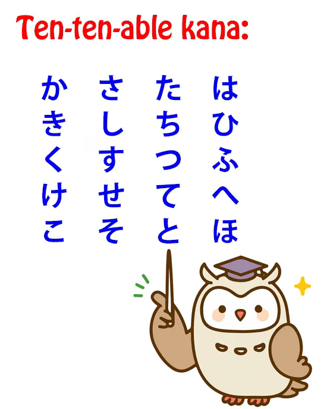

It's the た column, the さ column, the か column

and of course the は column,

which can have a ten-ten to become ば-び-ぶ-べ-ぼ

or a maru *= ゜* to become ぱ-ぴ-ぷ-ぺ-ぽ.

#### Rule 2

What do we know about these? Well, first of all, we know that in the first and last numbers of the sequence all of them work differently from the non-ten-tenable kana  
and they all work the same as each other.

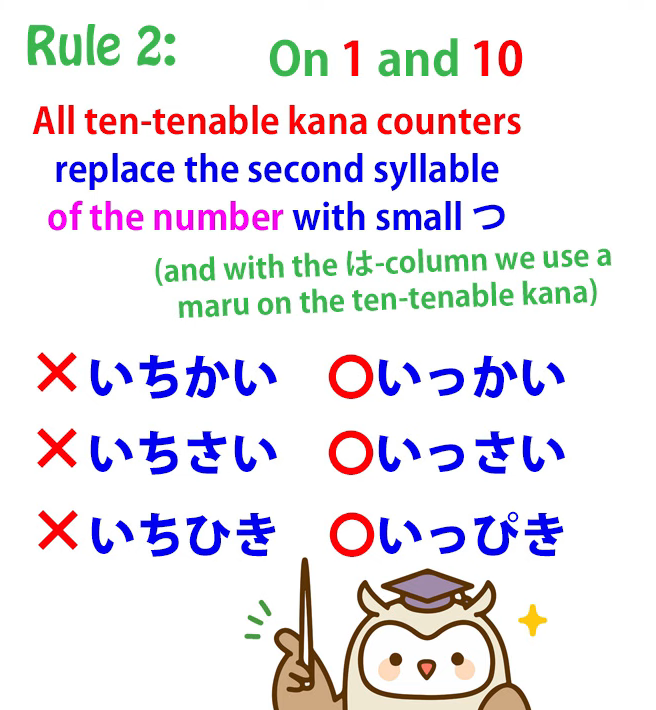

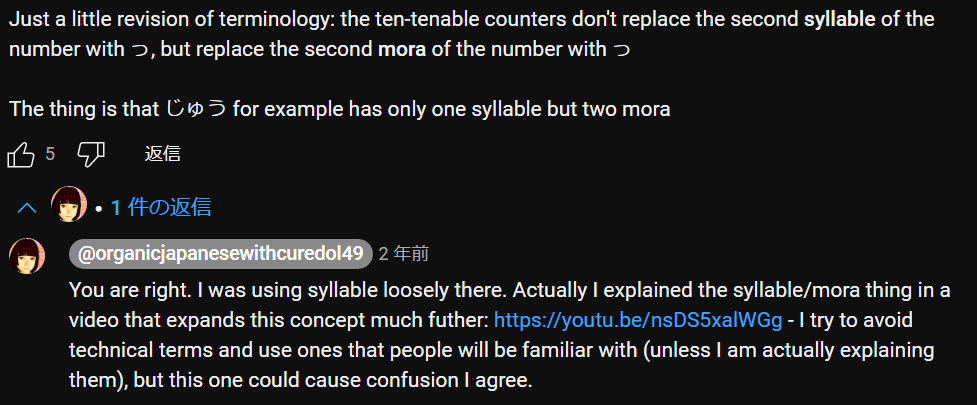

::: info
[**The video link there**](https://www.youtube.com/watch?v=nsDS5xalWGg&ab_channel=OrganicJapanesewithCureDolly), if you wanted to watch it, since it is not in the transcript (I think).
:::
So if we take <code>階 / かい</code>, the counter for floors in a building,

we don't say <code>いちかい</code> -- we say <code>いっかい</code>.

If we take <code>歳 / さい</code>, the counter for years of age,

::: info
there is also 才, which seems to be a <code>kid</code> alternative to 歳 (but [**is not its simplified ver.**](https://japanese.stackexchange.com/a/1844)).**  
**However, 歳 seems to be the only one that is actually used in official communication.
:::

we don't say <code>いちさい</code> -- we say <code>いっさい</code>.

If we take <code>匹</code>, which we've been dealing with before,

we don't say <code>いちひき</code> -- we say <code>いっぴき</code>. So that works the same.

And with ten, at the other end of the basic scale,

we don't say <code>じゅうさい</code> -- we say <code>じゅっさい / 十歳</code>.

::: info
Dictionaries may also say it can be read as <code>じっさい</code>, **[which seems old-fashioned](https://ja.hinative.com/questions/4546115#answer-12128924).**
:::
We say <code>じゅっかい / 十階</code>, tenth floor; <code>じゅっぴきの猫</code>, ten cats.

#### Rule 3

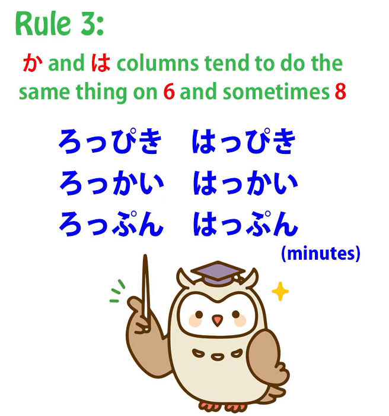

Now, the <code>か</code> and <code>は</code> rows, we tend

to do the same thing with <code>六</code> and <code>八</code> as well.

So we say <code>ろっぴき (六匹); はっぴき (八匹); ろっかい (六階); はっかい (八階)</code>.

And when we know that we pretty much know all of it.

#### Rule 4?

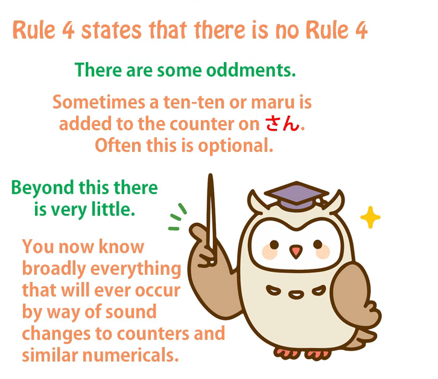

Sometimes a ten-ten goes onto the counter on <code>さん</code> as well.

So we say <code>さんびき (三匹)</code> and we say <code>さんがい (三階)</code>.

But this isn't completely regular. Not everybody says <code>さんがい</code>.

And a lot of the variations aren't completely regular.

The ones I've just told you are pretty regular.

The other odd ones don't tend to be very regular.

So, if you understand that, it sounds a bit complicated.

I wouldn't spend too much time trying to learn what I've just said, but bear it in mind,

because it'll just make it a little easier to pick this up when you see it.

<code>いっぴき, にひき, さんびき</code> -- which is a tendency that <code>さん</code> has, of course only with ten-tenable kana --

<code>ごひき</code> -- that's always going to be the same -- <code>ろっぴき</code>

<code>ななひき</code>-- that's always the same with everything -- <code>はっぴき, きゅうひき, じゅっぴき</code>.

Perhaps even at this stage that's starting to make sense.

It's conforming to a regular pattern. They aren't all over the place.

There are a few exceptions and nearly all the things that are genuinely exceptional

from the pattern I've taught you tend to be optional.

Not all Japanese speakers are going to use them all the time anyway.

They will say <code>いっぴき</code>; they won't say <code>いちひき</code>;

they will say <code>ろっぴき</code>; they won't say <code>ろくひき</code>.

If you get it wrong and say <code>ろくひき</code>, it's really not the end of the world.

Everyone's going to know what you mean.

It'll just sound a little bit cute and foreign.

And you will pick it up over time, because this is the sort of thing

you hear again and again, and it just becomes natural.

::: info
If you do tons of input or immersion, you should eventually acquire the feel for it.
:::
And because the patterns are almost regular across the range of ten-ten kana,

you start to know what sounds right, so that without a lot of intensive learning effort

you'll be saying it right nine times out of ten after a reasonable amount of exposure.

So it's really not something you need to sit down and learn.

You can save your bandwidth for things that really matter…
