# **72. The Great Connector (い-stem magic)**

[**Best kept secrets of Japanese structure - The Great Connector (い-stem magic) | Lesson 72**](https://www.youtube.com/watch?v=_qj9ZkAC2tE&list=PLg9uYxuZf8x_A-vcqqyOFZu06WlhnypWj&index=74&ab_channel=OrganicJapanesewithCureDolly)

こんにちは。

Today we're going to talk about

one of the most versatile aspects of Japanese structure.

It covers a number of areas that can be compared to other aspects of Japanese structure

and it'll make life a lot simpler if we make those comparisons, so that's what we're going to do.

This is something that isn't really explained well by most textbooks,

largely because they don't recognize the verb-stem system,

which is absolutely central to the way Japanese verbs work.

So, what it is, what we are going to talk about, is the い-stem of Japanese verbs.

In Japanese this is called the <code>連用形 / れんようけい</code>, which means the <code>connective use form</code>.

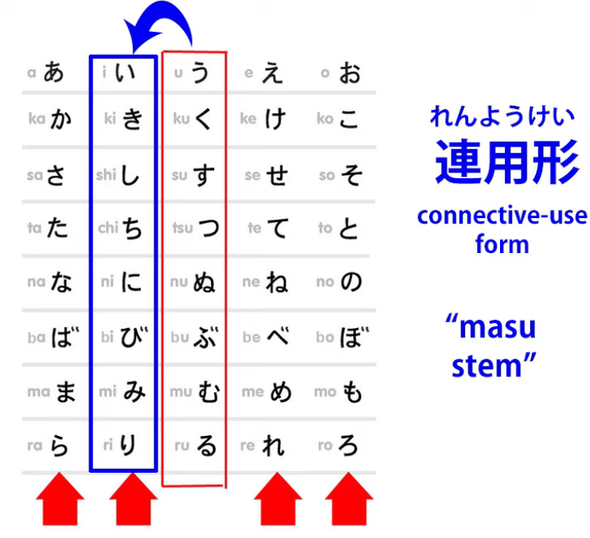

And we might call it <code>The Great Connector</code>, because it does a whole range of different connecting jobs, which we're going to talk about now.

In English it's sometimes called the <code>ます stem</code>, which is not inaccurate because of course

it does, among many, many other things, connect the helper-verb <code>ます</code>.

I don't like this expression because it stems from the whole ecology where

the so-called ます-form of verbs, which means verbs shifted into the い-stem

and having the <code>ます</code> helper verb attached to them, were the base-form of verbs.

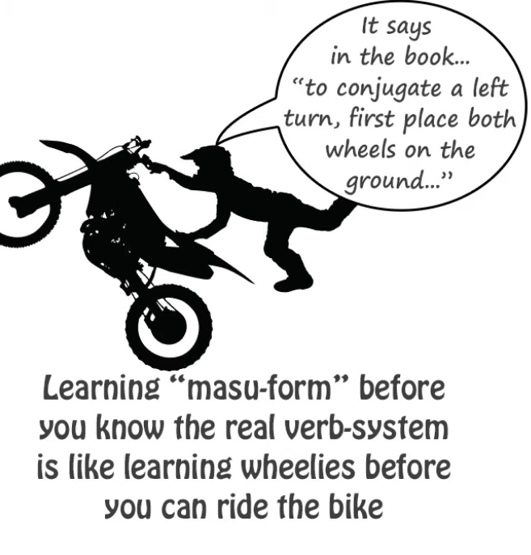

It's not the base-form of verbs.

It's just verbs with one among many other helper-elements attached to them.

And if we think it's the base-form of verbs

we're going to get very confused about what verbs are and how they work.

And I've done a video about that, so if you're in any doubt about all of this,

you might want to watch that.

So, what is this い-stem, this <code>連用形 / れんようけい</code> and why is it so important?

Well, obviously, what it is is simply the verb shifted from its base う-row form to the い-row.

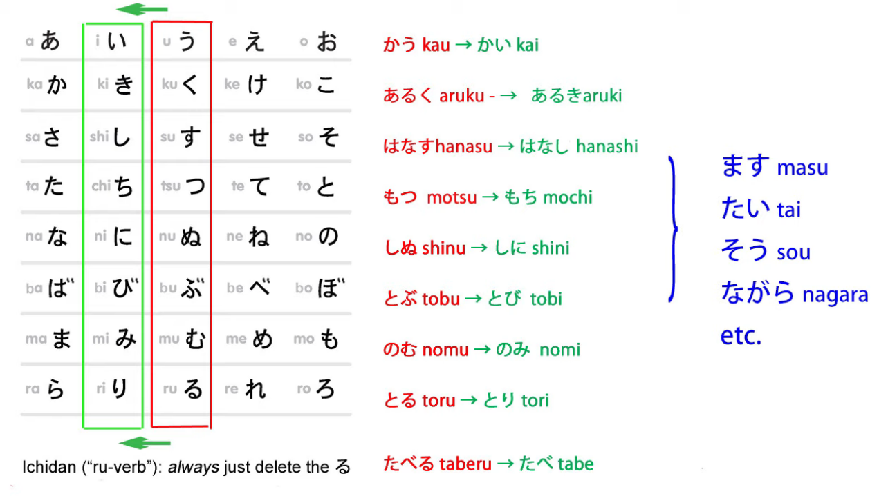

So that く-ending verbs end in -き, す-ending verbs end in -し, and so forth.

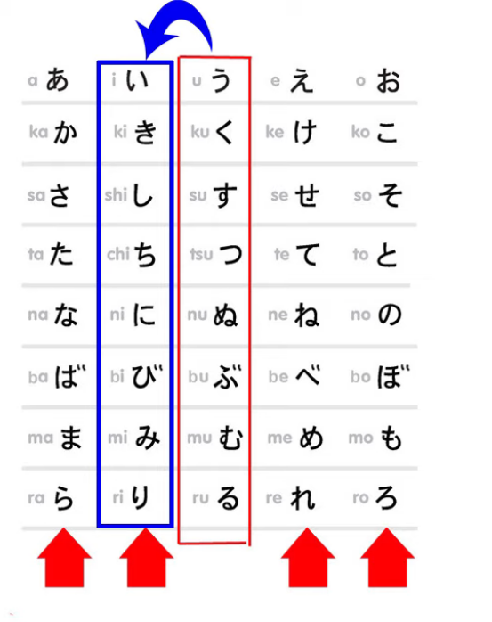

Because this is such a wide-ranging structural element,

I'm going to compare it to a couple of different things.

The first thing, the most obvious thing, to compare it to is the other three verb-stems.

It's similar to them, of course, because like all of them,

it is used for attaching fundamental helpers.

And by fundamental helpers I mean the things that

sometimes get called <code>conjugations</code> in the textbooks.

As we know, there is no such thing as conjugation in Japanese. *(or rather in the Western sense)*

There are just the four stems and various helper verbs, nouns and adjectives,

some of which get arbitrarily called <code>conjugations</code>, some of which don't,

and depending on which textbook you read, you'll probably get a slightly different take

on which ones are <code>conjugations</code> and which aren't,

which is perfectly natural because it's a wholly arbitrary category anyway --

there's no such thing as conjugation in Japanese, so the whole thing is fantasy.

And we don't necessarily expect consistency in fantasy.

---

So, the い-stem, as we know, connects the <code>ます</code> helper verb.

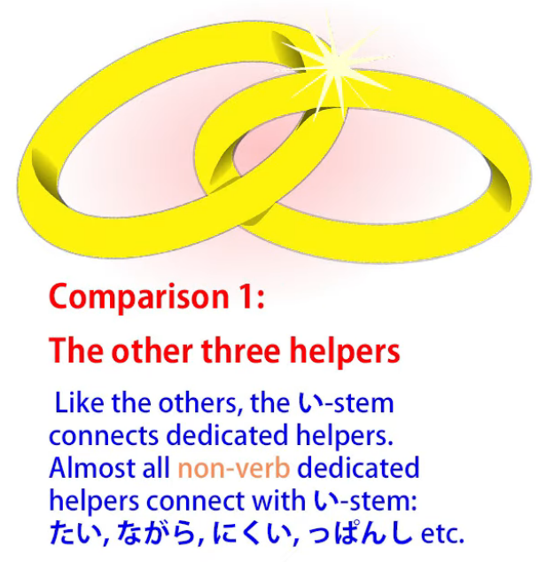

It also connects a variety of what we may call dedicated helper nouns and helper adjectives.

Generally, if we're going to attach a helper adjective or a helper noun to a verb,

we're going to attach it to the い-stem.

This isn't absolute, but it happens nearly all the time.

As we know, the helper adjective -ない attaches to the あ-stem, but that's unusual.

So, we can attach a variety of helper adjectives to the い-stem.

For example, I'm going to take the verb <code>読む</code>

as our model for most of what we're doing today.

So let's take the verb <code>読む</code> and turn it to the い-stem <code>読み</code> and we can attach adjectives

like <code>やすい</code>: <code>読みやすい</code> (easy to read), <code>にくい</code>: <code>読みにくい</code> (hard to read).

---

We also attach things like <code>ながら</code>.  
<code>ながら</code> means doing one thing while doing another, so we can say <code>歩きながら読む</code>

or <code>読みながら音楽を聴く</code>: so that's <code>while walking, I read</code>, <code>while reading, I listen to music</code>.

---

The <code>そう</code> helper, which gives us the meaning of likeness,

that also is attached to verbs with the い-stem.

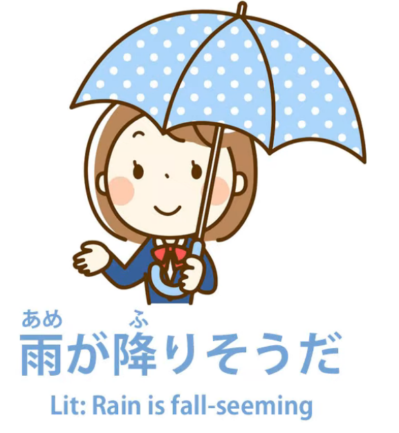

So we say <code>雨が降りそうだ</code> (it looks like rain) / *Rain is fall-seeming.*

and I've talked about this <code>そう</code> form and various related structures in another video, which I'll link. *(Lesson 24)*

## 連用形 connector & the て-form connector

Now, this shifts into the area where we can start to compare the い-stem,

the <code>連用形</code>, the Great Connector, to the て-form.

Now, the て-form is the other great connector, of course.

It connects all kinds of things.

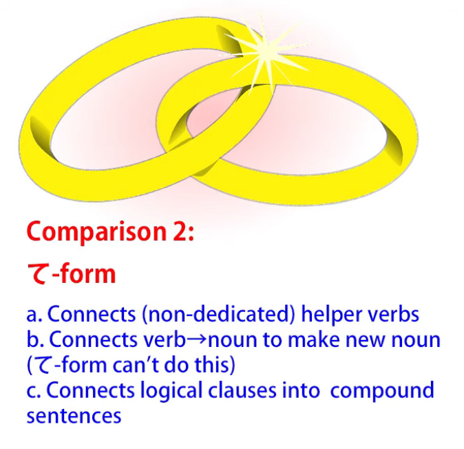

The い-stem is an even greater connector:

it can connect most of the kinds of things that the て-form also connects

and it can do a lot else beside.

So, with the て-form we often connect helper verbs that are not dedicated helpers,

that have a life of their own outside their helper capacity.

So we say <code>持って来る</code>, which means <code>fetch</code> (hold + come);

we can say <code>やって見る</code> (give it a try, literally do + see).

### Compound verbs

Now, in the same way we can produce compound verbs with the い-stem.

For example, we say <code>振り回す</code> (wave around).

And to return to our friend <code>読む</code>, we can say <code>読み始める</code>, which means <code>start reading</code>

or <code>読み込む</code>, which means read + pack in, which actually means <code>load</code> in the computer sense.

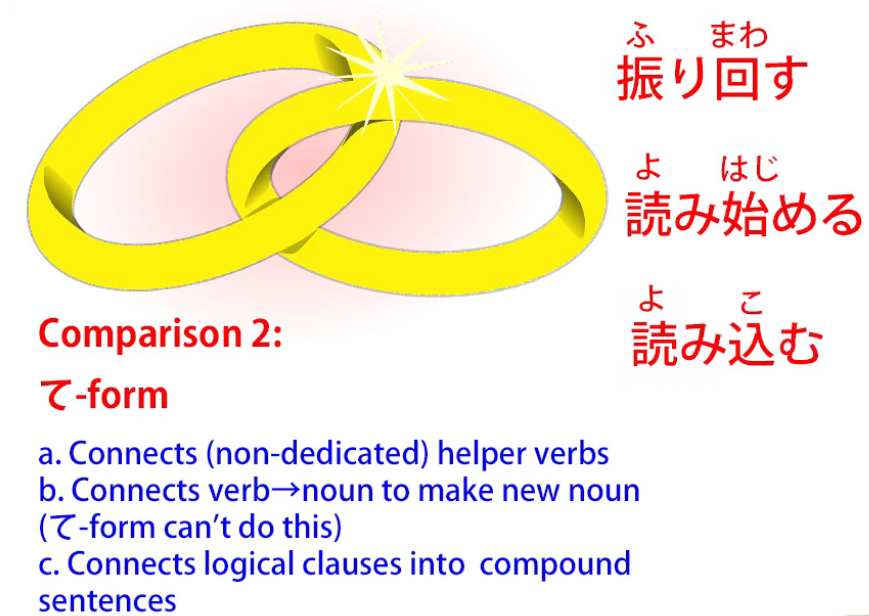

And I've done a whole video on this <code>込む</code> which you can watch if you're interested. *(Lesson 57)*

I'll put a link above and in the information section below along with everything else.

On a computer loading screen, you'll often see <code>読み込み中</code>, which is interesting,

because here you see we have two い-stems, stacked together.

<code>読み込む</code> itself takes the い-stem and connects to <code>中</code> (middle).

So <code>読み込み中</code> is literally read + pack in + middle -- <code>in the process of loading</code>.

And this, of course, is a noun: <code>中</code> is a noun and

any compound takes on the character of its last element in Japanese.

So, <code>読み込み中</code> is a noun formed by a compound of two い-stem verbs and a noun.

### Joining verbs to nouns to make new nouns

And this leads on to something that the い-stem can do that the て-form can't.

And that is, join verbs to nouns to make new nouns.

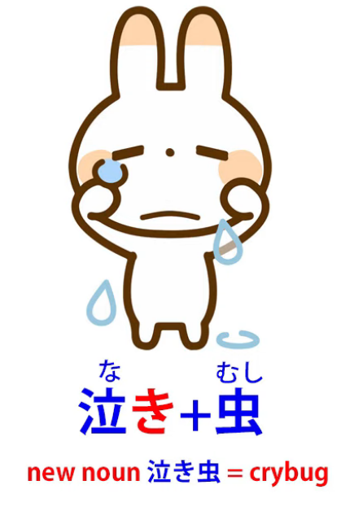

So, for example, we have <code>泣き虫</code>: <code>泣き</code> is the い-stem of <code>泣く</code> (cry), <code>虫</code> means <code>insect</code>.

So <code>泣き虫</code> is a <code>cry-bug</code>, which is the Japanese term for a crybaby.

And to come again to our friend <code>読む</code>, we can have <code>読み方</code>:

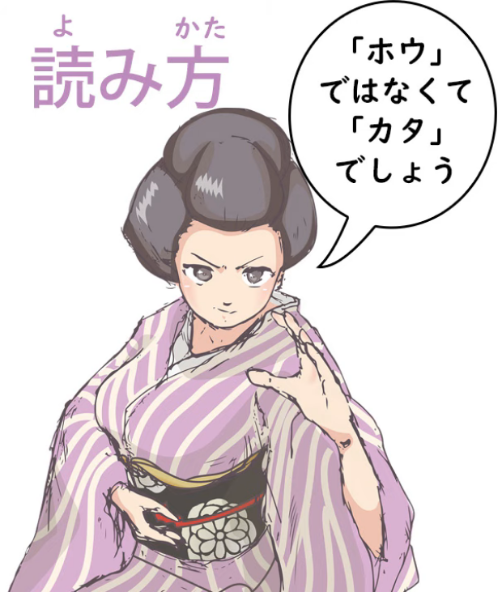

<code>方 / かた</code> means <code>form, or manner, or way</code> --

you may have heard of <code>方</code> in karate, the martial art --

so <code>読み方</code> means <code>form or manner or way of reading</code>,

and what this usually means is the pronunciation of a kanji,

the way of reading the kanji in a particular context.

So, the い-stem has the compound word capacity of the て-form

and takes it further than the て-form.

And it can also take on another of the て-form's fundamental functions,

because, as we know, the て-form can connect the two halves of a compound sentence.

We could say <code>お店に行ってパンを買った</code>.

So we have two logical clauses there: <code>I went to the shops</code> and <code>I bought some bread</code>.

And instead of using <code>and</code>, the way we do in English, we use the て-form.

::: info
You can check [**this comment tree**](https://www.youtube.com/watch?v=_qj9ZkAC2tE&lc=UgzBHAJNYjRy5GdLuE94AaABAg&ab_channel=OrganicJapanesewithCureDolly) under this video. May be useful.
:::
I've done a video about compound sentences, which I'll link. *(Lesson 11)*

Now, the い-stem can do exactly the same thing.

We can say <code>お店に行きパンを買った</code>, which is exactly the same as saying  
<code>お店に行ってパンを買った</code>.

We don't hear it quite so often, but it's not uncommon at all.

We'll see it more in written form, but if you're doing any immersion at all,

if you read books, if you have text-heavy games, and in manga and anime,

you will come across this い-stem joining of compound sentences.

It's another fundamental piece of Japanese.

So you see the い-stem can do most of what the て-form can do.

With compound words it doesn't compound the same words as the て-form

but it compounds words in very much the same manner.

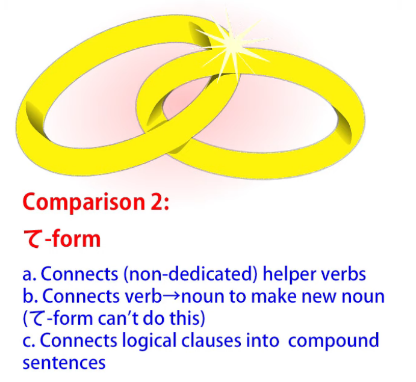

## 連用形 giving noun-form of verbs (verb clauses)

But the い-stem doesn't stop there.

It can do one other thing which is very important.

It gives us the noun-form of verbs.

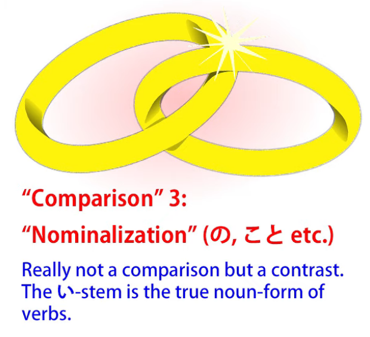

We've talked before about what's sometimes called nominalizing verbs,

that's to say using the の or -こと or some other means to bundle something verbal into a noun.

Now, this isn't really nominalizing verbs, which is why I tend to avoid that terminology,

because what we're actually doing here is not turning a verb into a noun

but turning an entire verb-clause into some kind of a noun.

We're not actually turning it into a noun.

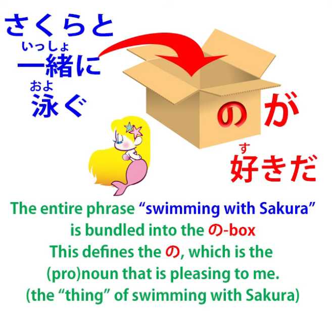

What we're doing is bundling it into a box created by a pronoun like の or -こと,

and I've talked in various places about putting verb-clauses into a の-box or into a こと-box.

In some cases, of course, we may also be bundling into that pronoun literally a single verb,

so if we say <code>泳ぐのが好きだ</code>, we're saying <code>I like swimming</code>,

and that means <code>I like the activity of swimming</code>.

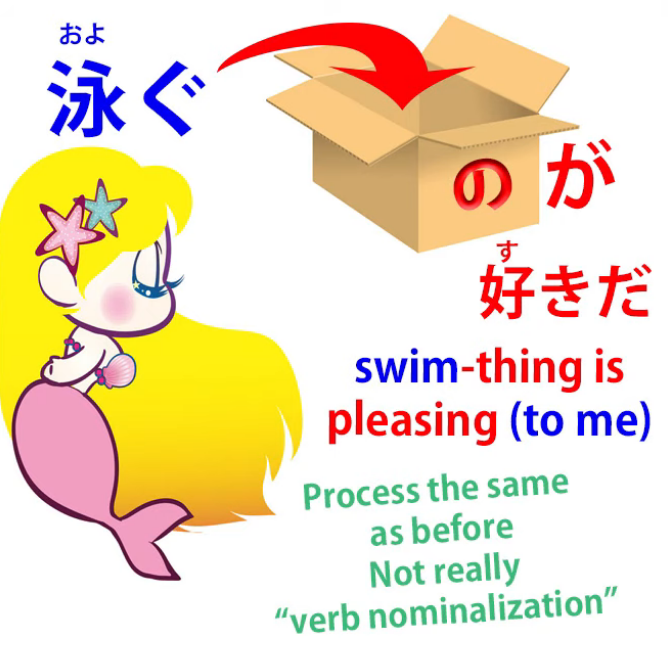

But, again, this isn't what the い-stem does.

What the い-stem does is give us the true noun-form of a verb.

And in English it's usually represented by the unchanged verb,

so that the verb-form and the noun-form are identical in English.

In Japanese they're not identical.

In Japanese we have the base-form, the う-ending form, of the verb for verb

and for the noun-form we have the い-stem.

So, let's take an example so you know what I'm talking about here.

In English we have <code>rest</code>, the word <code>rest</code>, which can be a verb or a noun.

We use the verb <code>rest</code> when we say <code>I need to rest</code>.

We use the noun <code>rest</code> when we say <code>I need a rest</code>.

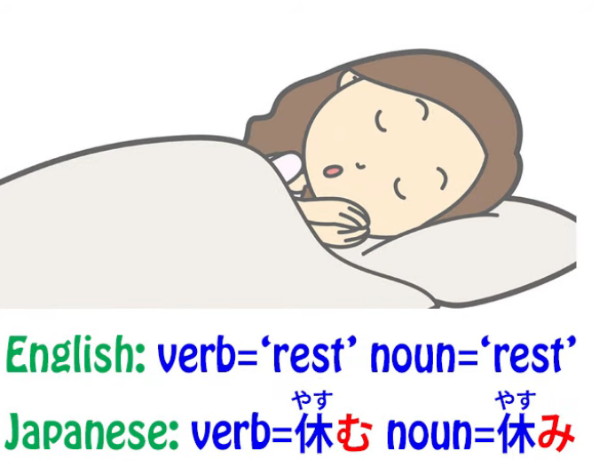

So, if we take the verb <code>休む</code> in Japanese as a kind of rough equivalent to <code>rest</code> in English,

we have <code>休む</code>, which is the verb <code>rest</code>, and <code>休み</code>, which is the noun <code>rest</code>.

So, <code>休む</code> is the action of resting, the verb <code>rest</code>; <code>休み</code> is <code>a rest</code>, the noun <code>rest</code>.

And we use this both on its own and in compounds like <code>夏休み</code>,

which means <code>summer vacation</code> or <code>summer break</code>.

And, we see, we wouldn't call it the <code>summer rest</code> in English,

but that's because, as we've discussed before, it's very rare for a Japanese word

to cover exactly the same area of the meaning spectrum as an English word.

So the word <code>休み</code> can mean <code>rest</code> literally as in lying down, taking a rest;

it can mean being off school or off work because you're sick;

it can mean a vacation, like <code>夏休み</code>.

But the point is that the verb-form is <code>休む</code>, the noun-form is <code>休み</code>.

And just about any verb that can have, logically, a noun-form

will have that noun-form represented by the い-stem of the verb.

And very often these will be the same thing in English; sometimes they will be different.

So, for example, <code>痛む</code> means <code>hurt</code>; <code>痛み</code> means <code>pain</code>.

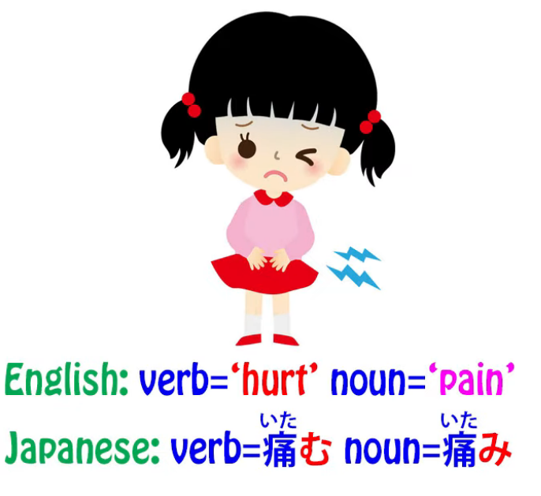

Again, we have the noun-form of <code>hurt</code>, which is <code>pain</code>.

And this is very important because

not only does it give us this whole range of verb-formed nouns,

but also it plays a role in other structures which are very rarely explained by the textbooks.

---

So if we say, for example, <code>お店にパンを買いに行く</code> or <code>公園に遊びに行く</code>,

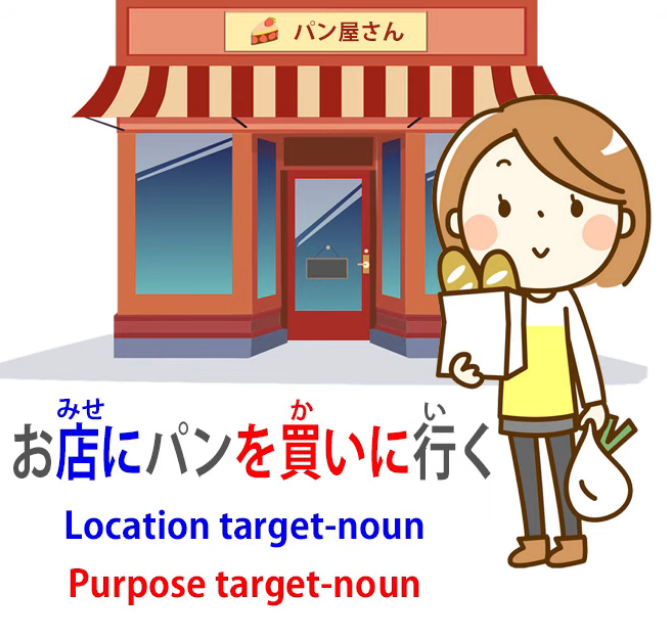

what do we mean by the い-stem of <code>買う</code>, which is <code>買い</code>,

or the い-stem of <code>遊ぶ</code>, which is <code>遊び</code>?

What we mean is the noun, so when we say <code>公園に遊びに行く</code>,

we're marking the locational target of the place we're going -- we're going to the park, <code>公園</code> --

and then we're stating our purpose. --

Our purpose is the thing of playing, the thing of having fun, and that is <code>遊び</code>.

So literally we're saying <code>I'm going to the park for play</code>.

If we say <code>お店にパンを買いに行く</code>, we're saying <code>I'm going to the shops for bread-buying</code>.

This is how these are structured, and I think very few textbooks actually ever explain

that what we're using here is the noun-form of the verb.

And that's important, because as I taught in our lesson on the logical particles *(Lesson 8b)*,

the five main logical particles can only be attached to nouns. *(が, を, の, に, へ, で)*

::: info
Just like Dolly remarks in Lesson 8b, の is also part of the logical particles,
:::
So if it's not explained that the <code>遊び</code> here and the <code>買い</code> here are nouns,

I'm not sure what most learners think the structure actually is.

---

And we'll find in various structures that the noun-form of a verb is used

and the structure only really makes sense

if we understand that it is the noun-form of the verb.

So here we have the い-stem.

It's the Great Connector and it's also the fundamental noun-of-a-verb-forming stem.

So it has a very wide range of applications.

It does all the kinds of things a regular stem can do,

it does all the kinds of things that て-form can do,

and it creates nouns out of verbs to be used as regular nouns

like <code>痛み</code> (pain) or <code>休み</code> (a rest/some rest)

and also for deeper structures like <code>遊びに行く</code> (going for play, going for the activity of play).

If you have any questions or comments *(again, it’s a good idea to read video comments after)*,

please put them in the Comments below and I will answer as usual.

I'd like to thank my Gold Kokeshi patrons

and all of my patrons and supporters on Patreon and everywhere,

who make all of this possible.  
::: info
In the comments, there is this rather interesting comment by one shary0 about て-form.  
If anyone wants to read up on い-stem in a more <code>text-booky</code> language - here is **[the source link](https://jref.com/articles/renyoukei.107/).  
:::
**Also, check [**this comment discussion under this video.**](https://www.youtube.com/watch?v=_qj9ZkAC2tE&lc=Ugy_D9a0k-_X9AujzO94AaABAg&ab_channel=OrganicJapanesewithCureDolly)*

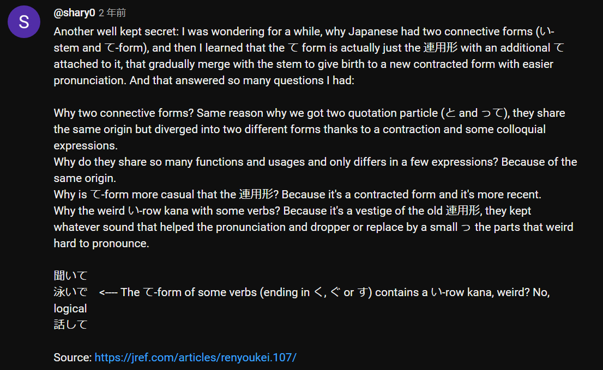
