# **73. Secrets of 気: 気になる, 気にする, 気がする, 気に入る etc.**

[**Secrets of 気 Ki - ki ni naru, ki ni suru, ki ga suru, ki ni iru etc. 気になる、気にする、気がする、気に入る | Lesson 73**](https://www.youtube.com/watch?v=ZHHd3nHkFb0&list=PLg9uYxuZf8x_A-vcqqyOFZu06WlhnypWj&index=75&ab_channel=OrganicJapanesewithCureDolly)

こんにちは。

Today we're going to talk about the word <code>気</code>

and various expressions that incorporate it,

like <code>気にする</code>, <code>気がする</code>, <code>気になる</code>, <code>気に入る</code> and so forth.

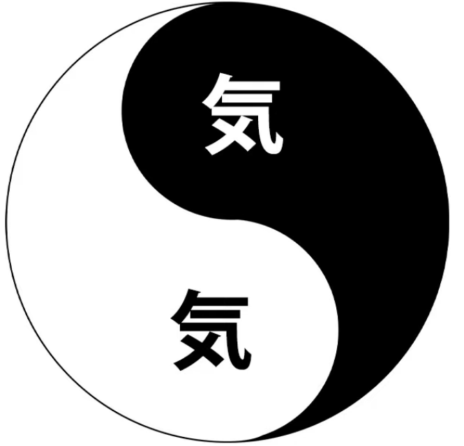

Now, people often find these confusing and

difficult to work out exactly how it is that they're structured,

how it is that they work, how we should use them.

And there are two reasons for this.

The first is that we need to understand what <code>気</code> really means.

And the second is that we need a very firm grip on the logical particles

if we're going to differentiate things like <code>気にする</code>, <code>気になる</code>, <code>気がする</code>, from each other.

And of course if you learn conventional textbook Japanese,

a firm grasp on the unchanging nature of the logical particles is exactly what you don't have,

because if you are taught things like <code>コーヒーが好きだ</code> means <code>I like coffee</code>,

you never really understand what the unchanging nature of the が-particle, for example, is.

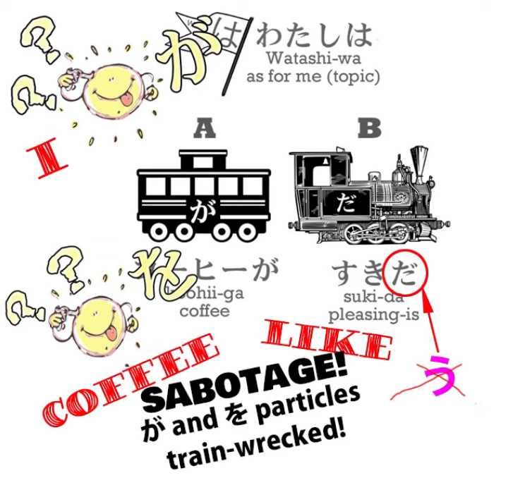

And if you do have any doubts about the nature of the five main logical particles,

I do recommend that you watch this video on the subject *(Lesson 8b)*,

because it is the very foundation of Japanese.

If you're fuzzy about the logical particles, then you're fuzzy about Japanese, period.

All right. So what is <code>気</code>?

<code>気</code> comes from Chinese.

<s>The kanji is the same kanji that we have in <code>tai chi</code>.</s>  
::: info
Dolly erred here, 気 is not used in 太極. Luckily, one <code>nleseul</code> clears it up, kudos to them.*  
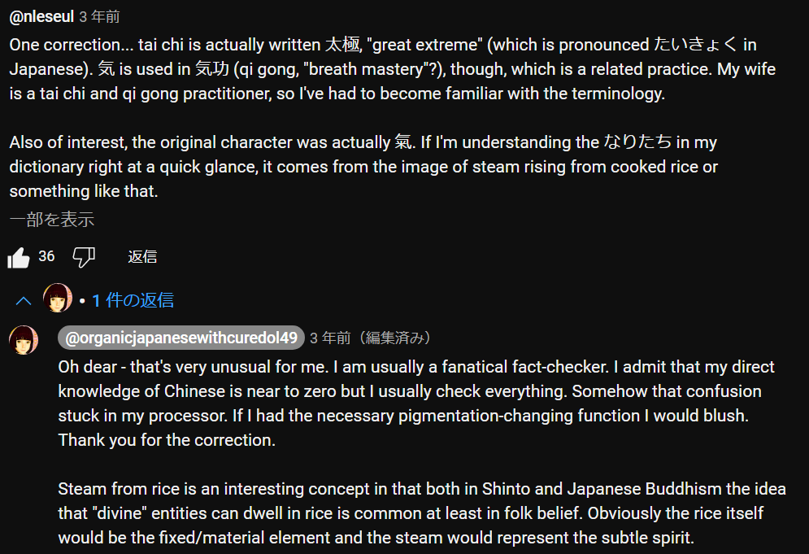
:::

It's a Daoist concept and probably goes back to a time before what we now know as Daoism.

To this day the concept is used in Chinese medicine, Chinese and Japanese martial arts, and other areas.

What it is is the fundamental spirit of fluid energy in a person or something else.

Originally it was associated with breath,

and in many languages, <code>breath</code> and <code>spirit</code> are in fact the same word.

Latin <code>spiritus</code>, Greek <code>pneuma</code>, Hebrew <code>ruach</code>, Sanskrit <code>atma</code>:

all mean both breath and spirit.

Now, the breath meaning of <code>気</code> is no longer active,

but it's still this flowing spirit principle within a person.

---

If we look at the kanji, interestingly, this part of it 气 ***([Radical 84](https://en.wikipedia.org/wiki/Radical_84))***

(which is also pronounced <code>き</code>) means steam or vapor.

So, a <code>汽車</code> is a steam engine.

And then we have this <code>メ</code>, as it were, and here <code>メ</code> really <code>marks the spot</code>. (気)  
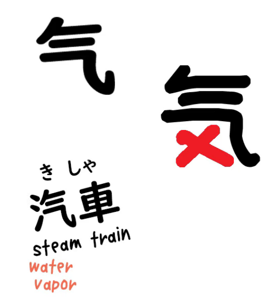

We have the fixed cross portion and we have the fluid, vaporous portion.

And both of those aspects of <code>気</code> are important, and you can never entirely separate the two,

although we can move from the fixed end of the scale to the fluid end of the scale.

So, to give examples of those two ends of the scale, let's take two expressions that you almost certainly know.

---

The first is <code>元気</code>, the second is <code>やる気</code>.

Now, <code>元気</code>, as you know, is vigor or health.

The <code>元</code> means original, fundamental.

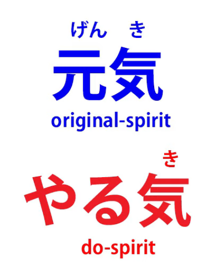

So, one's original <code>気</code> is healthy and vigorous.

If something goes wrong, we may become <code>病気</code> (sick or dispirited).

And our aim is then to return our <code>気</code> to its original

healthy and vigorous state, to restore our <code>元気</code>.

<code>やる気</code> is the will to do something.

So it's the do-spirit, get-up-and-go-spirit.

And this kind of <code>気</code> is not our basic <code>気</code> that in a sense remains constant within us.

It's a particular <code>気</code>, the <code>気</code> to do a particular thing.

So we might say

<code>海外で勉強する気がある</code>

And what we're saying here is that a particular <code>気</code> exists in us that is the <code>気</code> to study abroad.

So in this sense <code>気</code> is the will or inclination to do a particular thing.

When we say <code>気を付ける</code>, this literally means attach or stick your spirit.

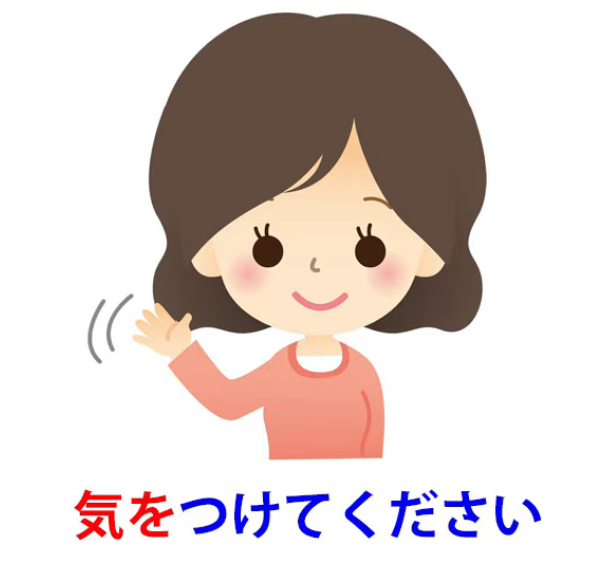

So if someone said <code>階段に気を付ける</code>,

what they're literally saying is <code>attach your spirit to the staircase</code>.

Now, what we'd say in English is <code>watch out for the staircase</code> or <code>take care on the staircase</code>.

Attach your spirit, your consciousness, your feelings, your thoughts, to the staircase;

pay attention to it; take care.

And it may not be a particular thing.

Very often people say <code>気を付けて</code> (attach your spirit).

And this is not attach it to any particular thing,

but attach it to whatever it's appropriate to attach it to;

have situational awareness, as one might say in a more modern jargon; take care.

## 気になる & 気にする

Now, when we get on to things like <code>気になる</code> and <code>気にする</code> --

we've dealt in a previous lesson with <code>になる</code> and <code>にする</code>.　*(not sure, possibly Lesson 8 & 18)*

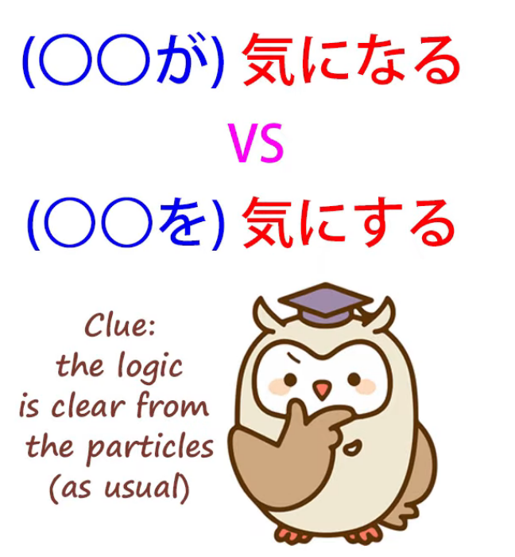

So, for example, if we say <code>さくらがカエルになる</code>, we're saying Sakura turns into a frog.

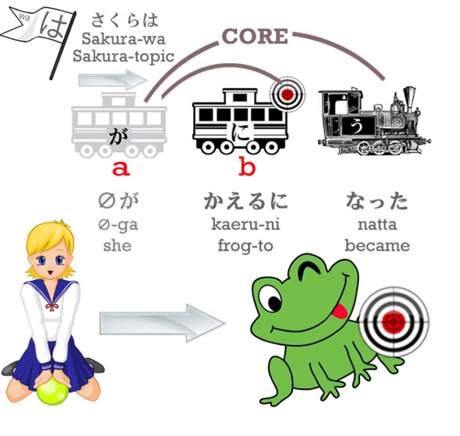

If we say <code>魔女がさくらをカエルにする</code>, we're saying that a witch turns Sakura into a frog.

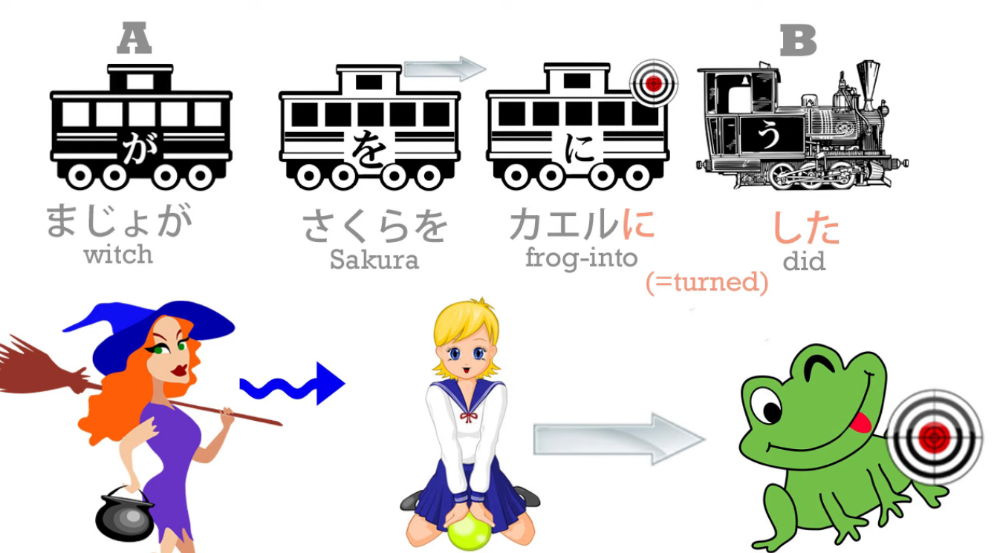

And of course we know who is doing what because of the logical particles.

So what does it mean when we talk about <code>気になる</code> and <code>気にする</code>?

We're saying that something becomes our spirit. What would we mean by that?

Well, to understand that we need to understand something else.

We need to understand that becoming a feeling, an emotion,

the expression of emotion, is something that we do in Japanese.

We don't do it in English.

So, for example, in AKB48's song <code>Heavy Rotation</code> we have the line:

<code>こんな気持ちになれるって僕はついているね</code>

And this means <code>That I could become this feeling, I'm lucky, aren't I?</code>

Now, in English we don't talk about <code>becoming</code> a feeling, but in Japanese we do talk about that.

And I think this is somewhat connected with the concept of <code>気</code>

and also with the Buddhist idea that there really is no self.

What we are is not a fixed and absolute thing.

The self is essentially a shifting congeries of actions and reactions, feelings and sensations.

And so we may temporarily become a particular feeling.

You may even become, in Japanese, the expression of a feeling.

We may say <code>深刻な表情になる</code> -- someone became a grave or concerned face.

For that moment, the whole person transformed into that expression of gravity and concern.

Now, this is what we're saying when we say <code>気になる</code> and <code>気にする</code>.

If we say <code>あの人は気になる</code>, we're saying that person turns into my spirit.

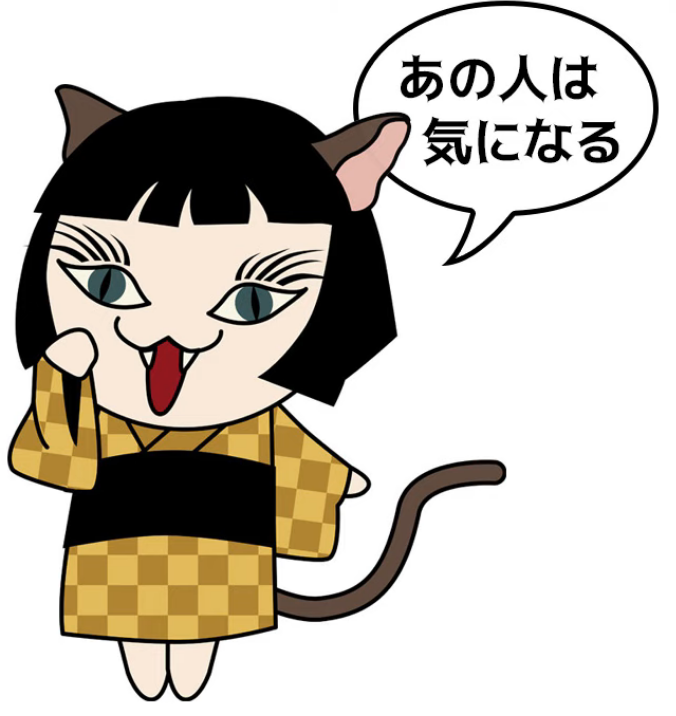

My spirit is remolded, as it were, a certain part of it, for a certain period,

into the form or shape of that person.

What does that mean? It means that that person is,

as we would say in English, occupying my feelings.

Now, this can mean a variety of things.

It can mean that we're concerned or worried about that person.

It can mean that that person intrigues us.

It can mean that we feel there's some mystery about that person.

Or whatever it is, that person is occupying our feelings, our sensations, our thoughts;

in Japanese, is becoming our feelings, our sensations, our thoughts, our <code>気</code>.

Now, an important thing to notice here is that we tend to see in grammar books and dictionaries

<code>**気になる** means this</code>, <code>**気にする** means that</code>, but the important thing to understand is

that <code>気になる</code> on its own doesn't mean anything. Neither does <code>気にする</code>.

<code>気になる</code> is the tail-end of a complete logical clause.

<code>なる</code> is the engine, <code>気に</code> is telling us more about the engine.

The A-car in the case of <code>気になる</code> is whatever it is that's occupying our thoughts,

whatever it is that's turning into our spirit.

So in this case <code>あの人</code> is the A-car and what we're saying about that person,

what that person is doing, is turning into our spirit.

Now, when we take <code>気にする</code>, we say <code>あの人を気にする</code>.

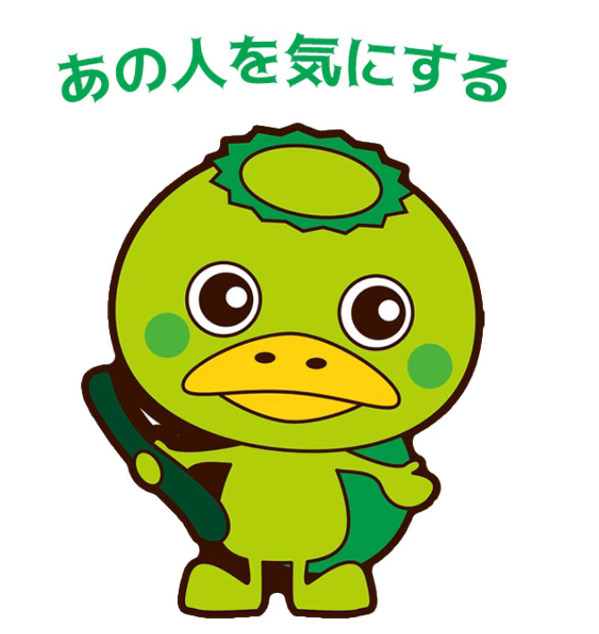

So now the doer of the action is not that person; the doer of the action is me.

I am turning that person into my spirit.

I am being concerned about that person.

And that has two implications.

One is that in a sense we're doing violence to our spirit.

It's not just our spirit naturally becoming that person -- we are making it so.

And that tends to give it a slightly more negative meaning.

While <code>気になる</code> can occupy a whole spectrum of meaning

from being intrigued to being worried,

<code>気にする</code> usually means worried.

Now, the other implication it has is that we're in control of it.

Our spirit isn't simply turning into that person.

We are turning our spirit into that person.

And that's why you often hear people say <code>気にしないで</code> (don't turn it into your spirit).

It wouldn't make any sense to say <code>気にならないで</code>, because you aren't making anything happen.

Your spirit's simply turning into it.

But <code>気にしないで</code> is telling you to control something that you have control over:

<code>Don't turn it into your spirit; don't worry about it; don't be concerned.</code>

Now, we have <code>気にする</code> and <code>気になる</code>.

## 気がする

What about <code>気がする</code>?

Again, the particle gives us the clue to what's going on.

When we say <code>気がする</code>, it's the <code>気</code>, the spirit itself, that's acting.

It's not something becoming our spirit, it's not us turning something into our spirit.

It's our spirit doing something or a certain aspect of our spirit acting (<code>する</code>, do or act).

How do we understand this?

Well, again we need to understand something else

in Japanese before we can properly understand this.

When we use expressions like <code>いい匂いがする</code> or <code>綺麗な音がする</code>,

what we're saying is <code>There's a good smell</code>,

<code>There's a pretty sound / a pretty sound happened / a pretty sound acted</code>.

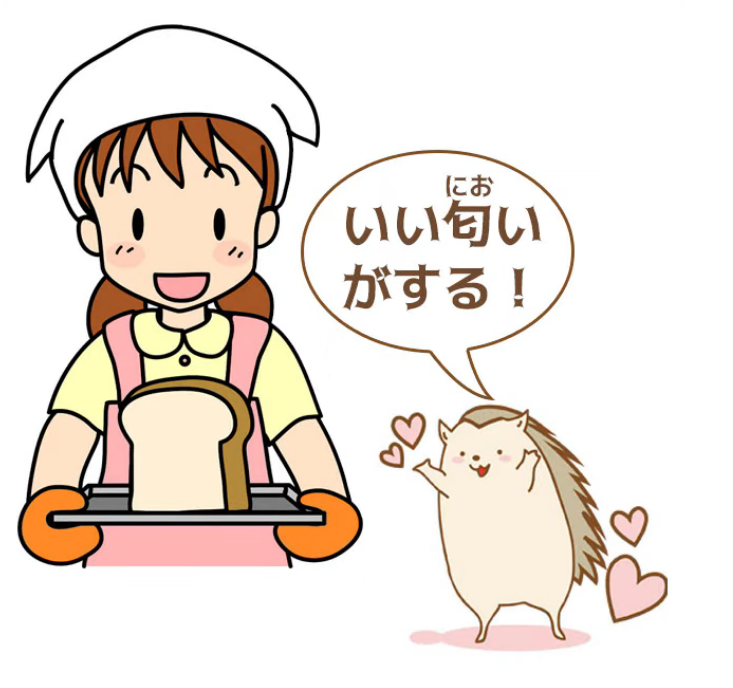

What we mean by <code>する</code> in the case of a smell or a sound

is the only thing a smell or a sound can do: a smell smells and a sound sounds.

When we say <code>匂いがする</code>, we're saying that a smell acts, a smell is active, I can detect a smell.

<code>音がする</code>: a sound acts, a sound is active, I can detect a sound.

When we say <code>気がする</code>, we're saying a certain spirit, a certain thought, a certain consciousness is active,

I can detect that consciousness, I can detect that feeling.

So, if we say <code>騙されているような気がする</code>,

we're saying "I've got a feeling we're being deceived,

I've got a feeling we're being tricked" --

such a <code>気</code>, such a feeling, is active.

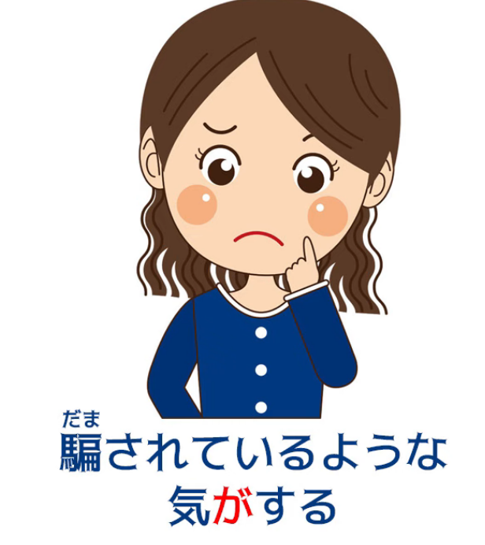

If we say <code>強くなった気がする</code>,

we're saying <code>I feel that I got stronger, I sense that I got stronger</code> --

that spirit, that inclination of the emotions, of the thoughts, is active

in the same way that a smell is active or a noise is active.

## 気に入る

Now, one last one that I think is more confusing than the others

because essentially it uses a word in an uncommon way is <code>気にいる</code>.

If we say <code>それを気に入る</code>, we're saying <code>I like that</code>.  
::: info
それが気に入る is also possible. As Dolly gives with これを気に入る.
:::
Now, what we're really saying is that I'm letting that into my soul.

What's confusing here is that <code>入る/いる</code> is not being used in its normal way.

<code>入る</code> usually means to enter or come in.

And if we're talking about putting something into something, we say <code>入れる</code>.

But in this case, <code>入る</code>, probably because it's an older usage

that's cemented into the language in this particular very common phrase,

<code>入る</code> actually means allow into one's spirit.

So, the one who is doing <code>気に入る</code> is oneself.

And we know that is the case because that's the way the particles are working.

We can always trust the particles.

If the particles are saying one thing and the form of the word is saying another,

we can be confident in every case that the particles know what they're talking about

and the word may have changed its meaning over time.

<code>気に入る</code> is something you'll hear on various occasions,

and a particular characteristic of this

is that it's much easier to use it about other people than things like <code>欲しい</code> or <code>好き</code>.

This is not to say that we can baldly state what other people like and what they don't like,

even using <code>気に入る</code>, but if we're going to talk about other people's feelings,

ask them about their feelings, suggest what their feelings might be,

<code>気に入る</code> is much politer than using terms like <code>たい</code> or <code>好き</code> or <code>欲しい</code>.

So you'll very often see <code>気に入る</code> in references to other people's feelings  
as well as to one's own.

So, I hope this makes the whole <code>気</code> usage a little clearer…  
::: info
[**The Buddhist concept of <code>non-self</code>**](https://en.wikipedia.org/wiki/Anatt%C4%81) may be a good study to see how Japanese works.
:::
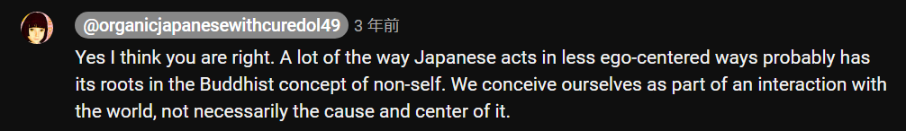
