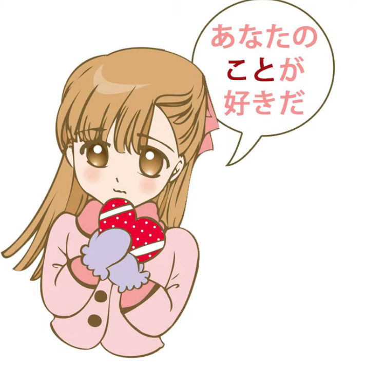
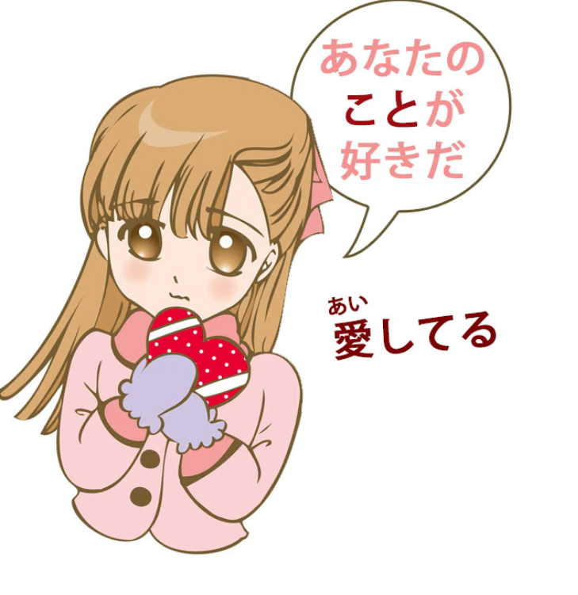
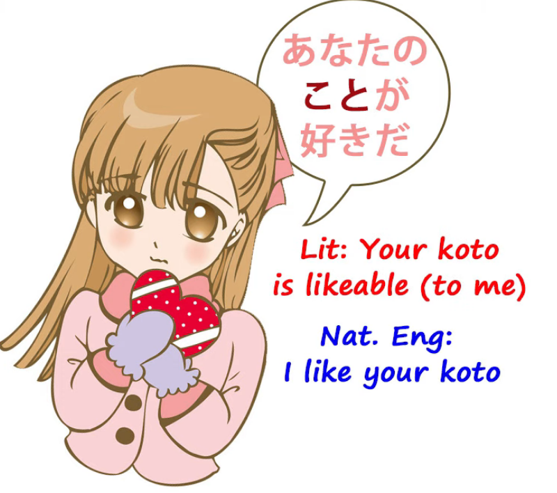
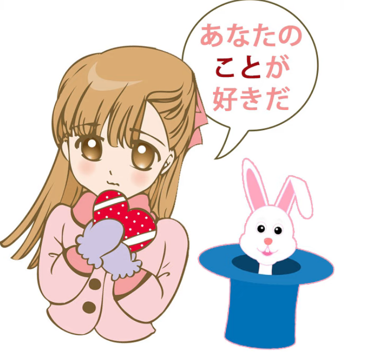
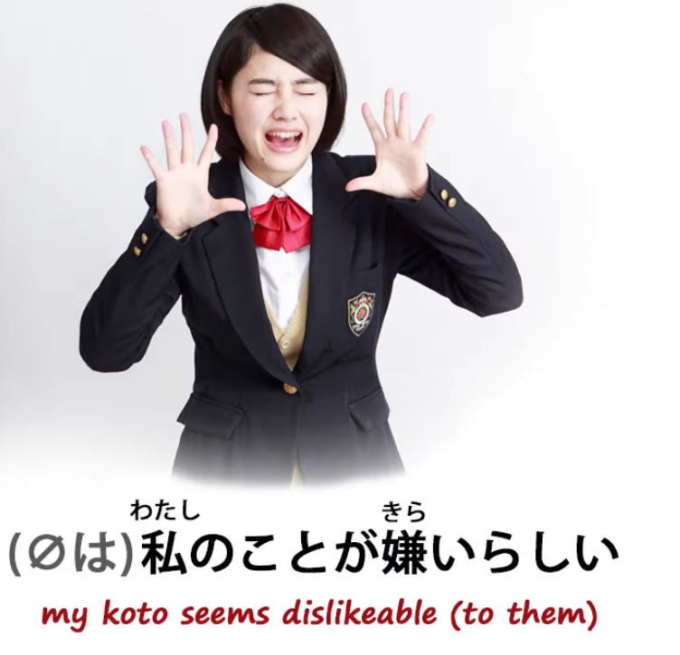
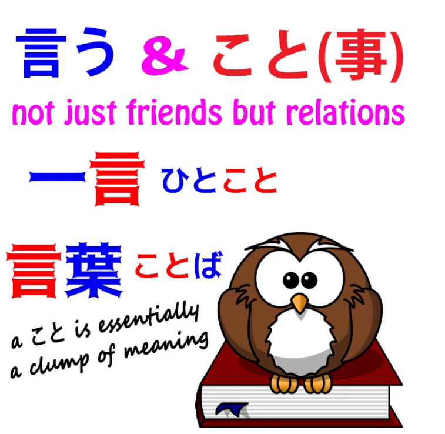
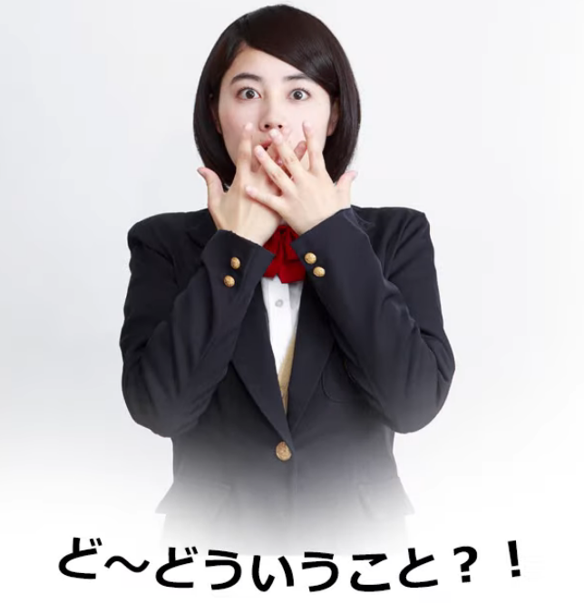
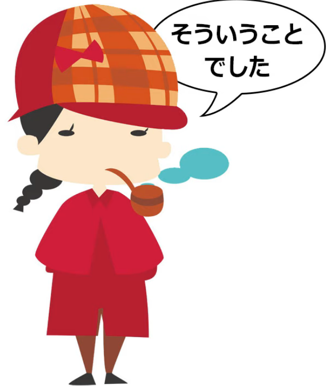
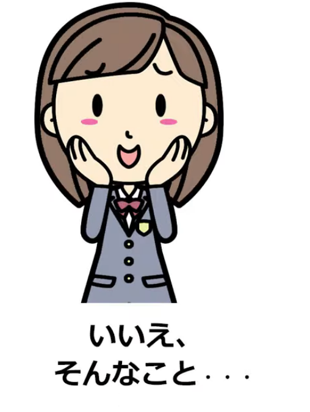
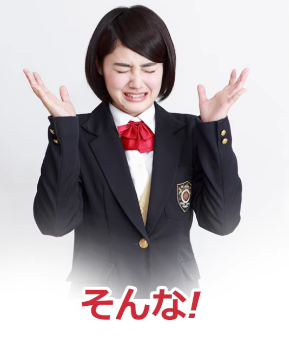

# **74. LOVE and other mysteries of こと! あなたのことが好き, 私のことが嫌い, ということ, そういうこと, どういうこと, そんなこと**

[**LOVE and other mysteries of KOTO! あなたのことが好き、私のことが嫌い、ということ、そういうこと、どういうこと、そんなこと | Lesson 74**](https://www.youtube.com/watch?v=aoP6sFyTsIk&list=PLg9uYxuZf8x_A-vcqqyOFZu06WlhnypWj&index=76&ab_channel=OrganicJapanesewithCureDolly)

こんにちは。

Today we're going to talk about some of the mysteries of the word <code>こと</code>.

And this can indeed be very mysterious to foreign learners,

because some meanings really can't be translated into English or other languages.

We can understand them, but we have to understand them as Japanese concepts.

One example is when we encounter expressions like <code>あなたのことが好きだ</code>.

## あなたのことが好きだ

Now, I think we all know what this means in phrase-book terms.

It means, more or less, <code>I love you</code>.

It's not in fact how we would say the exact phrase <code>I love you</code> in Japanese,

which would be <code>愛してる</code>, and that's an expression that,

while it technically means <code>I love you</code>, almost nobody ever uses it in Japanese.

<code>あなたのことが好きだ</code> is fairly understandable

if it were just <code>あなたが好きだ</code> (<code>I like you</code>),

but actually what we're saying is that I like your <code>こと</code>.

Now what does that really mean?

Probably the best way to translate it is to say

<code>I like things about you</code> or <code>I like the thing about you</code>.

In practice it implies that I like things like your laugh, the twinkle in your eyes, the way you walk,

the way you drink your coffee, your funny little blue hat, and the implication is that

you've become familiar by observation or proximity with various things about the person

and that this has gradually accumulated into feelings of love.

Now, you can't say that in English without writing a little essay or a song to somebody,

but in Japanese it's all encapsulated in that <code>こと</code>.

So what we could say is that <code>こと</code> is very, very agile, more agile than most agile words in Japanese.

And the concept of linguistic agility is very, very important

and completely neglected in most language teaching.

What we can say in an agile way isn't just a matter of convenience.

It deeply affects how we express ourselves and what we're likely to actually say.

Things that can be said in an agile way in a particular language

are the things we're most likely to actually express and express regularly.

Conversely, the things that a culture particularly wishes to express

are the things that become agile in a language.

So, if you want to learn more about agility, please watch my video on the subject *(Lesson 56)*.

The use of <code>koto</code> here is less direct, as textbooks sometimes say.

It's not just a question of being less direct. It avoids any sense of direct physicality

and it tends to give this whole implication of the gradual blossoming of love

through the understanding of things about a person.

This is something that Japanese wants to express commonly enough

that it has made it a very agile thing to express.

## 私のことが嫌い

Now, similarly, we may say things like <code>*(zeroは)*私のことが嫌いらしい</code>

(<code>that person, or those people, appear to find my **こと** dislikeable</code>).

Why would we say that?

Well, a lot of the reason, I think, is connected with the way of thinking that also means that  
we can't directly express someone else's emotions,  
which of course is an actual fact that European languages tend to overlook:

the fact that we never actually do know someone else's feelings or emotions.

Similarly, no one actually knows anybody else directly. We can't really know another person.

We can't know the depths of their being. I'm sure many people watching this assume that

I'm a human being pretending to be an android.  
This is how little we can know about any other being.

So when we're talking about something deeper that affects our emotions

rather than simple acquaintance with a person,

it really makes no sense talking about them being reactions to us.

They're not reactions to us; they're not reactions to our actual being.

They're reactions to what they have observed about our conduct, our appearance, our words.

And that, our <code>こと</code>, is what they may either like or dislike.

Now, where there isn't a cultural factor,

<code>こと</code> can in some circumstances be much easier to translate and understand.

So, for example, if we say <code>田中さんのこと</code> and we don't have any particular affection for Tanaka-san, this translates most of the time fairly easily into things like

<code>the matter of Tanaka-san / the affair concerning Tanaka-san</code>

or just <code>the fact that Tanaka-san is a bit of an awkward person to deal with</code>.

What we actually mean by <code>田中さんのこと</code> will depend on

what the hearer knows about the history of ourselves and Mr. Tanaka.

So this really isn't very difficult at all.

## どういうこと, そういうこと & ということ

But a lot of people have asked me to explain expressions like

<code>どういうこと</code> and <code>そういうこと</code>,

and I've touched on these before *(Lesson 20)*, so I'll just go over this a little.

<code>言う/いう</code> and <code>こと</code> in a way belong together, because a <code>こと</code> is a situation, a circumstance, by implication something that actually requires a bit of explanation.

And the idea of explanation, the idea of expression, and the idea of a <code>こと</code>,

I think, have always been very close in Japanese.

That's why the kun-reading of the kanji that we use in <code>言う</code>,

the other kun-reading, the one when it's a noun, is <code>こと</code>. It's not the same <code>こと</code>,  
::: info
Just in case, the Kanji 言 in Kun-yomi can be read as <code>い</code> or as <code>こと</code>, latter of which is usually when it is a noun. In そう言う事, the koto is the 事 Kanji, different one to the 言 - こと.
:::
but as we know if we know much about Japanese and kanji,

there are often alternative kanji for the same word.

Now, these aren't quite the same word, but they are related.

And this is why we're always getting expressions like

<code>そういうこと</code>, <code>どういうこと</code>, <code>ということ</code>,

because a <code>こと</code> is something said, something explained, a situation that requires words.

So the question <code>どういうこと</code> is one that we often hear.

It means, in a way, <code>what kind of こと?</code>

And <code>what kind of...</code>, we're taught in Genki and other textbooks, is <code>どんな</code> in Japanese, and indeed it is, but we tend to use <code>どういう</code> more often in cases where either more explanation might be required or where the explanation would be perhaps a little less expected.

---

So, for example, when a character finds herself in a strange situation

or simply doesn't know what's going on because it's all very strange and unexpected,

she's very likely to say <code>どういうこと</code> -- "what kind of a thing is this?

In what way explained a situation is taking place or has taken place here?"

Similarly, when Katrielle Layton solves the case, she says

<code>そういうことでした</code> (<code>So that's how the situation was explained</code>).

And it's thrown into the past tense

because the idea is that she has solved a mystery that is a standing mystery,

in other words, this was the explanation all along and she's just discovered it.

Now, <code>そういうこと</code> or <code>どういうこと</code> doesn't have to be something particularly recondite or difficult, but it tends to imply a greater depth of needed explanation than a simple <code>どんな</code>.

## そんなこと 

On the other hand we do also have <code>どんな</code>'s partner <code>そんな</code> frequently used with <code>こと</code>,

and in these cases the implication is often that while the <code>こと</code> is relatively

easily understood or explained, we have some kind of a negative reaction to it.

Now, that could be denial or it could be protest or disappointment.

So, for example, if somebody praises us, you may say <code>そんなことがない</code> (<code>that's not true!</code>),

because in Japanese it's polite to reject praise.

And this is so frequent that

it's often reduced simply to <code>そんなこと</code> or even just <code>そんな、そんな</code>.

So, we're saying that what you've said, this situation which you're describing about me,

is not the case: I'm not worthy of this praise.

And we'll also often hear characters or people saying simply <code>そんなこと</code> or just <code>そんな</code>

and the implication of this is that what is happening is very unsatisfactory

or that what someone has said was a bad or unkind thing to say.

So, <code>そんなこと</code>, or more often <code>そんな</code>, represents a negative reaction to the situation.

And it's interesting in that clearly it's an unfinished sentence.

You were going to say something about the <code>そんなこと</code>.

But unlike many Japanese unfinished sentences, this one, this <code>そんな</code> of protest,

is so lodged into the language that it's actually difficult to finish the sentence.

It's actually difficult to say what the person might have said

if they had finished the sentence, because it's almost never finished.

<code>そんな!</code> has evolved into a protest against the dreadfulness of something all by itself…
