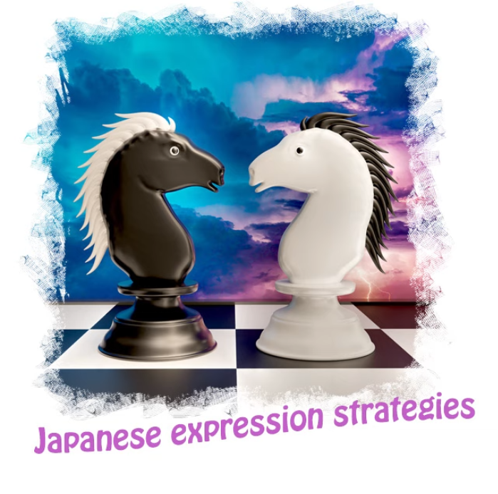
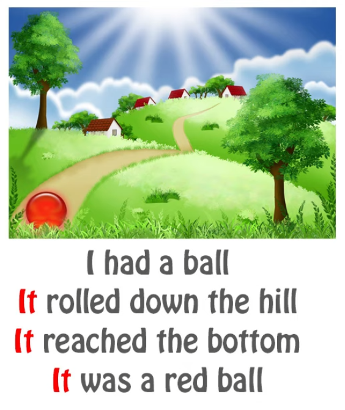
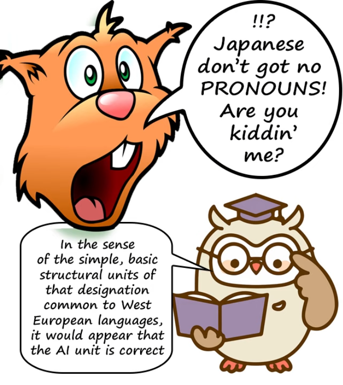
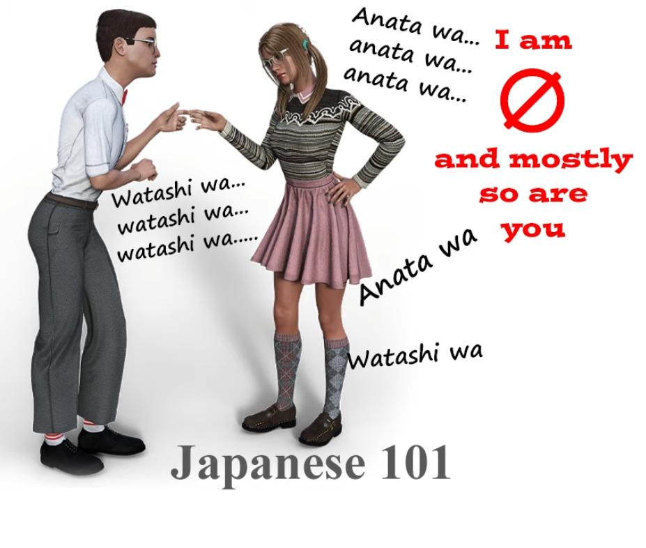
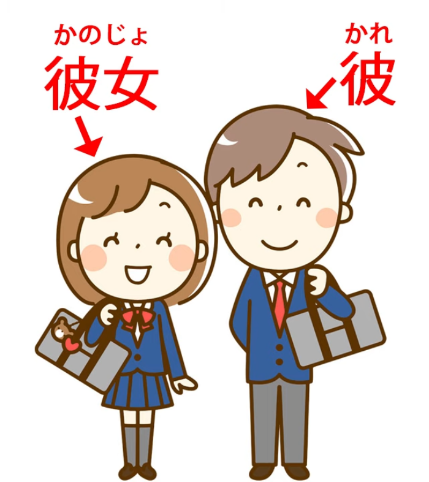
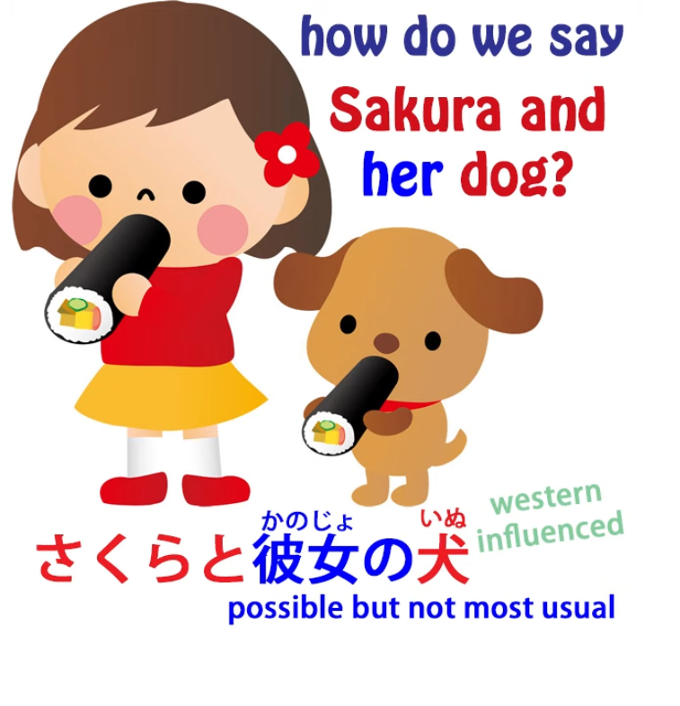
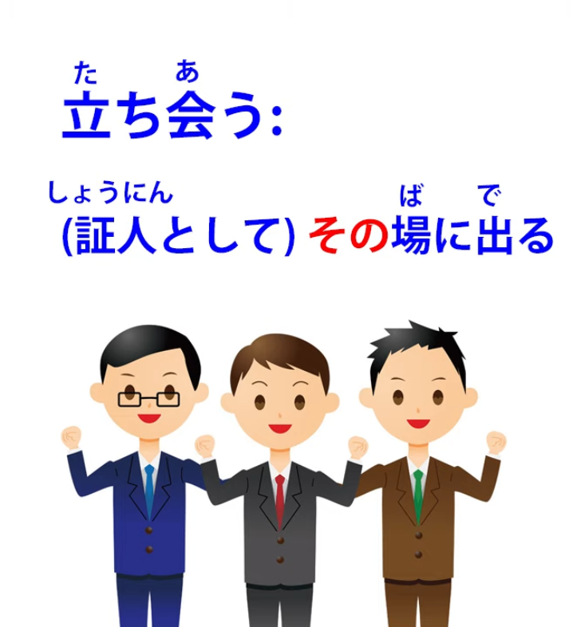
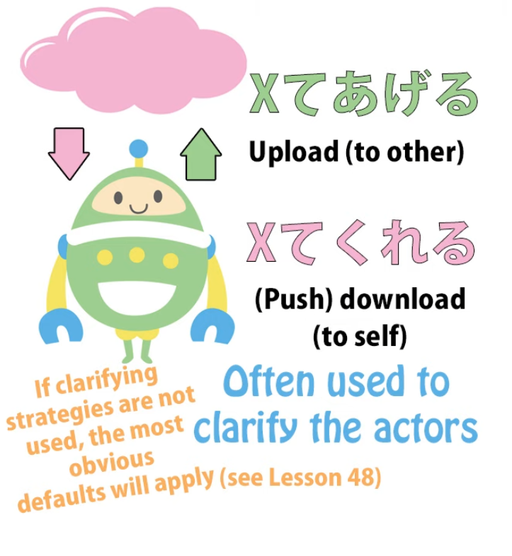
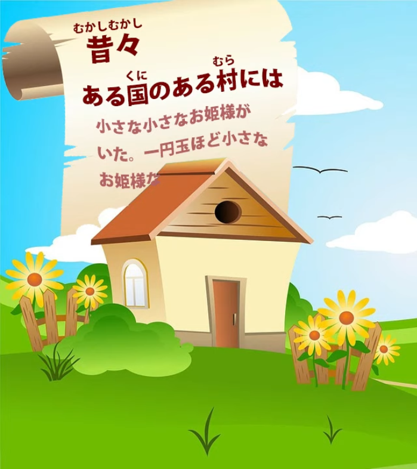

# **75. Japanese is NOT English: How expression strategies differ | polite 英本語=rude Japanese**

[**Japanese is NOT English: How expression strategies differ | polite Eihongo=rude Japanese | Lesson 75**](https://www.youtube.com/watch?v=UCmnwgCc54A&list=PLg9uYxuZf8x_A-vcqqyOFZu06WlhnypWj)

こんにちは。

Today we're going to talk about expression strategies in Japanese that are so different from their English equivalents that they can cause great difficulty once we get into the real world of Japanese. 

And this difficulty is made much worse by the way Japanese is taught in conventional textbooks and websites and the whole <code>英本語</code> Japanese model, which teaches

Japanese essentially by pretending that it's much more like English than it is and <code>dumbing down</code> Japanese expressions into 英本語-type equivalents.

So, let's start with one of the things that causes the most difficulty because it's something that's really fundamental to English and doesn't exist in Japanese.

And that is, pronouns. In English, we can't get through a moderately complex sentence without using pronouns like <code>it</code>.

If we're talking about any kind of an object, from the Andromeda galaxy to an insect, even a moderately complex passage about it is going to contain <code>it</code> over and over again.

And this is not how Japanese works. In fact, I'm going to say something that may seem unduly radical. I'm going to say that Japanese doesn't have simple pronouns at all, not in the sense that they're understood in English and other European languages. Now, that may seem a bit extreme, but let me explain what I mean.

## Pronouns <code>it</code>, <code>I</code> and <code>you</code> in Japanese

First of all, let's take the most basic pronoun, <code>it</code>. There is no equivalent word in Japanese to <code>it</code>. Nowhere in Japanese can you find anything that corresponds to <code>it</code> except zero.

The only way to say what we mean when we say simply <code>it</code> in English is to say nothing or write nothing: to use the zero pronoun.

Now, you may say that while we accept this, surely there are in fact pronouns.

After all, most textbooks start off with the pronoun <code>私</code>.

Almost every basic sentence in a basic textbook is <code>私 this, 私 that, 私 the other</code>.

And the ones that aren't are <code>あなた this, あなた that, and あなた the other</code>.

So, doesn't Japanese at least have the basic pronouns <code>you</code> and <code>I</code>? And the answer to that is <code>No, not in the European sense.</code>

In the European languages, there is always one basic, simple pronoun that means <code>I</code>.

It is the ego-pronoun: <code>I</code> in English, <code>ich</code> in German, <code>je</code> in French, <code>yo</code> in Spanish.

There is no equivalent to this in Japanese.

There are many ways to say <code>I</code>: 私, 僕, 俺, あたい, わがはい.

All of them are in fact roundabout ways of referring to oneself.

When referring to the person you're speaking to, you can say <code>あなた</code>.

You can also say: お前, 手前, きさま, 君, and various other things.

In other words, this basic personal pronoun doesn't really exist.

And although we can identify <code>私</code> and <code>あなた</code> as the most basic of them, it still isn't the same as a European personal pronoun.

Most of the time we don't use it. All this <code>私 this, 私 that, 私 the other</code> in the textbooks is ridiculously unnatural. Unless we're trying to stress a particular point, we don't say this.

The usual word for <code>I</code> is zero. The usual word for <code>you</code> is either zero or the person's name.

None of the words for <code>you</code> that I've cited above, including <code>あなた</code>, are used all that often because among other things they're just not very polite.

And it's one of the remarkable things about the textbooks which cause enormous damage to people's understanding and grasp of Japanese structure by compelling them to stick the -ます helper onto the end of verbs and letting them believe that this is the basic form of verbs, allowing them to believe that adjectives require a copula when they don't

(and if you want to know more about the damage that です/ます does to our basic grasp of the language if we learn it before we learn fundamental basic Japanese, I've done a video on that and I'll put a link above my head and in the Comments below) ([***Lesson 17***](https://www.youtube.com/watch?v=ymJWb31qWI8&t=0s)).

---

The textbooks do this, which is an extremely destructive thing to do, for the reason that, if you go to Japan and don't use です/ます to people like your teacher, your employer or strangers that you meet, they'll think you're rude.

Now, this is perfectly true, but of course until you've got a basic grasp of the language you won't be saying anything to anybody, and if you are, it'll be so inept that the last thing they're going to be thinking about is whether or not you're sticking です/ます decorations onto the end of your sentences.

But having caused this damage to the learning of structure by using です/ます, they then proceed to teach you to address people as <code>あなた</code>, which is actually ruder than not using

です and -ます. If you don't use です/ます and your Japanese is pretty poor, most people will just assume that you're like a small Japanese child who doesn't really know the decorations yet. If you call people <code>あなた</code>, even though they'll cut you some leeway because you're foreign, they'll probably find it difficult not to wince.

You don't call your teacher <code>あなた</code>, you don't call your boss <code>あなた</code>, you don't call strangers <code>あなた</code>, but even with friends, to whom you don't need to use です/ます, you don't call them

<code>あなた</code> either.

So why do the textbooks, when they actually put your grasp of Japanese structure through the wringer by forcing you to use です/ます too early, then proceed to teach you something far ruder than not using です/ます?

---

Well, the reason is that they're prepared to sacrifice anything in order to structure Japanese as if it were English. In English you use the simple, neutral personal pronoun <code>you</code> all the time, and in Japanese you don't. But they seem to think you're too dumb to get that.

They seem to think that unless Japanese sentences are structured in such a way that they sound unnatural but feel to you like an English sentence,

with <code>私 this, 私 that, あなた this, あなた that</code>, you won't be able to grasp it.

So, Japanese doesn't have an <code>it</code> and it doesn't really have a <code>you</code> or an <code>I</code> in the sense that European languages do. What about <code>he</code> and <code>she</code>? At least it has <code>彼</code> and <code>彼女</code>, doesn't it?

Well, <code>彼</code> and <code>彼女</code> were introduced into Japanese in the late Edo and early Meiji era in order to translate nineteenth-century European novels into Japanese. That's what they were for.

Since then, they've become integrated into the language and they're used sometimes in everyday speech, but not nearly as much as the zero-pronoun is used.

For every one time that <code>彼女</code> or <code>彼</code> are used for <code>he</code> or <code>she</code>, there are at least a hundred times when the zero-pronoun is used in that capacity.

So, what do we do when, for example, we want to express possession?

Suppose we want to say <code>Sakura and her dog</code>. Now, we could say <code>さくらと彼女の犬</code>.

That is grammatical Japanese, but it's not very usual Japanese.

The usual way of saying it would be <code>さくらとその犬</code>.

And this word <code>その</code> is very important here.

## その

We're taught, early on *([**Lesson 20**](https://www.youtube.com/watch?v=xLkY6whr7T4&ab_channel=OrganicJapanesewithCureDolly))*, that it means <code>that</code>, in the sense of <code>that dog</code>, <code>that hat</code>, <code>that country</code>, and it does, but as we've learned before, Japanese words very rarely correspond to the exact same part of the meaning spectrum that their supposed English equivalents correspond to.

If in English we say something like <code>that dog</code> or <code>that tree</code> we mean the one we're talking about, the one related to the current subject. But in Japanese it goes considerably further than this.

So, <code>さくらとその犬</code> means Sakura and a dog related to her, in other words, Sakura and her dog. And this ability of <code>その</code> to express things like possession and relatedness gives rise to a whole range of strategies. But once we understand what it means, they're much easier to understand.

So, for example, the simple Sanseido Japanese dictionary defines the word <code>立ち会う</code>, which can't really be translated into any particular English word because what it means is go to a particular place in the capacity of a witness or act in the capacity of a witness.

The Sanseido definition is <code>証人としてその場に出る</code> : as a witness, go to that place.

Well, that's the nearest we can get in English without getting rather convoluted.

What does <code>that place</code> mean here? The only way to translate that properly into English would be to say something like <code>as a witness, go to the place which is whatever place is involved at the time – that place, the place to which you go as a witness</code>.

So this opens up a whole range of uses of <code>その</code> which don't really have any equivalent in English. <code>その</code> is the related thing, the thing in question at the time, the thing belonging to the person we're talking about, or whatever, and this gives strategies that are essentially the ones that displace English pronouns.

And there are various other strategies that displace pronouns.

For example, we've talked in the past *(Lesson 48?)* about <code>くれる</code> and <code>あげる</code>, and I think we often get the impression that this has a lot to do with a more personal sense of relation.

We're not just talking about what's done but whether it's done as a favor to ourselves, whether it's done as a favor to someone else, and that kind of thing.

And that is important too. But also it takes the place of pronouns. If we said <code>教えてくれた</code>, what we're saying is <code>she taught me</code>.

We know that someone else did it, because the <code>-てくれる</code> form can only be something done by someone else. We know that they did it to me because <code>くれる</code> means either me or someone within my circle.

So, we can say <code>教えてくれた</code> . There is no <code>she</code> and there is no <code>me</code> in that sentence, but the form of the sentence tells us what the pronouns would tell us in English.

Again, if we say <code>殺してやる</code>, it means <code>I'll kill you</code>.

And again, it's the <code>-てやる</code> which gives us both the <code>you</code> and the <code>I</code>.

And generally speaking, if we use any plain, non-past action referring to the future the default actor is going to be <code>I</code>. If we say <code>今帰る</code>, this means <code>I'm going home now</code>.

How do we know it's <code>I</code>? Well, first of all, <code>I</code> is the default, and secondly we're predicting an action which is in our own minds.

We can't predict the actions of others except under special circumstances.

So unless the context suggests otherwise, this has got to be <code>I</code>: <code>I'm going home now.</code>

And somewhat related to the use of <code>その</code>, we have the use of <code>ある</code>.

And stories often begin with <code>ある日</code>, and people often wonder why <code>ある日</code>.

<code>ある</code> simply means <code>being</code>.

Now, as we know, any verb or any verbal clause can modify any noun.

So why <code>ある日</code>? <code>ある</code> just means <code>exist</code>. So <code>ある日</code> means <code>existing day</code>.

Now, when a story begins with <code>ある日</code>, we're saying <code>One day</code>.

If we say <code>ある国のある村に</code>, we're saying <code>In a certain village, in a certain country</code> and this is another very usual setting for a story. But we're not saying <code>a certain</code>, because the expression strategy is different in Japanese from in English.

---

In English we say <code> a certain...</code> -- and what do we mean by that?

Well, we mean that the place is certain. We know where it is, we know what it is, we're just not telling you. Which, when you think about it, is rather a strange way of putting it. The only reason we really say <code>a certain...</code> is that we want to introduce it without saying anything at all about it.

And Japanese, which is often more logical than English, does that in the most logical way possible. It doesn't tell us anything about it except the fact that it exists.

And if it didn't exist, it wouldn't be there, there'd be nothing to talk about, so we're saying the absolute minimum we can say, that it exists.

Of course, it may not even exist in reality, but it exists in relation to the narrative, so it exists:

<code>ある国のある村には...</code>

And just as a rider to this, I'd like to talk about <code>ある日のこと</code> or even <code>ある国のこと</code>,

which again can introduce a story.

## のこと

Why are we saying <code>のこと</code> here?

Well, it's worth remembering that <code>こと/事</code> not only means a situation or a circumstance but is a kind of cousin to the <code>こと/言</code> of <code>言葉</code>.  
::: info
Check Lesson 74 for this.
:::
A <code>こと</code> is a thing, a circumstance, something that you can't just see or touch, you need a verbal story or description to convey it.

So, <code>ある日のこと</code> essentially means the affair of a certain day.

<code>ある村のこと</code> means the affair of a certain village. And we're saying this to preface the story. We're saying that what follows will be the affair of a certain day / the affair of a certain village. And because of the kinship to <code>言葉</code>, it has a slight overtone of <code>the story of a certain village / the story of a certain day</code>.

So, here we have some expression strategies that are very different from English ones, difficult to grasp until we know what they mean, and very difficult to grasp when we've been misled into thinking that Japanese expression strategies are much nearer to English ones than they actually are.

*Links from comments: [**The Meaning Spectrum introduced in this video**](https://www.youtube.com/watch?v=CpiELpGR-VU), [**How です・ます (desu/masu) undermines early structural understanding**](https://www.youtube.com/watch?v=ymJWb31qWI8&t=0s), [**Sono and its' relatives (sono, sonna, sore, konna kono kore etc.)**](https://www.youtube.com/watch?v=xLkY6whr7T4)*
