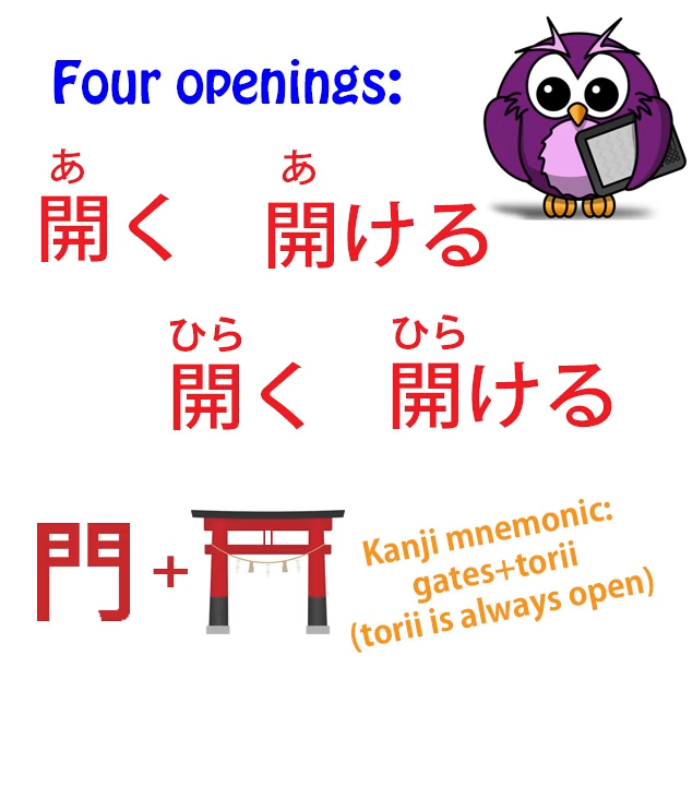
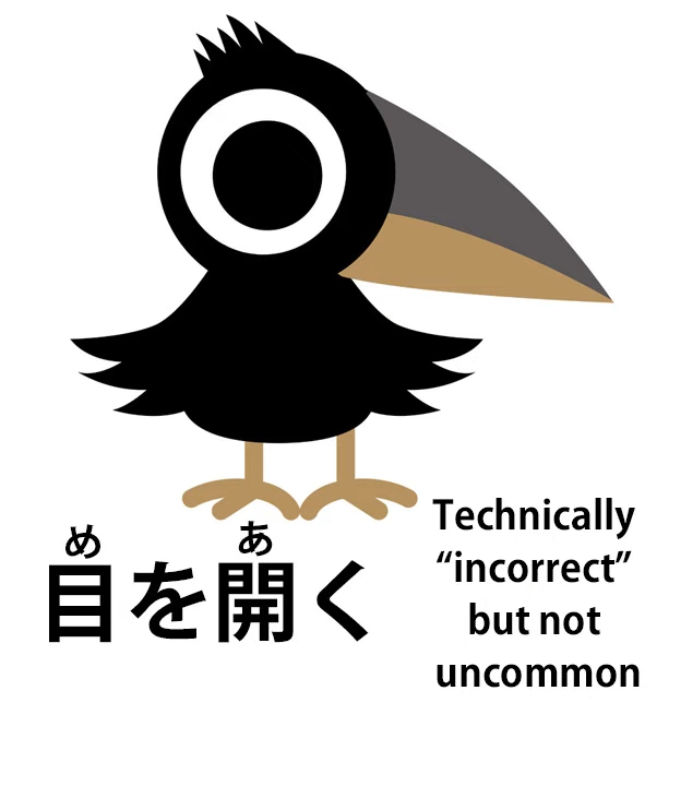
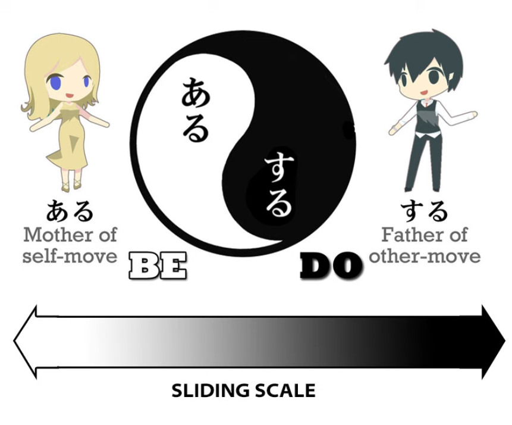
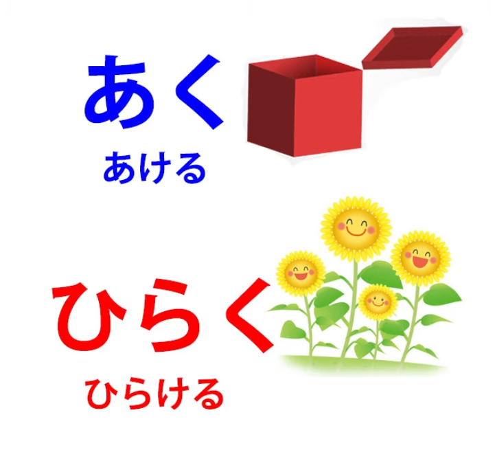
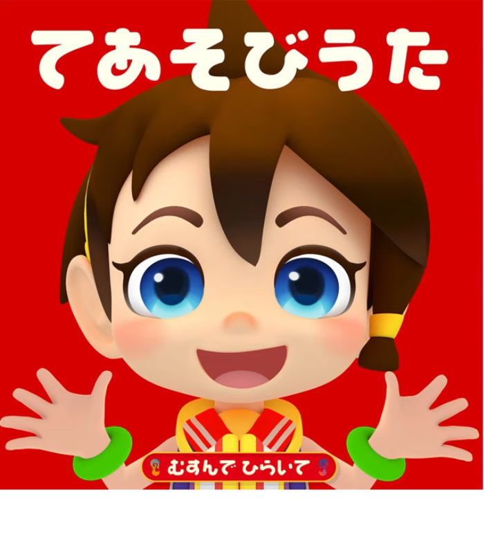
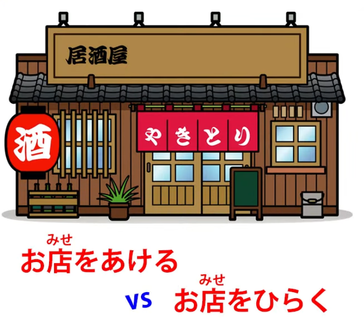
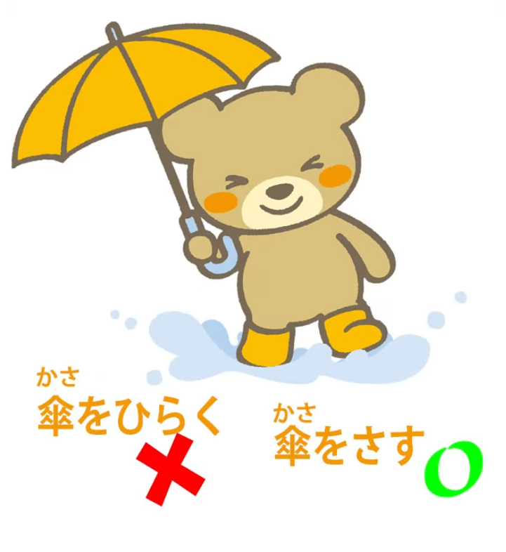
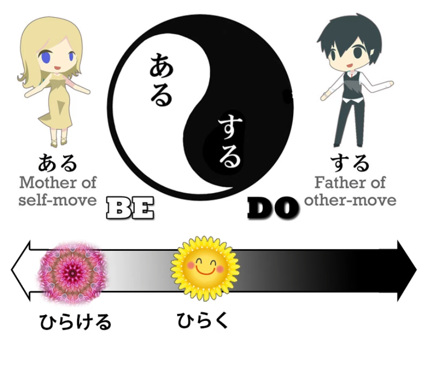
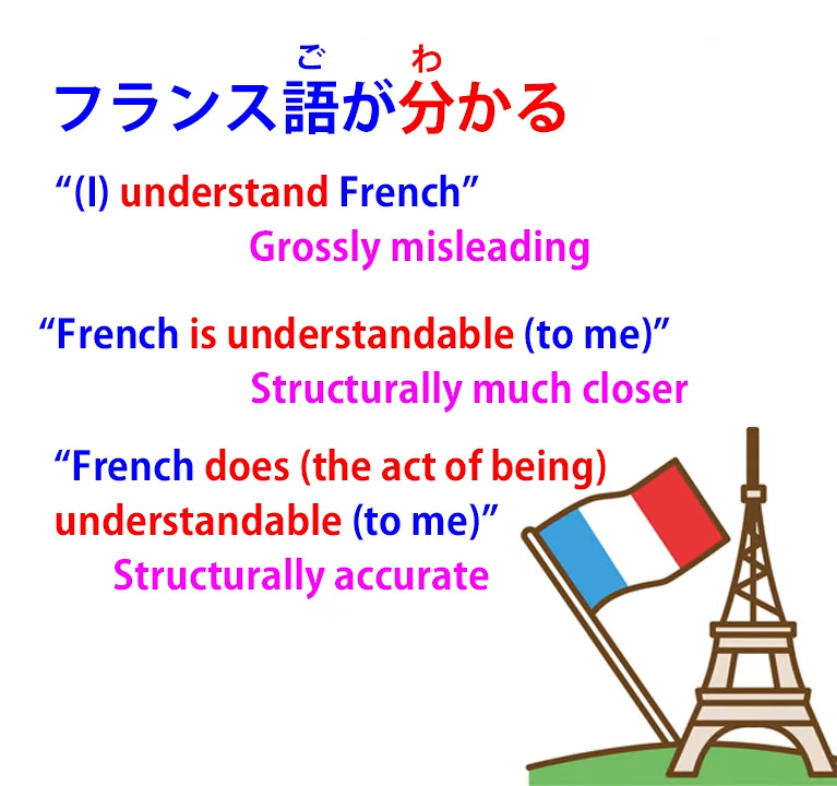
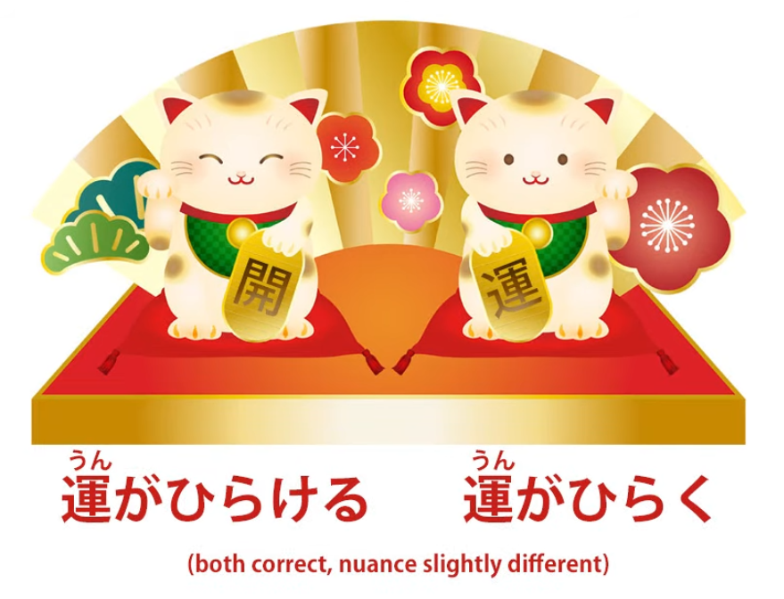

# **76. The Right Opening? | あく, あける, ひらく, ひらける, 開く, 開け** 

[**The Right Opening? aku, akeru, hiraku, hirakeru | あく、あける、ひらく、ひらける、 開く、開け | Lesson 76**](https://www.youtube.com/watch?v=QEInorgR6Rs&list=PLg9uYxuZf8x_A-vcqqyOFZu06WlhnypWj&index=78&pp=iAQB)

こんにちは。

Today we're going to look at something that is important in itself but also throws light on some of the subtleties of Japanese that are very useful to know as we go forward into deeper immersion.

So, what we're going to look at is four different ways of saying something that in English are all covered by the one word <code>open</code>.

Now, these are <code>開く</code>, <code>開ける</code>, <code>開く</code>, <code>開ける</code>.　

::: info
These are read as* あく, あける, ひらく, *and* ひらける*, respectively, despite having the same kanji and okurigana. Dolly clarifies this later in the lesson.
:::
Now, when we look at these at first they look like two self-move/other-move pairs, don't they?

And up to a point they are.

But what this is going to illustrate is something of the subtlety of the whole self-move/other-move concept in Japanese, as opposed to the much more technical and clear-cut contrast between transitivity and intransitivity in English and other Western languages.

So, if you're not familiar with the concept of self-move and other-move verbs (what in the West tend to get called transitive and intransitive verbs) I'll put a link to my video on that subject above my head and in the Comments below.

The second thing we notice is that when you write them with kanji, you can't actually see the difference between <code>あく/あける</code> and <code>ひらく/ひらける</code>.

Now this is partly because they are actually interchangeable in many cases and on the whole if it's not a case where it really needs to be <code>ひらく/ひらける</code>,  
people will generally read <code>あく/あける</code>.

But if a writer wants to specify that she's using <code>ひらく</code> for a particular effect (and we'll look at some of those effects a little later) she will write it in hiragana to make the matter clear.

Right. So first let's take the top two, <code>あく・あける</code>. <code>あく</code> is self-move. <code>あくる</code> is other-move. They both mean <code>open</code>. So, <code>あく</code>: a door opens, a bottle opens; <code>あける</code>: open a door, open a bottle.

That at least is the theory.

In practice, we will often hear Japanese people say things like <code>目を開く</code> (open one's eyes), which is technically incorrect in the eyes of the grammarians because <code>開く</code> is self-move and they're using it in an other-move way: open one's eyes.

Now, I'm somewhat challenging the grammarians here and I'll tell you why in a moment, but you should stick to the actual grammatical model because there are only a limited number of instances in which Japanese people do use <code>開く</code> transitively (and I'm using the word <code>transitively</code> deliberately here – you'll see why in a moment) and you don't want to be memorizing which those are.

If you use <code>あける</code> as the other-move version – opening your mouth, opening the door, opening anything – you'll never go wrong. That's always correct.

So why am I challenging this official view that <code>あける</code> ought to be intransitive?

Well, I've got a slight feeling here that Japanese grammarians are a little bit influenced by Western thinking and by the Western concepts of transitivity and intransitivity.

When Japanese people say <code>目を開く</code>, I believe the instinct or the feeling behind it is that opening one's eyes is toward the ある side of the ある・する map that we talked about in my transitivity lesson.

In other words, opening one's eyes is closer to being self-move, closer to being then doing, as opposed to opening the door, opening a bottle or some other external object.

Now, that's my take on this, and you can ignore it if you want to, but we'll get on to some more of these subtleties which are not disputed by anybody as we go forward.

## 開く (ひらく & あく)

So now let's look at the difference between <code>あく</code> and <code>ひらく</code>.

They both mean <code>open</code>. <code>あく</code> is officially speaking self-move, although we can see that there's a little bit of leeway here; <code>ひらく</code> is both self-move and other-move quite formally.

The difference between them has nothing to do with self-move or other-move. It has to do with the kind of opening that we're talking about.

So if we talk about opening a bottle, taking the lid off a box, anything like that, it's definitely <code>あける</code>.

On the other hand, if we talk about a flower opening it's definitely <code>ひらく</code>.

So something that unfolds, opens out, is <code>ひらく</code>.

Something that simply becomes open instead of closed is <code>あく・あける</code>.

And if you like Japanese children's songs, you may well have heard the hand game song that goes 「むすんでひらいててをうってむすんで」.

<code>むすんで</code> is <code>結ぶ</code>, which means <code>gathered or joined</code> and that refers to a closed hand.

<code>開いて</code> refers to a hand that's spread out like an open flower.

Now, there are various areas where these two are interchangeable, but even when they're interchangeable they stress one aspect rather than another.

So, for example, a French door can <code>あく</code> (open) or <code>ひらく</code> (spread open).

Eyes are generally <code>あく</code>, but they can be said to <code>ひらく</code>, and when we use <code>ひらく</code> instead of <code>あく</code> in these cases it's rather like in a movie when you zoom in on someone's eyes slowly becoming open or on doors slowly spreading open.

There's more sense of the actual process of the opening, of the spreading out.

So this gives a subtlety that we don't have in English that can be infused into speech or writing

just by choosing <code>ひらく</code> instead of <code>あく</code>.

Now, when we come to more metaphorical or abstract uses, the distinction is important again.

For example, we can say <code>店をあらく</code> or <code>店をひらく</code> and they both mean <code>open a shop</code>,

but <code>店を 開ける</code> implies simply opening in the morning for business or opening after the lunch break or something like that, simply literally opening the shop, just opening the doors so the customers can come in.

<code>店をひらく</code> implies opening a shop for the first time, opening to the public.

In other words, spreading out like a flower, changing from something that was closed into something that's open.

And just a side note here: with an umbrella, which also spreads out and you might be inclined to say <code>ひらく</code>, we don't usually use that, it's generally <code>さす</code> for opening an umbrella.

## 開ける

Now, what about <code>ひらける</code>?

The Japanese grammarians, or at least many of them, actually designate <code>ひらける</code> as the self-move version of <code>ひらく</code>.

But that doesn't really make any sense, because <code>ひらく</code> itself is both self-move and other-move. So what's actually going on here? This is quite interesting.

<code>ひらく</code>, which can be either self-move or other-move, is further over to the <code>する</code> side of the map than <code>ひらける</code>. And what do I mean by that?

Well, I did a video a while ago about what I call untranslatable Japanese.

And this is about Japanese verbs that really can't be reproduced in English because they express states rather than actions in a way that just doesn't happen in English.

A very simple and common example is <code>分かる</code>, which is often translated by English dictionaries and textbooks as <code>understand</code>.

It certainly doesn't mean <code>understand</code>, but when you get a better translation that will tend to be <code>be understandable</code> or <code>be clear</code>, and that's much closer to what <code>分かる</code> actually means,

but the real meaning can't be translated into English because it's actually not an adjective like <code>clear</code> or <code>understandable</code>. It's a verb.

So what we're really saying is <code>do understandable / do the act of understandability</code> and this just doesn't have an English translation.

And there are lots of stative verbs like this and I talked about them in the video.

And <code>ひらける</code> really comes closer to being one of these.

<code>濡れる</code>, which is often translated as <code>become wet</code>, but it doesn't actually mean <code>become wet</code> – It can include that but implies <code>existing in the state of being wet</code>.

It may mean <code>become wet and then continue to be wet</code> or it can just mean <code>be wet</code>, but of course it isn't <code>be wet</code>, it's in fact <code>do wet</code>, which isn't translatable into English.

The same with <code>ひらける</code>. So it's used in cases like, for example, we often say <code>運が開ける</code>, which means <code>one's luck opens</code>.

Now, we could say <code>運が開く</code>, and that would mean <code>one's luck unfolds like a flower, becomes open</code>, but <code>ひらける</code> implies not just unfolding but continuing to exist in that state of unfolded-ness.

The reason we would be more prone to say <code>店をひらく</code> is partly because

it's more other-move than <code>ひらける</code> and we're actually doing it to the shop, we're opening it;

also because stress is on this act of opening the shop.

<code>運がひらける</code>: the stress on the actual opening of the luck is less important than the fact that it's going to change.

From then on, we're going to be lucky, whereas at the moment we're not so lucky.

So, I think this gives us a view not only of the four words for opening in Japanese and how they work, how they interplay.

A lot of the time they overlap with each other and it doesn't matter too much which one you use.

In some cases it really is important, either for what you're specifically saying or for the nuance and implication and atmosphere that you want to build by saying it.

*Links in the description: [**Self-move/other-move the aru-suru axis**](https://www.youtube.com/watch?v=ELk1dqaEmyk&t=0s), [**Untranslatable Japanese**](https://www.youtube.com/watch?v=wLrK_YxdPoM), [**むすなでひらいて hand song**](https://www.youtube.com/watch?v=BSZC0WBldv4)*
