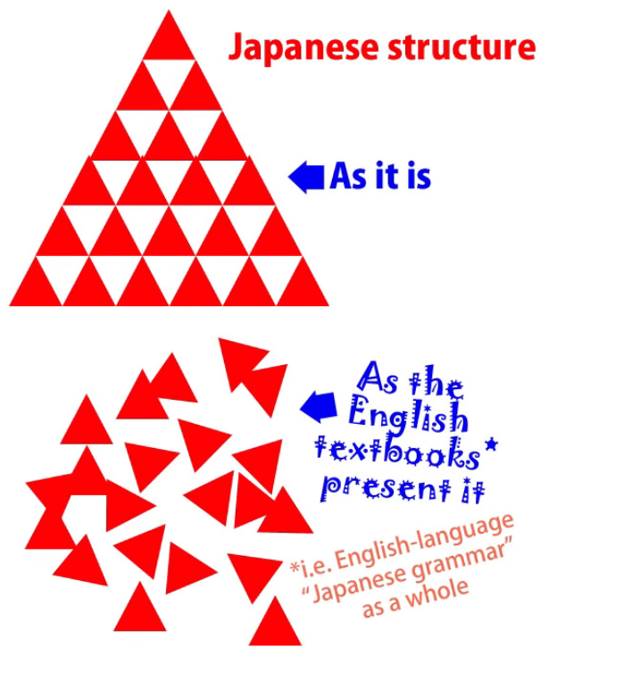
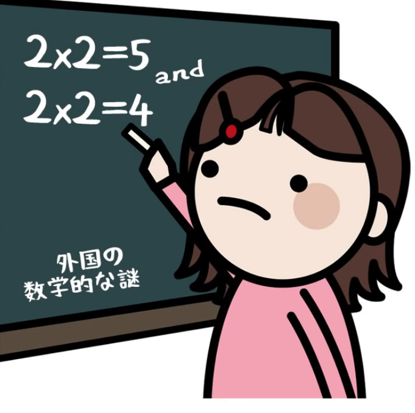
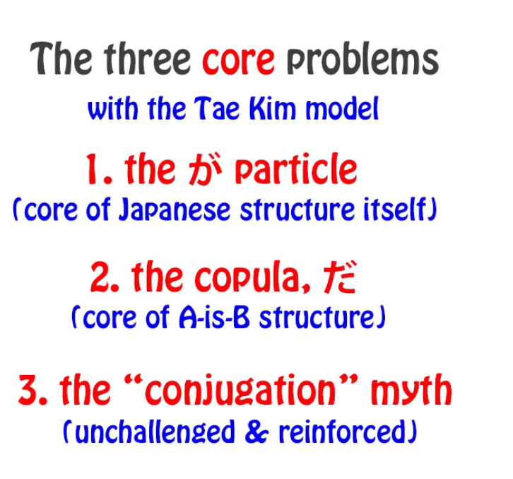
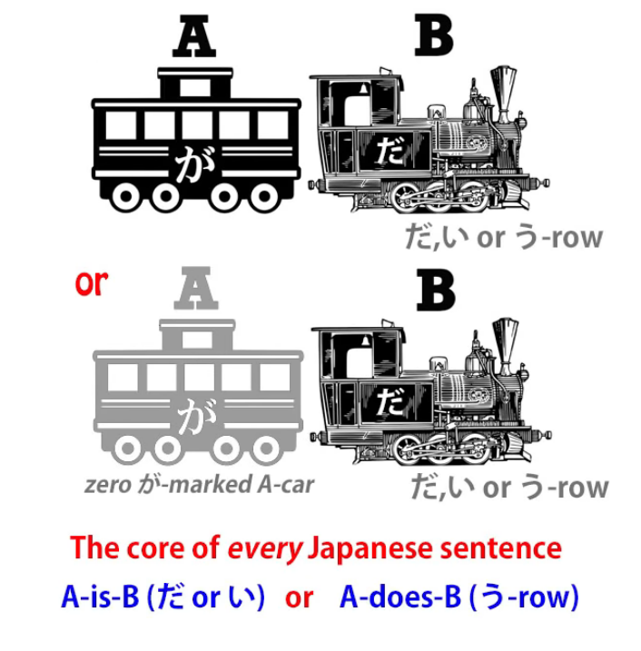
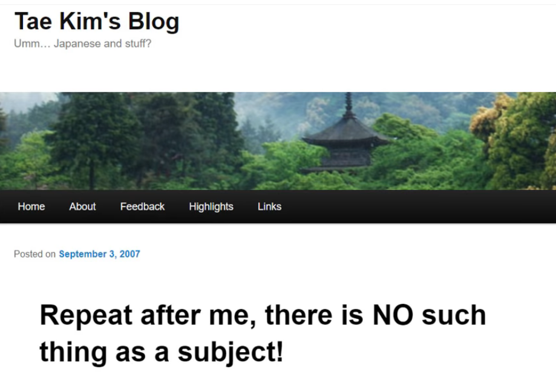
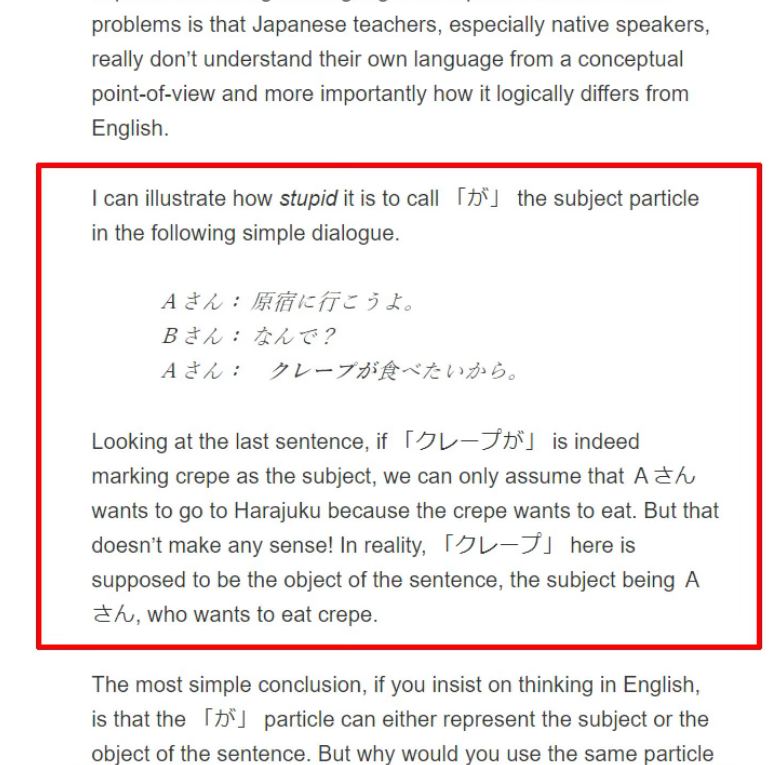
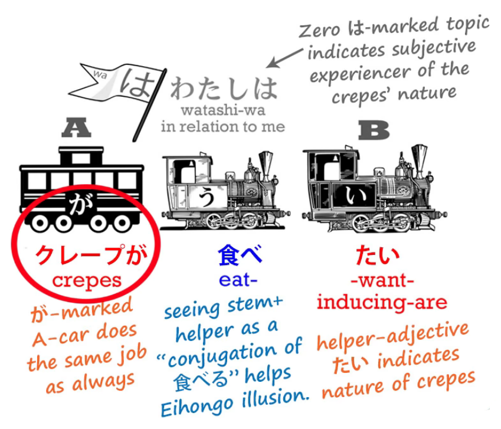
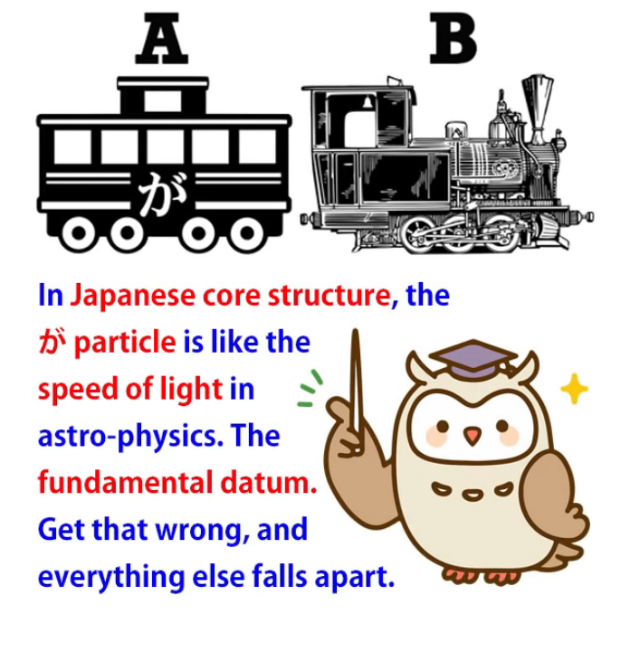

# **77. Real Japanese Structure vs Tae Kim: Structural Review of Tae Kim's Japanese Grammar** 

[**Real Japanese Structure vs Tae Kim - Structural Review of Tae Kim's Japanese Grammar | Lesson 77**](https://www.youtube.com/watch?v=-JuHi-yKGFc&list=PLg9uYxuZf8x_A-vcqqyOFZu06WlhnypWj&index=80&ab_channel=OrganicJapanesewithCureDolly)

こんにちは。

Today's is the first video that I've really

hesitated to make and had second thoughts about it,

but I've decided to go ahead.

It's a video that I think will throw more light for all of us on the structure of Japanese.

And it'll do this by taking it from a slightly different angle

and contrasting it with something different from what I normally contrast it with.

Normally, I contrast Japanese with the conventional <code>Eihongo</code> Japanese grammar models.

And some people actually have criticized me for criticizing those models too much,

for repeatedly pointing out the failings of those models

rather than simply expounding what I have to expound.

And I do this for a reason, and the reason is this:

conventional Eihongo/Western Japanese grammar really hasn't changed since hundreds of years ago, when Western people started imposing classical European grammar on the Japanese language in an attempt to explain it to other Western people.

And these explanations are enshrined in the most prestigious places.

They're taught in universities by people with strings of letters after their names.

They're taught in all the standard textbooks and then echoed down

to everybody with a Japanese learning website or channel.

And because of this, because of the prestigiousness and the ubiquity of these models,

when people hear other models, they're very likely to wonder how they can reconcile the two.

The old models <code>must</code> be true because they're so prestigious and the new model sounds true as well, so how do we marry them up, how do we reconcile them?

And the answer is of course that we can't actually reconcile them.

If 2 and 2 equal 4, then they can't also equal 5.

And it's necessary to point this out because people will try to reconcile them if they're not aware of that, and that's going to lead us into all kinds of logical tangles.

Now, Tae Kim-sensei, whom we're going to speak about today, was intelligent enough and brave enough

to see the fundamental flaws in the conventional Western Japanese models.

He saw that they were full of contradictions and inconsistencies and illogicalities,

and he tried to create models that were more consistent and more logical.

The problem is that in the most important areas what he essentially did

was keep the bits that were wrong and try to reconcile the bits that were right with those.

So we ended up with something that was in many respects worse than the original Eihongo models.

Now, I want to make it clear that I am not trying to do any kind of a <code>hit job</code> on Tae Kim-sensei.

I respect him greatly and I recognize that he was just about the only person (apart from Jay Rubin) who recognized that there is a problem with conventional Eihongo Japanese

and had the courage to try to do something about it.

::: info
Jay Rubin seems to have been what Dolly based her explanations.
:::
It's people who recognize the problems and try to solve them who move knowledge forward.

And this process of moving knowledge forward is littered with experiments that didn't work

and models that in the end didn't stand up to testing.

That doesn't make them foolish. They are part of the path of knowledge.

## Tae Kim

Tae Kim-sensei has quite a lot of information online and a lot of what he says is useful.

The areas in which we have to dispute his models are essentially three, and unfortunately

these three are so near to the very core of the structure of the language

that they do cast a shadow over everything else, because they have logical consequences.

So, the three are essentially:  
the が-particle, which is the absolute backbone of Japanese structure,  
the copula <code>だ</code>, which is essential to all non-adjectival A-is-B structures,

and the myth of Japanese conjugation *(Lesson 10)*.

So, as you see, this is quite a formidable threesome that really casts a shadow over everything.

However, if we're sufficiently aware of the problems it could still be possible

to use at least some of Tae Kim's work.

And his approach to immersion itself is actually closer to what I believe than anything else I've seen.

So let's look at the three problems.

The first is the が-particle.

## The が Particle

Now, the が-particle, as I've explained on various occasions before, is the absolute core of Japanese *(Lesson 1)*.

You can't have a sentence without the が-particle, even though you can't always see it.

It's sometimes present only as a logical entity.

But it's always there, and if we don't have it, we don't have a sentence. Simple as that.

---

What the が-particle does is, it marks the subject of the sentence,

that's to say, the thing that we're saying something about.

We're either saying <code>A is B</code> or <code>A does B</code>.

What the A-car is is the subject of the sentence, the be-er or the do-er of the sentence.

The が-particle marks this. It can never mark anything else.

But conventional Japanese makes a mess of this by misunderstanding some Japanese sentences to the point where it has to say that が only sometimes marks the subject of the sentence; other times it marks the object.  
Now, this is nonsense and I've demonstrated that it's nonsense.

が never marks anything but the subject.

Tae Kim tries to reconcile this problem by saying that が doesn't mark the subject

and even going so far as to say that there is no such thing as a subject in Japanese

and saying that there is a subject is simply imposing European concepts on the language.

Now, the truth is that every human language has a subject, which is what we call an A-car,

and a predicate, which is what we call a B-engine.

All we are saying when we say this is that every human language can say something about something.

It can take a particular thing and say a particular thing about it.

The particular thing it takes is called the <code>subject</code>.

The particular thing it says about it is the predicate *(=basically everything excluding the subject)*.

It's as simple as that.

If we don't have subjects and predicates we don't have language in any developed sense of the word.

All we can do, if we can't say a particular thing about a particular thing, is make noises

that express that we're happy or sad or angry or frightened, just as animals do.

Without subjects and predicates there is no language. Simple as that.

Different languages may deal with them in very different ways, but the concepts have to be there.

---

Now, what is it that induces Tae Kim-sensei to declare that Japanese is so different

from any human language that it has no subject?

Well, ironically, it's the fact that he can't shake the Eihongo grammar approach

that continually imposes English structure on Japanese.

It's because they can't conceive (and apparently Tae Kim-sensei can't conceive either)

that the Japanese could ever take the ego out of the heart of a subjective sentence.

So, the example he uses to <code>prove</code> that Japanese has no subject is the phrase

<code>クレープが食べたい</code>,

which of course in all the textbooks gets translated as <code>I want to eat crepes</code>.

::: info
Tae Kim-sensei’s explanation.
:::
And, as usual in English, the experiencer of the subjectivity, the ego, is placed at the center.

That's the subject, that's the doer: <code>I want to eat crepes.</code>

And of course the crepes are marked by が, and they're not the subject, are they?

So が isn't marking the subject. On this, Tae Kim-sensei and conventional Eihongo Japanese are at one.

Eihongo Japanese explains it by saying that が only sometimes marks the subject.

Tae Kim-sensei explains it by saying that there is no subject in the entire language.

But the simple reason for both these statements is a complete inability

to even consider the fact that Japanese might use different expressions from English

and that it could be possible to take the ego out of the center of a statement about subjectivity.

Now, the odd thing about this is we don't even have to go as far as Japanese

to know that this happens all the time. It happens in Spanish.

<code>Me gusta el Tequila</code> is not saying <code>I like Tequila</code>, although all the textbooks will tell you it is.

It's saying <code>Tequila does pleasing to me</code>.

Now, this may not be the way English wants to put it, but it is the way Spanish puts it.

<code>クレープが食べたい</code> means <code>Crepes are eat want-inducing (to me)</code>.

Again, this may not be the way English wants to put it, but it is the way Japanese puts it.

The が-particle is doing what it always does.

It's marking the subject, the doer, the A-car, of the sentence.

It's just that the subject, the doer, the A-car, of the sentence in Japanese is not the same as

it would be if an English person tried to express the same sentiment.

The subject of the sentence is the crepes.

They are the one that's doing the eat want-inducing to the experiencer.

And if we understand this we don't have to say that が marks the subject some of the time.

We can see that が marks the subject all the time.

And we don't have to start saying that there's no such thing as a subject in Japanese.

Because the only language in which there's no such thing as a subject

is <code>wanwan</code> and <code>nyan-nyan</code> language.  
::: info
Since I was not able to find anything about them, I am pretty sure it was a joke (￣□￣」)
:::
Human language has to have subjects and predicates or it ceases to be language.

## The Metaphysical Trap

Now, some of you may be asking, how can I say that my model is the truth?

::: info
And yes, Linguistics is in fact a scientific field too.
:::
That the whole of conventional Japanese grammar is not true and Tae Kim-sensei,

whom I acknowledge to be a very fine mind, is also producing models that aren't true?

And the answer to that is, I'm not saying that at all.

---

There is no such thing as truth in language structure or linguistics,

just as there is no such thing as truth in science.

Humans have metaphysical minds.

They want narratives and they want truth and falsehood.

Both of these are inherited from deep and ancient metaphysical intuitions.

And I'm not saying anything here about whether those intuitions are true or whether they're false.

All I'm saying is, if they're true, neither science nor linguistics are the places to look for them.

If we have a model that is inconsistent and has to be continually shoehorned with rules

and exceptions to make it work, or we have a model that is too vague to be very useful,

and then we have a model that is precise and consistent and works all the time,

we're likely to say that that third model is the true one.

But in fact this is falling into the metaphysical trap.

I may occasionally speak that way myself, but let's be perfectly clear:

this is just really a trick of language.

When compared to the inconsistent model or the vague model,

the consistent and accurately predictive model is not <code>truer</code>, but it is more useful.

Science doesn't tell us truth. It predicts things.

It tells us that when we do A and B the result is going to be C.

This has nothing to do with truth, metaphysics, narratives or anything else,

it's just a method of prediction.

And if we can predict things, we can do useful things with those predictions.

It's exactly the same with language.

So the conventional model is sufficiently inconsistent that in many cases it's not fit for purpose,

at least not if we can find a better model to replace it with.

Tae Kim-sensei's answer to this is to create a model so vague that it's unfalsifiable.

Now, when we talk about models or theories, being falsifiable may sound like a negative, but it's not.

It's a positive.

Because if there are no circumstances under which a theory can be falsified,

then essentially it doesn't really mean anything.

Theories work by defining phenomena; that's to say, setting out their limits:

setting out the conditions under which they apply and the conditions under which they don't apply.

If we create one that applies under all possible conditions, then it really doesn't mean anything.

If you give me an object and ask me what it is, if I say it's a marble, or it's a box, or it's a twig,

you can verify or falsify that statement.

If I say it's an object, you can't falsify it, because everything is an object,

but on the other hand, I haven't told you anything worth knowing.

::: info
This above portion was really good. It shows that linguistics is not merely black and white, there are not only <code>right</code> and <code>wrong</code> ideas - rather, <code>more useful</code> and <code>less useful</code> ideas for a PARTICULAR individual. For some, Tae Kim-sensei’s explanation works way better than Dolly’s, and that is okay…if a person keeps going with the studies/exposure, they will eventually understand how the language truly works even if at first they were told conflicting info - due to how our brains restructure around and solve language problems by natural patterns, logic etc.
:::
---

What Tae Kim does with the が-particle is call it the <code>identifier particle</code>.

Now, if you went a bit further, that might be useful.

Does it identify the subject? Does it identify the object?

Does it identify some completely different kind of category?

And the answer is, we're not told.

All Tae Kim-sensei has to tell us is that it indicates that the speaker wants to identify something unspecified.

Now, this vagueness might be considered not very destructive, but in fact it is very destructive

because it essentially takes away our ability to define anything.

We can't see how the core Japanese sentence works because we don't have the が-particle.

We can't talk about the difference between logical and non-logical particles *(Lesson 8b)*,

like the は and も topic markers, because we don't have the key logical particle.

If we have to build a theory around this undefined が,

then we're going to have a very undefined kind of theory.

So we've essentially created a structure that negates the core structure of Japanese from the beginning.

And once we've done that, we logically find ourselves having to do other things

that take the theory even further from being useful and predictive.

So in our next lesson *(Lesson 78)* we're going to look at

what happened to the <code>だ</code> copula in Tae Kim-sensei's theory and some other consequences.

Now, once again, I'm not trying to denigrate Tae Kim-sensei.

In fact, the reason I've singled him out is because

he's the only person who's really challenged the conventional Eihongo model

at a deep enough level to give us another perspective, another angle for assessing Japanese structure.

And it's really only because he's that important and that intelligent

that I made the difficult decision to make this video and the next one.

::: info
To reiterate, this is NOT Dolly putting down Tae-Kim-sensei or saying her way is superior, because language is not black and white... It just compares Dolly’s understanding to Tae-Kim’s.  
And it is completely okay to have different kinds of mindsets about things in language. This happens all the time in linguistics. It is not meant to cause ill-will or ridicule whatsoever.  
:::
We are all different and for each of us, something else works, so there is benefit in it.*
