# **78. Breaking the Core: Tae Kim vs the Copula | Japanese Structure-Based Critical Review** 

[**Real Japanese Structure vs Tae Kim - Structural Review of Tae Kim's Japanese Grammar | Lesson 77**](https://www.youtube.com/watch?v=-JuHi-yKGFc&list=PLg9uYxuZf8x_A-vcqqyOFZu06WlhnypWj&index=80&ab_channel=OrganicJapanesewithCureDolly)

こんにちは。

Today we're going to talk about the core of Japanese structure

and we're going to look at it from a different angle by contrasting it

to something different from what we normally contrast it to.

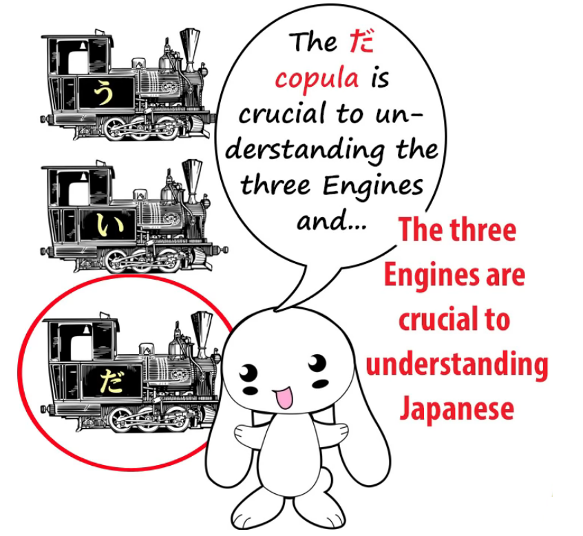

And that is, we're going to look at what Tae Kim-sensei does with it.

Last week we looked at what Tae Kim-sensei does with the が-particle,

which is the absolute core and center of every logical Japanese sentence.

Today we're going to look at what he does with <code>だ</code>.

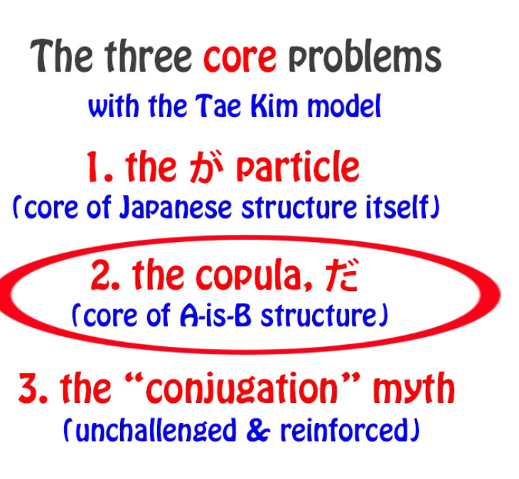

And in a way this is parallel to what he does with が.

## The だ (& です) copula

That is to say, he essentially vagues it out of existence,

takes away its logical function and gives it a vague kind of function.

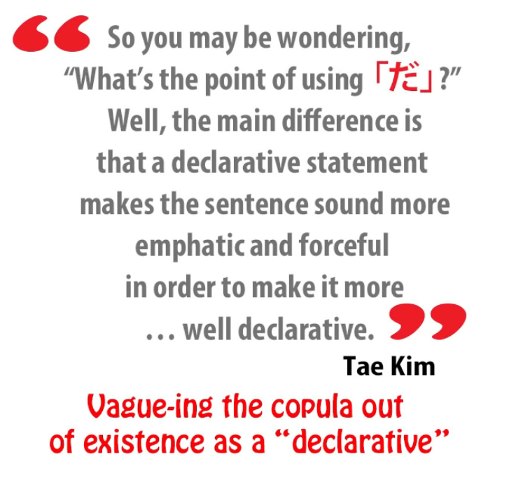

Now, why does he do this?

Again, essentially for the same reason:

because the conventional Eihongo grammar interpretation is a bit of an illogical mess

and Tae Kim-sensei wants to tidy it up.

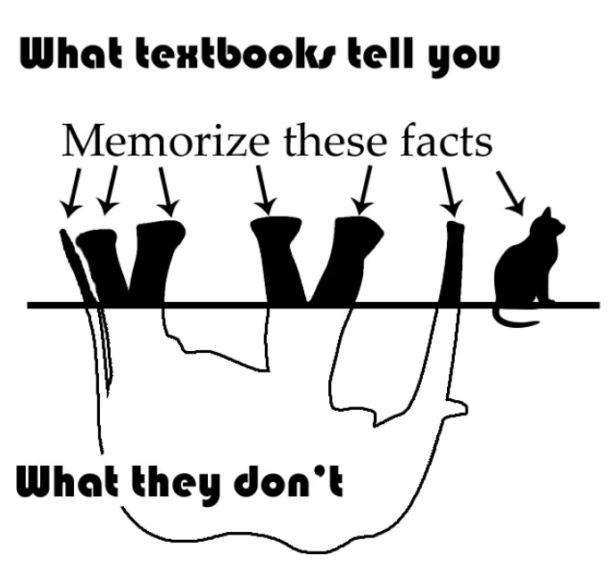

But essentially once again what he does is take the part of it that's wrong

and try to reconcile the part of it that's right with that.

So we end up with something that's actually more damaging and less useful

than the Eihongo mishmash we had in the first place,

which at least had some of the actual structure of Japanese in it,

even if in a rather illogical and messy way.

And he also denies that <code>だ</code> and <code>です</code> are actually the same thing,

and this is really for three reasons.

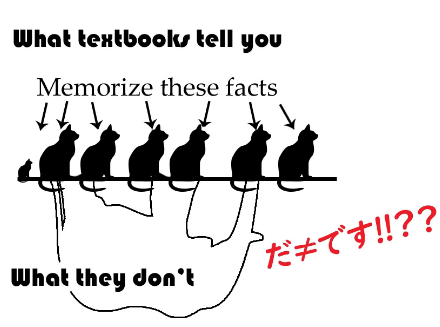

Firstly, if you deny the copula function it doesn't really much matter what they are.

Secondly, <code>です</code> is a little bit eccentric.

It does one thing that <code>だ</code> doesn't do. Just one thing.

But also because the Eihongo Japanese model is so confusing

and so wedded to the myth of so-called <code>Japanese conjugation</code>, which doesn't exist,

that it makes that one eccentricity of <code>です</code> look like more than one.

---

It looks as if it's all over the place when in fact it's only got one eccentricity --

which is a little bit confusing, but when you see it for what it is, it's just that one thing.

So, how important is it that we misunderstand the <code>だ</code> copula?

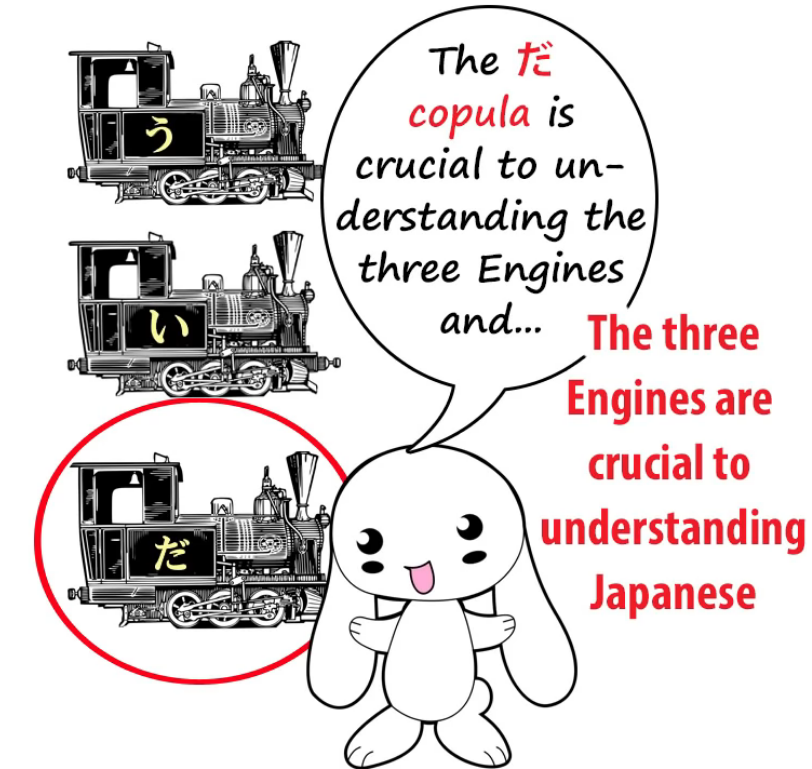

It's not central to every Japanese sentence the way the が-particle is, so is it that bad?

Well, as a matter of fact it is, because it takes away

another of the absolute pillars of understanding Japanese structure.

And that is, understanding the three engines and the three core sentences.

---

There are only three ways a logical Japanese sentence can end:

with a verb, an adjective, or a noun + copula.

It can't end with a noun on its own; it can only end with a noun + copula.

And this is fundamentally important and we'll get to why in just a moment,

but I'll just note here that part of the reasoning behind Tae Kim saying that the copula is a mere declarative

-- it doesn't actually do anything logical and grammatical, it just emphasizes what we have to say -- is because in **casual** speech <code>だ</code> sometimes gets dropped.

Now, the important thing to understand here is that **this does not mean that it's unnecessary**.

In English we often say things like <code>Got up early this morning</code>, <code>Fancy a cup of coffee?</code>,

<code>Call that a rabbit? Looks more like a teddy bear in a rabbit suit to me!</code>

And in all these cases we know, everybody knows, that the sentences aren't fully grammatical.

You have to say, <code>I got up early this morning</code>, <code>Do you fancy a cup of coffee?</code>,

<code>Do you call that a rabbit? It looks more like a teddy bear in a rabbit suit to me!</code>

This is perfectly natural. All languages drop necessary grammatical elements

when they can be readily understood by the \[listener\] in very casual speech.

You can't do it in an essay or in formal writing or in a legal document

or anything like that, but you can do it in casual speech.

---

In Japanese, not only does the copula get dropped,

**half the particles can get dropped in very casual speech**.

And I don't think anybody argues that they aren't necessary.

So, **in actual grammatical Japanese** you can only end a sentence in one of those three ways.

It can end with a verb, it can end with an adjective, or it can end with the copula,

and **the copula always has to be attached to a noun**, because that's how the copula works.

And as we know, what the copula does is tell us that A is B.

<code>さくらが日本人**だ**</code> means <code>Sakura **is** a Japanese person</code>.

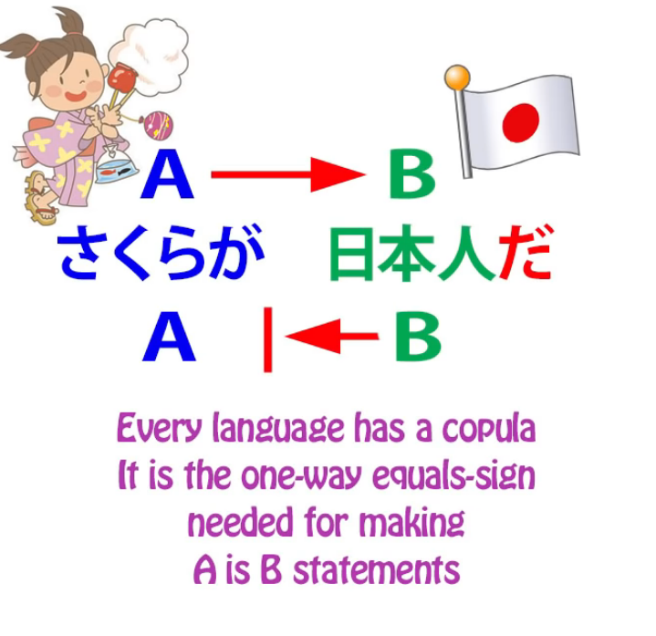

It only works one way around.

A Japanese person is not necessarily Sakura.

Sakura is a Japanese person.

That's what we're being told by a copula sentence.

---

Now, if we look at all the elements in Japanese, all the verbal elements, there aren't very many.

Unlike English, unlike European languages, there really are very few.

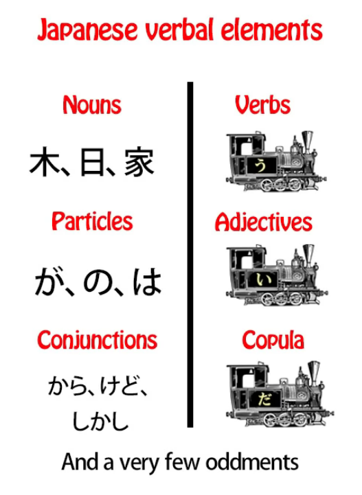

There are verbs, adjectives and the copula, and then, aside from that, we have nouns --

-- nearly everything that's not a verb or an adjective is a noun.

There are also particles, and there are some conjunctions like <code>なら</code> and <code>けれど</code>.

Almost everything else that isn't a verb or an adjective is in fact a noun.

There are a few exceptions but not very many.

Now, why are we dividing them up in this way?

On the one side we have verbs, adjectives and the copula;

on the other side we have nouns, particles and conjunctions.

The reason is that when we split them up this way,

apart from the fact that we have the three engines together,

the three engines have another characteristic, another quality.

They are all <code>用言</code>, they are all transforming verbal elements,

that's to say, they can all change grammatically.

::: info
Dolly does not give the Kanji form of 「ようげん」but I am practically sure it is this one.
:::
They don't change as much as conventional Japanese or Tae Kim-sensei

would have us believe. They don't conjugate.

But **they do change the last kana** (in a couple of cases a little more than the last kana)

and then, in the case of verbs and adjectives,

**they can attach helper verbs, helper adjectives, and helper nouns**.

And this is a fundamental basis of the way Japanese works.

In the other column we have nouns, particles and conjunctions, and these never change.

**A noun never changes grammatically**.

It never has any kind of transformation or modification made for grammatical purposes.

**Particles never change**. They attach to nouns but they always stay the same.

Conjunctions, like <code>から</code> and <code>けれど</code>, don't change their form for grammatical purposes.

The only verbal elements that do that in Japanese are the three engines:

verbs, adjectives and the copula.

But if you look at the conventional Japanese grammar textbooks and websites

you don't end up knowing, for the most part,

that **the copula is one of these grammatically transforming elements**.

We know that the verbs are. We know that the adjectives are.

We know that <code>だ</code> can actually move into the past tense and become <code>だった</code>,

but we don't realize that it's a fully, slightly limited, but a modulating element.

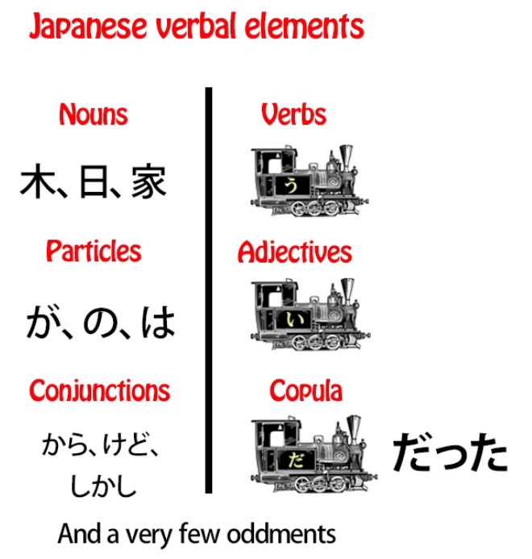

The fact that we know that it has one modulation just makes the whole thing more confusing.

It looks like an oddity. But it isn't an oddity.

**Just like verbs and adjectives, the copula is a fully transforming element.**

**It has a て-form**, just like verbs and adjectives. **And that て-form is <code>で</code>**,

and **it's the same て-form whether it's the <code>だ</code> version or the <code>です</code> version**.

**And it has a connective form** *(な)*, which is used when it's going before the noun it modifies

rather than after the noun it modifies.

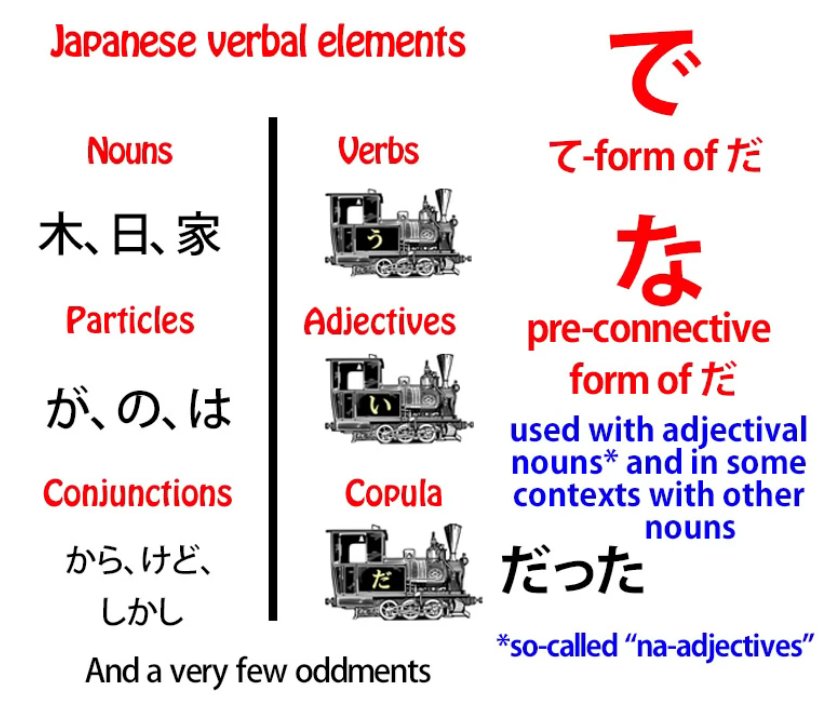

We can say, <code>女の子は綺麗**だ**</code> (the girl **is** pretty), or we can say <code>綺麗**な**女の子</code>.

And when we turn it around this way, the <code>だ</code> has become <code>な</code>.

**If we want to chain two adjectival nouns together, we use the て-form of the copula.**

And this is just the same as what we do with adjectives.

If we want to say <code>Sakura is small and pretty</code>, we say <code>さくらが小さくて綺麗だ</code>.

If we want to say, <code>Sakura is pretty and small</code> (pretty, <code>綺麗</code>, is a noun, an adjectival noun --

we know it's a noun because it can be written with all kanji

and anything that's written with two or more kanji

and almost everything that's written with one kanji is always a noun),

we say <code>さくらが綺麗**で**小さい</code>.

If we want to say <code>Sakura is genki</code>, we say <code>さくらが元気だ</code>.

If we want to say <code>Sakura is genki and pretty</code>, we say <code>さくらが元気**で**綺麗だ</code>.

::: info
I guess that since copula attaches to a noun, it is why we have both て-form of the copula 「で」after 元気 & also the regular copula form だ at the end after 綺麗. So basically 2 copulas but one of them is also chaining the nouns together. But just my guess, so take it with a salt.
:::
And you see we've done exactly what we do with adjectives.

**With adjectives**, if we want to chain two adjectives together,

we put the first one into the て-form: <code>さくらが小さく**て**かわいい.</code>

::: info
If I understand correctly, the て is the adjectival joining copula form like で, and the last い in かわいい is the plain copula form of the adjective as given in lesson 6.
:::
---

If we want to chain **two adjectival nouns** with their attached copula together,

**we turn the first copula into its て-form**, which is <code>で</code>.

Now, for some reason the textbooks never explain this.

They try to tell us that adjectival nouns are some weird thing called a <code>な-adjective</code>

that has this thing called <code>な</code> stuck onto it for no reason that we can possibly understand,

even though when it comes at the end of a sentence it has <code>だ</code> like any other noun.

And then, when we want to chain two together, most people, I think, seriously believe

that the で-particle, for no possible explicable reason, is used for this purpose.

Of course, **it's not the で-particle**; **it's the て-form of the copula <code>だ</code> or <code>です</code>**.

And I think it's the fact that this is never explained that allows Tae Kim-sensei

to believe that <code>だ</code> is simply a declarative.

If it was a declarative, why would it need a て-form?

Why would you need a て-form on what's essentially just a verbal exclamation mark?

Why would you need a soft connective form on what's essentially just a verbal exclamation mark?

You wouldn't.

But because conventional Eihongo Japanese never makes it clear to us

that this is what's actually happening, that **<code>な</code> is the pre-connective form of <code>だ</code>**,

that **<code>で</code> in these cases is the て-form of <code>だ</code> the copula**, because it never explains that,

it makes it possible for even someone as intelligent as Tae Kim-sensei

to misconceive what <code>だ</code> actually is and what it actually does.

And having done that, we've really lost our grasp of

the three fundamental engines of every Japanese sentence.

And I should say that **<code>だ</code> and <code>です</code> aren't in fact the only two forms of the copula** in modern Japanese.

They're the most common forms, but **there are also two others.**

## である copula form

Sometimes we use <code>である</code>, which is a bit of a fossil.

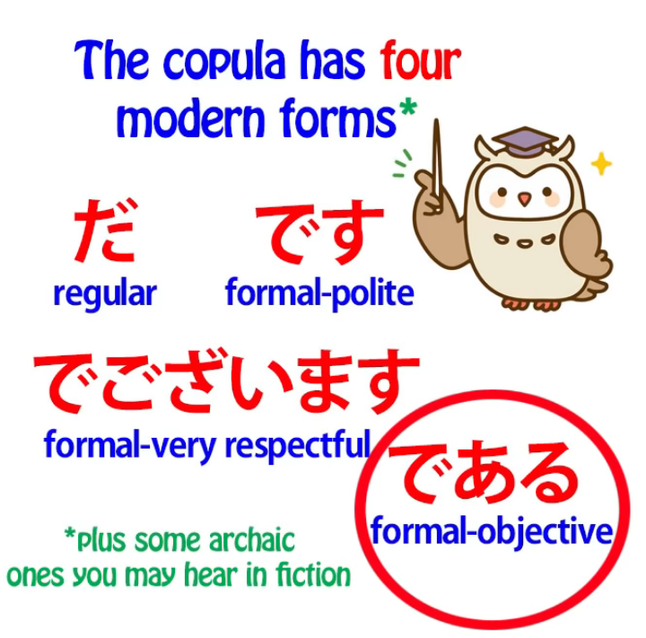

**It's an old form of the copula** and it's **used in formal but not necessarily polite contexts.**

So it can be used for example in newspaper reporting

where it's just being formal and objective, not particularly polite.

The famous novel <code>I Am a Cat</code> is, in Japanese, <code>我輩は猫である</code>,

and the reason it uses <code>我輩</code> for <code>I</code> and <code>である</code> for the copula conveys in Japanese,

in a way that the English translation can't convey, the character of the cat in question,

who has the personality of a rather <code>偉そう</code>, a rather self-important gentleman

who refers to himself as <code>我輩</code> and uses the rather archaic and formal

but not particularly polite copula <code>である</code>.

::: info
わがはい has two forms - 我輩 and 吾輩, they are basically identical, but apparently,  
[**it seems that 吾輩 is a bit less pompous/restrained and 吾 is not a 常用漢字.**](https://chigai-hikaku.com/?p=49060)
:::

## でございます copula form

The other copula that we'll hear often is <code>でございます</code>, and **that's ultra-polite**.

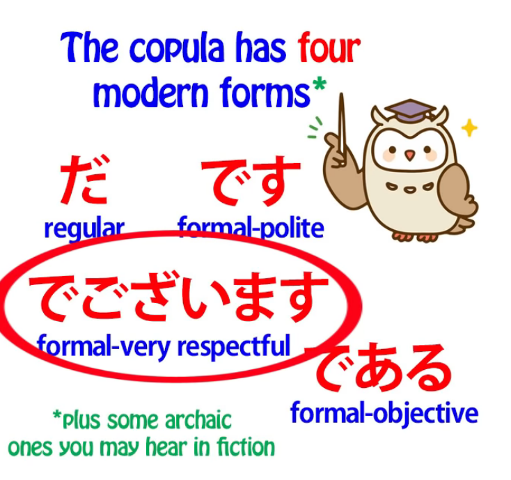

**It's 敬語**, and you'll have this used to you in Japanese hotels and places like that.

**All of them are forms of the copula**,  
and **all of them have the same て-form, <code>で</code>**, **and the same connective form, <code>な</code>**.

## です & ます eccentricity

Now, the other thing, I think, that makes it possible to imagine

that <code>です</code> is not the same copula as <code>だ</code>

is that **<code>です</code> and <code>ます</code> are both a little bit eccentric** -- and I've made a whole video on this. ***(Lesson 17)***

And it's for this reason, because their eccentricities

actually disrupt our grasp of fundamental core Japanese grammar --

once we've got used to it it's easy enough to add <code>です</code> and <code>ます</code> on,

but it's best to leave them alone at first because

**they do things that no other modern Japanese words do**.

---

And **a thing that <code>です</code> does in this case is that it can be added to adjectives**.

So we say <code>女の子がかわいい**です**</code>.

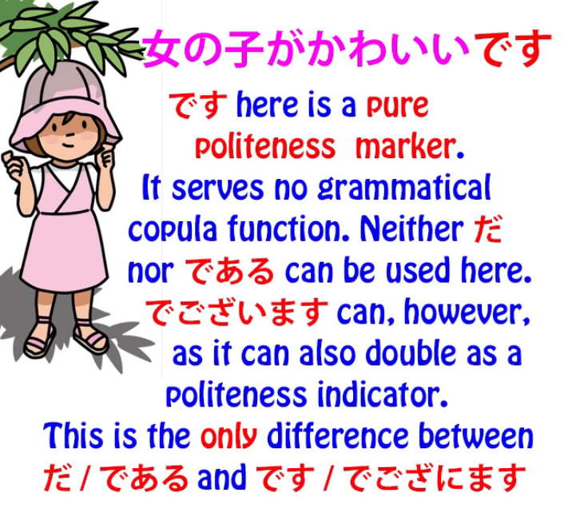

::: info
Although this will be touched upon in Lesson 79. It isn’t just a random empty marker.
:::
Now, **this <code>です</code> is not acting as a copula**. **It's simply a formality marker.**

And **the reason it's there is because there isn't a formal version of the adjective engine**.

And it only happens in this one case, and it only happens because

adjectives don't have another way of formalizing themselves and somehow Japanese settled on this idea of using the formal copula as a formality marker in that particular case.

The other, **non-polite forms of the copula, <code>だ</code> and <code>である</code>,**

**are not put onto the end of adjectives.**

And of course it's not just a question of adjectives.

**The connective form of the copula and the て-form of the copula are used**

**in various places in Japanese to form a variety of different constructions.**

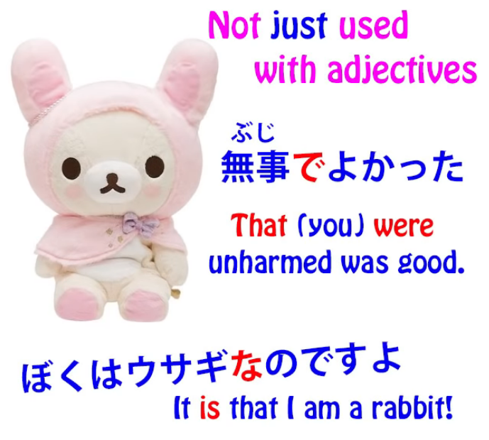

And I've included some of these in a video *(should be Lesson 40)* that I'll link above my head

and in the information section below if you'd like to follow it up a bit.

And if we don't know that the copula has a て-form, or a connective form,

then we're going to have a lot of difficulty in understanding

what these constructions are actually doing.

And if we follow the conventional Eihongo Japanese grammar we probably won't know this,

and if we follow Tae Kim-sensei we won't even know that there is a copula.

And this is going to make all kinds of constructions extremely difficult.

## The matter with conjugation

And we should really touch here on the other problem with Tae Kim,

which is not actually worse than the Eihongo textbooks, but it's no better.

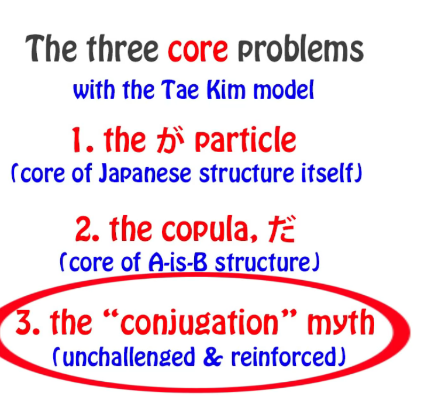

And that is that he, like them, accepts the myth of <code>Japanese conjugation</code>.

He believes that Japanese verbs conjugate, when all they actually do

is change one kana and attach helper nouns, verbs and adjectives.

::: info
Rather as in terms of Western language structure and logic. Linguistically, I think it could be argued whether Japanese truly doesn’t have or does have a certain kind of conjugation…  
All-in-all, in the end it doesn't really matter as long as Japanese is approached as Japanese.
:::

And that becomes important in this particular case because it makes it appear

that this eccentricity of <code>です</code> covers a wider range than it really does.

If I say that <code>です</code> is only used as an empty formality marker on adjectives,

someone who is following either conventional Japanese or Tae Kim may say

"Well, it's not only adjectives. It also happens to conjugated verbs,

like for example **食べないです** or **食べたいです**.

They're not adjectives, are they? They're conjugated verbs."

And the answer to that is, of course, yes, **they are adjectives**.

**They're not conjugated verbs.** There are no conjugated verbs in Japanese.

**<code>ない</code> is a helper adjective that is attached to the stem of <code>食べる</code>**.

**<code>たい</code> is another helper adjective that is attached to the stem of <code>食べる</code>**.

And I've explained all this in my video about the Japanese stem system. *(Lesson 7.5)*

**These helpers look like adjectives, they function in every way like adjectives**,

and there's a good reason for it. **They are adjectives.**

So, **the empty formality marker version of <code>です</code>** does not attach to all kinds of different words.

It only **attaches to one kind of word and that is adjectives.**

And this indicates to us how one logical error in Japanese actually feeds into others.

Because we don't understand that the copula modulates,

it can feed into a much greater error: that there isn't a copula at all.

Because we don't understand the stem-and-helper system and believe that Japanese verbs conjugate, we can believe that  
the empty formality marker <code>です</code> is used in a wide range of different situations

when in fact it's only used in one situation.

Now, as I've said before, **I'm not trying to attack Tae Kim-sensei**.

**He's done a great deal of exceptional work**

and the fact that he's misconceived a lot of Japanese is essentially because

**he's seen what's wrong with conventional Eihongo Japanese grammar and tried to tidy it up.**

Unfortunately, instead of sweeping it into the trash can, he's swept it onto the living room carpet.

But **that isn't because he's illogical**.

It's because he's logical and he just didn't get exactly what was going on.

And that's not surprising, because nobody's teaching it, nobody's telling anybody.

So I hope I've helped to set things a little bit straight here..

::: info
Have been trying the underlines again, in this style I feel it looks quite good and can help show the important parts better. But you can of course let me know your view on it* (o≧▽゜)o
:::