# **79. Deeper secret of the copula** 

[**1/3 of all Japanese sentences cracked! Deeper secret of the copula. +The Tae Kim fallacy | Lesson 79**](https://www.youtube.com/watch?v=euHYPcMoao4&list=PLg9uYxuZf8x_A-vcqqyOFZu06WlhnypWj&index=81&ab_channel=OrganicJapanesewithCureDolly)

こんにちは。

Today we're going to talk about something

that's absolutely crucial to the core structure of Japanese.

We've talked about this recently in relation to Tae Kim-sensei

and the way he disrupts our understanding of this particular thing.

What it is is the copula, and this really governs an awful lot

of what we can say and communicate in language itself.

It's crucial to how we conceptualize the world.

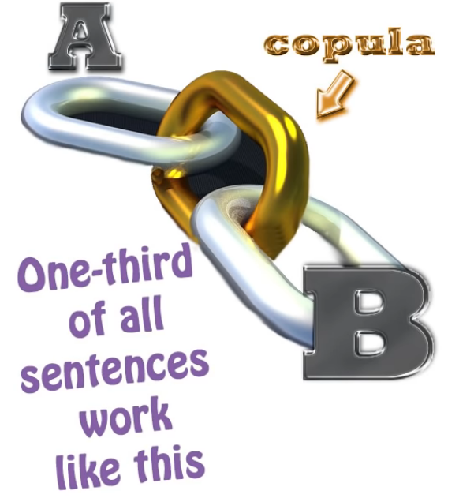

Now, Tae Kim never actually uses the C-word, <code>copula</code>,

and that's a large part of the problem.

But some people may be asking not so much why Tae Kim doesn't, as why I do.

After all, I try to avoid technical linguistic and grammatical terminology as far as possible.

I don't often use the word <code>**grammatical subject**</code>;

I even less often use the word <code>**predicate**</code>.

**I prefer to say <code>A-car</code> and <code>B-engine</code>.**

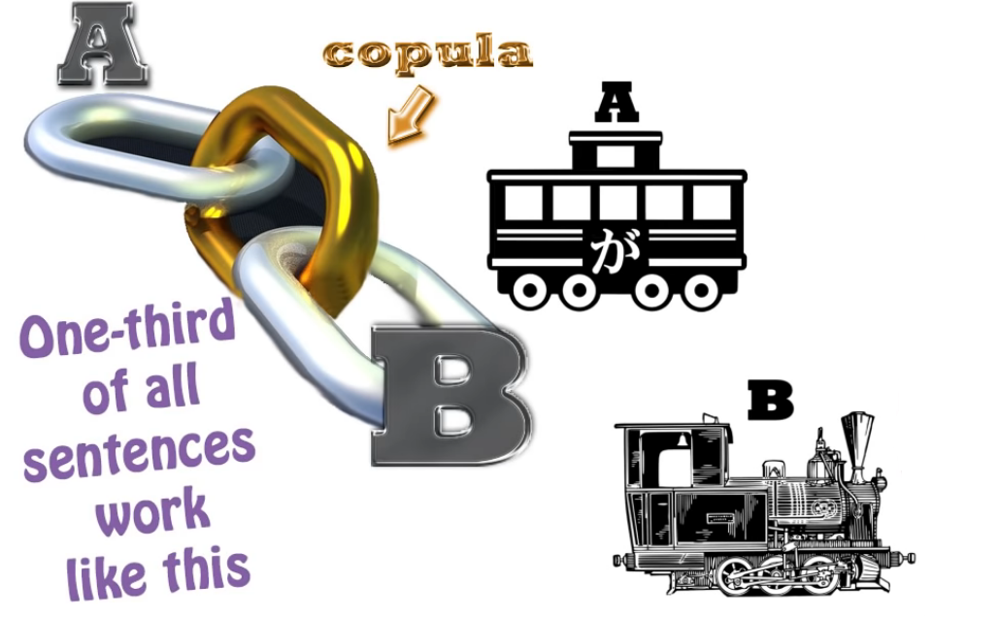

That way we all know what we're talking about.

So why do I use this abstract and rather horrible word, <code>copula</code>?

## What is a “Copula”

Well, the reason is that English doesn't have a dedicated copula,

so it can be quite difficult for English speakers to grasp exactly what a copula is.

I have to introduce that function as something in itself.

When Tae Kim talks about copular expressions,

he refers to them as <code>state-of-being</code> expressions,

and this really is the key to the whole problem.

So, what is the copula, and why does English not have a dedicated copula,

and why does it matter so much?

Let's start off with <code>what is a copula?</code>

The simplest way of defining a copula is that **it is a one way equals sign**.

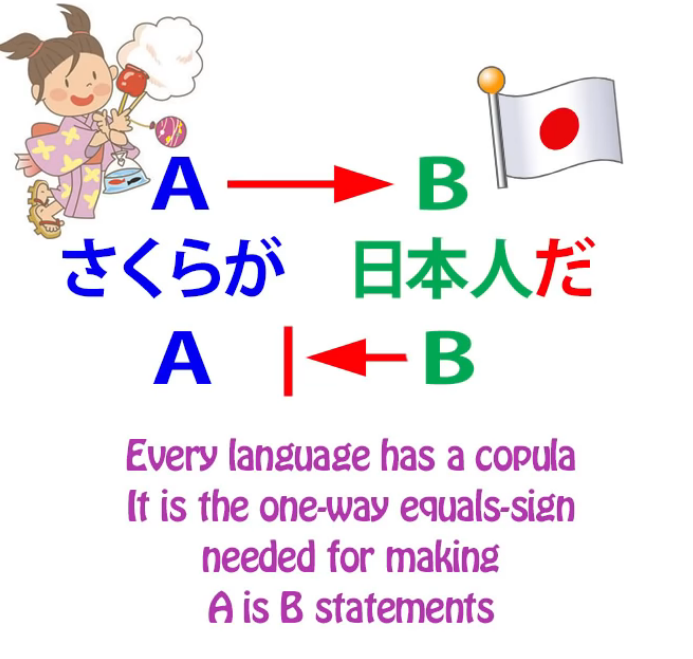

**It tells us that A is B**, **although B is not necessarily A**.

So, <code>さくらは日本人**です**</code>. *(Obviously, だ also)*

Sakura **is** a Japanese person; **a Japanese person is not necessarily Sakura.**

Now, that is the simple explanation.

But if we go a little deeper, **what the copula actually does is place things in sets**.

<code>さくらは日本人**です**</code> **means that Sakura belongs to the set <code>Japanese person</code>**.

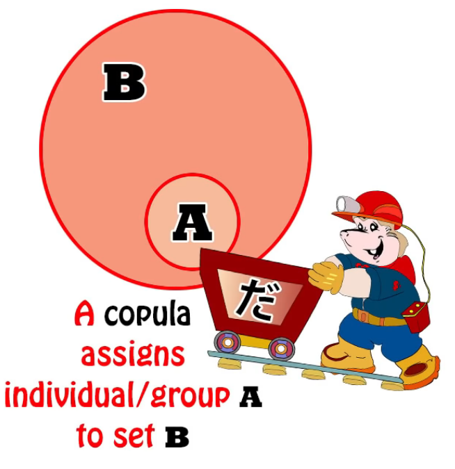

And this is fundamentally important for language,

which is the tool humans use to conceptualize the world,

the things they see about them, the visible and perceptible universe.

Placing things into categories is our most fundamental way of dealing with them.

**A rose belongs to the set <code>flower</code>**.

**Flower belongs to the set <code>growing things</code>**.

**Growing things belongs to the set <code>living things</code>**.

**Living things belongs to the set <code>things</code>**.

All the time we are placing things into sets, and that's the way we conceptualize them.

We could say very little about anything if we weren't able to place things into sets.

So **this, fundamentally, is what the copula does**.

**It gives us a very simple, straightforward, unfussy way of putting anything into a set at any time,**

**of defining at any time the set to which something belongs.**

---

**Now, the set may only be a set of one. In that case the equals sign works both ways.**

So, for example, if I say <code>That person over there is Sakura</code>,

well, that particular person over there and Sakura are the same person.

**Sakura is a set of one to which that person over there, and that person over there only, belongs.**

**At least, this particular Sakura.** **We're not talking about all people called Sakura**, obviously.

So this is what the copula does. Why so much confusion about it?

Isn't it a relatively simple function? Well yes, it is a simple function.

The main problem here, as very often with Western misconceptions of Japanese,

lies not in Japanese but in the nature of the English language itself.

**English, as I said, doesn't have a dedicated copula.**

**It does have a copula. Every language has to have a copula.**

If we didn't have something that performed the copular function,

we just wouldn't be able to put things into sets,

which means that we would be very limited in our ability to conceptualize things.

**So what English does is that it doubles up the verb of being with the copula.**

**The verb of being is something that simply tells us that something exists.**

**It has various forms: <code>is / am / are / was</code> etc.**

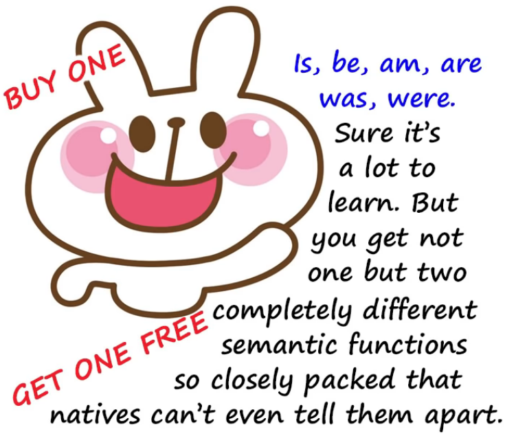

So, if we say <code>I **am** an American</code>, that's **the copula** at work.

We're saying **I belong to the set called <code>American people</code>**.

If we say <code>I think, therefore I am</code>, we're using the verb of being.

**We're not saying anything about what I am, what set I belong to.**

We're simply saying that because I think, we can state confidently that I exist.

Now, because English does not have two separate words for those two concepts,

it doesn't actually cause much trouble to native speakers of English

or to foreign speakers who have learned English at least partly through immersion,

because after a while it all becomes clear through usage and experience,

but **it does cause trouble when English tries to look at languages that have a separate copula.**

Japanese obviously is one of these, and Spanish is another.

---

**The Spanish language has two copulas, <code>ser</code> and <code>estar</code>**:

<code>ser</code>, which tells us the permanent set to which something belongs,

and <code>estar</code>, which tells us the relatively temporary set to which something belongs.

That's a distinction that most languages don't make. **But the important distinction here**

**is that <code>ser</code> and <code>estar</code> are not the same as <code>haber</code>, which is the verb of being.**

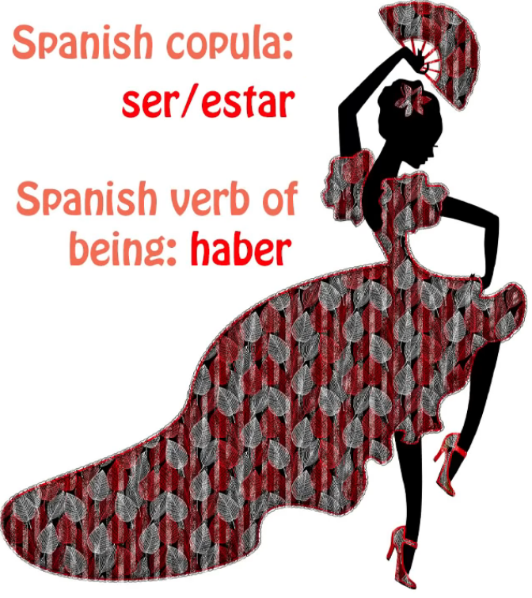

So if we say <code>Estos **son** huevos</code>, we're saying <code>These **are** eggs</code>; *(“son” should be copula here)*

if we say <code>**Hay** huevos</code>, we're saying <code>Eggs **exist**</code> -- two entirely different kinds of statement.

As I say, **in English we don't get confused between those two kinds of statement,**

**but when we try to apply English explanations to languages that do have**

**different words for the copula and the verb of being, confusion often ensues.**

## だ & です being the same copula

Now, some of the people who commented on my video on Tae Kim versus the copula

were not entirely convinced by my argument that <code>です</code> and <code>だ</code> are the same thing,

because Tae Kim argues so strongly that they aren't.

I think I disposed of most of them. I didn't dispose of all of them because I wasn't trying to be exhaustive.

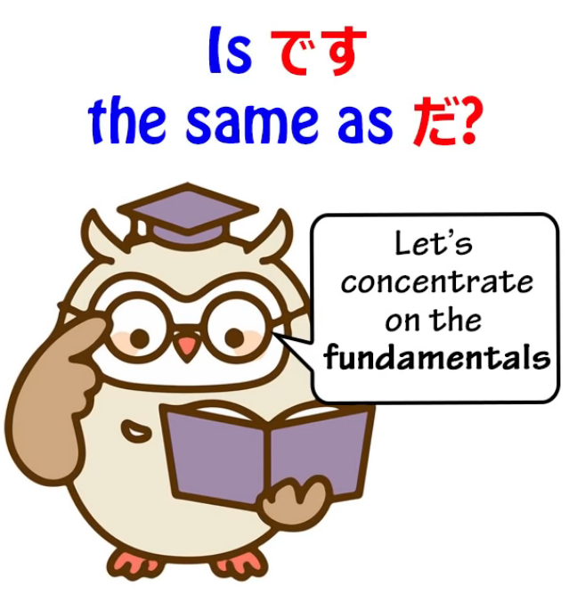

And I'm not going to deal with those arguments here either, because I think they're peripheral.

I will in fact be dealing with them in a video in the fairly near future,

**but the point here is that taking arguments like**

<code>だ isn't necessarily needed in this case but です is</code>

as a way of sustaining the larger argument that <code>だ</code> and <code>です</code> are not the same thing

**is taking the whole thing upside down and inside out.**

**What's important is not that <code>だ</code> and <code>です</code> function a little differently in this way or that way,**

**that <code>だ</code> can be dropped here and <code>です</code> can't be dropped there, things like that.**

They're entirely peripheral to the issue of the fact that **they are both the copula**.

And the fundamental argument against this fallacy is simply this:

we know that **every language needs to have a copula.**

**Without a copular function, you can't say half of the things that language absolutely needs to say.**

You don't have a real language.

**You have a broken language if you don't have any copular function.**

Now, Japanese sometimes speaks in 丁寧語 (in です/ます speak *= polite language*)

and sometimes speaks in straightforward, plain Japanese.

**The copula in one is <code>です</code>** *(polite)***; the copula in the other is <code>だ</code>.** *(plain)*

Now, if you're going to argue that they're not the same thing,

therefore that one of them is not the copula,

then you have to come up with what the copula is,

in either plain language or 丁寧語 (です/ます language),

because **both of them have to have a copula.**

**You have no language without a copula**, so it's incumbent on you,

if you're saying that they're not the same thing,

to tell us where the copula lies in both those forms of speech.

And of course Tae Kim never tackles this problem

because he doesn't really seem to understand that there is a copula

as opposed to what he calls <code>the state of being</code>.

## Copula vs state of being

Now, another thing that people may raise is they may say,

"Well, surely it isn't just an accident that English uses the state of being to mean the copula.

Aren't the two things somewhat closely related?

After all, **in older forms of the Japanese copula, like **である** and **でございます**,**

**the state of being plays a role. **ある** and **ございます** are state of being words**

**even though the **で** changes them to copula."**

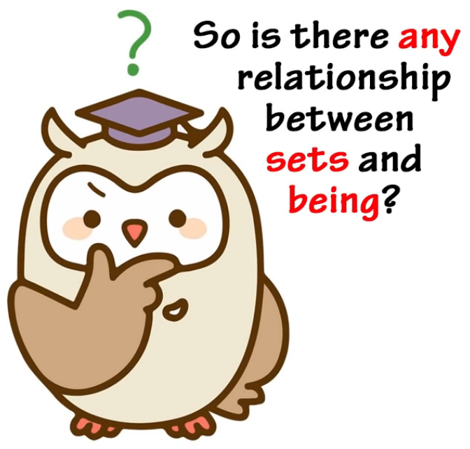

And the answer to that is absolutely yes.

And the reasons for this lie in the human perception of ontology,

that's to say, the science or philosophy of being itself.

Humans tend to believe that the set a thing belongs to is fundamental to its being.

**And in a sense that's certainly true.**

**We define something by the set it belongs to, and its existence as the being it is,**

**as opposed to any other being, is fundamentally tied up in the set to which it belongs.**

A rose belongs to the set <code>flower</code>. Once we know that, we can guess all sorts of things about it.

We may not know exactly what it looks like, but we can say

that it probably has a stem, has petals, has leaves, grows in the earth, etc. etc.

**So the set something belongs to is crucial to its existence**

**as that particular being and not another being.**

---

**But understanding that the state of being and the set to which something is attributed**

**are related semantically doesn't mean that we ought to confuse the two.**

When we say <code>I **am** an American</code>, **we do not mean the same thing by <code>am</code>**

as we do when we say <code>I think, therefore I **am**.</code>

**If we believe that the Japanese copula, which is expressed by <code>だ</code> or <code>です</code>,**

**and the state of being, which is expressed by <code>いる</code> or <code>ある</code>, are in fact the same,**

**we've simply lost a fundamentally important distinction in Japanese.**

Of course, Tae Kim-sensei doesn't believe that, but at the same time

he has great difficulty in clarifying what the distinction is,

and that's how we can end up thinking that <code>だ</code> and <code>です</code> are not the same thing.

**There are a few cases where <code>だ</code> can be dropped, sometimes grammatically,**

**sometimes ungrammatically, which do not apply to <code>です</code>**, that's true,

**but they don't affect the fact that they're both the copula.**

## One case of です not functioning as a copula

**There's one case where <code>です</code> is used where it doesn't function as a copula,**

**and that is the case of adjectives.**

As I demonstrated in that previous video *(Lesson 78)*,

**adjectives are the one case where <code>です</code> is used and it's not the copula,**

**it's just an empty formality** *(politeness)* **marker.**

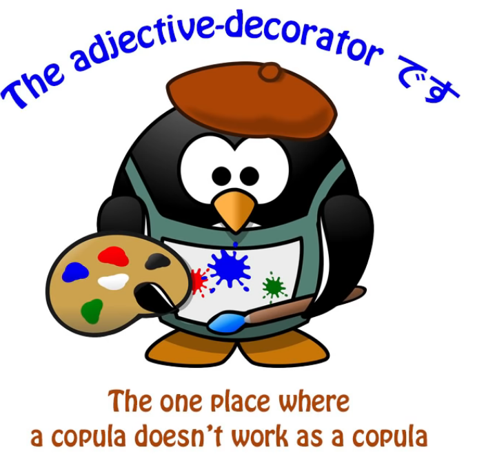

### です in adjectives is not just a random politeness marker

But there's another point that we have to consider here, and that is that while in those cases --

that's to say, **in the case of adjectives and no other case**

(it only happens in the case of adjectives as I demonstrated in that video) --

**while in the case of adjectives it's true to say that <code>です</code> is an empty formality marker,**

**it's not just a random empty formality marker.**

***Like I mentioned earlier, です / ます are rather politeness markers, not formality markers.***

***They are part of the 丁寧語 (polite language). So it is more accurate to call them polite instead.***

As we know, **there are only two kind of sentences, A-is-B sentences and A-does-B sentences**,

and **in Japanese there are two kinds of A-is-B sentences**,

that is, **adjective sentences**, **that in their simple form have to end in -い**,

and **copular sentences**, which have to **end in <code>だ</code> or <code>です</code>.

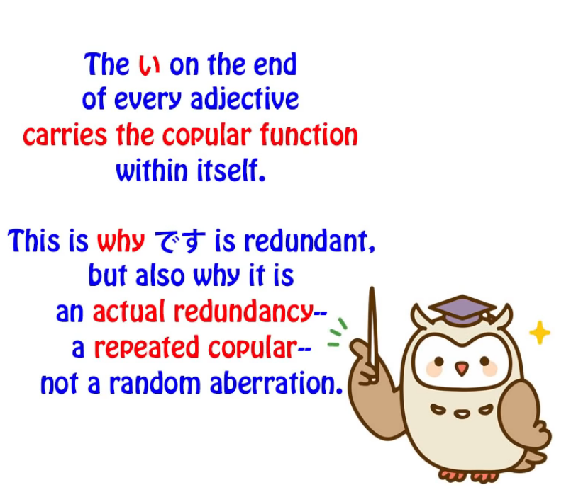

::: info
 JUST IN CASE, [**this**](https://japanese.stackexchange.com/questions/43244/why-cant-%e3%81%a0-be-used-after-an-i-adjective/43246#43246) and [**this**](https://japanese.stackexchange.com/a/97338), it may be beneficial not to mistake the -い to be a copula proper like だ, but rather a predicative suffix for ADJECTIVES that can end a sentence in itself.  
It shows “X is / = this adjectival quality”, e.g. likely why it carries the copular function in itself.  
This is also why だ is not used with it since it is redundant as the -い already basically implies it.  
Dolly explains it that way - carrying a copular function within itself & likely why だ isn’t used.

But there are different stances you can check by searching on this issue, some refer to -い as “sort of a copula”, others don’t, some even question whether Japanese has adjectives at all.  
But overall it does not entirely matter how it is called, what matters is that you understand how it works in the language & how it is used properly. As [**not all words ending in -い are an adjective**](https://jisho.org/search/%E6%B4%97%E3%81%84) automatically, since there may be a hidden Kanji form etc. Although in 98% it is an adjective.*

Basically, Dolly is there to give you the basics, if you go into the depths, things are rarely straightforward & universal. Language is a very complex construct & doesn’t quite work like that.  
E.g. why there are so many ways to study it, interpret it & explain it. Choose what works for you.
:::

**So what's happening when we put <code>です</code> at the end of an adjective sentence**

**is that we're doubling the copular.**

Saying <code>さくらは**かわいい**です</code> is like saying <code>*(Speaking of)* Sakura *(she)* **is-cute** is</code>.

Saying <code>ペンが**赤い**です</code> is essentially saying <code>Pen **is-red** is</code>.

We're doubling that copular.

**So while <code>です</code> is an empty formality marker, it's not just a random formality marker.**

It's doing something that is sometimes done in languages, and that is,

*(it is)* **acting as a redundancy** -- **saying the same thing twice.**

::: info
 I understand that since it’s a redundancy, we may say that it’s not a copular that is strictly used to fulfill the copular function of the clause or sentence, but rather its main focus is that it provides this politeness aspect to the copular in -い so as to show the sentence is polite.
 :::

*It is still a copula by all means, but since -い has a similar function, it mainly shows politeness.*

**And that's the only actual case where <code>です</code> does something different from <code>だ</code>.**

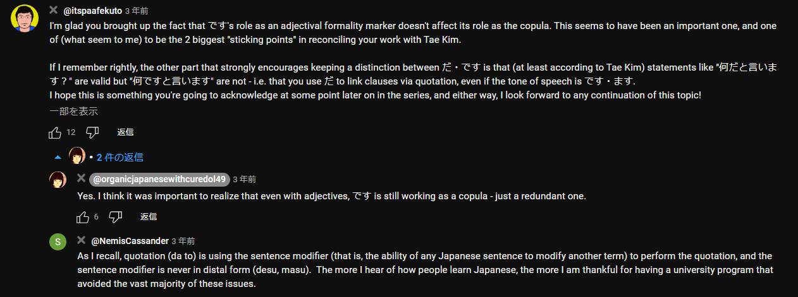

::: tip
 Recommend reading the comments [**under the video**](https://www.youtube.com/watch?v=euHYPcMoao4&list=PLg9uYxuZf8x_A-vcqqyOFZu06WlhnypWj&index=82&ab_channel=OrganicJapanesewithCureDolly) as usual. Zoom-in if anything.
 :::
