# **8. The に and へ particles**

[**Lesson 8: Location, purpose and transformation - keys to the ni particle and he particle**](https://www.youtube.com/watch?v=uqlQYrE2oFM&list=PLg9uYxuZf8x_A-vcqqyOFZu06WlhnypWj&index=9)

## The に Particle

こんにちは。

Today we are going to talk about the particle <code>に</code>, and in doing so we are going to level up. What do I mean by that? In the past seven lessons we've learned quite a lot of basic Japanese structure. We can say quite a lot of things now if we have the vocabulary. But everything we can say is very, very concrete.

We can talk about doing things and being things, which of course is the core of every sentence. But we also need to have some more sophisticated concepts at our disposal. Things like purpose and intention and transformation. So today we're going to look at uses of the に-particle, some of which are very concrete still and some of which begin to take us into those more sophisticated areas.

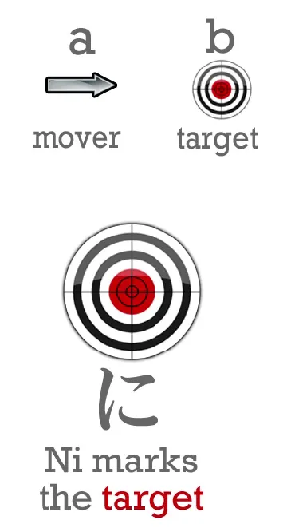

Now, we've already looked at the に-particle, haven't we? And **we know that in a logical sentence it marks the ultimate target of an action.** So <code>(zeroが)さくらにボールをなげた</code> means <code>I threw the ball at Sakura</code>.

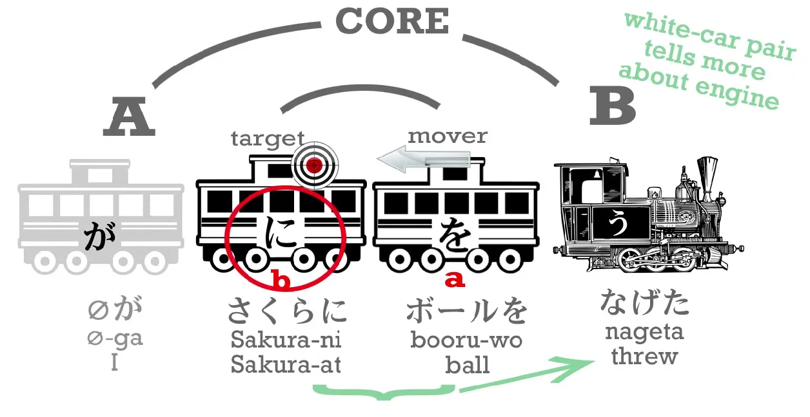

The ball is marked by を because it's the thing I actually threw. I am marked by が whether you can see me or not, because I am the one who did the action of throwing. **But Sakura is marked by に because she is the target of that action, in this case very literally.**

Now, **the に-particle nearly always marks a target of one kind or another. So, if we are going somewhere or sending something somewhere or putting something somewhere, we use に for that <code>somewhere</code>. So if A is going to B, then B is marked by に. B is the destination, the target of that going.**

So if I'm going to the park, I say <code>(zeroが)こうえんにいく</code>.

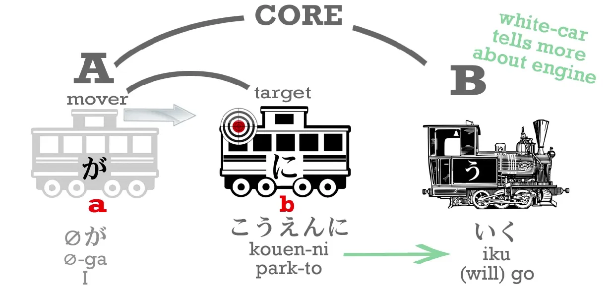

If I'm going to the shops, I say <code>(zeroが)おみせにいく</code>.

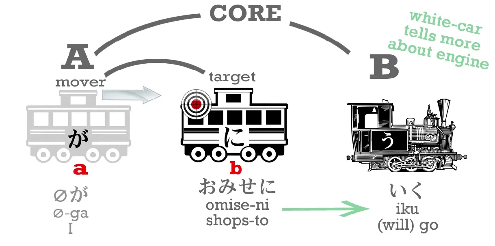

**So the literal, physical destination or target of movement is marked by に. However, we can also mark a subtler kind of target.**

So we can say <code>(zeroが)おみせにたまごを**かいに**いく</code>. This means <code>I go to the shops **to buy** eggs</code>.

<code>おみせ</code> is <code>shop/s</code> – <code>shop</code> is <code>みせ</code> and we put the honorific <code>お</code> on it because we give honor to the people who help us to have all the lovely things that we are lucky enough to have. <code>たまご</code> are eggs – you might, if you're old enough, remember たまごっち/Tamagotchi, the little egg-person that you raise.

**And <code>かい</code> is the い-stem of <code>かう</code> – to buy.** The い-stem is a very special stem and it can do lots of things, **and it can also just be there on its own.**

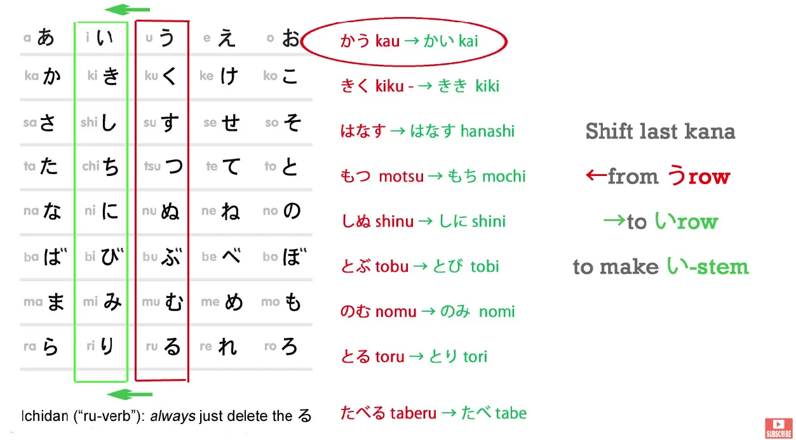

<code>かいにいく</code> means <code>[go] in order to buy, for the purpose of buying</code>.

---

Now, you may be saying, <code>I thought that logical particles like に and が and を can only mark nouns</code> – and that's absolutely correct. Because **one of the things that the い-stem of a verb can do when it's on its own is turn that verb into the equivalent noun.**

::: info
Refer to Lesson 7.5, the い-stem, converting verbs
:::

(It can do something else as well, but I can talk about that another day.)

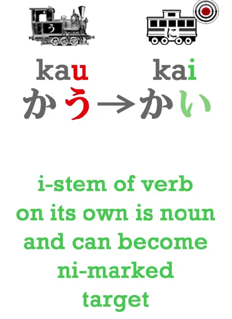

So **<code>かい</code>, the act of buying, is a noun.** Just as in English if we say <code>I like swimming</code>, <code>swimming</code> is a noun, swimming is a thing I like, and if we say <code>I go to the shop for the purpose of buying eggs</code>, then that <code>buying</code> is also a noun, it's the thing we're going for. And <code>かい</code> is just like that.

---

**So <code>かい</code> is the thing we're going to do and it's a noun and it's marked by に.** So, you see that in this sentence we have two targets:

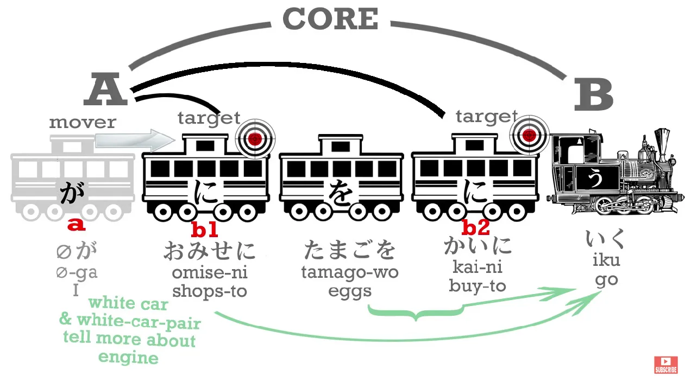

the shops – <code>おみせ</code> – is the actual physical target of our going, the place, **and buying eggs is the reason for our going, so that's the emotional target, the volitional target, a more subtle kind of target** than the physical place we're going to, but still a target. **And it's possible to have two targets in the same sentence, both marked by に.** And that's exactly what we're doing here.

**So に gives us the target of an action in the most literal sense and also the volitional target, the actual aim of our action.**

Now, to get back to more concrete things, **に which marks the actual location target of where we're going, of where we're putting something, can also mark the place where a person or a thing IS.**

So I can say, <code>おみせにいく</code> – <code>I am going to the shops / I will go to the shops</code> – and we can say, <code>おみせにいる</code> – <code>I am at the shops</code>.

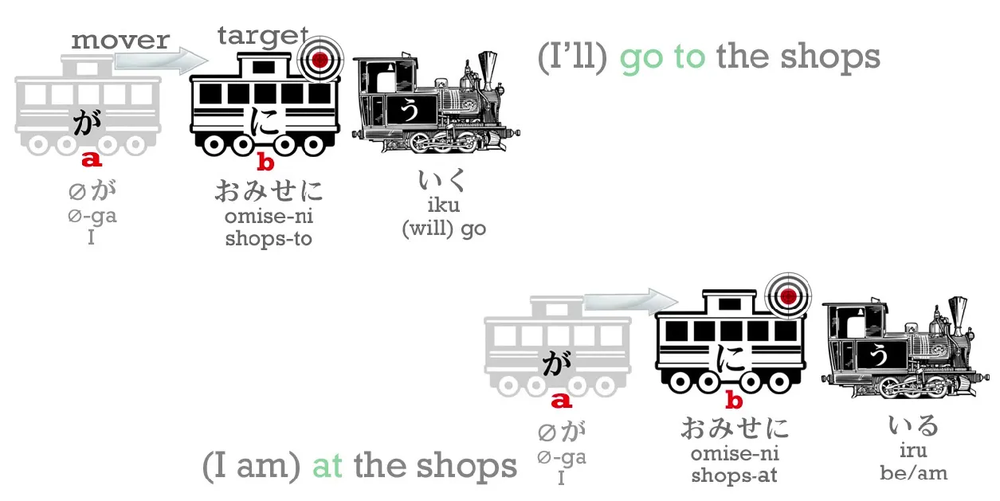

<code>こうえんにいく</code> – <code>I'll go to the park</code>; <code>こうえんにいる</code> -<code>I'm at the park</code>.

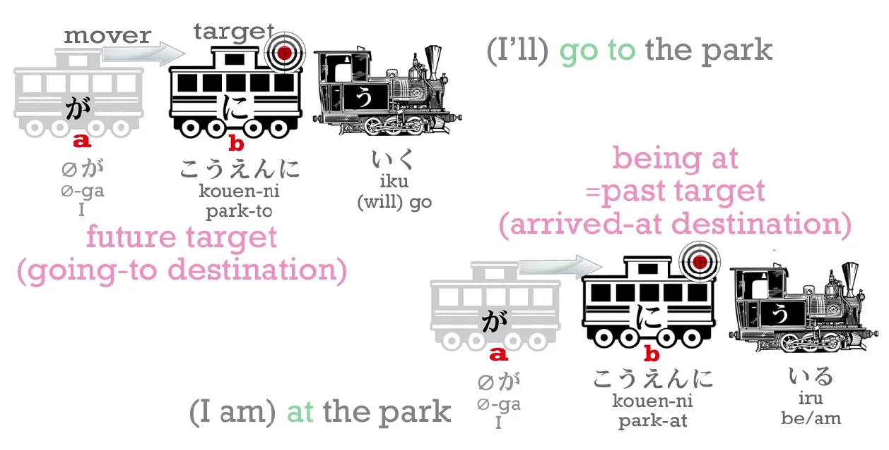

Now you see, **this is also a target, because in order for a thing to be anywhere, it must have gotten there at some point. So <code>に</code> can mark not only a future target, a place where I will go to, it can also mark a past target, a place where I went and where I still am.**

---

And **we also use this for inanimate objects**: <code>ほんはテーブルのうえにある</code> – <code>The book is on the table</code>. <code>うえ</code> is a noun, and in this case it means the <code>on</code> of the table. <code>うえ</code> can mean <code>up</code> or <code>over</code>, in this case it means <code>on</code>, and **it's always a noun**, so in this case the <code>on of the table</code> is the place where the book is:

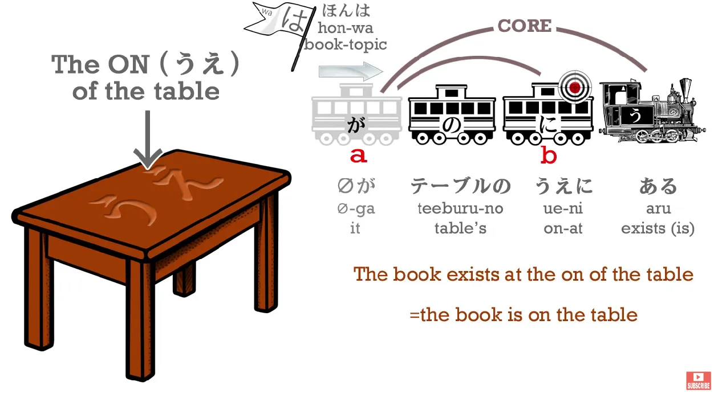

**the past target of the book, to which it went and at which it now remains**. **So に can also mark the place where a thing is, its past target.**

### に marking the target of a transformation

And the last aspect of <code>に</code> that I want to look at is that **に can also mark the target of a transformation.**

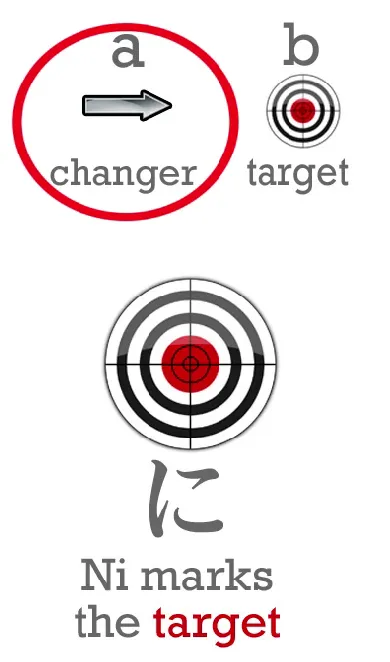

Just as if A is going to B, に marks B, the place where it's going, **if A turns into B, becomes B, then に also marks B**, the thing it's becoming, the thing it turns into.

So if I say, <code>さくらはかえるになった</code>... <code>かえる</code> is <code>frog</code> and <code>なる</code> is a close cousin of <code>ある</code>: <code>ある</code> means <code>be</code>; <code>なる</code> means <code>become</code>.

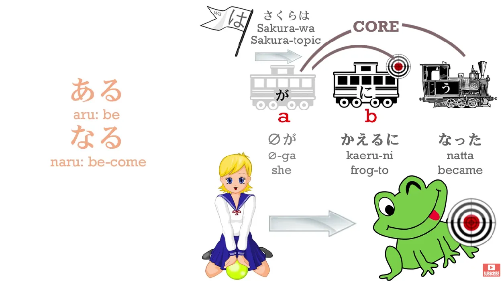

So, <code>さくらはかえるになった</code> – <code>Sakura became a frog / Sakura turned into a frog</code>, **and に marks the thing she became, the thing she turned into.**

Now, you may be thinking, <code>Mmm, how often do people turn into frogs these days?</code> – and I'll grant that it isn't very often. However, **this is a very important thing to learn because there are various more everyday things that turn into other things and also we use this form of expression much more in Japanese than we do in English.**

---

For example, <code>ことし(zeroが)十八さいになる</code>: <code>ことし</code> is <code>this year</code>, <code>十八さい/じゅうはっさい</code> is <code>18 years of age</code>. So we're saying, <code>This year (I) become 18</code>. *Or as given: <code>This year (I) 18 years old-to become</code>.*

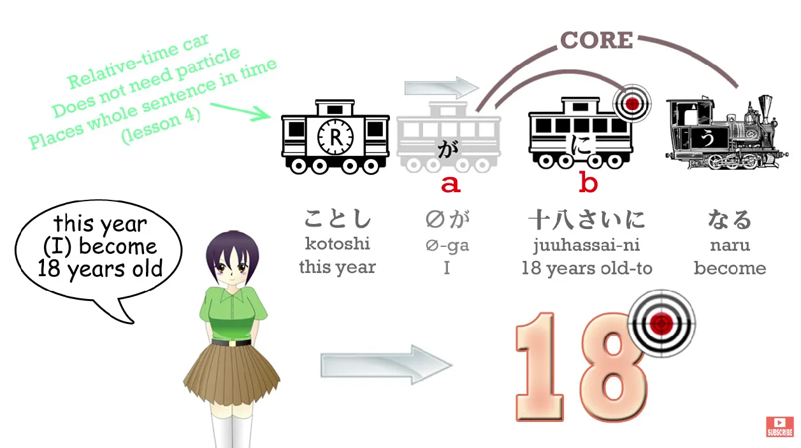

Now in English we'd say that a little differently: we might say, <code>I turn 18</code> or <code>I'll be 18</code>, but in Japanese we say <code>I will become 18 years of age</code>.

And if the day's going to get cloudy, we might say <code>あとで(zeroが)くもりになる</code> (<code>くもり</code> is <code>cloudy</code>; <code>くも</code> is a cloud, <code>くもり</code> is the state of being cloudy, and both of them are nouns).

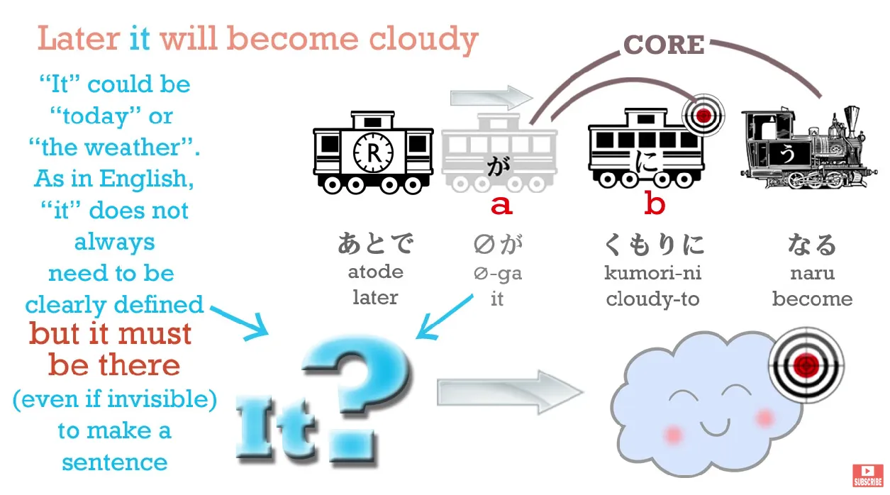

We say, <code>くもりになる</code> which means <code>become cloudy</code>. *Or as given: <code>Cloudy-to become</code>.* In English we could say that. We might be more likely to say <code>get cloudy</code> or something, but in Japanese we use this <code>become</code> – <code>になる</code> – form of speech a lot of the time. So it's an important thing to learn.

### に in the case of adjectives (aka using them as adverbs)

**And I should just add here than in the case of an adjective it works slightly differently.** So if we want to say <code>Sakura is beautiful</code>, we say <code>さくらがうつくしい</code> (<code>うつくしい</code> means <code>is-beautiful</code>), but if we want to say <code>Sakura became beautiful</code>, **we can't use に because <code>うつくしい</code> isn't a noun.** It isn't a carriage, **it's an engine**, isn't it?

::: info
うつくしい is an adjectival/い-engine.
:::

So what do we do?

What we do is what we discussed last week: **we turn that adjective into its stem.** So **we take off the い (-i) and add く(-ku).**

::: info
The stem is うつくし, and then add く.
:::

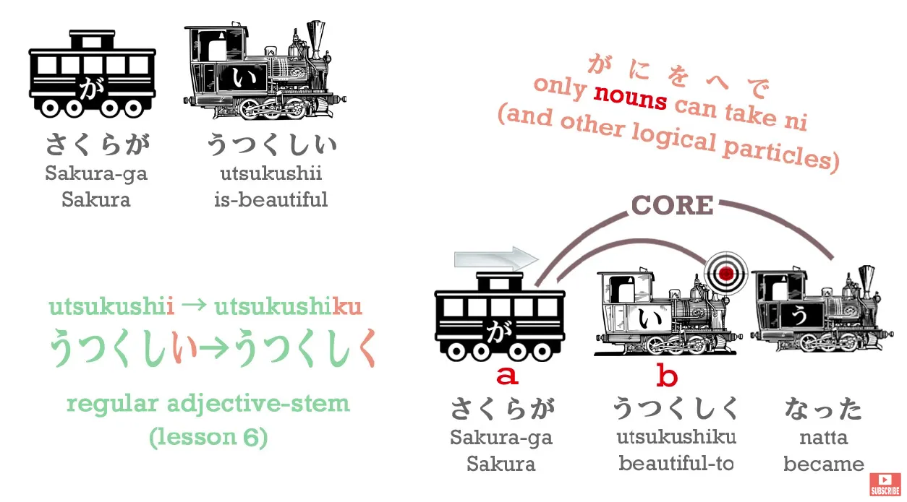  

::: info
the く is turning うつくしい into an adverb/adverbial noun. More on that in Lesson 41.

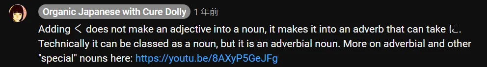
:::

And that's all we need to do. That's how we use it: <code>さくらがうつくしくなった</code> – <code>Sakura became beautiful</code>.

<code>なった</code> is the past of <code>なる</code> because <code>なる</code> is a godan verb (it has to be a godan verb because it doesn't end in -いる or -える, it ends in -ある).

So now we know some ways of expressing subtler concepts like intention, purpose, transformation – and we have leveled up.

## The へ Particle

Before we finish, I'm just going to give you one more carriage that we haven't seen before, and that's the へ-car. And this is very, very simple. The particle <code>へ</code> – as you see, this is the kana へ (he), but when we use it as a particle we just pronounce it え. And it's a very simple particle. It's a one-trick pony. And it duplicates one, and only one, of the uses of <code>に</code>.

So when we say where we're going - <code>A is going to B</code> – we mark B with に. **We can also mark it with へ.**

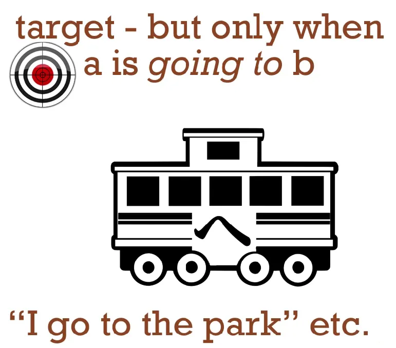

**And that's the only thing へ does.** As I say, it's a one-trick pony. **It can't even mark the place where something has gone to and still is. It only ever marks the place a thing is going to.**

::: info
a direction, more on that in 8b.
:::

<code>へ</code> is very simple and it's good to have another particle, another carriage, added to your arsenal, isn't it?