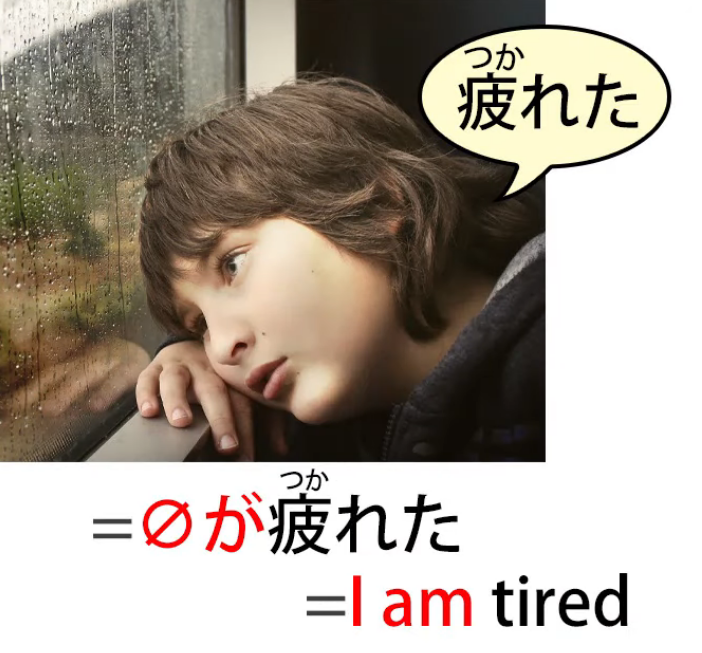
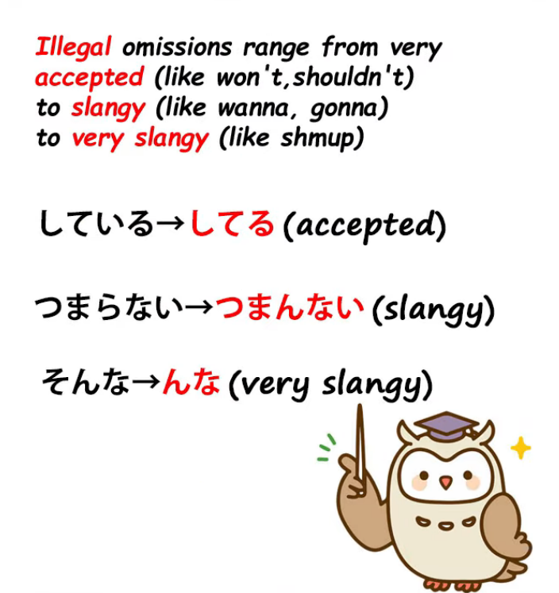
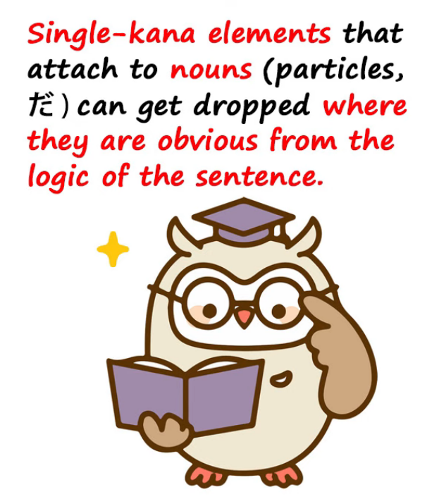
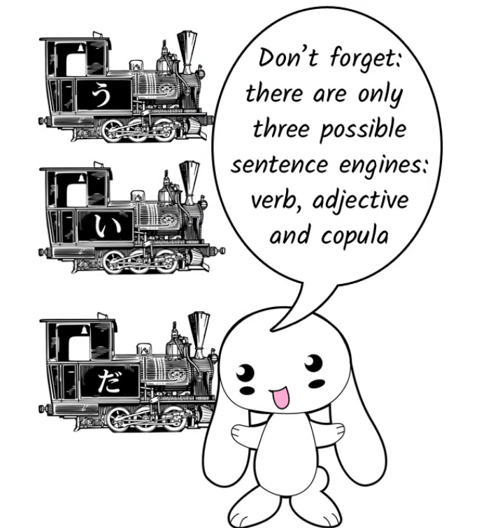
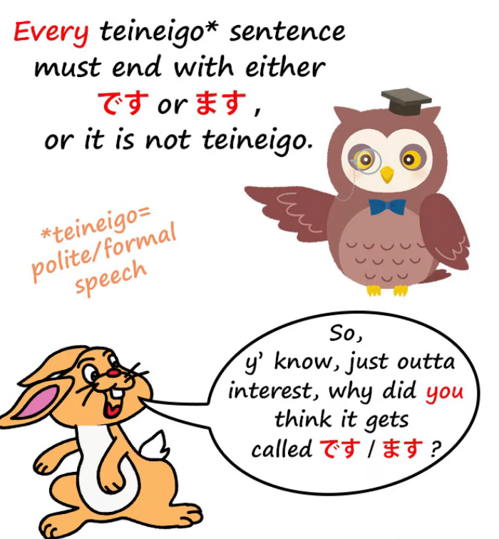
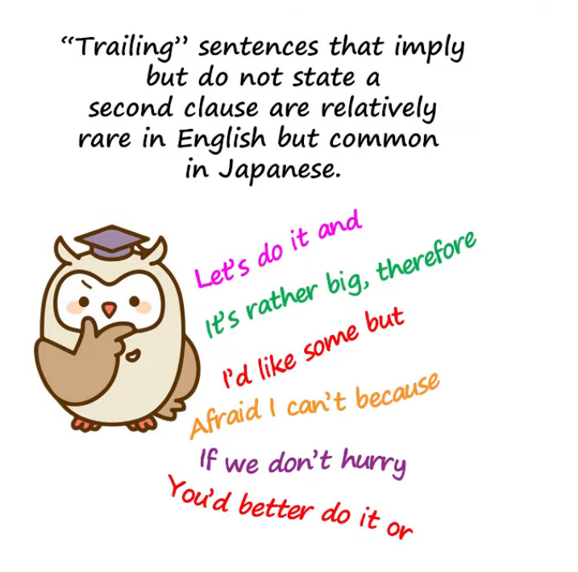

# **80. Dropped particles & casual omissions** 

[**Understand Japanese Even When they Leave Bits Out! Dropped particles & casual omissions | Lesson 80**](https://www.youtube.com/watch?v=wamt3AAJI6M&list=PLg9uYxuZf8x_A-vcqqyOFZu06WlhnypWj&index=82&ab_channel=OrganicJapanesewithCureDolly)

こんにちは。

Once we start seriously immersing in

and consuming actual Japanese material,

often colloquial and casual, not textbook Japanese,

one of the problems that many people encounter is the idea that --  
"Good heavens, they leave out half of what they're going to say!

They're omitting this and leaving out that,

and how are we supposed to guess what they're actually talking about?"

Now, this isn't nearly as much of a problem as it can seem at first,

but we need to know what's going on and what to look for.

So, **first of all let's talk about omission in language.**

**There are fundamentally two kinds of omission in language:**

**legal omission and illegal omission.**

## Legal Omission

**Legal omission is when it's perfectly grammatical**

**within the terms of a particular language to leave something out.**

This happens in English.

For example, if we say in English <code>The night we met</code>,

that's considered a grammatical phrase.

What we actually mean is <code>The night **that** we met</code>.

And **in French or Spanish you can't do that.**

**You can't leave out that <code>that</code>, which is <code>que</code> in French or Spanish.**

**But in English you can.**

In English it's part of the rules of English grammar that

that everybody's going to understand what you mean

and you're allowed to leave it out.

**You can do it in an academic paper or a legal document.**

**You can do it anywhere. It's not ungrammatical.**

It's not an illegal omission. **It's a legal omission.**

### The zero pronoun

Now, this happens **in Japanese**, and

**a very, very common example**, of course, **is the zero pronoun.**

If we say <code> *(zeroが)* 疲れた</code>, which is <code>tired</code>, **we mean <code>I am tired</code>**,

and **this is a hundred percent legal, grammatical Japanese.**

**You can use it in an academic essay or a legal document or anywhere.**

**It's understood as perfectly grammatical Japanese.**

**There's no question about what you mean by it.**

Firstly because **the zero pronoun always defaults to <code>I</code>**

and secondly because Japanese, as we know, is very strict in saying

that we can only talk about things we are actually capable of knowing.

So we can't talk about someone else's state of emotions.

**We can't talk about someone else liking or disliking something.**

**We can only say that they appear to like or dislike it.**

**And we can't say that someone else is tired.**

So <code>疲れた</code> can only mean <code>**zeroが**疲れた/ **私が**疲れた</code>.

So **this is a legal omission.**

## Illegal omission

But there's also a lot of illegal omission that goes on in all languages,

and **in casual speech** as opposed to very formal speech **it's completely legal**.

So **strictly speaking it's illegal, but in terms of ordinary, everyday, casual speech, it's legal.**

So what kinds of accepted but strictly illegal omission are there?

Fundamentally, three kinds.

### Leaving out bits of words or phrases

The first is when we leave out bits of words or phrases.

So, for example, instead of <code>している</code> (am doing / is doing) we say <code>してる</code>;

instead of <code>しておく</code> (do and put in place) we say <code>しとく</code>.

Now, **these are such regular illegalities that they're really no different from saying**

**<code>shouldn't</code> or <code>hadn't</code> in place of <code>should not</code> or <code>had not</code> in English.**

**You can use them almost anywhere, but not in the most formal circumstances.**

A little bit further down the scale, we have things like saying

<code>分かんない</code> instead of <code>分からない</code>,

or <code>つまんない</code> instead of <code>つまらない</code>.

So that's one type, and although it may take a little while to get used to the expressions,

once you know them they're no more difficult than anything else.

---

**The other thing that gets left out a lot is anything that attaches to a noun.**

As I've said before, **Japanese is a very noun-centered language.**

And, as you know *(Lesson 8b)*, **nouns always have something stuck to them**:

**a logical particle to tell us what role they play in the sentence**,

**sometimes a non-logical particle, and sometimes a copula**.

Now, **just about all of these can be dropped at some time.**

**If it's clear without the marker what role a noun is playing in the sentence**,

**we can in casual speech**, not in formal speech, but in casual speech,

**we can leave off that marker.**

---

**The markers that get left off most often are**

**が, を**, and **the non-logical topic marker は**, and also **the copula <code>だ</code>.**

So, for example, if I say <code>私アンドロイド</code>,

**I've left off what would probably have been a は after my name.**

**I've also left off <code>だ</code> after <code>アンドロイド</code>**.

Now, if you know that I'm introducing myself or saying something about myself,

there's no doubt about what's going on here.

And... I don't want to go back too much to the subject of Tae Kim-sensei,

I've done a three-part series about the things Tae Kim-sensei teaches

that he actually shouldn't be teaching, and I'll link to that *(Lessons 77, 78, 79)*,

but what I will do here is make a point that I didn't make there

**which is that Tae Kim-sensei says that because <code>だ</code> is often dropped and <code>です</code> is not dropped,**

*(according to him)* they're not really the same thing, they're not both the copula.

### Why だ is often dropped and です isn’t

And I've dealt with this at length and I've explained what a mess it makes of Japanese

if you ignore the copula, so I won't go over that again.

But the point I do want to make here is that

the reason that <code>だ</code> can be dropped in places where <code>です</code> can't are twofold.

First of all, **why can <code>だ</code> be dropped as often as it is?**

Well, if the textbooks taught us the basic structure of Japanese,

it would be obvious, but of course they don't.

**The most basic thing about Japanese structure is that a Japanese sentence can only end in one of three ways.**

And I think you know what those three ways are, don't you? Let's say it together.

**A Japanese sentence can only end with a verb, an adjective, or a noun-plus-copula.**

Now, once we know that, we know why the copula can get left off very easily.

**As I said before, particles and the copula get left off**

**where it's obvious what the nouns were without marking them.** That's when they get left off.

---

Now, **if a noun comes at the end of the sentence, we know that it's not a verb sentence.**

**We know that it's not an adjective sentence.**

**We know that it's a noun-plus-copula sentence.**

And **since we know that, we can, if we want to, drop the copula.**

And this, I think, is why Tae Kim-sensei gets lured into saying that <code>だ</code> is a declarative,

a sort of verbal exclamation mark.

What he's saying is that people use <code>だ</code> when they want to stress what they're saying.

Well, **there's a certain amount of truth in that because the fact is**

**that you can in casual speech always drop the copula and still be understood,**

**so if you're speaking at the kind of casual level where you probably would be dropping it,**

**then when you include it is when you want to stress what you're saying.**

---

**It's not really as simple as that, because a lot of people don't drop it,**

**not everybody drops it all the time.** It's a bit more complex than that,

**but the idea that it is a declarative at least has that grain of truth in it**

**that because you can drop it pretty much whenever you want to in casual speech,**

**you often include it because you want to stress it.**

So if it's easy to drop the copula when it's <code>だ</code>,

**why isn't it easy to drop it when it's <code>です</code>?**

Tae Kim-sensei turns this into a whole argument

for the fact that <code>だ</code> and <code>です</code> are two different things,

but if you think about it it's perfectly obvious why <code>だ</code> does get dropped

(I've explained that already) and why <code>です</code> doesn't.

**<code>です</code> doesn't get dropped because it's formal speech.**

**In the first place, we drop less in formal speech.**

We don't drop as many things in a formal sentence as we do in an informal sentence.

**But even if we're speaking formal speech at a loose level,**

**where we can be dropping things out of the sentence,**

**we won't drop the <code>です</code>.**

Why not?

Because there's only one thing that makes 丁寧語 (です/ます level speech) into 丁寧語,

**and that's the fact that we add the <code>ます</code> helper verb to the end of verb sentences**

**and the <code>です</code> copula to the end of noun-plus-copula sentences**

**and even, redundantly, to the end of adjective sentences.**

**So you can't, in 丁寧語, drop the <code>です</code> without dropping the 丁寧語.**

It's as simple as that.

---

Now, **there are various rules about when you can and can't**

**drop things like を out of a casual sentence.**

::: info
Obviously it’s a joke…just in case (ノ\*°▽°\*)
:::
**You can in theory drop something whenever it isn't needed.**

**In practice there are places where it seems natural**

**and other places where it doesn't seem natural.**

If you want to know the rules for it, sometimes they're very complex

and even when they're very complex they don't necessarily work all the time.

But you don't need to know that.

Why don't you need to know it?

Well, let's think about this.

**You need to know that they can be dropped and you need to know that**

**they're dropped in places where you can actually work out what they were going to be.**

Once you know that, you're not swimming in an ocean of strange vagueness

where things get dropped and you've no idea what they are.

**What you don't need is to be able to reproduce very casual Japanese**

**in exactly the way that Japanese people do it.**

And **that's the only reason you'd need to learn these strange lists of rules.**

If you just use all the particles all the time, occasionally,

especially when you're speaking casual Japanese,

your Japanese will sound a bit stilted.

Well, what about that?

**Language spoken by foreigners usually does sound a little bit stilted, doesn't it?**

You've probably noticed that in English.

**If you're going to be using Japanese a lot, gradually, bit by bit,**

**you'll get used to the places where you can naturally drop things.**

**If you're not going to be using Japanese a lot,**

**why do you want to sit down and learn a bunch of rules**

**in order that you can pretend that you've naturally acquired Japanese**

**when not only haven't you, but you've no intention of doing so?**

---

**So my advice to you is <code>Learn Japanese naturally</code>.**

**Don't try to memorize sets of rules when all they could possibly do is make you seem**

**as if you're more used to Japanese than you actually are.**

**But in practice they're not even going to do that, because you will make mistakes.**

**The important thing to understand is how things get dropped in Japanese,**

**why they get dropped in Japanese, and**

**how to understand them when they have been dropped.**

::: info
Great advice indeed, Dolly (o≧▽゜)o
:::
### Dropping entire clauses

The other kind of thing that gets dropped,

the third category of things that get dropped, are essentially entire clauses.

**People often end a sentence with a て-form**

**or a <code>because</code> or a <code>but</code> kind of ending.**

---

And **what they're doing on these occasions is leading**

**into a second clause that would add some more information**

**but they're not stating that clause.**

And that can serve a variety of purposes.

**It can hint at something they don't want to say.**

**It can hint at something that they think is too obvious to need to be said.**

**Or it can be used just to soften the thing you're saying right now**

**or perhaps to strengthen it a bit.**

I've talked about this in other places and I'll link to the places where I've done that *(Lesson 63)*.

But these are the fundamental principles of omission in Japanese,

and once you know them, the whole thing becomes much less puzzling.
