# **81. Global principle of all Japanese word-forms.** 

[**At last! The TOTAL structure of Japanese! Global principle of all Japanese word-forms. Lesson 81**](https://www.youtube.com/watch?v=uoj5l8-Ppws&list=PLg9uYxuZf8x_A-vcqqyOFZu06WlhnypWj&ab_channel=OrganicJapanesewithCureDolly)

こんにちは。

Today we're going to talk about something we've never talked about before,

which is the overall, global, cosmic structure of Japanese.

We've touched on it in the past, but I've never talked before about its totality.

And there's a reason I didn't do that, which we'll come to in a minute.

What we're going to talk about starts out with something you already know about,

which is the stem system.

If you've been following my lessons at all, you know that there is no conjugation in Japanese.

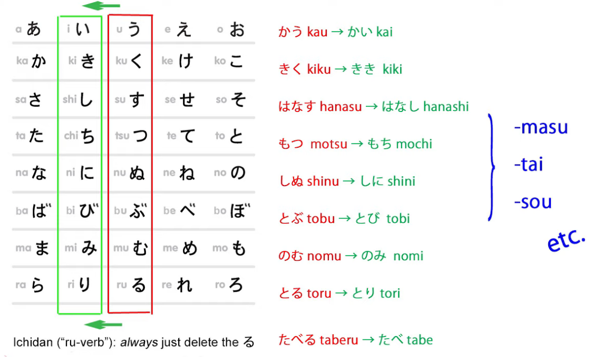

::: info
As you know, take this not as a definitive statement, it is just to dodge some associations that come from the word <code>conjugation</code> in terms of European languages, since there is a form of conjugation in Japanese, as given in the Lesson 7.5 note screenshot citation from Dolly’s book.  
***Verbs just make a small change to the one kana on the end,*
:::

**changing it from an う-row kana to one of the four other rows.**

**And then we attach various kinds of helpers, helper nouns, helper verbs, helper adjectives.**

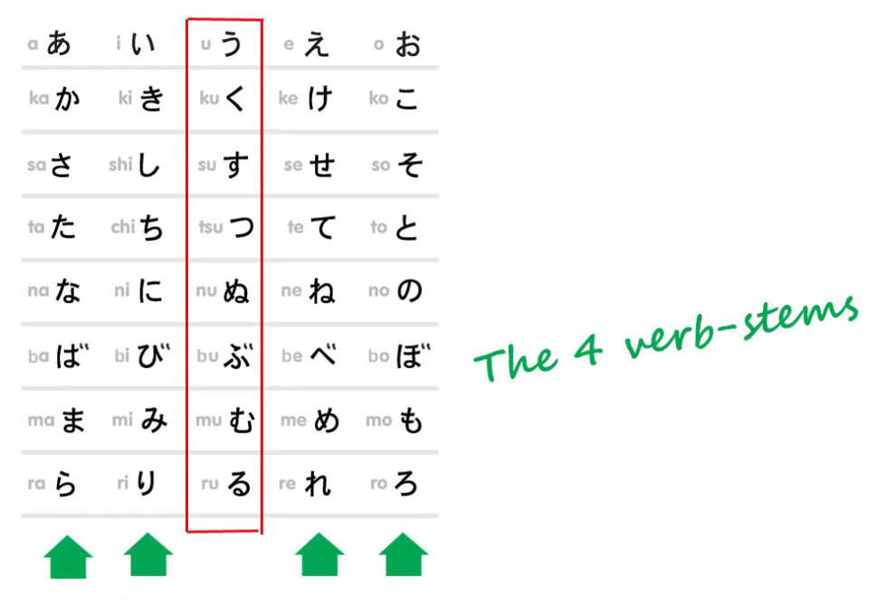

But what I didn't explain at the time I introduced this is that it goes much further than this.

I left you thinking perhaps that the て-form, as it's called, and adjectives

have some kind of a minor conjugation-thing happening

that's a bit like **European conjugation** and the stuff the textbooks teach.

This isn't true. I didn't talk about it too much at the time

because I think before you've ingested the basics properly

it could be a bit complicated-feeling and hard to take in.

But now let's look at it properly.

## Active & Static/Inert words 

As you know, **there are two kinds of word in Japanese**,

and that is, **active, changeable words and static** *(inert)* **words.**

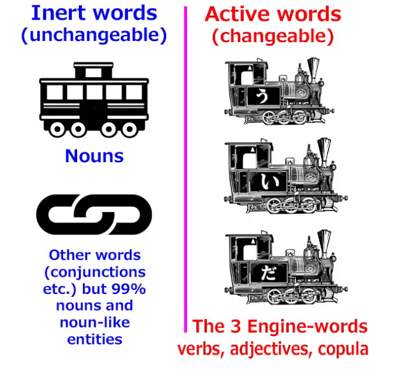

**Active, changeable words consist of the three kinds of word that can make the engine of a sentence**, that's to say, **verbs, adjectives, and the copula**.

**Static words are nearly all nouns, and they never change at all.** They can't change in any way.

---

Now, **all the words that can change change in exactly the same way**.

We have to know two things about them.

**The first is that nothing changes in the base form of a word except the last kana**.

That's the う-row kana in a verb or the い in an adjective.

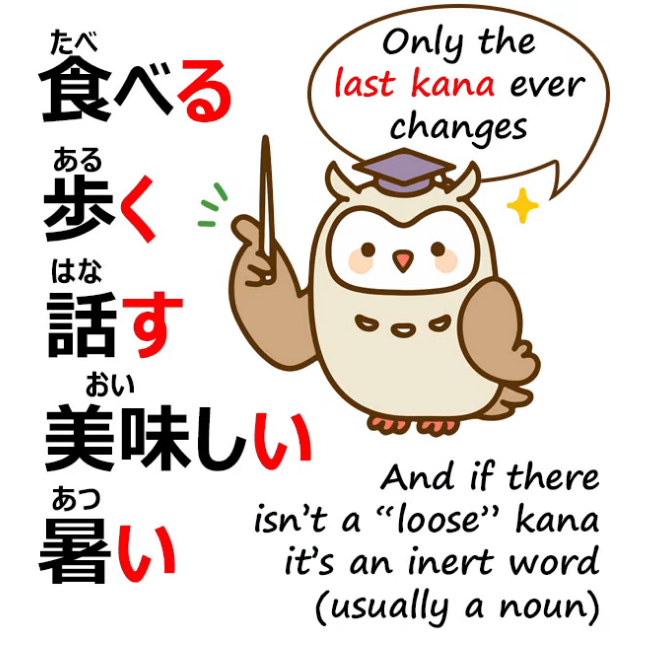

**Nothing before that can change.**

That's as fixed and settled and inert as a noun.

It's only that last kana that can ever change

**and that can then have things attached to it.**

**The second thing to know is that they all change according to the stem-helper system.**

So, although I introduced the て-form as if it was a <code>form</code>,

a kind of morphing or conjugation of the whole word,

**it is in fact a stem-helper system of its own.**

**In real Japanese grammar as taught to Japanese natives by Japanese natives,**

**-た and -て are regarded as helpers, as entities in themselves that attach to the stem of a word.**

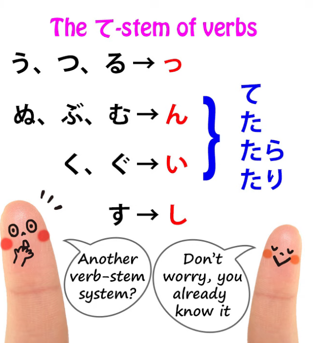

So essentially **verbs have not one stem-system, but two stem-systems.**

And that's partly why I didn't introduce it straight away, because that feels a bit overwhelming at first.

## The て-stem system

The second stem-system, that's the て-stem, you already know. We'll go over it briefly.

### う-つ-る group

**There's the う-つ-る group, and that changes the last kana, う, つ or る,**

**into a small っ, and then we can add the -た or the -て.**

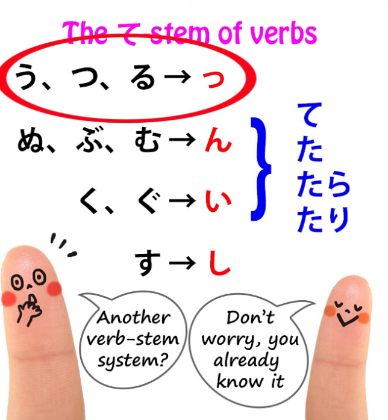

### ぬ-ぶ-む group

**There's the ぬ-ぶ-む group: this changes the last kana, ぬ, む or ぶ, into ん,**

and **the influence of the softness of those kana and of the ん itself**

**affects in a euphonic manner the -て or the -た, turning them into で or -だ.**

### く-ぐ group

**く and ぐ turn into い** -- and we're going to notice in a minute

**that this relation between い and the か-row kana, か-き-く-け-こ,**

**is something that continues to play a role in adjectives.**

We'll look at that in a minute.

**く and ぐ turn into い, and in the case of ぐ, that ten-ten 〃 on the く, that soft sound,**

**again has a euphonic effect on the -て or -た that follow it, turning them into で or -だ.**

### す <code>group</code>

**And finally, す in the て-form does exactly what it does in forming the い-stem**

**in the regular stem system: it becomes し.**

---

So, there we have the second verb-stem system, **the て-stem**, and **we use this not only for  
-て and -た, but also to add helpers like the conditional -たら and -たり.**

## The Adjective stem system

**Adjectives also have their own stem-system. Adjectives in fact have four stems.**

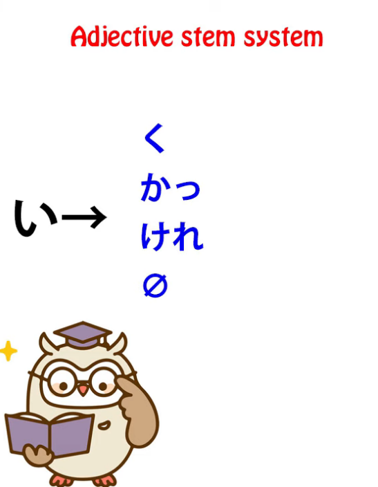

**You can form adjective stems by dropping the い, just as we drop the る in ichidan verbs,**

**or by changing that い to one of three か-row kana, か, け or く.**

---

And as we said before, **there's a relationship between か-row kana and い**,

so with the て-stem of verbs, verbs ending in く, the き turns into い, and the same with the ten-ten 〃 version, ぐ.

**So we have four stems for adjectives, dropping the い or turning it into か, け or く.**

### The く stem

**The く-stem attaches the -ない helper adjective, negativizing the adjective,**

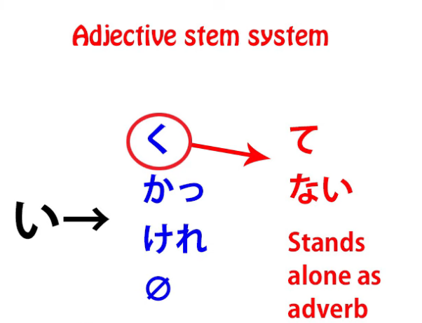

and also if it stands on its own -- and as we know, stems sometimes can stand on their own.

**So the い-stem of a verb on its own becomes a noun.**

**The え-stem on its own forms the imperative.**

**The く-stem of an adjective on its own turns the adjective into an adverb.**

So, we can say <code>早い車</code> (fast(-is) car) or <code>**速く**走る</code> (run **fast***, fast is an adverb*).

**And く is also used, of course, to make the て-form:** we just add -て to the end of the く.

### The か stem (かっ)

**The か-stem takes a small rider, which is the small っ, so it becomes かっ**

and we use that to attach the past-helper -た,  
so we say -かった: <code>おいしかった</code> (that was delicious).

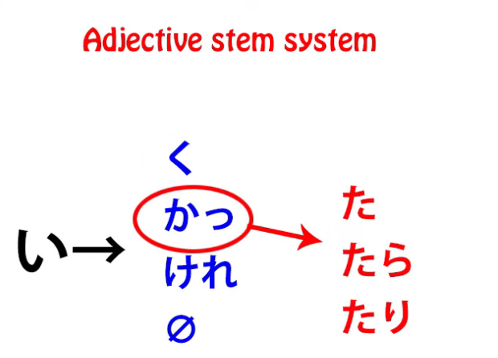

### The け stem (けれ)

**The け-stem also takes a rider, which is -れ so we have the stem -けれ,**

**and to that we attach the helper -ば, which is the conditional**

(and I made a whole set of videos on conditionals like -ば and -たら (Lessons 30, 31, 32 & 33),

and I'll put a link above and in the information section below).

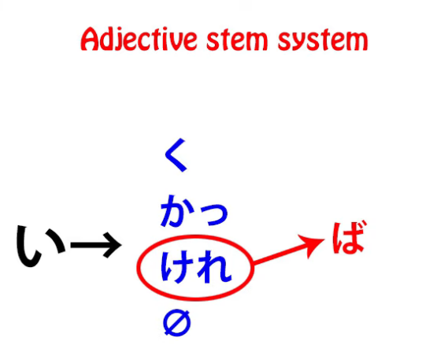

### The zero stem

**When we drop the -い altogether we can use it for attaching things like the -そう helper noun,**

**which means that something appears to have that quality,**

and **also to attach helper verbs like がる**.

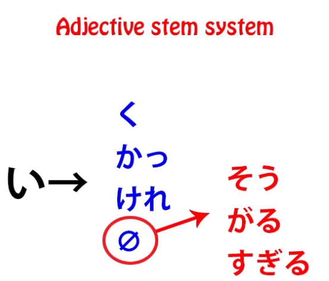

So to the stem of <code>**欲し**い</code> we can attach **がる** to make <code>**欲しがる**</code>

(**show signs of wanting something, appear to want something**).

Or to the **たい helper** we can drop that い and attach がる and get <code>**たがる**</code>

(**show signs of wanting to do something, appear to want to do something**).

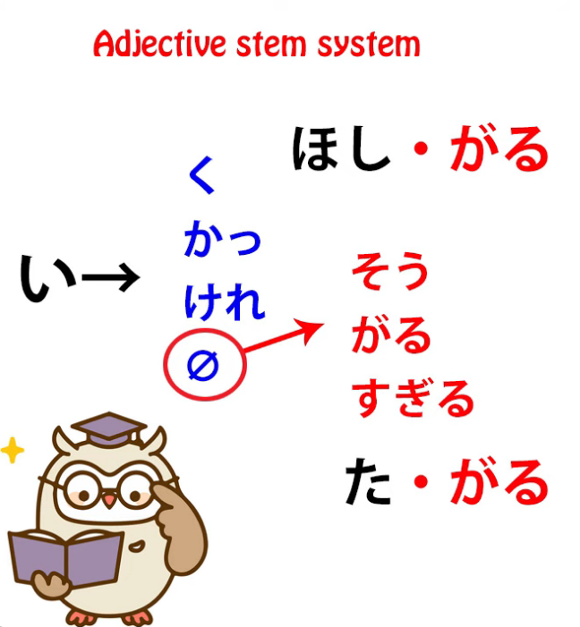

---

**So, as you see, adjectives have a stem-system of their own to which we attach a variety of helpers, like a smaller version of the one verbs have.**

## The Copula

Now, what about the copula?

That's the other dynamic element, the other engine.

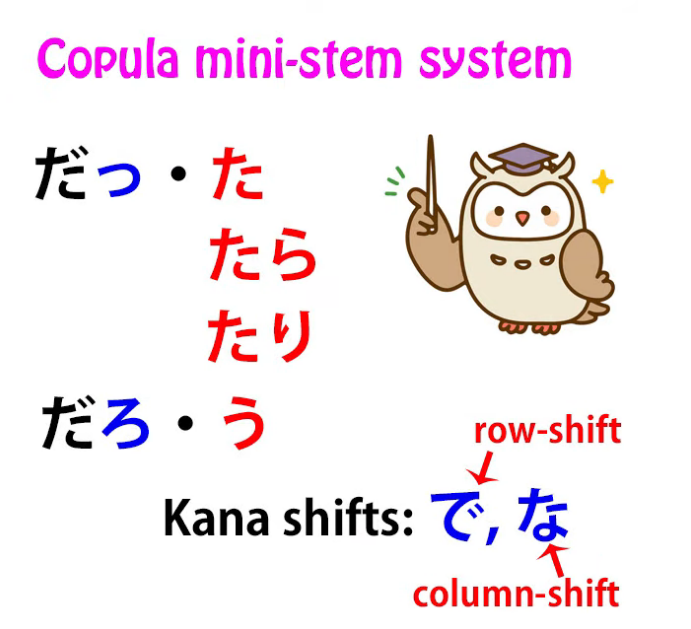

Now, the copula's only one kana *(だ in this case)* to start with,  
so generally we add something to that.

**We can add the small っ, to make the stem だ~**, *(I think by ~ here is meant っ = だっ)*

**which can then have the -た past helper added to it to make <code>だった</code>.**

We can add -ろ, so it can have the volitional helper added to make <code>だろう</code>.

**And in the て-form, the だ itself changes -- of course having only one kana, だ is the last kana --**

**and that can become <code>で</code> to make the て-form.**

It's a little bit less regular than the others, but that's really because **there is only one copula**,

so it doesn't have lots of other things in the same group for it to be regular with.

## Summary

So, that's the overall structure of Japanese.

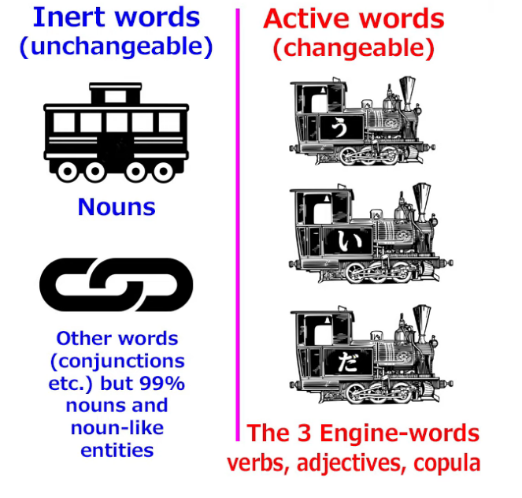

**It*/Japanese* has two kinds of words, active and passive words, transforming and inert words.**

**The inert words** **can't change in any way, but they can attach particles that tell us what they're doing.**

And fortunately, **because they never change at all, there's nothing tricky about nouns.**

**They always attach the same particle to do the same job regardless of what noun we're talking about.**

Much simpler than foreign grammatical systems.

**Active elements, verbs, adjectives and the copula, can only change that last kana**

**and they always do it according to the stem-helper system.**

When we understand that, the whole thing becomes a great deal easier to conceptualize and deal with.  
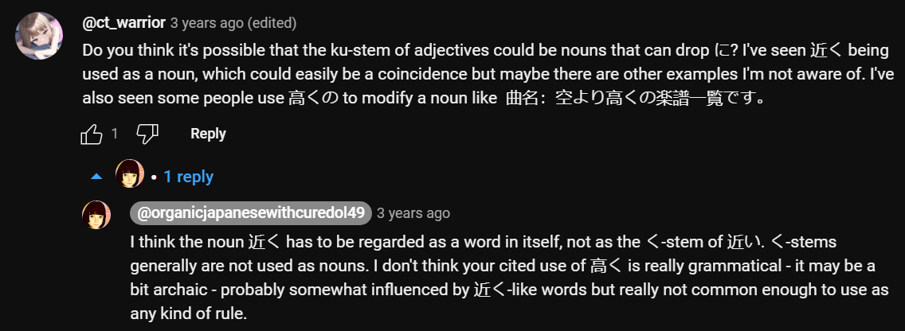
