# **82. なんて、なんか、など: 3 Common words clarified.**

[**なんて Nante なんか Nanka など Nado: 3 Common words clarified. Lesson 82**](https://www.youtube.com/watch?v=OlUG9ym-b4Y&list=PLg9uYxuZf8x_A-vcqqyOFZu06WlhnypWj&ab_channel=OrganicJapanesewithCureDolly)

こんにちは。

Today we're going to talk about three words that you'll encounter often in your immersion.

**They have quite a wide meaning spectrum, and that means that**

**dictionaries can't really cover the full range of what they mean,**

especially when, as they often are, they're used in very colloquial ways.

And I'd like to thank all the people who tell me which words give them trouble in immersion.

This helps me to know what to cover and in what order to cover it.

A lot of people wanted to know about <code>なんて</code> and <code>なんか</code>.

So if you have words that are giving you trouble, please pop them in the Comments below.

It's very helpful to know what it is that's causing problems.

**So, the three words are <code>など</code>, <code>なんて</code> and <code>なんか</code>.**

**They have different meanings but they overlap in certain areas.**

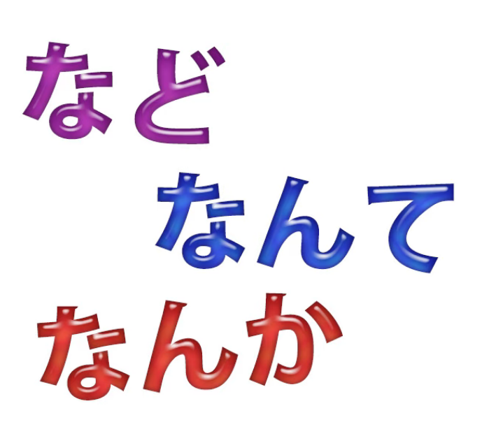

And the simplest one is <code>など</code>, so we're going to start off with that.

## など

**<code>など</code> essentially means pretty much what <code>etcetera</code> means in English,**

**but the thing to bear in mind in formal language** is that

**it has higher status than <code>etcetera</code> in English.**

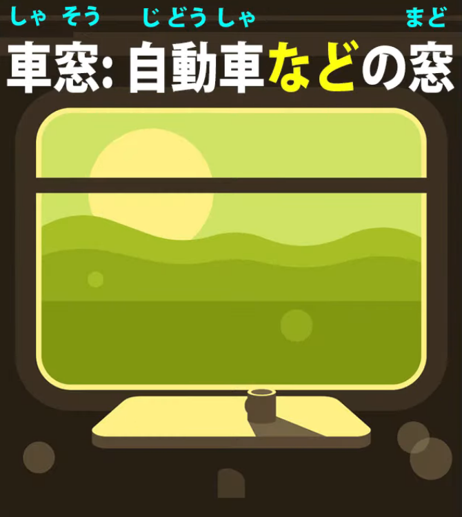

**In English, <code>etcetera</code> tends to be treated in many cases as a bit of a cop-out.**

**It's a way of not really saying exactly what you mean.**

**In Japanese it has much higher status. Its meaning spectrum is broader.**

**You will encounter it both in completely formal writing and in informal conversation and writing.**

It's an indispensable part of the language.

---

To give an example of its **formal use**, a dictionary definition of the word <code>車窓</code> --

and <code>車窓</code> is one of these words that I've talked about [**in a previous video**](https://www.youtube.com/watch?v=FaSPO5lL0yQ&t=0s&ab_channel=OrganicJapanesewithCureDolly),

two-or-more-kanji words that really aren't words in quite the English sense of the word,

that's to say, **they are really phrases**.

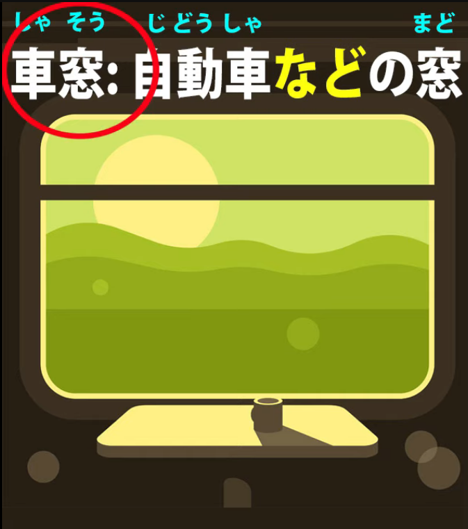

**They bring together two known entities, which are known if we've done much Japanese,**

**into what in English would simply be a phrase.**

So we can throw these words into our Anki if we want to remind ourselves that they exist

but **we shouldn't treat them as completely new entities.**

**They're really just like phrases and this one is very close to the English phrase**

**<code>car window</code>, which isn't a word, it's just a phrase.**

If we know <code>car</code> and we know <code>window</code>, we know what a <code>car window</code> is.

So if we know <code>車</code> and we know <code>窓</code> and we know the on-readings of the two,

which are <code>しゃ</code> and <code>そう</code>, then <code>しゃそう</code> really presents no problems,

except that **we need to remember that <code>しゃ</code>, the on-reading of <code>車/くるま</code>,**

**refers to a broader range of vehicle.**

<code>くるま</code> usually simply means a <code>自動車/じどうしゃ</code> (an automobile)

**while <code>しゃ</code> can refer to any kind of surface vehicle.**

A bicycle is a <code>自転車/じてんしゃ</code>, a train is a <code>電車/でんしゃ</code>, etcetera.

And the definition is: <code>自動車**など**の窓</code>.

So essentially that means <code>the window of an automobile, **etcetera**</code>,

which **in this case means any kind of a surface vehicle that has windows**,

so not a <code>自転車</code> but a <code>電車</code>, etcetera: <code>the window of a vehicle</code>.

::: info
Notice how the など here is used right after 自転車 (preceding even the の particle).  
など seems to be used directly after its noun / noun phrase like any other particle would (など is a particle too). Furthermore however, looking at some Yomichan sentences where it is used, it seems like it takes priority over the logical particles like の, が, を in that it is the first one to attach to/after its attached noun, with the logical particles following it only once it was attached. As seen above or in a sentence from Yomichan:
>大学では<code>**フランス語やドイツ語**</code>など<code>**を**</code>勉強した。

:::

And this <code>など</code> is a very typical use of the word.  
**It gets used freely in formal and informal Japanese.**

### など in informal Japanese

**In informal Japanese, <code>など</code> also has another use**,

**which overlaps with the other two words we're going to look at.**

**It can be used to mildly denigrate or belittle a word that it's attached to.**

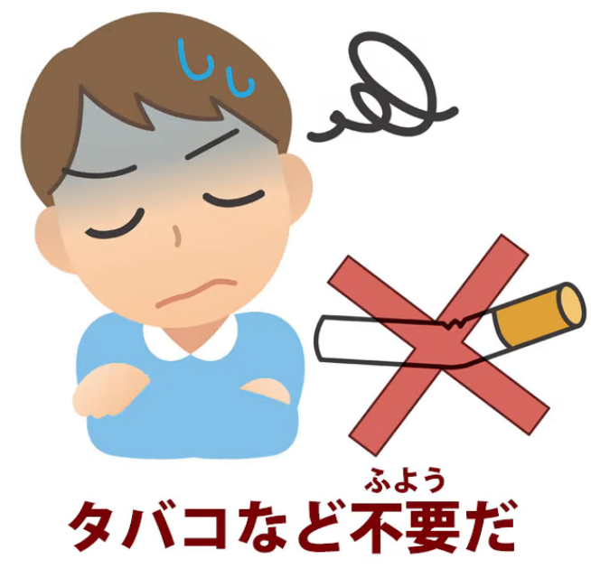

Now, <code>denigrate</code> and <code>belittle</code> are not exactly the right words to use here,

but I don't think there are quite the right words in English.

**It throws a negative light, which in the case of <code>など</code> is usually making light of**

**or slightly rejecting whatever it is.**

So we might say, <code>タバコ**など**不要だ</code>, which means <code>I've no use for cigarettes</code>.

Now, <code>タバコは不要だ</code> would mean the same thing essentially

**(notice that <code>など</code> knocks out other particles)**. *- so Dolly confirms my observation from above, except that here it straight-up removes the は particle, likely because it is not a logical particle.*

---

**The only difference here is that <code>など</code> is throwing**

**that slightly disparaging light on cigarettes.**

So the way we could read it is something like, in English, <code>I don't need stuff like cigarettes</code>.

**Now, actually this doesn't mean that literally.**

**It's not saying I don't need cigarettes or cigars or a pipe or a hookah.**

**It means I don't need that kind of thing -- that's something I don't need in my life.**

And as I say, this use overlaps with our other two words.

**Both <code>なんか</code> and <code>なんて</code> can be used in this**

**throwing-a-negative-light-on-the-noun-they-follow way.**

**The strongest and most colloquial of the three is <code>なんか</code>,**

**and <code>なんて</code> comes somewhere in the middle.**

## なんか

**So, <code>なんか</code> is really a contraction of <code>何か/なにか</code> (something)**,

but it has quite a few colloquial uses.

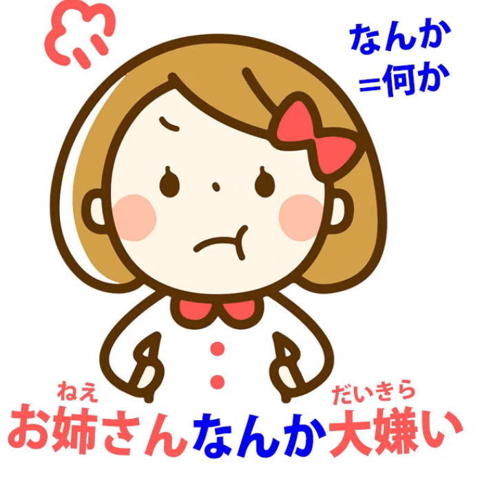

And it’s the denigrating one we'll hear sometimes very strongly in cases where...

well, let's say in an anime a younger sister is angry with her older sister.

She may say, <code>お姉ちゃん**なんか**大嫌い!</code> (I really hate **stuff like** my big sister).

Now, of course, **that's not literally what she means.**

**She doesn't mean she hates <code>stuff like</code> her big sister,**

**but by using this expression --<code>stuff like you</code>, <code>stuff like my big sister</code> --**

**you're throwing a very disparaging light on what it is you're talking about.**

---

**It can be milder:** we can say, <code>サッカー**なんか**興味がない</code>

(I've no interest **in stuff like** soccer / I'm not interested in soccer).

**And it can be more mildly belittling still:** we might say, <code>雨なんか平気だ</code>.

And what we're saying there is "*(Stuff/Something like)* Rain doesn't bother me /

I'm not troubled by *(stuff/something like)* rain / I'm okay with *(stuff/something like)* rain".

**And the <code>なんか</code> is just throwing that slightly diminishing light on the rain,**

**indicating how little we're worried about it.**

### なんか used with oneself

And **it often gets used of oneself**, as in <code>私なんか</code>,

and **this is often used to stress a perceived inferior position**

**or a difficult position that one finds oneself in**, for example,

<code>私なんかまるで子供扱いだ</code> (I'm treated just like a child).

### なんか - contraction of なにか / 何か

**Now, the fundamental meaning of <code>なんか</code>, as I said, is actually**

**a contraction of <code>なにか / 何か</code>, which is <code>something</code>.**

And **it can be used simply as a contraction of <code>なにか / 何か</code>** in, for example,

<code>**なんか**心配はある?</code>, which just means <code>**何か**心配はある</code> or

(Is there **some** worry? Is **anything** worrying you?).

### なんか as <code>something</code>, <code>somewhat</code> to make things vaguer

Now, **from there it goes on to preface things in order, as with <code>something</code>**

**or <code>somewhat</code> in English, to make them a bit vaguer.**

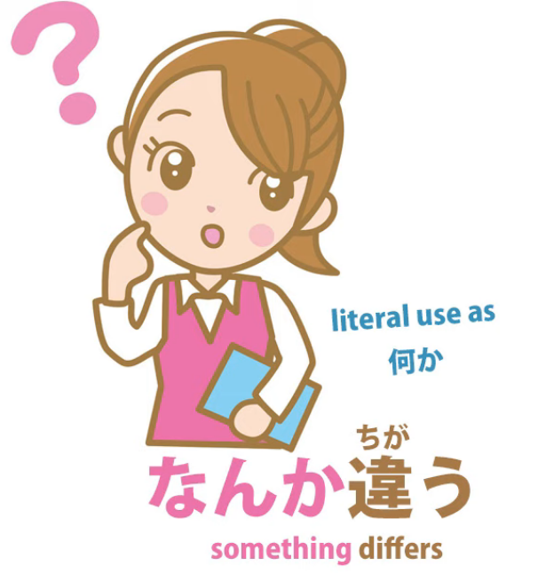

So we might say <code>**なんか**違う</code> (**something's** different */ **something** differs* --

I'm not sure what it is, but something's different).

<code>なんか違う.</code>

### なんか as <code>somehow / for some reason</code> 

Now, from that it goes on to meaning <code>somehow</code>.

So we might say <code>**なんか**好きじゃない</code> (**somehow**, I don't like it /

**For some reason**, I don't like it).

<code>**なんか**好きじゃない</code>

### なんか in very casual / sloppy speech as <code>kinda</code> x

Now, from there it gets worse.

**It goes on to become even vaguer.**

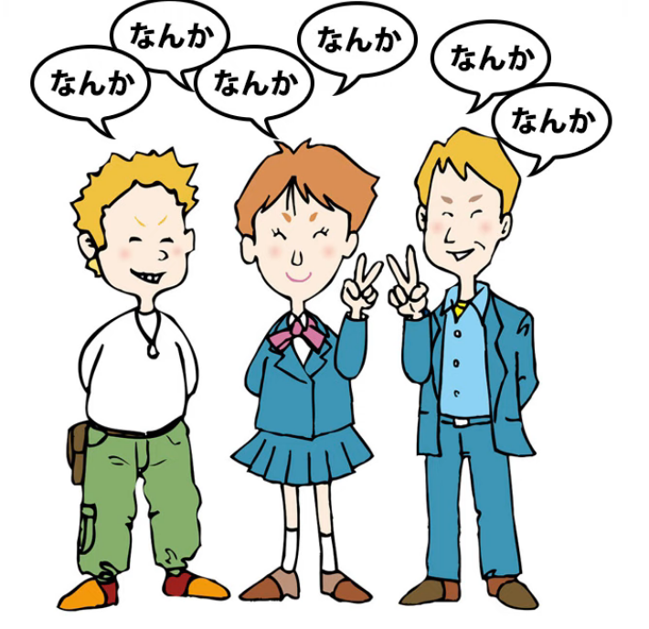

**So in very casual and (I would say) rather sloppy speech,**

**you can hear <code>なんか</code> at the beginning of a sentence**

**and then several times during the sentence: <code>なんか this, なんか that</code>.**

---

**And when it's being used like that, it's really being used like <code>kinda</code> or <code>like</code> in English.**

And, just as in English, **this is a sloppy way of talking.**

I**t's not good Japanese, but you may hear people talking like this in some anime, etcetera.**

**The function really, as with <code>like</code> or <code>kinda</code> in English, is**

**simply vaguing things up a bit and**

**releasing oneself from the need to express oneself precisely.**

Just kinda saying, like, whatever it is that kinda comes into your mind, like --

<code>なんか... なんか... なんか</code>.

So, **we should look out for this very loose use of <code>なんか</code>**

**and realize that it doesn't really mean very much at all.**

## なんて

**<code>なんて</code> is essentially a contraction of <code>何って</code>**

and I've done another video about this -って, which is a contraction of -と or <code>-という</code>.  
*(Lesson 18)*

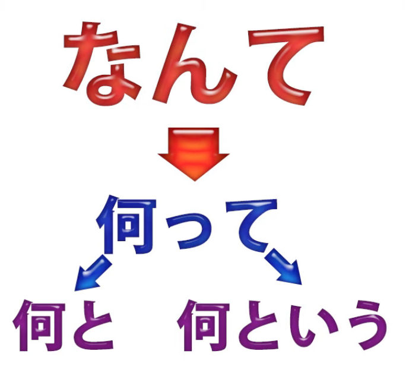

And it's the same with <code>なんて</code>.

So, in its simplest and most basic use, it's used, for example,

in saying <code>**なんて**言った?</code>, which means <code>**what** did you say?</code>

English speakers may be tempted to ask

<code>**なにを**いった?</code> (**what** did you say?).

**But that's not natural Japanese.**

We can say <code>なんと言った</code>, but it's actually **more natural in casual speech**

to say <code>**なんて**言った?</code> (**what** was it that you said?)

which isn't very easy to translate into English because

it's using that quotation particle *(the と)* even though

**it's rather morphed itself into <code>なんて</code> in colloquial speech.**

### なんて as <code>What a (this)</code> or <code>What a (that)</code>

Now, you'll also see it a lot with a meaning of <code>what</code> in English

as used in expressions like <code>**What a** nice day!</code>,

<code>**What a** stupid person!</code>, <code>**What a** beautiful flower!</code> etcetera.

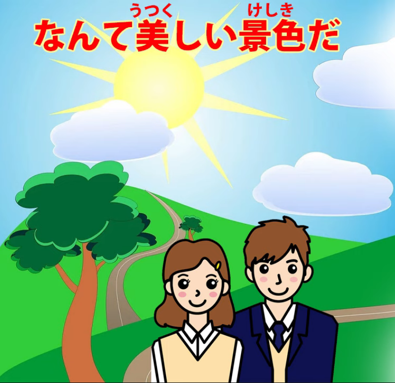

**And this is an abbreviation of <code>なんという / 何という</code>, but it's more often than not,**

**even in not particularly casual speech, used as <code>なんて</code>.**

<code>**なんて**美しい景色だ!</code> (**What** beautiful scenery!)

And, just as in English, **this <code>なんて</code> can be used to introduce**

**any fairly strong reaction to anything.**

**It can be negative; it can be positive.**

**We're saying <code>what a (this)</code> or <code>what a (that)</code>.**

### なんて used in a belittling manner

Now, **it's also used**, as we said before, **in this belittling manner attached to a noun.**

So, for example, we can say <code>試験**なんて**嫌いだ</code> (I hate exams);

<code>お金**なんて**いらない</code> (I don't want money).

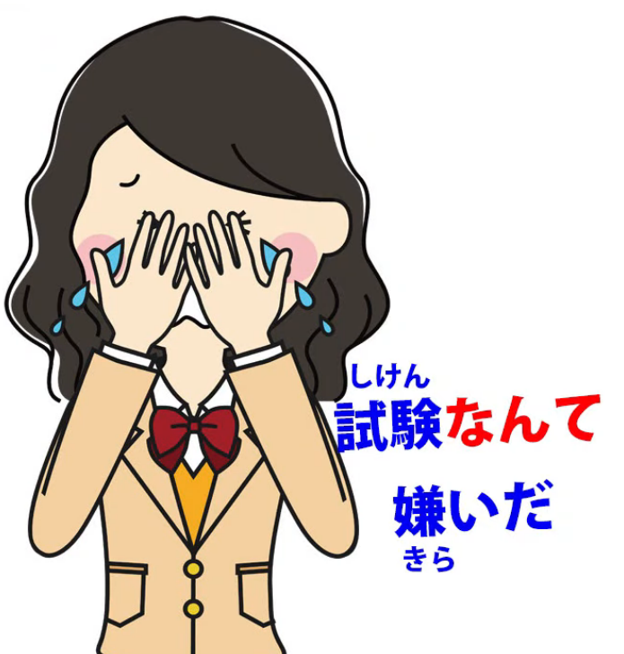

**Like <code>なんか</code>, it both stresses the noun that it follows**

**and indicates a negative or a dismissive attitude towards it.**

### なんて used to express surprise

**And it can also be used at the end of a complete statement to express surprise.**

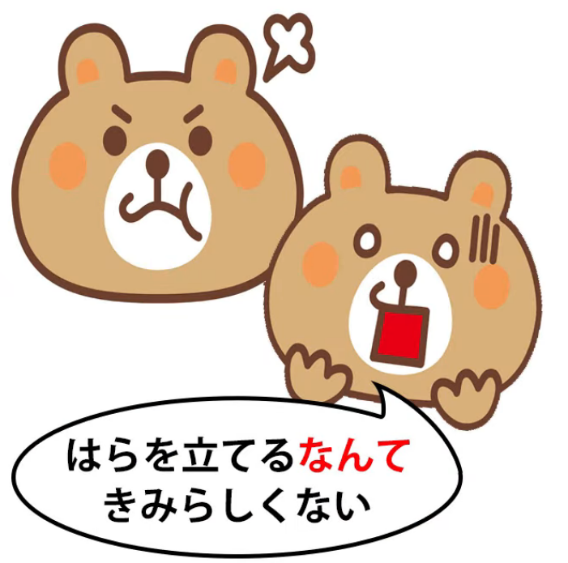

So **in this sense it's rather like the first one** we looked at,

**the <code>what a (this)</code> or <code>what a (that)</code>, which comes at the beginning.**

---

**It can also be used at the end to express surprise or in some cases disbelief or doubt.**

So we might say, <code>冬に燕を見る**なんて**</code>

(see a swallow in winter + <code>なんて</code>).

What's that <code>なんて</code> doing?

Well, **it's turning the whole thing into an expression**,

**rather like the <code>what a (this)</code> or <code>what a (that)</code> expressions.**

**So what we're saying is something like <code>Gosh, imagine seeing a swallow in winter!</code>**

---

**And this use of <code>なんて</code> on the end, after the engine of a statement,**

**can be used as part of a longer sentence.**

So, for example, we could say <code>腹を立てる**なんて**君らしくない</code>.

Now, **<code>腹を立てる</code>** means literally <code>stand your stomach</code>,

**but this is an expression meaning <code>get angry</code>.**

**So the whole thing is saying <code>getting angry, that's not like you</code>.**

And I've talked about this <code>らしい</code> and <code>らしくない</code> in another video. *(Lesson 25)*

So, if you're not familiar with those, I'll put a link above my head

and in the information section below.

---

Now, **we can take out the <code>なんて</code> here and then of course we'd have to put in a particle**

and say, <code>腹を立てる**のは**君らしくない</code>.

**But the <code>なんて</code> is expressing our surprise about this**

**because it's not like the person concerned.**

---

**And note that this can't be the belittling <code>なんて</code>, which attaches to nouns.**

**This is attaching to a complete statement,**

**so we're expressing our surprise about someone being angry**

**and then adding the comment that it's not like her.**

### なんて as this vague という

And finally, **we can use it in a way that comes right back more or less**

**to the original meaning of <code>-という</code>, but adding a bit of vagueness to it.**

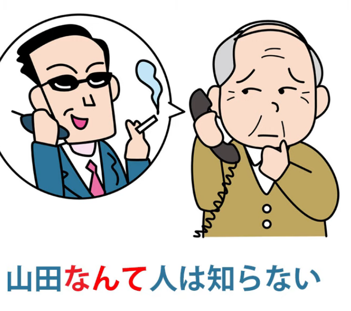

So if we say <code>山田**なんて**人は知らない</code>,

we're saying <code>I don't know anyone **called** Yamada</code>.

Now, **the <code>なんて</code> here could be replaced simply with <code>-という</code>**:

<code>山田**という**人は知らない</code>.

So what's the difference between using the regular <code>-という</code> and using <code>なんて</code>?

---

Well, <code>山田**という**人は知らない</code> is like saying in English simply

<code>I don't know a person **called** Yamada</code>.

But <code>山田**なんて**人は知らない</code> is more like saying

<code>I don't know any character **called** Yamada</code>.

**It's throwing a lot more doubt and questioning into the whole thing.**

So, we've covered the main usages of these three words or expressions here.

It's not completely exhaustive, but I think it gives you the basic keys

to how they work, what they mean, how they're used.

::: info
Damn, quite a few sub-titles in this one, heh* (ノ\*°▽°\*)  
Wanted to make it a bit easier to search, if anything. Also, this is quite interesting:  
*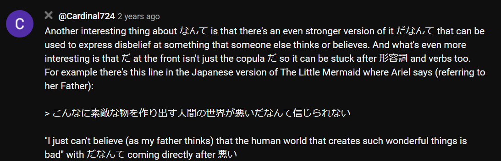*  
Sorry for the microscopic font, Youtube again hides the text parts if I zoom-in for some reason...
:::