# **83. Three Levels of Command in Japanese: て-form commands, なさい, な-commands, imperative form.** 

[**Three Levels of Command in Japanese: て-form commands, なさい, な-commands, imperative form. Lesson 83**](https://www.youtube.com/watch?v=zayeW4AQ0Is&list=PLg9uYxuZf8x_A-vcqqyOFZu06WlhnypWj&index=90)

こんにちは。

Today we're going to talk about

ways of making commands and requests in Japanese.

You'll probably know some of these already,

but I think we're going to go a little bit deeper

to some things you may not have realized.

**We're going to go from the least commanding and intense towards the most**,

so we'll start off with one that we all know, which is the て-form.

## The て-form

Some sources will tell you that the て-form on its own is a command or request form.

**That's only half true. It's the abbreviation of a command or request.**

If we say <code>ちょっと待って</code> (wait a little), **this is an abbreviation**

of <code>ちょっと待ってください</code> (wait a little please)

and probably because of this  
it's the one that's least likely to be offensive, although **it's still casual.**

Now, sometimes you'll hear people saying not <code>ちょっと待って</code>

but <code>ちょっと待って**て**</code>. What's going on here?

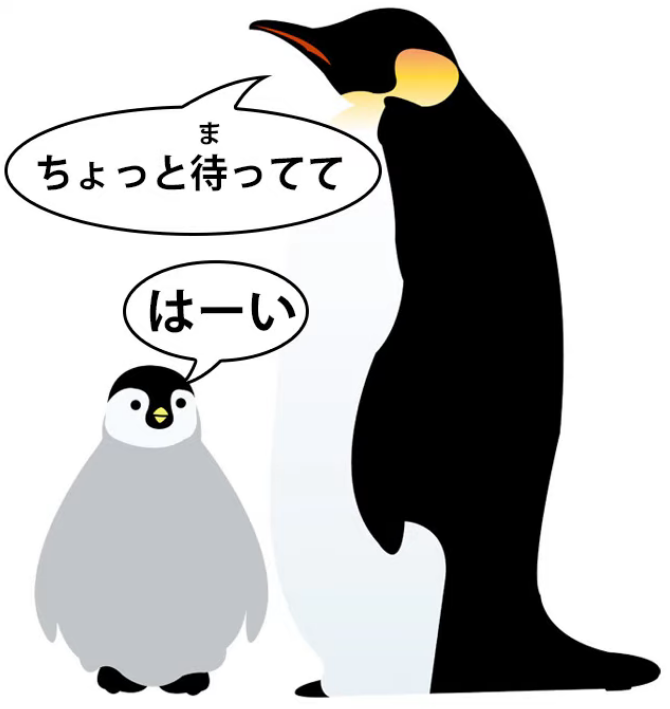

Essentially what they're saying is <code>**Wait a little bit and I'll be back**</code>.

**The implication is that the waiting period will end fairly shortly.**

And what this actually is is a contraction of <code>ちょっと待って**いて**</code>.

As we know <code>待っている</code> means <code>exist in a state of waiting</code>, <code>be waiting</code>, in English.

**So <code>ちょっと待ってて</code> is actually taking this <code>待っている</code> and putting it into て-form**,

**so that what you're being asked or instructed to do is exist in a state of waiting.**

And the implication of this is, **just exist for a little bit in a state of waiting.**

**And of course this doesn't have to be waiting, it can be anything,**

**but the implication is, just do it for a bit, just exist in that state for a short time.**

---

**If we don't say <code>ちょっと</code>** (and we don't necessarily)

**there's nothing to indicate a short time, but that is always the implication**

**of telling someone with the て-form to exist in a particular state.**

### て-form with ない helper adjective

The other thing to know about the て-form which is used to tell or ask someone

to do something is that, as we know, **the equivalent negative adjective of any verb**

**is made by simply attaching the helper adjective <code>ない</code> to the あ-stem.**

**And the helper adjective <code>ない</code> actually is unusual in that it has two て-forms.**

It has the regular て-form, which is formed just like any other て-form,

by attaching -て to the く-stem, so that's <code>なくて</code>,

**but it also has the irregular て-form <code>ないで</code>.**

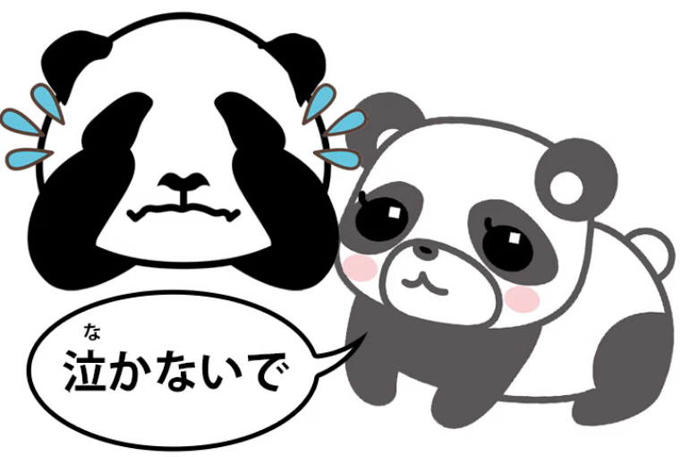

And when attached to a verb this is only used in two kinds of circumstance.

#### ないで - irregular て-form of ない 

One is when we say <code>do B without doing A</code>,

so <code>話さないで歩く</code> means <code>walk without talking</code>.

**The other is when we're making that て-formed command or request.**

And again it's short for <code>ないでください</code>.

So if we say <code>**泣かないで**</code> (don't cry),

**that's using this secondary, specialized て-form of <code>ない</code>**,

**which is specifically there for making negative commands or requests**,

**as well as for the one other usage that we discussed.**

And sometimes in anime you'll hear someone scream,

when a monster is approaching her, <code>来ないで!</code> (don't come).

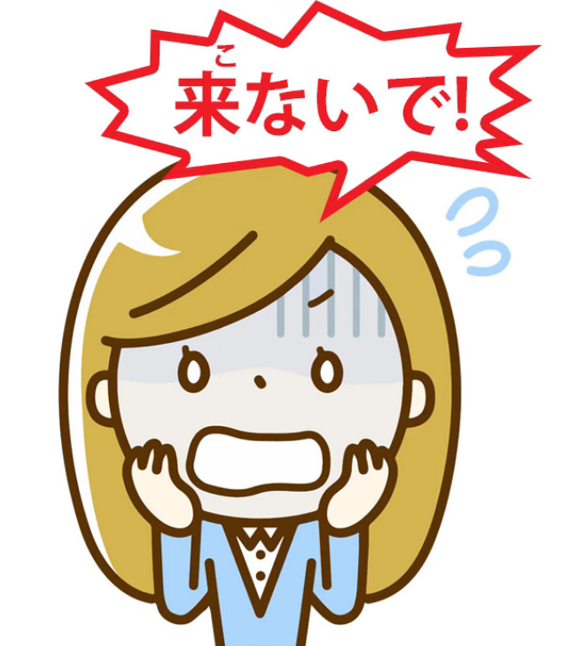

In English we'd probably say <code>Keep away!</code> In Japanese we say <code>来ないで!</code>

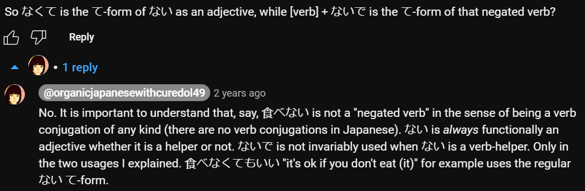

## なさい

Now, next up in our hierarchy of commands is <code>なさい</code>.

**<code>なさい</code> is attached to the い-stem of verbs**, and

**when you attach <code>なさい</code> to the い-stem of a verb, you make it into a command.**

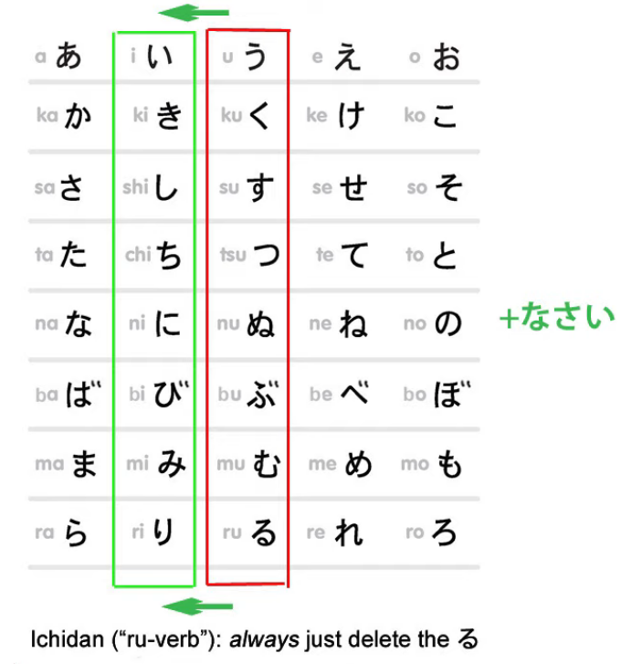

So, <code>起きなさい</code> is <code>get up / wake up</code>;

<code>落ち着きなさい</code> (calm down, settle down),

**we're attaching <code>なさい</code> to the い-stem of <code>落ち着く</code>,**

**which means <code>calm down</code> or <code>settle down</code> and turning it into a command.**

---

**<code>なさい</code> is the sort of command given by parents to children,**

**teachers to a class, that sort of thing.**

**It's not offensive if it's given by someone who's entitled to give it.**

---

So, for example, in the anime <code>借りぐらしのアリエッティ</code>,

Arietty's father says <code>寝なさい</code>.

**That's the い-stem, which of course with ichidan verbs we make by simply**

**removing the -る, of <code>寝る</code>** (sleep, or go to bed) **plus <code>なさい</code>**.

### な - the abbreviation of なさい 

**Something that can be confusing here is that there is an abbreviation of <code>なさい</code>**

**which can be confused with a different abbreviation meaning the opposite.**

**And that abbreviation is <code>な</code>.**

When we attach <code>な</code> **to the い-stem of a verb**, then we're actually abbreviating <code>なさい</code>.

**So if we say <code>準備しな</code>, we're saying <code>準備しなさい</code> (get ready, get prepared)**:

<code>準備する</code>, い-stem of <code>する</code>, <code>し</code> + <code>なさい</code> or <code>な</code>.

Now, that in itself isn't particularly confusing.

What can confuse people is that if we say, for example,

<code>バカにするな</code> (don't make fun of me, of her);

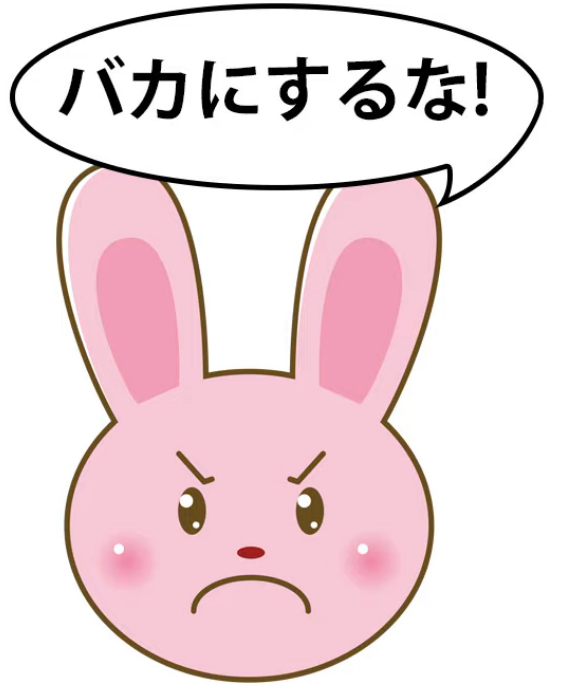

<code>それを食べるな</code> (don't eat that! \[could be poison\]).

**This means the opposite!**

**We're using <code>な</code> for both a command to do something**

**and a command not to do something.**

So how do we tell the two apart? Fortunately, it's very easy.

**If the <code>な</code> is attached to the い-stem, then it's an abbreviation of <code>なさい</code>.**

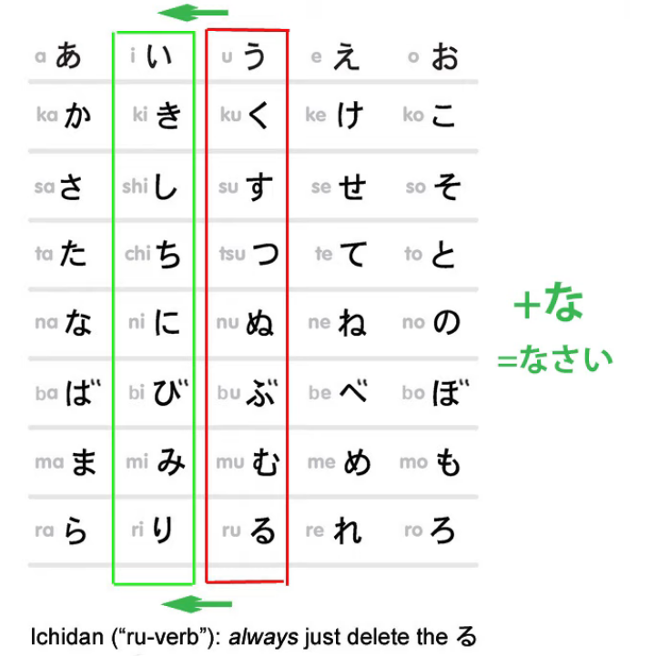

**It always is.**

---

**If it's not attached to the い-stem but attached to the entire logical clause**

**as in <code>それを食べるな</code>, then it is not an abbreviation of <code>なさい</code>.**

**It's in fact an older negative related to <code>ない</code>.**

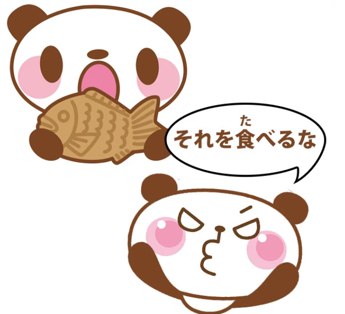

So really, although they can seem confusing at first

and they're probably confusing when you're told by some textbook just

to learn which particular forms they stick to, it's not really confusing in practice.

**One only attaches where <code>なさい</code> would attach to the い-stem,**

**and that's the one that means <code>なさい</code>!**

**The other one tops off a complete logical clause with the negativizing <code>な</code>.**

::: info
Some further info Dolly gives about なさい in the comments
:::
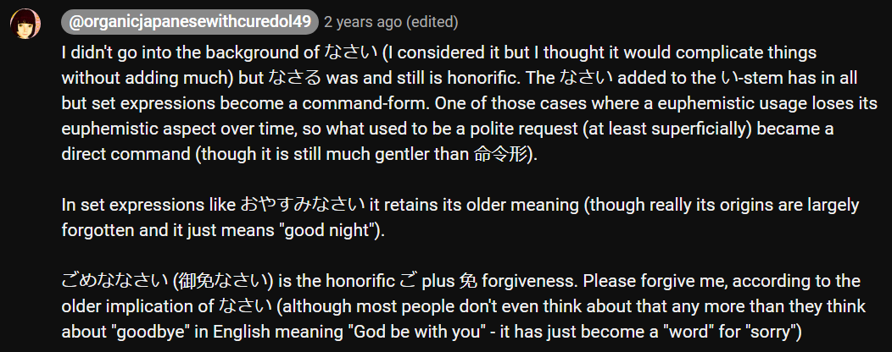

## The real command / imperative form - 命令形

And now we come to the real command form, <code>命令形</code> in Japanese.

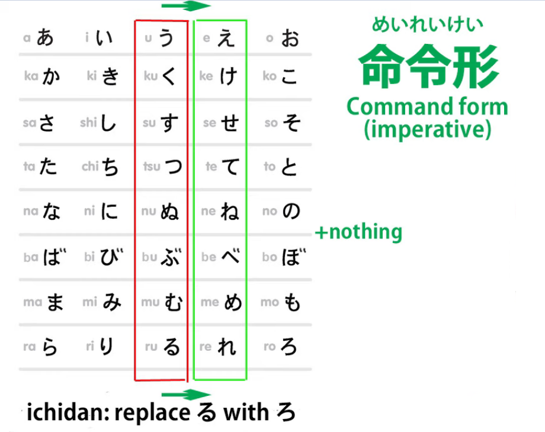

**And this is formed very simply by using the bare え-stem of a godan verb or,**

**in the case of an ichidan verb, we take off the -る as always, and replace it with -ろ.**

So you might hear people say in an anime <code>黙れ!</code>

**That is the verb <code>黙る</code>** (to be quiet, to be silent) **turned into a command:**

**<code>Be quiet!</code>**

**And this is really pretty forceful.**

**It's stronger and potentially more offensive than <code>うるさい!</code>**

(And [**I made a video on <code>うるさい</code>**](https://www.youtube.com/watch?v=1jBOq1EHwvs) if you want to follow that up.)

**It's not inherently offensive,** ::: info
the 命令形 form
:::
**If someone really has the right to be giving orders, they may use it.**

**And people who talk rough may use it among friends or to enemies.**

You may hear it a lot in shounen anime, where people do tend to talk rough.

**It can also express urgency in a few cases.**

**One case that you'll often hear is when a character is in serious trouble**

**and calls out <code>助けてくれ！</code> which is like <code>助けてください！</code>**

**but turning it into a real order, a command.**

Now, obviously someone in deep trouble isn't trying to insult

or offend anyone who might help him.

**So what this <code>くれ</code> is doing in this case is expressing the urgency of the situation.**

Yet even here, I'd have to say that I've only ever heard

**male characters use this <code>助けてくれ</code>.**

Female characters, even in the direst emergency,

will tend to content themselves with <code>助けて!</code>

**And this shows how delicate the real <code>命令形</code> command form actually is.**

**<code>くれ</code> is really the only irregular <code>命令形</code> apart from**

**the two regular irregulars, which are <code>する</code> and <code>くる</code>.**

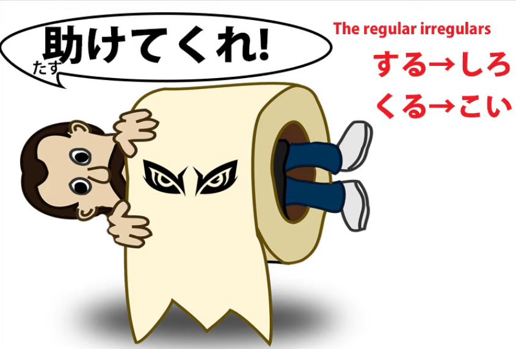

**So <code>くれる</code> (to give down / to me) becomes <code>くれ</code>.**

::: info
Obviously, as shown, the くれ is a form of **くれる**; not くる/来る (that one has こい/来い)
:::
---

And, as you see, **it's a particularly touchy kind of word to use,**

**because you're asking for a favor but you're demanding it,**

**you're commanding someone to do a favor down to you.**

Now, for completeness, I'd say that there are two other ways of commanding

that are mostly used for other things but can be used as command forms as well.

## のだ / んだ ending

**One is the <code>のだ / んだ</code> ending which is put at the end of a complete logical clause,**

and [**I've made a video about this <code>のだ / んだ</code> ending**](https://www.youtube.com/watch?v=lYvIOi8Q3I8),

and I'll put a link to that over my head and in the information section below.

As I explain in the video, **it has a wide range of uses**,

**but one of those uses is turning something into a command.**

So if we say <code>宿題をする**のだ**</code>, we're saying literally <code>**It's that** (you) do (your) homework</code>.

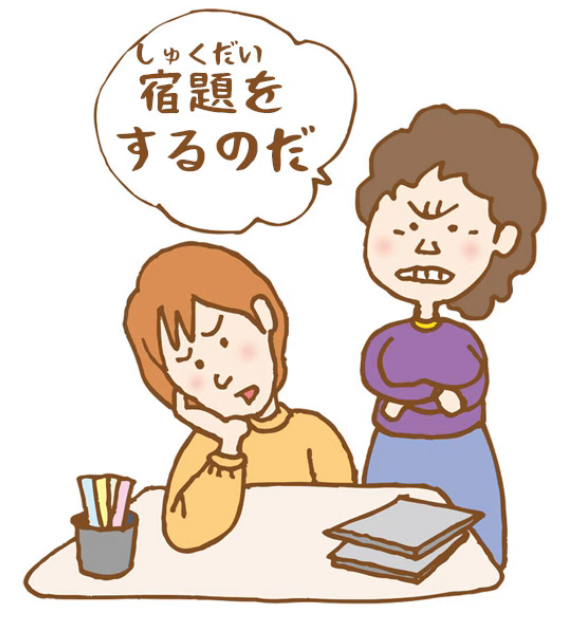

This will be somewhat like the English <code>You're going to do your homework</code>. **It's a command.**

## ように

**Also, <code>ように</code>, which as an ender would tend to be more associated with**

**prayers and petitions and requests, can also form a command.**

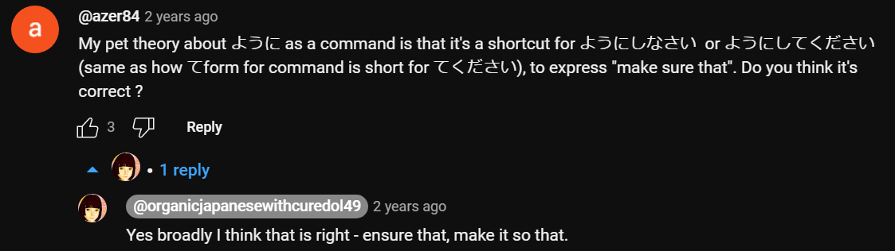

---

And the main reason I mention these is because **if you come across them**

**in your immersion and you see something that usually is doing something else**

**looking like a command, <code>のだ</code> or <code>ように</code>, then don't be puzzled by it.**

**In these cases, it is a command.**

::: info
This might be useful:
:::
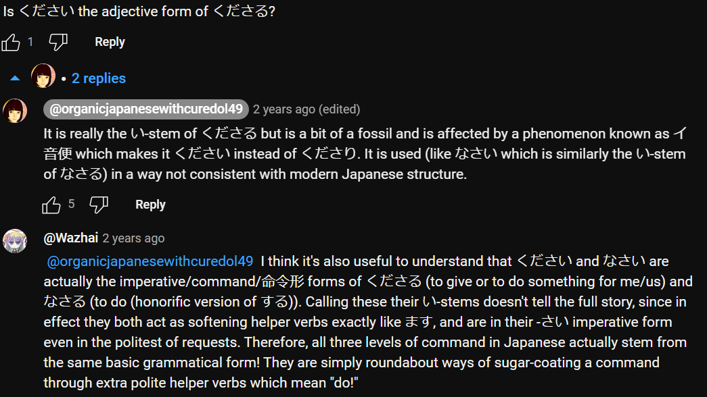

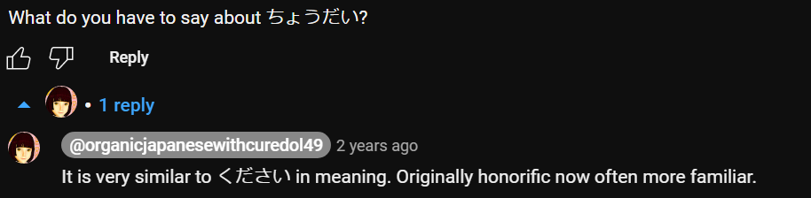
