# **85. まい - the negative helper**

[**まい the negative helper that never gets explained properly | Lesson 85**](https://www.youtube.com/watch?v=f4A9DK7Rtcw&list=PLg9uYxuZf8x_A-vcqqyOFZu06WlhnypWj&index=87&ab_channel=OrganicJapanesewithCureDolly)

こんにちは。

Today we're going to talk about

an unusual but not uncommon element of Japanese

that you'll certainly come across in your immersion.

It can be confusing because nobody really explains exactly what it is

and what it does -- and of course they certainly don't explain why.

A number of people have asked me about this recently

including my Red Kokeshi patron Bob Nagler, who says,

"Have you ever done a video of verb plus **まい**?

I've not found a very useful explanation anywhere,

only lists with examples and translation which give somewhat of an idea."

Well yes, that is pretty much the state of play. So let's do the video now.

## What is まい？

**<code>まい</code> is a negative helper like <code>ず</code> and <code>ぬ</code>**,

which [**I did a video on**](https://www.youtube.com/watch?v=E7Qop8dwP4w) quite recently.

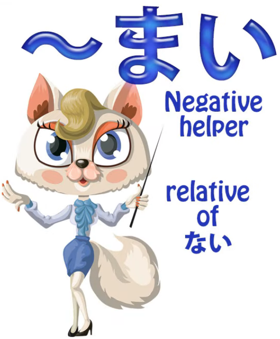

**And like them it's something of a fossil,**

**one of those elements that's not quite at home in modern Japanese.**

**But it's used quite a lot, so we need to understand it.**

---

The first unusual thing about it is that unlike most helpers,

**it doesn't attach to one of the verb stems.**

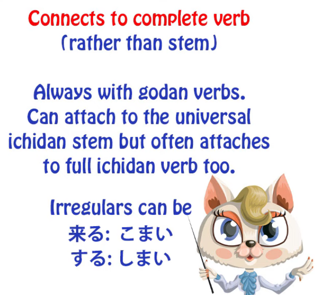

**It gets stuck straight onto the end of the verb in most cases.**

So if we want to put it onto <code>行く</code> we just say <code>行くまい</code>.

**This is always the case with godan verbs**

**because there's no other way of attaching <code>まい</code>.**

**With ichidan verbs we can attach it to the universal ichidan stem**

(as you know, with ichidan verbs we always,

whatever we're doing with them, we always just take off the -る

and put on whatever we want to put on).

So, for example, <code>見る</code> can become <code>見まい / みまい</code>, **but just as often it's** <code>見るまい</code>.

**With the two irregulars**, <code>来る</code> and <code>する</code>,

**they can be** <code>来るまい</code> and <code>するまい</code>,

**but they can also be** <code>こまい</code> and <code>しまい</code>.

---

Now, **strictly speaking, certainly in the past, using ichidan verbs**

**in their entirety with <code>まい</code> on the end was probably ungrammatical,**

**but now it's so widely done that it's generally accepted.**

You'll see it everywhere on the television news or anywhere.

---

So what is this <code>まい</code>?

Well, **it's really a sort of sister to the helper adjective <code>ない</code>,**

**which is the negativizing adjective.**

What's the difference between <code>まい</code> and <code>ない</code> apart from the way it attaches?

Well, **what <code>まい</code> actually is is the volitional form.**

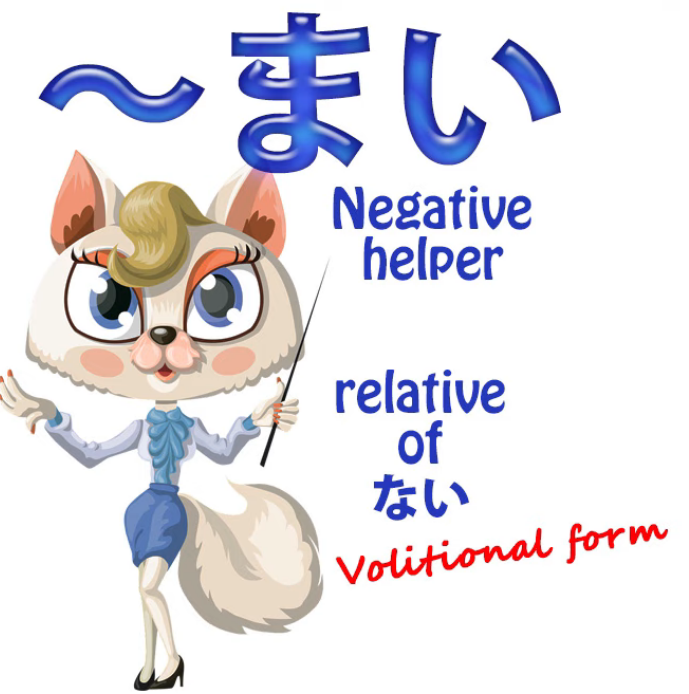

Now, **adjectives don't usually have volitional forms,**

**but in this case we do, and it has certain uses.**

---

**Like <code>ない</code>, <code>まい</code> is an adjective,**

**but unlike <code>ない</code> and just about every other adjective, it doesn't morph in any way.**

**You don't say <code>まくて</code> or <code>まかった</code>.**

**You only ever use it in its simple, unchanged form, <code>まい</code>,**

so it is, in a way, a static element in Japanese, not an active element.

**And this actually is quite natural,**

**because it's the same with the positive volitional, isn't it?**

We have て-forms and past forms of helpers like the receptive

and the causative and, of course, <code>ない</code> itself,

but **we don't have past and て-forms, etc., of the volitional.**

**<code>食べよう</code>: you don't put that into the past, it doesn't have a て-form,**

**because that doesn't really make any sense with a volitional.**

## What a negative volitional cannot do

So what does a negative volitional actually do?

**It doesn't do all the things that a positive volitional does.**

**You can't use it as a call to action:** <code>行きましょう</code> (let's go). *(this example is positive volitional)*

**You can't say <code>行くまい</code> (let's not go) -- it doesn't mean that.**

**You can't use it for**, as I've shown in another video *(Lesson 18)*,

**forming a construction that means <code>try to do something</code>.**

So **you can't use <code>まい</code> in let's-try-not-to-do-type constructions.**

## The uses of まい

Its uses are pretty limited; it has a couple of direct uses

and then a couple of other uses which are really quite useful.

So, let's look at them.

### Using まい to say that something is unlikely

**Its most usual use by a long way is saying that something is unlikely.**

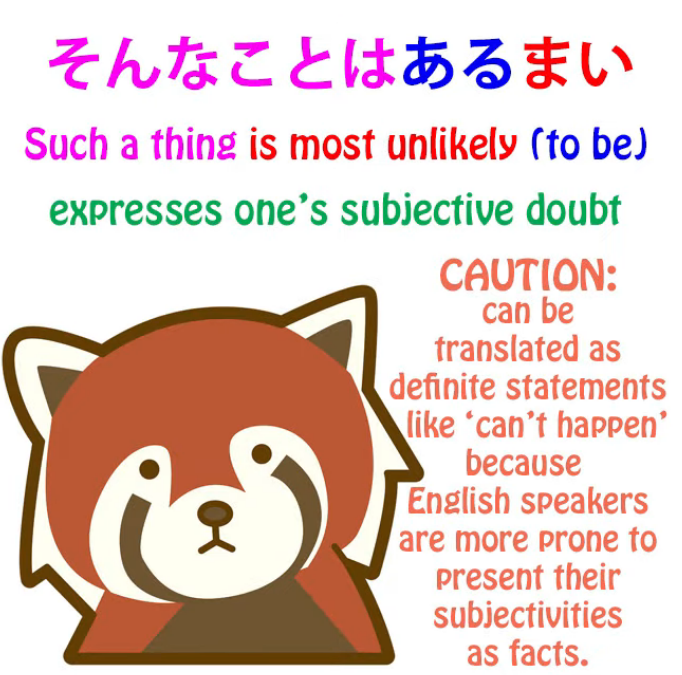

**It's a volitional negative, so just in the same way that**

**we can voice conjectures or assessments** --

and **this is very often used with the verb <code>ある</code>, so we say <code>あるまい</code>.**

<code>そんなことはあるまい</code> (that's just not likely / I don't think such a thing is probable at all).

**But it works just the same with any other verb.**

<code>この降りでは彼はこまい</code> (In this downpour, I doubt if he'll come).

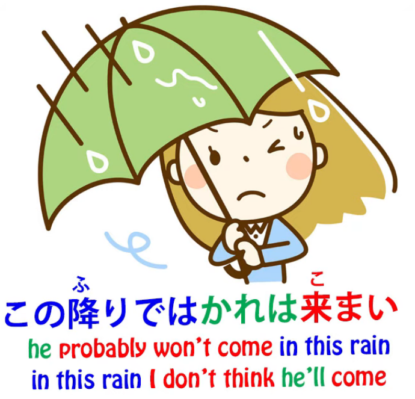

And **this is rather related to the other adjectives of subjectivity**

that we've discussed elsewhere (and I'll put a link for that), *(Lesson 9)*

**such as <code>欲しい</code>, which represents our desire for something,**

**or <code>怖い</code> which represents our fear of something.**

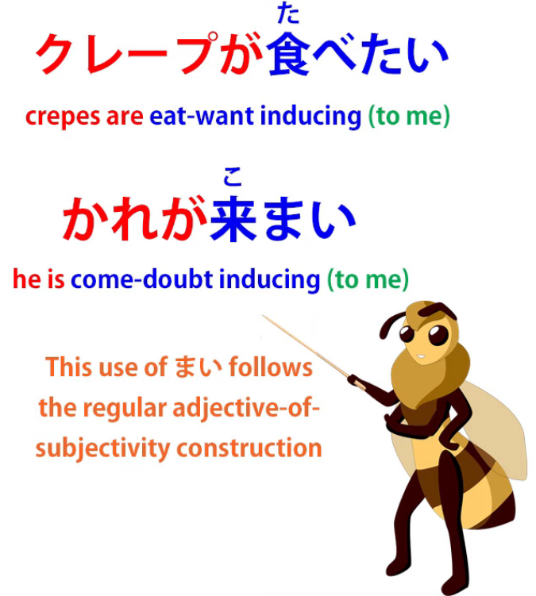

As usual, these adjectives are pointed at the thing that we desire, that we fear, etc.

And **in this case, they're pointed at the thing that we consider unlikely.**

**It represents really our subjectivity about the likelihood of something.**

#### An exact Japanese equivalent to あるまい

If we want to give an exact Japanese equivalent,

**<code>あるまい</code> is directly equivalent to <code>ないだろう</code>  
(doesn't exist, I conjecture) or <code>ないでしょう</code>**,

and **<code>ではあるまい</code>** is directly equivalent to <code>ではないだろう</code>, <code>ではないでしょう</code>,  
<code>じゃないだろう</code>, <code>じゃないでしょう</code>, *(to all of these forms)*

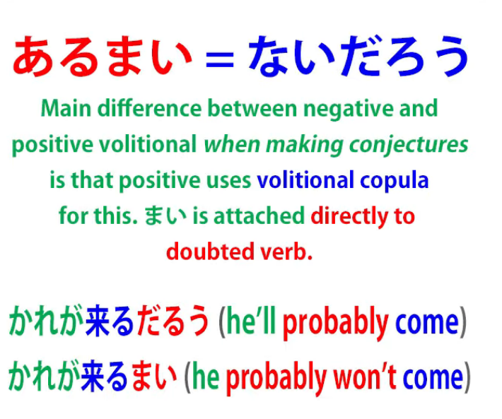

in other words, **<code>A isn't B, I would conjecture, it seems likely</code> etc.**

And **the interesting point here is that**, as we see,

**with this conjectural use of the volitional **in its positive, more usual form**,**

**we don't attach the volitional directly to the verb that we're conjecturing about.**

So **we don't say <code>さくらはすぐに帰ろう</code>.**

**That doesn't mean <code>Sakura will probably come</code>.**

**We say** <code>さくらはすぐに**来るでしょう** (or だろう)</code>,  
because that's the way we do it.  
**We do it with the volitional copula when we're making that kind of conjecture.**

---

**But with <code>まい</code> we can attach it directly to the verb**

as we did in the previous example.

<code>そんなことは**あるまい**</code> is directly equivalent to <code>そんなことは**ないでしょう**</code>.

**And there's no room for ambiguity here**

**because <code>まい</code> has a more limited range of meanings,**

as we've just discussed, **than the positive volitional has**,

so we're not going to get confused with, say, a call to action,

**because <code>まい</code> doesn't do calls to inaction.**

So, **the most common use of <code>まい</code> is as the negative adjectival**

**of these <code>でしょう / だろう</code> conjectural constructions.**

### まい used for a strong decision or determination not to do something

**However, it is also used for one other negativizing structure**

**that is directly equivalent to the positive.**

So we can say <code>二度と行くまい</code>  
(I won't go there again; literally, I won't go a second time).

That's the other common meaning.

**When it's not expressing a likelihood or possibility,**

**it's expressing a strong decision or determination not to do something.**

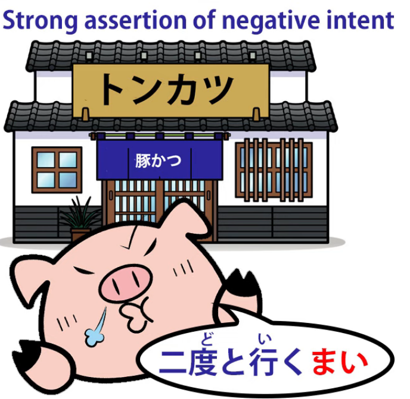

Now, beyond these few uses, there are also a couple of other

common constructions in which <code>まい</code> is used, and you're pretty much certain to hear these.

### Using positive & negative volitional together

**One uses the positive and negative volitional forms together,**

**meaning whether the verb is done or not.**

So, for example,  
**<code>行こうか, 行くまいか</code>** means **<code>whether I go or not</code>.**

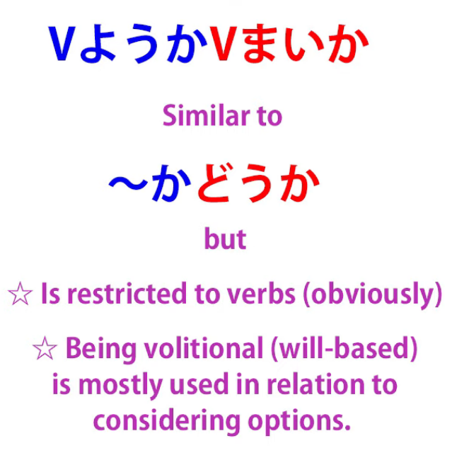

Now, **this is very similar to a construction** that we've talked about before

and that you probably know already *(Lesson 39)*, **<code>行くかどうか</code>**

which means literally **<code>whether I go or how</code>**,

which in more natural English would be <code>whether I go or what</code>.

### Attaching し to the まい construction

**Now, the other construction that you'll commonly hear is formed by**

**simply attaching <code>し</code>, which is used for listing causes of something,**

but as we've discussed elsewhere *(Lesson 63)*,

**it's often used on its own just to imply a continuing list.**

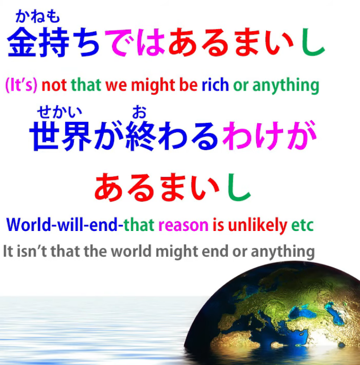

And **this gives a construction that's somewhat comparable**

**to the <code>it isn't as if...</code> or <code>it isn't like...</code> construction in English.**

So if we say <code>金持ちでは**あるまいし**</code> which is roughly equivalent

to the saying **in English** <code>it's **not as if** we're rich</code>,

or <code>世界が終わるわけが**あるまいし**</code> (it's **not as if** the world is going to end).

::: info
In the video subs, it does not record the が after わけ, but Dolly seems to pronounce it, it is just very weakly pronounced by her here if you listen carefully.
:::
**That's how we'd put it in English.**

**In Japanese**, it's more like saying

<code>it isn't **that** we're rich **or something like that**</code>

**(that's the <code>し</code> , the something like that).**  
*(I am trying to highlight the parts, but it is limited, luckily the video picture above shows it well)*

**And the volitional is again marking a negative hypothetical.**

Someone might act as if the world were going to end,

**but in fact it probably isn't.**

We might look to some people as if we're rich

**but, well, we don't seem to be, do we?**

So this is how the <code>まい</code> helper works in its various different common uses…

::: info
This can be useful, even if unrelated here.Sorry if hard to read, zoom-in here or [**see here**](https://www.youtube.com/watch?v=f4A9DK7Rtcw&lc=UgxlL8--buf4g_Gld_l4AaABAg&ab_channel=OrganicJapanesewithCureDolly)  
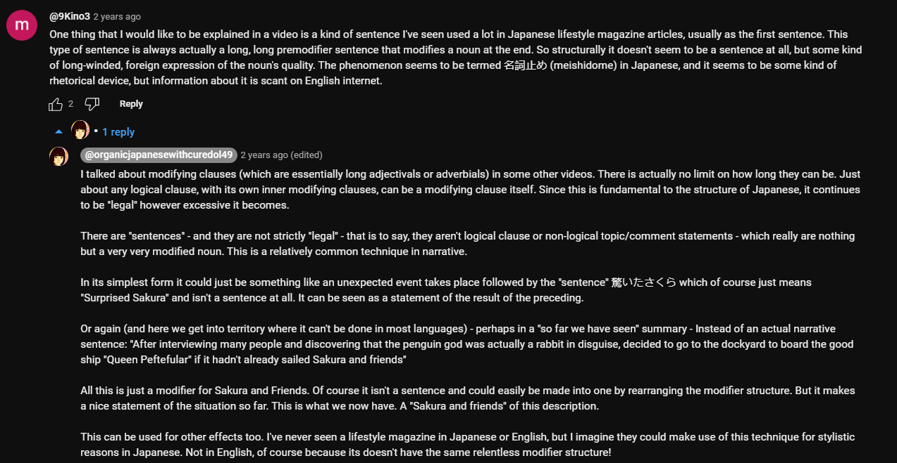
:::