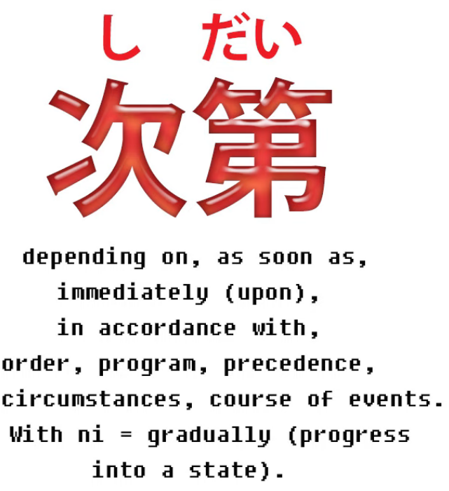
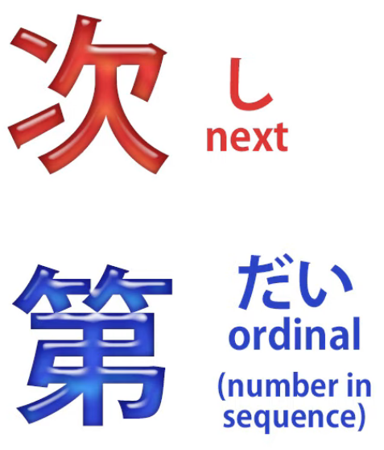
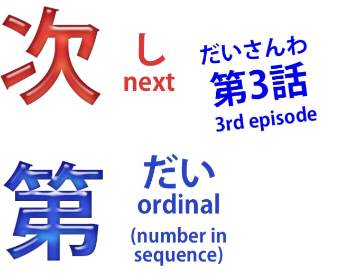
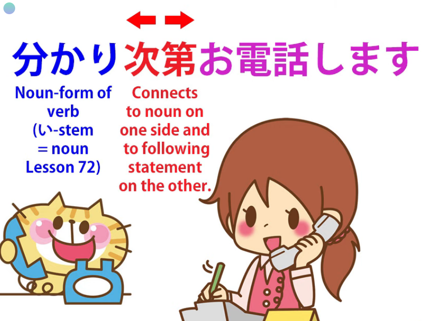
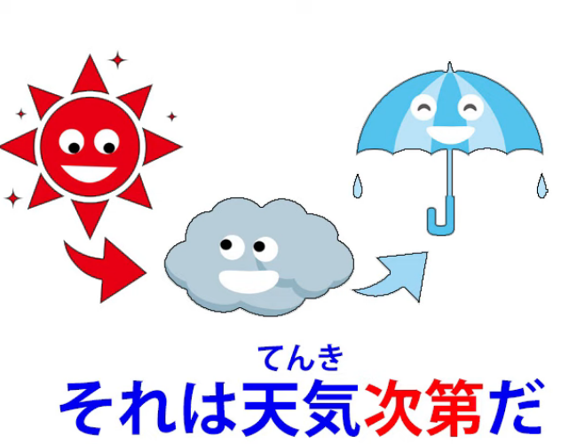
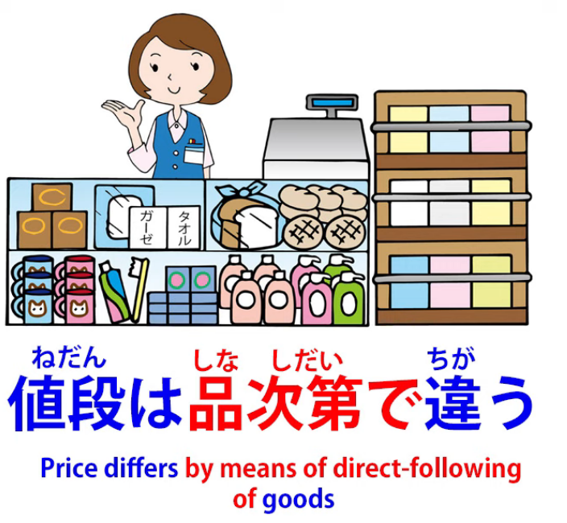
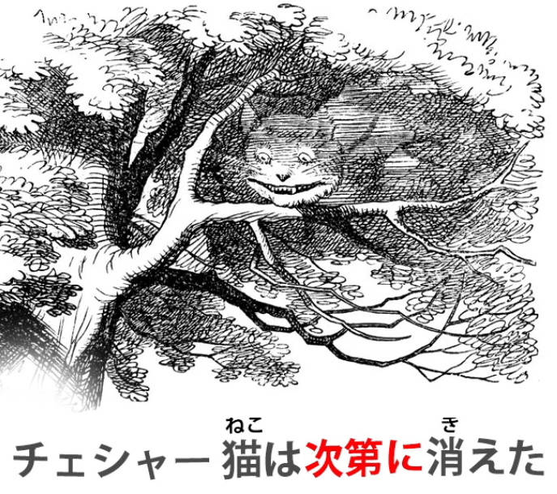
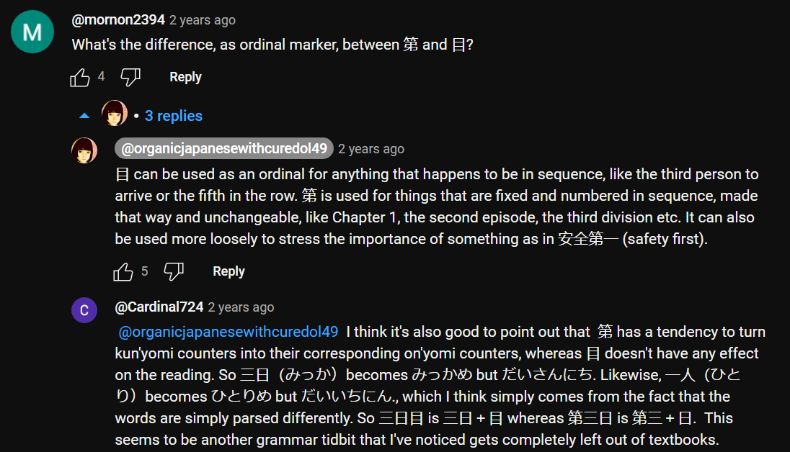

# **86. 次第 (shidai)** 

[**次第 (shidai) - What it really means and how it really works. Lesson 86**](https://www.youtube.com/watch?v=yIv12DTlQl0&list=PLg9uYxuZf8x_A-vcqqyOFZu06WlhnypWj&index=90&ab_channel=OrganicJapanesewithCureDolly)

こんにちは。

Today we're going to talk about one of those words

that has a huge list of apparently unconnected meanings,

if you take the English-Japanese dictionary seriously,

which makes it feel very difficult.

But as is usual in these cases, the real problem is simply

trying to fit the square peg of English definition

into the round hole of Japanese.

So, if we take a look at the word we'll be able to understand

what it really means and how it really works.

**The word is <code>次第</code>.**

**According to the dictionary**, it can mean <code>depending on</code>, <code>as soon as</code>,

<code>immediately upon</code>, <code>in accordance with</code>, <code>order</code>, <code>program</code>,

<code>precedence</code>, <code>circumstances</code>, <code>course of events</code>.

**And then we have what the conventional textbooks**

**like to call a <code>grammar point</code>: <code>次第に</code>, which means**

**<code>gradually</code> in the sense of gradually progress into a state.**

So, how do we make sense of all this?

## What is 次第？

Well, let's start by looking at <code>次第</code>.

**<code>次第</code> is made up of two kanji and it's a noun.**

And you ought to know that as soon as I say it's made up of two kanji

and nothing else, we know that it's a noun. That's all it can be.

**And the two kanji are:**

**this first one, which is the kanji we use in <code>次</code> (next), and that's what it means, <code>next</code>.**

**And this one, <code>第</code>, which is the Japanese ordinal.**

Now, what's an ordinal?

**In English, an ordinal is the -st in <code>first</code>,**

**the -nd in <code>second</code>, the -rd in <code>third</code>, the -th in <code>fourth</code> etc.**

**In Japanese, fortunately, we only have one ordinal for every number**

**and it's <code>第</code>, and we put it before the number, not afterwards.**

So if we want to talk about the third episode of an anime

we say <code>団三話</code>; so the <code>第</code> is the -rd, the <code>三</code> is the three,

**and <code>話</code> is the counter for stories or episodes.**

So, we have the <code>次 / つぎ</code> kanji, the <code>next</code> kanji,

whose regular on-reading is <code>し</code>,

and we have <code>第 / だい</code>, meaning <code>ordinal / sequence / number in sequence</code>.

**So what it means is <code>next thing in sequence / next thing in order</code>.**

**And one more thing we need to know about this word**

**is that it generally works by attaching to another noun.**

**And this gives us a kind of compound.**

---

**So if we attach <code>時計</code> to <code>腕</code>, <code>腕</code> is telling us about the <code>時計</code>.**

**<code>腕時計</code> is an <code>arm-clock</code> (a wristwatch).**

If we attach <code>砂 / すな</code> to <code>時計</code> then we have a <code>sand-clock</code> (an hourglass) - 砂時計.  
**And similarly we form these noun-compounds**

**with <code>次第</code> and whatever it's attached to.**

## 次第 as <code>as soon as</code> or <code>immediately upon</code>

**And the simplest use of this is where it replaces**

**the English expression <code>as soon as</code> or <code>immediately upon</code>.**

So, if we say, <code>分かり**次第**お電話します</code>,

we're saying, "**As soon as** (it) becomes known...

(**<code>分かる</code>, become known; literally, do known, do understandable**)...

**As soon as it becomes understandable, I'll call you."**

---

**What you see that we have here the い-stem of <code>分かる</code>** (do understandable),  
**which is <code>分かり</code>,**

**and we're creating a compound noun, which means**

**"next thing in sequence after doing understandable is that I'll call you** /

**As soon as it becomes understandable, as soon as we know the situation, I'll call you."**

*=分かり次第お電話します*

---

<code>食事の用意が出来次第食べる.</code>

So, although **here we actually have a logical clause**:

<code>食事の用意が出来る</code> (preparations for the meal are completed; literally, come out),

**we actually have the stem of できる here, which is <code>出来 / でき</code>,**

**and that's attached to <code>次第</code>.**

So, "**the next thing in sequence after the preparation's been completed is eat** /

**As soon as the preparations for the meal are finished, we'll eat**".

*=食事の用意が出来次第食べる*

## 次第 as <code>depending upon</code>

And from this logic we then get what seems to be

a completely different idea in English, which is <code>depending upon</code>.

So we might say, <code>それは**天気次第**だ</code>.

In English we'd say <code>that **depends on the weather**</code>.

But in Japanese what we're saying is <code>that **follows directly from the weather**</code>.

And, **as you see, it's a different way of putting it,**

**but it means fundamentally the same thing.**

<code>彼の答えは**気分次第**だ.</code> Now, that means <code>his answer **follows directly from his mood**</code>.

In other words, his answer **depends on what mood he's in**.

### 手当たり次第 phrase

And a useful phrase to know here is <code>手当たり次第</code>.

<code>手当たり</code> is <code>手</code> (hand) and <code>当たり</code> (touch or contact).

**<code>手あたり次第</code> means <code>whatever one can lay one's hands on / whatever comes to hand</code>.**

So, <code>**手あたり次第本**を読む</code> (I read **whatever book comes to hand**).

Reading **a book follows directly from hand-touch of a book**, literally.

---

**<code>手当たり次第</code> can be used in all kinds of constructions:**

I eat **whatever comes to hand**; I read **whatever comes to hand**;

I **throw whatever comes to hand** at the neighbors.

And, **as you see, it's the noun-form of this verb (touch) <code>当たる</code>,**

**which is <code>当たり</code>, which attaches to <code>次第</code>.**

### Attaching 次第 to a person

**Another useful trick is that we can attach <code>次第</code> directly to a person.**

So if we say <code>**あなた次第**です</code>, we're essentially saying

<code>it's **up to you** / it **follows directly from you**</code>.

**Now, this wouldn't be expressed in English as <code>depends on</code>,**

**and in fact if we wanted to say <code>it all depends on you</code> in Japanese,**

**we'd have to use a different kind of construction altogether.**

---

Within the Japanese meaning spectrum,

**what <code>あなた次第だ</code> means is <code>it follows directly from you</code>:**

**It's up to you, it's not up to anyone else, it doesn't follow from me,**

**it doesn't follow from anybody else, it follows directly from you, it's up to you.**

---

**The important thing to understand here is that while**

**the English meaning spectrum and the Japanese meaning spectrum differ,**

**in Japanese terms we're dealing with the same fundamental idea all the time.**

**It's not a random selection of ideas, the way it looks as if it is**

**when you see it in an English-Japanese dictionary.**

## 次第 as <code>according to</code>

**From here we get meanings like <code>according to</code>:**

<code>値段は**品次第**で違う</code>, which literally means

<code>the price differs **directly following the goods**</code>.

**Now, if the goods are the same, which they usually are in this kind of a construction,**

**then it would mean the quality of the goods, just as**

**<code>天気次第</code> means the quality of the weather, the type of weather,**

**and <code>気分次第</code> means the quality of somebody's mood, the type of mood.**

**So, <code>品次第</code> means the type of goods, the quality of goods.**

---

**Now, we can still use the <code>depending</code> translation here**

**and not the <code>according to</code> translation.**

We could say, <code>The price **depends on the quality** of the goods</code>.

**However, if we use an expression like** <code>身分**次第**に暮らす</code>,

we're saying <code>live **according to** one's station in life, **according to** one's means</code>.

**We can't use <code>depend</code> here in English, but as you see**

**as far as Japanese goes it's exactly the same idea.**

---

**<code>身分</code> isn't quite translatable, but it means one's position in life, one's status,**

**and it can, particularly in modern times, mean how much money one has.**

## 次第 as a process, a set of circumstances, a course of events

**Now, in some cases,** and this is where it becomes a little more extended,

**<code>しだい</code> (next in sequence) can represent the whole sequence.**

**So in these cases it can mean things like a process,**

**a set of circumstances, a course of events.**

So one might say, <code>それはこんな**次第**だった</code>

(it was this **kind of situation**, it was this **kind of a sequence of events**).

## 次第に

Now, we also have what the textbooks would call the <code>grammar point</code>, <code>次第に</code>.

**This is simply the standard practice of taking a noun (<code>次第</code> is a noun)**

**and using it adverbially to describe a verb.**

**And doing something <code>次第に</code>, in a <code>次第</code> manner,**

**is as a sequence of steps or gradually.**

So, <code>チェシャ猫は**次第に**消えた</code>

(The Cheshire Cat disappeared **gradually**).

Or <code>夜は**次第に**長くなる</code>

(the nights are growing longer, **day by day, step by step**).

**And this always implies a process taking place over time**

**either in definite stages or not, but taking place over time, bit by bit.**

---

**And because this is put forward as a <code>grammar point</code>, it can be a bit confusing.**

**What we need to notice is that not every use of <code>次第</code> that is followed by に**

**corresponds to this so-called grammar point.**

The real issue here, which doesn't tend to get explained, is that  
**when <code>次第</code> is not modified by another noun**

**and it's on its own acting as an independent adverb,**

**that's when it has this meaning.**

So, in the example we saw earlier, <code>身分**次第に**暮らす</code>,

**that isn't an example of this. It is being used adverbially,**

**but what's modifying <code>暮らす</code> is not <code>次第</code> on its own but the compound <code>身分次第</code>.**

---

**So these are the fundamental uses of <code>次第</code>.**

They seem very different if you look at them through English glasses,

**but if you look at them as they are, I think we can see that**

**<code>次第</code> works pretty much the same way all the time.**

