# **87. Japanese Structure INVERTED: strange life of しか** 

[**Japanese Structure INVERTED: the strange life of しか. How it really works. Lesson 87**](https://www.youtube.com/watch?v=iEnUH0L6VYs&list=PLg9uYxuZf8x_A-vcqqyOFZu06WlhnypWj&index=91&ab_channel=OrganicJapanesewithCureDolly)

こんにちは。

Today, I'm afraid I don't have any reindeer for you,

but I do have a few deer.

We're going to talk about the word <code>シカ / 鹿</code>,

which, as you probably know, means <code>deer</code>,  
::: info
Just in case, this しか is different to the particle しか of this lesson, hence the Katakana, there is a lot of different しか nouns and whatnot with their own Kanji, but only one particle しか
:::
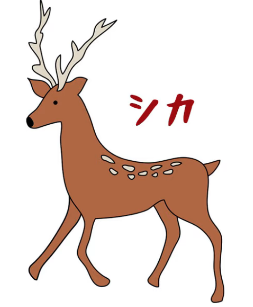

**but there's another <code>しか</code> element in Japanese which is a particle**

**and which has a rather unusual effect on the structure of sentences.**

So we're going to look into that effect.

One of my commenters reminded me of a rather charming Japanese word play:

<code>ならならしかしかしかられない</code>, / *奈良なら鹿しか叱られない (how it might be in Kanji form)*

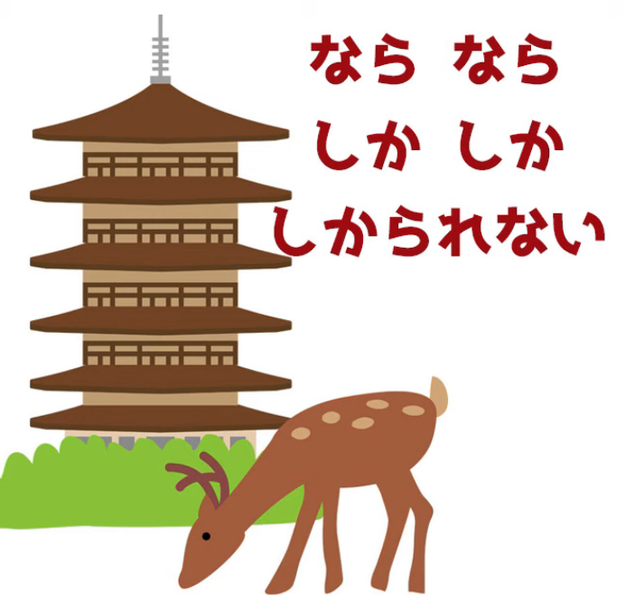

and in natural English we would translate this as

**<code>In Nara, only the deer get scolded</code>.**

It's useful to know here that

**Nara in the Kansai region is famous for its deer.**

People go to Nara to see the deer

(and for other things -- it's a lovely historical city).

**Strictly, <code>奈良なら</code> doesn't mean <code>in Nara</code>.**

**It means <code>if it's Nara</code> or, more naturally, <code>in the case of Nara</code>.**

But what does the rest of the structure mean?

This is what my commenter was really asking.

**The question was, "What is the A-car of this sentence?**

**Does it have a zero-A-car somewhere, or does it even have an A-car at all?"**

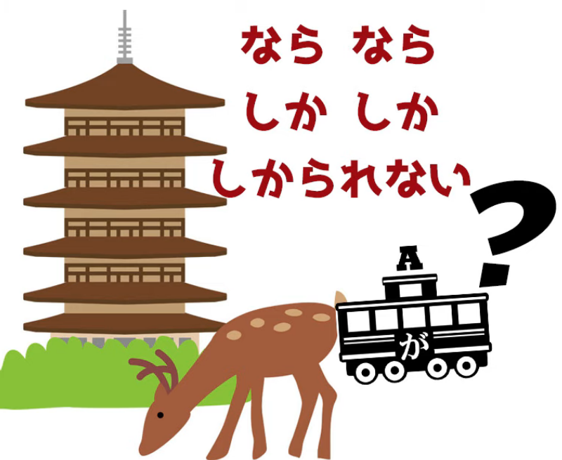

What is the A-car of a sentence like this?

**Now, the problem is partly that <code>しか</code> has**

**an unusual effect on the sentence structure,**

**but it's also that the receptive helper is used here**

which makes it look a bit more complicated than it is.

## しか

So let's start off with a very simple <code>しか</code> sentence.

<code>さくら**しか**いない。</code>

In natural English we'd translate this as,

<code>There's nobody here but Sakura.</code>

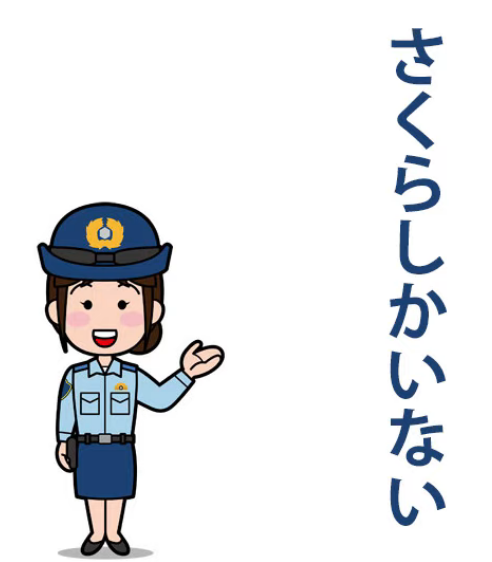

**So what's <code>しか</code> doing here?**

**<code>しか</code> does two things in a sentence like this.**

**It knocks out the が-particle just like <code>か</code>,**

so this isn't something that we're not already familiar with.

**When you have <code>か</code> in a sentence where there would also be a が,**

**we never say <code>がか</code> or <code>かが</code>.**

**<code>か</code> displaces が, but the が is still logically there.**

**That's what <code>しか</code> also does.**

---

**But the other thing <code>しか</code> does is a little bit more unusual.**

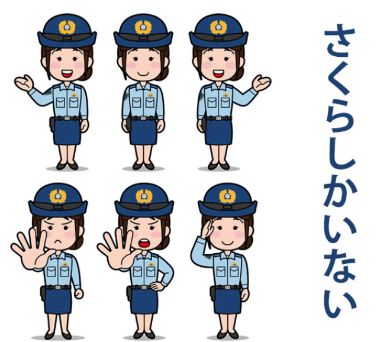

I don't know if you've ever used Photoshop,

but in Photoshop you can invert a selection.

**What happens is that you select an object,**

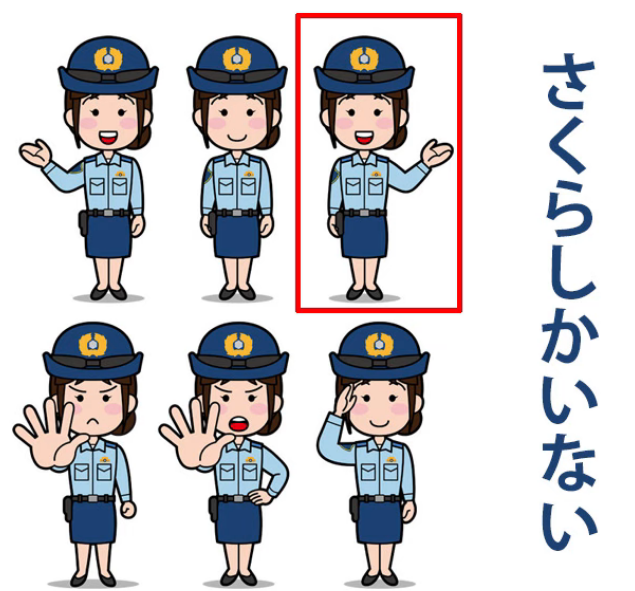

**you press the key selection to invert that selection**

**and what happens is that everything outside of that object is selected.**

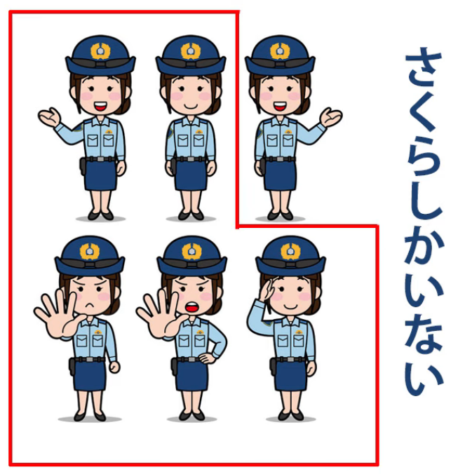

**The object is the only thing there now that isn't selected.**

---

**This is exactly what <code>しか</code> does.**

**While が, you might say, selects an object, a noun,**

**and marks it as the A-car, the subject of the sentence,**

**<code>しか</code> selects that noun, inverts the selection**

**and marks that as the A-car of the sentence.**

**So everything other than that selected noun**

**is now the A-car of the sentence.**

So, <code>さくら**しか**いない</code> literally means

<code>**Everyone other than** Sakura is not here</code>.

In the deer sentence, which looks a little more complicated,

it's exactly the same thing: <code>奈良なら鹿**しか**叱られない</code>

(if it's Nara, **everything other than** the deer are not scolded).

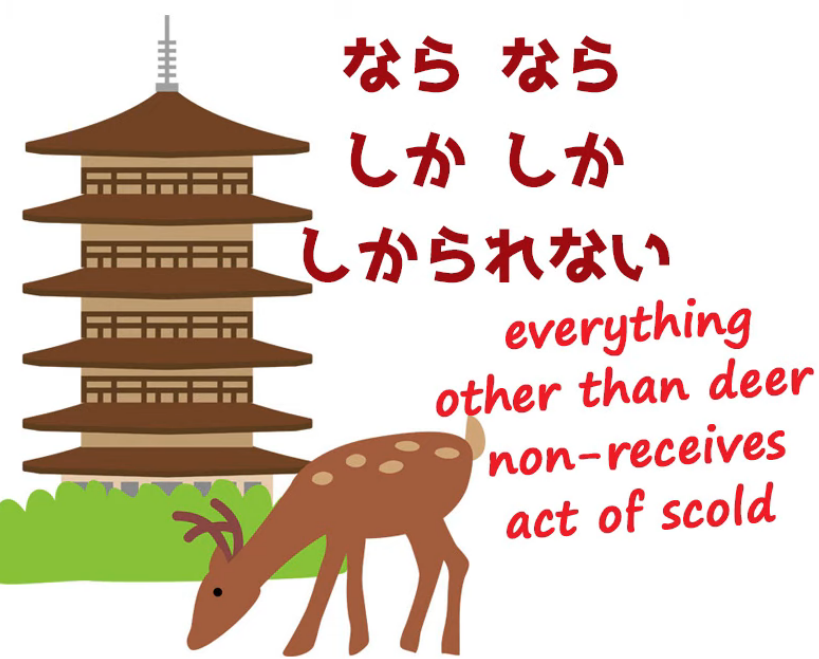

**So again, we're selecting the deer,**

**inverting the selection to everything other than the deer,**

**and then that becomes the A-car of the sentence, which is <code>not scolded</code>.**

---

Now, **there's also an implicit relevance clause in this**,

so when we say <code>さくらしかいない</code>  
**we don't mean there's nothing here but Sakura:** no trees, no bushes, no flying saucers.

**We mean there's nobody here but Sakura.**

**Now, the <code>いない</code> partly tells us that**, but it isn't just that,

because **it also **doesn't mean** that there are no bunny rabbits here**,

**there are no birds, there are no capybara** (did I pronounce that right?)

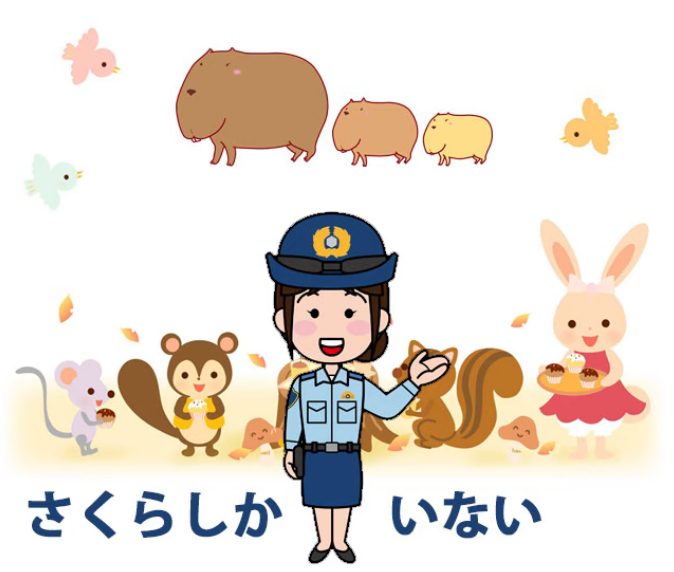

::: info
It should simply select the relevance that **no other Sakura / no other people** are there.* ---
:::
**So <code>しか</code> inverts the selection, but it's also**

**what you might call a <code>smart invert</code>: it selects for relevance.**

## しか in sentences with が-marked subject

**However, in some <code>しか</code> sentences there is actually**

**a が-marked subject, so what's going on here?**

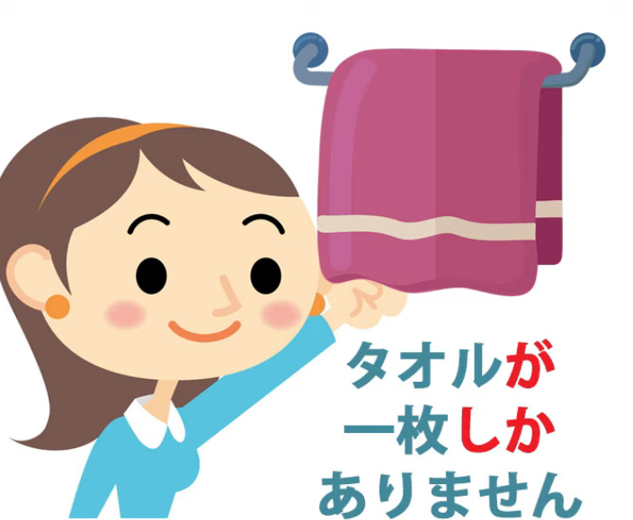

Let's take a look at one. Suppose we say,

<code>タオル**が**一枚**しか**ありません</code>.

Again, in natural English: <code>There's **only** one towel here.</code>

::: info
Notice how in Japanese they use ありません after しか here.
:::
**The が-marked subject is <code>towel</code> or <code>towels</code>.**

**In Japanese, of course, there's no distinction between those two things.**

And as I explained in my lesson on counters *(Lesson 71)*,

**a counter in this kind of sentence is working as an adverb.**

**It's telling us more about the engine of the sentence, the verb.**

So if we say <code>泥棒が**三人**いる</code>,

we're saying <code>robbers*(=subject)* exist three-**person-ly**</code>.

If we say <code>タオルが**一枚**ある</code>,

we're saying <code>towel*(=subject)* **one-flat-thing-ly** exists</code>.

If we say <code>タオルが**二枚**ある</code>,

we're saying <code>towel*(=subject)* **two-flat-thing-ly** exists</code>.

So when we say <code>タオルが**一枚**しかありません</code>,

**the subject is <code>towels</code>**,

**then we have the counter <code>一枚</code> and that is marked by <code>しか</code>.**

**So we're selecting one flat thing, one towel,**

**and then inverting the selection to all towels.**

---

**Not all flat things, because we've already marked the subject as <code>towel</code>.**

**So we're inverting the counter, which is working adverbially,**

**from one towel to every towel but that one towel.**

So we're saying <code>towels, **everything but one**, non-exists</code>.

In natural English, <code>There's **only one** towel</code>.

*<code>タオルが**一枚しか**ありません</code>*

And that's how what we might call

the inverse-selection structure of a <code>しか</code> sentence works.

## しかない (Colloquial)

**And I should just add at the end that**

**there is a use of <code>しか</code> that's more colloquial.**

**And this is when we say <code>しかない</code>.**

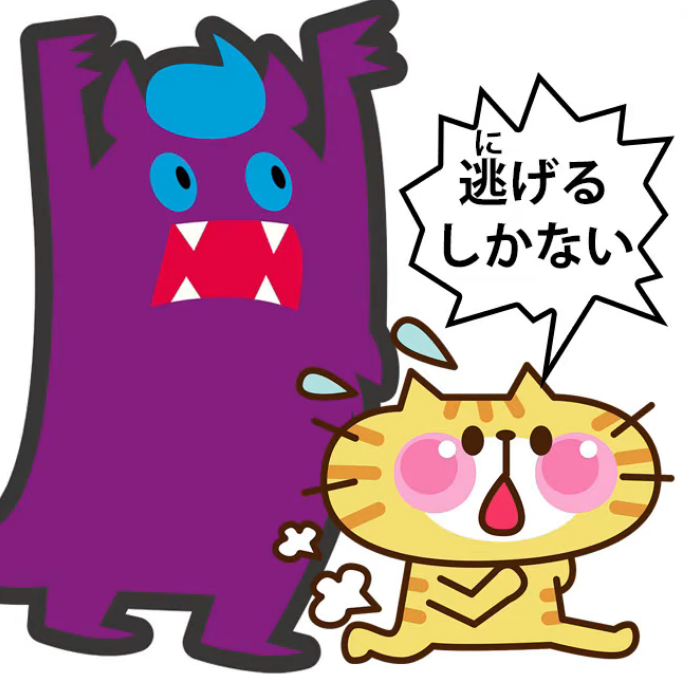

Now, in an ordinary <code>しか</code> sentence obviously

we just say <code>この古い車**しかない**</code>,

which means in natural English <code>There's only this old car.</code>

**We're selecting the car, inverting the selection:**

<code>**all cars other than** this old car **non-exist**</code>.

---

**But we can also put that <code>しかない</code> at the end of a logical clause**

**or a verb standing in for a logical clause.**

**Now, this isn't strictly grammatical, but colloquially it often happens.**

So if you hear in an anime somebody saying <code>逃げる**しかない!**</code>,

they're saying <code>(we) **gotta** run!</code> in natural English.

What they're literally saying is, **we take this <code>逃げる</code>,**

**we mark it with <code>しか</code> so that what we're selecting**

**is not <code>逃げる</code> (run) but everything else other than run.**

And again, **the relevancy smart selection comes in here.**

What we're really saying is  
<code>**every course of action other than** running *(away)* **doesn't exist**</code>.

Well, of course it does exist, **this is very colloquial**,

but as far as we're concerned it doesn't exist:

**there's nothing for it but to run** *(away)*.

---

**In English** we might say, <code>**It's run or nothing**</code>,

and again, **that's ungrammatical and for the same reason**

**that the Japanese is ungrammatical, that <code>run</code> isn't a noun.**

**But, when that thing's coming after you, who cares about grammar?.**

::: info
Some useful comments I guess under the video…
:::
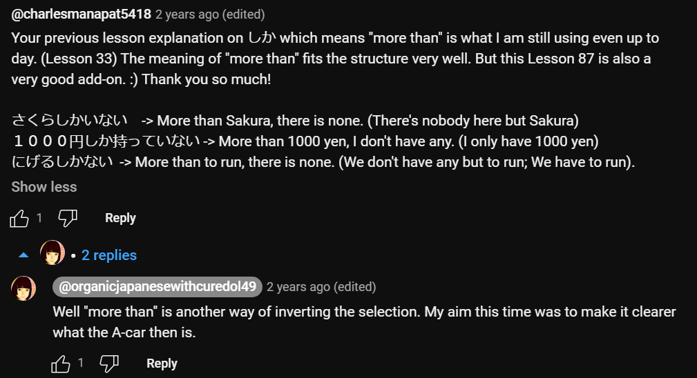

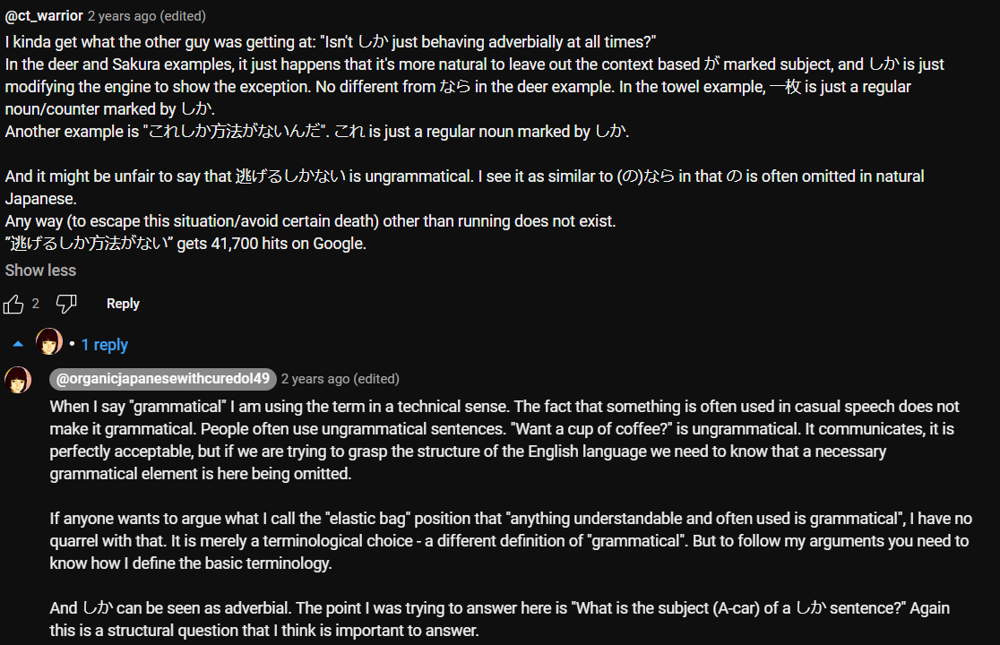

*One miscellaneous about くせに (癖に?), for the full lesson, she made [**this video**](https://www.youtube.com/watch?v=QvuNXIYqFNM&pp=ugMICgJqYRABGAHKBRRjdXJlIGRvbGx5IOOBj-OBm-OBqw%3D%3D)* */ Lesson 93*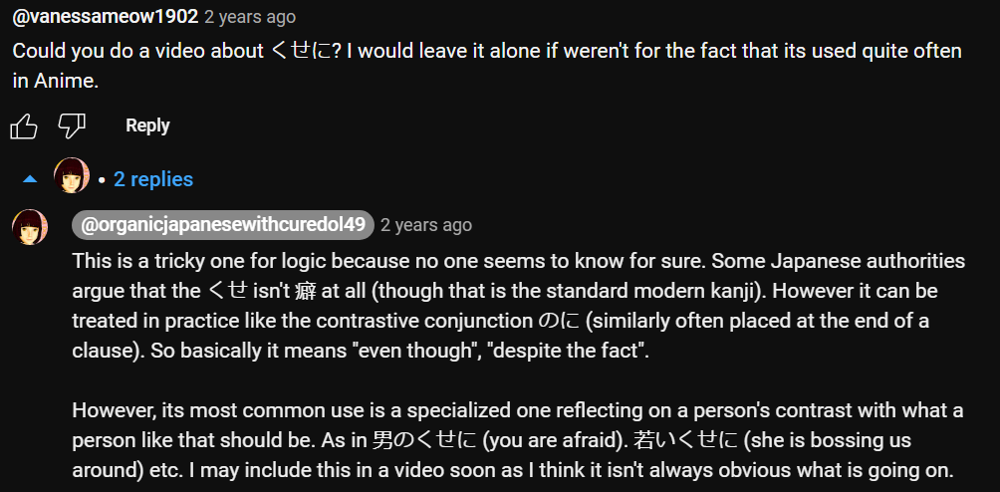
