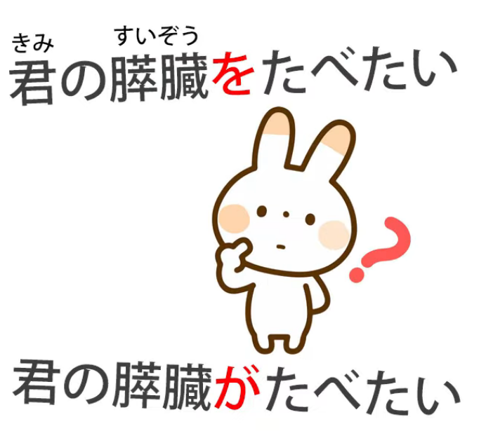
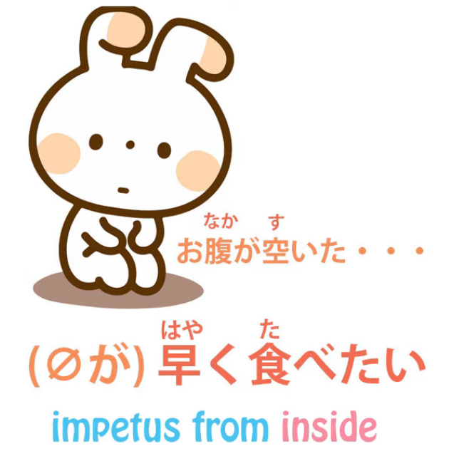
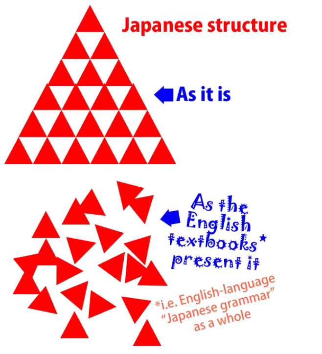
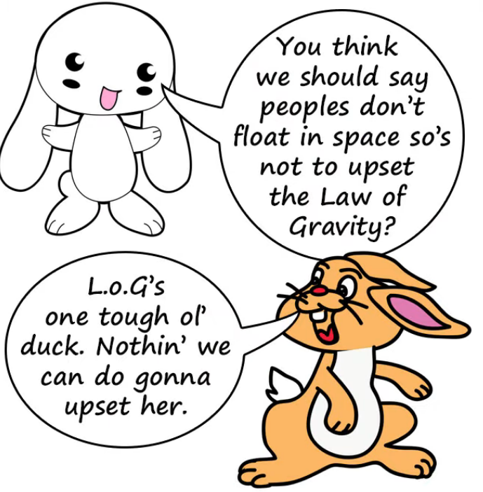
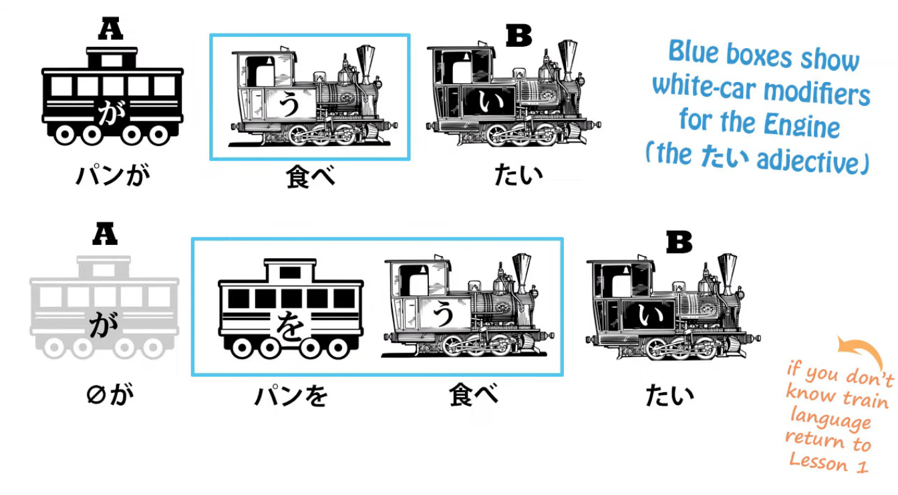
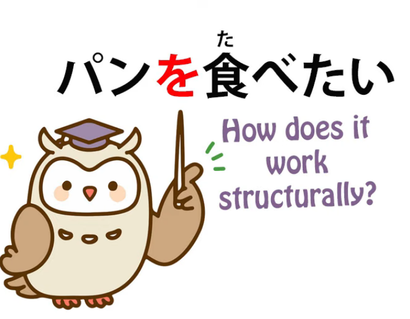
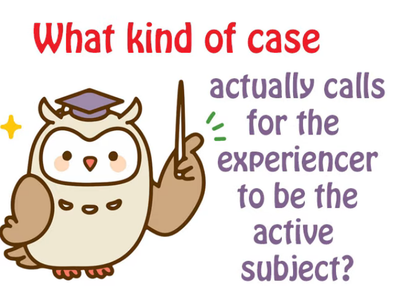
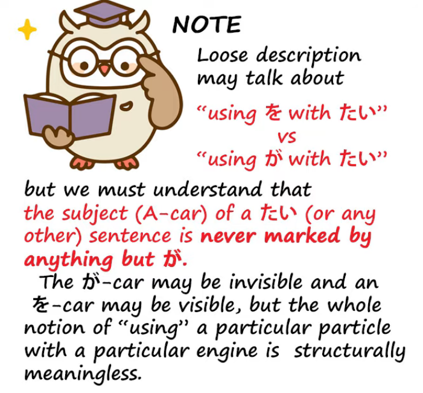
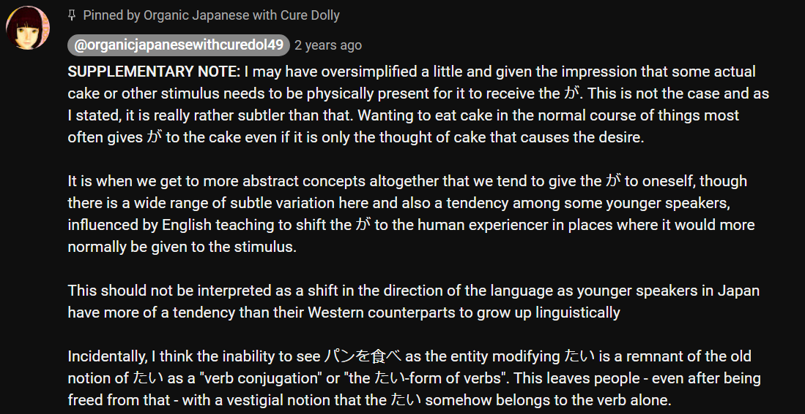

# **88. Xをしたい vs Xがしたい** 

[**The Indestructible Core of Japanese. How the logic never fails. Xをしたい vs Xがしたい | Lesson 88**](https://www.youtube.com/watch?v=Gi3BmIRZZPs&list=PLg9uYxuZf8x_A-vcqqyOFZu06WlhnypWj&ab_channel=OrganicJapanesewithCureDolly)

こんにちは。

Today we're going to talk about

the core fundamental structure of Japanese

and a problem that troubles some people about it,

which I've tried to lay to rest *(Lesson 43)* but there's still some difficulty,

I think, so I'm going to try to tackle the question,

for what I hope will be the last time, today.

And in doing that we're going to look at a puzzle

that's posed by the title of a very popular work.

It's been a manga, an anime, a live-action movie:

<code>**君の膵臓を**食べたい</code>, which means literally <code>I want to eat **your pancreas**</code>,

and we'll talk about why it literally means that in a minute.

I didn't actually know what a pancreas was.

I thought it was a railway station in London.

But apparently it's a component that you find inside

the human body and things don't go so well without it.

I'm not very clear on what you find when

you take off the front and back panels of a human body,

so we learn something new every day!

That's why this is classified as an educational channel, I suppose.

So, the question that will be raised by this title

in the minds of anybody who's got some grasp of the real structure of Japanese, is:

## Why is the particle を used instead of the particle が here?

**Why is the particle を, rather than the particle が, used here?**

If we want to say what in English would be  
<code>I want to eat that **bread**</code> or <code>I want to eat that **cake**</code>, we would say  
<code>パン**が**食べたい</code>, <code>ケーキ**が**食べたい</code>.

And, as we see, **the adjective <code>たい</code>**,  
**the adjective of desire <code>たい</code>, is pointing not at me but at the cake.**

**The cake carries the が-particle, so that is what the adjective is describing.**

---

And confusion ensues *(Lesson 9)* when we actually translate this as literally meaning **  
<code>I want to eat cake</code>, because that's not what it means.**

****It means** <code>cake is want-inducing (to me)</code>.** *(私は) ケーキが食べたい。*

---

**But we also know that this adjective of subjectivity, like other adjectives of subjectivity,**

**like <code>怖い</code> (frightening), and also potentials like できる or 食べられる --**

**because potential is also a kind of subjectivity.**

---

**It's something peculiar to the individual, whether they can or can't do a particular thing.**

**It's not inherent in the thing itself.**

**That would be <code>可能性</code>.**

---

**We know that all of these generally point at the thing that's possible, the thing that**

**induces the desire to eat, the thing that's scary, etc.**

**But also the polarity can be flipped.**

**And it's flipped particularly when there isn't an actual cause, an actual visible or**

**tangible cause of the subjectivity.**

## The polarity flipping

So if we say, <code>お腹が空いた、 *(zeroが)* 早く食べたい</code>, *- there seem to be 2 clauses, I guess?*

we're saying <code>Tummy is empty, I want to eat soon</code>.

**Now that <code>たい</code> is pointing at me, not at any particular thing, like cake or anything else.**

Now, this is the point that a few people have actually resisted and said,  
"Well, can't we say that it's not really saying 'I want to eat',  
it's saying 'food in general is making me want to eat'?"

**Well, it isn't actually.**

**It's your empty tummy that's making you want to eat.**

And we're going to look at some constructions today, and the one we've just talked about

is one of them, that make it a 100% clear that **not only in cases where there isn't a**

**cause of the subjectivity, but in some cases where there is,  
the adjective of subjectivity can still flip its polarity.**

Now, why do people resist this idea?

**As a matter of fact, it's not unknown even in English.**

We can say <code>*We* were **happy** that day</code>, in which case **the adjective <code>happy</code> is pointing at us**

(we're the ones that were happy) or we can say

<code>That was a **happy** *day*</code>, and now **the adjective of subjectivity is pointing at the day, which is the cause of our happiness.**

We can say <code>*I* am **suspicious** of her behavior</code> and **the adjective <code>suspicious</code> is pointing at me**

(I'm the one who's suspicious)

or <code>*her behavior* is **suspicious**</code>, and now **the adjective <code>suspicious</code> is pointing at her behavior as the cause of my subjectivity.**

So this isn't something that doesn't happen, even in English.

For the reason, I think, that people become so agitated about this and so determined to find

quite unlikely ways of wriggling out of it is perfectly understandable.

It's because they may have spent months or even years in this terribly confusing world

where particles just change their meaning depending on which side of bed they got out of that morning.

::: info
(Dolly here 👇 is making an example of the confusing <code>trying to force English into Japanese</code>)  
:::

So, "<code>が</code> usually marks the subject of a sentence but it can also mark the object of a sentence

as in **<code>パンが食べたい</code>**, in which obviously the bread isn't the subject of the sentence;

it's me, 'I want to eat bread'."

**Well, we know that this isn't the case.**

**We know that in those cases it's the bread that's the subject;**

**it's the bread that's making me want to eat.**

---

And if we start saying  
"That the polarity can flip, doesn't that either break the model of Japanese structure  
that gets rid of all these ambiguities or introduce new ambiguities

so, ooh there are special rules that sometimes it points this way and sometimes it points

that way", well, the answer to that is no, it doesn't matter to the model.

**It's quite irrelevant to the model.**

**Whether we choose** to say <code>パン**が**食べたい</code> (bread is making me want to eat) or

<code>パン**を**食べたい</code> (I want to eat bread) **doesn't matter.**

**The only thing that matters to the model is that the particles are always doing the same thing.**

If we say <code>**パンが**食べたい</code>, we're saying <code>**The bread** ***(=Subject)*** is making me want to eat</code>.

*vs*

If we say <code> *(zeroが)* **パンを**食べたい</code>, we're saying that <code>(I) want to eat **bread**</code> *(=Direct Object).*

::: info
Here, zeroが is the implied/hidden <code>I</code> Subject, while パンを is the Direct Object = bread.
:::

**And the model doesn't care which way we say it.**

**The model is doing the same thing either way.**

**All the particles are doing exactly the same thing.**

## How to justify the model grammatically?

Now, can we justify this grammatically?

So if we say, for example, <code>パン**を**食べたい</code>, surely the problem here is that  
**with <code>たい</code> we have an adjective, so we have an adjectival sentence,  
and an adjective, as we know, can't take a direct object.**

So how can we say <code>パンを食べたい</code>?

And the answer to this is really very simple.

**Japanese, as we know, is very adept at gluing**

**verbal elements together to make them into**

**one element or taking them apart at will.**

**And what's going on in a sentence like <code>パンを食べたい</code> is that  
**<code>たい</code> is no longer being attached simply to the verb <code>食べる</code>.****

---

**We're not saying <code>パンを</code> and then <code>食べたい</code>,**

****we're saying <code>パンを食べ...</code> and <code>たい</code> is being attached to that entire unit.****

****What we want is the action <code>パンを食べる</code>, so we can attach the <code>たい</code> to that entire unit.****

**That's what makes sense of these constructions.**

---

And while <code>パン**を**食べたい</code> **is a less common way of putting it**, and in general

<code>何々**を**食べたい</code> is the less common way of putting it,  
**there are some kinds of sentence in which it is the one that we always use.**

For example, <code>助けたい</code> (want to help) or <code>守りたい</code> (want to defend).

**We don't say** <code>さくら**が**守りたい</code>,

**we say** <code>さくら**を**守りたい</code>.

**And if we're talking about <code>正義</code> (justice) or <code>平和</code> (peace) or even <code>国</code> (country), it's the same.**

**We don't say Sakura is making me want to defend her, we don't say the country is making me**

**want to defend it, we don't say justice is making me want to defend it, or peace is making me want to defend it.**

We always say <code>I want to defend **Sakura**</code>, <code>I want to defend **justice**</code>,

<code>I want to defend **peace**</code>, <code>I want to defend **the country**</code>.  
*(all as Direct Objects instead of Subjects as shown above since they are used with を particle)*

Why is that?

Well, essentially **I think the reason is that we are not talking about an impulse desire.**

**If we look at bread and we want to eat it**, <code>Ah, パン**が**食べたい</code>

(**bread's making me want to eat it**).

---

**But we're talking here about things that are more abstract, things that are less impulsive.**

**And in the case of people, it's more respectful to say**

<code>さくら****を****守りたい</code> than <code>さくら**が**守りたい</code>,

**because we're not saying that Sakura is an object** *(implication-wise, grammar-wise she is:D)*

**that makes me want to defend her, like a piece of bread that we might want to eat,**

**we're saying that the action of defending her is something I want to do,**

**which is more dignified in the case of a person.**

---

**But in the case of, say, the country, or peace, or justice, or even a house or a park,**

****we're talking about something less impulsive and more a decision of our own,****

**if not a conscious decision, then a mindset, a way of thinking that is ours.**

**So we talk about that action **as our own** rather than something induced by the external cause.**

---

If we do say <code>パン****を****食べたい</code>,

**this is likely to be in conditions where we're talking a little bit more generally,**

**we're not talking about that particular lovely smell of bread by which**

**the bread is making us want to eat it.**

**We're not talking about some candy we've just seen that's making us want to eat it.**

****We're talking about the general desire to eat bread.****

---

So **we're more likely to say** <code>**パンを**食べたい時</code> (when I want to eat **bread***=Direct Object*)

::: info
In the sentence above, <code>I</code> should be the Subject, which is hidden in Japanese as zeroが.
:::
****than**** <code>**パンが**食べたい時</code> (when **bread***=Subject* makes me want to eat it).

****And this isn't a firm and definite rule but this is the kind of tendency,****

**the kind of reason, the nuance, which decides which way**

**we're likely to flip that adjective of desire, in this case, <code>たい</code>.**

## So why is を used in 君の膵臓を食べたい?

So if we come back to <code>君の膵臓**を**食べたい</code>, **why is を being used here?**

Well, essentially **because again this is not an impulse to eat.**

**We're not looking at the girl's pancreas and thinking how delicious it is.**

That would be rather hard to do anyway.

**Something subtler, something more abstract, something deeper, is being talked about here,**

**the desire for some emotional and quite complex reason to eat somebody's pancreas.**

So I hope this time we really laid to rest the final question of polarity switching *(of Lesson 43)*.

**It does not threaten the model. And it does happen.**

****And it happens for reasons which are a little subtle, that will probably take time to ingest****

****and immersion to ingest, because you can't learn everything through raw structure.****

::: info
Read [****THIS COMMENT TREE****](https://www.youtube.com/watch?v=Gi3BmIRZZPs&lc=UgyOhoQLaj1rzfKcTWV4AaABAg&ab_channel=OrganicJapanesewithCureDolly) where Dolly gives some useful info about が use.  
It also slightly touches over the cases where there are 2 visible logical particles like が or を in a single clause, since it can happen at times such as with a compound Adjective like 頭がいい.
*Also, [**this one**](https://www.youtube.com/watch?v=Gi3BmIRZZPs&lc=UgziEAPSnr0SnhrQT8Z4AaABAg.9I_i6CnMTAb9I_ko3FwzJU&ab_channel=OrganicJapanesewithCureDolly) can be useful if the たい stuff used with を is a bit confusing, [**same for ない**](https://www.youtube.com/watch?v=Gi3BmIRZZPs&lc=UgzdlJPBSPKfEnC5CTt4AaABAg.9KGUKbPabp79KHKmr1rRl_&ab_channel=OrganicJapanesewithCureDolly).*

*Hopefully it can be read/understood well enough & is not too bloated, but there was so much important stuff mentioned here that I had no other choice, really, to the point I even had to resort to bolding at times to make it clearer. Definitely recommend reading through the comments.*
:::