# **89. De-mystifying Japanese. The Universal Subject** 

[**De-mystifying Japanese. Let the world's most logical language shine! The Universal Subject Lesson 89**](https://www.youtube.com/watch?v=CEgGnitwXGA&list=PLg9uYxuZf8x_A-vcqqyOFZu06WlhnypWj&ab_channel=OrganicJapanesewithCureDolly)

こんにちは。

Today we're going to talk about something that is the very basis of Japanese

and that we've talked about right from the very first lesson.

**And that is, the grammatical subject, what we call, in train language, the <code>A-car</code>.**

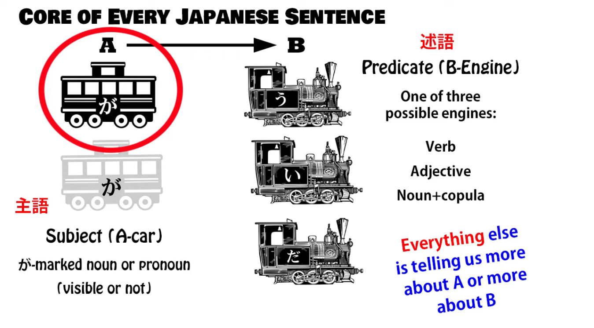

And as we know, every Japanese sentence has to have  
**an A-car, a subject, a <code>主語</code> in Japanese**, and  
**a B-engine -- that's the predicate, or the <code>述語</code> in Japanese.**

**In other words, every sentence is saying something about something.**

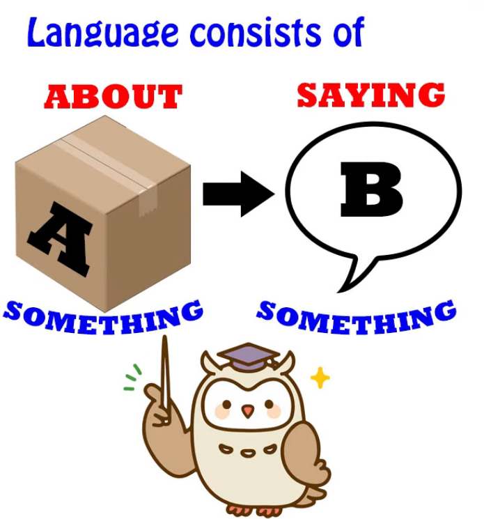

Now, some people argue that there's no subject in Japanese;

some teachers do this, including Tae Kim-sensei, and

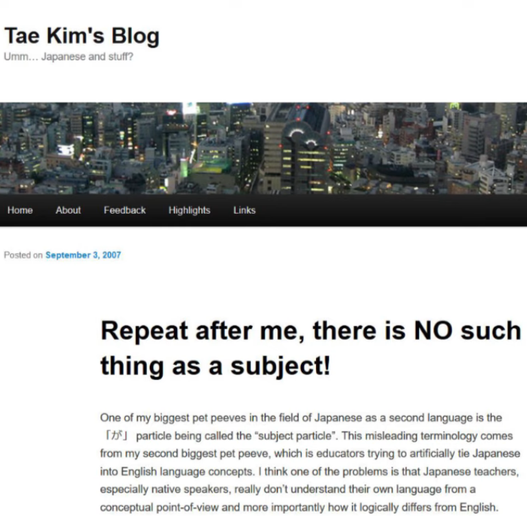  
generally this is because they don't have a very good grip on how the language actually works.

Some Japanese people, a minority of linguists, also propose a no-subject model for Japanese.

::: info
Again, this is simply due to the difference in models, just like how Dolly proposes there is no conjugation or passive. Usually, in terms of NATIVE-derived Japanese grammar linguistics, if something is called as x, it is linguistically viable to use it for description of the language, but some models have their own systems that either agree with them or not, for various reasons.  
Just like Dolly says below, these models are there to just describe the language in some coherent chunk while finding some common ground, but they may differ in some instances.  
It is up to you which model you will use, eventually you should achieve fluency either way once you don’t need explanations and terminologies anymore and you have the language automatised, but it helps studying the general consensus in most (esp. native) linguistic models.

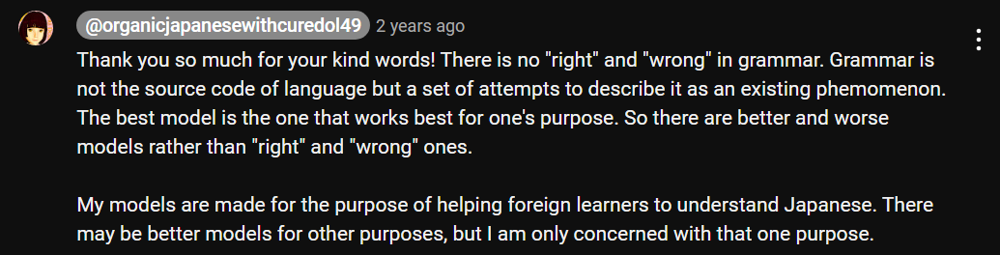
:::

**As I've said before, grammar, structure, models, whatever you want to call them,**

**are not the source code of language. They are means of describing language after the event.**

**So it may be possible to devise a model for Japanese that doesn't use the idea of the subject,**

**but really this is just going to be shuffling terminology around.**

I had a Japanese person rather angrily coming into my Comments and saying

that I'm Westernizing Japanese by bringing in the concept of the subject.

Now, I think if you know my work, you know that I don't Westernize Japanese.

I teach Japanese as Japanese.

**Whether non-subject models are really valid or not, I don't know. I haven't looked into them.**

**But what we do need to show is that the subject model that we use and that most**

**Japanese linguists use works and works all the time, completely, reliably and predictably.**

## The <code>Null-Subject</code>

**Some languages are termed <code>null-subject languages</code> in linguistics, which doesn't**

**really mean they haven't got subjects, it means that their subjects aren't always visible,**

**which is exactly what we have in Japanese.  
::: info
This invisible Subject thing is much easier to grasp in Japanese if your native language has it too like that (obviously). Which is why English natives tend to (obviously) struggle with it due to how English mostly needs directly voiced/visible Subject & why there are those confusing explanations that try to force the English <code>Subject must be voiced/visible</code>-way onto Japanese.
:::

In Spanish, for example, **we don't generally say**, <code>**Yo** soy Americana</code>, although

we're taught to do that by the textbooks. **And the reason we don't is that <code>yo</code> is redundant.**

**<code>Soy</code> implies <code>I</code>, so if we just say <code>Soy Americana</code>, that's all we need to say.**

**Everything else is redundant. The same is true in English.**

If we say <code>I am American</code>, we actually don't need the <code>I</code>, because <code>am</code> implies <code>I</code>.

**We don't use <code>am</code> with anything other than <code>I</code>, so the <code>I</code> is redundant.**

**It's just that English doesn't permit you to drop it. So it's just a matter of rules.**

Japanese doesn't work this way, because Japanese doesn't have conjugations like

<code>am / is / are</code>. In fact, it doesn't have any conjugations at all, despite what the textbooks say.

**In Japanese the null subject is determined entirely from context.**

**And when context doesn't make it clear, it generally defaults to <code>I</code>.**

---

**This is almost exactly what English <code>it</code> does, except that <code>it</code> in English isn't zeroed.**

So if I say <code>**It** fell from the sky / **It** ate my breakfast / **It**'s half the size of the other one</code>,

**you have no idea what <code>it</code> is unless context supplies the answer.**  
**This is how the zero-pronoun works in Japanese.**

**The fact that we can see and hear <code>it</code> and we can't see or hear the zero-pronoun makes no difference to all of this.**

So if we take the kind of sentence that people try to call <code>subjectless</code>,

let's take a sentence like <code> *(zeroが)* 疲れた</code>.

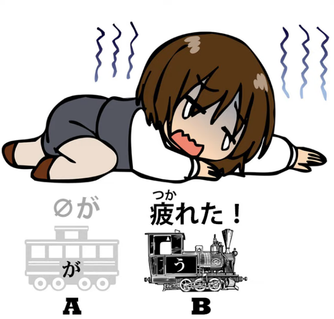

**Now, literally this just means <code>Tired</code>, so it could be called a subjectless sentence,**  
**but it absolutely isn't** -- unless you want to avoid the term <code>subject</code> for reasons of your own.

When we say <code>疲れた</code>, **we're not saying that the rabbit in the moon is tired.**

**We're not saying that Mickey Mouse is tired.**

**We're not saying that tiredness settles like a purple haze over the known universe.**

**We are saying <code>I am tired</code>.** If that wasn't the case, Japanese wouldn't be a language,

because we couldn't do the basic thing that a language needs to do,

which is to make Statement B about Thing A.

If I look at a girl and say <code> *(zeroが)* 綺麗なのね?</code>

**again, I am not saying that the rabbit in the moon is pretty or that life in general is pretty.**

**I have a very clear subject known to both myself and the hearer.**

## Indeterminate Subject

**Now, there are cases where we have an indeterminate subject**, and some people

might try to argue that these at least are our mystical subjectless Japanese sentences.

**But actually they're no different from their English equivalents.**

So we might say <code> *(zeroが)* 晴れそうだ</code>, which means <code>*(***it***)* looks like being fine</code>.

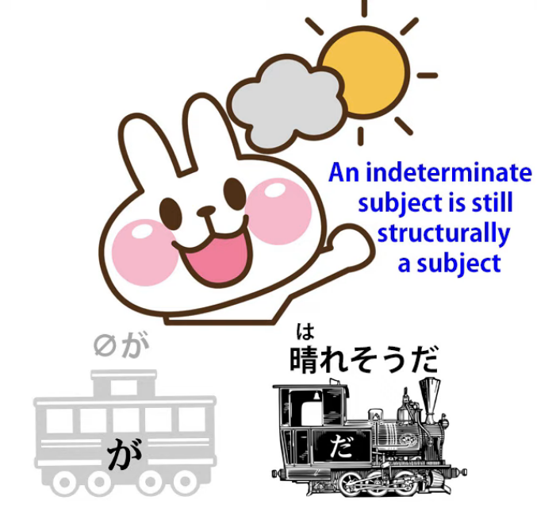

And you can ask <code>What looks like being fine? The weather, the day, this part of the world?</code>

**There isn't an exact answer.**

**And of course this is the same in English and Japanese. The subject is indeterminate.**

**In English we know there's a subject because its place is held by <code>it</code>.**

**What about Japanese?**

**Are we just shoehorning a subject in? No, we aren't. Notice <code>だ</code>, the copula <code>だ</code>.**

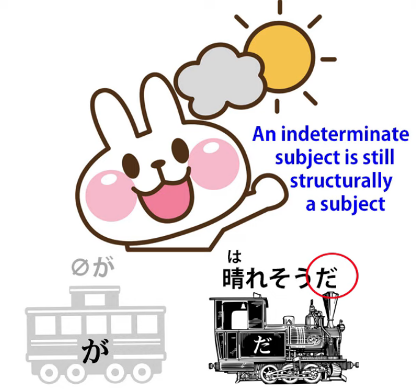

We all know what <code>だ</code> is *(Lesson 79)* (& if you don't, [**I'll link a video**](https://www.youtube.com/watch?v=euHYPcMoao4) so that you can follow it up). *  
*---

**The copula tells us that one thing is another thing.**

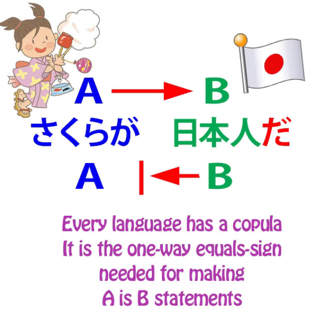

If we say <code>Roses **are** flowers / Mary **is** an artist / Today **is** Saturday</code>

**we're joining one thing (the subject) to another thing (the predicate),  
or the A-car to the B-engine.**

**This is what <code>だ</code> does and it's all that it does.**

**So we know that this sentence has a zero-subject even though it isn't place-marked by <code>it</code>.**

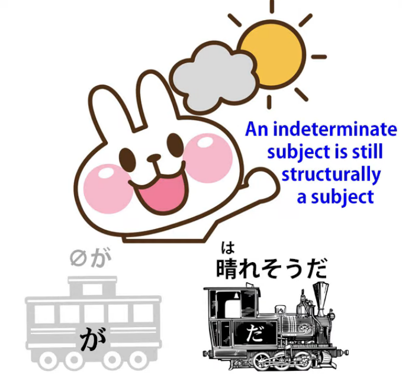

**We can't see it, we can't hear it, but we know for a fact that it's there,**

**because without it <code>だ</code> makes no sense at all.**

## Really Subjectless sentences in Japanese

**Now, there is actually one kind of sentence in Japanese that really is subjectless.**

You can find it in English too, but it's a little more common in Japanese -- but not all that common.

And **it's a sentence like** <code>大阪にたどり着いた桜たち</code> **or** <code>恥ずかしくなったハナコ</code>.

::: info
I put the name Hanako into Katakana in the second example sentence.
:::
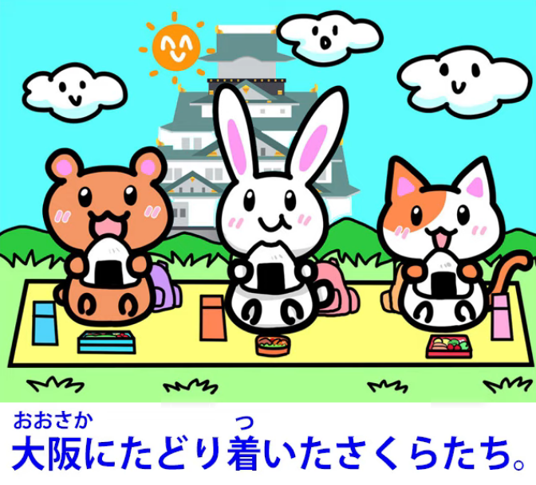

**These are not in fact sentences, and they wouldn't be seen as sentences by most linguists**

in Japanese. **What they are is simple modified nouns.** So we're saying

<code>Arrived-at-Osaka Sakura and friends</code>. **We're not saying <code>Sakura and friends arrived at Osaka</code>.**

**We're simply saying <code>Sakura and friends</code> and modifying them**

**with the modifier <code>arrived-at-Osaka</code>.**

**<code>恥ずかしくなったハナコ</code> -- We're not saying <code>Hanako became embarrassed</code>,**

**we're saying <code>Embarrassed Hanako</code>.** ::: info
Or I guess <code>Hanako, **who became embarrassed**…</code>* 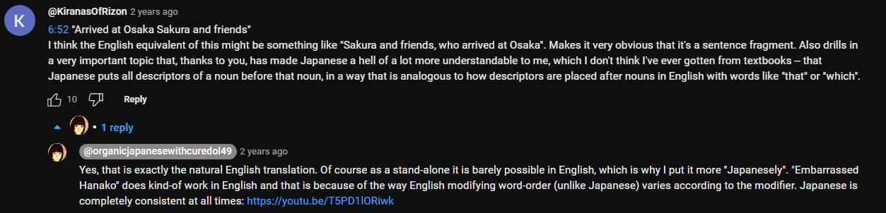
:::
::: info
Sorry for the bad zoom, got <code>Youtubed</code> again. This kind of modifying can be basically translated into English as sort-of a relative clause. The link by Dolly references Lesson 46.
:::
When do we use <code>sentences</code> like this?

Well, not very often, but **they can get used in narrative,**

**because what they're essentially doing is either summing up something that**

**went before** -- you particularly often see this in, say, games where when you load up

they give you a quick resume of what's already happened -- or where you're describing the result of something that's happened: <code>And the result was, **an embarrassed Hanako**</code>.

**This really is, I think, the only example we can find of what might be called a subjectless**

**sentence, but it's not really a subjectless sentence because it's not a sentence.**

**It's simply a noun with a bit of modification.**

**So if you encounter these,** and you will encounter these from time to time if you're doing immersion, **you haven't found a subjectless sentence,  
you have found a particular narrative technique**

**that occasionally gets used in Japanese.**

It certainly doesn't add any strength to the arguments of people who say that there's no subject in Japanese, because these are a very small minority of so-called sentences and they certainly don't influence the fact that **a real sentence that's telling us something about something always has an A-car and a B-engine, a subject and a predicate.**

If you have any questions or comments, please put them in the Comments below and I will answer as usual. I'd like to thank my Gold Kokeshi patrons, who make these videos possible,

and all my patrons and supporters on Patreon and everywhere.

Thank you all for making this possible and for helping us to dispel the myths and confusion

and the general fog that surrounds Japanese.

I think there's a feeling in the West that Japanese is somehow a foggy language that

doesn't work like other languages, and there are one or two Japanese people who, perhaps

for nationalistic reasons, for wanting to stress the uniqueness of Japanese, play up to this idea.

Well, that doesn't really matter because their audience is fundamentally Japanese

people whose Japanese isn't going to be ruined by a strange model of the language.

Yours, on the other hand, is best kept on the strait and narrow of

straightforward subject-predicate analysis. Thank you for watching this lesson…

::: info
This is interesting, if hard to read, see it* [**here**](https://www.youtube.com/watch?v=CEgGnitwXGA&lc=UgxdWaF1pzid_StWEB14AaABAg&ab_channel=OrganicJapanesewithCureDolly)*. Recommend reading through all comments.
:::
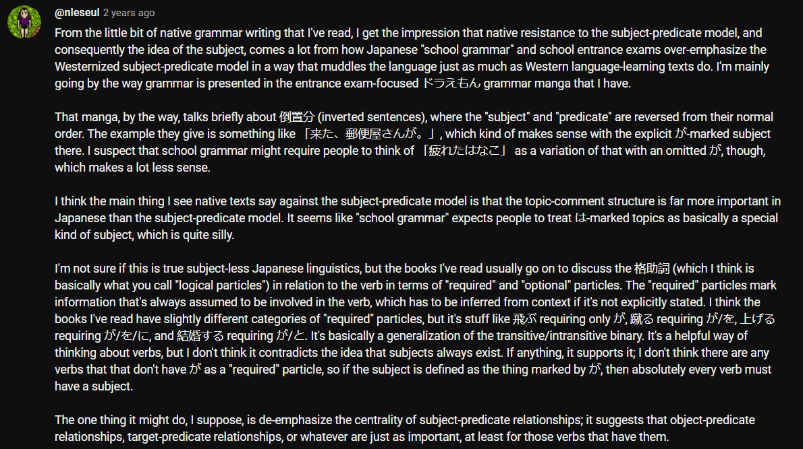

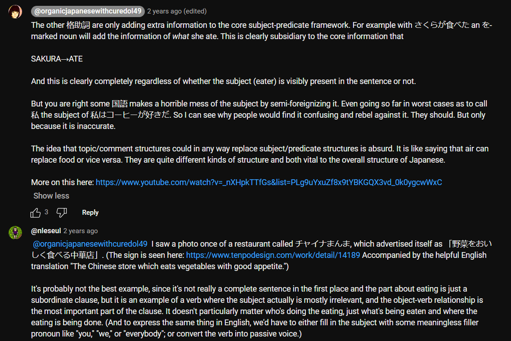
