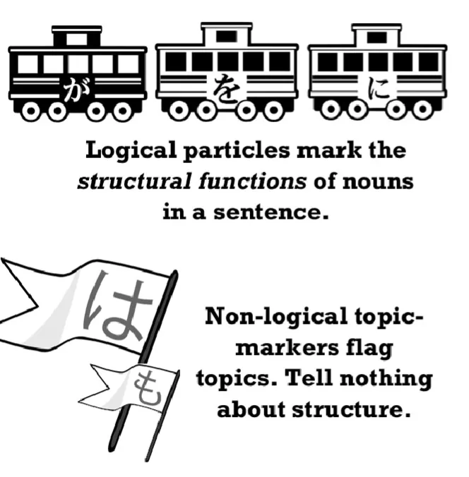
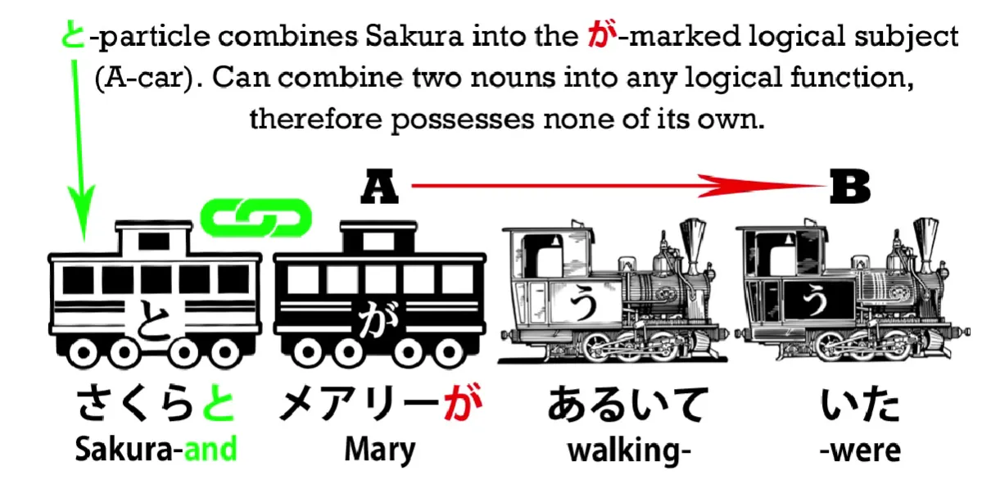
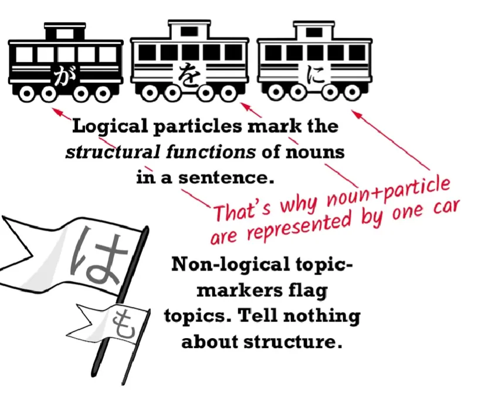
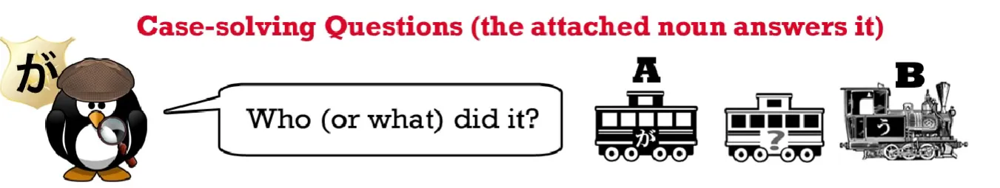
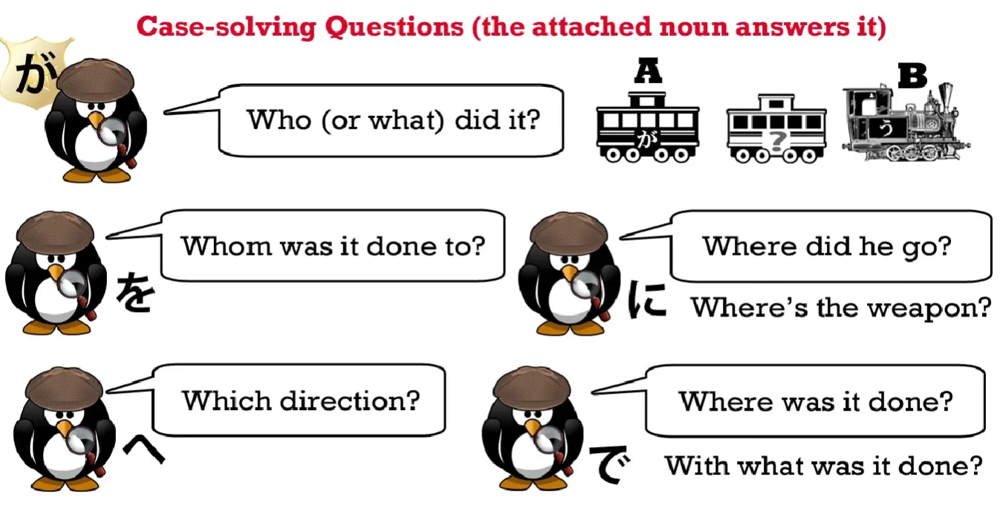
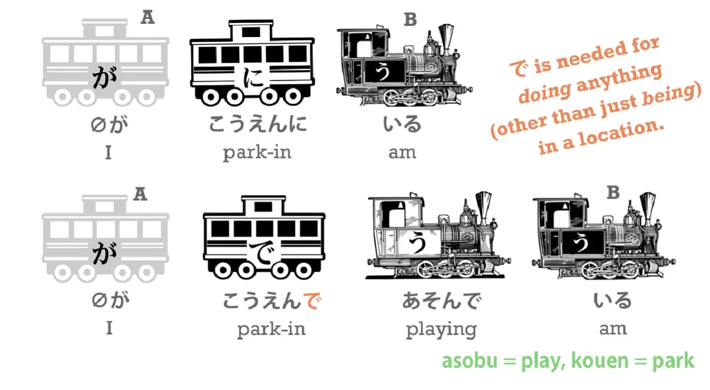
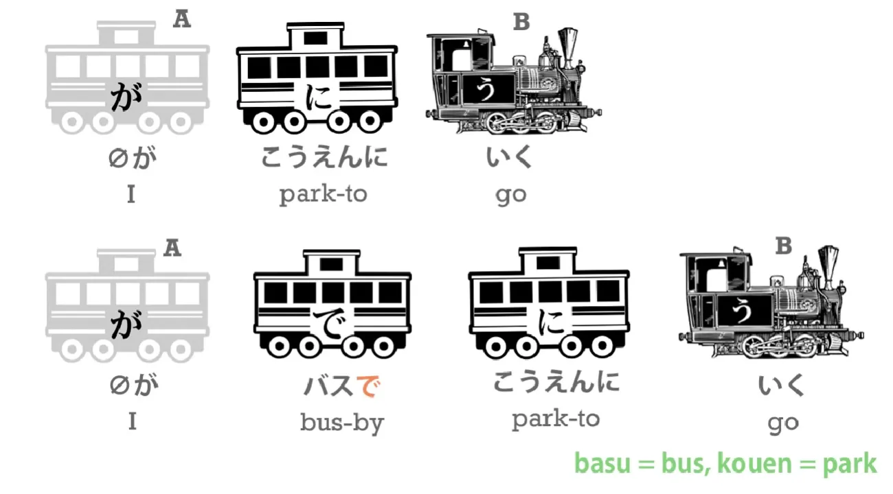

# **8b. Particles explained.** 

[**Lesson 8b: Japanese particles explained. How they REALLY work.**](https://www.youtube.com/watch?v=dwcTI9qvO-U&list=PLg9uYxuZf8x_A-vcqqyOFZu06WlhnypWj&index=10)

こんにちは.

Today we're going to get the key to every Japanese sentence. We're going to do a round-up of the logical particles – and **the logical particles are the linchpins of Japanese.** With a full understanding of what they do you can understand every Japanese sentence. Without it, you can't. 

And that's why the Japanese taught by the textbook which doesn't explain the logical particles correctly leaves most learners non-functional in Japanese even after they've passed exams. So, I'm going to do a round-up of the logical particles we've learned so far and I'm going to introduce the last major logical particle, which is the で-particle. 

I'm going to do this with an analogy of detective work, **because the logical particles essentially interrogate the nouns in the sentence and show how they relate to each other and to the verb of the sentence, and they give the structure of the sentence.**

And this is what a logical particle is. People sometimes ask <code>What do you mean by a logical particle?</code>

We've already discussed the difference between a logical particle and a non-logical topic-marker. **A logical particle tells us how the sentence logically holds together.** **It tells us who does what to whom, with what, where, when and so forth.** **The は-particle doesn't do this, it just tells us what is the topic we're speaking about.**

---

There are other particles that I would call a-logical. They're not non-logical topic markers, but they're not logical particles either. For example, **the particle -と adds two nouns together.** So if we say <code>さくらとメアリーがあるいていた</code>, we're saying <code>Sakura and Mary were walking</code>. **The が-particle tells us who was doing the walking.** **The と-particle simply adds those two together. It doesn't tell us anything about what they were doing, where they were going, or anything else.** 

So, **the logical particles are the ones that tell us what is actually happening in the sentence.** The other thing to remember about logical particles is that **they always attach to a noun.** If you see a logical particle attaching to anything, you know that that word is in fact functionally a noun. And **we must always see the noun plus the particle attaching to it as an inseparable pair.** The two work together.

They are a question and an answer which form a fundamental unit of a Japanese sentence. All right. So let's look at this.

## Particle が

The head of the Logical Particle Detective Agency is Detective が. 

He is the Chief. **He has to be in every case.** **There can't be a sentence without が**, as we already know, **although sometimes you can't see him** because he's in disguise, just like Sherlock Holmes is sometimes in disguise. He also has powers that the other logical particles do not have. **He can work in A-is-B sentences, that is, descriptive sentences, sentences that tell us what something is, what its qualities are.**

---

**The other particles can't do that.** They can only work in A-does-B sentences, that is, sentences with a verb engine. To put it another way, while Detective Ga works in the office with descriptive work, the other detectives only work on cases, on actual actions, on incidents, on verb-ending clauses. So, let's look at them all at work on a verb-ending clause. Each of them has its own specific questions. Detective が asks the fundamental question: <code>Who did it?</code>

This is the fundamental question of any sentence, and for that reason, only Detective が's carriage can be black. 

Because **the core of every sentence is <code>who did the action?</code>** So が asks, <code>Who was the actor? Who dunnit?</code> and that forms the core of the sentence. The other logical particles ask other questions about the incident which give us a complete picture of the event. We won't usually see all of them in any one sentence.

## Particles を, に, へ

**Detective を asks <code>Who was it done to? Who was the receiver of the action?</code>**

**Detective に asks <code>Where did he go?</code> or <code>Where is the weapon?</code>** 

に asks where someone or something went to or where it is.

**Detective へ asks <code>In what direction did he go?</code>** 

Now, this is very close to Detective に's question, isn't it? 

But we may not actually know where he went, so the answer to that question could be north, south, east or west, **and that's the kind of question that に can't ask.** Or it could be <code>He went in the direction of Sakura's house</code>, and that's very close to the question that に does ask. So they overlap to quite a degree.

## Particle で

Now let's look at Detective で.

**Detective で asks the question <code>Where was it done?</code> and the question <code>With what was it done? What was the weapon?</code>**

If we say <code>(zeroが)こうえんにいる</code>, we're saying <code>(I) am in the park</code>. But if we want to say <code>(I) am *playing* **in** the park</code>, we have to say <code>(zeroが)こうえん**で***あそんで*いる</code>, because **to express that we are doing something in a place rather than just being there, we have to use で.**

And **we also use で to express the means (in terms of a noun) by which we do something.** So if we say <code>(zeroが)こえうんにいく</code>, we're saying <code>(I) go to the park</code>. But if we say <code>(zeroが)バス**で**こうえんにいく</code>, **we're saying the means by which we go to the park, in this case a bus.** 

If we say that we knocked in a hammer with a nail or ate food with chopsticks, **we use で for the thing we did it with.** If we say <code>(zeroが)にほんごをはなす</code>, we're saying <code>(I) speak Japanese</code>, but if we say <code>(zeroが)にほんご**で**はなす</code>, we're saying <code>(I) speak with Japanese **Japanese is the means by which** (I) speak</code>. So this is equivalent in English to saying <code>I speak in Japanese</code>, but as you can see, the Japanese construction is more logical because that actually is what we're doing, **we're speaking by the means of Japanese.**

---

The other question, of course, that **Detective に** can ask is  <code>Who was the target of an action done to something else?</code> *but we've already discussed that in the に lesson. (Lesson 8)* So this covers all the basic functions of the main logical particles, and as you can see, these are the particles that tell us what's going on in any Japanese sentence. If we understand them, we can understand the sentence; if we don't understand them, we can't. So if we get confused by the logical particles, which we will if we take the textbooks seriously, we'll have a lot of trouble understanding Japanese.

**Don't confuse the particles and they won't confuse you.**