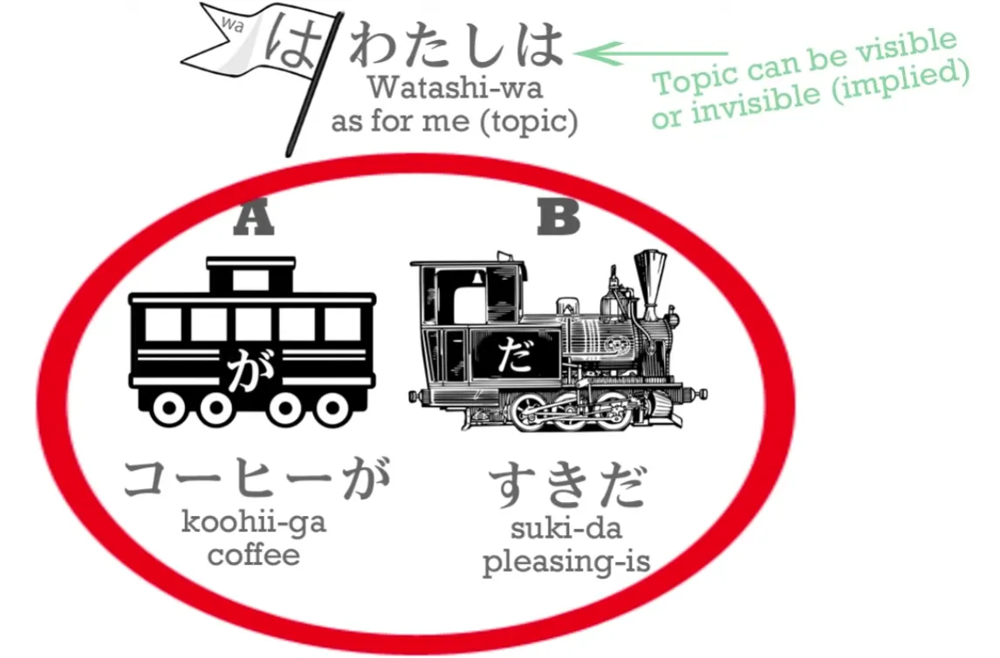

# **9. The Subject of the Japanese Sentence & Expressing Desire: ほしい, たい, たがる**

[**Lesson 9: How textbooks DESTROY your Japanese: No 1 Secret! + Expressing desire: hoshii, tai, tagaru**](https://www.youtube.com/watch?v=vk3aKqMQwhM&list=PLg9uYxuZf8x_A-vcqqyOFZu06WlhnypWj&index=11)

## The Subject and ego in Japanese vs English

Japanese and English have very different world-outlooks. In some ways they are diametrically opposed. 

**English is a very ego-centric language.** And this isn't some kind of a moral statement: **I'm talking about grammar.** **English wants to have an <code>ego</code> as the main actor, the center of every sentence, if it possibly can.** Preferably <code>me</code>, if not <code>me</code> then someone else, and if not a person then at least an animal. It has to be some kind of <code>ego</code> actor. 

::: info
**Dolly seems to refer to Subject as the Actor sometimes and uses them interchangeably it seems, so just keep that in mind that by Actor she SHOULD mean Subject.** This use may become confusing later in the Passive/Receptive if you know some basic linguistics… but maybe just a <code>me</code> problem…
:::

**Japanese doesn't work like that at all. It's very happy to have non-sentient beings as the main actor of a sentence. You might call this a more animist way of looking at language.** Now, this may sound rather abstract, but it's not abstract at all. Let's get into some concrete examples. I'm going to begin with my favorite example, and if you've heard it before, don't go away because we're going much deeper this time. 

My favorite example is: <code>わたしは**コーヒーが**すきだ.</code> Now, we can have the <code>わたし</code> or we can not have it *(or rather do not need to have it)*; it will be understood whether we say it or not.

What the textbooks and the schools and everybody else tells you is that this means <code>I like coffee</code>. And <code>I like coffee</code> may well be what we would say in English if we wanted to say something similar, **but it's not what this sentence means.** And if you've followed the course up to this point, you can see why it isn't.

---

**The first and most important point here is – look where the が is. The が is marking the coffee.** **We know that the main actor** *(Subject in Active voice)*, **the doer or the be-er of a sentence, is always marked by が**, so we know that the main actor of this sentence **is not <code>わたし</code> –<code>I</code>**, **it is the coffee, which is marked by が.**

**<code>わたし</code> could have an invisible が after it, but in this case it can't**, because **we already know what the が is, it's the coffee. So the coffee is being or doing something.** **In English** we are told that it is an <code>A **does** B</code> sentence, but we only have to look at it to see that **it isn't**. **It ends with <code>だ</code>** – it's an <code>A **is** B</code> sentence, isn't it?

**The coffee is <code>すき</code>.** So, what does <code>すき</code> mean? **<code>すき</code> is a noun, and it's one of those adjectival nouns that we've talked about before.** So it's telling us something about the nature or condition of the coffee. In this case, **what it's telling us is that the coffee is pleasing. That's the core of the sentence: <code>Coffee is pleasing.</code>**

**The <code>わたしは</code>, implicit or explicit, is telling us in whose case it is pleasing:** <code>**As for me**, coffee is pleasing.</code> **Now, this is very very very important.** **Because if we don't know that, if we really believe that this sentence means <code>I like coffee</code>, our grasp of が and を is completely messed up.**

---

**If the actor of this sentence was <code>わたし</code>, it would have to be marked by が.** **If the thing that the actor was acting upon, by liking it, was the coffee, then it would have to be marked by を.** So we have two particles, and two most fundamental particles, completely confused in our mind. We now believe that sometimes が can mark the object of the sentence instead of the subject, the thing acted upon instead of the be-er or doer of the sentence. And we now believe that the object of the sentence, the thing being acted on, can sometimes be marked by が instead of を. **And none of this is true. It never can. That can never happen. And if that could happen, Japanese would become chaos. And that's exactly what it does become in the minds of many students.**

---

So, as we see in this sentence, **<code>わたし</code> is the non-logical topic of the sentence.** **It's marked by は. It's not the actor. It's not the subject.** **<code>コーヒー</code> is not the object, which would be marked by を if it was.** **It is the subject.** **And <code>すき</code> is not a verb meaning <code>to like</code>; it's an adjective meaning <code>to be pleasing</code>.**

---

So every single word in this sentence is being misdescribed by the standard explanation. And this kind of misunderstanding throws Japanese into complete chaos. Now, are there many cases like this in Japanese?

Well, frankly, it doesn't matter if there are many or not. Once your understanding of the particles is messed up, it's messed up. But as it happens there are a lot. All kinds of different sentence structures in Japanese throw up this same misunderstanding.

---

For example, if we say <code>ほんがわかる</code>, or <code>わたしはほんがわかる</code>, we're saying **the book is understandable**, but the English texts tell you that this means <code>I understand the book</code>, and in this case it's even less forgivable, because there isn't really an equivalent to <code>すき</code> in English, but there is an equivalent to <code>わかる</code>. It means <code>understandable</code> or <code>clear</code>.

We could say <code>In relation to me, or just to me, the book is understandable</code>, **and then we wouldn't be completely messing up what が does or thinking that a noun that should be marked by を can be marked by が, at random.**

---

So why, at least in this case, don't the schools and textbooks simply translate it as it really is? <code>**To me, the book is understandable / Speaking of me the book is understandable**.</code> **Because this prejudice for putting an ego at the center of every sentence is so strong that it takes precedence over learning Japanese correctly.** And these are not just a few random cases.

Later on, we're going to look at the potential form *(lesson 10)* and we're going to look at the receptive form *(lesson 13)*, which is misdescribed as passive, and both of them are going to throw up forms of this same problem. Since they are both fairly large subjects in themselves, I'm not going to talk about them now. But let's talk about the way we desire things in Japanese. Let's talk about how Japanese handles desire. Whether we want something or want to do something, how do we talk about this in Japanese?

## Expressing desire with ほしい

Well, suppose we want something. Let's say <code>こねこがほしい</code>.

<code>こねこ</code> is a kitten: <code>こ/子</code> is child or small thing and <code>ねこ</code> is cat. And <code>ほしい</code> is translated in English as <code>want</code>. Now, if you look at it, the first thing you can see is that **it's not a verb. It's an adjective.** It ends in <code>い</code>, not in <code>う</code>. And the second thing you can see, which is the most important, is that **the が-marked actor of this sentence is not me, who wants the cat. It's the cat, who is wanted.**

So, what does <code>ほしい</code> mean? Well, quite simply, it means <code>is wanted</code>. 
::: info
It is an adjective.
:::
<code>In relation to me, the cat is wanted.</code> 
::: info
わたしはねこがほしい.
:::
And again, if we seriously believe that this means <code>I want a cat</code>, we're thinking that the が can mark the object of a sentence, the object of the action, the thing we're doing it to. So again, **we're being confused about the role が plays in a sentence, we're confused about the role を plays in a sentence, because the cat should be marked by を if it meant** <code>I want a cat</code>. **And we're confused between the verbs and adjectives.** So again **Japanese becomes a strange guessing game in which particles and kinds of word can change their meaning at random.**

## Expressing wanting to do something with たい

Now, suppose we want to do something. In Japanese we express wanting to do something differently from the way we express wanting to have something. **And the way we do it is by using the い-stem again.** The い-stem, as I told you before, is a very important stem. So in order to say we want something we have to add the **want-adjective**, which is <code>**たい**</code>. **So we now have an adjective.**

And what does this adjective mean? **It doesn't mean <code>want</code> in the English sense.** **It can't, because <code>want</code> is a verb and <code>たい</code>, ending in <code>い</code>, is an adjective, isn't it?** So let's take an example. This is a slightly notorious example.

<code>わたしはクレープがたべたい</code>.

Now, the standard English translation of this is <code>I want to eat crepes</code>. But, as you see, the pattern here is just the same as in the other cases we've been considering. **The が-marked actor is not <code>わたし</code>, it's not <code>me</code>, it's the crepes.** **The desirability of the crepes is not a verb, it's an adjective.** And we need to understand this because if we don't it's not just going to mess up this kind of sentence – it's going to mess up our whole grasp of Japanese words, Japanese particles and Japanese structure.

Now, **there's no really good way of translating this into English.** We would have to say something like <code>In relation to me, crepes are desire-inducing</code>. And that's very awkward. 
::: info
it is okay to use <code>want/wanting</code> as a translation. Just remember that たい is not a verb as <code>want</code> is in English, but is rather an adjective. Translations don’t matter, understanding does.
:::
And sometimes people ask me, "Am I really supposed to use all these awkward literal translations that you give, rather than using natural English?" And the answer to that is <code>No</code>. **You're not supposed to be thinking in terms of my awkward explanations or thinking in terms of natural English. You're supposed to be thinking of Japanese in terms of – guess what – Japanese.** I'm explaining it in English to give you a start toward doing that. **But these unnatural translations or explanations are there to help you grasp the structure of Japanese, not to give you a way of translating Japanese.** 

Now, as I say, the pattern is the same in all these cases, and I don't think it's very difficult to grasp. But now we're going to look at something which could seems a little confusing, and I promise you it isn't, if you just follow carefully what I'm going to say. We have this sentence here: <code>クレープがたべたい</code> but what if we didn't have the crepes here? What if we just said <code>(zeroが)たべたい</code>? **Now there's no longer in this sentence what English wants to call the object of desire, what is in fact the subject of desire, the desire-inducer, and obviously there has to be a が-marked zero-car or, as you know, we don't have a sentence.** But what is that zero-car in this case?

Well, the ironic thing is that in this case the zero-car is what the English textbooks thought it was all along. **It's <code>I</code>.**

I really am the actor of the sentence this time, and that may be part of the reason for a lot of the confusion that happens on this subject. <code>わたしがたべたい</code> means <code>I want to eat</code> – I don't want to eat crepes necessarily or Sakura's obento necessarily, I just want to eat. *(I eat-wanting-am)* And because there is no eat-inducing subject here, the want-to-eat is attributed directly to me. 

And you may be asking – you should be asking – "So, what is this -たい? Is it an adjective describing the condition of something making you want to do something, or is it an adjective describing my desire?" **And the answer is that it can be either.** **Obviously when it is describing a cake it's also indirectly describing my feelings about the cake, it's describing the feelings the cake induces in me.** And when there's no cake there, or no crepe here, or no Sakura's obento there, we just describe my feelings directly. And this is often the case in Japanese with adjectives of desire. For example, <code>こわい</code>, which means either <code>scared</code> or <code>scary</code>. If I say, <code>おばけがこわい</code>, I'm saying, <code>Ghosts are scary</code>, but if I say just <code>こわい</code>, I'm saying, <code>I am scared</code>.

Now, is this confusing? It isn't confusing because we have a landmark that tells us what to do every time. And that landmark is が. **In these sentences and in much much more complicated sentences, if we watch the が and watch the other logical particles, we'll never go wrong, because the logical particles never ever ever change their function.** So we can use them as our compass. **And that's why it's so very destructive to induce people to believe they can change their function as the textbooks do.** 

If you have a compass and I say to you, "Ah, well, most of the time the compass points north, but sometimes points south and actually quite a lot of the time it also points east", you might as well not have a compass. I have destroyed the value of your compass for you. **And it's the same with the logical particles. They are absolutely reliable. They always point north.** *(Or I guess, they always point to where they should point, one way)* **They never change their function.**

So, **if が marks the crepes then we know that the subject of the sentence, the thing about which the engine is telling us, is the crepes, nothing else.** **But if we don't have the が-marked subject there, we know that by default the zero-pronoun is usually <code>I</code> unless there's a reason to think it's something else.** It's just the same as in the eel example that we gave in the lesson on は. 

Now, I'm going to tell you one more thing, and I hope I'm not overloading you with information in this lesson, but it will have the advantage of giving you even more confidence about what the zero pronoun is in these cases. And that is that **you cannot use these adjectives of desire, of feeling, about anyone but yourself.**

So **if I say <code>たべたい</code> and there is nothing to たべたい in the sentence or the context then I must be talking about me, I can't be talking about you and I can't be talking about Sakura.** Why not? Because Japanese doesn't permit us to do that. **You can't use <code>-たい</code> about someone else, or <code>こわい</code> or <code>ほしい</code> – we can't use any of these things about someone else.**

What if we want to say that someone else wants something? Well, **because Japanese is a very logical language, it does not allow us to make definite statements about something we can't know for sure,** so you see it's very different from Western languages. **One thing we can't know for sure is someone else's inner feelings.** 

So I might think that Sakura wants to eat cake, but I don't know that. All I know is how she's acting, I know what she says, I know what she does, I know how she looks, but I don't know what her inner feelings are.

::: info
Note the word statement here, たい cannot be used when <code>exhibiting actual knowledge of someone else's subjectivity</code> as Dolly puts in the [**comments**](https://www.youtube.com/watch?v=vk3aKqMQwhM&lc=UgwE8cByEhTfyfe0e3h4AaABAg.9Kr0u3ynAsW9KrNJyZGL-o), recommend reading that
:::

**So if I want to talk about her desire to eat cake, I can't use <code>-たい</code>. And I can't use <code>こわい</code> to describe her fear, and I can't use <code>ほしい</code> to describe a thing she might want.**

## Expressing statements of desire about other people with たがる

So what do I do? **I have to add to the adjective of desire a helper verb. I take the <code>い</code> off the い-adjective and I add the helper verb <code>がる</code>.** And <code>がる</code> means <code>to show signs of / to look as if it is the case</code>. So if I say, <code>さくらがケーキをほしがる</code> then I'm saying Sakura is showing signs of wanting cake. That's what I'm literally saying.

**And even if she's actually told me she wants cake, that's still what I say, because I can't feel her feelings.** I only know what she's doing and saying. 

Now, why do we use a verb in the case of other people when it's an adjective in the case of ourselves? Again, this is very logical. **I can't describe someone else's feelings because I can't feel them.** **I don't know about them.** **I can only speak of their actions, and their actions obviously must be a verb.** So this is a useful thing to know, but it also helps us to be very clear when we say <code>たべたい</code> or anything else -たい, or anything <code>ほしい</code>, that if there is not a cause of that emotion, then the zero pronoun must be me, <code>わたし</code>, because it can't be anybody else. We actually can't use it for anybody else.

::: info
As mentioned above already, Dolly has that interesting [**comment**](https://www.youtube.com/watch?v=vk3aKqMQwhM&lc=UgwE8cByEhTfyfe0e3h4AaABAg.9Kr0u3ynAsW9KrNJyZGL-o) about this たい vs がる.
:::

So that's quite a lot of information in one lesson, but understanding this is going to short-cut you right through a huge area of confusion and misunderstanding that troubles many Japanese learners for years.

::: info
This is one of the first <code>Big Reveals About Japanese</code> by Dolly, which is why it is quite packed. Don’t worry, take it slow, reread, check the comments of the [**video**](https://www.youtube.com/watch?v=vk3aKqMQwhM&list=PLg9uYxuZf8x_A-vcqqyOFZu06WlhnypWj&index=13) and with enough exposure it will eventually stick. However, obviously, like I said in the Lesson 7.5 long note of mine, keep in mind that Dolly is here to just make you get the basic idea and of course this means she simplifies stuff to make it fit her model and because it is for the basics, but if you go deeper, things are not as simple and a lot of nuance exists, grammar and linguistics can often be pretty messy and complex and things are not as simple as Dolly sometimes implies, but for the sake of her method, it is alright for the basic understanding.

If you want to know why check [**this MoeWay Discord discussion**](https://discord.com/channels/617136488840429598/1170582570161950752) by [**Morg**](https://morg.systems/) (AWESOME page btw!). Also, check Morg’s comments [**in this は and が thread**](https://discord.com/channels/617136488840429598/1151956209100927117/1152970825583054859), since が is not always just the subject marker. So do not take Dolly as gospel but just as a useful way to attain Japanese basics that push you into immersion = what truly matters. Dolly is still a great source of explanation! Just things are not as simple if you go more in-depth, however do not worry about it, it will all click once you immerse a ton and ton…
:::
