# **90. Japanese Punctuation: How it works.** 

[**Japanese Punctuation: How it REALLY works. Lesson 90**](https://www.youtube.com/watch?v=LDQlGnqElTU&list=PLg9uYxuZf8x_A-vcqqyOFZu06WlhnypWj&index=92&ab_channel=OrganicJapanesewithCureDolly)

こんにちは。

Today we're going to talk about Japanese punctuation.

**Now, the first thing we need to know about about Japanese punctuation**

**is that most of it is a relatively late arrival in Japanese.**

**Most of it came in during the Meiji era, about a hundred and fifty years ago.**

**This was when Japan was modernizing, and a lot of the reason it came in**

**was to help in translating Western literature.**

---

Now, **what this means is that in most cases Japanese punctuation doesn't have**

**such fixed and structural meanings as the equivalent punctuation does in English**

**and other European languages.**

So, we need to know what the punctuation is doing and also what it isn't doing.

## The full stop / 。

So, the first mark we're going to look at is the Japanese full stop or <code>まる / 。</code>,

**which looks like a little circle at the foot of a <code>letter</code>.**

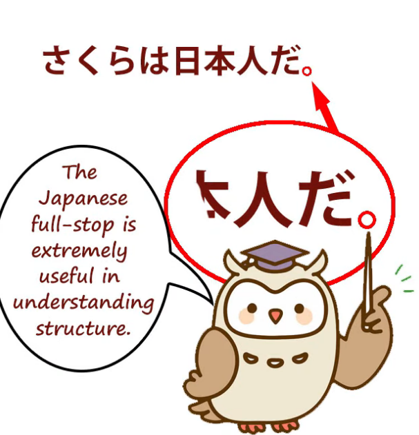

And **this is really the exception to the rule, because it really is structurally clear.**

**What it does is end a sentence.**

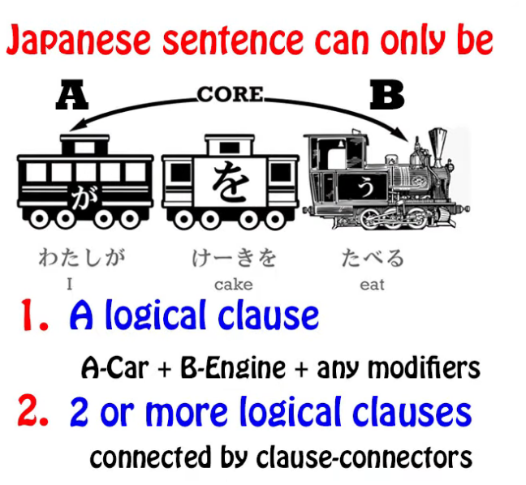

**And this is very important for us in understanding how complex Japanese sentences are structured.**

Why is that? Well, **Japanese is a very modification-heavy language.**

**That's to say, a lot of what other languages do by other strategies, Japanese does by modification**, that's to say, **using clauses to modify nouns or other elements of a sentence.**

**Most of the heavy lifting in Japanese structure that's not done by logical particles**

**is done by this modification structure.**

**So whole logical clauses can be used not as logical clauses**

**but in order to modify a noun or some other element.**

So, let's take a look at how this works.

<code>**市場で買って川に落としちゃった**お菓子。</code>

And this means <code>The candy **that I bought at the market and done dropped in the river**</code>.

::: info
I guess, done in the translation is used to point out the more literal translation of ちゃった.
:::
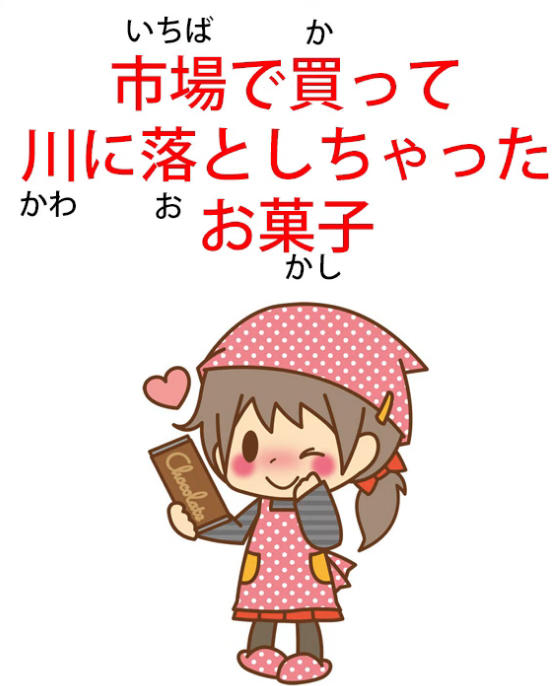

Now, **the problem with this when we're reading a complex sentence is that we can get confused**

**about whether something is a logical clause or not.**

So, **are we saying here that I bought something at the market? No, we're not saying that.**

**Are we saying that I dropped something in the river?  
No, that's not what we're saying in this sentence.**

---

**Both of those things are just modifying <code>お菓子</code>.**

**They're telling us what kind of an <code>お菓子</code> it was:**

**the one I bought at the market and done dropped in the river.**

**So all we have here is a single noun, <code>お菓子</code>, that's been heavily modified by logical clauses**

**that aren't working as complete logical clauses.**

---

**We can then add a logical particle to that <code>お菓子</code> and make it into a whole logical clause.**

So, we might say, <code>市場で買って川に落としちゃったお菓子**が**魚さんに食べられた。</code>

The candy*(**=subject**)* (I) bought at the market and done dropped in the river got eaten by a fish.

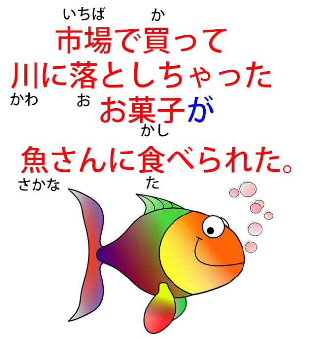

::: info
If I understand correctly, because we marked お菓子 with が subject, we can now build another clause out of it, hence we get another logical clause of <code>お菓子が魚さんに食べられた</code>.
:::
*While お菓子 is also modified by modifier clauses before it, specifically <code>市場で買って川に落としちゃった</code>, they serve here as simply a modifier that describes お菓子 rather than being complete (standalone?) logical clauses. Although just my guess from how I understand it.*

**But how do we ensure when we're reading a sentence like this whether we're looking at**

**a logical clause or whether we're looking at a modifier?**

## How to know if it is a logical clause or a modifier?

Now, **the important thing to understand here is that in any kind of Japanese writing**  
(except perhaps on Twitter or something)  
**a logical clause has to end in one of two ways**,

**either with a <code>まる / 。</code>, which tells us that it's the end of the complete sentence** --

(it may have a couple of sentence ender particles after it, but it's a very strict rule of Japanese

that **what ends any logical clause is the B-engine, aside from any sentence-ender particles**) --

---

**or it has to end in a clause connector that completes the clause and leads into the next clause.**

**This may be the て-form, it may be a word like <code>から</code> or <code>けれど</code>,**

but armed with that information we can then see what's going on.

So, let's look at <code>市場で買って川に落としちゃった</code>.

**That's a complete pair of logical clauses.**

::: info
My guess here is that it is theoretically composed of two logical clauses if, like Dolly says below, we presume there is some hidden subject and a hidden direct object if we took both verbs as marking their individual logical clauses - 市場で(私がお菓子を)買った and (私がお菓子を)川に落としちゃった that are then connected using the て-form. Here, お菓子 should be a direct object hence why を, since 落とす and 買う are other-move verbs & require a Subject acting on a Direct Object. Obviously, topic marker can be there too, as 私は in the beginning.
:::
*But instead, these clauses are combined and since they are followed by a noun serve instead as a modifier for that noun, so therefore they are not logical clauses anymore and do not contain the hidden elements, where instead they are one single big modifier for a noun that is following them, in this case お菓子. It is a shame I cannot ask Dolly about this, as I feel it would help a ton  
However, I am aware my guess might very likely be wrong, so please take it with a lot of salt.*

**It's not telling us what it was that we bought in the market and dropped in the river,**

**but it could perhaps be presuming that.**

**But we know that it's not in fact a logical clause**

**because it doesn't end in a clause connector and it doesn't end with a <code>まる / 。</code>.**

**It goes straight into a noun.**

---

**And this is how we can tell the difference between a modifier and a logical clause.**

**And we know when the entire sequence, the entire sentence,**

**is over because it's going to have that <code>まる / 。</code>.**

And I've done a video about this method of analyzing Japanese sentences

and I'll link that so that you can follow it up afterwards *(Lesson 34)*.

**But the <code>まる / 。</code> here is vital.**

## The comma / 、

Now, the next one we're going to look at is the Japanese comma,

which looks like a little diagonal line at the foot of a letter.

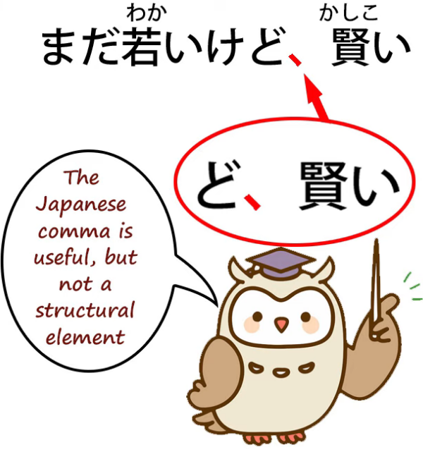

**And that's kind of the opposite of a <code>まる / 。</code>,**

**because it really is not a logical element in the sentence.**

**It was adopted into Japanese, but unlike the English comma or other European commas,**

**it has no logical rules.**

**Ideas like sectioning off a subordinate clause with commas at each end, that doesn't exist in Japanese.**

**You just put in a comma wherever you want to indicate a pause. And that's all it does.**

In Japanese schools, students are discouraged from using too many commas,

and the reason for this is not incorrect comma usage,

**because there is no such thing as incorrect comma usage in Japanese.**

**The reason is that commas are not a structural part of Japanese, so students are discouraged**

**from using them as a crutch in conveying their meaning.**

**If you can't convey your meaning without commas, then you're not writing good Japanese.**

## The question mark / ？(はてな)

Now, the next one we'll look at is the question mark or <code>はてな</code>.

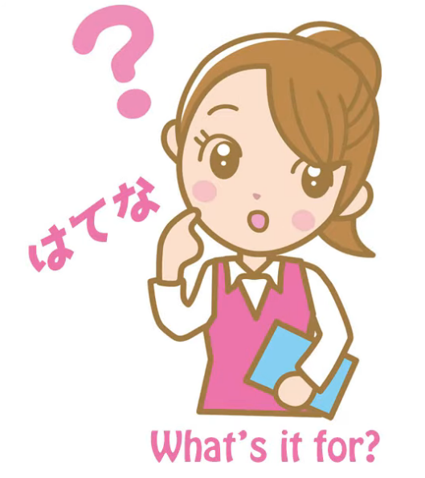

Now, **in English the question mark is subject to a rule.**

**If you have a question, you have to end it with a question mark.**

**And also in English, questions are structurally different from statements.**

So if we say, <code>The coffee is hot</code>, that's a statement,

but if we say, <code>Is the coffee hot?</code> that's a question.

---

**In Japanese we don't have this differentiation.**

**Statements and questions are structured exactly the same.**

Now, **in formal Japanese** we have **the question-marking particle <code>か</code>**,

**which tells us that it's a question.**

But **in informal Japanese we can use <code>か</code> but mostly we don't.**

**Sometimes we use the question-marker <code>の</code>, but that's ambiguous because**

**<code>の</code> can also be a statement marker.**

---

**The only way you can really tell a question from a statement in Japanese**

**is the rising intonation, which of course you can't hear in text.**

**And so the question mark has become a very useful tool for indicating that rising intonation,**

**for telling us that this is a question, not a statement.**

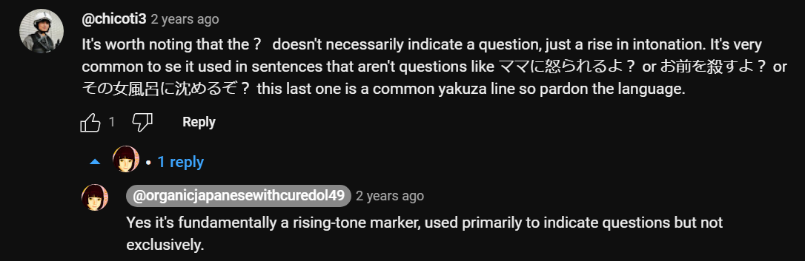

**In English, you have to use the question mark at the end of a question**

**if you're writing proper English. In Japanese, there's no such rule.**

**If the <code>か</code> marker is there, you don't use the question mark,**

**but if you want to disambiguate the fact that something is a question**

**rather than a statement, you just pop in a question mark if you want to.**

## The quotation marks / 「　」

The next thing we'll look at is quotation marks.

**These look like little square brackets at the ends of a statement,**

**and they work exactly the same as English quotation marks.**

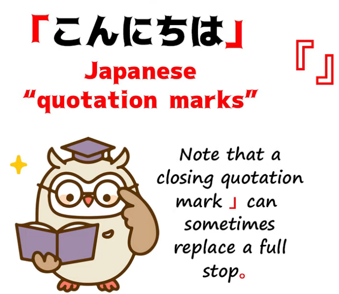

**They just tell us that something is a quotation: it's what somebody's saying.**

**We don't use them for what somebody's thinking, as we sometimes do in English.**

---

Now, sometimes you'll see **double quotation marks** like this, 『　』

**and what they do is mark a quotation that occurs inside another quotation.**

## The <code>side-marks</code>

Now, the last thing I want to talk about is something that really puzzles people quite a lot.

**In Japanese, particularly Japanese books**, you'll sometimes see,

**especially in vertical text, a set of little marks that look a bit like Japanese commas,**

**running along the left-hand side of a word or a phrase.**

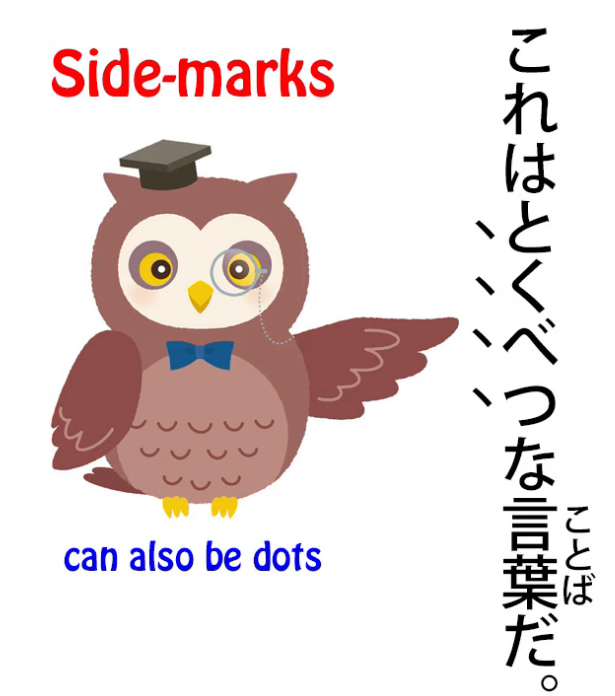

What on earth is this doing?

Nobody seems to tell you.

**What it is actually doing is either emphasizing that word or phrase**

**or telling us that it's being used in a special sense.**

---

**So what these little marks are really doing is something like**

**putting something into italics in English.**

And I suspect they came into Japanese

in the first place to render italicization when translating Western literature.

**There's no way of really writing Japanese characters in italics.**

**There is no italic format for Japanese, so this is what's used instead.**

---

**This emphasis and the indication that something's being used in a special sense**

**can also be indicated by katakana, but you will see this from time to time**

**in Japanese texts and that's what it means.**

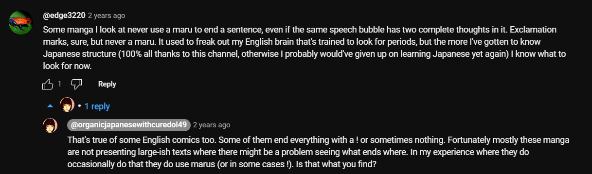

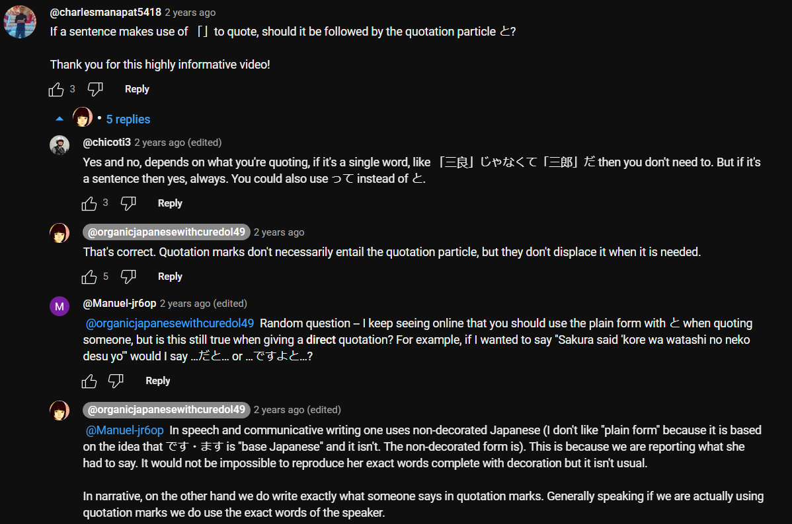

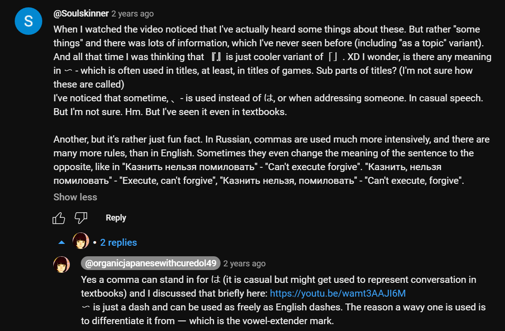

*Dolly’s link is for Lesson 80.*
