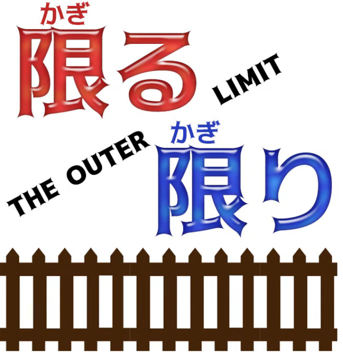
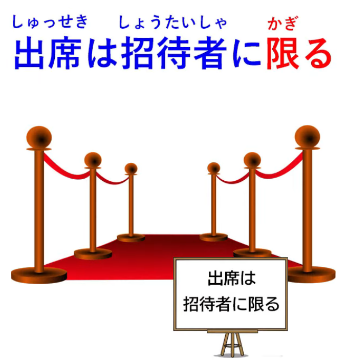
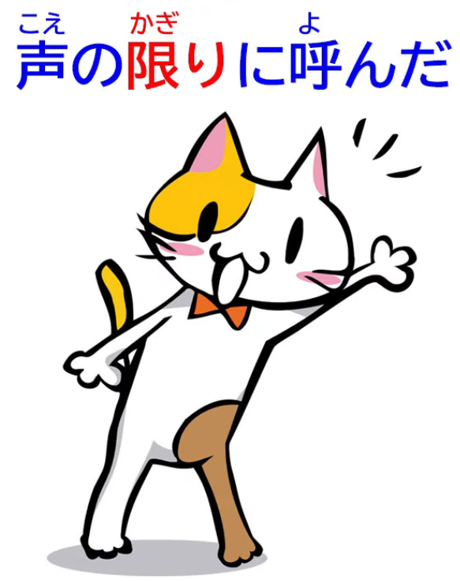
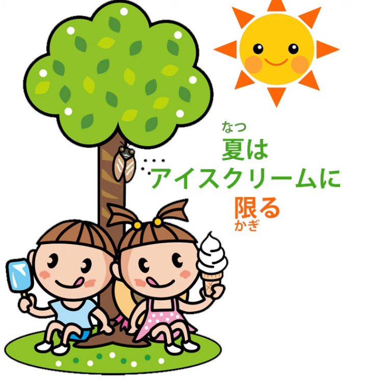
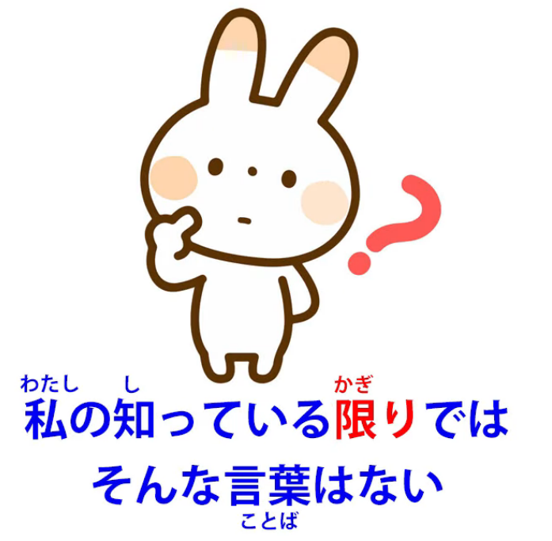
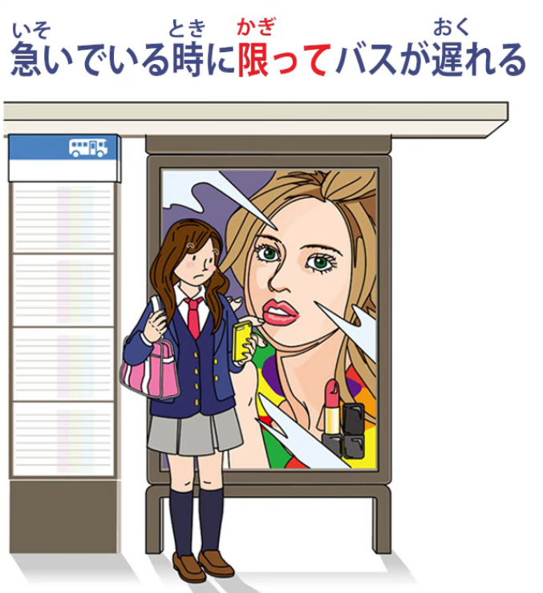
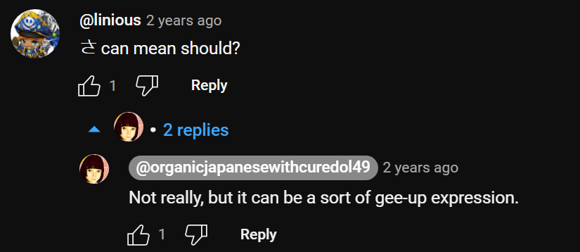
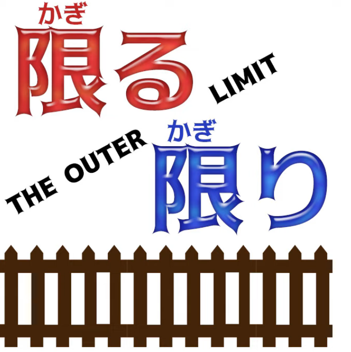
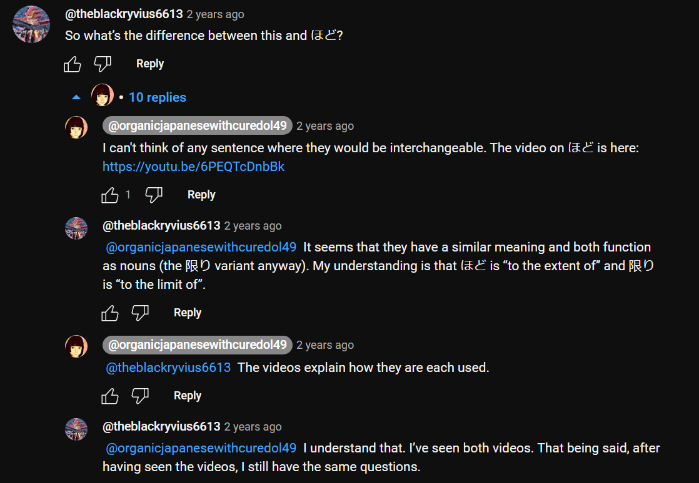
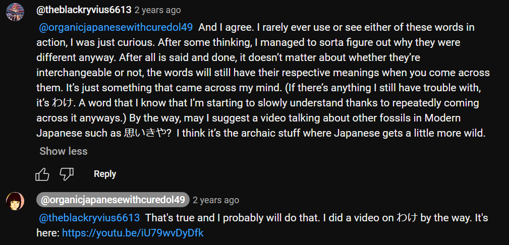

# **91. Outer Limits! 限る & 限り: Its many meanings and how they work 知っている限り、とは限らない and more**

[**Outer Limits! 限る Kagiru 限り Kagiri - Its many meanings and how they work 知っている限り、とは限らない and more**](https://www.youtube.com/watch?v=jWCLPJwZS5E&list=PLg9uYxuZf8x_A-vcqqyOFZu06WlhnypWj&index=96&ab_channel=OrganicJapanesewithCureDolly)

こんにちは。

Today we're going to talk about <code>限る</code> and <code>限り</code>.

**<code>限る</code> is a verb meaning <code>limit</code> or <code>restrict</code>,**

and **<code>限り</code> is the い-stem, therefore the noun-form of that verb.**

If you don't know about い-stems making noun-forms,

I'll link a video above my head which tells you all the secrets of the mysterious い-stem.  
*(Lesson 72)*

Now, **Japanese likes limiting expressions, expressions to do with limits and boundaries.**

[**I did a video**](https://www.youtube.com/watch?v=56sy0qfY0Js) on <code>うち</code> *(Lesson 97)* a little while ago  
and I'll put a link above my head and in the information section below.

<code>うち</code> concentrates on the enclosure, on the area that we're in

and everything else is outside of.

**<code>限り</code>, on the other hand, concentrates on the boundaries of that enclosure,**

**the edges beyond which the enclosure does not reach.**

And this gives rise to a whole range of expression strategies,

some of which are quite literal, others of which are very metaphorical

and can confuse people if they don't understand where they're coming from.

## 限る

**So, let's start with a very simple use of <code>限る</code>.**

<code>出席は招待者に**限る**</code>

**<code>出席</code> is attendance at whatever the event may be.**

**It is limited at <code>招待者</code> (invited persons).**

**Outside that limit, <code>出席</code> doesn't exist.**

**You can't attend the meeting or whatever unless you are an invited person.**

Now, another mainly literal use is <code>声の**限りに**呼んだ</code> (I called **at the limit** of my voice).

  
In English we might say <code>the top of my voice</code>.

**What we're saying here is the limit as loud as my voice would go.**

So these are quite literal and easy to understand.

But then we get expressions which I think most of you will have heard

at some time and are perhaps a little more confusing.

So, <code>夏はアイスクリイムに**限る**</code> -- now, loosely in English that means

<code>In summer, ice cream **is the best thing**</code>.

What we're actually saying is  
<code>Speaking of summer, when it comes to summer, it **reaches its limit** at ice cream</code>,

in other words, ice cream **is the furthest you can take** summer /

ice cream **is the pinnacle of** summer /  
**there's nothing beyond** ice cream when we're talking about summer.

::: info
Of course, this is just a natural Eng translation, hence why it is hard to pin-point 限る here.
:::
---

And this can be used in all kinds of different expressions, for example:

<code>運動なら水泳に**限る**</code>  
(if it's exercise / if we're talking about exercise, it **reaches its limit** with swimming \[<code>水泳</code>\] /

swimming **is absolutely the best kind of** exercise).

And moving on from this we get expressions like <code>彼女に**限って**そんなことはしない</code>.

And again, in loose English this would be  
"She **of all people** wouldn't do such a thing

/ she'd be **the last person** to do such a thing".

What we're actually saying is

<code>She is **the very limit of** people who wouldn't do such a thing</code>.

---

So just like ice cream being **the best thing** in summer  
or calling **at the very maximum extent** of your voice,  
she is **the maximum, the extreme** of people who wouldn't do such a thing.

**Other people might possibly do it, even if you'd think they wouldn't,**

**but she is the very limit of the kind of person who wouldn't do that kind of thing.**

## 限る used negatively (not limited to x)

Now, **the concept of <code>限る</code> (limit) is often used negatively to show that**

**something is not limited to a particular statement, a particular notion.**

So, <code>辞書に書いてあることが常に正しいとは限らない</code>.

**And this <code>-とは限らない</code> essentially sums up the previous statement**

and says that's **not limited to being the case.**

So what we're saying here is <code>Things that are written in a dictionary are always correct</code> --

**that's the statement, then we quote that <code>-とは限らない</code>:**

<code>**It's not necessarily the case that** things written in a dictionary are always correct.</code>

And I think we found that out to be true on various occasions.

## 限り

Now, again, this <code>限り</code> can be used for the limits of one's knowledge and very often is,

so <code>私の知っている**限り**ではそんな言葉はない</code>.

So, in English we would say <code>As far as I know, there's no such word</code>,  
but the expression strategy here is to modify the noun <code>限り</code> -- <code>私の知っている**限り**</code>

(**the limit of** what I know): <code>**Up to the limit of** what I know, there is no such word.</code>

And actually in this case it's pretty similar to the English:

<code>**as far as** I know / **to the limit of** what I know</code>.

And it's interesting here that **while English says** <code>**as far as** I know</code>,

**Japanese achieves the same broad pattern by modifying the noun <code>限り</code> (limit).**

And as we talked about last week *(Lesson 90)*,  
**modification does an awful lot of the heavy lifting in Japanese**

**that's done by other strategies in English.**

---

Now, another common expression which can be a bit confusing is the kind of expression

we find in <code>急いでいる時に**限って**バスが遅れる</code>

(**limited to** times when we are in a hurry, the bus comes late).

Now, **this is obviously not literal, but it expresses a sentiment often felt,**

**that the bus or whatever it is that does something we don't want it to do does it**

**specifically when we very much don't want or can't afford it to do it.**

So really that expression that can seem a little bit confusing at first is a very natural

kind of expression which I think you do find in English sometimes.

**It's only when we really need it that it doesn't happen.**

### その場限り

Now, another expression is <code>その場限り</code>.

So, <code>その場限りことを言う</code> means  
she says things **on the spur of the moment** / she talks right off the top of her head.

**<code>その場</code>**, which we've discussed in another video, which I'll link *(Lesson 75)*, means literally

**<code>that place / the appropriate place / the place one would happen to be at at the time</code>**, but

**of course in Japanese as in other languages, place can also mean a time or an occasion.**

---

So, <code>**その場限り**ことを言う</code> means  
she says things that **just arise out of the particular occasion and nothing else** --  
**limited to that particular occasion / having no real relevance outside that particular occasion.**

So the implication is just essentially talking stuff of no real value that

comes off the top of her head.

### その場限りさ

And a very common expression related to this is <code>喧嘩はその場限りさ</code> – ケンカ

and **this is a popular expression, it's not exactly a full sentence.**

::: info
I used Kanji form for ケンカ (喧嘩), but both are fine.
:::
**The <code>さ</code> is rather making it into a <code>should</code>.**

**<code>さ</code> here is saying <code>that's how it ought to be / come on, that's how it should be</code>.**

And it's translated into English as <code>quarrels should not be continued</code>.

Sometimes it's even translated as <code>let not the sun settle on your wrath</code>,

which of course is nothing to do with what it's really saying.

**But the point here is that quarrels should be limited to <code>その場</code>**

**(the occasion, the event on which they arise).**

**So if you quarrel with someone today you shouldn't be carrying on that quarrel tomorrow.**

Very good advice.

So this is a range of the circumstances in which the <code>限り / 限る</code> concept

is applied in Japanese.

There are others, of course, but with this information

I think you'll be in a better position to see what's going on.

::: info
The links referred are [**くらい vs ほど**](https://www.youtube.com/watch?v=6PEQTcDnbBk&ab_channel=OrganicJapanesewithCureDolly) and Lesson 68 for わけ. You can check other comments under the video as usual.  
Anyway, this is where Dolly’s Grammar playlist of 93 videos officially ends. We are reaching the end. There are a few other converted videos by Dolly below this yet.*
:::