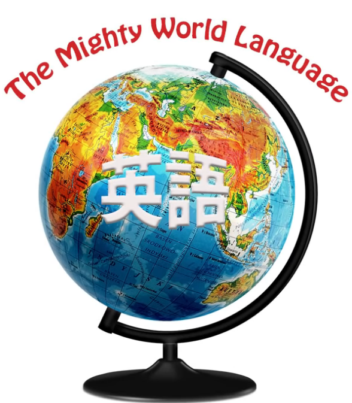
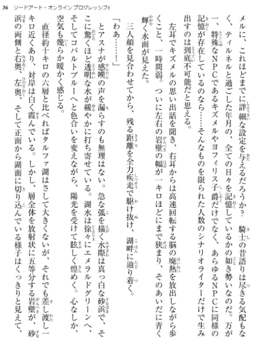
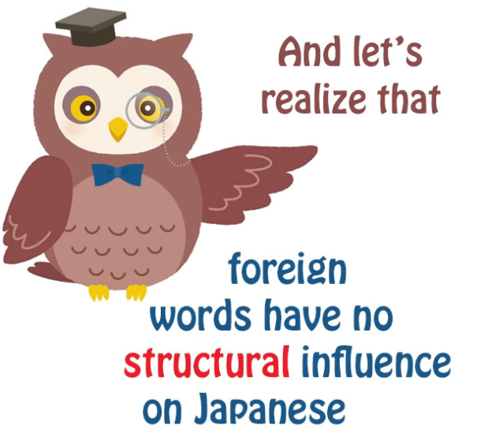
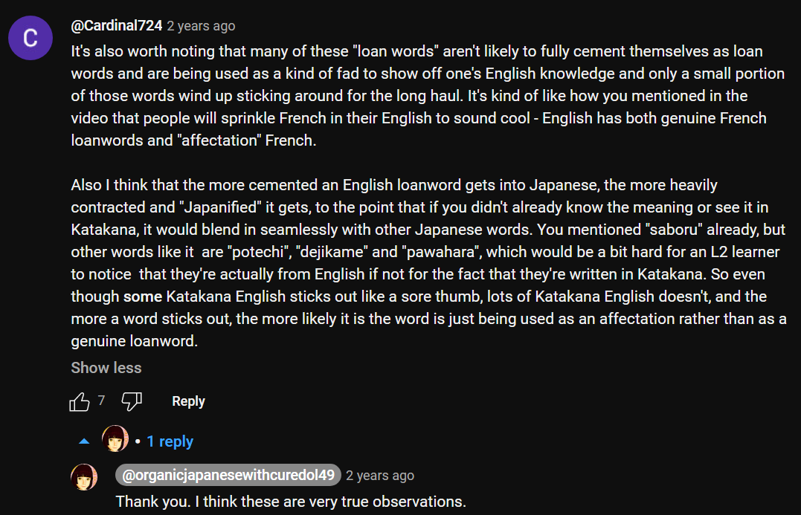

# **92. Will English EAT Japanese? Loan-word invasion - is it really a threat?**

[**Will English EAT Japanese? Loan-word invasion - is it really a threat?**](https://www.youtube.com/watch?v=bPWt-8Ecd7Y&ab_channel=OrganicJapanesewithCureDolly)

こんにちは。

Today we're going to talk about something that

some people have been talking to me about ever since I started this channel,

and one sees serious and semi-serious articles about the subject,

usually written by foreigners, warning the Japanese about the terrible danger

to their language of the influx of English into it

and worrying that the Japanese don't seem to be aware of the damage

that this could do to the language

and the ways in which it could make it less Japanese.

So today I want to look at what's actually going on here

and what is likely to happen and what is unlikely to happen.

## Reasons so many English words exist in Modern Japanese

**First of all, it's absolutely true to say that there is an influx of English words**

**into Japanese, and there are four main reasons for this.**

---

**The first is that English, of course, is the international language.**

Most people learn it in school because it's the most useful language to learn

if you don't already know it.

**And this, of course, doesn't affect only Japanese.**

**French purists have been complaining about words like <code>le weekend</code> and <code>le football</code>**

**for over half a century, and I don't think it's really done much harm to French.**

---

**Now secondly, English has become the language of technology,**

**and technology, in particular digital technology,**

**has changed the life of humans radically over the last few decades**

**and introduced a lot of new terminology into their lives.**

And because most of this technology has been developed in America,

the language in which the new terminology exists is largely English.

---

**And the other reason -- again, these are all connected -- is that English,**

**being the international language, has high prestige in various ways.**

**It can be considered cool. It can be considered cute.**

**And if you see a magical writing in Japanese,**

**it's likely to be based on the Roman alphabet**

and possibly echoing English words

**because English is something that's foreign**

**to Japanese people but at the same time something they do actually know a bit of,**

**so it's a kind of friendly bit of foreign.**

**And using English words can have various effects:**

**it can seem cute, it can seem clever, it can seem cool.**

**And this is a common phenomenon.**

---

**When French was more of a high prestige language**

**and most English speakers learned it,**

**you got very much the same phenomenon.**

People would throw in bits of French into conversation,

authors would use bits of French in books

and it would be to look a bit clever, sometimes to look funny.

**High-prestige languages tend to get words borrowed by other languages.**

---

**Now, none of this, as you see, is actually unique to Japanese.**

If you go around a non-English-speaking country,

you tend in almost all cases to see

some English words on signboards, on products in shops, all kinds of things like that.

English is around because, well,

people have learned it in school, they know a bit of English,

and **it's the international language,**

**so things often tend to get named in English.**

## Why do some people worry about English <code>invading</code> Japanese?

So why do people worry about this more in Japanese than in other languages?

**I think part of the reason is that katakana English sticks out.**

**If you adopt English words into, say, French or German,**

**they're written in the same script as the rest of the language.**

**And to foreigners in particular, katakana-ized English sounds weird.**

**They have to distort English in various ways because they have to add lots of syllables.**

So it all rather sticks out like a sore thumb,

more to foreigners by a long way than to actual Japanese natives.

---

**But a thing to bear in mind here is that on the whole**

**English loan words don't replace their Japanese equivalents,**

**where there were Japanese equivalents to start with.**

**They tend to run alongside them,**

**perhaps have a slightly different implication**

**or just a different feel about them.**

---

**There are a few exceptions to this, like for example the word <code>ライオン</code>,**

**which tends to be the main word for a lion in Japanese now.**

**Japanese has its own word for lion, which is <code>獅子 / しし</code>,**

**but these days it tends to sound a bit literary, a bit old-fashioned,**

and if we're going to talk about a lion, we tend to say <code>ライオン</code>.

**That is a bit of an exception.**

**If we talk about an elephant, we say <code>象 / ぞう</code>.**

**If we talk about a tiger, we say <code>虎 / とら</code>.**

**Most wild animals are known by their Japanese names**

**even if the English name is also known in Japan.**

**There's a baseball team called the 阪神タイガース,**

**but this is a typical case of using the foreign word because it sounds kind of cool.**

**Normally if you're just talking about a tiger, you say <code>虎 / とら</code>.**

## To what extent is English really moving into Japanese?

Now, if you want to do a little experiment

to see to what extent English really is moving into Japanese

and replacing the language, well, just take a look at a Japanese book.

**If you have some Japanese books around -- I don't mean textbooks or readers for foreigners,**

**but if you just have some Japanese books**

either on your bookshelf or on your mobile device,

**open them up and take a look at a few pages from a few books**

**and see out of the entire page how many of the words are in katakana.**

**And you'll see that it's really a very small proportion,**

**maybe one or two on most pages, often none at all.**

**And then see how many of those are in fact names of people or places**

**or made-up words that are written in katakana: these are not loan words.**

**The number of actual loan words as a proportion of an average page of text**

**or an average person's conversation is very small.**

Is it rising? Well, probably a bit, but it's not really making very significant inroads.

---

**And the other thing to remember is that in Japanese foreign words come in as nouns.**

Almost always.

**There are one or two small exceptions**

**such as the word <code>サボる</code>, which means <code>not attending school or work</code>,**

**and that's actually a foreign word based on French <code>sabotage</code>** *- サボ, short for サボタージュ*,

**and it has a hiragana -る and is actually treated like a verb.**

But this is really very much an exception.

You can only find a tiny handful of words that do that in Japanese.

---

**Nearly all the English words that come in, just like the Chinese words that came in**

**in the past, come in as nouns, regardless of what they were in the original language.**

**So, if you want to use them as verbs, you have to add <code>する</code>.**

**If you want to use them as adjectives, they have to be adjectival nouns**

**or you just have to use の.**

---

So, structurally, even if English words increased exponentially,

which isn't really very likely,

they wouldn't have any impact on the structure of Japanese.

**Even the Chinese words that actually now make up**

**about 60 per cent of the Japanese vocabulary**

**had just about no influence over the actual structure of the language,**

**the way that sentences actually work.**

And there's an interesting parallel there in that when the Norman French

were ruling England they gave English a huge, huge, huge amount of vocabulary

but again they had almost no impact on the structure of the language.

## Will English continue <code>invading</code> Japanese?

Now we might ask, is this going to go on, this so-called English invasion?

**And we can't really tell the answer to that because it depends on**

**the continued prestige of English, which may or may not carry on into the future.**

**There doesn't seem to be any candidate for an international language,**

**but on the other hand the cultural prestige of English may decline.**

We don't know.

---

**But the thing is that Japanese assimilates foreign words easily.**

**It doesn't integrate them into the structure,**

**but it does make them a part of the language and it does <code>Japanesify</code> them.**

**English as a cultural phenomenon makes surprisingly few inroads into the Japanese mind.**

Japanese people are notorious for not learning English.

**Japanese are worse at English than most other language groups.**

**Most Japanese people, if you talk to them,**

**will have a surprisingly large English vocabulary**

**but a surprisingly small grasp of the actual English language.**

---

And I think there's a reason for this,

**and that is that Japanese is closer than any other non-English language**

**to being culturally self-sufficient.**

::: info
This is true indeed, most Japanese people online hang around solely with Japanese content and people, hence they have little need to learn or use English, it may be one of the reasons Japanese know English less despite its presence there, since I would argue that most foreigners learn English through the Internet via consuming content and talking with people in English - both heavy input and output because most school systems are artificial and outdated.  
I mean, I acquired the vast majority of English through the Internet, books etc., not in school and it is the reason I became fluent in English, with school only this would be almost impossible.  
Granted, school was useful for acquiring the basics which enabled me to consume stuff.  
Of course, Europeans acquire English easier than the Japanese, but this still stands I believe.  
Surrounding yourself in the language as much as possible means you will be able to acquire it faster, hence why immersion in especially foreign countries works so well if you try to slowly understand all that foreign language around you (and studying it) and by slowly utilising it.  
The important thing is that you put active effort into understanding and into using the language.
:::

**Most people, even if they're based in major languages like French or German,**

**kind of need English for cultural sustenance:**

**for using the Internet, for participating in the popular culture of the modern world.**

---

**Now, the popular culture of the modern world is far and away dominated by English,**

as we know.

**But the second strongest popular-culture language and nation is Japan and Japanese.**

**Japanese manga and anime are popular all over the world**

and there's nothing anywhere to rival them.

If you ask someone who has no interest in Japan or Japanese

if they've heard of Japanese characters and phenomena like

Mario, Sailor Moon, some of the Ghibli movies, Zelda, Pokemon, etcetera etcetera,

most of them will have heard of it.

How many characters from any other language do most people know?

How many German ones?

How many French ones? And these are major languages.

How many Spanish ones? This is the biggest language in the world after English.

**Japan is a popular-culture powerhouse to an extent that is only exceeded by English**

**and not approached by any other language.**

**This makes them culturally self-sufficient in a way**

**that no other language group (with the possible exception of Chinese) really is.**

---

**So, when is Japanese going to turn into some kind of hybrid English?**

**It's not going to happen.**

**It's not actually going to happen to most of the other languages**

**that have an influx of English coming into them.**

**But Japanese is actually safer than the rest.**

::: info
Recommend reading through [**the comments**](https://www.youtube.com/watch?v=bPWt-8Ecd7Y&ab_channel=OrganicJapanesewithCureDolly) as always.
:::

