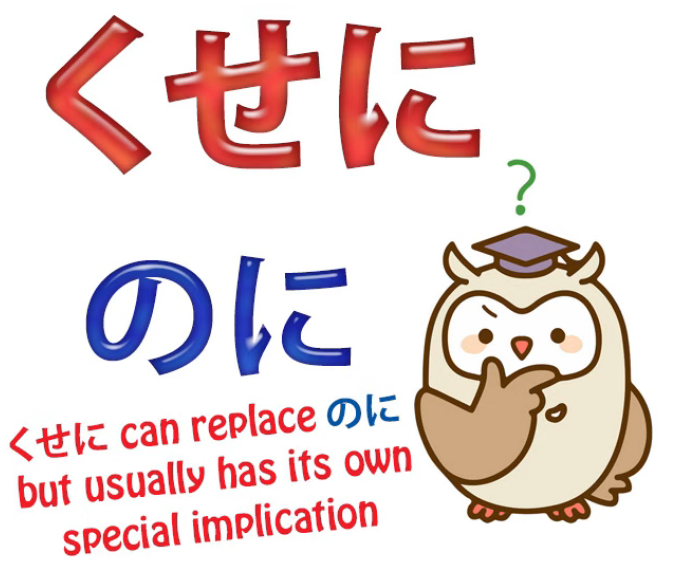
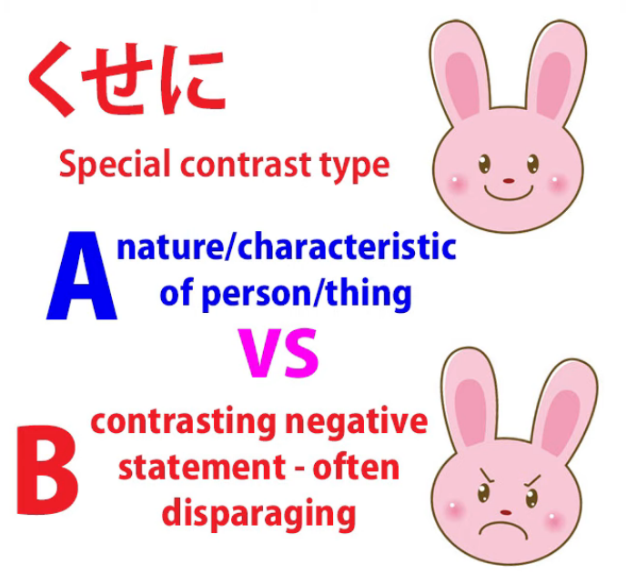
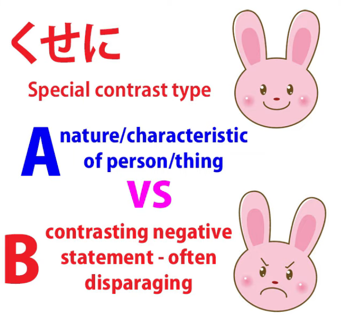
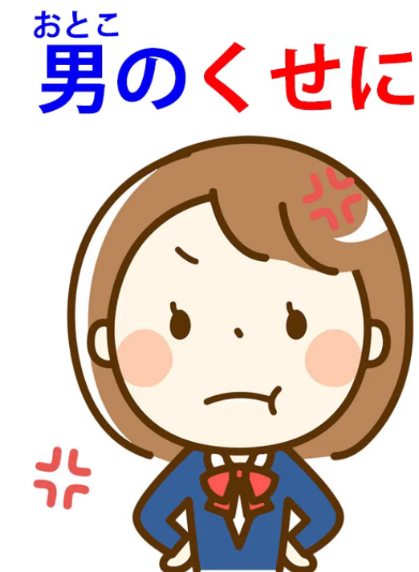
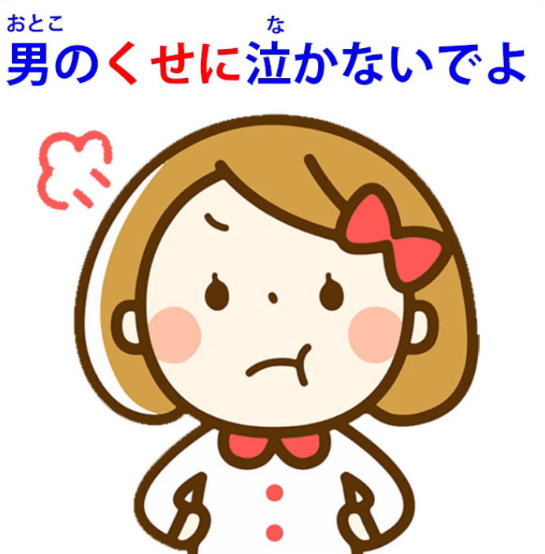
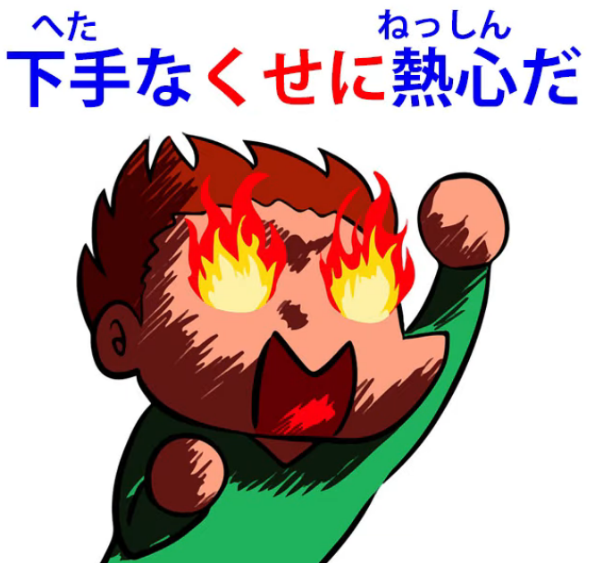
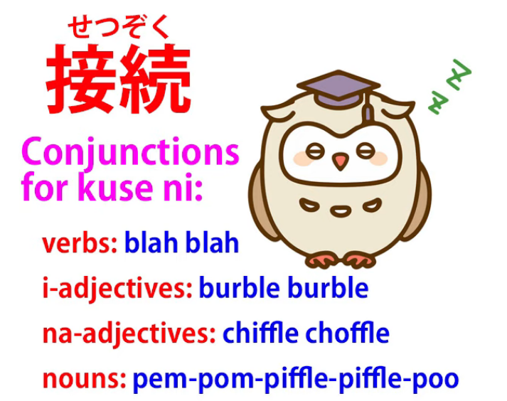
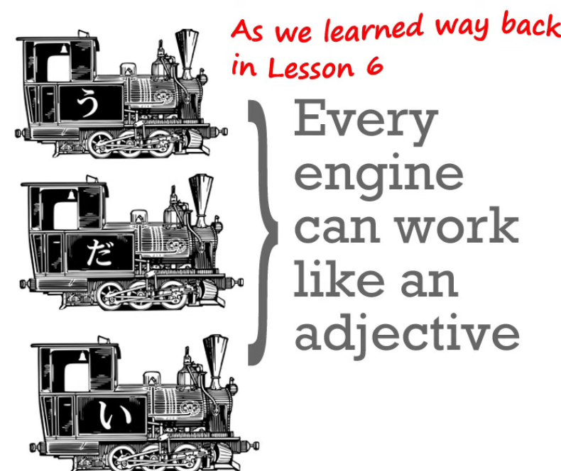
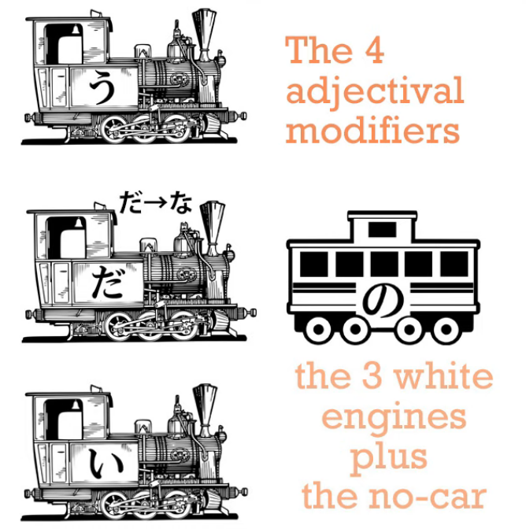

# **93. Cussin' 'Em Out with くせに. How it works.**

[**Cussin' 'Em Out with Kuse ni くせに. How it really works.**](https://www.youtube.com/watch?v=QvuNXIYqFNM&ab_channel=OrganicJapanesewithCureDolly)

こんにちは。

Today we're going to talk about an expression that you see all the time in anime, manga,

light novels etcetera, and can be confusing for two reasons.

One is that the apparent etymology,

the apparent base of the word is very obvious but it's completely misleading.

And the other is that because of the way it's used,

it's often a bit unclear about which way it's pointing

and what it's actually doing.

However, once we get clear about this, it's very, very easy to understand.

**The expression is <code>くせに</code>.**

Now, the etymological problem is that

whereas we all know what <code>くせ / 癖</code> means

**-- it means a <code>habit or idiosyncrasy</code> --**

**but it's not very clear what that has to do with the expression <code>くせに</code>.**

**And the answer is: nothing.**

**Some Japanese etymological sources tell us that**

**this <code>くせ</code> was actually a different <code>くせ</code> originally,**

**but nobody really seems to know for sure.**

**But the point is that it really**

**has very little to do with the modern usage.**

---

**All we really need to know is that <code>くせに</code>**

**is a contrastive conjunction like <code>のに</code>.**

Now, [**I've done a video**](https://www.youtube.com/watch?v=Au5JOtcwE7A) about <code>のに</code> and I'll put a link here,

but I'm going to assume that you basically know what it is and what it does.

**<code>のに</code> and <code>くせに</code> are contrastive conjunctions, which means**

**that they're like <code>でも</code> or <code>けれど</code>.**

**They join two clauses in a manner that means**

**<code>despite Clause A, Clause B / even though Clause A, Clause B</code>.**

---

**Now, <code>くせに</code> has two things in common with <code>のに</code>.**

**One is that it's generally negative in its implications,**

**and the other is that the second clause quite often gets omitted.**

**So we're saying, <code>although Clause A...</code>**

**and then not going on to say what clause B is.**

**We're just implying it.**

**<code>のに</code> does that quite often and so does <code>くせに</code>.**

## The difference between のに and くせに

**The difference between <code>のに</code> and <code>くせに</code> is that  
<code>くせに</code> not only has a negative implication**

**but it has most of the time a very specific kind of negative implication.**

**And this special usage is essentially**

**taking the nature or character or position of a person**

**and then contrasting their actions with it in a way**

**that is highly unfavorable,**

**so we could use <code>のに</code> in these situations,**

**but <code>のに</code> would sound more regretful.**

**<code>くせに</code> sounds much more forceful.**

**It often sounds like severe criticism.**

**And, as we say, it's making this kind of contrast,**

**the contrast between what we expect of a certain type**

**and what they actually do, and it's a negative contrast.**

---

So, for example, we might say, <code>お金持ちの**くせに**ケチだ</code>

(**despite the fact that** she's well off / she's rich, she's stingy).

<code>女の**くせに**部屋が目茶苦茶だ</code>

(**despite the fact that** she's a girl, her room's a mess).

<code>男の**くせに**泣いている</code>

(**despite the fact that** he's a man, he's crying).

**And these are generally intended in an offensive manner.**

**They're intended to register harsh criticism.**

**So we're taking the position of the person**

**and what we expect of that kind of person**

**and then saying something that's in contrast to it.**

**But very often we also leave that out.**

So, for example, suppose some bad people or monsters break into the house

and the heroine confronts them and the hero is cowering in a corner.

The heroine might just say, <code>男の**くせに**</code>, which literally means

<code>**Despite the fact that** you're a man</code>

**but doesn't then say anything about it.**

In English probably a non-structural but natural translation would be

<code>And you're supposed to be a man</code>.

---

**And this can cause confusion because**

**it can lead to constructions that confuse us about what's really going on**

**and which way <code>くせに</code> is pointing.**

---

So, for example, <code>男の**くせに**泣かないでよ</code>.

Now what's going on here?

<code>**Despite the fact that** you're a man, stop crying</code>?

**Is that what it's saying? Well, no, it isn't.**

<code>男の**くせに**</code> **is being used in a trailing manner like the previous example.**

**And then <code>泣かないでよ</code> is being added to that trailing insult,**

**as it were, and that's a command.**

I've done a video on commands. *(Lesson 83)*

**So, <code>泣かないでよ</code> is not a sentence, it's just a command: <code>Stop crying!</code>**

Just as in English <code>Stop crying</code> is not a sentence with a subject and a predicate.

It's just a command.

**So really those two statements**

**should be separated by a period (or in Japanese a <code>まる / 。</code>)**

**because they're not part of the same sentence,**

but they won't necessarily be when you see them written

and they won't necessarily have a wide gap when you hear them spoken.

<code>男のくせに泣かないでよ</code>:

**these are two separate statements**

and if we don't understand that

it can confuse us about the use of <code>くせに</code>.

---

Another thing that can be confusing is that

**the connection may go the other way around.**

Generally speaking, **we take the qualities of a person,**

**which are fundamentally good qualities**

-- being a man, being a girl, being rich --

**and then adding something negative to it:**

**Despite the fact that** you're a girl, the room's a mess /

**Despite the fact that** you're a man, you're hiding in the corner /

**Despite the fact that** you're rich, you're stingy.

---

**But it can go the other way around too.**

For example, we might say

<code>下手な**くせに**熱心だ</code>.

This means <code>**despite the fact that** he's unskilful / useless, he's enthusiastic</code>.

**Now, this generally isn't used in a positive sense.**

It's meaning:  
"Here's this person going around being all enthusiastic, and he's useless, he can't do anything’.

---

**So it can also work that way around and we need to be aware of that,**

because that again can fool us.

**Most of the time the contrastive conjunction**

**goes the way around we've been talking about,**

**but it doesn't have to.**

---

Now, if this was a textbook or a JLPT instruction

we would talk about what they call the <code>接続</code> (the conjunctions):  
::: info
接続 is an abbreviation that can be used for the term conjunction, full version is 接続語
:::
how does <code>くせに</code> attach to what comes before it?

**We know how it attaches to what comes after it:**

**it's simply a clause connector**

**so what comes after it is the second clause, which could be left off.**

But what the standard texts will talk about is how it connects to what comes before it:

with a noun you use の,

with an adjectival noun you use -な,

with an adjective you don't use anything.

**None of this, of course, is necessary if you've done structural Japanese.**

---

**<code>くせ</code>, whatever it is, whatever its etymology, is a noun.**

**We pretty much know that, because**

**anything that isn't a verb or an adjective is a noun in Japanese.**

**What comes before <code>くせ</code> is modifying <code>くせ</code>,**

**it's telling us what kind of <code>くせ</code> we're talking about.**

---

**And it does that in exactly the same way that every modifier always modifies a noun.**

**So, if it's a noun, which it most often is,**

**then we use の for modifying the other noun**

that's following it just as we always do:

<code>男**の**くせ / 女**の**くせに</code>.

**If it happens to be an adjectival noun,**

**then obviously we use -な** as we did with <code>下手**な**くせに</code>.

**And if it's an adjective obviously we don't need anything else**

-- **adjectives modify nouns directly.**

That's what an adjective does.

---

So we might say <code>**若い**くせにお年寄りに席を譲らない</code>

(even though she**'s young**, she doesn't give up her seat to older people).

**If it were a verb, obviously we'd just use the verb to modify the noun as we always do.**

So I think now that you won't have any problems with <code>くせに</code>.

---

If you have any problems or questions, about that or anything else,

please put them in the Comments below and I will answer as usual.

I'd like to thank my Gold Kokeshi patrons, my producer-angels,

who make these videos possible, and all my patrons and supporters.

One of the things that our revolution in Japanese is doing is

not just showing us techniques to apply but showing us that we need to apply them flexibly.

Some techniques apply sometimes and not other times.

History and etymology of words can be very useful on occasion,

and I've done videos about that.

And whenever I do a video about that,

even if I point out that history and etymology are not always very useful,

people start asking me,

<code>Do you know the history of this, do you know the history of that?</code>

And well, of course I can just look it up in most cases.

You can't always find it in English

but you can usually find it in Japanese.

**But the point is that there are occasions**

**where the etymology helps us enormously,**

**there are occasions where it doesn't help us at all,**

**there are occasions where it could help us somewhat**

**but it's a rather roundabout route**

**and we can shortcut it by learning things by another method.**

**Part of our revolution here**

**is getting away from the rigid approach of textbooks.**

**But always applying the fundamental structural knowledge,**

**because structural knowledge gives us the core we need**

**to get us away from rote learning of this and rote learning of that.**

Thank you all for your help in this revolution.
