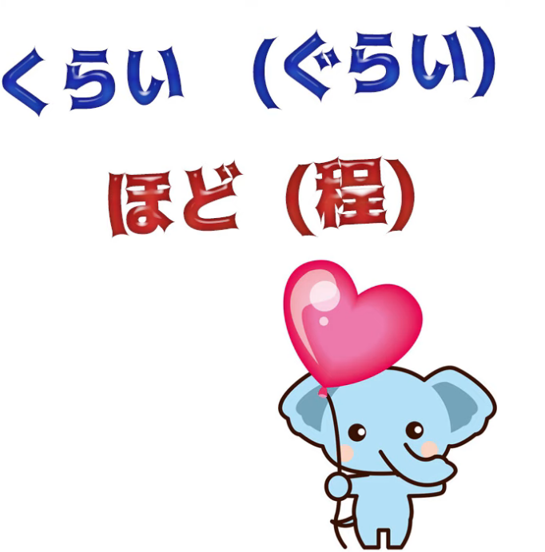
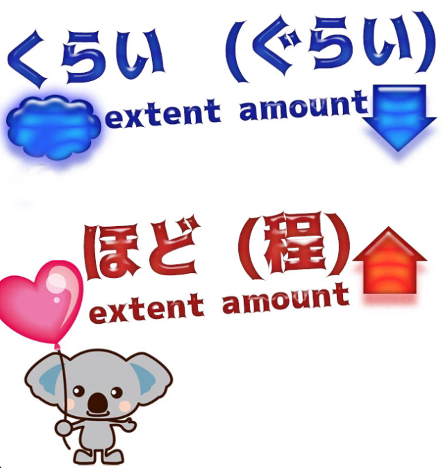
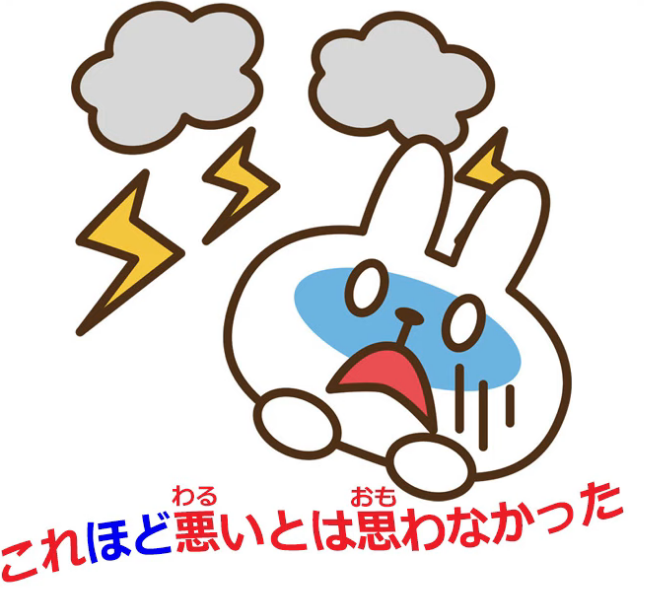
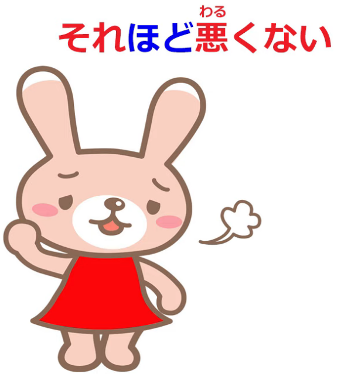
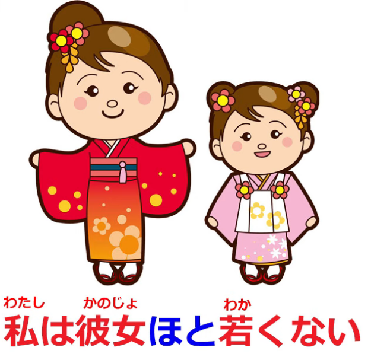
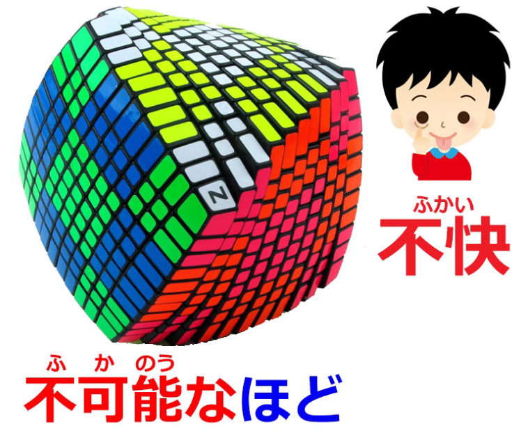
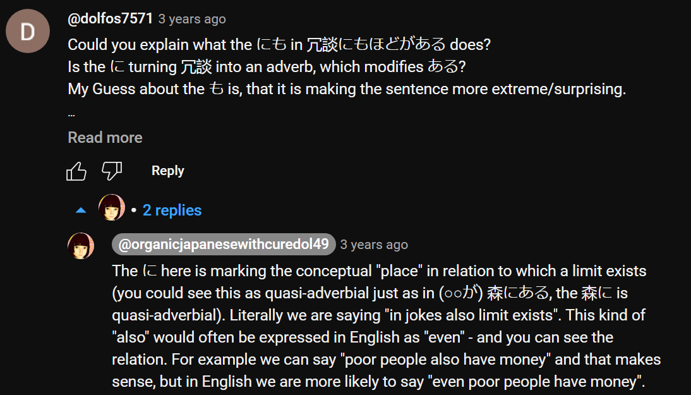
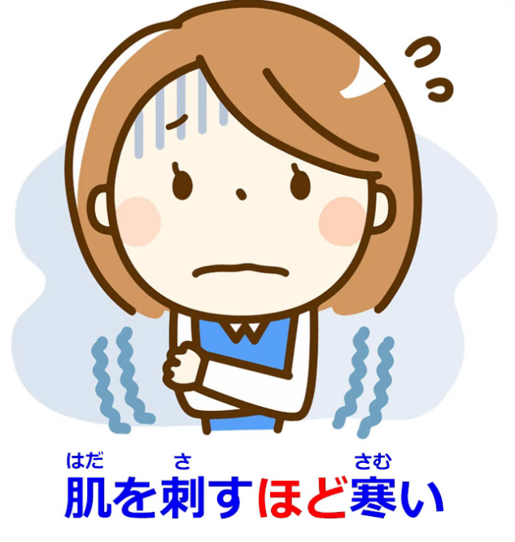
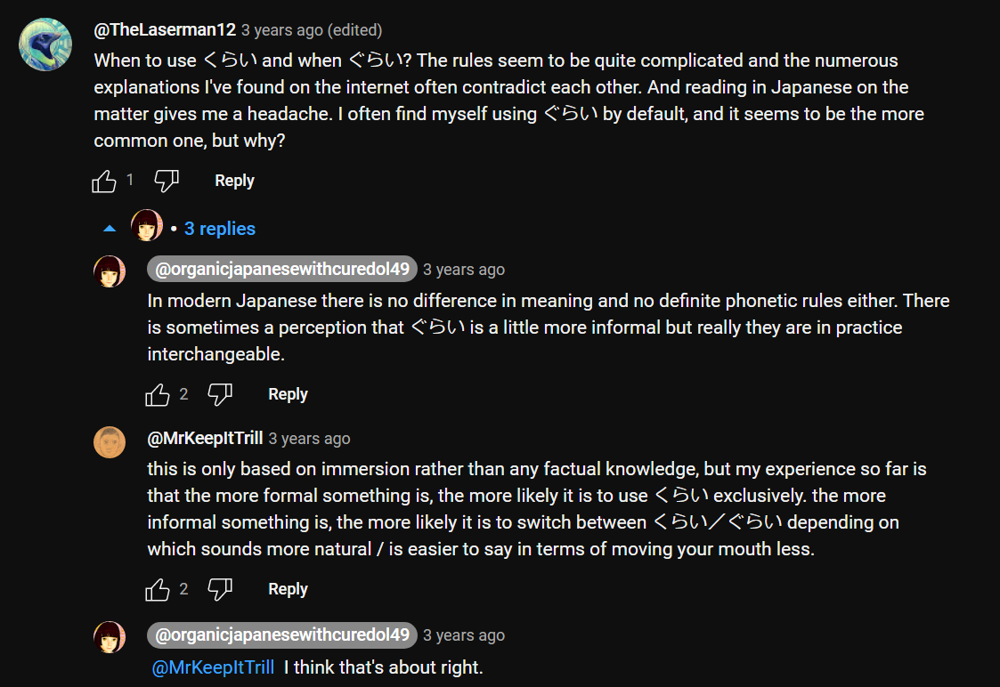
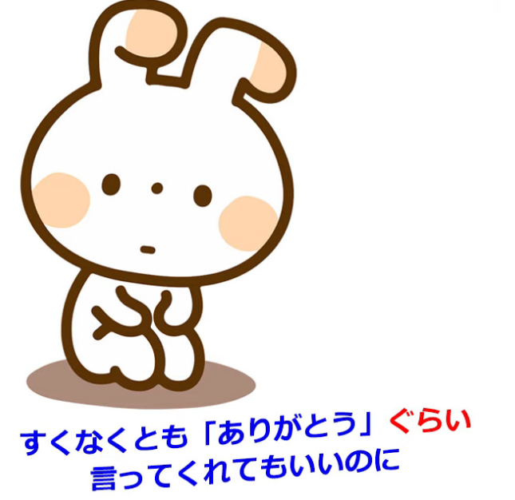

# **94. くらい VS ほど**

[**くらい (kurai) VS ほど (hodo) What they mean and why they mean it.**](https://www.youtube.com/watch?v=6PEQTcDnbBk&ab_channel=OrganicJapanesewithCureDolly)

こんにちは。

Today we're going to talk about

two words that often cause people difficulty and confusion in immersion

because they're often not explained very clearly,

so it's difficult sometimes to understand what exactly it is that they're doing.

**The two words are <code>くらい</code> and <code>ほど</code>.**

Now, I've had a lot of requests for <code>くらい</code>, here and on my Patreon,

and quite a few requests for <code>ほど</code>.

And I'm going to deal with them together

because I think they can throw a little light on each other.

And before we begin, I'll just say that if you have any words that are causing you trouble,

bringing you to a halt in understanding things in your immersion,

please put them in the Comments below and I'll either reply right away

or add them to my list of things to deal with.

---

Right, so, <code>ほど</code> and <code>くらい</code>.

**They're both nouns, of course.**

**Practically everything in Japanese that isn't a verb or an adjective,**

**as we know, is in practice a noun or a noun-like entity.**

So, what is a <code>ほど</code>? What is a <code>くらい</code>?

**Both of them represent an extent or an amount of... anything: time, money, distance, etc.**

**However, the main difference between them is that**

**<code>ほど</code> tends to imply that the amount or degree involved is great,**

---

**and <code>くらい</code> either marks it as indefinite, as something we're not sure about,**

**or in some cases which we'll talk about a bit later, that it is small,**

**that it's less than we might have expected or hoped.**

So, to illustrate this difference, let's look at them both in a very simple construction.

**<code>これくらい</code> means: about this much, about this amount, about this far, about this fast,  
**about this temperature, whatever.

**<code>これほど</code> means: this much, this amount, this hot, this cold,**

**but it's stressing that this is a large extent, a large degree.**

## ほど

So, if we say <code>**これほど悪い**とは思わなかった</code>,

we're saying, <code>I didn't think it was **this bad**</code>.

**So, the <code>これ</code> (this) modifying <code>ほど</code> is not only saying <code>this bad</code>,**

**it's saying that <code>this bad</code> is a lot, this is more than we might have expected or desired.**

**Negatively**, if we say <code>**それほど**悪くない</code>, we're saying <code>it's not **that** bad</code>.

Now, **what's <code>それ</code> referring to in a case like this?**

**It can be referring to something we've already referred to,**

**to a degree or an extent that we've already been discussing,**

but also, just as in English, **<code>それ</code> (or <code>that</code>) can simply mean**

**an amount that we might have expected.**

---

**So, again, the thing modifying <code>ほど</code>, the <code>それ</code>,**

**represents a great amount, an upper limit,**

**and then we're falling short of that upper limit marked by <code>ほど</code>.**

So, <code>**それほど**悪くない</code> means <code>not **that** bad</code> --

**either not that bad** as we have been discussing or as is implied in the conversation,

**or simply <code>not that bad</code>**, which works exactly the same as it does in English --

**the <code>that</code> when there's no reference point simply means**

**what we might have expected or what it might have been.**

So if we say in English <code>it's not that bad</code>, we mean

**it's not very bad, it's not as bad as it might have been.**

---

And the same with <code>**それほど**悪くない</code>.

**If we're not referring to a specific, defined <code>that</code>, then we're saying**

<code>it's not **very** bad / it's not **all that** bad</code>.

And again, **<code>ほど</code> is often used to mark one side of a comparison,**

**and once again <code>ほど</code> represents the greater side, the upper limit.**

So if we say <code>私は彼女**ほど**若くない</code> we're saying <code>I'm not **as** young **as** she is</code>,

I'm not young **to the extent that** she is, and **her extent** is **the higher extent**

**and therefore it's the one modifying <code>ほど</code>.**

### ほど as a noun 

Now, **<code>ほど</code> can be used as an almost independent noun**

**representing the upper limit of something.**

So if we say <code>不可能**なほど**</code>, we're saying

(<code>不可能</code>: <code>可能</code> means possible; <code>不可能</code> means impossible)

<code>不可能な**ほど**</code> means **the upper limit of** impossibility.

**This is not just <code>不可能</code>, not just impossible, it's the <code>ほど</code> of <code>不可能</code>,**

**it's the upper limit of <code>不可能</code>, it's the height of impossibility.**

Or <code>不快**なほど**失礼</code> -- <code>不快</code> is unpleasant, dislikeable; <code>失礼</code>, of course, is rudeness.

This is rudeness **to the upper limit of** unpleasantness / dislikeableness.

---

And these **<code>ほど</code>s where we use an adjectival noun and add <code>なほど</code>** --

**the upper limit of that adjectival noun,**

**using that adjectival noun to modify the <code>ほど</code>** --

**very often they tend to be negative things but they can be more neutral,**

for example, we might say <code>不思議**なほど**</code>

-- **the upper limit of** mysteriousness, absolutely mysterious.

::: info
This phrase above is apparently an expression that can also mean <code>wondrous/marvellous</code>
:::
**And another commonly used expression with <code>ほど</code> is <code>ほどがある</code>,**

**and this really means an upper limit exists.**

**And this is usually used in complaining about something.**

So we say <code>冗談にも**ほどがある**</code>, which is literally saying even a joke **has an upper limit**,

and what that usually means is, what you're saying / what you're doing **goes beyond** a joke.

Jokes have **an upper limit** and you've passed it.

<code>バカにも**ほどがある**</code> (stupidity **has an upper limit**),

which is a bit like saying, <code>Even you can't be that stupid</code>

or you've passed **the upper limit of** stupidity.

### ほど for forming comparisons

**And perhaps the commonest use of <code>ほど</code>,**

the one that you'll probably see all the time,

**is its use in forming comparisons.**

Now, **there are various kinds of comparison in Japanese,**

**but <code>ほど</code> is used particularly when**

**we're stressing the extreme quality of something.**

**It's often used for comparisons that are essentially exaggerations**

**but making the point that something is very much whatever it is we're saying it is.**

So, we might say, <code>死ぬ**ほど**暑い</code> (it's hot **to the extent of** dying);

<code>肌を刺す**ほど**寒い</code> (it's cold **to the extent of** penetrating the skin);

<code>信じられない**ほど**美しい景色</code>

(scenery that's beautiful **to the extent of** being unbelievable).

---

**And this <code>ほど</code> which is used for exaggeration, for literary purposes,**

**just for making a point very strongly,**

is probably the <code>ほど</code> that you're going to see more of the time than any other.

**It's a very common use of <code>ほど</code>.**

## くらい

So, let's look at <code>くらい</code>.

**<code>くらい</code> is most commonly used for approximation.**

So we might say, <code>到着するのは八時**ぐらい**です</code> --

we're saying we're arriving **at approximately** eight o'clock.

<code>八百円**ぐらい**です</code> (it's **around** eight hundred yen).

And this is very straightforward.

::: info
くらい as you can see can sometimes change in sound to ぐらい in some phrases.
:::
*As to when, that is apparently no longer as clear, as can be read [**here**](https://japanese.stackexchange.com/questions/433/is-there-a-rule-for-when-to-use-%E3%81%8F%E3%82%89%E3%81%84-vs-%E3%81%90%E3%82%89%E3%81%84). But wouldn’t worry much.*

**We use it whenever we want to talk about an amount, a degree, an extent, and make it vague,**

**make it clear that we're not talking about an exact amount or an exact degree.**

---

**And the only thing to bear in mind here is that sometimes**

**Japanese people will use this when in fact the thing in question is exact.**

So, for example, we might say, <code>どの**くらい**掛かりますか?</code> (**about** how much will it cost?)

**And we may be asking for an estimate, if it's the sort of thing where you ask for an estimate,**

**but we may also be asking the price in a case where**

**we can expect the seller to know the exact price,**

**but somehow it seems a bit less pressing to ask**

**for an approximate price rather than the exact one.**

---

**And people will also sometimes do this**

**when they're talking about a time of arrival or... anything.**

**And this is partly because Japanese people are on the whole very precise,**

**so if they think there might be any chance of the time being slightly different**

**or any fact being slightly different from what they're saying,**

**it feels a bit safer to vague it up a little bit**

**so that you haven't committed yourself to something exact**

**that might not turn out to be exactly true.**

### くらい as a small extent of something = <code>at least</code>

Now, **the other use of <code>くらい</code> (or <code>ぐらい</code>)**, as I mentioned before,

**talks about an extent and makes the point that**

**the extent is what we consider to be a small one**

**rather than the large one that <code>ほど</code> implies.**

So, if we say <code>今日**くらい**家族と過ごそう</code>,

we're saying <code>Today, **at least**, let's spend as a family</code>.

**And it's that <code>くらい</code> which gives us the <code>at least</code> meaning.**

**It shows that when we are saying <code>today</code> we're not just saying <code>today</code>,**

**we're implying that maybe we don't spend much time as a family,**

**maybe we won't be able to spend time as a family again,**

**but today at least let's spend time as a family.**

#### くらい as complaining about something

**And very often this <code>くらい</code> is used when one is complaining about something**

**and when one is really saying that not only is the <code>くらい</code> small,**

**but even that small <code>くらい</code> wasn't forthcoming.**

**And when it's used like that it's often accompanied by another <code>at least</code> expression**

**like <code>少なくとも</code> or <code>せめて</code>,**

**and often marked at the end by a marker of regret such as <code>のに</code>.**

---

So, we might say, <code>少なくとも「ありがとう」**ぐらい**言ってくれてもいいのに</code>,

which literally is <code>at least **as little as** thank you if you kindly said would be good but...</code>

In natural English, we'd probably say <code>You might at least say thank you</code>.

What we're here saying is that **as little as** thank you, if you had kindly said, would be good,

**and we're adding <code>のに</code>, which,** as [**I've explained elsewhere**](https://www.youtube.com/watch?v=Au5JOtcwE7A),

**is in fact a contrastive clause connector.**

**It's used to connect one logical clause to another to make a complete sentence**

**with the implication of <code>but</code>,**

**that the second clause somewhat contrasts or contradicts with the first,**

**but it's often used like this as a sentence ender.**

And the implication here is,

it would be good if you said **as little as** thank you, **but** (you don't even do that).

So, I hope this clarifies <code>くらい</code> and <code>ほど</code>.
