# **95. Using Word-History the Smart Way どうも、やっぱり、やはり** 

[**In-Depth Vocabulary - Using Word-History the Smart Way どうも (doumo)、やっぱり (yappari)、やはり (yahari)**](https://www.youtube.com/watch?v=WUmByRnrx_U&ab_channel=OrganicJapanesewithCureDolly)

こんにちは。

Today we're going to look at a question that sometimes comes up

because I deal with the Japanese language structurally and people sometimes ask,

**"Does it help in understanding the granular structure of the language**

**to know something about its history, to know where words come from?"**

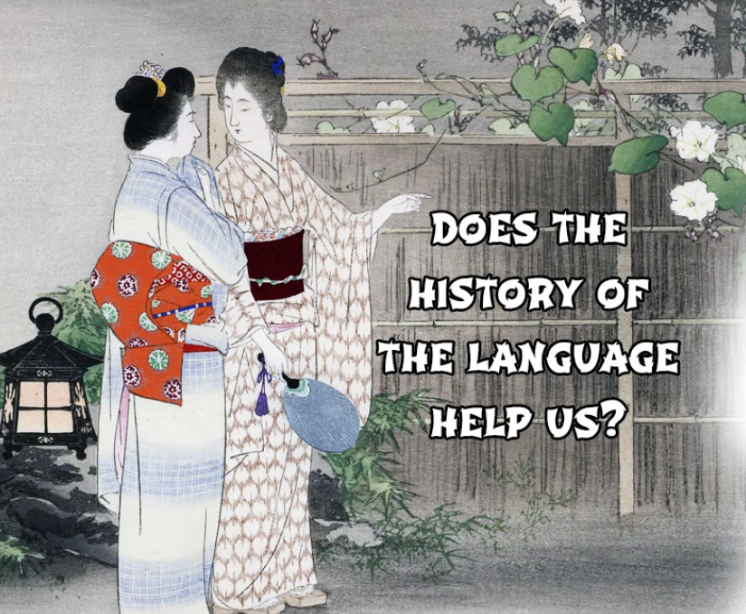

And my answer to that is a pragmatic one, because my whole approach is pragmatic,

and the answer is, **<code>I would say most of the time no, but some of the time yes.</code>**

I'm assuming that most people watching these videos want

to learn to use Japanese, read it, hear it, speak it, write it,

and are not fundamentally interested in the history of the language.

**If we are interested in the history of the language, that's a different matter.**

**purely from the perspective of acquiring the language,**

**it's cluttering our minds with information we don't particularly need.**

**But there are times when it becomes very useful to know**

**something about the history of the language and times**

**when structural puzzles can't be completely solved without it.**

And I'll try to give you a heads up where that's the case

and give you the necessary information.

**There are also times,** which may seem strange,

**when not so much the actual history of the language but folk history,**

**etymological ideas that aren't actually correct, can be very useful.**

That sounds strange, I know, but why is it?

Well, it's because **one of the things about the history of the language**

**and why it often isn't very useful is that**

**it's not telling us about how the language works now,**

**it's telling us about how the language used to work a few hundred years ago.**

And we don't particularly need to know that.

**On the other hand, folk etymology, ideas about**

**the origins of words that aren't actually historically true,**

**tend to represent more recent people's ideas**

**about how the language really does work now.**

**And since these folk etymologies are coming out of**

**Japanese-speaking people in a Japanese environment,**

**they tend to be colored by Japanese people's appreciation of**

**how the language works now rather than how it used to work,**

**back when the words were formed.**

So, we're going to take a couple of examples, and we'll start off with one

in which the real history of the language is useful to us.

And I'm going to take a comment from Algirion-san who commented,

*"One of the words that confuse me a bit is **どうも**.*

*It's often used as a greeting.*

*However, I imagine its literal meaning is along the lines of 'in any way'.*

*It's probably not that critical an issue,*

*but I still wonder how it gets to **hello** from there."*

## どうも

Now, this is an interesting question, and it's not that critical an issue

when we're talking about the more usual meanings of <code>どうも</code>,

when it means <code>thank you</code> or something like that.

**It does become more of a critical issue when we look at another meaning**

**that it has which seems to be quite unrelated but actually isn't.**

---

**When we look in a dictionary, we find a lot of definitions for <code>どうも</code>:**

thank you, thanks, much, very, and also things like somehow, in spite of oneself,

try as one might, no matter how one may try to do or not to do.

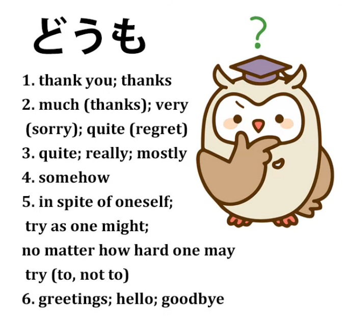

**And as you see they seem to be quite unrelated to the more common meanings of the word**

**and it helps us a good deal to know where <code>どうも</code> actually came from.**

One of the reasons I quoted Algirion-san's comment is that

he actually got the structure right.

*<code>I imagine the literal meaning is along the lines of 'in any way'.</code>*

And it is.

**The trouble here is that unless we know a little more about the history**

**that doesn't take us far enough.**

---

**<code>どうも</code> actually begins in the Edo era**

**and it's a contraction of the expression <code>どうも言えぬ</code>.**

**And that means <code>in any way</code> -- the <code>どうも</code> part means <code>in any way</code> --**

**and <code>言えぬ</code> means <code>unable to say</code>.**

That negativizing -ぬ is something [**I've talked about in a recent video**](https://www.youtube.com/watch?v=E7Qop8dwP4w),

so if you don't know about that, I'll put a link above my head.

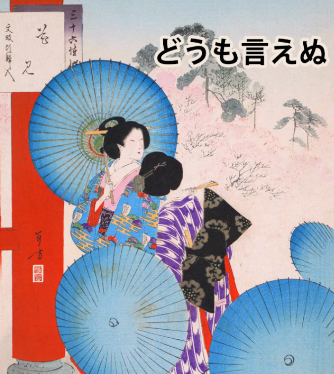

**And in most of the more common uses this was used**

**in the Edo period along with the word <code>ほど</code>.**

And I've made a recent video about <code>ほど</code> as well, so I'll link that. *(Lesson 94)*

**So, <code>どうも言えぬほど</code>:**

<code>どうも言えぬ</code> means <code>I'm not able in any way to say</code>;

**<code>どうも言えぬほど</code> means <code>to the extent that I'm not able in any way to say</code>.**

---

**And now we start to see how this applied to the commonest uses of <code>どうも</code>.**

**<code>どうもありがとうございます</code> means not just <code>Thank you</code> but**

**<code>I'm thankful to a degree (ほど) that I am unable in any means to express / I'm inexpressibly grateful</code>.**

<code>**どうも**すみません</code>: <code>I'm **inexpressibly** sorry</code>.

**Now of course this is a hyperbole and, as always happens with hyperboles**

**when they become settled into the language as regular expressions,**

**it loses a lot of its force, so it ends up just meaning <code>very</code>.**

So, <code>**どうも**すみません</code> (I'm **very** sorry);

<code>**どうも**ありがとうございます</code> (Thank you **very much**).

---

**And this gets attached to basic set expressions like 挨拶**

**to the point where it can be used to replace the 挨拶**

**even in cases where it wouldn't be clear what the 挨拶 is.**

**So we can use <code>どうも</code> to replace goodbye and hello 挨拶.**

**We're just saying <code>very much</code>:** <code>I'm **very** happy to be seeing you</code>;

<code>I'm **very much** looking forward to meeting again</code>.

**It's just become a kind of general 挨拶 stand-in.**

---

**And it's a very useful one because being somewhat effusive,**

**it seems pleasant and polite, it's not over-formal, it's not over-informal,**

**it's just a very useful expression to throw in in place of an 挨拶.**

**Of course, it replaces the ones where it makes more logical sense,**

**so we can say <code>どうも</code> for <code>I'm sorry</code>, and <code>どうも</code> for <code>thank you</code>.**

So these are the commoner uses.

---

Now, the other meanings in the dictionary: somehow, in spite of oneself,

no matter how hard one might try to or try not to -- that kind of thing.

**We can see that this is in fact <code>どうも言えぬ</code> without the <code>ほど</code>.**

We're just saying **<code>どうも言えぬ</code>** (I can't **by any means** express).

So if we say <code>**どうも**落ち付かない</code>

(**somehow** I just can't calm down, can't settle down).

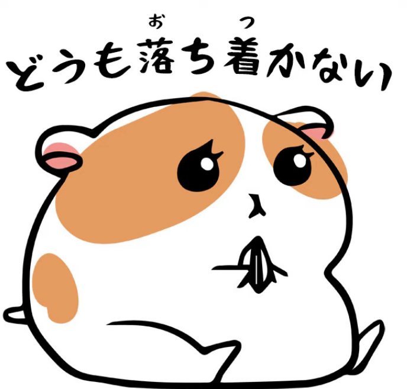

**<code>どうも</code> (somehow), which is originally <code>どうも言えぬ</code>:**

I can't **in any way** say why, but I can't settle down.

<code>**どうも**呼吸が合わない</code> (**somehow** we just don't get on).

<code>Our breaths don't come together</code>, literally.

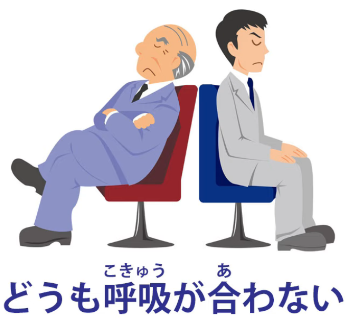

**Somehow** we just don't get on --

I can't possibly say why that is, but **somehow** that's the case.

---

**And from there on, if we can't do something or we don't end up doing something,**

**and no matter how hard we try to do it or not do it, it doesn't come about...**

<code>**どうも**言えぬ</code> (I can't say why, **but that's just how it is**).

**So this is how "どうも' comes to have such a wide range of meanings.**

And if we link it back to just that concept

of not in any way being able to express,

we can see how it all came about,

and I think it makes it much easier to understand and manage.

## やっぱり / やはり

Now, **one where we're going to talk about a false etymology is <code>やっぱり</code>,**

**which also takes the slightly more formal form <code>やはり</code>.**

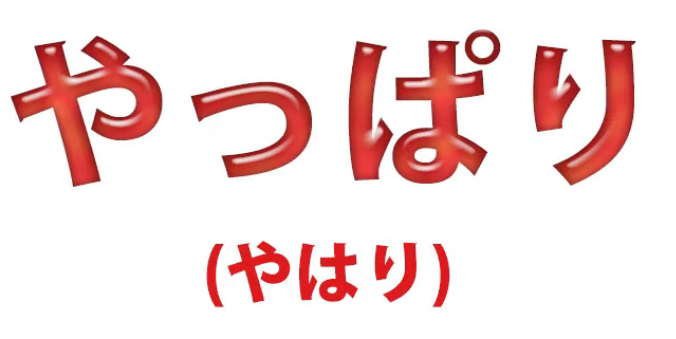

**It's rather like <code>日本 / にほん</code>, which also can be said as <code>にっぽん</code>.**

**<code>やはり</code> can be said as <code>やっぱり</code>.**

---

**And the most usual way in which we hear this is meaning**

**<code>just as we thought, just as we understood</code>.**

So, if Sakura does something very silly, we might say,

<code>**やっぱり**さくらはバカなのね</code> (**Just as we thought**, Sakura's an idiot).

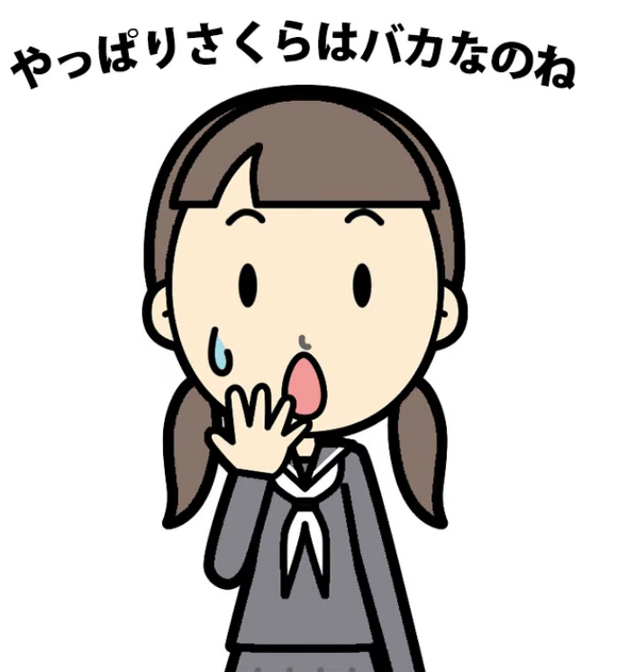

Now, **another way** we often hear it in immersion, anime, other places,

**is when a feeling wells up inside us and very often changes our mind.**

So, for example, if our heroine looks at a scary house

and she says, <code>Ooh, that's really scary, I'm not going in there</code>

and then she makes up her mind, steels her nerve, and says,

<code>Right, I'm going in</code> (よし行くぞ) and in she marches, she opens the door,

looks around and says <code>**やっぱり**怖い</code> *(As expected, (it) scary-is)*  
and decides not to go in after all.

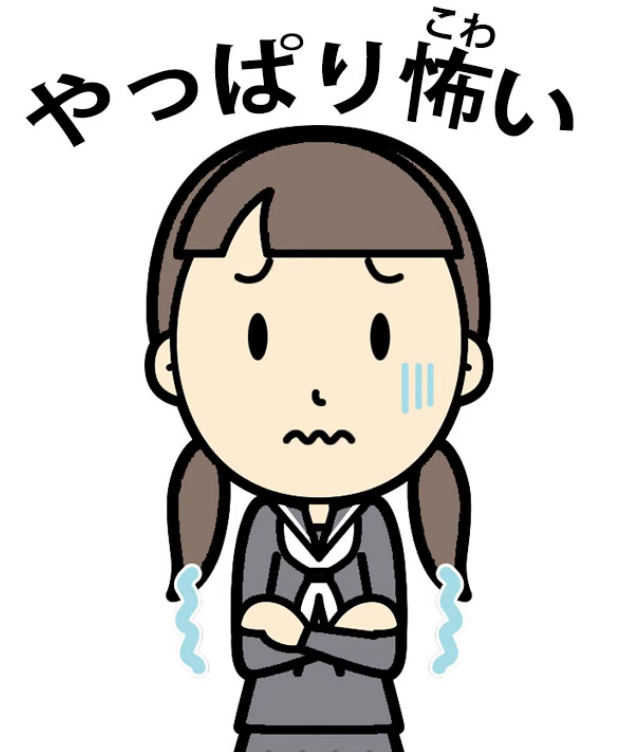

Now, what's going on here?

The dictionary once again gives it quite a wide range of meanings, some of which

we hear less often but all of which are part of the meaning of the word, like

**still, as before, even so, either way, nonetheless, etcetera.**

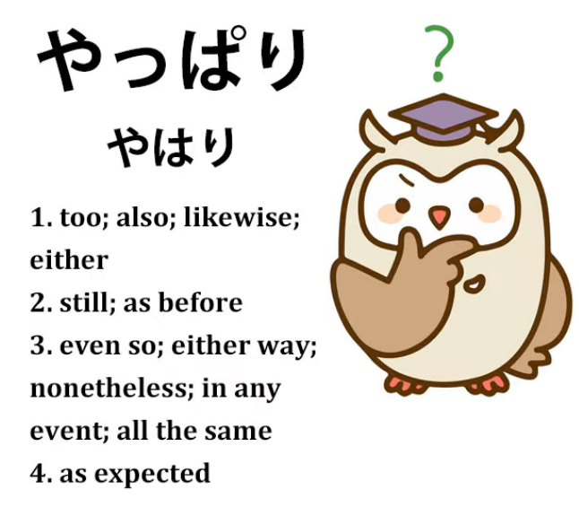

How does all this fit into <code>やっぱり</code>?

Now, there is a folk etymology for <code>やっぱり</code>.

<code>やっぱり</code> is written in kanji like this.  
*(or rather やはり since it won’t give you the option with やっぱり)*

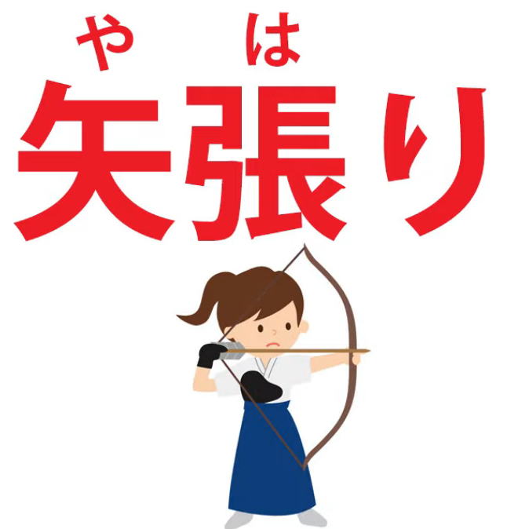

**Don't write it like this because you'll look like someone who's done Heisig**

**and has no idea what's written in kanji and what isn't.**

*Note; This is good advice indeed, since one of the things of Japanese is knowing when an expression has an outdated/unnecessary Kanji form that is no longer really used outside of some specific writings in general language. Usually speaking, at least via Japanese keyboard, what is suggested to you first is likely the most common version; common expressions and function words tend not to use Kanji and writing every single word in Kanji may seem excessive. You will get the hang of what words do not tend to use their Kanji forms the more you read.*

*Though, some authors may use outdated/excessive Kanji forms to simulate archaic settings etc.*

**But these are the kanji: <code>やはり</code>.**

**As you see, we have an arrow**

**and we have the kanji for stretching or straining or tightening.**

---

**And these kanji aren't in fact the original kanji**

**and were apparently only used for the sound.**

**So the folk etymology here isn't historically accurate.**

But what it states is that the kanji, which are for pulling an arrow tight on a bow --

what happens when we pull an arrow tight on a bow?

Well, at this point we're focusing, aren't we, on the target.

And in Zen archery -- and Japanese archery is rather based in Zen --

we're supposed to see nothing but that target.

Now, suppose we are distracted.

Suppose we look around, see something,

hear something rustling, somebody speaks to us.

**If we're good archers, immediately after that we go back to the <code>やはり</code>,**

**the stretched-bow target beyond which we see nothing else.**

**So, the idea is returning to our original focus.**

This is what we mean when we're talking about Sakura.

**We always thought she was an idiot , and <code>やっぱり</code> she is an idiot.**

**It also works with feelings, which are a stronger focus in a way than thoughts.**

So, **if something felt scary in the first place, then we decide to go and face it,**

**and then when we get there, <code>やっぱり</code> it is scary,**

**we're pulled back to our original focus.**

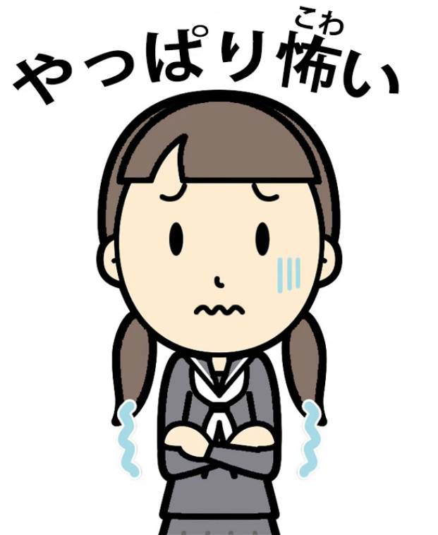

**Now, what we do about this depends on us.**

**We may then decide not to go in; we may decide to go in.**

**But either way, we've been pulled back to that <code>やっぱり</code>, that original focus.**

---

So what about these other dictionary definitions?

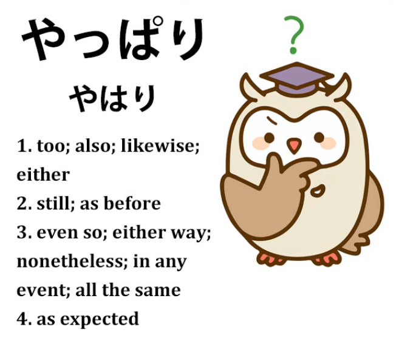

**As is often the case with English dictionary definitions,**

**these aren't really things that <code>やはり / やっぱり</code> actually means**

**so much as English expressions whose meaning spectrum**

**overlaps with that of <code>やはり</code> at certain points.**

---

So, **when we take the words <code>either</code> and <code>also</code>,**

which actually mean the same thing **in certain contexts** in English...

**It's just that English uses one word for the negative**

**and another for the positive, which Japanese doesn't.**

So, for example, if we say <code>やはり...</code> (and in cases like this it is usually <code>やはり</code>)

<code>**やはり**僕も見ない</code> (I don't see it **either**).

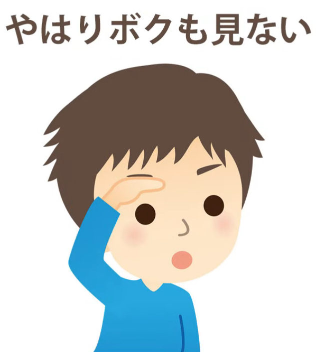

What's that <code>やはり</code> doing there?

**Well, of course we don't say <code>I didn't see it either</code> unless**

**the other person has said they didn't see it.**

**So what we're doing here is returning to the original focus**

**of the conversation:**

A: "You didn't see it?

B: Well.. (stressing the point by saying that we're returning back to that focus)  
I didn't see it **either**."

---

<code>僕も**やはり**行きました</code> (I went **too** / I **also** went).

Again, **the other person has said that they went**

**and we stress the も by saying <code>やはり</code>**,

**returning to the original focus of this part of the conversation,**

**to the fact that you went,** <code>well, ****やはり**** -- **original focus** -- I went **too**.</code>

---

And it can be used for concepts beyond even what the dictionaries draw it out to.

For example, **it can mean <code>predictably</code>:**

<code>**やっぱり**雨が降り出した.</code>

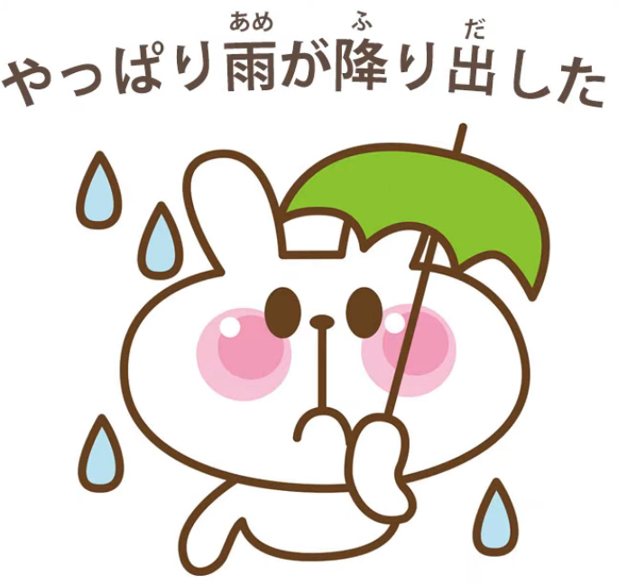

Now, **in this case we may not have been specifically thinking it was going to rain,**

**but what we're saying is well, everyone knows it rains on these occasions.**

So, **going back to what might have been our original focus, if we'd had one,**

<code>**やっぱり**雨が降り出した</code> or as you might say in English,

<code>**Just as you might have expected**, it rained</code>.

---

So I hope that helps with these very common words.

And **fortunately I would say it's not that often**

**that we need to know historical information outside of**

**the ordinary structure of a word in order to understand it.**

But obviously there are cases,

**especially with expressions drawn from proverbs and things like that,**

**where it helps to know the proverb,**

**and in some cases with actual words like this**

**where it helps to know what <code>どうも</code> originally meant.**

**And in the case of <code>やっぱり</code>, it's a concept that we don't really have in English,**

**this original-focus concept, and even though it's a folk etymology,**

**not a historical etymology, it really helps us to understand**

**how Japanese people see and understand that expression.**

::: info
As always, you can check the [**comments**](https://www.youtube.com/watch?v=WUmByRnrx_U&ab_channel=OrganicJapanesewithCureDolly) of the video for some interesting bits.
:::
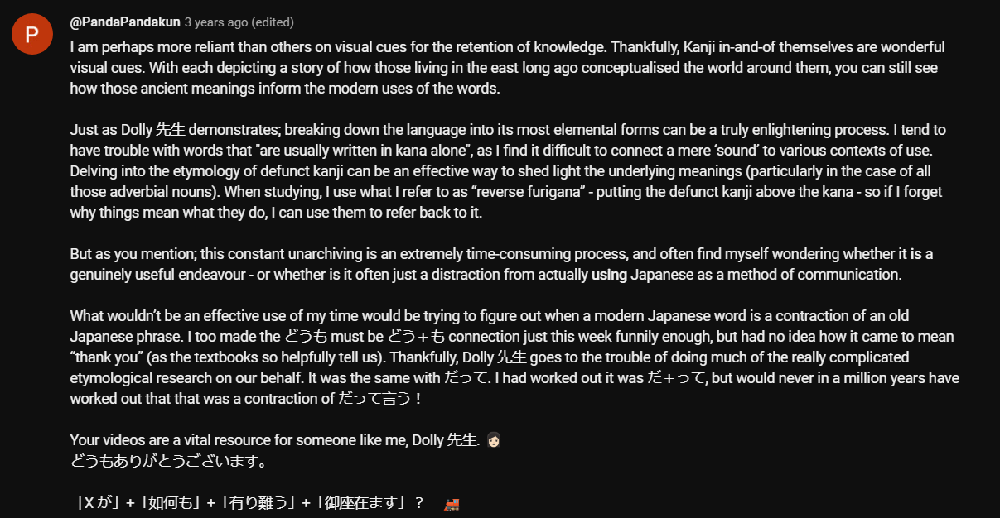
