# **96. 通り and せっかく: A metaphorical road and an untranslatable word.**

[**通り and せっかく: A metaphorical road and an untranslatable word.**](https://www.youtube.com/watch?v=G3qc0esEbvE&ab_channel=OrganicJapanesewithCureDolly)

こんにちは, and welcome to 令和三年 *(2021)*.

Under two years ago *(the video is from 2021)* the Reiwa era began *(2019)*

with an upsurge of hope for a wonderful new era.

And then came Reiwa 2 *(2020)*, which quickly turned out

to be something of a disastrous year.

It was going to be the year of the Tokyo Olympics,

and we all know what happened to that.

But I still believe that Reiwa is going to be a wonderful new era

and perhaps 令和三年 will start to show us that.

Today we're going to talk about two words

that I've been asked about recently.

## 通り 

**The first is <code>通り</code> in its attachment to other words.**

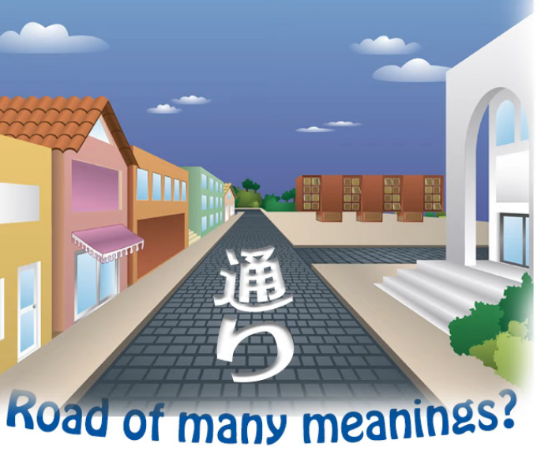

**<code>通り</code> of course, on its own, is the い-stem of <code>通る</code> (pass through).**

**And as a noun, it means a road or a way, or the act of passing through.**

### その通り

**It then gets used in expressions like <code>その通り</code>**

and what this means literally is **<code>that road, or that way of travelling, that way of passing through</code>**.

**And what this actually means is <code>that's right / you're absolutely right</code>.**

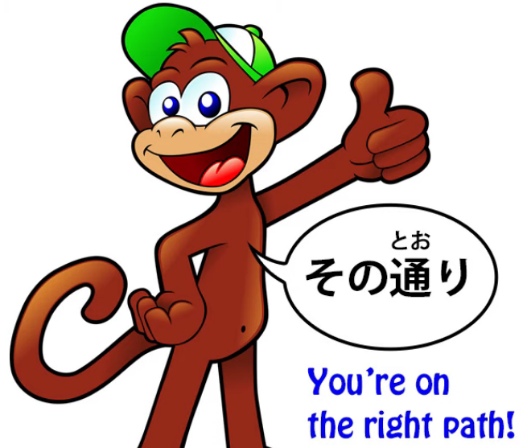

How does it come to mean that?

**Well, it's really saying that the way you're thinking,**

**the road, the track, the passage along which**

**you're thinking, is the correct one: <code>その通り</code>.**

A little bit similar in English to saying <code>you're on the right track</code>,

except that <code>you're on the right track</code> in English

would imply that you're not quite there yet,

**but <code>その通り</code> means you're thinking along exactly the right lines,**

**you're there, you've got it, you're right.**

### ごらんの通り / ご覧の通り

**Another expression that uses <code>通り</code> is <code>ごらんの通り</code>.**

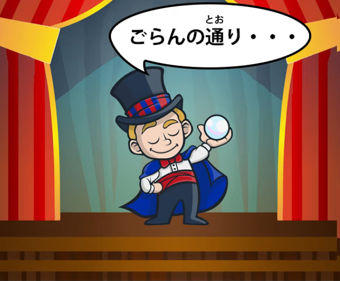

Now, <code>ごらん</code> when it's written in kanji is written like this.

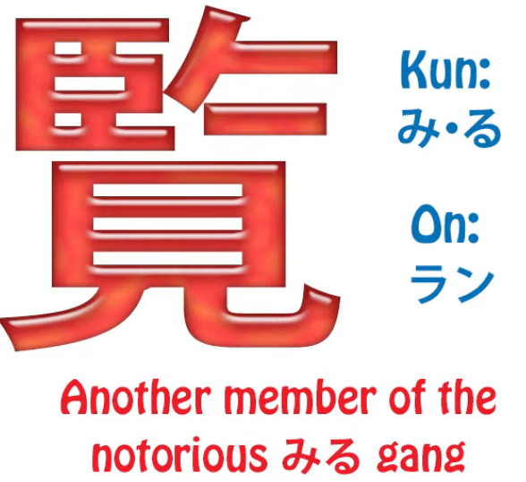

::: info
御覧 is the full Kanji version of ごらん, even with the ご honorific in Kanji form, but overusing Kanji for everything is not that viable either, but it depends on the words and usage.
:::
So **you can see the <code>ご</code> is honorific;**

**the <code>覧</code> is actually another way of writing the word <code>見る</code>.**

Now, [**I did a video**](https://www.youtube.com/watch?v=6Kh1AJx77Ng) a little while ago on the word <code>見る</code> (see or look or watch)

and five different kanji with which it can be written.

*見る, 観る, 看る, 診る, 視る*

**And I said at the time there are in fact more.**

I didn't introduce them because they're not all that common,

and this one *(覧る)* isn't a common way of writing <code>見る</code> either.

But with its on-reading <code>らん</code> it is used, and

**<code>ごらん / ご覧</code> is an honorific way of saying <code>the act of looking or seeing</code>.**

**So <code>ご覧の通り</code>, rather like <code>その通り</code>**, means

**<code>as you can see / along the lines of your seeing is correct</code>,**

just as along the lines of your saying or thinking is correct.

**<code>ご覧の通り</code> (as you can see).**

### 思い通り

**Another <code>通り</code> expression is <code>おもいどおり / 思い通り</code>.**

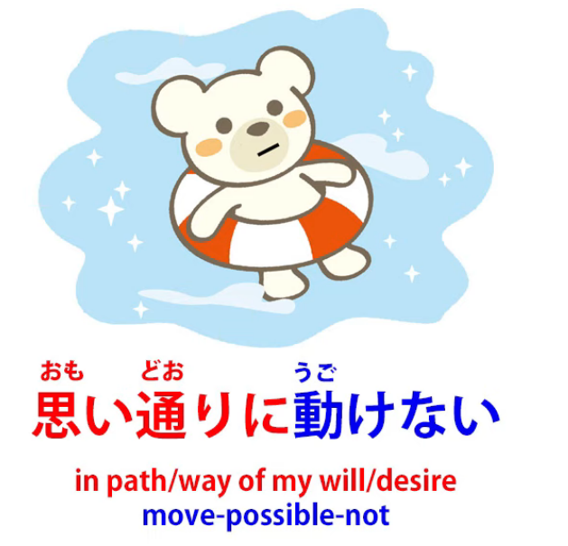

Now, **here of course we're using the い-stem of <code>思う</code>,**

which gets translated as <code>think</code> in English

**but actually means more than that, it means <code>feel</code>.**

**But <code>思い</code> often also means one's will, one's desire,**

and I mentioned this in a previous video *(Lesson 42)*

when I was explaining how **<code>思いのまま</code>** means

**<code>in the unchanged condition of one's will or desire</code>.**

And I'll put a link for that in case you're interested in following it up.

**<code>思い通り</code> means <code>in the road, the track, the course of one's will or desire</code>,**

**so it means having things go or wanting things to go in accordance**

**with one's will / in accordance with one's wishes.**

---

**And that can be anything from selfish desire to,**

**when you're in the water perhaps, wanting**

**your body to move in the way that you want it to move,**

which it doesn't always do when you're in the water.

## せっかく

**Now, the other word that I've been asked about is <code>せっかく</code>.**

Now, <code>せっかく</code> has a whole range of definitions

if you look in the dictionary.

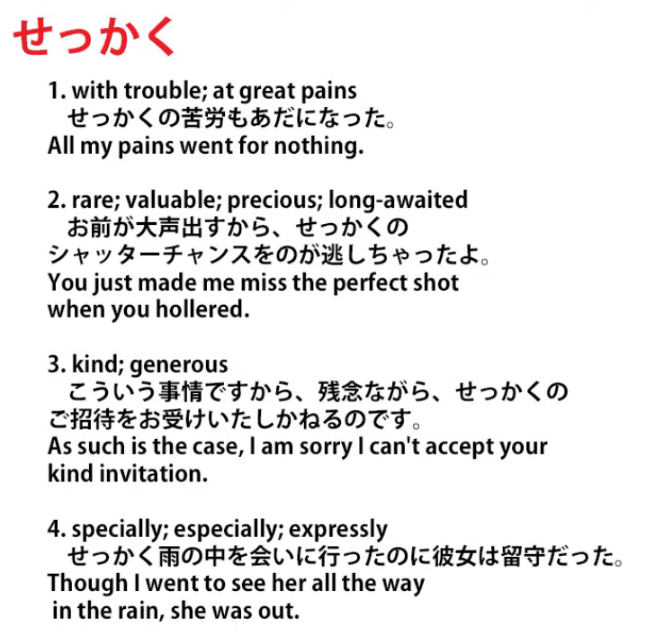

**It's defined as "with trouble, great pains; rare, valuable, precious,**

**long-awaited; kind, generous; specially, expressly",**

which is rather a lot of things for one word to mean.

**But essentially they all come down to the same thing,**

**which is the notion that something is valuable and in some sense irreplaceable.**

### せっかく as <code>do x with great effort / trouble and is too precious to replace</code>

Now, **probably the most common implication is**

**that great trouble has been spent on it.**

So if we say <code>せっかくの努力が水の泡だ</code>,

**we're saying <code>My **せっかく** efforts have come to nothing</code>,**

literally <code>...are foam on the water / bubbles on the water</code>.

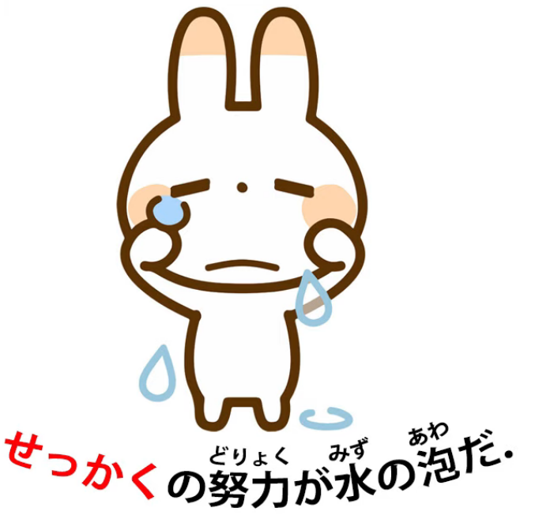

So we can see that obviously as the most common usage,

the usage people probably think of most often,

**which is <code>with great effort / with great trouble / having taken the effort (to do something)</code>.**

---

We might say <code>**せっかく**東京に来た, we ought to go to Sanrio Puroland</code>,

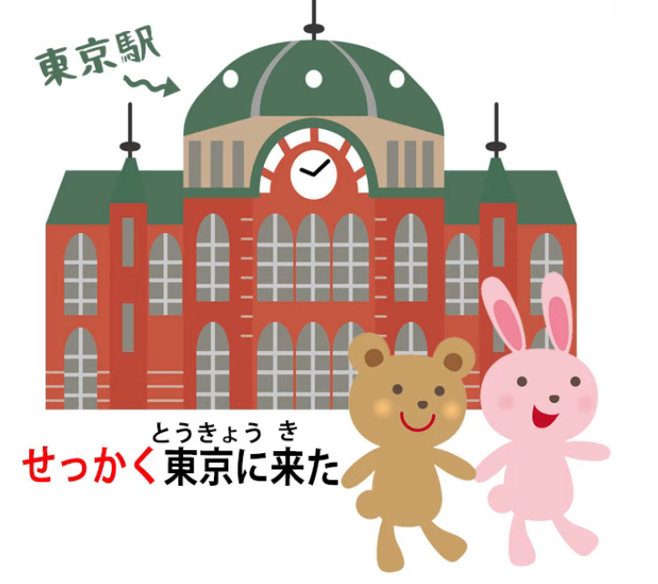

**because if you've taken the trouble to go all the way to Tokyo,**

**it's a bit of a waste of time if you don't get to Sanrio Puroland**

and see Hello Kitty and My Melody and Pom Pom Purin

and all the wonderful people that live there, the Little Twin Stars.

**If you ever <code>せっかく</code> get to Tokyo, you really must go there.**

---

But back to the subject in hand.

**However, the point about <code>せっかく</code> is not just**

**the trouble that might have been taken,**

**it is the fact that something is rare and precious and difficult to replace.**

**Going to Tokyo is difficult to replace because once you've left**

**you've got to take all the trouble to go back there again.**

But you might also say <code>**せっかく**の休日も雨で潰れた</code>

(The **<code>せっかく</code>** day of rest / holiday was ruined by rain).

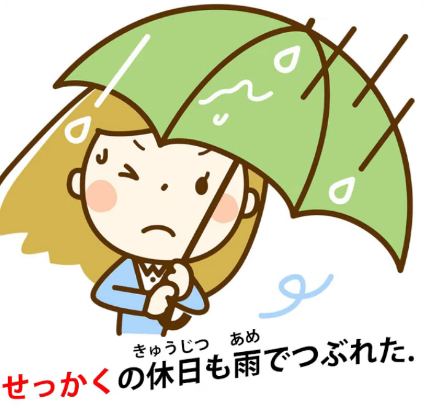

**And that's <code>せっかく</code> because it's relatively rare.**

**You don't get that many days off.**

So just like going all the way to Tokyo or taking all those efforts to do something,

**it's <code>せっかく</code>, it's precious, it's rare, it's hard to replace.**

<code>あの広告が**せっかく**の風景を損なう</code>

(those advertisements / those billboards ruin the **<code>せっかく</code>** scenery).

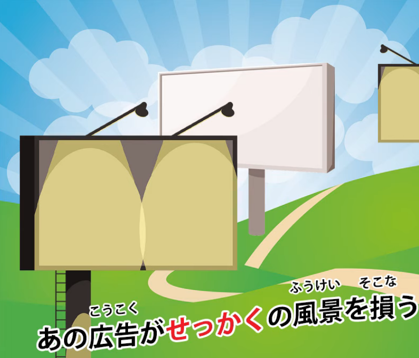

**And again, <code>せっかく</code> in this case doesn't mean hard work,**

**it doesn't mean rarity in the sense of not coming very often,**

**it just means that that scenery is something beautiful and unique**

**and irreplaceable and it's being ruined by the billboards.**

---

**And there isn't really a word to replace <code>せっかく</code> in English.**

It's a word that I would say is in some ways influenced by Japanese culture.

**The idea of the preciousness of the sakura** *(tree)* because

**it only comes for a short time and it's quickly**

**blown away by the winds or beaten down by the rain.**

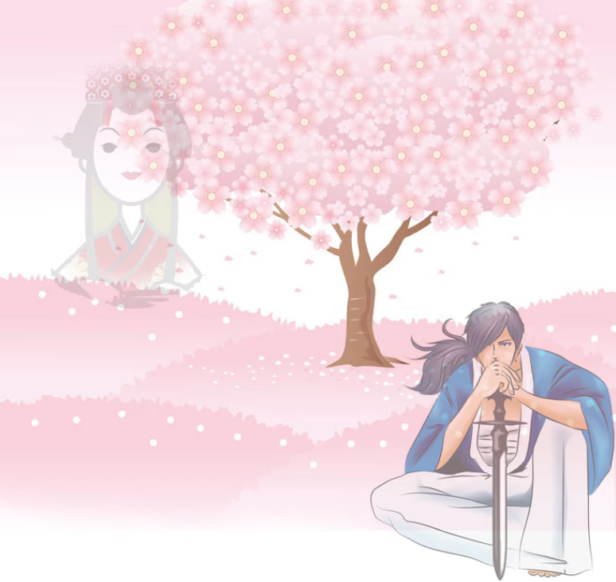

The sadness, the fleetingness, the <code>儚い</code> nature of life

and the necessity to grasp what is rare and precious

as it passes, while we can.

::: info
This hits quite differently when we realise Dolly passed away that year… R.I.P. 🙁
:::
.
