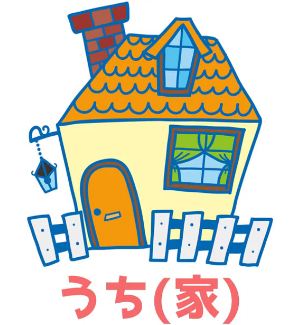
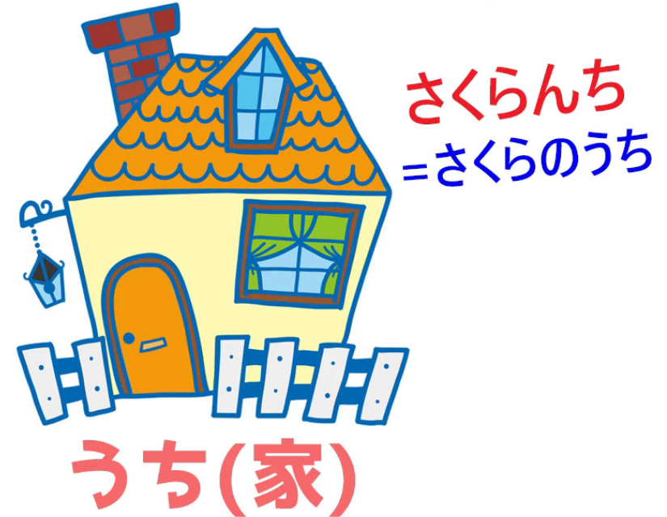
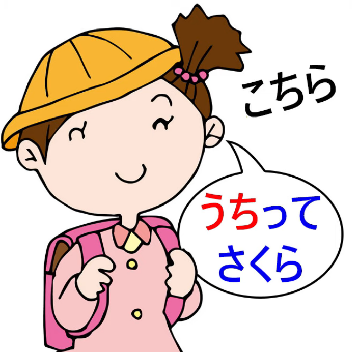
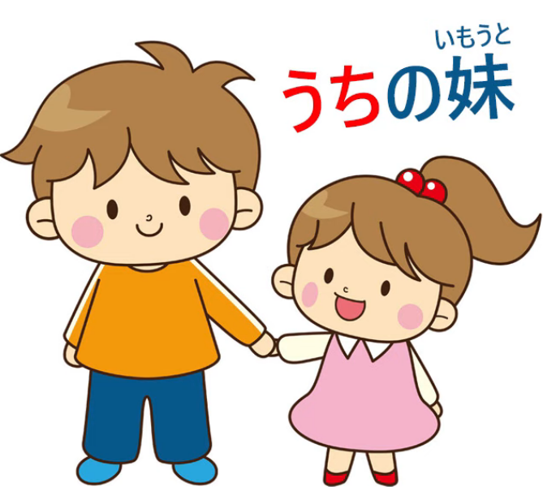
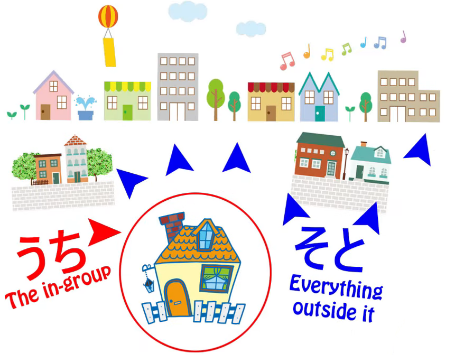
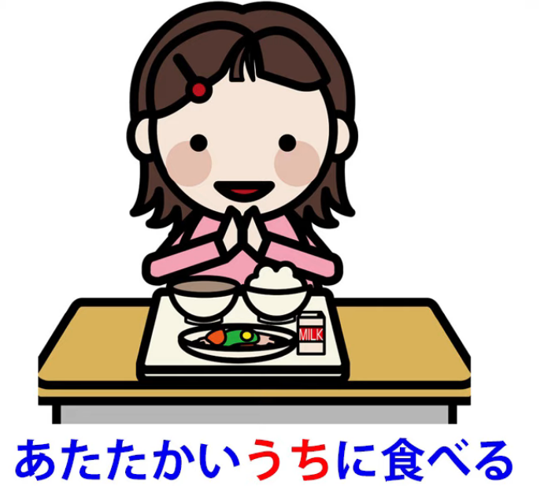
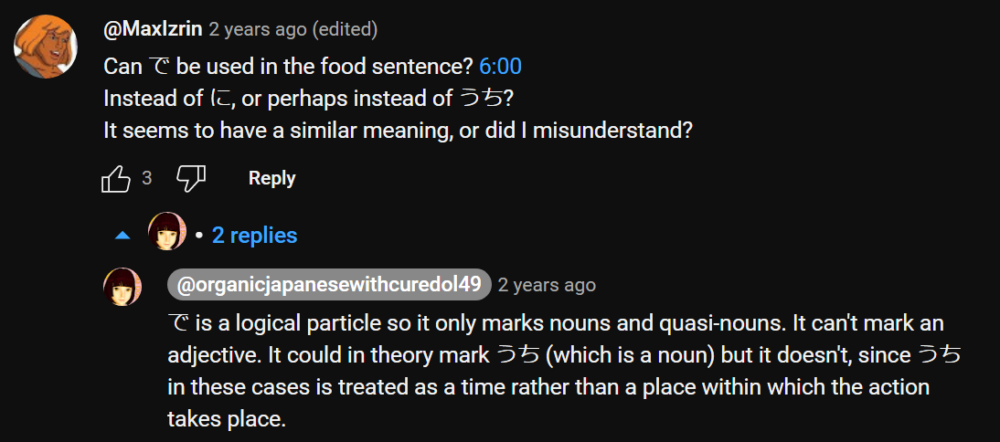
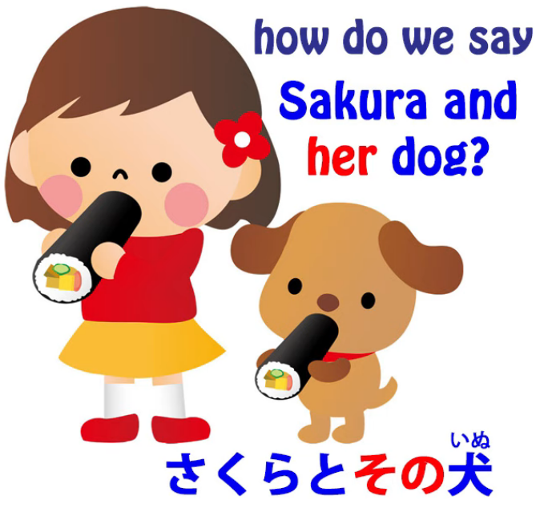
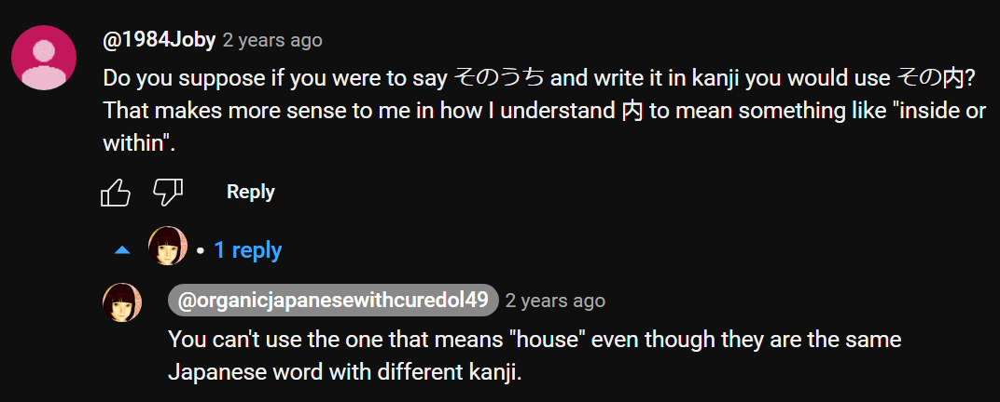
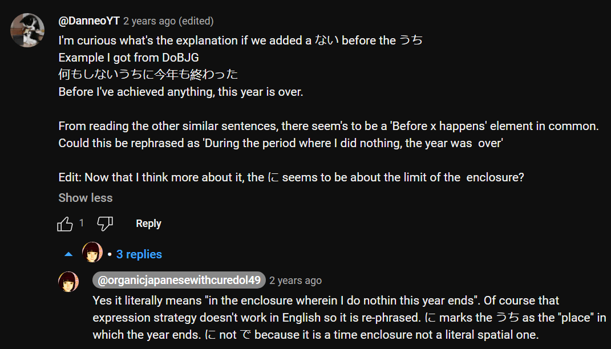

# **97. The meanings of うち: Home, Self, Social boundary, Time marker: いまのうち、そのうち**

[**Language and Culture: The meanings of うち: Home, Self, Social boundary, Time marker: いまのうち、そのうち**](https://www.youtube.com/watch?v=56sy0qfY0Js&ab_channel=OrganicJapanesewithCureDolly)

こんにちは。

Today we're going to talk about a word that has

a whole long list of definitions in the dictionary,

many of which seem to have nothing to do with each other.

I won't even go into this list.

We'll just tackle the word and what it really means and see how it

comes to have so many other extended meanings.

**The word is <code>うち</code> and it's one of the words you learn early on in Japanese.**

**Probably the first context in which you learn it is that it is**

**an alternative way of pronouncing this kanji** *(家)*.

**It can be <code>いえ</code> but it can also be <code>うち</code>, and both of them mean <code>house</code>.**

**This is the only way we can use this kanji.**

---

**The other <code>うち</code> is this one - 内,**

**and I don't think we should really regard them as different words, because**

**it's a native Japanese word that had the Chinese kanji imposed at a later date**

**and, as is often the case, the kanji helps a little bit to differentiate exactly what we mean.**

But only a little bit here.

---

So, **when <code>うち</code> means <code>house</code> *(家)*,**

**the difference between <code>いえ</code> and <code>うち</code>**

**is that <code>いえ</code> refers to the physical building, the actual house.**

**<code>うち</code> refers to what you might call the spiritual interior of the house:**

**the family, the life that takes place in the house.**

To a small extent we can say that it's somewhat similar to the difference

in English between the words <code>house</code> and <code>home</code>.

**If we say that we're visiting someone's house,**

**we usually say <code>うち</code> because it is <code>house</code> in the sense of their family, their home.**

**That's what we're visiting. We're not visiting the physical building.**

And just as a little sidenote,

**you might sometimes encounter expressions like <code>さくらんち</code>.**

**This is a very common abbreviation for <code>さくらのうち</code>.**

**So this really actually gives us the basis for all the other meanings of <code>うち</code>,**

whichever kanji it's written with:

**this notion of a spiritual interior, an enclosure, defined, as it were, by its contents.**

## うち as meaning <code>me</code> / 私 etc.

Now, the next time you encounter <code>うち</code> may well be

when you encounter, in anime or something, a girl who's **using Kansai-ben**,

**and typically she will say <code>うち</code> instead of <code>私</code>.**

**So <code>うち</code> can mean <code>me</code>, particularly feminine,**

**particularly the Kansai dialect, although it's not restricted to that.**

---

**And this is very interesting because it's rather similar to when**

**<code>こちら</code> is used to mean <code>me</code>;**

**again, what <code>こちら</code> means is <code>this side (the side that includes me)</code>.**

And this really has to be understood

in the light of the fact that

**the distinction between the individual and the family or group to which an individual belongs**

**is much less marked in Japanese than in Western culture**

**and in the past was even less marked than it is now.**

---

**When Japanese people talk about,**

**say, <code>my little sister</code>, generally speaking they won't say <code>僕の妹</code> or <code>私の妹</code>.**

They would tend to say <code>**うち**の妹</code>

(the little sister of **our house** / the little sister of **our family** / the little sister of **our group**).

And even <code>**うち**のきょう</code>, which is

<code>the religion of **our house**, **our family**, **our group**</code>,

**because religion is still to a large extent regarded in Japanese as something inherited, something part of one's family group,**

**rather than an individual decision or commitment.**

## うち vs そと

**Now, from this we get a very fundamental distinction in Japanese,**

**which is between the concepts of <code>うち / 内</code> and <code>そと / 外</code>.**

**<code>うち</code> refers to the group one belongs to, the in-group;**

**<code>そと</code> refers to everything outside that group.**

And this has wide-ranging implications for Japanese culture

and also for the Japanese language.

---

**For example, words like <code>くれる</code> and <code>あげる</code>, which are generally**

**explained to mean giving something up from oneself or**

**receiving something down to oneself,**

**is not strictly limited to the self.**

---

**It's actually referring to the <code>うち</code>, which could**

**be oneself but could also be the group to which one belongs.**

**So, when we talk about someone <code>くれる</code>-ing to one's sister or one's friend**

**this is because we regard the sister or the friend as part of our <code>うち</code>,**

therefore it's giving down to <code>us</code>.

**And you'll sometimes see <code>くれる</code> used even where**

**there is no strict connection between the speaker and the person receiving,**

**but if the speaker is identifying with that person, regarding them at this point**

**at least as more <code>うち</code> than <code>そと</code> then <code>くれる</code> is appropriate.**

---

So we can see that this whole concept of <code>うち / そと</code>,

which has wide-ranging cultural implications which I won't go into,

also has implications for the grammatical structures we use.

## うち used to define a group that x is a part of 

Now, developing from this,

**<code>うち</code> can be used to define a group of which anything is a part.**

So we can say <code>多くの**うち**から選ぶ</code>,

which means <code>choose from a large number</code> or, strictly speaking,

<code>choose from **a group consisting** of a large number</code>.

**So <code>うち</code> here refers to the group from which one's choosing.**

---

**And it can become a little more abstract than that.**

**It can be referring to an <code>うち</code> of time, an enclosure of time,**

**and again, an enclosure defined by its contents.**

So, we might say <code>温かい**うち**に食べる</code>, which means <code>eat it **while** it's warm</code>.

<code>Eat it **while** it's hot</code>, as we'd say in English.

<code>**温かいうち**</code> is that <code>うち</code>, **that enclosure, that period, during which the food is warm.**

So **it's an enclosure defined by its contents, like the other kinds of <code>うち</code>.**

**When does the <code>うち</code> end? It ends when the food stops being warm.**

Similarly, <code>若い**うち**</code> (**while** one is young) --

one should do this, do that, **while** one is young.

**The <code>うち</code>, the enclosure of time, is defined by its contents.**

**While** one is young, one is in the <code>若い**うち**</code>.

**When one ceases to be young, that's where the limits of the enclosure lie.**

### 今のうち

And **this can extend to usages that can be a little confusing at first.**

So, for example, <code>**今のうち**</code>, which is a phrase you'll often hear in anime and such.

For example, when an enemy is disabled and now is the time to do the

magical purification, somebody might shout <code>**今のうち**!</code>

And what that means is literally

<code>**in the house of now** / **in the enclosure of now**</code>.

**It doesn't necessarily mean <code>this absolute instant</code>,**

**but it does mean <code>while now continues</code>.**

---

What does <code>now</code> mean in this case?

Well, **<code>now</code> means the situation as it is at present,**

in this case, **while** the villain is still purifiable,

**while** he's disabled, **while** we can actually do what we need to do.

It could mean, **while** we're still able to run away.

It could mean, **while** the Great Door still hasn't closed.

In other words, <code>**今のうち**</code> is

<code>**while the circumstances that prevail at the moment continue to prevail**</code>.

**Once they cease to prevail, you will no longer be <code>今のうち</code>.**

### そのうち

And another one that can seem confusing is <code>そのうち</code>.

Now, **<code>そのうち</code>** is translated as meaning, and does mean,

**<code>sooner or later / at some time in the future / it will eventually happen / by and by</code>.**

So why does <code>そのうち</code> mean that?

To understand this, we not only have to understand <code>うち</code>

but we have to understand a little bit more about <code>その</code>.

#### What does その mean

Now, I've made a video *(Lesson 75)* in which I explain

various things about the use of <code>その</code> in Japanese.

**It very often replaces what in English would be pronouns.**

So if we say <code>さくらと**その**犬</code>, we're **not** saying <code>Sakura and that dog</code>.

We're saying <code>Sakura and **her** dog</code>.

**<code>その</code> often implies something related to what we're talking about.**

**And it's one of the strategies that's used**

**in view of the fact that Japanese doesn't use pronouns all that often.**

---

A somewhat more abstract usage is, for example,

in a dictionary definition like <code>**立ち会う**</code>, which means

<code>**be in a place as a witness**</code>, and the Japanese definition is

<code>証人として**その**場に出る</code> which means

<code>as a witness, appear in **that** place, come out in **that** place</code>.

**But what does <code>that place</code> mean in this situation?**

**What is <code>その</code> actually being used to mean?**

**It means simply whatever place it is, the place appropriate to the current situation.**

#### So, what does そのうち mean?

And **this is the kind of <code>その</code> that's being used in <code>そのうち</code>.**

**<code>そのうち</code> means during the enclosure of time that is appropriate**

**to whatever we're talking about (it will happen).**

**<code>そのうち</code> means it will happen within a period of time**

**that's reasonable for it to happen in,**

which may seem a little vague, but it's no vaguer than the equivalent English expressions

like <code>one of these days / sooner or later / before long</code>.

**It's a little bit more specific in that it does tend to imply**

**a time that's not too late for it to be of any use.**

So this is really how <code>うち</code> extends its meaning from quite specific ones

to more and more abstract ones, all of which are closely related to the fundamental meaning.

::: info
**If you came this far then I thank you and you are awesome!**

*Thus, we have reached the end at last… took me roughly 1.5 years to edit so I will get some rest soon, made it just in time for 2024:D Though I will yet need to update 26-78 I guess later.  
Quite a journey indeed I guess (\*^ω^)八(⌒▽⌒)  
Dolly has 204 videos in total so there are still around 100-ish videos, but alas that is beyond the scope of my energy currently, I may add some videos from time to time if I feel like it if I find a good way to copy the subs and all (these 97 lessons were here before I became an editor).*

*I would like to add some of Dolly’s [****immersion videos****](https://www.youtube.com/watch?v=xhEnMieHtec&list=PLg9uYxuZf8x_iLm90ie4ewro0lFedXncO&ab_channel=OrganicJapanesewithCureDolly) and [****vocabulary / kanji acquisition videos****](https://www.youtube.com/watch?v=3rT1zaHSmog&list=PLg9uYxuZf8x-W5kcce4zVNwK_JHjxHK5x&ab_channel=OrganicJapanesewithCureDolly) especially, since I feel they are very useful. Though now I would like to focus on inputting a lot.  
Anyway, this Transcript should get you well covered in terms of general stuff that you can then reinforce on your own, you should have the basics laid down already quite well at this point.*

*---  
Keep it up and go consuming tons and tons of actual Japanese content & if you can go to actually USE the language.That is how one acquires it. Just keep going & it gets easier.*

*Obviously, for all kinds of resources you can check [****my Resource document****](https://docs.google.com/document/d/1kxYa53a2UjnpMZyHdU-YNuctkq6wHT3cJ00Z5poj2hY/edit#heading=h.pl6re36m6uy2) on the first page.  
Again, the only way you <code>Git Gud</code> is if you put in the time and ACTIVE effort! 頑張ります!  
You can contact me on [****Discord****](https://discord.com/users/501133947044888605) or through mail if anything.*

*Especially if you find a typo or wrong information / note or if you have some tips etc.*

***I thank the people who reached out to me with kind words, reporting errors etc., feedback makes me really happy!***

***To close this, I would like to thank [**Nunko**](https://discordapp.com/users/367391904343523339) (formerly Dinuz) from [**MoeWay**](https://learnjapanese.moe/) for this whole transcript and for allowing me to not only edit it, but to make me the owner down the line.  
I appreciate it a ton! Definitely visit MoeWay and join their Discord! Amazing community.  
Obviously I would also like to thank every single editor that worked on this transcript, whether it was before I came, or after, providing some assistance with the editing!  
I thank you all and thank you for your contribution!***

***Fin** (for now at least…)*

:::

[1] Robert Van Valin, <code>Semantic Macroroles in Role and Reference Grammar,</code> Role and Reference Grammar, 2002, [**https://rrg.caset.buffalo.edu/rrg/vanvalin\_papers/SemMRsRRG.pdf**](https://rrg.caset.buffalo.edu/rrg/vanvalin_papers/SemMRsRRG.pdf), p. 1-3. Just in case. From that big note in Lesson 13 (for some reason pageless mode puts footnote citations here & I can’t use collapsible headings without it…)
