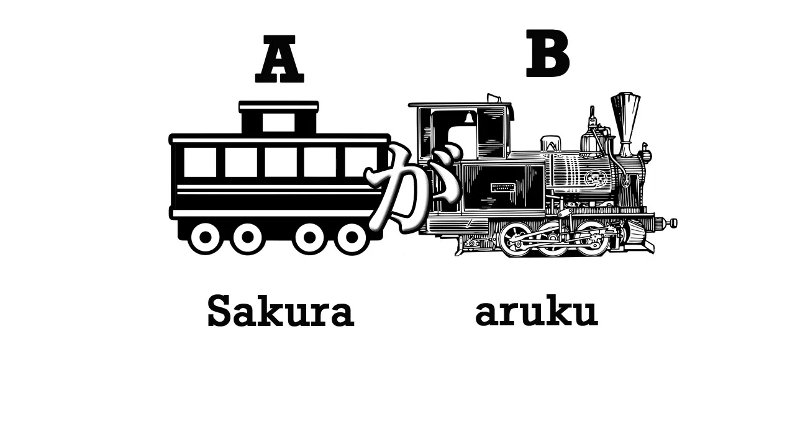
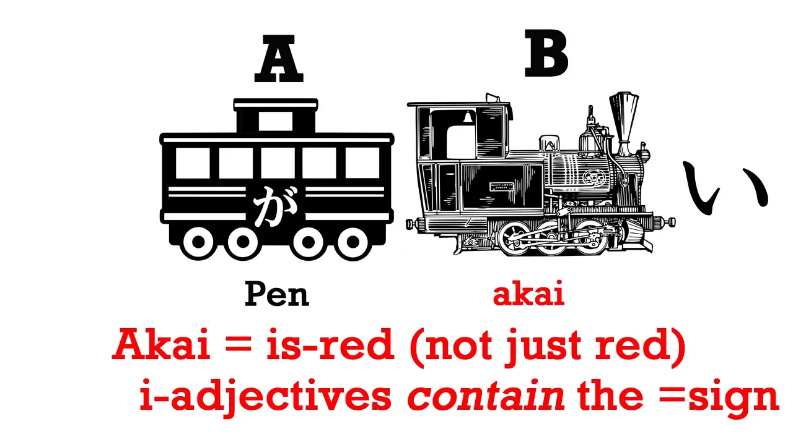

# **1. Основные типы предложений**

[**Урок 1: Японский язык — это просто! Чему никогда не учат в школах. Ядро японского предложения — органический японский**](https://www.youtube.com/watch?v=pSvH9vH60Ig&list=PLg9uXxuZf8x_A-vcqqyOFZu06WlhnypWj&ab_channel=OrganicJapanesewithCureDolly)

Самое базовое в японском языке — это японское ядро предложения. Каждое японское предложение фундаментально имеет одно и то же ядро. Как оно выглядит? Оно выглядит так.

Мы представим его в виде поезда. Каждое японское предложение состоит из двух элементов: **главного вагона, А**, и **локомотива, Б**. **Локомотив — это то, что приводит предложение в движение, что заставляет его работать.** **Вагон должен быть, потому что без вагона локомотиву нечего будет двигать**. Эти две вещи составляют ядро каждого японского предложения.

Мы можем сказать больше об А; мы можем сказать больше о Б; мы можем объединять логические предложения, чтобы создавать сложные предложения. **Но каждое японское предложение соответствует этому базовому типу.**

Итак, что такое А и Б? Начнём с того, что напомним себе: в любом языке существует только два типа предложений: предложения типа <code>А есть Б</code> и предложения типа <code>А делает Б</code>. Пример предложения <code>А делает Б</code>: <code>Сакура идёт</code>. Пример предложения <code>А есть Б</code>: <code>Сакура — японка</code>.

И мы можем ставить их в прошедшее время; мы можем делать их отрицательными; мы можем превращать их в вопросы; мы можем говорить больше об А; мы можем говорить больше о Б. Но, **в конечном итоге, каждое предложение сводится к одному из этих типов: предложению <code>А есть Б</code> или предложению <code>А делает Б</code>.**

Итак, давайте посмотрим, как это делается в японском языке.

## Глагольные предложения

В японском языке, если мы хотим сказать <code>Сакура идёт</code> (А делает Б: Сакура идёт), то А — это Сакура, главный вагон, а Б — это <code>идёт</code>, то, что она делает, локомотив предложения.

Глагол <code>идти</code> по-японски — <code>あるく</code>. Нам нужна ещё одна вещь, чтобы составить ядро японского предложения, и **это стержень каждого предложения, が** (га).

**が — это центр японской грамматики. Каждое японское предложение вращается вокруг が. В некоторых предложениях мы не сможем увидеть が, но оно всегда там, и оно всегда выполняет одну и ту же работу. Оно связывает А и Б вместе и превращает их в предложение.** Итак, наше ядро предложения <code>А делает Б</code> — это <code>**さくらが**あるく</code> = <code>**Сакура** идёт</code>.

## Предложения со связкой

Теперь возьмём предложение <code>А есть Б</code>: <code>Сакура — японка</code>, или, как мы говорим, <code>Сакура — японский человек</code>. Итак, А снова Сакура, Б — [日本人]{にほんじん}, что означает <code>японский человек</code>, и **снова нам нужно が, чтобы связать их вместе.**

**Итак, мы представим вагон А, главный вагон, с が на нём, потому что главный вагон, подлежащее предложения, всегда несёт が, чтобы связать его с локомотивом.**

Итак, さくらが日本人 – и нам нужна ещё одна вещь. Есть ещё одна вещь, с которой я хочу, чтобы вы подружились, и это だ (да). <code>さくらが日本人だ</code> = <code>Сакура — японский человек</code>.

Возможно, вы уже встречали это だ в его изысканной форме, です, но есть очень веские причины, чтобы сначала изучить простую, обычную форму. Итак, мы будем изучать だ. Если вы посмотрите на だ, оно похоже на знак равенства, заключённый в рамку слева. И это идеальная мнемоника для того, что оно делает, потому что **だ говорит нам, что А есть Б.**

Почему оно заключено в рамку слева? Потому что оно работает только в одном направлении. Подумайте об этом логически: さくらが日本人だ означает <code>Сакура = японский человек.</code> Но это не работает в обратную сторону: японские люди — это Сакура – они не все Сакура. Сакура — японский человек, но японский человек не обязательно Сакура.

## Прилагательные в предложениях

Итак, теперь у нас есть предложение <code>А есть Б</code> и предложение <code>А делает Б</code>. Существует ещё одна форма японского ядра предложения, ибо оно имеет три формы. Третья форма — это когда у нас есть описывающее слово, прилагательное.

**В японском языке описывающие слова заканчиваются на い** (и), точно так же, как это часто бывает в английском: happy, sunny, cloudy, silly. В японском то же самое: happy – [嬉]{うれ}しい; sad – [悲]{かな}しい; blue – [青]{あお}い.

Нам не нужно учить все эти слова, но нам нужно знать о японских прилагательных, оканчивающихся на い, потому что они образуют третий тип предложения. Итак, возьмём простое: ペン (это хорошее простое слово, потому что оно означает <code>ручка</code>) – <code>ペンが[赤]{あか}い</code> = <code>ручка красная</code>.

Теперь вы заметили, что в этом предложении нет だ. Почему так? **Потому что い-прилагательное [赤]{あか}い (красный) — оно не означает <code>красный</code>, оно означает <code>является-красным</code>. Функция だ, функция равенства, встроена в эти い-прилагательные.**

Итак, это три формы японского предложения. **Все они начинаются с подлежащего предложения, все они связаны с が**, и они могут заканчиваться тремя способами: глаголом, который будет заканчиваться на う, связкой だ, или на い, потому что последнее слово — прилагательное. И теперь вы знаете основы японского языка!

