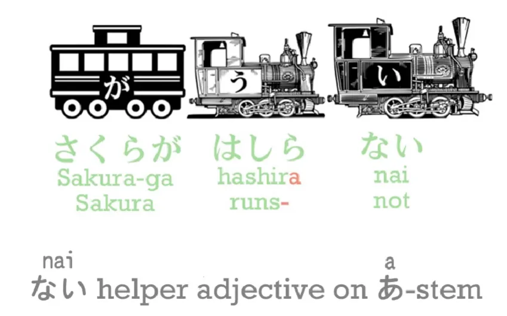
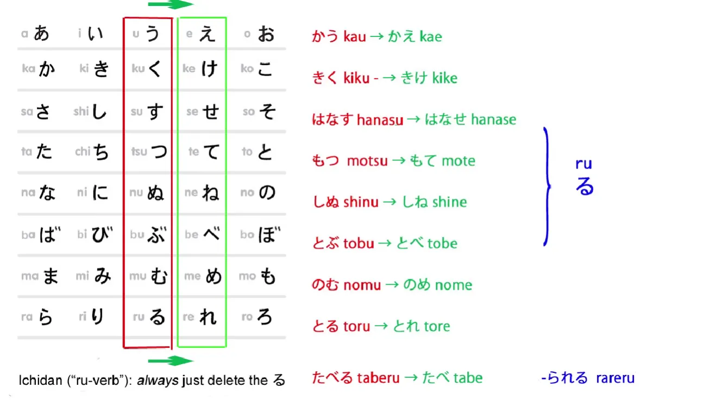
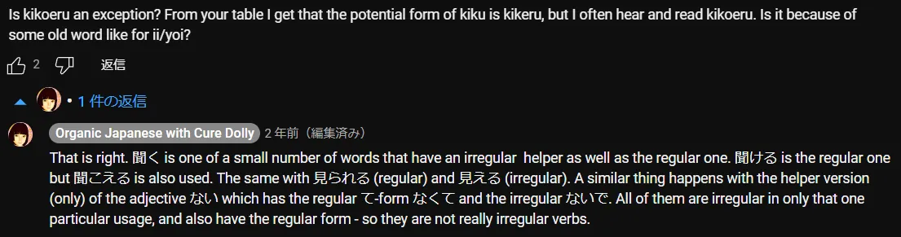
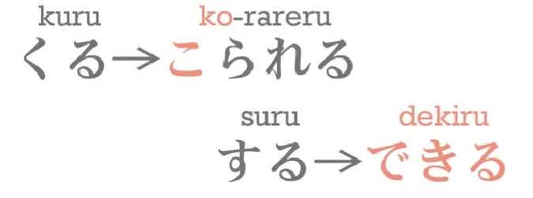
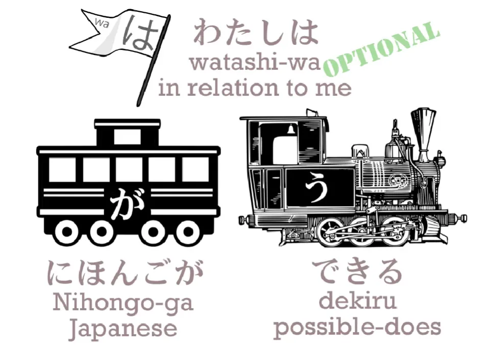
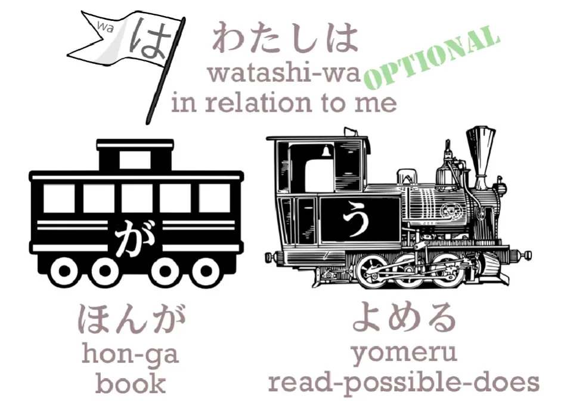
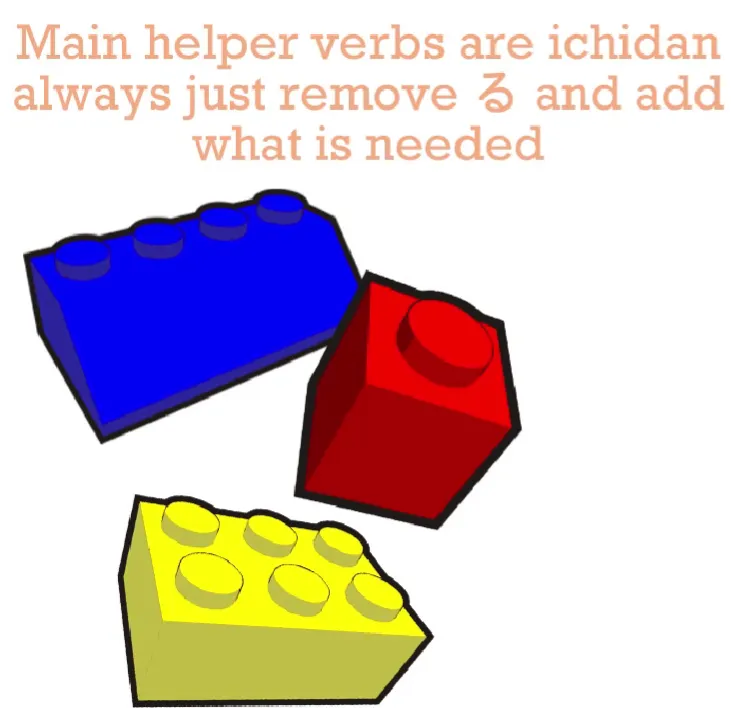

# **10. Вспомогательные глаголы и потенциальный вспомогательный глагол**

[**Урок 10: Миф о «спряжении японских глаголов» развенчан! А также секрет потенциальной формы глагола раскрыт**](https://www.youtube.com/watch?v=qcOhHmU0znI&list=PLg9uYxuZf8x_A-vcqqyOFZu06WlhnypWj&index=12)

こんにちは。

Сегодня мы поговорим об основных вспомогательных глаголах и о потенциальной форме. **Когда я говорю <code>основные вспомогательные глаголы</code>, я имею в виду то, что стандартные западные описания японской грамматики называют <code>спряжением</code>.** И я упоминаю это слово только потому, что не хочу, чтобы вы запутались, если увидите упоминание <code>спряжения</code> где-то ещё.

Когда они говорят о <code>спряжении</code>, они имеют в виду именно это. **Но на самом деле в японском языке нет такого понятия, как спряжение.** **Всё, что мы когда-либо делаем, это добавляем вспомогательные слова к четырём основам глаголов.** И есть много вспомогательных слов, и большинство из них — это просто вопрос дополнительного словарного запаса, если вы не воспринимаете их как спряжение.

В одних случаях их называют <code>спряжением</code>, в других — нет, а процесс каждый раз абсолютно одинаков. Единственная разница в том, что некоторые из них случайно, и лишь очень смутно, напоминают европейское спряжение, а другие — нет. Всевозможные путаницы возникают из-за смешения японских вспомогательных глаголов и вспомогательных прилагательных со спряжениями, но поскольку мы не будем их использовать, нам не нужно об этом беспокоиться. Хорошо.

## Потенциальный вспомогательный глагол

Итак, первый основной вспомогательный глагол, который мы рассмотрим, — это потенциальный глагол. Мы ведь уже рассматривали вспомогательные слова, не так ли? Мы рассматривали вспомогательные прилагательные <code>ない</code>, которое образует отрицание, и <code>たい</code>, которое используется для выражения желательности действия.

Мы также рассматривали вспомогательный глагол <code>がる</code>, который присоединяется к прилагательному. **Теперь мы рассмотрим потенциальный вспомогательный глагол, и он присоединяется к え-основе.**

**Мы не так много делаем с え-основой**, как с あ- и い-основами, но кое-что делаем. И только одно из них — глагол, так что здесь нет места для путаницы. **Потенциальный вспомогательный глагол имеет две формы: <code>る</code> и <code>られる</code>.**

Людей может немного смущать **форма вспомогательного глагола для глаголов первого спряжения**, потому что это **всего лишь один знак, る(ru).** Но это не должно вас беспокоить, и поскольку он всегда присоединяется только к え-основе, не может использоваться сам по себе, его очень, очень легко распознать.

**<code>られる</code> — это форма потенциального вспомогательного глагола, которая присоединяется к глаголам второго спряжения** — а мы ведь уже обсуждали глаголы первого и второго спряжения, не так ли? Итак, <code>かう</code> (покупать) становится <code>かえる</code> (можно купить); <code>きく</code> (слышать) становится <code>きける</code> (можно слышать); <code>はなす</code> (говорить) становится <code>はなせる</code> (можно говорить); <code>もつ</code> (держать) становится <code>もてる</code> (можно держать) и так далее.

::: info
измените на え-основу, а затем потенциальную форму первого спряжения る. Также обратите внимание на это…

**Есть некоторые различия в их значении, Долли проясняет их далее в УРОКЕ 54.
Долли, ПОХОЖЕ, делает здесь ошибку, называя 聞こえる other-move, но это должно быть self-move, как она подразумевает в начале комментария (+по сравнению с другими источниками, такими как Imabi).**
:::

**А с <code>たべる</code>, который является глаголом второго спряжения**, мы делаем то, что всегда делаем: **просто убираем る и добавляем то, что собираемся добавить.** Так, <code>たべる</code> (есть) становится <code>たべられる</code> (можно есть). Так что это очень просто, не так ли?

**Есть только два исключения из этого образования потенциальной формы, и это два японских неправильных глагола: <code>くる</code> и <code>する</code>.** <code>くる</code> становится <code>こられる</code>, а <code>する</code> удивительным образом становится <code>できる</code>. **<code>できる</code> — это потенциальная форма глагола <code>する</code>.**

И **это интересное слово, потому что оно также означает <code>выходить</code>** — буквально оно состоит из кандзи <code>выход</code> и <code>приходить</code> — <code>出来る/できる</code>, 出る (выходить) 来る (приходить)

И если мы говорим <code>にほんごができる</code>, мы не говорим <code>Я могу говорить по-японски</code>, мы говорим <code>Японский **возможен**</code> / ***<code>делает возможным</code>***

И если мы говорим или подразумеваем <code>わたしはにほんごができる</code>, мы говорим: <code>Для меня японский **возможен**</code>.

::: info
*(Долли даёт <code>делает возможным</code>, чтобы показать, что это А делает Б; а не А есть Б)*
:::

И интересно, если вы видите маленького ребёнка, который, возможно, пытается что-то сделать из бумаги, она может сказать: <code>Я очень стараюсь, но ничего не получается</code> — и это как раз то, как <code>できる</code> используется в японском, не так ли? И есть несколько интересных способов использования <code>できる</code>, которые показывают, как идея чего-то возможного и чего-то получающегося тесно связаны в японском языке. Но мы не будем говорить об этом сейчас — это немного более продвинуто.

Есть только одна опасная область с потенциальной формой, и она очень, очень близка к тому, с чем мы имели дело на прошлой неделе[[9]](./9-the-subject-of-the-japanese-sentence-expressing-desire-ほしい-たい-たがる.md). Так что, если вы видели тот урок, этот должен быть для вас очень лёгким. Давайте посмотрим на типичное предложение: <code>ほんがよめる</code>.

Стандартные тексты обычно переводят это как <code>Я могу читать книгу</code>. **Но это не то, что это означает**, как вы можете ясно понять, если следили за нашим предыдущим уроком. Посмотрите, где находится が. Что が отмечает? **Оно отмечает книгу!** Так кто же является действующим лицом этого предложения? **Это книга.**

Мы говорим что-то о книге. **Так что книга — это главный вагон, а <code>よめる</code> — это локомотив.** Мы говорим, что **книга читаема, её можно прочитать.**

---

Если мы добавим <code>わたしは</code>, мы говорим, что книга читаема <code>для меня</code>. Буквально мы говорим: <code>В отношении меня, книга читаема</code>. **Но это не может означать <code>Я могу читать книгу</code>.** Если бы мы хотели сказать <code>Я могу читать книгу</code>, книга должна была бы быть отмечена を, не так ли? А я должен был бы быть отмечен が. И на самом деле это возможно сделать, **но это не то, что обычно делается.**

Но также помните, что если мы хотим сделать акцент на эго, как это принято в английском, то нам придётся изменить частицы. Если мы буквально хотим сказать: <code>**Я** могу читать книгу</code> — <code>**わたしが**ほんをよめる</code>.

---

Многие люди считают это плохим японским.

::: info
Я полагаю, это не то, как японцы обычно говорят. Это можно назвать <code>англизированным</code> японским, поскольку он ставит акцент на эго в первую очередь, как на подлежащее, что не соответствует их обычному мышлению в Японии.
:::

Не наше дело выяснять, плохой это японский или нет. Суть в том, что в большинстве случаев вы увидите <code>**ほんがよめる**</code>, и **<code>(わたしは)ほんがよめる</code> не может буквально означать <code>Я могу читать книгу</code>.** **Это означает <code>Книга читаема</code>.**

::: info
Можно добавить わたしは, чтобы задать себя как тему («что касается меня — книга проявляет читаемость / делает действие читаемости»), но обычно это опускают.
:::

Так что это достаточно просто, и если мы это помним, мы не отправляем все эти частицы в безумную нелогичность.

Так что на самом деле это очень похоже на вопросы, которые мы обсуждали на прошлой неделе, касающиеся たい и прилагательных желания. **Если мы просто держим が в уме, всё остальное встанет на свои места.** И точно так же, как с たい-формой, если мы говорим <code>(わたしは)ケーキがたべたい</code>,

**торт является тем, что вызывает желание** *(лично у меня — тема)*, но если мы просто говорим <code>(わたしは)(zeroが)たべたい</code>, мы действительно имеем в виду <code>(В отношении меня) (Я) хочу есть</code> / *есть-хочу-есть*,

**потому что когда нет конкретной еды, которая бы вызывала желание, тогда *я* и есть тот, кто желает.**

::: info

Я — подлежащее, которое просто хочет что-то съесть, потому что я голоден; здесь я также являюсь темой.

Однако, обратите внимание, что еды там нет, поэтому по умолчанию это <code>я</code>. Zeroが (а также zeroは) зависит от контекста ситуации/предложения, говорит Долли…

:::

То же самое и с потенциальной формой. Итак, мы говорим <code>(わたしは)ほんがよめる</code> – <code>(для меня) книга читаема</code>,

но если мы просто хотим сказать <code>Я могу читать</code> — не «Я могу читать книгу или я могу читать газету или я могу читать секретный дневник Сакуры», а <code>Я могу читать</code> — тогда мы говорим <code>わたしがよめる</code> или просто <code>よめる</code>, что означает <code>(zeroが)よめる</code>.

**И мы действительно стали подлежащим предложения.** И я уверен, что есть люди, которые находят это запутанным, но если вы следили за прошлым уроком, это должно быть совершенно ясно.

И давайте помнить, что японский язык всегда собирается, как Лего,

поэтому потенциальный вспомогательный глагол, даже когда это всего лишь одна кана る(ru), является просто обычным глаголом второго спряжения, как и большинство вспомогательных глаголов, и мы можем делать с ним абсолютно то же самое, что и с другими вспомогательными глаголами.

::: info
Я полагаю, Долли имеет в виду, что потенциальный вспомогательный глагол работает как глагол второго спряжения, поэтому, если что-то добавляется к потенциальной форме, удалите る, как и с любым глаголом второго спряжения, и присоедините к え-основе. Ответы Долли под одним [**комментарием**](https://www.youtube.com/watch?v=qcOhHmU0znI&lc=UgxYARujuNXKheHlgNJ4AaABAg)

<code>Потенциальная форма</code> глаголов первого спряжения является глаголом второго спряжения, потому что вспомогательный る является глаголом второго спряжения… Первое спряжение здесь — это отвлекающий манёвр. Как только мы присоединяем любой вспомогательный глагол второго спряжения к глаголу первого спряжения, мы имеем дело с сущностью второго спряжения, и всё, что мы делаем после этого, следует образцу второго спряжения… Так что нет вопроса о том, что глагол первого спряжения становится глаголом второго спряжения. Происходит то, что глагол первого спряжения присоединяет вспомогательный глагол второго спряжения.
:::

**Мы всегда будем узнавать его, потому что это единственный, который присоединяется к え-основе, и мы можем делать с ним всё, что делаем с любым другим глаголом второго спряжения.**

Итак: <code>あるける</code> – могу ходить; <code>あるけない</code> – не могу ходить; <code>あるけた</code> – мог ходить; <code>あるけなかった</code> – не мог ходить. **И эта регулярность сохраняется даже с неправильными глаголами.** Итак: <code>できる</code> – возможно; <code>できない</code> – невозможно; <code>できた</code> – было возможно; <code>できなかった</code> – не было возможно.

И это действительно так просто.

::: info
Я довольно сильно запутался, так как я посмотрел 出来る/できる в Jisho, и они на самом деле показывают, что у него есть потенциальная форма <code>できられる</code>, что интересно, поскольку できる уже должно подразумевать потенциальную форму. Я посмотрел некоторые [**японские форумы**](https://ja.hinative.com/questions/6326424) (и другие), и, похоже, даже японцы?? нашли <code>できられる</code> странным. Или это может быть почтительная форма?… Поправьте меня, если я ошибаюсь…
Например, 分かる также не имеет потенциальной формы, так как она подразумевает её. [**Долли объясняет**](https://japanese.stackexchange.com/questions/5988/why-doesnt-%e5%88%86%e3%81%8b%e3%82%8b-have-a-potential-form/48809#48809) <code>分かれる</code> — это другое слово.
:::

---

::: info
Я также добавлю пример обычного глагола второго спряжения.

<code>たべられる</code> - могу есть; <code>たべられない</code> - не могу есть;
<code>たべられた</code> - мог есть; <code>たべられなかった</code> - не мог есть.
:::