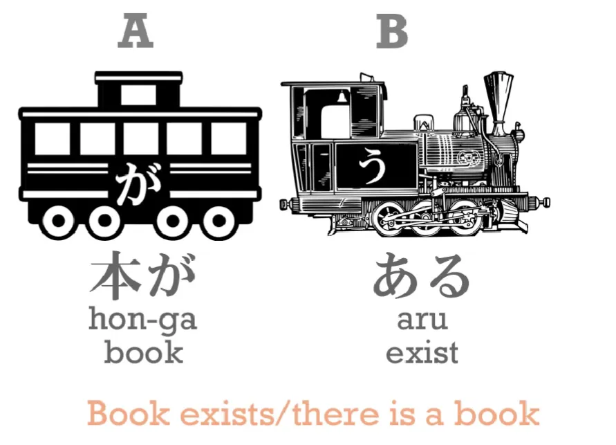
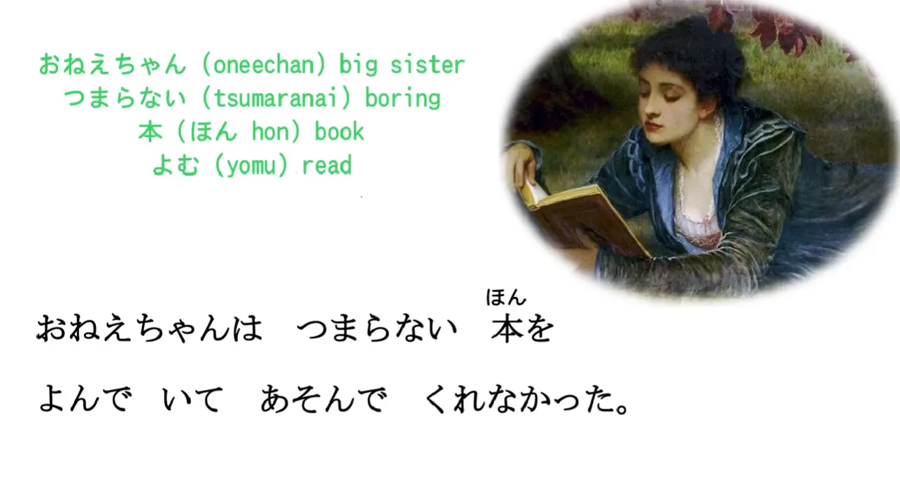
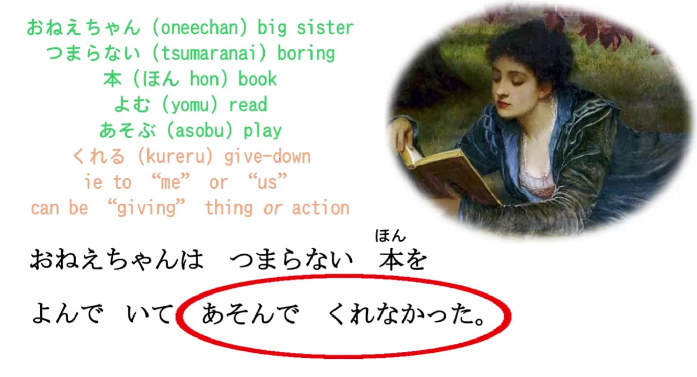
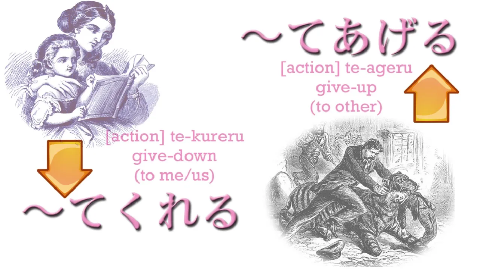
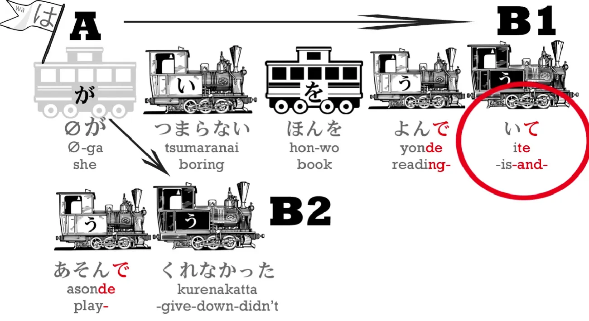
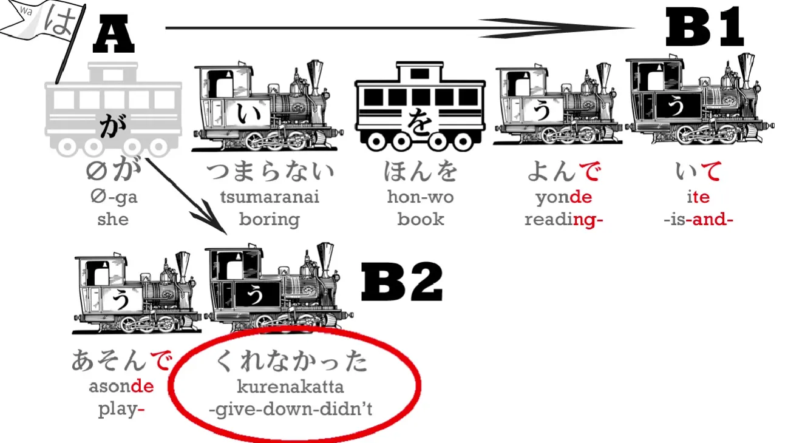

# **11. Сложные предложения, くれる, あげる и другие применения て-формы**

[**Урок 11: Сложные предложения, kureru, ageru, другие применения て-формы**](https://www.youtube.com/watch?v=3X2ZCWazrDw&list=PLg9uYxuZf8x_A-vcqqyOFZu06WlhnypWj&index=13)

Мы завершили десять уроков, и пришло время сменить темп. Мы уже достаточно много узнали, чтобы начать рассматривать настоящие повествования. Сначала они будут немного упрощёнными, но мы сможем использовать это, чтобы объединить всё, что мы изучили до сих пор. Мы также будем изучать новые структурные элементы, потому что даже в самой простой истории мы столкнёмся с вещами, которые нам нужно будет выучить. Но это может быть более интересным способом обучения. Так что, пожалуйста, дайте мне знать, что вы думаете, в комментариях ниже. Отлично.

Теперь давайте перейдём к истории, которую, я думаю, мы все знаем.

<code>ある日アリスは川のそばにいた.</code>

Это простое предложение. Слово <code>[川]{かわ}</code> означает <code>река</code>, а **<code>そば</code> означает <code>рядом</code> и является существительным.**

Так что <code>川のそば</code> — это <code>рядом реки</code>. Точно так же, как мы кладём что-то на «верх» стола или «низ» стола, и **мы также всегда отмечаем это частицей に**, так и <code>рядом реки</code> — это то место, где находилась Алиса.

<code>ある</code> означает <code>некий</code>, поэтому <code>ある日</code> — это как <code>однажды</code> или <code>в некий день</code>, и давайте заметим, что здесь происходит то, что мы уже видели. **<code>ある</code> — это глагол, который означает <code>существовать</code> или <code>быть</code>**, и то, что мы здесь сделали, мы видели в видеоуроке о так называемых прилагательных.[[6]](./6-adjectives.md) **Мы можем превратить любой локомотив в прилагательное.** Итак, **<code>ある</code> — это локомотив «А делает Б», う-локомотив**, поэтому, если мы говорим <code>本がある</code>, мы говорим: <code>Есть книга / Книга существует</code>.

**И если мы перемещаем этот локомотив <code>ある</code> на другую сторону книги, мы обесцвечиваем его, и он становится описателем, прилагательным.** Так что мы говорим <code>ある本</code> – <code>существующая книга / некая книга / книга, которая есть</code>.

И это то же самое: <code>ある日</code> – <code>в некий день</code>.

<code>ある日アリスは川のそばにいた</code>

Теперь следующее предложение будет немного сложнее, но не волнуйтесь, всегда легко, когда вам помогает полнофункциональный андроид. (На самом деле, я не совсем полнофункциональна, но для целей демонстрации японского языка я таковой являюсь.)

<code>おねえちゃんはつまらない本をよんでいてあそんでくれなかった</code>

Итак, у нас здесь довольно сложное предложение, и давайте разберём его. <code>おねえちゃん</code> означает <code>старшая сестра</code>: <code>ねえ</code> — это <code>сестра</code>; <code>-ちゃん</code>, я уверена, вы знаете, это милый, дружелюбный почтительный суффикс; <code>お-</code> также является почтительным префиксом. Итак, <code>おねえちゃん</code> – <code>старшая сестра</code>.

<code>つまらない</code> означает <code>скучный</code> или <code>неинтересный</code>. <code>本</code>, как мы знаем, это <code>книга</code>. <code>よむ</code> означает <code>читать</code>; <code>よんでいる</code> – мы **ставим <code>よむ</code> в て-форму и добавляем <code>いる</code>**, и это означает <code>читает</code>; а затем мы ставим сам <code>いる</code> в て-форму.

Так зачем мы всё это делаем? Давайте посмотрим. <code>おねえちゃんはつまらない本をよんでいて</code> – <code>Старшая сестра читает скучную книгу</code> – но затем это -て... **て-форма имеет много разных применений.** **В данном случае она завершает часть предложения.** <code>Старшая сестра читает скучную книгу</code> – это ведь законченная часть предложения, не так ли?

**И если мы превращаем этот конечный う-локомотив в て-форму, мы говорим, что за этой частью предложения последует что-то ещё.** **Мы указываем, что создаём сложное предложение, состоящее из более чем одной части.** Так что это как сказать: <code>Старшая сестра читала скучную книгу **и...**</code> И затем следует что-то ещё: <code>あそんでくれなかった</code>.

<code>あそぶ</code> означает <code>играть</code>, и это тоже в て-форме, не так ли? <code>あそぶ</code> --> あそんで". Если вы сомневаетесь, как мы образуем эти て-формы, пожалуйста, вернитесь к видеоуроку о て-форме и освежите свою память.[[5]](./5-verb-groups-and-the-て-form.md)

<code>あそんでくれなかった</code>

Теперь это ещё одно применение て-формы. **て-форма ужасно важна, и она делает разные вещи.** Что она делает здесь? Ну, <code>あそぶ</code>, как мы знаем, означает <code>играть</code>.

<code>くれる</code> означает <code>давать</code>, **и это конкретно означает <code>давать вниз</code>**. И причина, по которой мы говорим <code>давать вниз</code> в японском, заключается в том, что мы всегда вежливы с людьми. **Поэтому мы всегда представляем себя ниже других людей, а других людей — выше себя.**

Так что **если я говорю <code>くれる</code> (давать), я всегда имею в виду, что кто-то даёт что-то мне или кому-то из моих близких.**

Но что же старшая сестра Алисы даёт — или не даёт — Алисе?

Ну, это не книга. На самом деле, это не какой-либо реальный объект. **Она даёт действие, с которым <code>くれる</code> связано через て-форму.** Она даёт — или в данном случае, не даёт — Алисе акт игры.

Что мы под этим подразумеваем? **Ну, мы говорим <code>くれる</code> не только для того, чтобы дать вещь — книгу, подарок, конфету — мы также говорим это для того, чтобы дать действие, чтобы сделать что-то для нашей пользы.** **Это очень, очень часто используется в японском языке, поэтому важно это понять.** Если кто-то делает что-то для нашей пользы, мы ставим это действие в て-форму и добавляем <code>くれる</code>. **Если мы делаем что-то для пользы кого-то другого, мы ставим это действие в て-форму и добавляем <code>あげる</code>, что означает <code>давать вверх</code>, другими словами, давать вам, давать другому человеку.**

<code>くれる</code> и <code>あげる</code> – давать вниз мне или моей группе / \[<code>**あげる**</code>\] **давать вверх вам, кому-то ещё, вашей группе или их группе.**

Итак, что же это за вторая часть предложения? Это <code>あそんでくれなかった</code> – «она не играла / она не дала Алисе поиграть / она не играла для Алисы».

Это довольно сильно отличается от всего, что мы находим в английском, но это также очень выразительно, то, что нам на самом деле не помешало бы иметь в английском.

Итак, теперь давайте снова посмотрим на всё предложение. <code>おねえちゃんはつまらない本をよんでいてあそんでくれなかった</code> – <code>Старшая сестра читала скучную книгу и не играла [с Алисой]</code>.

Обратите внимание, что **у нас здесь две законченные части предложения**:
*Часть 1:* <code>おねえちゃんはつまらない本をよんだ</code> – это само по себе законченная часть предложения, не так ли?

*Часть 2:* <code>おねえちゃんはあそんでくれなかった</code> – <code>Старшая сестра не играла для Алисы</code>

**И мы соединили эти две части вместе с помощью て-формы.**

---

**Что мы должны здесь заметить, так это то, что <code>おねえちゃんはつまらない本をよんで</code> не сообщает нам время.** **Мы не знаем, читает ли она скучную книгу прямо сейчас, в будущем или в прошлом. Мы не узнаем этого, пока не дойдём до конца предложения.**

В английском мы ставим маркер времени на обе половины сложного предложения. Мы бы сказали: <code>Big sister WAS reading a boring book...</code> (Старшая сестра ЧИТАЛА скучную книгу...), так что мы уже знаем, что это в прошедшем времени. **Но в японском мы ставим этот маркер времени, -た или -かった, в конце, и нам нужен только один маркер времени на предложение.**

<code>よんでいて</code> могло бы означать <code>читает</code> или <code>читала</code>, **но поскольку <code>あそんでくれなかった</code> находится в прошедшем времени и является частью того же предложения, мы перевели всё в прошедшее время.**

Ну, мы не очень далеко продвинулись в приключениях Алисы сегодня, не так ли? Но мы сможем двигаться быстрее, когда привыкнем к реальному тексту и изучим основные повествовательные структуры.