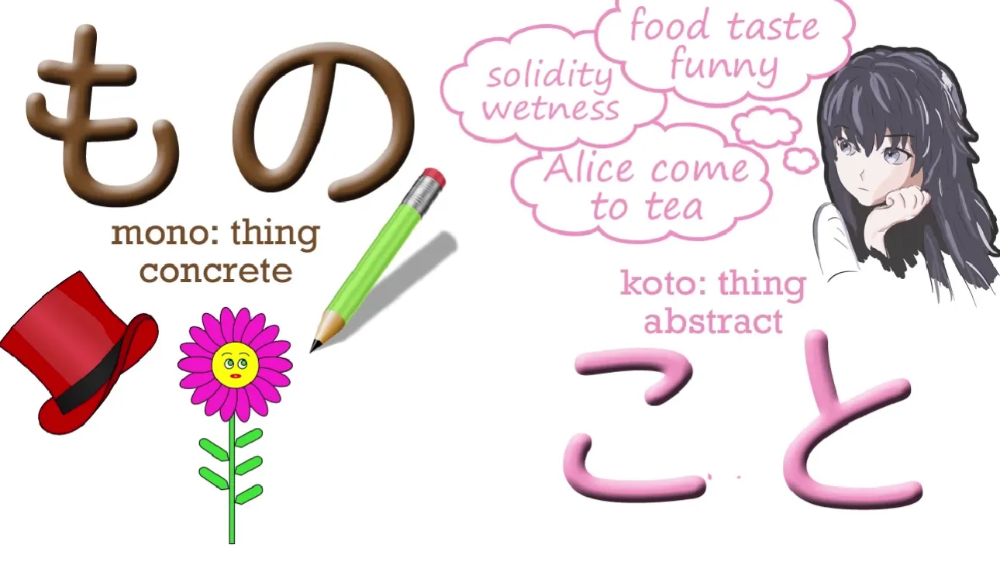
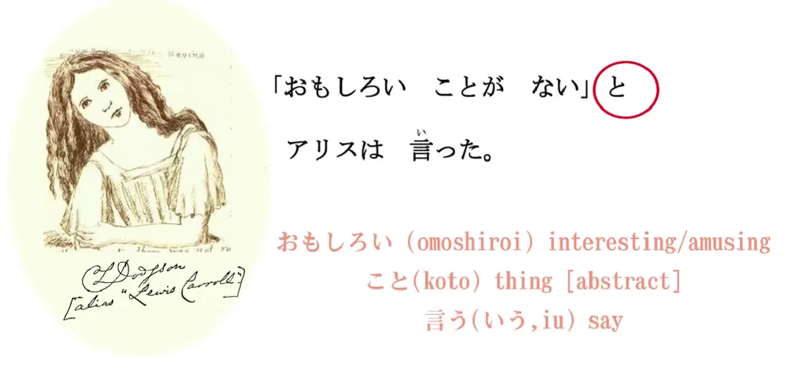
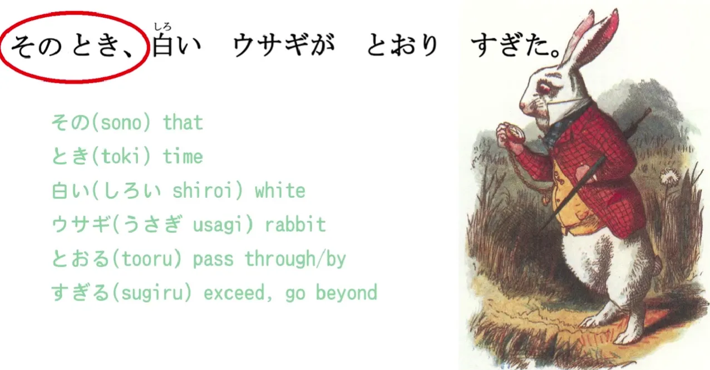
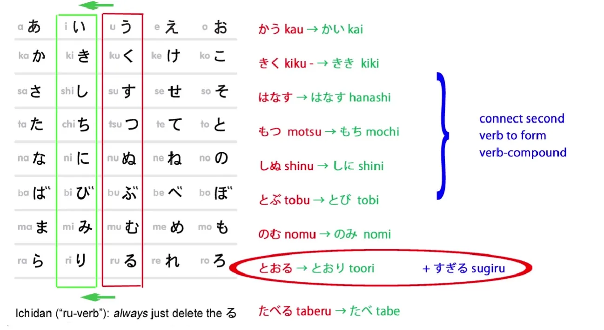
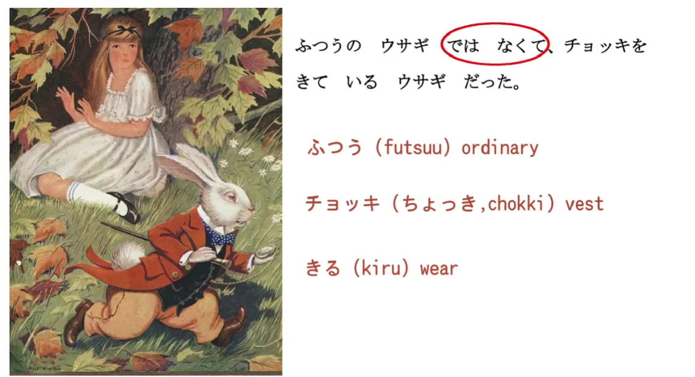
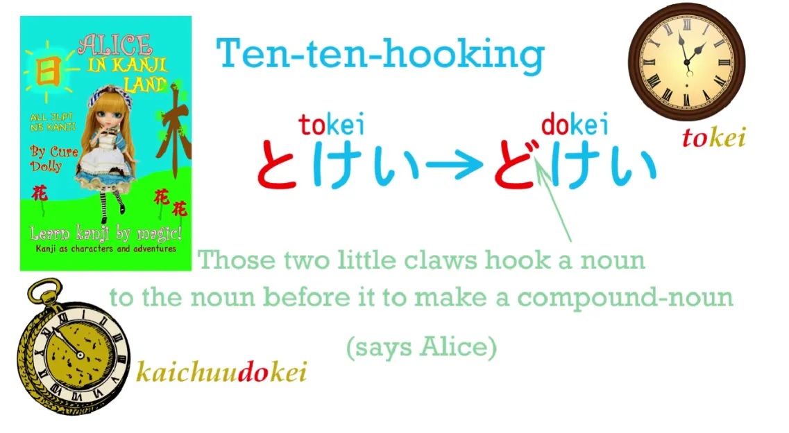
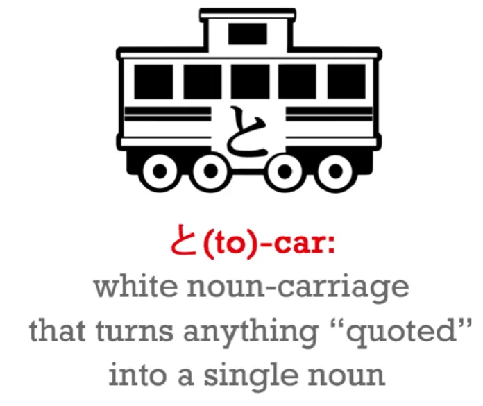
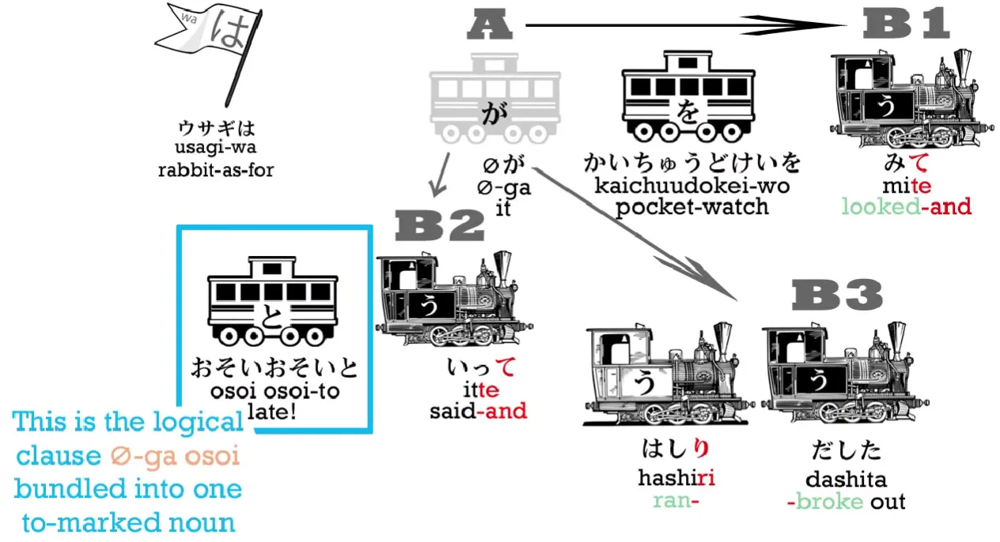
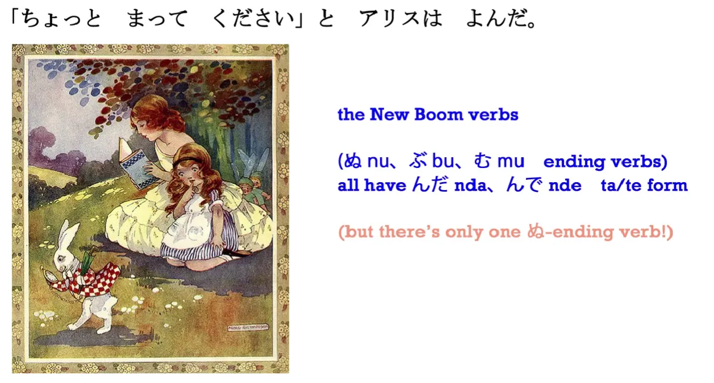

# **12. Частица цитирования と, составные глаголы и существительные**

[**Урок 12: Секрет частицы цитирования と — плюс составные глаголы, составные существительные — и ещё Алиса!**](https://www.youtube.com/watch?v=7dYT6Xf1BkA&list=PLg9uYxuZf8x_A-vcqqyOFZu06WlhnypWj&index=14)

こんにちは。

Сегодня мы продолжим наши повествовательные уроки, которые начали на прошлой неделе. И на этот раз мы сможем продвинуться немного быстрее. Итак, давайте освежим в памяти историю, которую мы прочитали до сих пор.

>ある日アリスは川のそばにいた。

(Однажды Алиса была у реки.)

>お姉ちゃんはつまらない本をよんでいてあそんでくれなかった。

(Старшая сестра читала скучную книгу и не играла с Алисой.)

>「おもしろいことがない」とアリスは言った。

「おもしろい」 означает <code>интересный</code> или <code>забавный</code>; 「こと」 означает <code>вещь</code>. И в японском языке у нас есть два распространённых слова для <code>вещи</code>, и это もの и こと.

Итак, **もの — это вещь в самом обычном смысле: физическая вещь — шляпа, книга, очки, гора Фудзи.** **こと — это более абстрактный вид <code>вещи</code>: дело, обстоятельство, ситуация.** Так что, когда мы говорим: <code>Есть ли что-нибудь в этой коробке?</code>, мы имеем в виду もの. А когда мы говорим: <code>Дело в том, что...</code>, мы обычно имеем в виду こと.

Итак, 「おもしろいことがない」 означает <code>Здесь ничего интересного не происходит, никаких интересных обстоятельств.</code>

言った － 言う означает <code>говорить</code>, и вы можете видеть, что это похоже на рот со звуковыми волнами, исходящими из него.

**Но важно здесь заметить эту маленькую частицу と.**

**На самом деле существует две частицы と:** одна означает <code>и</code> и очень проста; **другая — это то, что мы называем <code>частицей цитирования</code>**, и именно с ней мы имеем дело здесь. **Когда мы цитируем кого-то, кто что-то говорит или даже что-то думает, мы используем эту частицу と. Это что-то вроде кавычек, которые можно услышать.**

Как вы видите, в японском языке мы используем квадратные кавычки, которые эквивалентны английским кавычкам, **но мы также используем と.** Так что мы не просто говорим: <code>«Ничего интересного не происходит», — сказала Алиса</code>. Мы говорим: <code>«Ничего интересного не происходит», **と** сказала Алиса</code>. Теперь と — это очень интересная частица с точки зрения структуры, и мы рассмотрим это немного глубже через несколько минут.

>そのとき、白いウサギがとおりすぎた。

「そのとき」: その означает <code>тот</code>, а とき означает <code>время</code>, так что буквально мы говорим <code>то время</code>, но это больше похоже на <code>в тот момент / в то время</code>. **Итак, мы используем это так же, как и другие относительные выражения времени: нам не нужно добавлять に или что-либо ещё, мы просто указываем время, а затем продолжаем рассказывать, что происходило в это время.**

В этом конкретном предложении смысл 「そのとき」 заключается в том, что именно в тот момент, когда Алиса говорила, что ничего интересного не происходит, именно в это время это и случилось.

そのとき、白いウサギがとおりすぎた。

白い означает <code>белый</code>; это い-прилагательное. ウサギ означает <code>кролик</code>. А 「とおりすぎた」 состоит из двух слов, и это то, что мы будем видеть снова и снова в японском языке. **Это использование い-основы одного глагола для присоединения другого глагола, чтобы придать ему дополнительное значение.** Итак, とおる означает <code>проходить насквозь</code>, а すぎる означает <code>превышать</code> или <code>выходить за пределы</code>. Таким образом, とおりすぎる соединяет эти два слова вместе: とおる (проходить насквозь); すぎる (выходить за пределы), и это означает <code>проходить мимо</code>. Белый кролик прошёл мимо.

そのとき、白いウサギ (белый кролик) とおりすぎた (прошёл мимо)。

---

>ふつうのウサギではなくて、チョッキをきているウサギだった。

> ふつうのウサギではなくて…

Итак, ふつう означает <code>обычный</code>, а остальное вы уже знаете. **ではない означает <code>это не / это не было</code>, и мы ставим это в て-форму, потому что это часть сложного предложения** — а мы ведь рассматривали сложные предложения на прошлой неделе, не так ли?

*(Урок 11, Долли даёт 7, но это может быть ошибка, так как て-формы там нет… но проверьте также 5)*

Итак, 「ふつうのウサギではなくて」 = <code>Это был не обычный кролик.</code>

> …チョッキをきているウサギだった。

チョッキ означает <code>жилет</code>; きる означает <code>носить</code>, так что 「きている」 означает <code>носить / быть в процессе ношения</code>. **И <code>だった</code>, конечно, является прошедшим временем связки.**

Итак, это: <code>Это был не обычный кролик, это был кролик, носящий жилет / это был кролик, который носил жилет.</code>

>ウサギはかいちゅうどけいを見て「おそい！おそい！」と言って、はしり出した。

> ウサギはかいちゅうどけいを見て…

かいちゅうどけい — это не то слово, которое мы будем часто встречать, потому что в наши дни их не так много, но это пример того, что мы будем видеть очень часто, а именно: в японском языке, как вы знаете, **мы можем модифицировать одно существительное другим, помечая первое частицей の** (или な, которая является формой だ), **но мы также можем, когда мы не просто модифицируем одно существительное другим, а образуем новое существительное, просто сталкивать их вместе.**

**Нам не нужно модифицировать их каким-либо образом, как мы это делаем с глаголами** (мы превращаем их в い-основу), **но вы не можете сделать это с существительными, у существительных нет основ, они никак не модифицируются — поэтому, когда вы соединяете два существительных, чтобы образовать новое существительное, вы просто сталкиваете их друг с другом. Это то же самое, что мы делаем в английском, со словами вроде <code>seaweed</code> (морские водоросли) или <code>bookshelf</code> (книжная полка). Мы просто сталкиваем два существительных вместе, чтобы образовать новое существительное.**

---

Итак, части этого существительного, 「かいちゅうどけい」: [懐中]{かいちゅう} — это немного необычное существительное — оно означает <code>в кармане</code> или <code>внутри кармана</code>, а [時計]{とけい} — очень распространённое слово — оно означает <code>часы</code> (у нас одно и то же слово для часов в японском, будь то маленькие или большие), так что [懐中時計]{かいちゅうどけい} — это карманные часы.

И причина, по которой мы говорим 「**ど**けい」 вместо 「とけい」, это то, что Алиса в «Алисе в Стране Кандзи» называет «крючком тен-тен», **и это означает, что когда вы сталкиваете два существительных вместе, как мы это делаем здесь, и второе начинается с глухого согласного, такого как <code>т</code> или <code>к</code>, мы превращаем его в эквивалентный звонкий звук, такой как <code>д</code> или <code>б</code> (озвончение / рэндаку).**

::: info
Это ОБЫЧНО происходит, когда второе существительное в составе имеет глухой звук кунъёми, который имеет эквивалентный звонкий звук — h -> b, t -> d, k -> g, tsu/s -> z, sh -> j и т.д. Составные слова с онъёми ОБЫЧНО не имеют этого изменения, ИНОГДА, если перед ним стоит <code>n</code>, это тоже может его вызвать.
:::

И, конечно, в японском вы делаете это, добавляя эти две маленькие отметки ゛*(дакутэн)* к кане, так と становится ど, た становится だ, く становится ぐ, さ становится ざ и т.д.

Так, например, あお — это синий, как вы знаете, そら — это <code>небо</code>, и когда вы соединяете их вместе, вы получаете не あおそら, а あお**ぞ**ら. Мы ставим тен-тен на это резкое слово, и Алиса называет это <code>крючком тен-тен</code>. *(тен-тен, букв. <code>точка-точка</code>, кажется, это разговорное название для дакутэн* ゛*)*

Это как если бы эти две маленькие точки, эти два маленьких коготка, цеплялись за предыдущее слово, чтобы превратить их в одно слово. **Это то, что вы будете видеть очень часто.**

И точно так же, как в английском вы не можете сделать это с любыми двумя существительными, но есть много существительных, которые состоят из двух существительных, и пока одно из существительных не является немного необычным, как かいちゅう, их очень легко понять, так же, как и в английском.

А затем у нас есть:

『…「おそい！おそい！」と言って…』

## Частица цитирования と

Теперь мы рассмотрим, что на самом деле делает と, и по мере того, как мы будем переходить к более сложным предложениям, трёхуровневым составным предложениям, подобным этому, мы начнём видеть, насколько полезным оно становится.

**Что と на самом деле делает структурно, так это то, что оно берёт всё, что оно помечает** — а это могут быть два слова, как здесь, или это может быть целый абзац со всевозможной другой грамматикой — **оно берёт всё, что оно помечает как цитату, и превращает это, по сути, в единое существительное.**

---

Итак, と-вагон — это белый вагон-существительное, помеченный と. И мы обнаружим по мере продвижения, что **это используется не только для обозначения того, что люди говорят и что люди думают, но и для всевозможных других вещей.** И у нас будет пример этого чуть позже в этом уроке. **Но эта と-структура, по сути, создаёт квази-существительное из всего, что помечено と, и と затем заставляет его функционировать как модификатор для следующего глагола.**

Когда это простая цитата, как здесь, глаголом будет 言う (говорить), но это также может быть 考える (думать) или 思う (думать или чувствовать), но это могут быть и многие другие вещи, как вы увидите через мгновение. **Итак, это структура と-помеченного утверждения любого рода.**

『「おそい！おそい！」と言って、はしり出した。』

おそい означает <code>поздно</code>. **И чтобы сделать это предложением, очевидно, у нас здесь должно быть zero-местоимение.** Так что кролик либо говорит: <code>Поздно!</code> либо <code>Я опаздываю!</code>

***ウサギは(zeroが)かいちゅうどけいを見て「おそい！おそい！」と言って、はしり出した。***

***Кролик что касается (он/оно) на карманные часы посмотрел-и <code>поздно! поздно!</code> сказал-и побежал-вырвался.***

В версии Диснея, конечно, это было <code>Я опаздываю!</code>

「おそい！おそい!」( <code>Я опаздываю! Я опаздываю!</code>)

**Нам не нужно говорить と с ウサギは言って на этот раз, потому что у нас есть ウサギは в начале предложения, и это сложное предложение.** Так что вторая часть сложного предложения имеет тот же главный вагон, тот же субъект, что и первая половина.

『「おそい！おそい！」と言って…』

( <code>Кролик сказал: «Я опаздываю! Я опаздываю!»</code>)

И это 言って — ещё одно составное 言って, так что на этот раз у нас трёхсложное составное предложение.

::: info
Синяя рамка — цитируемые слова кролика также, кажется, имеют zeroが, поскольку означают (Я) опаздываю.
:::

Кролик посмотрел на свои часы, он сказал 「おそい！おそい！」, а затем... он сделал что-то ещё:

> はしり出した。

はしる означает <code>бежать</code>, а 出す буквально означает <code>вынимать</code>, но это комбинация, которую мы будем очень часто видеть в японском языке. Опять же, мы используем эту い-основу, которая является основной соединительной основой, чтобы соединить はしる с 出す. И что это означает здесь?

Ну, **этот 出す, когда он соединён с глаголом, означает, что действие глагола <code>внезапно началось</code>.** Так что мы можем сказать, что кто-то 泣き出した: [泣]{な}く — это <code>плакать</code>, и мы соединяем い-основу 泣く с 出す, и 泣き出す означает <code>разразиться плачем</code>. Мы можем сказать 笑い出す: 笑う — это <code>смеяться</code>, и если мы соединяем い-основу 笑う с 出す, мы говорим <code>разразиться смехом</code>. И в этом случае что произошло? Кролик внезапно бросился бежать — он сорвался с места.

ウサギはかいちゅうどけいを見て「おそい！おそい！」と言って、はしり出した。

(Кролик посмотрел на свои карманные часы, он воскликнул: «Я опаздываю! Я опаздываю!» и бросился бежать.)

>「ちょっとまってください」とアリスはよんだ。

「ちょっとまってください」 — это фраза, которую вы будете часто слышать в японском языке. Иногда ください будет опущено. Что это означает?

ちょっと означает <code>немного</code>; まって — это て-форма от <code>[待]{ま}つ</code>, что означает <code>ждать</code>; а ください означает <code>пожалуйста</code>. На самом деле это связано с くれる, о котором мы говорили в прошлый раз[[11]](./11-compound-sentences-くれる-あげる-and-more-uses-of-the-て-form.md); что также относится к <code>давать вниз</code> — это <code>пожалуйста, дайте мне / пожалуйста, опустите до моего уровня</code>, так что это вежливый способ сказать <code>пожалуйста, дайте</code>. Но это не просто давать вещь, как и в случае с くれる и あげる, это не просто давать вещь, **это также может быть, если вы соединяете это с て-формой глагола, давать действие этого глагола.** Так что вы видите, это очень связано с くれる и あげる, которые мы выучили на прошлой неделе.

> ちょっとまってください

Итак, поскольку это так распространено, очень часто, когда мы ставим глагол в て-форму и обращаемся к кому-то, это как бы сокращение от てください. 「ちょっとまってください」 означает <code>Пожалуйста, подождите немного</code>. Так что она просит кролика остановиться; она хочет встретиться с кроликом.

「ちょっとまってください」とアリスはよんだ。

Итак, у нас снова эта частица と, частица цитирования, которая нам нужна, когда мы что-либо цитируем, а затем よんだ. 「よんだ」: что это означает? Ну, мы уже встречали よんだ раньше, не так ли? И это означает <code>читать</code>, <code>читал</code> в прошедшем времени. Это た-форма — в данном случае だ-форма — от 読む. **Но в этом случае это другое. Это だ-форма от 呼ぶ.**

Если вы помните из нашего урока о て- и た-формах[[5]](./5-verb-groups-and-the-て-form.md), группа глаголов New Boom, глаголы, оканчивающиеся на ぬ, ぶ и む, все образуют свою て-форму с んで и свою た-форму с んだ. **Так что и 読む, и 呼ぶ имеют прошедшую форму よんだ.** К счастью, мы не так часто путаем чтение и зов, не так ли? Этот 呼ぶ означает <code>звать</code>, <code>кричать</code>. Он может означать <code>звать</code> в любом из смыслов, в которых <code>звать</code> используется в английском. Вы можете назвать кого-то по имени, вы можете назвать яблоко лимоном (но вы будете неправы) или вы можете позвать.

「ちょっとまってください」とアリスはよんだ。

(«Пожалуйста, подождите минутку!» — позвала Алиса.)

でもウサギはピョンピョンとはしりつづけた。

::: tip
Если вы хотите напечатать [続]{つづ}ける, вы должны напечатать tsuDUkeru. Dzu даёт <code>ｄず</code>.
:::

でも означает <code>но</code>. はしる означает <code>бежать</code>. И мы пока оставим ピョンピョン на мгновение. つづける означает <code>продолжать</code>. Итак, снова у нас есть эта форма взятия い-основы глагола, はしる становится はしり, а затем мы добавляем к ней глагол つづける (продолжать). Так что 「ウサギははしりつづけた」 означает <code>Кролик продолжал бежать</code>.

---

**ピョンピョン — это то, что мы будем очень часто встречать в японском языке, и это удвоенное слово, которое является звукоподражанием.** В японском языке их очень много, \[например,\] 「シクシク」, что является звукоподражанием плача. И некоторые из них будут буквальными звуками, а некоторые будут описывать различные состояния. Так что мы будем встречаться со многими из них позже.

ピョンピョン — это почти буквальное звукоподражание. Это звук маленького существа, прыгающего по земле, и вы будете слышать это очень часто. Я, во всяком случае, слышу, но тогда, многие из моих друзей — это маленькие существа, которые прыгают по земле. Итак, ピョンピョン — это звук, или не совсем звук, это... если бы это было аниме, вы, вероятно, услышали бы звук, не так ли, ピョンピョンピョンピョン… – но в этом случае это не обязательно звук, который вы слышите, но это ощущение, звукоподобное ощущение маленького существа, маленького животного, прыгающего, прыгающего, маленькими прыжками.

Итак, поскольку это кролик, он не бежал так, как бежите вы, он бежит маленькими прыжками, подпрыгивая, как это делают кролики. И здесь следует отметить, что мы говорим ピョンピョンと. **Итак, снова мы используем эту частицу цитирования. В этом случае мы используем её, чтобы показать, как бежал кролик, и поскольку это своего рода техническое звукоподражание, мы <code>цитируем</code> звук, который издал кролик, чтобы рассказать о манере, в которой кролик бежал. Он бежал в манере <code>маленьких-прыжков</code>.**

Хорошо. Итак, на следующей неделе мы узнаем, что произошло. Как вы думаете, что могла сделать Алиса?

::: info
Этот урок был довольно длинным и немного утомительным для редактирования, хех, но я справилась, ура (•̀o•́)ง
:::