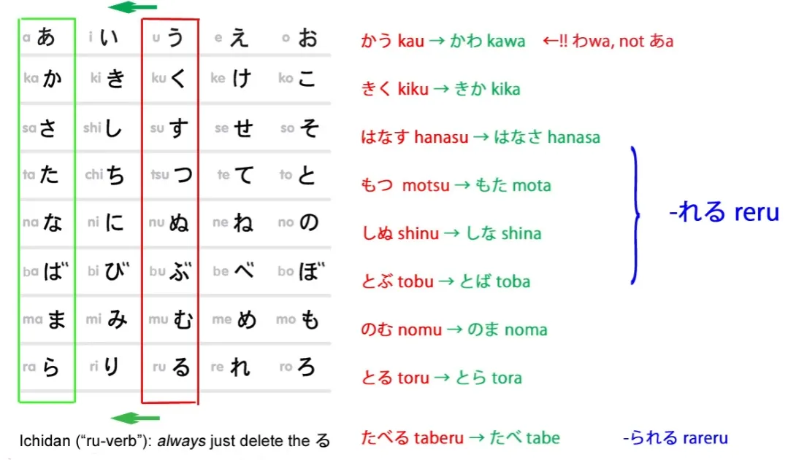
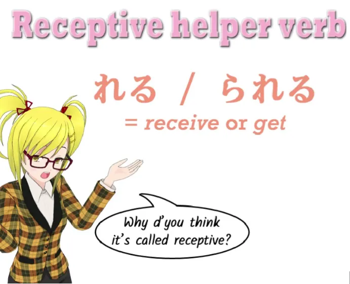
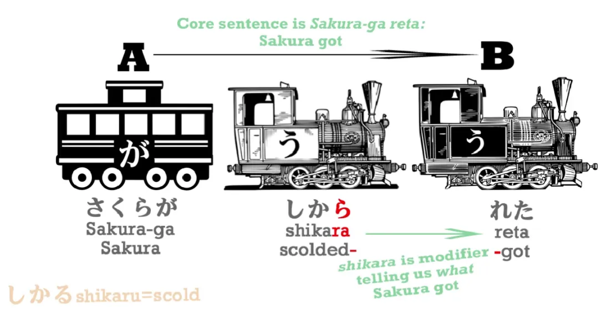
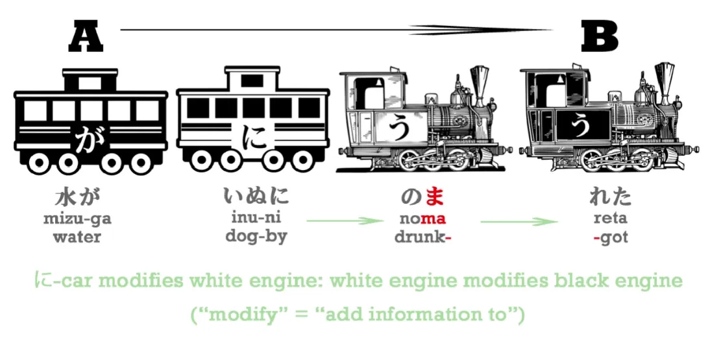
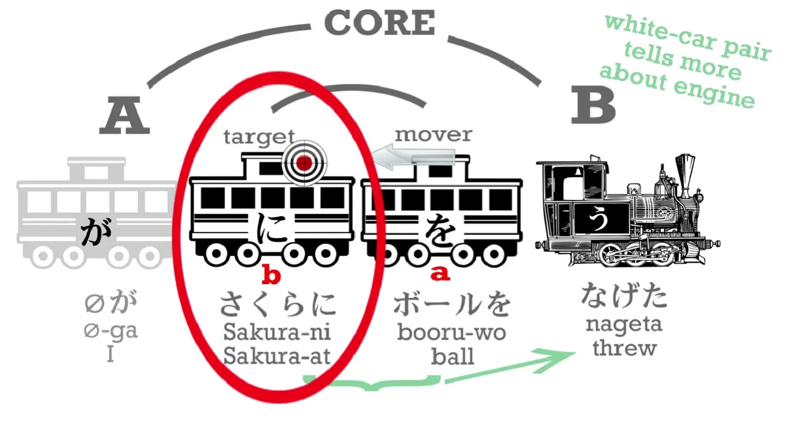
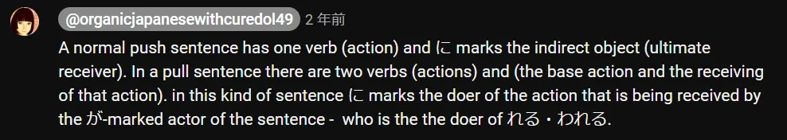
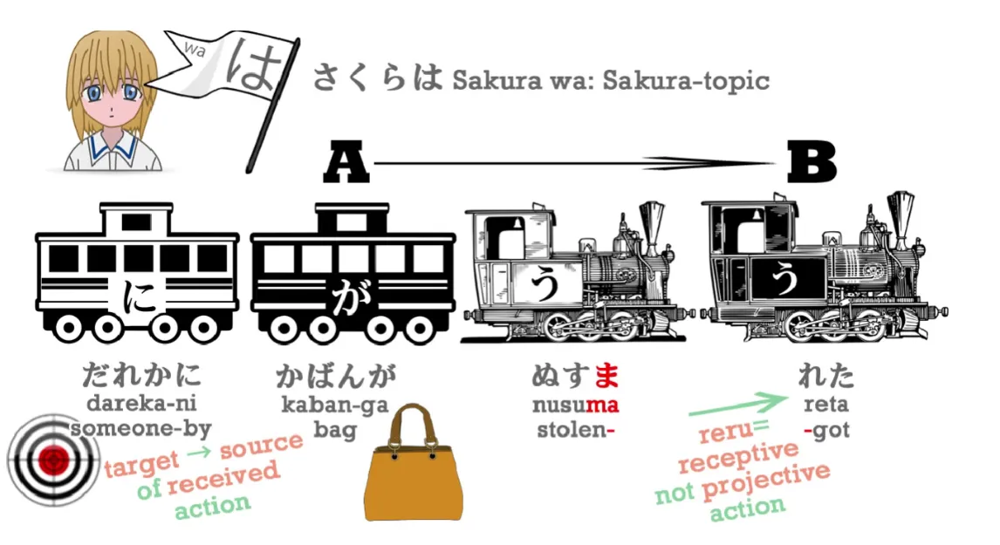
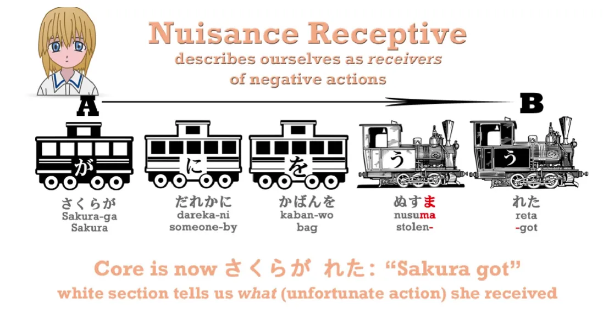

# **13. Пассивное спряжение / Вспомогательный глагол получения**

[**Урок 13: Разоблачение пассивного спряжения: НЕ пассив. НЕ спряжение. ЛЕГКО.**](https://www.youtube.com/watch?v=cvV6d-RETs8&list=PLg9uYxuZf8x_A-vcqqyOFZu06WlhnypWj&index=15)

こんにちは.

Сегодня мы поговорим о вспомогательном глаголе получения. В других источниках вы услышите, что его называют <code>пассивным спряжением</code>. Но, как мы уже знаем, в японском языке нет спряжений, поэтому это не может быть спряжением.

::: info
Опять же, Долли говорит это, чтобы облегчить понимание, но если углубляться в лингвистику, это можно оспорить. Я говорю это, чтобы показать, что существует МНОЖЕСТВО нюансов по мере углубления в язык, и вещи редко бывают простыми и прямолинейными, когда вы выходите за рамки основ, поэтому следует иметь это в виду. Если вы действительно любите читать, под этим видео есть ОЧЕНЬ длинное, [**интересное обсуждение**](https://www.youtube.com/watch?v=cvV6d-RETs8&lc=UgzXdC7vyB-XKN543tt4AaABAg) на эту тему.
:::

*Но в целом, нет чисто <code>правильного</code> или <code>неправильного</code>, есть только <code>более полезное</code> или <code>менее полезное</code> для конкретного человека.*

**Также, это не пассив.** Так что учебники промахнулись дважды. И это важно, потому что если мы думаем о вспомогательном глаголе получения как о пассивном спряжении, это полностью нарушает наше понимание структуры и, опять же, разбрасывает эти бедные частицы по всей комнате. А как мы знаем, частицы — это стержни, петли, на которых держится японский язык. Так что если мы испортим частицы, мы окажемся в глубокой беде. И именно поэтому так много людей считают японский язык трудным для понимания.

::: details Просто одна из моих сумбурных заметок о технических аспектах терминологии

Нет ничего плохого в том, чтобы называть это пассивом, просто нужно помнить, что это отличается от английского пассива. Долли использует термин <code>получающий</code>, и это её терминология, которую она использует, чтобы избежать путаницы в своей модели. В японском языке это называется 受身形 — пассивная форма, хотя Долли отталкивается от первого кандзи, который может означать «получать», поэтому я понимаю, почему она так делает, и это тоже хороший термин, если уж на то пошло.

В общих чертах можно сказать, что пассивная форма сама по себе включает функцию получения, поскольку она в основном используется для переноса функции Субъекта на Пациента (получателя) действия базового глагола (через れる) вместо Агента (исполнителя действия базового глагола), в то время как Агент обычно помечается частицей に в пассиве, хотя есть и другие детали, которые будут обсуждаться, поэтому подход Долли также полностью верен, но термин «пассив» тоже работает, на мой взгляд, хотя и требует более глубокой лингвистической базы.

Обратите внимание, что я говорю о различии между синтаксисом (Субъект) и семантикой (Пациент/Агент).

В грамматике вещи редко бывают <code>чёрно-белыми</code>, поэтому, если это работает для вас, это нормально, просто помните, что не следует рассматривать японский язык так, как будто это английский! Он просто использует разные слова для выражения одной и той же основной идеи, поэтому неважно, достаточно ли хорошо подход Долли работает для очень базового понимания грамматики, которое может быть полностью усвоено/скорректировано посредством большого количества языкового материала.

:::

## Вспомогательный глагол получения / Пассив

Итак, теперь, когда я упомянула <code>пассивное спряжение</code>, просто чтобы вы знали, о чём идёт речь, если встретите это в других контекстах, давайте полностью отбросим эти слова и назовём это тем, чем оно является: **вспомогательным глаголом получения.**

Итак, что такое вспомогательный глагол получения? **Это глагол, который присоединяется к あ-основе другого глагола, а あ-основа — это та же основа, которую мы используем для присоединения отрицательного вспомогательного い-прилагательного -ない**, не так ли? **Вспомогательный глагол получения — это 「れる・られる」: это れる для глаголов первого спряжения (godan), られる для глаголов второго спряжения (ichidan).**

Многие **паникуют, когда видят, что られる вспомогательного глагола получения для глаголов второго спряжения совпадает с られる вспомогательного глагола возможности для глаголов второго спряжения. Но паниковать не нужно.** Всё в полном порядке. В английском языке у нас тоже есть подобные вещи. Например, слова <code>to</code>, <code>two</code> и <code>too</code>. Все они произносятся одинаково и являются очень распространёнными словами, используемыми сотни раз каждый день. И как часто их путают? Совсем нечасто.

И **то же самое со вспомогательными глаголами возможности и получения. Они используются в совершенно разных ситуациях, и в реальном использовании их очень трудно спутать.** **А реальное использование — это то, что имеет значение.**

---

Итак, **что означает вспомогательный глагол получения? Он означает <code>получать</code> или <code>получить</code>.** **Получать что? Получать действие глагола, к которому он присоединён.**

Теперь, **большую часть времени я буду использовать слово <code>получить</code>, потому что оно очень чётко выражает то, что делает этот вспомогательный глагол.**

::: info
Чтобы было яснее, как Долли говорит [**в комментариях**](https://www.youtube.com/watch?v=cvV6d-RETs8&lc=Ugz9HsXgTvy6JpFnPfR4AaABAg.8s4VanZoq638s4aJUNzU_p):

*Итак, перевод <code>got</code> работает только тогда, когда английское <code>got</code> означает <code>получить (действие)</code>, а не когда оно означает <code>стать (состоянием)</code>. Или, чтобы упростить, вы можете использовать <code>got</code> для перевода れる/られる, но вы не всегда можете использовать れる/られる для перевода <code>got</code>.*
:::

Ваш старый учитель английского, возможно, скажет, что это не лучший способ выражать мысли, но это совершенно хороший способ выражать мысли как в английском, так и в японском, и именно так мы их выражаем. Понятно?

Итак, давайте возьмём простой пример: 「さくらがしかられた。」

**[叱]{しか}る означает <code>ругать</code> или <code>отчитывать</code>, а あ-основа — 叱ら, поэтому, когда мы добавляем к ней れる и ставим в прошедшее время, мы получаем [叱]{しか}られた.** **叱る — это <code>ругать</code>, 叱られる — это <code>получить выговор</code>, 叱られた — это <code>получила выговор</code>, то есть <code>Сакура получила выговор</code>.**

---

**Теперь, здесь есть важная вещь, которую нужно иметь в виду, а именно то, что мы иногда, когда вспомогательный глагол присоединён к другому глаголу, можем, как своего рода железнодорожная стенография, объединять эти две части в один глагол.**

Так мы можем сказать 「ほんがよめる」, и хотя よめる, которая является формой возможности от よむ, строго говоря, это よめ плюс る, мы можем объединить их вместе и рассматривать よめる как один локомотив. **Но мы не можем, и никогда не должны, делать это со вспомогательным глаголом получения. Почему нет? Потому что когда вспомогательный глагол получения присоединён к другому глаголу, действие первого глагола всегда совершается кем-то другим, отличным от действия второго глагола れる・られる.**

**Таким образом, в предложении с вспомогательным глаголом получения у нас всегда есть действие, которое совершается кем-то другим, кого мы можем знать или не знать, плюс реальное действие предложения, которое является れる・られる, то есть получение — принятие — этого действия.** И это фундаментальный момент, который нужно иметь в виду. Именно потому, что учебники не учитывают это и не держат эти два локомотива отдельно, возникает вся путаница и трудности с так называемым <code>пассивным спряжением</code>. **Главный глагол предложения с れる・られる — это всегда れる или られる, а не глагол, к которому он присоединён.**

---

Теперь, **давайте также заметим, что А-вагон, актор предложения, не обязательно является человеком.** Итак, если мы скажем 「**水**がのまれた」 ([飲]{の}む＝пить; のま＝ あ-основа от пить; れた＝ получил), мы говорим <code>**Вода** была выпита</code>. **И актор этого предложения — вода.**

Теперь, даже если мы добавим исполнителя действия: 「水がいぬにのまれた」,

**актором предложения по-прежнему является вода, а не собака, потому что именно вода была выпита, именно вода совершила действие получения. Собака совершила действие питья, но вода совершила действие получения.** **И то, что собака выпила воду, — это всё белый раздел, который модифицирует этот конечный главный глагол, <code>получить</code>.** <code>Вода была выпита собакой.</code>

Теперь, почему я помечаю собаку частицей に? Я вернусь к этому через мгновение.

Давайте возьмём более полное предложение, чтобы мы могли увидеть, как все частицы работают вместе в предложении с вспомогательным глаголом получения:

> さくらはだれかにかばんがぬすまれた。

([盗]{ぬ}すむ＝ красть; 盗ま＝ あ-основа от красть; 盗まれる＝ быть украденным; 盗まれた＝ был украден). **[誰]{だれ}か означает <code>кто-то</code>** (誰＝ кто, か＝ вопрос). Кто это был? Мы не знаем, никто конкретный, но кто-то. **誰か＝Кто-то**.

---

Итак, что здесь происходит? Кто является получателем действия? Это не Сакура, которая помечена частицей は. Это не кто-то, кто помечен частицей に. **Это <code>тот</code>, кто помечен частицей が, и это сумка. Сумка — это то, что получило это воровство, поэтому сумка является субъектом предложения. Сумка — это та, кто совершила れる, кто <code>получила</code>.**

А に... что она здесь делает? Ну, давайте вспомним, что に указывает на конечную цель действия (だれか). Итак, 「(zeroが)**さくらに**ボールをなげた。」 актор, помеченный が, — это я, объект действия — ボール, **а цель этого действия — Сакура**. *(Невоспринимающее использование に)*

**Теперь, такой вид に может использоваться только тогда, когда мы что-то проецируем, будь то бросание мяча, отправка письма, дарение подарка, одалживание книги. Мы должны проецировать что-то по направлению к цели.**

---

Теперь, **れる — это не глагол-проектор. Это глагол получения. Это не глагол-толчок, это глагол-притяжение.**

**Следовательно, цель этого глагола — это не то, на что вы проецируете; это то, от чего вы получаете.** **Таким образом, に выполняет ту же функцию по отношению к глаголу-притяжению, что и по отношению к глаголу-толчку, то есть конечная цель толчка, конечный источник притяжения.**

::: info
Это может быть полезно. Из комментариев, например, [**этого**](https://www.youtube.com/watch?v=cvV6d-RETs8&lc=UgycETdw-fOaAqbnzlp4AaABAg) под видео.
Моё понимание этого снова было бы слишком длинным, поэтому я не буду включать его сюда, оно здесь не нужно, так как я думаю, что Долли объяснила это достаточно ясно, и я не хочу добавлять сюда больше заголовков...*

:::

Итак, видите, все частицы делают именно то, что они всегда делают. Здесь ничего не меняется.

::: info
Ну, как показано выше, в пассиве/воспринимающем залоге они как бы меняют свою полярность. Отсюда и то, почему に — это не <code>к</code> — получатель/<code>цель</code>, как в активном залоге, а теперь <code>кем</code> — исполнитель действия, а が вместо этого является получателем базового действия (ぬすむ) через れる. Это особенно хорошо объясняется через семантические/тематические роли.*
:::

Если вы думаете об этом как о <code>пассивном спряжении</code>, все частицы исполняют странный танец и, кажется, делают что-то не то, что обычно, но если вы понимаете это так, как оно есть — вспомогательный глагол получения — то никаких проблем нет. И всё это имеет смысл, точно так же, как всегда имеет смысл японский язык, если вы знаете, что он на самом деле делает.

## Досадный вспомогательный глагол получения / Пассив, выражающий неприятность / 迷惑受け身

Теперь, есть ещё одна область, в которой вспомогательный глагол получения иногда сбивает людей с толку, и это так называемый <code>страдательный пассив</code> или <code>пассив неблагоприятных обстоятельств</code>, который на самом деле называется в японском языке [迷惑受け身]{めいわくうけみ}, что означает <code>досадный вспомогательный глагол получения</code>. И это именно то, чем он является. Это досадный вспомогательный глагол получения.

---

「さくらはだれかに**かばんが**ぬすまれた。」 означает <code>У Сакуры **сумка** была украдена кем-то</code> или, буквально, <code>Что касается Сакуры, **сумка** была украдена кем-то</code>.
::: info
Обычный вспомогательный глагол получения.
:::

::: warning
Обратите внимание на が перед глаголом, помеченным вспомогательным глаголом получения, вместо прямого дополнения を. Я рекомендую прочитать [**ЭТУ ЦЕПОЧКУ**](https://www.youtube.com/watch?v=cvV6d-RETs8&lc=UgwSvcxzsfJfg2FlFaB4AaABAg) о том, почему здесь が вместо を, если вы не уверены. Актор должен означать Субъект для Долли, но это всего лишь моё предположение, основанное на том, когда она его использует, поскольку она, похоже, не объясняет, что именно она под этим подразумевает; [**в одной из цепочек комментариев под этим видео**](https://www.youtube.com/watch?v=cvV6d-RETs8&lc=UgyjLIrKQJJ0zfRCXId4AaABAg.8wnXb0KQGCY8wtxK5KucCT&ab_channel=OrganicJapanesewithCureDolly) она даже называет に в воспринимающем залоге <code>вторичным актором</code> (что больше похоже на фактический лингвистический Актор… или Макророль Агента там), что не помогает.
:::

::: details ОЧЕНЬ необязательная <code>Пояснительная</code> Заметка и пример моего хронического сумбура (или что-то в этом роде, лол)

***Это просто один из моих обычных лингвистических сумбуров, которые на самом деле не имеют большого значения в общей схеме вещей и здесь для моего собственного лингвистического интереса (или для тех, кто хочет углубиться)***

***Я просто проверяю/практикую, как я понимаю вещи в общем смысле лингвистики.***

***МОИ ЗНАНИЯ ОЧЕНЬ ОГРАНИЧЕНЫ, ТАК ЧТО ЭТО ПРОСТО Я ЭКСПЕРИМЕНТИРУЮ С ГИПОТЕЗОЙ.***

***Я ОЧЕНЬ ХОРОШО ОСОЗНАЮ, ЧТО ТО, ЧТО Я ГОВОРЮ, МОЖЕТ БЫТЬ В КОРНЕ НЕВЕРНЫМ!***

***Долли, очевидно, не использует термины так строго, как я здесь, потому что это всего лишь базовая грамматика, поэтому в любом случае нет необходимости в этом, но ради этого я немного повеселюсь с лингвистикой :)***

***Грамматика сложна, поэтому мне ещё есть чему учиться и так далее, поэтому я также буду использовать это для исследований.***

*Если всё ещё неясно, по моему пониманию, это можно объяснить через семантические роли/тематические отношения.*

Имейте в виду, что синтаксис / синтаксический и семантика / семантический — это две разные области, и одна синтаксическая функция (Субъект и т. д.) может иметь несколько семантических ролей, особенно в терминах активного против пассивного/воспринимающего залога.

Это потому, что в пассиве/воспринимающем залоге かばん имеет СИНТАКСИЧЕСКУЮ функцию СУБЪЕКТА (отсюда и пометка が), НО имеет ту же СЕМАНТИЧЕСКУЮ функцию ПАЦИЕНТА — он получил действие (глаголов) кражи/быть украденным кем-то. В активном залоге かばん имеет СИНТАКСИЧЕСКУЮ функцию ПРЯМОГО ДОПОЛНЕНИЯ, но всё равно будет иметь СЕМАНТИЧЕСКУЮ функцию ПАЦИЕНТА.

Таким образом, если бы かばん был помечен を (Прямое дополнение — синтаксическая функция), он должен был бы быть в активном залоге (поскольку в пассиве мы склонны ставить прямое дополнение в качестве субъекта) ИЛИ, как будет показано ниже, он должен был бы быть в форме <code>Досадного вспомогательного глагола получения</code> как вторичное дополнение, связанное со вторичным глаголом, который добавляет <code>описательную</code> информацию о главной части.

**Термин Актор**, который использует Долли, ДОЛЖЕН означать то же, что и Агент, как сказано [****здесь****](https://linguistics.stackexchange.com/questions/20451/what-is-the-difference-between-actor-and-subject-in-systemic-functional-gram) и [****здесь****](https://english.stackexchange.com/a/569830) из того, что я нашла, но Долли, кажется, использует его здесь для Субъекта; в некотором смысле Актор должен подразумевать того, кто совершает действие главного глагола, поэтому я запуталась, что Актор означает для неё здесь, но, возможно, это так… в этом случае я понимаю, что Долли имеет в виду, хотя она, возможно, здесь объединяет синтаксические и семантические функции, иначе я неправильно поняла, что она подразумевает под Актором здесь, поскольку она, кажется, указывает на Субъект, который является СИНТАКСИЧЕСКИМ свойством, в то время как Актор (или, скорее, Агент) является СЕМАНТИЧЕСКИМ свойством, и в этом предложении, в комментарии она называет かばん <code>актором</code>, かばん должен быть Пациентом, а не <code>актором</code>, поскольку он получает действие, а не совершает действие главного глагола. То есть, если Актор действительно похож на Агента.

*Честно говоря, термин Актор я видела используемым лишь изредка, и он должен подразумевать семантическую функцию, НО его можно использовать для обозначения <code>Семантической Макророли</code> для Субъекта в активном залоге и для фразы с предлогом <code>by</code> в пассивном (в то время как Пациент является Прямым Дополнением в активном и Субъектом в пассивном, чья Макророль называется <code>Undergoer</code>), как указано [**здесь**](https://rrg.caset.buffalo.edu/rrg/vanvalin_papers/SemMRsRRG.pdf) в статье лингвиста Роберта Ван Валина…*[1] (страница 1 и 3), и это указывает на связь между семантикой и синтаксисом. Обычно используются Агент (или его подназвания), поэтому это меня сильно запутало, но из других уроков **Долли, кажется, иногда называет Субъект Актором и использует их взаимозаменяемо даже в пассиве/воспринимающем залоге, поэтому просто имейте в виду, что под Актором она подразумевает Субъект**, даже если это должно относиться к разным вещам в пассиве, согласно моим ЛИЧНЫМ исследованиям…

Более того, это, кажется, относится и к японскому языку, как, по-видимому, говорится в [**IMABI**](https://imabi.org/the-passive/) в уроке о пассиве, хотя там используется только термин Агент, в пассиве помечаемый に / によって.

В АКТИВНОМ залоге эти две СЕМАНТИЧЕСКИЕ функции обычно СИНТАКСИЧЕСКИ выражаются через Субъект (Агент) и Прямое Дополнение (Пациент), но они относятся к разным областям.

В пассиве/воспринимающем залоге Пациент вместо этого в основном помещается в СИНТАКСИЧЕСКУЮ роль Субъекта.

Их СЕМАНТИЧЕСКИЕ роли не меняются — Пациент и Агент остаются теми же словами, но их СИНТАКСИЧЕСКИЕ функции меняются, где Пациент теперь становится Субъектом, а Агент помещается во фразу с предлогом <code>by</code>, в данном случае во фразу, помеченную に. В пассиве/воспринимающем залоге есть 2 глагола — ぬすむ и れる, ぬすむ описывает れる здесь, れる работает как Предикат? (не слишком уверена здесь, но れる помечен как чёрный вагон, как が, а ぬすむ просто как белый) к かばん, который теперь является Субъектом.

Это, кажется, удивительно хорошо сочетается между английским и японским в базовых переходных / других глаголах движения, даже если мы не должны их сравнивать, НО они не идентичны, японский гораздо более свободен, распространён и логичен / ясен в этом отношении, чем английский, поэтому японский может использовать пассив / воспринимающий залог для вещей, которые английский не может.

*Извините, если это немного сложно, но если вы проверите, к чему относятся термины, и перечитаете, всё должно проясниться.

*Но есть особый случай пассива/воспринимающего залога в японском, который может помечать かばん как を, при этом оставаясь пассивным/воспринимающим предложением, это можно увидеть прямо ниже — Досадный вспомогательный глагол получения*

***Если вы заметите ЗДЕСЬ какую-либо неверную информацию, пожалуйста, дайте мне знать! Тем не менее, относитесь к этому с долей скептицизма.***

:::

### Пример досадного вспомогательного глагола получения

**Но мы также можем сказать** 「**さくらが**だれかにかばんをぬすまれた。」 **Это досадный вспомогательный глагол получения**.

Итак, что здесь происходит? **Актор, помеченный が, теперь Сакура, не так ли? Она та, кто совершает действие получения.**

::: info

:::

Итак, что означает это предложение в английском? Очень просто: <code>У **Сакуры** украли сумку</code>. Именно так мы говорим в английском; нашему старому учителю английского это может не понравиться, но мы так говорим в английском, это имеет смысл в английском, и это именно то, что мы говорим в японском. <code>У Сакуры украли сумку кем-то.</code>

Итак, вы видите, что на самом деле нет никаких проблем, никаких трудностей, никакой путаницы со вспомогательным глаголом получения, если только вы знаете, что это вспомогательный глагол получения, а не что-то другое.

::: info
Опять же, это, вероятно, будет ОЧЕНЬ трудно полностью понять, поэтому я также рекомендую прочитать комментарии под [**видео**](https://www.youtube.com/watch?v=cvV6d-RETs8&list=PLg9uYxuZf8x_A-vcqqyOFZu06WlhnypWj&index=15). Там довольно много (других) очень интересных ответов от Долли.
Не волнуйтесь, если сейчас это слишком сложно для полного понимания, вы полностью поймёте пассив/воспринимающий залог, когда будете много вводить и погружаться в японский язык, всё в конечном итоге прояснится само по себе по мере того, как вы будете потреблять больше информации. Это просто для того, чтобы дать базовое представление об этом через базовое объяснение Долли.*
:::